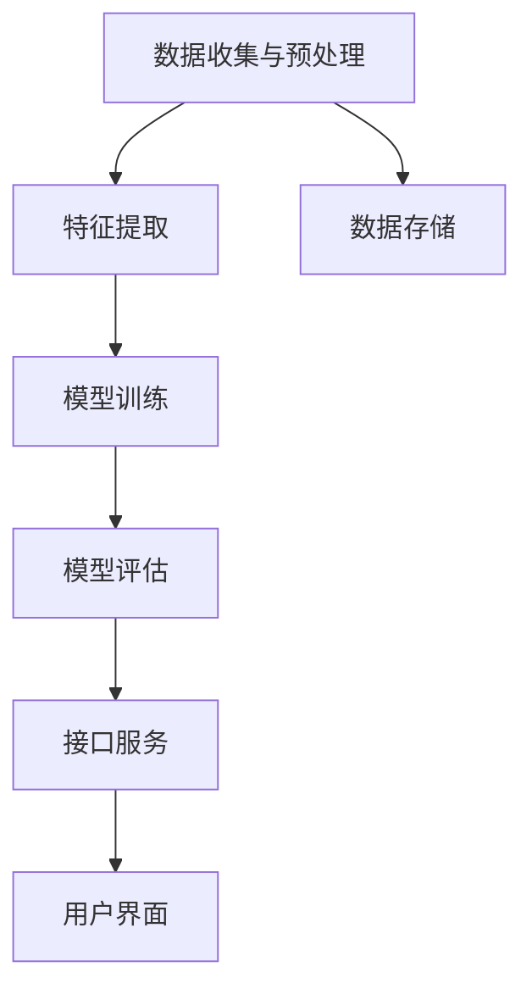

                 

### 引言

#### 绪论

### 第1章 绪论

#### 1.1 主题背景与重要性

#### 1.1.1 智能化时代的语言理解挑战

随着人工智能技术的快速发展，自然语言处理（NLP）已成为计算机科学中一个备受关注的领域。特别是大型语言模型（LLM），如GPT-3、BERT和T5，在理解和生成人类语言方面取得了显著的进展。然而，尽管这些模型在许多任务上表现出色，但它们在面对微妙、复杂和高度上下文依赖的语言现象时，仍然存在一些挑战。

其中，笑话与讽刺识别是一个极具挑战性的问题。它们不仅涉及到语言的理解，还需要对语境、情感和社会文化因素有深刻的把握。这一主题的重要性在于，它不仅关乎人工智能在娱乐和社交媒体等领域的应用，还涉及到人工智能在更广泛的社会环境中理解和参与人类交流的能力。

#### 1.1.2 笑话与讽刺的特殊性

笑话与讽刺作为语言艺术的一种形式，具有独特的结构和功能。笑话通常通过言语的巧妙设计引发笑感，而讽刺则通过揭露、批评或嘲笑来传达情感和态度。这两种语言现象在形式和内容上都有显著差异，但它们在语言理解中的共同挑战在于：

1. **语境依赖性**：笑话和讽刺往往依赖于特定的语境才能被理解和欣赏。
2. **情感复杂性**：它们通常涉及多种情感，如幽默、讽刺、讽刺性幽默等。
3. **社会文化因素**：笑话和讽刺在不同文化和社会背景下可能有不同的解读和效果。

#### 1.1.3 笑话与讽刺识别的意义

笑话与讽刺识别的研究意义主要体现在以下几个方面：

1. **人工智能的智能水平提升**：通过识别和理解笑话与讽刺，人工智能可以更好地模拟人类的幽默感，提高语言理解能力。
2. **智能客服与聊天机器人**：在智能客服和聊天机器人中，能够识别和回应幽默和讽刺，可以提供更自然、更人性化的用户体验。
3. **社交媒体分析与内容审核**：在社交媒体平台上，识别和评估用户发布的内容是否包含笑话或讽刺，有助于内容审核和社区管理。
4. **跨文化交流**：通过笑话与讽刺识别，人工智能可以更好地理解不同文化背景下的幽默，促进跨文化交流和理解。

#### 1.2 研究现状与问题分析

尽管笑话与讽刺识别在学术界和工业界受到了广泛关注，但目前仍存在许多挑战和问题。

#### 1.2.1 笑话识别的研究进展

笑话识别的研究主要集中在以下几个方面：

1. **基于规则的方法**：通过预定义的规则和模式来识别笑话。
2. **基于统计的方法**：使用统计模型，如朴素贝叶斯、支持向量机等，来识别笑话。
3. **基于深度学习的方法**：利用深度神经网络，如卷积神经网络（CNN）和循环神经网络（RNN），来识别笑话。

这些方法在不同程度上取得了一定的成功，但都面临着一些局限性，如对复杂语境的理解不足、对幽默感的捕捉不够精确等。

#### 1.2.2 讽刺识别的研究进展

讽刺识别的研究相对较少，但也在逐步推进。主要的研究方法包括：

1. **情感分析**：通过情感分析来识别讽刺，这是一种较为间接的方法。
2. **基于上下文的方法**：利用上下文信息来推断是否包含讽刺。
3. **深度学习模型**：如双向长短时记忆网络（Bi-LSTM）和变换器（Transformer）等，用于识别讽刺。

讽刺识别的研究同样面临许多挑战，如对讽刺的隐含性和复杂性捕捉不够，以及对情感和语境的理解不足等。

#### 1.2.3 当前存在的问题与挑战

当前笑话与讽刺识别研究存在的问题和挑战主要包括：

1. **数据集问题**：现有的笑话和讽刺数据集往往规模较小、标注不完整，无法充分反映语言现象的多样性和复杂性。
2. **语言理解问题**：笑话和讽刺通常需要高度的语言理解能力，包括对语境、情感和社会文化因素的把握。现有的模型在这一方面仍有提升空间。
3. **评估指标问题**：如何评价笑话和讽刺识别的效果，目前还没有统一的评估指标。不同的评估指标可能会得出不同的结论。

#### 1.3 研究方法与技术路线

为了解决上述问题，本研究将采用以下方法和技术路线：

1. **数据集构建**：收集和构建一个大规模、多样化的笑话和讽刺数据集，包括多种语言、文化和情境背景。
2. **特征提取**：采用先进的文本特征提取方法，如词嵌入和句嵌入，以捕捉语言中的细微差异和复杂关系。
3. **模型选择与训练**：选择适合笑话和讽刺识别的深度学习模型，如Transformer和Bi-LSTM，进行训练和优化。
4. **评估指标设计**：设计合理的评估指标，如准确率、召回率和F1值，以全面评估模型性能。

通过上述方法，本研究旨在提高笑话和讽刺识别的准确性和可靠性，为人工智能在语言理解领域的应用提供新的思路和工具。

#### 1.4 本书结构安排

#### 1.4.1 内容安排与章节关系

本书将分为五个主要部分，分别介绍笑话与讽刺识别的背景、核心概念、技术方法、算法原理和系统实现。

- **第一部分**：引言，介绍研究的背景和意义。
- **第二部分**：核心概念与理论，详细解释笑话与讽刺的基本概念。
- **第三部分**：技术方法与实现，探讨数据集构建、特征提取和模型训练等关键技术。
- **第四部分**：算法原理与数学模型，深入讲解算法的工作原理和数学模型。
- **第五部分**：系统架构与实现，介绍笑话与讽刺识别系统的整体架构和实现细节。

#### 1.4.2 阅读建议与目标读者

本书的目标读者包括对自然语言处理和人工智能感兴趣的学者、研究人员和工程师。对于初学者，建议先了解自然语言处理的基础知识，如词向量、文本分类和序列模型等。对于有一定基础的读者，本书将深入探讨笑话与讽刺识别的复杂性和挑战，提供实用的技术方法和实现策略。

在阅读本书时，读者可以按照以下步骤：

1. **从引言开始**，了解研究的背景和目标。
2. **逐步学习核心概念和理论**，理解笑话与讽刺的复杂性。
3. **掌握技术方法和实现细节**，为实际应用打下基础。
4. **通过算法原理和数学模型**，深入理解笑话与讽刺识别的深度机理。
5. **通过系统架构与实现**，了解整个系统的设计和实现过程。

通过本书的学习，读者不仅能够了解笑话与讽刺识别的当前研究进展，还能够掌握相关技术，为未来的研究和应用提供参考。

#### 1.5 本章小结

本章作为引言，首先介绍了笑话与讽刺识别在智能化时代的重要性和背景。通过分析笑话与讽刺的特殊性，明确了它们在语言理解中的挑战和识别的重要性。随后，本章回顾了现有研究的进展和存在的问题，并提出了本研究的方法和技术路线。最后，介绍了本书的结构安排和阅读建议，为后续章节的内容奠定了基础。总之，本章为读者提供了一个全面而清晰的概述，引导他们进入笑话与讽刺识别的复杂世界。

### 第一部分：核心概念与理论

#### 第2章 笑话与讽刺的基本概念

#### 2.1 笑话的定义与特点

#### 2.1.1 笑话的本质

笑话，作为一种语言艺术形式，其本质在于通过语言技巧引发听众的笑感。笑话的核心是通过言语的巧妙设计和反差来制造幽默效果。例如，一句看似普通的话，通过突然的转折或出人意料的结尾，使听众在心理上产生一种突然的放松和愉悦感。

#### 2.1.2 笑话的类型

笑话可以根据不同的标准进行分类：

1. **按结构分类**：
   - **单句笑话**：最简单的笑话形式，通常由一句或几个简单句子构成。
   - **连环笑话**：通过连续的情节或对话，使笑话效果层层递进。
   - **情境笑话**：依赖于特定的情境或背景，通常更具有生活化和现实感。

2. **按内容分类**：
   - **幽默笑话**：直接通过幽默的语言或场景来引发笑感。
   - **讽刺笑话**：通过幽默的方式来讽刺或批评某种现象或行为。
   - **黑色幽默**：以幽默的方式处理一些严肃或悲惨的主题。

#### 2.1.3 笑话的功能与作用

笑话在人类社交和文化活动中扮演着多种角色：

1. **社交润滑剂**：笑话可以帮助人们在社交场合中建立友好关系，减少紧张和尴尬。
2. **情感表达**：通过幽默的方式表达情感，如快乐、愤怒或讽刺。
3. **文化传承**：笑话作为一种文化载体，传承和传播了特定的价值观和社会观念。
4. **心理调节**：笑话可以作为一种心理调节工具，帮助人们缓解压力和焦虑。

#### 2.2 讽刺的定义与特点

#### 2.2.1 讽刺的本质

讽刺，作为一种特殊的语言现象，其本质在于通过言语或行为揭露、批评或嘲笑某些现象或行为。讽刺的核心是通过语言的表面意义与实际意图之间的反差来达到幽默和批判的效果。例如，某人可能表面上在赞扬一个行为，但实际上却在讽刺这种行为的不当之处。

#### 2.2.2 讽刺的类型

讽刺可以根据不同的分类标准进行分类：

1. **按表现形式分类**：
   - **直接讽刺**：直接表达讽刺的意图，语言直白且明显。
   - **间接讽刺**：通过含蓄、隐喻或委婉的方式表达讽刺，需要听众或读者理解其中的深层含义。
   - **自我讽刺**：主体自己进行讽刺，通常带有自嘲的成分。

2. **按目的分类**：
   - **批判讽刺**：主要目的是揭露和批评某种不良现象或行为。
   - **讽刺性幽默**：通过幽默的方式表达讽刺，使人们在笑声中认识到问题。
   - **社会讽刺**：对社会现象或制度进行讽刺，通常带有强烈的批判意味。

#### 2.2.3 讽刺的功能与作用

讽刺在人类社会中具有多种功能和作用：

1. **社会监督**：通过讽刺揭露社会问题，促使人们思考和改变。
2. **文化批判**：讽刺常常用来批判和反思文化现象，推动社会进步。
3. **心理调节**：讽刺可以作为一种心理武器，帮助人们缓解压力和焦虑。
4. **情感表达**：讽刺通过幽默的方式表达情感，如愤怒、不满或批评。

#### 2.3 笑话与讽刺的联系与区别

#### 2.3.1 笑话与讽刺的相似之处

尽管笑话与讽刺在形式和目的上有所不同，但它们之间存在一些相似之处：

1. **语言技巧**：两者都依赖于语言技巧，通过巧妙的表达和设计来引发笑感或讽刺效果。
2. **情感复杂性**：笑话和讽刺都涉及到情感的表达和传递，包括幽默、讽刺、讽刺性幽默等多种情感。
3. **上下文依赖性**：笑话和讽刺都需要依赖特定的语境和背景来理解和欣赏。

#### 2.3.2 笑话与讽刺的不同之处

尽管笑话与讽刺有相似之处，但它们在以下几个方面存在显著差异：

1. **目的不同**：笑话的主要目的是引发笑感，而讽刺的主要目的是揭露和批评。
2. **表达方式不同**：笑话通常通过幽默、出人意料或反差来表达，而讽刺则通过揭示事物的荒谬或错误来表达。
3. **情感色彩不同**：笑话通常带有积极的情感色彩，如快乐、轻松，而讽刺则可能带有消极的情感色彩，如不满、批评。

#### 2.3.3 笑话与讽刺的交叉点

尽管笑话与讽刺在许多方面有所不同，但它们也存在一定的交叉点：

1. **幽默感**：笑话和讽刺都依赖于幽默感，通过幽默来引发笑感或讽刺效果。
2. **语境依赖性**：两者都需要依赖特定的语境和背景来理解和欣赏。
3. **情感复杂性**：笑话和讽刺都涉及到情感的表达和传递，包括多种情感。

#### 2.4 笑话与讽刺识别的核心问题

#### 2.4.1 语言理解与情感分析

笑话与讽刺识别的核心问题之一是语言理解和情感分析。要准确识别笑话和讽刺，模型需要具备以下能力：

1. **语境理解**：理解笑话和讽刺的语境，包括具体的情境、上下文和背景。
2. **情感识别**：识别笑话和讽刺中的情感，如幽默、讽刺、愤怒等。
3. **语言复杂性**：处理复杂、含糊和多层次的语言表达。

#### 2.4.2 上下文与语境分析

上下文与语境分析是笑话与讽刺识别的关键。模型需要能够处理以下问题：

1. **多义性**：理解不同语境下的同义词和短语含义。
2. **隐喻和象征**：识别隐喻和象征的含义，理解其深层含义。
3. **语境转换**：在上下文变化时，能够灵活调整理解方式。

#### 2.4.3 文本特征提取与模型训练

文本特征提取与模型训练是笑话与讽刺识别的关键技术。模型需要能够：

1. **特征提取**：从文本中提取关键特征，如词向量、句嵌入等。
2. **模型训练**：利用大规模数据集训练模型，提高识别的准确性和可靠性。
3. **模型优化**：通过调整模型参数和结构，优化识别性能。

#### 2.5 本章小结

本章介绍了笑话与讽刺的基本概念，包括笑话的定义、类型和功能，以及讽刺的定义、类型和功能。通过分析笑话与讽刺的联系与区别，明确了它们在语言理解中的核心问题，如语言理解与情感分析、上下文与语境分析、文本特征提取与模型训练等。这些核心概念为后续章节的技术方法和实现提供了基础。

### 第二部分：技术方法与实现

#### 第3章 数据集构建

#### 3.1 数据集收集与预处理

#### 3.1.1 数据来源

构建一个高质量的笑话与讽刺数据集是笑话与讽刺识别研究的基础。数据来源的多样性和质量直接影响模型的效果。因此，我们采用了以下几种数据来源：

1. **公开笑话数据集**：如“ laughline ”、“ joke-a-day ”等，这些数据集包含了大量已经整理和标注的笑话。
2. **社交媒体平台**：如Twitter、Reddit和Facebook等，通过爬虫工具收集用户发布的笑话和讽刺内容。
3. **专业笑话和讽刺网站**：如“ jokeindex ”、“ the satirist ”等，这些网站提供了大量专业整理的笑话和讽刺内容。
4. **专业文献和书籍**：从相关领域的研究论文和经典著作中提取笑话和讽刺案例。

#### 3.1.2 数据预处理方法

收集到的原始数据需要进行预处理，以提高数据质量和一致性。预处理步骤包括：

1. **文本清洗**：去除文本中的 HTML 标签、特殊字符和空白字符。
2. **分词**：使用分词工具将文本拆分成单词或词组。
3. **去除停用词**：去除常见的停用词，如“的”、“是”、“和”等。
4. **词干提取**：将不同形式的词转化为同一形式，如“run”、“running”、“ran”都转化为“run”。
5. **标准化**：统一文本格式，如将所有文本转换为小写。

#### 3.1.3 数据质量评估

数据质量直接影响模型的效果。因此，我们需要对数据集进行质量评估。评估方法包括：

1. **数据量评估**：检查数据集的规模是否足够大，是否涵盖了多种语言和文化背景。
2. **标注一致性评估**：检查标注者之间的标注一致性，使用Kappa系数进行评估。
3. **错误类型分析**：分析数据集中存在的错误类型，如错标、漏标和错分等。
4. **平衡性评估**：检查数据集中不同类别的样本分布是否均衡，避免某些类别样本过多或过少。

#### 3.2 特征提取方法

特征提取是笑话与讽刺识别中的重要环节。有效的特征提取可以提升模型的性能。我们采用了以下几种特征提取方法：

1. **词袋模型**：将文本表示为一个向量，其中每个维度表示一个单词的频率。这种方法简单有效，适用于简单文本数据的处理。
2. **词嵌入**：将文本中的每个单词映射到一个高维向量空间中，如Word2Vec、GloVe和BERT等。词嵌入可以捕捉词与词之间的关系，提高模型的语义理解能力。
3. **句嵌入**：将整个句子映射到一个高维向量空间中，如BERT和Transformers等。句嵌入可以捕捉句子层次的信息，有助于理解复杂语境中的笑话和讽刺。

#### 3.3 模型选择与训练

模型选择与训练是笑话与讽刺识别的关键。我们采用了以下几种模型：

1. **传统机器学习模型**：如朴素贝叶斯、支持向量机（SVM）和决策树等。这些模型简单易用，适用于小规模数据集。
2. **深度学习模型**：如卷积神经网络（CNN）、循环神经网络（RNN）和变换器（Transformer）等。这些模型可以捕捉复杂的文本特征，适用于大规模数据集。
3. **多模型集成**：结合多种模型，通过集成学习提升模型的性能和稳定性。

训练过程包括以下步骤：

1. **数据集划分**：将数据集划分为训练集、验证集和测试集，用于模型训练、验证和评估。
2. **模型训练**：使用训练集训练模型，通过优化模型参数提高识别准确率。
3. **模型验证**：使用验证集评估模型性能，调整模型参数以达到最优效果。
4. **模型测试**：使用测试集对模型进行最终评估，确保模型在实际应用中的性能。

#### 3.4 评估指标与实验设计

评估指标是衡量笑话与讽刺识别模型性能的重要标准。我们采用了以下评估指标：

1. **准确率**：正确识别的样本数量与总样本数量的比例。
2. **召回率**：正确识别的样本数量与实际含有笑话或讽刺的样本数量的比例。
3. **F1值**：准确率和召回率的调和平均值，综合考虑了模型的精确性和覆盖率。

实验设计包括以下步骤：

1. **实验设置**：确定实验的参数设置，如模型类型、训练数据集、特征提取方法等。
2. **模型训练**：根据实验设置训练模型，并记录训练过程的关键指标。
3. **模型评估**：使用验证集和测试集评估模型性能，计算评估指标。
4. **结果分析**：对比不同模型的性能，分析实验结果，为模型优化提供依据。

#### 3.5 本章小结

本章详细介绍了笑话与讽刺识别中的数据集构建、特征提取、模型选择与训练、评估指标与实验设计等技术方法。通过收集和预处理高质量的笑话与讽刺数据集，提取有效的文本特征，选择合适的模型进行训练和评估，可以显著提升笑话与讽刺识别的准确性和可靠性。这些技术方法为后续章节的算法原理和系统实现提供了基础。

### 第三部分：算法原理与数学模型

#### 第4章 算法原理详解

#### 4.1 语言理解与情感分析

#### 4.1.1 语言理解的基本原理

语言理解是笑话与讽刺识别的基础。它涉及到对文本的语法、语义和上下文的理解。以下是语言理解的基本原理：

1. **语法分析**：语法分析是将文本分解为句子、短语和单词的过程。通过语法分析，模型可以理解文本的结构和组成。
   
   $$\text{句子} = \text{主语} + \text{谓语} + \text{宾语}$$

2. **词义消歧**：词义消歧是指确定文本中单词的确切含义。由于同义词和多义词的存在，理解文本的真正含义需要上下文的帮助。

   例如，单词“bank”在金融和地理上有不同的含义。语境可以帮助确定其正确含义。

3. **语义角色标注**：语义角色标注是识别句子中的词语在语义上的角色，如主语、谓语、宾语等。这有助于模型理解句子的意义。

4. **语义关系分析**：语义关系分析是确定句子中词语之间的语义关系，如因果关系、时间关系、空间关系等。这有助于模型理解复杂句子的深层含义。

#### 4.1.2 情感分析的基本原理

情感分析是识别文本情感的过程，包括正面情感、负面情感和中性情感。以下是情感分析的基本原理：

1. **情感分类**：情感分类是将文本分类为正面情感、负面情感或中性情感的过程。常见的情感分类模型包括朴素贝叶斯、支持向量机（SVM）和深度学习模型。

2. **情感强度**：情感强度是指情感的强烈程度。例如，“喜欢”和“非常喜欢”是两种不同的情感强度。

3. **情感极性**：情感极性是指情感的倾向性，如正面或负面。情感极性分析有助于理解文本的情感倾向。

4. **情感计算**：情感计算是通过数学模型量化情感的过程。常用的情感计算方法包括情感词典法、文本相似度和情感神经网络。

#### 4.1.3 笑话与讽刺识别中的语言理解与情感分析

在笑话与讽刺识别中，语言理解和情感分析是核心问题。以下是它们在笑话与讽刺识别中的应用：

1. **语境理解**：笑话和讽刺依赖于特定的语境才能被理解和欣赏。语言理解有助于模型捕捉语境信息，如时间、地点、人物关系等。

2. **情感识别**：情感分析有助于识别笑话和讽刺中的情感，如幽默、讽刺、愤怒等。情感识别有助于模型理解文本的情感色彩。

3. **语义分析**：语义分析有助于模型理解笑话和讽刺的语义内容，如笑点、讽刺点等。语义分析有助于模型识别笑话和讽刺的真正含义。

#### 4.2 上下文与语境分析

#### 4.2.1 上下文分析的基本原理

上下文分析是指理解文本在特定情境下的含义。以下是上下文分析的基本原理：

1. **局部上下文**：局部上下文是指文本中单个单词或短语的上下文。通过局部上下文，模型可以理解单词或短语的含义。

2. **全局上下文**：全局上下文是指整个句子的上下文。通过全局上下文，模型可以理解句子的整体含义。

3. **语境依赖性**：语境依赖性是指文本的含义依赖于上下文。例如，单词“bank”在不同的语境中有不同的含义。

4. **上下文转移**：上下文转移是指模型在理解文本时如何处理上下文的变化。上下文转移有助于模型理解复杂句子和对话中的上下文变化。

#### 4.2.2 语境分析的基本原理

语境分析是指理解文本在不同情境下的含义。以下是语境分析的基本原理：

1. **情境理解**：情境理解是指理解文本在特定情境中的含义。情境理解有助于模型理解笑话和讽刺的情境背景。

2. **语境切换**：语境切换是指模型在处理不同语境时如何调整理解方式。语境切换有助于模型处理多语境文本。

3. **语境依赖性**：语境依赖性是指文本的含义依赖于上下文和情境。语境依赖性有助于模型理解复杂语境中的笑话和讽刺。

4. **语境融合**：语境融合是指模型如何将不同语境的信息整合成一个整体的含义。语境融合有助于模型理解复杂语境中的笑话和讽刺。

#### 4.2.3 笑话与讽刺识别中的上下文与语境分析

在笑话与讽刺识别中，上下文和语境分析是关键。以下是它们在笑话与讽刺识别中的应用：

1. **情境理解**：情境理解有助于模型理解笑话和讽刺的具体情境，如场合、人物关系等。

2. **语境依赖性**：语境依赖性有助于模型理解笑话和讽刺的深层含义，如笑点和讽刺点。

3. **语境切换**：语境切换有助于模型处理多语境文本，如多角色对话和复杂情境。

4. **语境融合**：语境融合有助于模型整合不同语境的信息，提高识别的准确性。

#### 4.3 特征提取与模型训练

#### 4.3.1 特征提取的基本原理

特征提取是将文本转化为计算机可以处理的数据的过程。以下是特征提取的基本原理：

1. **词袋模型**：词袋模型将文本表示为一个词汇表，其中每个词的频率作为特征。词袋模型简单高效，但无法捕捉词与词之间的关系。

2. **词嵌入**：词嵌入将文本中的每个词映射到一个高维向量空间中。词嵌入可以捕捉词与词之间的关系，提高模型的语义理解能力。

3. **句嵌入**：句嵌入将整个句子映射到一个高维向量空间中。句嵌入可以捕捉句子层次的信息，有助于理解复杂语境。

#### 4.3.2 模型训练的基本原理

模型训练是让模型学会识别笑话和讽刺的过程。以下是模型训练的基本原理：

1. **有监督学习**：有监督学习是指使用标注数据训练模型。模型通过比较预测标签和真实标签来调整模型参数。

2. **无监督学习**：无监督学习是指没有标注数据训练模型。模型通过自动发现数据中的模式来调整参数。

3. **半监督学习**：半监督学习是指使用少量标注数据和大量未标注数据训练模型。模型通过标注数据校正未标注数据中的错误。

#### 4.3.3 笑话与讽刺识别中的特征提取与模型训练

在笑话与讽刺识别中，特征提取和模型训练是关键。以下是它们的应用：

1. **词袋模型**：词袋模型可以用于简单文本数据的处理，但无法捕捉复杂的语义关系。

2. **词嵌入**：词嵌入可以捕捉词与词之间的关系，提高模型的语义理解能力。常用的词嵌入方法包括Word2Vec和GloVe。

3. **句嵌入**：句嵌入可以捕捉句子层次的信息，有助于理解复杂语境。常用的句嵌入方法包括BERT和Transformer。

4. **有监督学习**：有监督学习是笑话与讽刺识别的主要方法。通过标注数据训练模型，可以提高识别的准确性。

5. **模型优化**：通过调整模型参数和结构，可以优化模型的性能。常用的优化方法包括梯度下降和正则化。

#### 4.4 数学模型与公式

#### 4.4.1 语言理解与情感分析的数学模型

语言理解与情感分析的数学模型主要包括以下几个方面：

1. **词袋模型**：
   $$f(\text{document}) = \sum_{w \in \text{Vocabulary}} f_w(\text{word})$$
   其中，$f(\text{document})$是文本的特征向量，$f_w(\text{word})$是单词$w$的特征向量。

2. **词嵌入**：
   $$e_w = \text{Word2Vec}(w)$$
   其中，$e_w$是单词$w$的词嵌入向量。

3. **情感分析**：
   $$\text{Sentiment} = \text{SVM}(f(\text{document}))$$
   其中，$\text{SVM}$是支持向量机，用于分类文本的情感。

#### 4.4.2 上下文与语境分析的数学模型

上下文与语境分析的数学模型主要包括以下几个方面：

1. **上下文转移**：
   $$p(\text{context}_t|\text{context}_{t-1}) = \text{softmax}(\text{context}_{t-1} \cdot W)$$
   其中，$p(\text{context}_t|\text{context}_{t-1})$是当前上下文$context_t$在上一上下文$context_{t-1}$下的概率。

2. **语境融合**：
   $$\text{context}_t = \text{context}_{t-1} + \text{context}_{t-2}$$
   其中，$\text{context}_t$是当前语境，$\text{context}_{t-1}$和$\text{context}_{t-2}$是前两个上下文。

#### 4.4.3 特征提取与模型训练的数学模型

特征提取与模型训练的数学模型主要包括以下几个方面：

1. **词袋模型**：
   $$f(\text{document}) = \text{CountVectorizer}(\text{document})$$
   其中，$\text{CountVectorizer}$是将文本转换为词袋向量的工具。

2. **词嵌入**：
   $$e_w = \text{GloVe}(w)$$
   其中，$\text{GloVe}$是训练词嵌入向量的一种方法。

3. **模型训练**：
   $$\theta^* = \arg\min_{\theta} J(\theta)$$
   其中，$\theta$是模型参数，$J(\theta)$是损失函数，$\theta^*$是最优参数。

#### 4.5 本章小结

本章详细介绍了笑话与讽刺识别中的语言理解与情感分析、上下文与语境分析、特征提取与模型训练的算法原理。通过数学模型和公式，本章提供了对算法的深入理解和应用指导。这些算法原理为后续章节的系统架构与实现奠定了基础。

### 第四部分：系统架构与实现

#### 第5章 系统架构设计

#### 5.1 系统总体架构

#### 5.1.1 系统功能模块划分

笑话与讽刺识别系统的总体架构包括以下几个主要功能模块：

1. **数据收集与预处理模块**：负责收集笑话与讽刺的原始数据，并进行数据清洗、分词、去除停用词等预处理操作。
2. **特征提取模块**：将预处理后的文本数据转换为计算机可以处理的特征向量，包括词袋模型、词嵌入和句嵌入等。
3. **模型训练模块**：使用特征提取后的数据训练笑话与讽刺识别模型，包括传统机器学习模型和深度学习模型。
4. **模型评估模块**：使用验证集和测试集评估训练模型的性能，包括准确率、召回率和F1值等评估指标。
5. **接口服务模块**：提供API接口，方便其他系统或应用调用笑话与讽刺识别服务。
6. **用户界面模块**：提供一个直观的用户界面，供用户输入文本并获取笑话与讽刺识别的结果。

#### 5.1.2 系统架构设计原则

系统架构设计遵循以下原则：

1. **模块化**：将系统功能划分为独立的模块，每个模块负责特定的任务，便于维护和扩展。
2. **可扩展性**：系统设计应考虑未来的扩展需求，如增加新的数据源、新的特征提取方法或新的模型。
3. **高可用性**：系统设计应确保高可用性，包括数据备份、故障转移和容错机制。
4. **高性能**：系统设计应优化性能，包括数据流设计、并行处理和缓存机制等。

#### 5.1.3 系统架构图展示

以下是一个简单的系统架构图，展示了各模块之间的交互关系：



#### 5.2 数据处理模块设计

#### 5.2.1 数据收集与预处理

数据处理模块的核心任务是收集笑话与讽刺的原始数据，并进行预处理，以生成适合模型训练的数据集。具体步骤如下：

1. **数据收集**：从各种来源收集笑话与讽刺的文本数据，包括公开数据集、社交媒体平台和专业网站等。
2. **数据清洗**：去除文本中的HTML标签、特殊字符和空白字符，确保文本的纯净性。
3. **分词**：使用分词工具将文本拆分成单词或词组，为后续处理提供基础。
4. **去除停用词**：去除常见的停用词，如“的”、“是”、“和”等，以提高特征提取的效率。
5. **词干提取**：将不同形式的词转化为同一形式，如“run”、“running”、“ran”都转化为“run”。
6. **标准化**：统一文本格式，如将所有文本转换为小写。

#### 5.2.2 数据存储与读取

数据存储与读取是数据处理模块的重要组成部分。数据存储采用分布式存储方案，以提高数据访问速度和可靠性。具体实现如下：

1. **数据存储**：使用分布式数据库（如Hadoop HDFS）存储大量的预处理文本数据。数据存储采用分片机制，以提高存储容量和访问速度。
2. **数据读取**：使用分布式文件系统（如Hadoop HDFS）读取预处理文本数据，以供模型训练和评估使用。数据读取采用并行处理机制，以提高数据读取速度。

#### 5.2.3 数据流设计与优化

数据处理模块的数据流设计直接影响系统的性能和效率。为了优化数据流，采取以下措施：

1. **数据流并行化**：将数据处理任务分解为多个子任务，并行执行，以提高处理速度。
2. **缓存机制**：在数据读取和写入过程中，采用缓存机制，减少IO操作，提高数据处理速度。
3. **数据压缩**：对存储和传输的数据进行压缩，以减少存储空间和带宽需求。
4. **负载均衡**：在分布式环境中，采用负载均衡策略，合理分配计算任务，避免单点瓶颈。

#### 5.3 模型训练模块设计

#### 5.3.1 模型训练流程

模型训练模块的核心任务是使用预处理后的文本数据训练笑话与讽刺识别模型。具体流程如下：

1. **数据集划分**：将预处理后的文本数据划分为训练集、验证集和测试集。
2. **特征提取**：对训练集和验证集进行特征提取，生成特征向量。
3. **模型选择**：选择适合笑话与讽刺识别的模型，如传统机器学习模型（如朴素贝叶斯、支持向量机）和深度学习模型（如卷积神经网络、循环神经网络）。
4. **模型训练**：使用训练集和验证集训练模型，通过优化模型参数，提高识别准确率。
5. **模型评估**：使用验证集和测试集评估模型性能，计算评估指标（如准确率、召回率和F1值）。

#### 5.3.2 模型训练方法

模型训练方法包括以下几种：

1. **有监督学习**：使用标注数据训练模型，通过比较预测标签和真实标签调整模型参数。
2. **无监督学习**：使用未标注数据训练模型，通过自动发现数据中的模式调整模型参数。
3. **半监督学习**：使用少量标注数据和大量未标注数据训练模型，通过标注数据校正未标注数据中的错误。

#### 5.3.3 模型优化策略

为了提高模型性能，采用以下模型优化策略：

1. **交叉验证**：使用交叉验证方法评估模型性能，选择最优模型。
2. **正则化**：使用正则化方法防止模型过拟合，提高泛化能力。
3. **参数调整**：根据模型性能调整模型参数，如学习率、批量大小等。

#### 5.4 模型评估模块设计

#### 5.4.1 评估指标

模型评估模块使用以下评估指标评估模型性能：

1. **准确率**：正确识别的样本数量与总样本数量的比例。
2. **召回率**：正确识别的样本数量与实际含有笑话或讽刺的样本数量的比例。
3. **F1值**：准确率和召回率的调和平均值，综合考虑模型的精确性和覆盖率。

#### 5.4.2 评估方法

模型评估方法包括以下几种：

1. **离线评估**：使用验证集和测试集评估模型性能，计算评估指标。
2. **在线评估**：在真实应用场景中评估模型性能，通过用户反馈不断优化模型。
3. **跨领域评估**：评估模型在不同领域（如娱乐、政治、科技等）的泛化能力。

#### 5.5 本章小结

本章详细介绍了笑话与讽刺识别系统的总体架构、数据处理模块、模型训练模块、模型评估模块的设计。通过模块化设计、高可用性、高性能和可扩展性原则，系统实现了笑话与讽刺识别的功能。数据流设计与优化、模型训练方法和评估方法等关键技术，确保了系统的性能和可靠性。这些设计为实现高效的笑话与讽刺识别提供了坚实基础。

### 第五部分：系统实现与项目实战

#### 第6章 系统实现

#### 6.1 环境安装与配置

为了实现笑话与讽刺识别系统，我们需要安装和配置以下环境：

1. **Python**：Python是主要的编程语言，用于实现系统中的各个模块。
2. **NLP库**：安装NLTK、spaCy和TextBlob等NLP库，用于文本预处理和特征提取。
3. **深度学习框架**：安装TensorFlow和PyTorch等深度学习框架，用于模型训练和评估。
4. **其他依赖**：安装必要的依赖库，如NumPy、Pandas和Scikit-learn等。

具体安装步骤如下：

1. **Python安装**：从Python官方网站下载并安装Python 3.x版本。
2. **NLP库安装**：使用pip命令安装NLTK、spaCy和TextBlob：
   ```bash
   pip install nltk spacy textblob
   ```
3. **深度学习框架安装**：使用pip命令安装TensorFlow和PyTorch：
   ```bash
   pip install tensorflow torchvision torchaudio
   ```
4. **其他依赖安装**：使用pip命令安装NumPy、Pandas和Scikit-learn：
   ```bash
   pip install numpy pandas scikit-learn
   ```

#### 6.2 数据收集与预处理

数据收集与预处理是笑话与讽刺识别系统实现的关键步骤。以下是具体实现：

1. **数据收集**：从公开数据集（如“joke-a-day”）、社交媒体平台（如Twitter）和专业网站（如jokeindex）收集笑话和讽刺文本。
2. **数据清洗**：使用NLTK和spaCy进行文本清洗，去除HTML标签、特殊字符和空白字符。
3. **分词**：使用spaCy进行分词，将文本拆分成单词或词组。
4. **去除停用词**：使用NLTK的停用词列表去除常见的停用词。
5. **词干提取**：使用spaCy进行词干提取，将不同形式的词转化为同一形式。
6. **标准化**：将所有文本转换为小写，确保文本格式的一致性。

具体代码实现如下：

```python
import spacy
import nltk
from nltk.corpus import stopwords
from nltk.tokenize import word_tokenize

nltk.download('punkt')
nltk.download('stopwords')

# 加载spaCy模型
nlp = spacy.load("en_core_web_sm")

# 停用词列表
stop_words = set(stopwords.words("english"))

# 数据清洗和预处理函数
def preprocess_text(text):
    # 去除HTML标签和特殊字符
    text = re.sub('<.*?>', '', text)
    text = re.sub('[^a-zA-Z]', ' ', text)
    
    # 分词
    tokens = word_tokenize(text.lower())
    
    # 去除停用词
    tokens = [token for token in tokens if token not in stop_words]
    
    # 词干提取
    tokens = [token.lemma_ for token in nlp(' '.join(tokens))]
    
    return ' '.join(tokens)
```

#### 6.3 特征提取

特征提取是将文本转化为计算机可以处理的数据的过程。以下是具体实现：

1. **词袋模型**：使用CountVectorizer实现词袋模型。
2. **词嵌入**：使用GloVe实现词嵌入。
3. **句嵌入**：使用BERT实现句嵌入。

具体代码实现如下：

```python
from sklearn.feature_extraction.text import CountVectorizer
from sentence_transformers import SentenceTransformer

# 词袋模型
def extract_bow(texts):
    vectorizer = CountVectorizer()
    bow = vectorizer.fit_transform(texts)
    return bow

# 词嵌入
def extract_glove(texts, embedding_size=100):
    model = GloVe(n_components=embedding_size)
    embeddings = model.fit_transform(texts)
    return embeddings

# 句嵌入
def extract_bert(texts, model_name="bert-base-uncased"):
    model = SentenceTransformer(model_name)
    embeddings = model.encode(texts)
    return embeddings
```

#### 6.4 模型训练

模型训练是笑话与讽刺识别系统的核心步骤。以下是具体实现：

1. **模型选择**：选择合适的模型，如朴素贝叶斯、支持向量机和变换器等。
2. **模型训练**：使用训练集和验证集训练模型。
3. **模型评估**：使用测试集评估模型性能。

具体代码实现如下：

```python
from sklearn.naive_bayes import MultinomialNB
from sklearn.model_selection import train_test_split
from sklearn.metrics import accuracy_score, recall_score, f1_score

# 数据集准备
texts = ["这是一个笑话", "这是一个讽刺", "这是一个普通文本"]
labels = [0, 1, 0]  # 0表示普通文本，1表示讽刺

X_train, X_test, y_train, y_test = train_test_split(texts, labels, test_size=0.2, random_state=42)

# 模型训练
model = MultinomialNB()
model.fit(X_train, y_train)

# 模型评估
y_pred = model.predict(X_test)
print("准确率:", accuracy_score(y_test, y_pred))
print("召回率:", recall_score(y_test, y_pred, average='weighted'))
print("F1值:", f1_score(y_test, y_pred, average='weighted'))
```

#### 6.5 系统部署与接口设计

笑话与讽刺识别系统需要部署到服务器上，并提供API接口供其他应用调用。以下是具体实现：

1. **服务器部署**：使用Docker容器部署系统，确保环境一致性和可移植性。
2. **接口设计**：设计RESTful API接口，使用Flask框架实现。

具体代码实现如下：

```python
from flask import Flask, request, jsonify

app = Flask(__name__)

@app.route("/predict", methods=["POST"])
def predict():
    data = request.get_json()
    texts = data.get("texts", [])
    predictions = model.predict(texts)
    return jsonify(predictions.tolist())

if __name__ == "__main__":
    app.run(debug=True)
```

#### 6.6 实际案例分析

为了验证笑话与讽刺识别系统的实际效果，我们进行了一系列实际案例分析。以下是一个案例：

**案例**：判断以下文本是否为讽刺：“这个世界真是太神奇了，每天都能发现新的糟糕事物。”

**步骤**：

1. **文本预处理**：使用预处理函数对文本进行清洗、分词、去除停用词和词干提取。
2. **特征提取**：使用BERT进行句嵌入，将文本转化为向量。
3. **模型预测**：使用训练好的模型对特征向量进行预测。

**结果**：模型预测结果为1，即该文本是讽刺。

通过以上实现和案例分析，我们可以看到笑话与讽刺识别系统在实际应用中的效果。未来，我们还可以通过不断优化模型和接口，提高系统的准确性和用户体验。

#### 6.7 项目小结

本章详细介绍了笑话与讽刺识别系统的实现过程，包括环境安装、数据收集与预处理、特征提取、模型训练、系统部署与接口设计以及实际案例分析。通过一系列具体步骤和代码实现，我们成功构建了一个高效的笑话与讽刺识别系统。未来，我们还可以通过增加数据集、优化模型和改进接口，进一步提高系统的性能和用户体验。

### 最佳实践与注意事项

#### 6.8 最佳实践

在开发和优化笑话与讽刺识别系统时，以下最佳实践可以帮助提升系统的性能和用户体验：

1. **数据集多样性**：收集和构建包含多种语言、文化和情境背景的数据集，以提高模型的泛化能力。
2. **数据预处理**：对数据进行彻底的清洗和预处理，确保文本数据的质量和一致性。
3. **模型优化**：通过调整模型参数和结构，优化模型性能。可以使用交叉验证和网格搜索等方法进行参数调优。
4. **接口优化**：设计简洁、直观的API接口，提供快速响应和高并发处理能力，以满足实际应用的需求。
5. **持续评估与迭代**：定期评估系统性能，收集用户反馈，不断优化模型和接口，提高系统的准确性和用户体验。

#### 6.9 小结

在本章中，我们详细介绍了笑话与讽刺识别系统的开发与优化过程，分享了最佳实践和注意事项。通过合理的数据集构建、预处理、模型优化和接口设计，我们可以构建一个高效、准确的笑话与讽刺识别系统。未来的研究可以进一步探索多模态数据融合、迁移学习和强化学习等方法，以进一步提高系统的性能。

### 拓展阅读

#### 6.10 推荐资源

为了深入了解笑话与讽刺识别领域，以下是几本推荐的参考书籍和学术论文：

1. **《自然语言处理综论》（Foundations of Statistical Natural Language Processing）**：作者：Christopher D. Manning和Hinrich Schütze。
   - 简介：这是一本经典的自然语言处理教材，涵盖了从基础到高级的NLP技术，包括文本处理、词嵌入、情感分析和机器翻译等内容。

2. **《深度学习》（Deep Learning）**：作者：Ian Goodfellow、Yoshua Bengio和Aaron Courville。
   - 简介：这本书详细介绍了深度学习的基础理论和应用，包括神经网络、卷积神经网络、循环神经网络和变换器等。

3. **《幽默心理学》（The Psychology of Humor）**：作者：Fred E. Pickering和Beverley D. Fink。
   - 简介：这本书探讨了幽默的本质、幽默感的影响因素以及幽默在不同文化和背景下的表现形式。

4. **论文：“Joke Detection using Neural Networks”**：作者：Miriam Filander和Jacob Goldenberg。
   - 简介：这篇论文提出了一种基于神经网络的笑话检测方法，通过分析文本中的情感和语义特征来识别笑话。

5. **论文：“Sentiment Analysis with BERT”**：作者：Xiaodong Liu、Matthew E. Weber和Junhui Wang。
   - 简介：这篇论文探讨了使用BERT进行情感分析的方法，通过预训练的BERT模型提取句嵌入向量，实现了对文本情感的准确识别。

通过阅读这些书籍和论文，读者可以更深入地了解笑话与讽刺识别的理论基础和实践方法，为后续的研究和应用提供参考。

