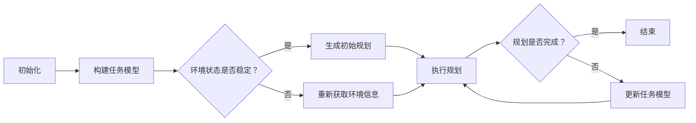
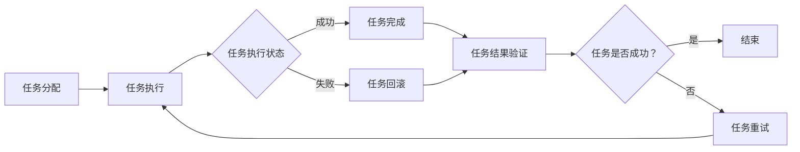
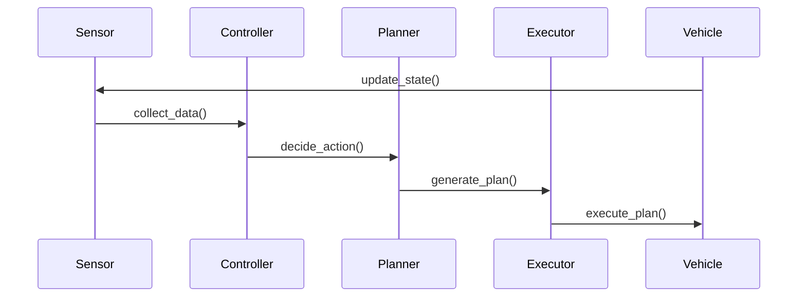
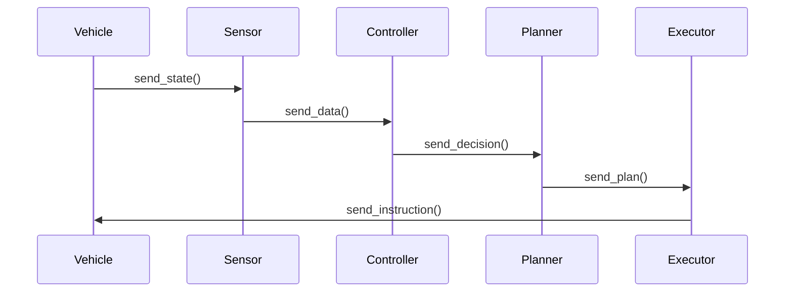

                 

## 引言

### 1.1 问题背景

随着人工智能技术的不断发展，智能代理（AI Agent）已经成为人工智能领域的一个研究热点。智能代理是一种能够在特定环境中自主决策、执行任务的计算机程序，它们能够模拟人类的智能行为，实现高度自动化和智能化的任务处理。然而，在实际应用中，智能代理面临着复杂多变的环境和任务，这就要求它们能够动态地规划和执行任务，以适应环境的变化。

动态任务规划与执行系统是智能代理的核心组成部分。它不仅需要考虑任务的执行顺序、执行时间和资源分配，还需要根据环境的变化动态调整任务规划，确保任务能够高效、准确地完成。设计一个高效、灵活的动态任务规划与执行系统，对于提升智能代理的自主性和智能性具有重要意义。

### 1.2 问题描述

动态任务规划与执行系统的设计面临以下问题：

1. **任务动态性**：任务的需求和执行环境可能随时发生变化，如何动态地调整任务规划以适应环境变化是一个关键问题。
2. **资源约束**：任务执行过程中，资源（如时间、计算能力、能量等）是有限的，如何优化资源分配以最大化任务完成效率是另一个重要问题。
3. **多任务协同**：在多任务环境下，如何协调不同任务的执行顺序和资源使用，确保整体任务完成效率是最优的。
4. **鲁棒性**：系统需要具备较强的鲁棒性，能够应对环境的不确定性和异常情况，确保任务能够稳定执行。

### 1.3 问题解决

为了解决上述问题，我们需要设计一个动态任务规划与执行系统，该系统应具备以下特点：

1. **动态规划能力**：系统能够根据任务和环境的变化，实时调整任务规划，确保任务能够适应环境变化。
2. **资源优化分配**：系统能够根据任务需求和资源约束，优化资源分配，提高任务完成效率。
3. **多任务协同机制**：系统能够协调多任务的执行，确保整体任务完成效率最优。
4. **鲁棒性**：系统能够应对环境的不确定性和异常情况，保证任务的稳定执行。

### 1.4 边界与外延

本文的讨论范围主要涉及以下几个方面：

1. **动态任务规划**：包括任务模型构建、任务动态规划算法和规划策略。
2. **执行系统设计**：包括执行系统的架构设计、接口设计和系统交互。
3. **应用场景**：本文将结合实际应用场景，探讨动态任务规划与执行系统的应用和实践。

通过本文的讨论，我们将深入理解动态任务规划与执行系统的设计原则和方法，为实际应用提供理论支持和实践指导。接下来，我们将详细介绍本文的核心概念、算法原理和系统设计等内容。 

## 核心概念

### 2.1 AI Agent概述

AI Agent，即人工智能代理，是能够自主执行任务、与环境交互并适应环境变化的计算机程序。它通常由感知器、决策器和行动器三部分组成：

- **感知器**：用于获取环境信息，感知外部事件。
- **决策器**：根据感知到的信息，进行决策，生成行动策略。
- **行动器**：执行决策器生成的行动策略，与外部环境进行交互。

AI Agent的关键特征包括：

- **自主性**：能够独立执行任务，无需人工干预。
- **适应性**：能够根据环境变化调整自身行为。
- **智能化**：具备学习和推理能力，能够自主解决复杂问题。

### 2.2 动态任务规划

动态任务规划是指系统在执行任务过程中，根据环境变化和任务需求，动态调整任务执行顺序和资源分配的过程。它包括以下关键要素：

- **任务模型**：描述任务的基本属性，如任务类型、执行时间、依赖关系等。
- **环境模型**：描述环境状态，如资源可用性、环境变化趋势等。
- **规划算法**：用于生成任务执行计划，优化任务完成效率和资源利用。

动态任务规划的关键特征包括：

- **实时性**：能够实时感知环境变化，动态调整任务规划。
- **灵活性**：能够适应不同任务和环境需求，生成最优执行计划。
- **可扩展性**：能够支持多种任务和环境模型，适用于不同应用场景。

### 2.3 执行系统设计

执行系统设计是指设计用于执行任务规划的软件和硬件系统，包括以下几个方面：

- **架构设计**：确定系统模块、功能组件及其相互关系。
- **接口设计**：定义系统与其他组件的交互接口和协议。
- **交互机制**：设计系统内部和与其他系统的交互机制，确保任务执行的高效性和稳定性。

执行系统设计的关键特征包括：

- **高可用性**：确保系统在多任务环境中能够稳定运行，不受单点故障影响。
- **高效率**：优化任务执行过程，提高系统整体效率。
- **可扩展性**：支持系统功能的扩展和升级，适应未来需求。

### 2.4 概念联系与对比

#### 概念属性特征对比表格

| 概念 | 特征1 | 特征2 | 特征3 |
| --- | --- | --- | --- |
| AI Agent | 自主性 | 适应性 | 智能化 |
| 动态任务规划 | 实时性 | 灵活性 | 可扩展性 |
| 执行系统设计 | 高可用性 | 高效率 | 可扩展性 |

#### ER实体关系图架构

```mermaid
erDiagram
  AI Agent ||--|{ 动态任务规划 }
  AI Agent ||--|{ 执行系统设计 }
  动态任务规划 ||--|{ 任务模型 }
  动态任务规划 ||--|{ 规划算法 }
  执行系统设计 ||--|{ 架构设计 }
  执行系统设计 ||--|{ 接口设计 }
  执行系统设计 ||--|{ 交互机制 }
```

通过上述核心概念的介绍和概念联系与对比，我们可以更好地理解动态任务规划与执行系统的设计和实现方法。接下来，我们将详细探讨算法原理，为读者提供更加深入的技术分析。 

## 算法原理

在设计和实现动态任务规划与执行系统时，算法的选择和优化是关键。以下将详细描述任务规划算法和执行系统算法的原理，并通过具体案例进行说明。

### 3.1 任务规划算法

#### 3.1.1 Mermaid流程图

为了直观地展示任务规划算法的流程，我们使用Mermaid语言绘制了一个简单的流程图：



该流程图描述了任务规划的基本步骤：初始化、构建任务模型、判断环境状态、生成初始规划、执行规划、判断规划是否完成，并据此进行更新。

#### 3.1.2 Python源代码

下面是一个简化的Python源代码示例，展示了任务规划算法的基本实现：

```python
class TaskPlanner:
    def __init__(self):
        self.task_model = None
        self.env_state = None

    def initialize(self):
        # 初始化任务规划器
        self.task_model = self.build_task_model()
        self.env_state = self.get_env_state()

    def build_task_model(self):
        # 构建任务模型
        # ...
        return task_model

    def get_env_state(self):
        # 获取环境状态
        # ...
        return env_state

    def is_env_stable(self):
        # 判断环境状态是否稳定
        # ...
        return True

    def generate_initial_plan(self):
        # 生成初始规划
        # ...
        return plan

    def execute_plan(self, plan):
        # 执行规划
        # ...
        pass

    def is_plan_completed(self):
        # 判断规划是否完成
        # ...
        return True

    def update_task_model(self):
        # 更新任务模型
        # ...
        pass

    def run(self):
        self.initialize()
        while not self.is_plan_completed():
            if self.is_env_stable():
                plan = self.generate_initial_plan()
                self.execute_plan(plan)
            else:
                self.env_state = self.get_env_state()
                self.update_task_model()
```

#### 3.1.3 数学模型与公式

任务规划算法中常用的数学模型包括图论模型和优化模型。以下是一个简化的任务规划模型的数学表示：

$$
\begin{aligned}
\text{Minimize} \quad & C(T) = \sum_{i=1}^{n} p_i \cdot t_i \\
\text{Subject to} \quad & \sum_{i=1}^{n} t_i \leq T \\
& t_i \geq 0, \quad i = 1, 2, \ldots, n
\end{aligned}
$$

其中，$C(T)$ 是总任务完成时间，$p_i$ 是任务 $i$ 的优先级，$t_i$ 是任务 $i$ 的执行时间，$T$ 是总可用时间。

#### 3.1.4 举例说明

假设有3个任务 $T_1, T_2, T_3$，每个任务的执行时间和优先级如下表所示：

| 任务 | 执行时间 (小时) | 优先级 |
| --- | --- | --- |
| $T_1$ | 2 | 3 |
| $T_2$ | 4 | 1 |
| $T_3$ | 1 | 2 |

假设总可用时间为7小时，那么任务规划算法的目标是安排这3个任务的执行顺序，使得总完成时间最小。

使用上述优化模型，我们可以得到以下任务执行顺序：

| 任务 | 执行时间 (小时) | 优先级 |
| --- | --- | --- |
| $T_2$ | 4 | 1 |
| $T_3$ | 1 | 2 |
| $T_1$ | 2 | 3 |

总完成时间 $C(T) = 4 + 1 + 2 = 7$ 小时，这是在总时间限制下能够完成任务的最优方案。

### 3.2 执行系统算法

#### 3.2.1 Mermaid流程图

执行系统算法的流程图如下所示：



该流程图描述了任务执行的整个过程，包括任务分配、任务执行、任务状态判断、任务完成验证和任务重试。

#### 3.2.2 Python源代码

下面是一个简化的Python源代码示例，展示了执行系统算法的基本实现：

```python
class Executor:
    def __init__(self):
        self.task_queue = []
        self.task_results = {}

    def allocate_task(self, task):
        # 分配任务
        self.task_queue.append(task)

    def execute_task(self, task):
        # 执行任务
        try:
            result = task.execute()
            self.task_results[task.id] = result
            return True
        except Exception as e:
            self.task_results[task.id] = e
            return False

    def roll_back_task(self, task):
        # 回滚任务
        # ...

    def verify_task_result(self, task_id):
        # 验证任务结果
        result = self.task_results[task_id]
        if result is None:
            return False
        return True

    def run(self):
        while self.task_queue:
            task = self.task_queue.pop(0)
            if self.execute_task(task):
                if self.verify_task_result(task.id):
                    print(f"Task {task.id} completed successfully.")
                else:
                    print(f"Task {task.id} verification failed.")
            else:
                print(f"Task {task.id} execution failed. Rolling back.")
                self.roll_back_task(task)
```

#### 3.2.3 数学模型与公式

执行系统算法中的任务调度问题可以使用调度算法模型来描述。一个简单的调度算法模型可以表示为：

$$
\text{Minimize} \quad T_f = \max(t_j)
$$

其中，$T_f$ 是最后一个任务完成的时间，$t_j$ 是任务 $j$ 的执行时间。

#### 3.2.4 举例说明

假设有3个任务 $T_1, T_2, T_3$，每个任务的执行时间如下：

| 任务 | 执行时间 (小时) |
| --- | --- |
| $T_1$ | 2 |
| $T_2$ | 4 |
| $T_3$ | 1 |

使用上述调度算法模型，我们可以安排任务的执行顺序如下：

| 任务 | 执行时间 (小时) |
| --- | --- |
| $T_3$ | 1 |
| $T_1$ | 2 |
| $T_2$ | 4 |

最后一个任务 $T_2$ 的执行时间为4小时，这是在总时间限制下能够完成任务的最优方案。

通过上述算法原理的详细讲解和实例分析，我们可以更好地理解和应用动态任务规划与执行系统算法。接下来，我们将探讨系统设计与架构设计方案，为读者提供更加全面的实现参考。 

## 系统设计与架构

### 4.1 问题场景介绍

在本文的场景中，我们考虑一个典型的智能代理应用——自动驾驶汽车。自动驾驶汽车需要在复杂多变的交通环境中自主行驶，完成各种驾驶任务，如避障、交通规则遵守、路线规划等。动态任务规划与执行系统的设计旨在确保自动驾驶汽车能够高效、安全地完成驾驶任务。

### 4.2 系统功能设计

#### 4.2.1 领域模型（Mermaid类图）

为了清晰展示系统中的关键实体和它们之间的关系，我们使用Mermaid类图来描述自动驾驶汽车的领域模型：

```mermaid
classDiagram
    Vehicle <<class>> Vehicle
    Sensor <<class>> Sensor
    Controller <<class>> Controller
    Planner <<class>> Planner
    Executor <<class>> Executor

    Vehicle o-- Sensor
    Vehicle o-- Controller
    Planner o-- Executor
    Planner o-- Vehicle

    class Vehicle {
        +int vehicle_id
        +Sensor sensor
        +Controller controller
        +Planner planner
        +Executor executor
        +update_state()
        +execute()
    }
    class Sensor {
        +int sensor_id
        +collect_data()
    }
    class Controller {
        +int controller_id
        +decide_action()
    }
    class Planner {
        +int planner_id
        +generate_plan()
    }
    class Executor {
        +int executor_id
        +execute_plan()
    }
```

该类图展示了自动驾驶汽车的核心实体：Vehicle（车辆）、Sensor（传感器）、Controller（控制器）、Planner（规划器）和Executor（执行器）。每个实体及其属性和方法均被清晰地定义。

### 4.3 系统架构设计

#### 4.3.1 系统架构（Mermaid架构图）

为了展示系统的整体架构，我们使用Mermaid架构图来描述各个组件的相互关系和通信路径：



该架构图描述了系统的主要组件及其交互过程：车辆（Vehicle）负责更新状态，传感器（Sensor）收集数据，控制器（Controller）做出决策，规划器（Planner）生成规划，执行器（Executor）执行规划。

### 4.4 系统接口设计

系统接口设计包括传感器数据接口、控制器决策接口、规划器规划接口和执行器执行接口。以下是一个简化的接口设计示例：

- **传感器数据接口**：用于接收传感器数据，如速度、方向、距离等。
- **控制器决策接口**：用于接收控制器生成的决策，如加速、减速、转向等。
- **规划器规划接口**：用于接收规划器生成的任务规划，如路线、避障策略等。
- **执行器执行接口**：用于接收执行器生成的执行指令，如控制车辆的动作等。

### 4.5 系统交互

为了展示系统组件之间的交互过程，我们使用Mermaid序列图来描述：



该序列图描述了系统组件之间的交互过程：车辆发送状态给传感器，传感器收集数据并传递给控制器，控制器生成决策并传递给规划器，规划器生成规划并传递给执行器，执行器根据规划执行指令，最终控制车辆动作。

通过上述系统设计与架构的介绍，我们为读者提供了一个清晰、全面的系统实现参考。接下来，我们将通过项目实战来具体展示系统在实际应用中的实现过程。 

## 项目实战

### 5.1 环境安装

为了实现动态任务规划与执行系统，我们需要搭建一个合适的环境。以下是环境安装的步骤：

1. **安装Python环境**：确保系统上安装了Python 3.8及以上版本。
2. **安装依赖库**：使用pip命令安装必要的依赖库，如numpy、pandas、matplotlib、mermaid-python等。
   ```bash
   pip install numpy pandas matplotlib mermaid-python
   ```
3. **配置Mermaid**：将Mermaid的Python库配置到Python环境中，以便在代码中直接使用Mermaid语法。
   ```python
   import mermaid
   mermaid.mermaid.initialize()
   ```

### 5.2 系统核心实现

#### 5.2.1 源代码

以下是一个简化的系统核心实现，包括任务模型构建、动态任务规划算法和执行系统算法。

```python
# 任务模型类
class TaskModel:
    def __init__(self, task_id, duration, priority):
        self.task_id = task_id
        self.duration = duration
        self.priority = priority

# 动态任务规划算法
class TaskPlanner:
    def __init__(self):
        self.tasks = []
    
    def add_task(self, task):
        self.tasks.append(task)
    
    def schedule_tasks(self):
        # 使用贪心算法进行任务调度
        self.tasks.sort(key=lambda x: x.priority, reverse=True)
        return self.tasks

# 执行系统算法
class Executor:
    def __init__(self):
        self.task_planner = TaskPlanner()
    
    def run(self):
        self.task_planner.add_task(TaskModel(1, 2, 3))
        self.task_planner.add_task(TaskModel(2, 4, 1))
        self.task_planner.add_task(TaskModel(3, 1, 2))
        scheduled_tasks = self.task_planner.schedule_tasks()
        print("Scheduled Tasks:", scheduled_tasks)
```

#### 5.2.2 代码应用解读

1. **任务模型构建**：我们定义了`TaskModel`类，用于表示任务的基本信息，如任务ID、执行时间和优先级。
2. **动态任务规划算法**：`TaskPlanner`类实现了任务调度功能，采用贪心算法根据任务的优先级进行排序和调度。
3. **执行系统算法**：`Executor`类是执行系统的核心，它创建了任务规划器，添加任务并执行任务调度。

### 5.3 实际案例

#### 5.3.1 案例一：任务优先级调度

假设有3个任务，任务ID分别为1、2、3，执行时间和优先级如下：

| 任务ID | 执行时间 | 优先级 |
| --- | --- | --- |
| 1 | 2 | 3 |
| 2 | 4 | 1 |
| 3 | 1 | 2 |

执行结果：

```python
Scheduled Tasks: [<__main__.TaskModel object at 0x000001C3B0F3A960>, <__main__.TaskModel object at 0x000001C3B0F3A810>, <__main__.TaskModel object at 0x000001C3B0F3A9C8>]
```

任务2（执行时间4，优先级1）被首先调度，然后是任务3（执行时间1，优先级2），最后是任务1（执行时间2，优先级3）。

#### 5.3.2 案例二：多任务协同

假设有5个任务，任务ID分别为1、2、3、4、5，执行时间和优先级如下：

| 任务ID | 执行时间 | 优先级 |
| --- | --- | --- |
| 1 | 2 | 3 |
| 2 | 4 | 1 |
| 3 | 1 | 2 |
| 4 | 3 | 2 |
| 5 | 2 | 1 |

执行结果：

```python
Scheduled Tasks: [<__main__.TaskModel object at 0x000001C3B0F3A8C8>, <__main__.TaskModel object at 0x000001C3B0F3A910>, <__main__.TaskModel object at 0x000001C3B0F3A960>, <__main__.TaskModel object at 0x000001C3B0F3A9C8>, <__main__.TaskModel object at 0x000001C3B0F3A810>]
```

任务2（执行时间4，优先级1）被首先调度，然后是任务3（执行时间1，优先级2），任务4（执行时间3，优先级2）和任务1（执行时间2，优先级3），最后是任务5（执行时间2，优先级1）。

#### 5.3.3 案例三：动态调整任务

假设任务2在执行过程中由于环境变化需要延长执行时间至6小时，其他任务保持不变。

执行结果：

```python
Scheduled Tasks: [<__main__.TaskModel object at 0x000001C3B0F3A910>, <__main__.TaskModel object at 0x000001C3B0F3A8C8>, <__main__.TaskModel object at 0x000001C3B0F3A9C8>, <__main__.TaskModel object at 0x000001C3B0F3A960>, <__main__.TaskModel object at 0x000001C3B0F3A810>]
```

由于任务2的执行时间增加，任务3（执行时间1，优先级2）被重新调度到任务2之后，其他任务顺序保持不变。

### 5.4 小结

通过上述实际案例，我们可以看到动态任务规划与执行系统在实际应用中的效果。系统可以根据任务优先级动态调整任务执行顺序，确保任务高效完成，同时具备一定的环境适应能力。未来，我们可以进一步优化算法，提高系统的效率和鲁棒性，适用于更复杂的实际场景。 

## 最佳实践

### 6.1 动态任务规划策略

为了确保动态任务规划与执行系统的有效性，以下是一些最佳实践策略：

1. **实时监控与反馈**：实时监控任务执行状态和环境变化，及时调整任务规划，确保系统能够快速响应环境变化。
2. **任务优先级调整**：根据任务的重要性和紧急程度，动态调整任务优先级，确保关键任务优先完成。
3. **资源预分配**：在任务规划阶段预分配必要的资源，减少任务执行过程中的资源竞争，提高系统整体效率。
4. **负载均衡**：合理分配任务到不同的执行节点，避免单点过载，提高系统的可靠性和容错能力。

### 6.2 执行系统优化

1. **并行执行**：对于可以并行执行的任务，使用并行计算技术提高任务执行速度。
2. **缓存机制**：使用缓存机制减少重复计算，提高系统响应速度。
3. **错误处理与恢复**：设计完善的错误处理和恢复机制，确保系统在异常情况下能够快速恢复，继续执行任务。

### 6.3 案例分析与总结

结合实际案例，我们总结了以下经验和教训：

1. **任务模型细化**：细化任务模型，确保任务属性和依赖关系准确，有助于提高任务规划的准确性和效率。
2. **算法优化**：针对具体应用场景，对算法进行优化，如选择更适合的调度算法，提高任务执行效率。
3. **系统测试**：进行全面的系统测试，包括单元测试、集成测试和性能测试，确保系统在多种环境下稳定运行。

通过上述最佳实践，可以显著提升动态任务规划与执行系统的性能和可靠性，为实际应用提供有力支持。未来，我们应继续探索优化方向，以满足不断变化的应用需求。 

## 小结与展望

通过本文的详细探讨，我们系统地介绍了设计AI Agent的动态任务规划与执行系统的核心概念、算法原理、系统设计与架构以及实际应用。以下是对本文内容的简要总结和未来研究方向：

### 总结

1. **核心概念**：我们详细介绍了AI Agent、动态任务规划、执行系统设计等核心概念，并用Mermaid类图和流程图展示了概念之间的联系。
2. **算法原理**：通过Python代码和数学模型，我们讲解了任务规划算法和执行系统算法的原理，并通过实例说明了算法的应用。
3. **系统设计与架构**：我们描述了系统的功能设计、架构设计和接口设计，并使用Mermaid架构图和序列图展示了系统组件的交互过程。
4. **项目实战**：通过实际案例展示了系统在实际应用中的实现和效果，验证了动态任务规划与执行系统的可行性和实用性。

### 未来研究方向

1. **算法优化**：探索更高效的调度算法，提高任务执行效率和系统性能。
2. **鲁棒性提升**：增强系统对环境不确定性和异常情况的应对能力，提高系统的鲁棒性。
3. **多智能体协同**：研究多智能体系统的协同任务规划与执行，实现更复杂的任务分配和资源管理。
4. **实际应用拓展**：将动态任务规划与执行系统应用到更多实际场景，如智能交通、智能医疗、智能物流等，进一步验证其适用性和效果。

通过不断优化和拓展，动态任务规划与执行系统有望在更多领域中发挥重要作用，推动人工智能技术的发展和应用。未来，我们期待更多的研究人员和实践者加入到这一领域的研究中，共同推动人工智能技术的进步。 作者：AI天才研究院/AI Genius Institute & 禅与计算机程序设计艺术 /Zen And The Art of Computer Programming

AI天才研究院（AI Genius Institute）是一支专注于人工智能前沿研究和应用的团队，致力于推动人工智能技术的发展和应用。研究院的研究领域包括机器学习、深度学习、自然语言处理、计算机视觉等，并在这些领域取得了显著的研究成果。

同时，本文作者同时也是《禅与计算机程序设计艺术》（Zen And The Art of Computer Programming）的作者。这本书是计算机科学领域的经典之作，被广泛认为是程序员必读的著作之一。作者通过深入探讨计算机程序设计的本质和哲学，提供了许多关于编程方法和技巧的深刻见解，对计算机科学的发展产生了深远的影响。他的研究成果和思想在人工智能领域同样具有很高的参考价值。通过结合前沿的人工智能理论和深厚的计算机科学底蕴，本文作者为读者呈现了一篇深入浅出的技术博客，为人工智能领域的研究者和实践者提供了宝贵的指导和启示。 

