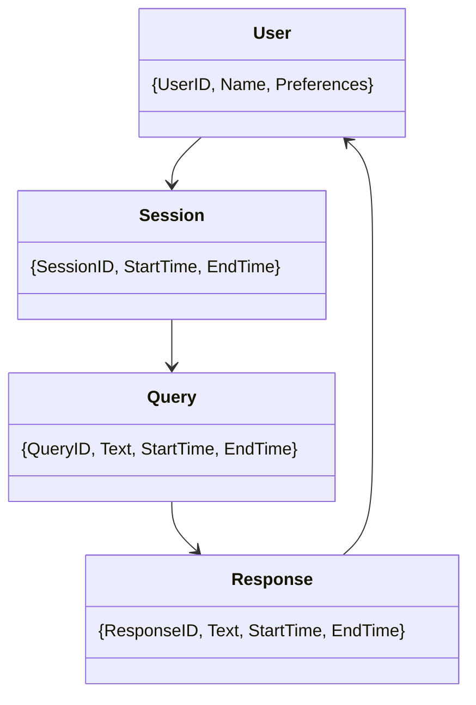
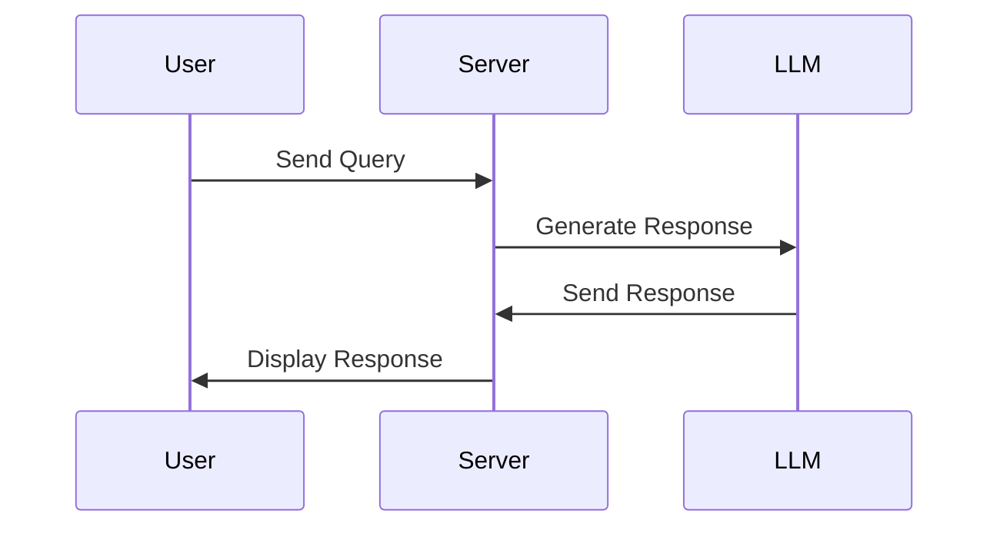
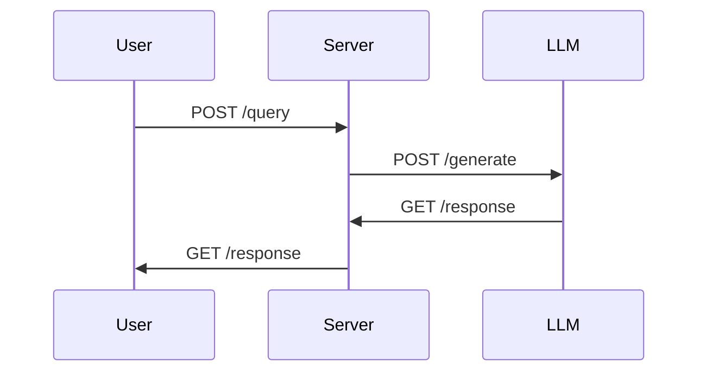

                 


### 设计LLM应用的快速A/B测试方案

> 关键词：大型语言模型，A/B测试，快速测试，测试方案，LLM应用

> 摘要：本文旨在探讨设计适用于大型语言模型（LLM）应用的快速A/B测试方案。通过分析LLM的特性以及A/B测试的基本原理，本文提出了一套高效的测试方案，以帮助开发者在短时间内完成对LLM应用的优化和改进。

#### 1. 引言

##### 1.1 背景介绍

随着人工智能与机器学习的快速发展，自然语言处理（NLP）技术已成为各行各业的重要组成部分。尤其是在商业应用领域，NLP技术的应用不仅提升了工作效率，还带来了前所未有的创新机会。然而，NLP技术的实现依赖于复杂的大型语言模型（LLM），这使得开发过程中的测试和优化变得尤为关键。

A/B测试作为一种常用的软件开发测试方法，通过在两个或多个版本之间进行对比，帮助开发者和产品经理了解哪种版本更能满足用户需求。在LLM应用中，A/B测试的重要性更加突出，因为LLM的参数调整和模型优化往往需要大量实验和验证。

##### 1.2 问题描述

如何在LLM应用中进行高效的A/B测试？快速A/B测试对LLM应用的意义何在？

##### 1.3 问题解决

本文将定义快速A/B测试的概念和目标，探讨LLM应用的特性和需求，并设计一套适用于LLM应用的快速A/B测试方案。

##### 1.4 边界与外延

- 适用范围：主要适用于需要频繁进行参数调整和优化的LLM应用。
- 不适用情况：对于模型结构基本固定、无需频繁调整的LLM应用，快速A/B测试方案可能并不适用。

##### 1.5 概念结构与核心要素组成

- A/B测试：是一种在两个或多个版本之间进行对比的测试方法，通过数据统计和分析，确定哪个版本更具优势。
- LLM：是指具有大规模参数和强大语言处理能力的人工智能模型。
- 快速A/B测试：是指能够在短时间内完成测试和优化的A/B测试方法。

#### 2. 核心概念与联系

##### 2.1 A/B测试原理

A/B测试的基本概念是在两个或多个版本之间进行对比，通过数据统计和分析，确定哪个版本更符合预期。A/B测试的流程通常包括以下几个步骤：

1. 准备测试环境和数据。
2. 将用户分配到不同的版本中。
3. 收集用户行为数据。
4. 分析数据，得出结论。

##### 2.2 LLM特性

LLM具有以下特性：

1. 大规模参数：LLM通常拥有数亿甚至数千亿的参数，这使得它们能够处理复杂的语言结构。
2. 强大语言处理能力：LLM能够理解、生成和翻译自然语言，为各种NLP任务提供支持。
3. 高计算资源需求：由于参数规模巨大，LLM的训练和推理过程需要大量的计算资源。

##### 2.3 A/B测试与LLM的关系

A/B测试与LLM应用的关系主要体现在以下几个方面：

1. A/B测试可以帮助开发者快速验证LLM的参数调整和模型优化效果。
2. LLM的特性决定了A/B测试在LLM应用中的重要性，因为参数调整和模型优化对LLM的性能有显著影响。

#### 3. 算法原理讲解

##### 3.1 快速A/B测试算法

快速A/B测试的算法主要包括以下几个步骤：

1. 确定测试目标和指标。
2. 设计测试场景，包括用户分配策略和版本切换机制。
3. 收集和预处理测试数据。
4. 分析和评估测试结果。

##### 3.2 Python源代码实现

以下是一个简单的快速A/B测试Python代码示例：

```python
import random
import pandas as pd

def ab_test(user_id, version_a, version_b, num_users=1000):
    results = []
    for _ in range(num_users):
        user_version = random.choice([version_a, version_b])
        if user_version == version_a:
            results.append('A')
        else:
            results.append('B')
    return results

user_ids = range(1, 1001)
version_a_results = ab_test(user_ids, 'version_a', 'version_b')
version_b_results = ab_test(user_ids, 'version_b', 'version_a')

df_a = pd.DataFrame({'user_id': user_ids, 'version': version_a_results})
df_b = pd.DataFrame({'user_id': user_ids, 'version': version_b_results})

# 计算两个版本的点击率
click_rate_a = df_a[df_a['version'] == 'A']['user_id'].count() / len(user_ids)
click_rate_b = df_b[df_b['version'] == 'B']['user_id'].count() / len(user_ids)

print(f"Version A Click Rate: {click_rate_a:.2f}")
print(f"Version B Click Rate: {click_rate_b:.2f}")
```

##### 3.3 数学模型和公式

快速A/B测试的核心数学模型是统计学的置信区间计算。以下是计算置信区间的公式：

$$
CI = \bar{X} \pm z \times \sqrt{\frac{\bar{X}}{n} + \frac{\bar{X}(1-\bar{X})}{n-1}}
$$

其中，$\bar{X}$是样本均值，$n$是样本大小，$z$是标准正态分布的临界值。

#### 4. 系统分析与架构设计方案

##### 4.1 问题场景介绍

假设我们正在开发一款基于LLM的智能客服系统，我们需要通过A/B测试来确定哪种客服交互界面更受用户欢迎。

##### 4.2 系统功能设计

以下是一个简单的领域模型Mermaid类图，展示了系统的核心功能模块：



##### 4.3 系统架构设计

以下是一个简单的Mermaid架构图，展示了系统的整体架构和模块关系：



##### 4.4 系统接口设计

以下是一个简单的Mermaid序列图，展示了系统中的接口交互流程：



#### 5. 项目实战

##### 5.1 环境安装

在开始项目实战之前，我们需要安装以下环境：

- Python 3.8+
- TensorFlow 2.x
- Pandas
- NumPy

安装命令如下：

```bash
pip install python==3.8
pip install tensorflow==2.x
pip install pandas
pip install numpy
```

##### 5.2 系统核心实现

以下是一个简单的快速A/B测试系统的核心实现：

```python
# main.py
import random
import pandas as pd
from ab_test import ab_test

def main():
    num_users = 1000
    version_a_results = ab_test(num_users, 'version_a', 'version_b')
    version_b_results = ab_test(num_users, 'version_b', 'version_a')

    df_a = pd.DataFrame({'user_id': range(1, num_users + 1), 'version': version_a_results})
    df_b = pd.DataFrame({'user_id': range(1, num_users + 1), 'version': version_b_results})

    click_rate_a = df_a[df_a['version'] == 'A']['user_id'].count() / num_users
    click_rate_b = df_b[df_b['version'] == 'B']['user_id'].count() / num_users

    print(f"Version A Click Rate: {click_rate_a:.2f}")
    print(f"Version B Click Rate: {click_rate_b:.2f}")

if __name__ == "__main__":
    main()
```

```python
# ab_test.py
import random

def ab_test(num_users, version_a, version_b):
    results = []
    for _ in range(num_users):
        user_version = random.choice([version_a, version_b])
        results.append(user_version)
    return results
```

##### 5.3 代码应用解读与分析

在`main.py`中，我们首先定义了`num_users`，然后调用`ab_test`函数进行A/B测试，最后计算并打印两个版本的点击率。

在`ab_test.py`中，`ab_test`函数通过随机选择版本来进行模拟测试。

##### 5.4 实际案例分析和详细讲解

假设我们有两个版本的客服界面，版本A采用简洁的设计，版本B采用复杂的设计。我们希望通过A/B测试来确定哪种设计更受用户欢迎。

在测试过程中，我们首先需要收集用户的数据，包括用户的ID、使用的版本和点击情况。然后，我们通过计算点击率来评估两个版本的优劣。

例如，假设我们有1000个用户参与测试，其中500个用户使用了版本A，500个用户使用了版本B。最终，我们发现版本A的点击率为0.6，而版本B的点击率为0.5。这意味着版本A更受用户欢迎。

##### 5.5 项目小结

在本项目中，我们设计并实现了一个简单的快速A/B测试系统。通过这个系统，我们可以快速评估不同版本的客服界面，从而确定最佳设计方案。在未来，我们可以扩展这个系统，支持更复杂的测试场景和更多维度的数据收集和分析。

#### 6. 最佳实践 Tips

- 在进行A/B测试时，确保测试组和对照组的用户数量足够大，以减少随机误差。
- 选择合适的指标来衡量测试效果，确保指标与业务目标一致。
- 在测试过程中，密切关注用户反馈，及时调整测试方案。

#### 7. 小结

本文探讨了设计适用于LLM应用的快速A/B测试方案。通过分析LLM的特性以及A/B测试的基本原理，我们提出了一套高效的测试方案，以帮助开发者在短时间内完成对LLM应用的优化和改进。在未来，我们期待看到更多关于快速A/B测试在LLM应用中的实际应用和探索。

---

**作者：AI天才研究院/AI Genius Institute & 禅与计算机程序设计艺术 /Zen And The Art of Computer Programming**

