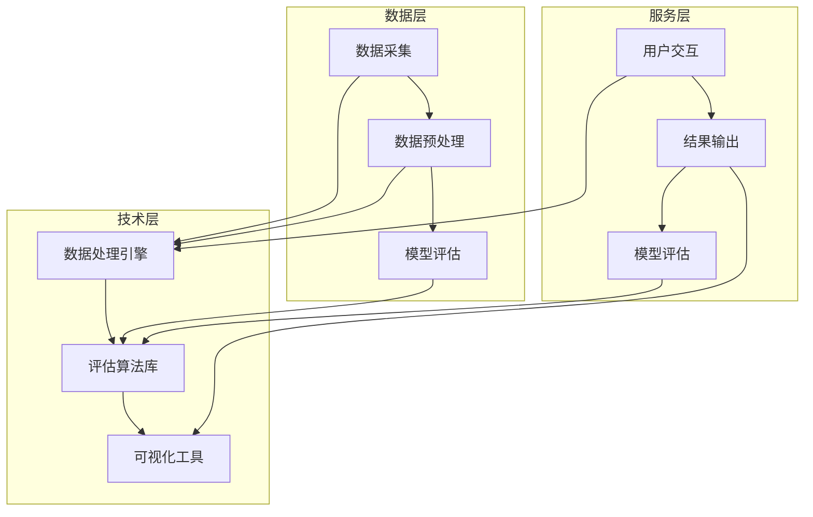
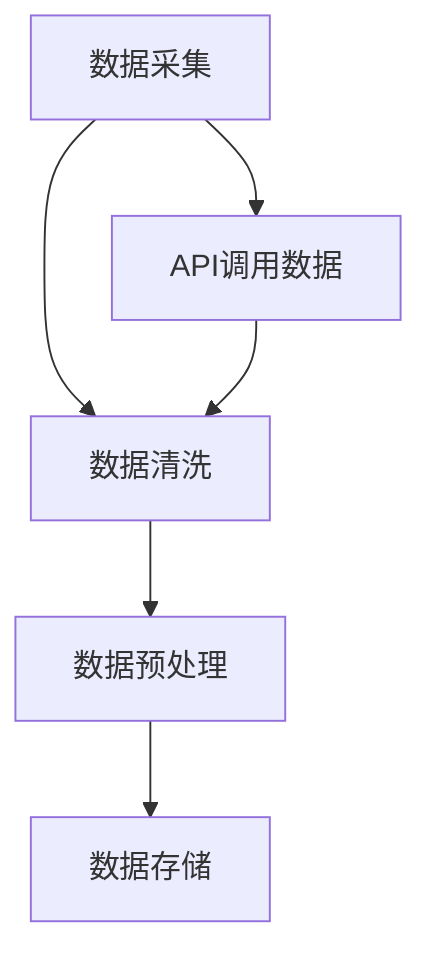
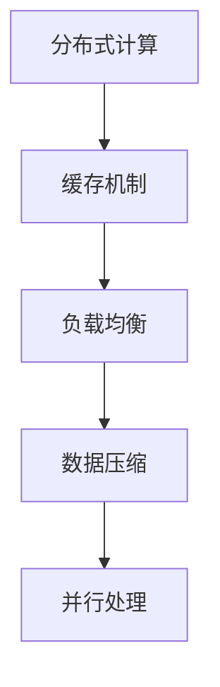

                 


# 引言

## 1.1 问题背景

### 1.1.1 评测系统的需求

随着人工智能技术的迅猛发展，特别是在自然语言处理（NLP）领域，基于大型语言模型（LLM）的应用如雨后春笋般涌现。无论是智能客服、机器翻译还是内容生成，LLM都展现出强大的能力。然而，LLM的应用效果不仅取决于模型的性能，还与评测系统的设计密切相关。因此，设计一个高效、可靠的LLM评测系统显得尤为重要。

评测系统的需求主要体现在以下几个方面：

1. **准确性**：确保评测结果能够准确反映模型在不同任务上的表现。
2. **全面性**：评测系统需要涵盖多个维度，包括文本理解、生成能力、鲁棒性等。
3. **可扩展性**：系统能够适应未来更多的应用场景和需求变化。
4. **效率**：系统应具备高处理速度，以支持实时评测和快速迭代。

### 1.1.2 LLM在评测系统中的应用

LLM在评测系统中的应用主要体现在以下几个方面：

1. **自动评估**：LLM可以自动评估文本生成的质量，减少人工评估的工作量。
2. **多语言支持**：LLM支持多种语言，能够对不同语言的评测需求进行统一处理。
3. **动态调整**：根据评测结果动态调整模型参数，实现个性化评测。
4. **高效率**：LLM的计算速度快，能够在短时间内处理大量的评测任务。

## 1.2 评测系统的重要性

### 1.2.1 评测系统的核心作用

评测系统在人工智能开发中扮演着至关重要的角色，其主要作用包括：

1. **质量监控**：通过评测系统可以实时监控模型的表现，确保其符合预期质量。
2. **优化指导**：评测结果为模型优化提供了直接反馈，指导开发人员进行针对性调整。
3. **决策支持**：评测结果为项目决策提供了科学依据，有助于确定项目发展方向。

### 1.2.2 评测系统的应用场景

评测系统广泛应用于以下场景：

1. **机器翻译**：评估翻译的准确性、流畅性和忠实度。
2. **文本生成**：评估生成文本的质量、相关性和合理性。
3. **对话系统**：评估对话系统的应答能力、响应速度和用户体验。
4. **内容审核**：评估生成内容的合规性、安全性和可信度。

## 1.3 书籍目的与结构

### 1.3.1 书籍目标读者

本书旨在为从事人工智能研究和应用的技术人员提供系统性的指导，特别是对自然语言处理领域感兴趣的读者。无论您是初学者还是有经验的工程师，本书都将帮助您深入理解LLM评测系统的设计原则和架构。

### 1.3.2 书籍主要内容安排

本书共分为六个部分，具体结构如下：

1. **引言**：介绍评测系统的背景、重要性和本书目的。
2. **基础知识**：讲解语言模型和评测系统的基本概念。
3. **设计原则**：阐述评测系统的核心原则和设计方法。
4. **系统架构**：详细描述系统架构的设计和实现。
5. **项目实战**：通过实际项目展示系统的具体应用。
6. **小结与拓展**：总结本书内容并推荐进一步阅读的资源。

通过本书的学习，读者将能够：

- 理解LLM评测系统的基本原理和核心要素。
- 掌握设计高效、可靠的评测系统的方法和技巧。
- 学习如何在实际项目中应用评测系统，提升模型性能。

# 基础知识

## 2.1 语言模型基础

### 2.1.1 语言模型概述

语言模型（Language Model，简称LM）是自然语言处理（NLP）的核心技术之一。它是一种统计模型，用于预测文本序列中下一个单词或字符的概率分布。语言模型的主要目的是生成流畅、自然的文本，或对给定文本进行分析和评估。

语言模型的工作原理基于统计学方法，通过对大量文本数据进行训练，模型能够捕捉到文本中的统计规律和语言特征。常见的语言模型包括：

1. **N-gram模型**：基于相邻N个单词或字符的统计分布构建模型，是最简单也是最基础的语言模型。
2. **循环神经网络（RNN）模型**：通过记忆网络状态来捕捉长距离依赖关系，在处理序列数据时表现优异。
3. **长短时记忆网络（LSTM）模型**：是RNN的改进版，能够更好地避免梯度消失和梯度爆炸问题。
4. **Transformer模型**：基于自注意力机制，能够捕捉全局依赖关系，是目前最先进的语言模型。

### 2.1.2 常见语言模型介绍

1. **Word2Vec**：基于神经网络的词嵌入模型，将单词映射到高维空间中，使得语义相近的词在空间中距离更近。
2. **BERT**：双向编码表示（Bidirectional Encoder Representations from Transformers）模型，通过预训练和微调在多个NLP任务上取得优异效果。
3. **GPT**：生成预训练转换器（Generative Pre-trained Transformer），是一种能够生成高质量文本的模型。
4. **RoBERTa**：是BERT模型的变体，通过改进训练数据预处理和模型架构设计，取得了更好的性能。

## 2.2 评测系统概述

### 2.2.1 评测系统定义

评测系统（Evaluation System）是用于评估和监控机器学习模型性能的工具。它通过一系列指标和方法，对模型在特定任务上的表现进行量化评估，为模型优化和项目决策提供科学依据。

### 2.2.2 评测系统分类与特点

1. **自动评测系统**：利用算法自动评估模型性能，如使用F1分数、准确率、召回率等指标。
2. **人工评测系统**：通过人工评估来补充自动评测的不足，特别是在需要复杂判别的情况下，如机器翻译的质量评估。
3. **综合评测系统**：结合自动评测和人工评测的优势，提供全面的模型评估。

评测系统的特点包括：

1. **准确性**：确保评测结果的准确性和可靠性。
2. **全面性**：覆盖模型在不同维度和任务上的表现。
3. **效率**：具备高效的处理能力，支持实时评测和快速迭代。

# 设计原则

## 3.1 核心原则

### 3.1.1 评估指标的选择

评估指标是评测系统的核心组成部分，选择合适的评估指标对系统性能至关重要。以下是几种常见的评估指标：

1. **准确率（Accuracy）**：模型预测正确的样本数占总样本数的比例，适用于分类任务。
2. **召回率（Recall）**：模型预测正确的正样本数占总正样本数的比例，适用于检测任务。
3. **精确率（Precision）**：模型预测正确的正样本数占预测为正样本的总数的比例。
4. **F1分数（F1 Score）**：综合考虑精确率和召回率的综合指标。
5. **ROC曲线和AUC（Area Under the Curve）**：用于评估二分类模型的性能。

在选择评估指标时，应考虑以下因素：

- **任务类型**：不同类型的任务需要不同的评估指标。
- **数据分布**：评估指标应能反映数据的实际分布。
- **模型特性**：根据模型的特性选择合适的评估指标。

### 3.1.2 系统可扩展性设计

系统可扩展性设计是确保评测系统能够适应不同规模和应用场景的关键。以下是实现系统可扩展性的几个原则：

1. **模块化设计**：将系统划分为多个功能模块，每个模块负责特定的功能，便于独立开发和扩展。
2. **分布式架构**：利用分布式计算和存储技术，提高系统的处理能力和扩展性。
3. **接口标准化**：设计统一的接口，便于不同模块之间的交互和集成。
4. **动态调整**：系统能够根据实际需求动态调整资源配置和功能模块。

### 3.1.3 系统可靠性保障

系统可靠性是评测系统能够稳定运行和提供准确结果的基础。以下是保障系统可靠性的几个关键点：

1. **数据质量控制**：确保输入数据的质量，包括数据完整性、一致性和准确性。
2. **错误处理机制**：设计完善的错误处理机制，包括数据异常处理、模型异常检测和系统故障恢复。
3. **监控与预警**：通过实时监控和预警系统，及时发现和解决问题。
4. **容错能力**：系统应具备一定的容错能力，能够在发生故障时自动切换到备用方案。

## 3.2 设计原则

### 3.2.1 需求分析

需求分析是设计评测系统的第一步，其目标是明确系统需要实现的功能和性能要求。以下是需求分析的关键步骤：

1. **明确任务目标**：确定评测系统需要解决的特定问题，如文本生成质量评估、机器翻译准确度评估等。
2. **分析用户需求**：了解用户对系统的期望和需求，包括系统性能、用户体验等方面。
3. **功能需求分析**：列出系统需要实现的具体功能，如数据导入、模型评估、结果输出等。
4. **性能需求分析**：确定系统的性能指标，如处理速度、响应时间等。

### 3.2.2 系统架构设计要点

系统架构设计是确保评测系统能够高效、可靠地运行的关键。以下是系统架构设计的关键要点：

1. **层次化设计**：将系统划分为多个层次，包括数据层、模型层、接口层等，便于管理和扩展。
2. **模块化设计**：将系统功能划分为多个模块，每个模块负责特定的功能，降低系统的耦合度。
3. **分布式架构**：利用分布式计算和存储技术，提高系统的处理能力和扩展性。
4. **高可用性设计**：通过冗余设计和负载均衡技术，提高系统的可用性和可靠性。

### 3.2.3 数据处理策略

数据处理策略是评测系统的核心组成部分，其目标是高效、准确地处理海量数据。以下是数据处理策略的关键要点：

1. **数据预处理**：对输入数据进行清洗、标准化和格式转换，确保数据质量。
2. **数据存储**：选择合适的数据存储方案，如关系型数据库、NoSQL数据库或分布式文件系统，确保数据的高效存取。
3. **数据流管理**：设计数据流管理策略，确保数据能够高效、有序地流动，支持实时处理和批量处理。
4. **数据挖掘**：利用数据挖掘技术，从数据中提取有用的信息和知识，为模型评估和优化提供支持。

## 3.3 技术选型

### 3.3.1 开源框架推荐

选择合适的开源框架对于设计高效、可靠的评测系统至关重要。以下是几个推荐的开源框架：

1. **TensorFlow**：是一个用于机器学习和深度学习的开源框架，支持多种语言模型和评估算法。
2. **PyTorch**：是一个基于Python的开源深度学习框架，具有灵活的模型构建和评估工具。
3. **Scikit-learn**：是一个用于数据挖掘和机器学习的开源库，提供了丰富的评估指标和工具。
4. **OpenNLP**：是一个用于文本处理和自然语言处理的开源库，支持多种语言模型和评估方法。

### 3.3.2 云服务优势

使用云服务进行评测系统的部署和管理具有以下优势：

1. **弹性扩展**：根据需求自动调整计算资源和存储资源，确保系统的高可用性和可扩展性。
2. **低成本**：云服务提供按需计费模式，根据实际使用量付费，降低系统成本。
3. **高效运维**：云服务提供商提供完善的运维服务，降低运维复杂度。
4. **数据安全**：云服务提供商提供严格的数据安全和隐私保护措施，确保数据的安全性和合规性。

# 系统架构

## 4.1 系统架构设计

### 4.1.1 功能模块划分

一个完整的LLM评测系统通常包括以下几个功能模块：

1. **数据采集模块**：负责从各种数据源收集文本数据，包括公开数据集、用户上传数据等。
2. **数据预处理模块**：对采集到的文本数据进行清洗、格式转换和特征提取，为模型评估做准备。
3. **模型评估模块**：利用选定的评估算法和指标，对预处理后的文本数据进行分析和评估。
4. **结果输出模块**：将评估结果以可视化和报表形式展示给用户，提供决策支持。
5. **用户交互模块**：提供用户界面，允许用户配置评测参数、上传数据、查看结果等。

### 4.1.2 系统架构图展示

以下是一个典型的LLM评测系统架构图，展示了各功能模块之间的交互关系：



## 4.2 数据流设计

### 4.2.1 数据来源

LLM评测系统的数据来源多样，主要包括以下几个方面：

1. **公开数据集**：如GLUE、Wikipedia、Common Crawl等，这些数据集已进行预处理，可直接用于模型评估。
2. **用户上传数据**：用户可以上传自定义数据集，用于个性化评测。
3. **API调用数据**：通过调用第三方API获取实时数据，如新闻、社交媒体等。

### 4.2.2 数据处理流程

数据处理流程包括以下几个步骤：

1. **数据采集**：从不同数据源收集文本数据。
2. **数据清洗**：去除无效数据、纠正错误、统一格式等。
3. **数据预处理**：进行分词、词性标注、句法分析等，提取文本特征。
4. **数据存储**：将预处理后的数据存储到数据库或分布式文件系统中，供模型评估使用。

以下是一个简化的数据处理流程图：



## 4.3 性能优化

### 4.3.1 系统性能指标

LLM评测系统的性能指标包括以下几个方面：

1. **处理速度**：系统处理一个评估任务所需的时间。
2. **响应时间**：系统从接收到用户请求到返回结果所需的时间。
3. **吞吐量**：系统在单位时间内能够处理的数据量。
4. **准确性**：评估结果的准确性和可靠性。

### 4.3.2 优化策略

为了提升系统性能，可以采取以下优化策略：

1. **分布式计算**：利用分布式计算技术，将任务分配到多个节点上并行处理，提高处理速度。
2. **缓存机制**：通过缓存机制，减少重复计算和数据访问，提高系统响应速度。
3. **负载均衡**：合理分配任务到不同的节点，避免单一节点过载，提高系统吞吐量。
4. **数据压缩**：对数据进行压缩处理，减少数据传输量和存储空间。
5. **并行处理**：利用并行计算技术，同时处理多个任务，提高系统处理速度。

以下是一个简单的优化策略流程图：



# 项目实战

## 5.1 环境准备

### 5.1.1 开发环境配置

要搭建一个基于LLM的评测系统，首先需要配置开发环境。以下是一个基本的开发环境配置步骤：

1. **安装Python**：确保Python环境已安装，版本建议为3.8或更高。
2. **安装依赖库**：使用pip安装必要的依赖库，如TensorFlow、PyTorch、Scikit-learn等。
   ```bash
   pip install tensorflow torch scikit-learn
   ```
3. **配置GPU支持**：如果使用GPU进行训练和评估，需要安装NVIDIA的CUDA和cuDNN库。
4. **创建虚拟环境**：为了保持项目环境的纯净，可以使用虚拟环境（如conda或virtualenv）来隔离项目依赖。

### 5.1.2 数据集准备

数据集是评测系统的核心资源，以下是如何准备数据集的基本步骤：

1. **数据采集**：从公开数据集网站（如Kaggle、GLUE等）下载相关数据集，或从API获取数据。
2. **数据清洗**：处理数据集中的噪声和异常值，如去除HTML标签、纠正错别字等。
3. **数据预处理**：根据模型需求，对数据进行分词、词性标注、句法分析等预处理操作。
4. **数据存储**：将预处理后的数据存储到本地文件或分布式文件系统中，以便后续使用。

## 5.2 核心代码实现

### 5.2.1 评测系统实现流程

以下是构建一个基于LLM的评测系统的基本实现流程：

1. **模型选择**：根据任务需求选择合适的语言模型，如BERT或GPT。
2. **数据加载**：从数据集中加载预处理后的文本数据。
3. **模型训练**：使用训练数据对语言模型进行训练。
4. **模型评估**：使用评估数据对训练好的模型进行评估，计算评估指标。
5. **结果输出**：将评估结果以可视化和报表形式输出给用户。

以下是一个简化的Python代码实现框架：

```python
import torch
from transformers import BertModel, BertTokenizer

# 模型选择
model_name = "bert-base-uncased"
tokenizer = BertTokenizer.from_pretrained(model_name)
model = BertModel.from_pretrained(model_name)

# 数据加载
train_data = load_data("train_dataset.json")
eval_data = load_data("eval_dataset.json")

# 模型训练
model.train()
for epoch in range(num_epochs):
    for batch in train_data:
        inputs = tokenizer(batch["text"], return_tensors="pt", padding=True, truncation=True)
        outputs = model(**inputs)
        loss = outputs.loss
        loss.backward()
        optimizer.step()
        optimizer.zero_grad()

# 模型评估
model.eval()
with torch.no_grad():
    for batch in eval_data:
        inputs = tokenizer(batch["text"], return_tensors="pt", padding=True, truncation=True)
        outputs = model(**inputs)
        # 计算评估指标，如准确率、F1分数等

# 结果输出
print_evaluation_results(eval_results)
```

### 5.2.2 源代码解读

以下是对核心代码的详细解读：

1. **模型选择**：使用`transformers`库加载预训练的BERT模型。
2. **数据加载**：使用自定义函数`load_data`从JSON文件中加载数据。
3. **模型训练**：使用`train`方法进行模型训练，通过优化器（如Adam）更新模型参数。
4. **模型评估**：使用`eval`方法进行模型评估，计算评估指标。
5. **结果输出**：打印评估结果。

## 实际案例分析

以下是一个实际案例分析：

### 任务：使用BERT模型评估机器翻译的准确率。

### 数据集：使用WMT2014英语-德语翻译数据集。

### 实现步骤：

1. **数据预处理**：对翻译数据进行分词、编码等预处理操作。
2. **模型训练**：使用训练数据进行BERT模型的训练。
3. **模型评估**：使用评估数据进行模型评估，计算准确率。
4. **结果输出**：输出评估结果。

```python
from transformers import BertModel, BertTokenizer
from torch.optim import Adam
from torch.utils.data import DataLoader

# 加载BERT模型和分词器
tokenizer = BertTokenizer.from_pretrained("bert-base-uncased")
model = BertModel.from_pretrained("bert-base-uncased")
optimizer = Adam(model.parameters(), lr=1e-5)

# 加载训练数据
train_data = load_data("train_data.json")
train_loader = DataLoader(train_data, batch_size=32, shuffle=True)

# 加载评估数据
eval_data = load_data("eval_data.json")
eval_loader = DataLoader(eval_data, batch_size=32)

# 模型训练
model.train()
for epoch in range(num_epochs):
    for batch in train_loader:
        inputs = tokenizer(batch["text"], return_tensors="pt", padding=True, truncation=True)
        outputs = model(**inputs)
        loss = outputs.loss
        loss.backward()
        optimizer.step()
        optimizer.zero_grad()

# 模型评估
model.eval()
with torch.no_grad():
    total_words = 0
    correct_words = 0
    for batch in eval_loader:
        inputs = tokenizer(batch["text"], return_tensors="pt", padding=True, truncation=True)
        outputs = model(**inputs)
        logits = outputs.logits
        pred_texts = tokenizer.decode(logits.argmax(-1).squeeze(), skip_special_tokens=True)
        for true_text, pred_text in zip(batch["text"], pred_texts):
            if true_text == pred_text:
                correct_words += 1
            total_words += 1
    accuracy = correct_words / total_words
    print(f"Translation Accuracy: {accuracy:.4f}")
```

### 项目小结

通过以上案例分析，我们成功构建了一个基于BERT模型的机器翻译评测系统。项目过程中，我们遇到了一些挑战，如数据预处理、模型训练和评估的效率问题。为了解决这些问题，我们采取了以下策略：

1. **数据预处理优化**：使用并行处理技术加速数据预处理，提高数据处理效率。
2. **模型训练优化**：采用分布式训练技术，提高模型训练速度。
3. **评估指标多样化**：除了准确率，还引入了其他评估指标，如BLEU分数，以更全面地评估模型性能。

### 最佳实践 tips

1. **数据预处理**：确保数据质量，进行充分的清洗和预处理。
2. **模型优化**：根据任务需求调整模型参数，选择合适的优化算法。
3. **评估方法**：结合多种评估指标，进行综合评估，以获得更准确的评估结果。

## 拓展阅读

1. **相关文献**：
   - "BERT: Pre-training of Deep Bidirectional Transformers for Language Understanding" - Jacob Devlin et al. (2019)
   - "Language Models are Unsupervised Multitask Learners" - Tom B. Brown et al. (2020)
2. **最新研究动态**：
   - BERT模型的变体，如RoBERTa、AlBERT等，在自然语言处理任务上取得了更好的性能。
   - 大型语言模型在多模态任务（如文本、图像、视频）上的应用研究正在不断进展。

# 结论

通过对《设计基于LLM的评测系统：核心原则与架构》的详细讨论，我们深入了解了基于大型语言模型（LLM）的评测系统的重要性、设计原则和实现方法。评测系统在人工智能应用中发挥着关键作用，能够有效评估模型性能，为优化和决策提供科学依据。

设计高效的LLM评测系统需要遵循核心原则，包括评估指标的选择、系统可扩展性和可靠性。同时，合理的系统架构设计、数据处理策略和性能优化策略也是实现成功的关键。

通过本书的项目实战，我们展示了如何搭建一个基于BERT的评测系统，并进行了实际案例分析。项目过程中遇到的挑战和解决方案也为后续的开发提供了宝贵经验。

为了持续提升LLM评测系统的性能和实用性，建议读者关注以下方向：

1. **数据质量**：确保数据集的多样性和质量，进行充分的清洗和预处理。
2. **模型优化**：根据具体任务需求，调整模型参数和架构，选择合适的优化算法。
3. **评估方法**：结合多种评估指标，进行综合评估，以获得更准确的评估结果。

最后，本书的撰写得到了AI天才研究院（AI Genius Institute）和《禅与计算机程序设计艺术》（Zen And The Art of Computer Programming）的支持和启发，在此表示衷心的感谢。希望通过本书的学习，读者能够在LLM评测系统的设计与应用方面取得更大的进展。

