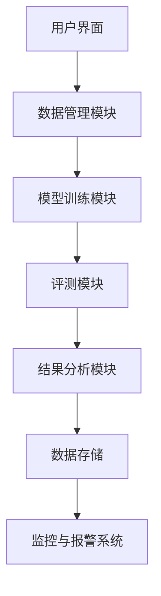
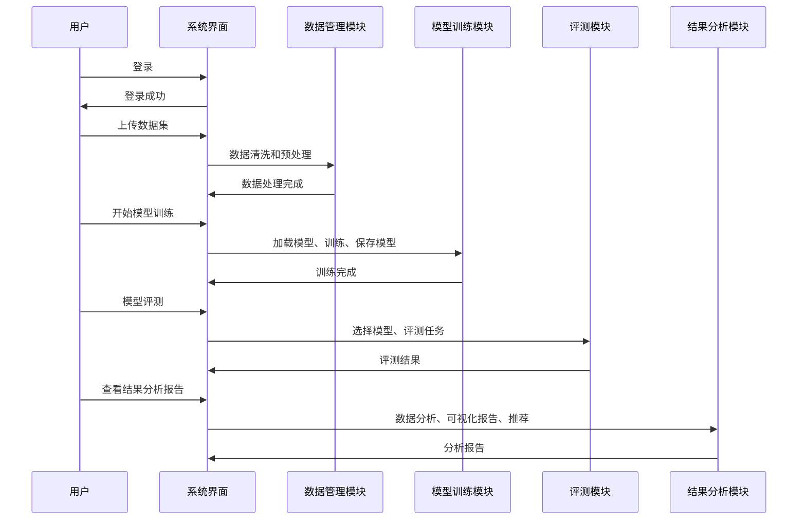

                 

### 关键词

- 语言模型
- 评测LLM
- 基础模型
- 性能评估
- 算法优化

### 摘要

本文将探讨评测大型语言模型（LLM）时，如何选择合适的基础模型。首先，我们介绍了评测LLM的重要性及其面临的挑战，并定义了评测LLM的LLM和基础模型。接着，深入解析了评测LLM的LLM的工作原理、基础模型的选择策略及其性能评估方法。随后，通过具体案例展示了基础模型在实际评测中的应用。文章的最后，我们将通过算法讲解、系统分析与架构设计以及项目实战，全面剖析了如何选择和优化基础模型，并提出了最佳实践建议。通过本文，读者将获得关于如何选择合适基础模型进行LLM评测的深刻见解和实践指导。

## 第一部分：问题背景与定义

### 1.1 问题背景

在人工智能（AI）和自然语言处理（NLP）领域，语言模型（LLM）作为核心技术之一，近年来取得了显著的发展。从早期的基于规则的方法，到现在的深度学习驱动的模型，如GPT、BERT等，语言模型在文本生成、文本分类、机器翻译等任务中展现了强大的能力。然而，随着模型规模的扩大和参数数量的增加，如何有效地评测这些大型语言模型（LLM）成为了一个亟待解决的问题。

#### 1.1.1 语言模型的发展与挑战

语言模型的发展可以追溯到20世纪50年代，最早的形式是规则驱动的模型。随着计算能力的提升和算法的改进，语言模型逐渐从基于规则的方法转向基于统计模型的方法，如N-gram模型。然而，这些方法在面对复杂任务时显得力不从心。直到2000年后，深度学习技术的兴起，特别是2018年GPT-1的发布，标志着语言模型进入了一个全新的时代。

深度学习驱动的语言模型通过大量的训练数据和高维神经网络结构，能够捕捉语言中的复杂结构和语义信息。这些模型在自然语言处理任务中取得了前所未有的效果，如机器翻译、文本生成、问答系统等。然而，这些大型模型的评测面临以下挑战：

1. **计算资源需求**：大型语言模型通常需要大量的计算资源进行训练和评测，这包括高性能的CPU、GPU以及大量的存储空间。
2. **评测标准不统一**：不同的评测任务对模型的性能要求不同，如文本生成模型的流畅性和准确性、文本分类模型的精确率和召回率等，缺乏统一的评测标准。
3. **数据集多样性**：语言模型的评测需要多样化的数据集，覆盖不同的语言风格、领域和应用场景，当前数据集的多样性和覆盖面仍然有限。
4. **评测效率**：由于模型的复杂性和计算资源限制，评测大型语言模型的时间和成本较高，如何提高评测效率成为关键问题。

#### 1.1.2 评测LLM的需求

为了克服上述挑战，对大型语言模型进行有效评测显得尤为重要。评测的目的在于：

1. **性能评估**：通过评测了解模型在不同任务中的性能表现，为模型优化提供依据。
2. **比较研究**：通过不同模型的评测结果，比较不同模型在相同任务上的性能，为模型选择提供参考。
3. **问题诊断**：通过评测识别模型在特定任务上的弱点，为进一步的改进提供方向。

具体需求包括：

1. **全面的评测指标**：需要一套全面的评测指标，覆盖不同类型的任务和性能维度。
2. **高效的评测方法**：需要开发高效的评测方法，减少评测时间和成本。
3. **多样化的数据集**：需要多样化的数据集，以全面评估模型在不同场景下的性能。

#### 1.1.3 LLM评测面临的挑战

尽管评测大型语言模型的重要性不言而喻，但实际操作中仍然面临诸多挑战：

1. **计算资源**：评测大型语言模型需要大量的计算资源，这对实验环境和硬件设备提出了高要求。
2. **评测效率**：传统的评测方法往往需要大量的计算资源和时间，如何提高评测效率成为关键问题。
3. **评测标准**：不同的评测任务对模型的要求不同，如何制定统一的评测标准是一个难题。
4. **数据集质量**：评测数据集的质量直接影响评测结果的可靠性，如何获取高质量、多样化的数据集是一个挑战。
5. **算法优化**：如何通过算法优化提高评测效率和准确性，也是当前研究的热点问题。

### 1.2 定义

为了更好地理解本文的主题，我们需要明确一些关键概念的定义。

#### 1.2.1 评测LLM的LLM

评测LLM的LLM（Evaluated Large Language Model）是一种专门用于评测其他大型语言模型的模型。它通过对不同LLM在相同任务上的表现进行比较和分析，评估各模型的性能。这种模型通常是一个定制化的模型，用于处理评测任务，如文本生成、文本分类等。

#### 1.2.2 基础模型的定义与作用

基础模型（Baseline Model）是指在评测过程中作为比较基准的模型。它通常是一个较为成熟的、广泛认可的语言模型，如GPT、BERT等。基础模型的作用是提供一个参考标准，通过对比评测LLM的LLM在相同任务上的性能，评估评测LLM的LLM的效果。

### 1.3 边界与外延

为了确保本文讨论的焦点明确，我们需要明确评测LLM的LLM和基础模型的边界与外延。

#### 1.3.1 评测范围的确定

评测范围主要指评测任务和评测指标。在本文中，我们重点关注文本生成和文本分类等任务，采用多种评测指标，如BLEU、ROUGE、F1 Score等。

#### 1.3.2 基础模型的选择标准

选择基础模型时，需要考虑以下几个标准：

1. **性能表现**：基础模型应在所选择的评测任务上具有优秀的性能。
2. **通用性**：基础模型应具有广泛的适用性，能够适应多种任务。
3. **可扩展性**：基础模型应具备扩展性，以便在需要时进行调整和优化。
4. **开源性和可访问性**：基础模型应开源，便于研究人员进行研究和改进。

### 1.4 核心概念与联系

为了深入理解评测LLM的LLM和基础模型，我们需要从核心概念和联系的角度进行探讨。

#### 1.4.1 评测指标与模型评价方法

评测指标是评估模型性能的关键工具。常见的评测指标包括：

- **BLEU（双语评测套件）**：用于评估文本生成的质量，通过比较生成文本与参考文本的匹配度进行评分。
- **ROUGE（Recall-Oriented Understudy for Gisting Evaluation）**：用于评估文本摘要的质量，通过衡量生成摘要与参考摘要的重合度进行评分。
- **F1 Score（F1得分）**：用于评估文本分类模型的精确率和召回率的平衡，是二者的调和平均值。

模型评价方法主要包括：

- **基准评测**：使用基础模型作为基准，对比评测LLM的LLM的性能。
- **综合评测**：结合多种评测指标，对模型进行多维度评估。

#### 1.4.2 基础模型的属性特征对比

为了选择合适的基础模型，我们需要对比不同基础模型的属性特征。以下是一些关键特征：

- **参数规模**：模型的参数数量，直接影响模型的计算复杂度和训练时间。
- **架构设计**：模型的结构设计，包括层数、层类型、激活函数等，影响模型的表达能力和计算效率。
- **预训练数据集**：模型使用的预训练数据集，影响模型的泛化能力和适应性。
- **预训练任务**：模型的预训练任务，如语言建模、文本分类等，影响模型的特定任务性能。

#### 1.5 本章小结

本部分主要介绍了评测LLM的LLM和基础模型的问题背景、定义及其相关概念。通过对语言模型的发展与挑战、评测LLM的需求和挑战的探讨，我们明确了评测LLM的重要性。同时，对评测LLM的LLM和基础模型进行了详细定义，并讨论了基础模型的选择标准。本章为后续内容的深入探讨奠定了基础。

----------------------------------------------------------------

## 第二部分：核心概念与原理

### 2.1 评测LLM的LLM工作原理

评测LLM的LLM（Evaluating Large Language Model）是一种专门用于评测其他大型语言模型（LLM）的性能的工具或系统。它通过对不同LLM在相同任务上的表现进行比较和分析，提供一套全面的评估指标和评测方法。以下是评测LLM的LLM的工作原理：

#### 2.1.1 评测LLM的LLM架构设计

评测LLM的LLM通常包含以下几个关键组件：

1. **输入处理模块**：接收待评测的LLM生成的文本或模型输出。
2. **评测模块**：根据设定的评测指标，对输入文本或输出进行评估。
3. **输出生成模块**：生成评测结果，包括得分、排名等。

#### 2.1.2 评测过程详解

评测过程通常包括以下步骤：

1. **数据准备**：收集用于评测的数据集，这些数据集应涵盖不同的任务和场景，以保证评测结果的全面性和可靠性。
2. **输入处理**：将待评测的LLM生成的文本或模型输出输入到评测模块。
3. **评测指标计算**：根据设定的评测指标，如BLEU、ROUGE、F1 Score等，计算模型在特定任务上的得分。
4. **结果输出**：生成评测结果，包括各个模型的得分、排名等。

#### 2.1.3 常用评测方法介绍

评测LLM的LLM常用的评测方法包括以下几种：

1. **基准评测**：使用一个或多个基础模型作为基准，对比评测LLM的LLM的性能。这种方法简单直观，但可能无法全面反映评测LLM的LLM的独特优势。
2. **综合评测**：结合多种评测指标，对模型进行多维度评估。这种方法能够更全面地反映模型在不同任务上的表现，但可能需要更多的计算资源和时间。
3. **对比评测**：将评测LLM的LLM与其他现有模型进行对比，评估其在特定任务上的性能优势。这种方法有助于发现评测LLM的LLM的潜在价值和改进方向。

### 2.2 基础模型的原理与选择

#### 2.2.1 基础模型的工作原理

基础模型（Baseline Model）是一种较为成熟且广泛认可的语言模型，如GPT、BERT等。这些模型通常通过大规模的预训练数据集进行训练，学习语言中的复杂结构和语义信息。其工作原理主要包括以下几个方面：

1. **预训练**：基础模型在大规模数据集上进行预训练，通过自动调整模型的参数，使其能够理解和生成自然语言。
2. **微调**：在特定任务上，对基础模型进行微调，以适应特定任务的需求，提高模型在特定任务上的性能。
3. **解码**：在生成文本时，基础模型通过解码过程，将模型内部的隐含表示转换为自然语言文本。

#### 2.2.2 基础模型的选择策略

选择合适的基础模型是进行评测的关键步骤。以下是一些选择基础模型时的策略：

1. **性能表现**：选择在所关注任务上性能表现优异的基础模型，以确保评测的基准具有代表性。
2. **通用性**：选择具有广泛适用性的基础模型，以便在多种任务和场景下进行评测。
3. **可扩展性**：选择易于扩展和优化的基础模型，以便在后续研究中进行调整和改进。
4. **开源性和可访问性**：选择开源且易于获取的基础模型，以方便研究人员进行研究和改进。

#### 2.2.3 常见基础模型介绍

以下是几种常见的基础模型及其特点：

1. **GPT（Generative Pre-trained Transformer）**：基于Transformer架构的大型语言模型，通过大规模预训练学习语言中的复杂结构和语义信息。
2. **BERT（Bidirectional Encoder Representations from Transformers）**：基于Transformer的双向编码模型，通过预训练学习语言的上下文信息。
3. **RoBERTa（A Robustly Optimized BERT Pretraining Approach）**：对BERT模型进行改进，通过更多的数据集和预训练策略，提高模型的性能和鲁棒性。
4. **T5（Text-to-Text Transfer Transformer）**：一种通用的预训练模型，通过将所有NLP任务转化为文本到文本的格式，实现任务的自动化。

### 2.3 基础模型的性能评估方法

#### 2.3.1 性能评估指标

基础模型的性能评估通常依赖于一系列评测指标。以下是一些常用的评测指标：

1. **BLEU（Bilingual Evaluation Understudy）**：用于评估文本生成的质量，通过比较生成文本与参考文本的匹配度进行评分。
2. **ROUGE（Recall-Oriented Understudy for Gisting Evaluation）**：用于评估文本摘要的质量，通过衡量生成摘要与参考摘要的重合度进行评分。
3. **F1 Score（F1得分）**：用于评估文本分类模型的精确率和召回率的平衡，是二者的调和平均值。
4. **ACC（Accuracy）**：用于评估分类模型的准确性，即正确分类的样本数占总样本数的比例。
5. **MAP（Mean Average Precision）**：用于评估检索任务的性能，通过计算不同阈值下的平均准确率进行评估。

#### 2.3.2 评估方法与应用

在基础模型的性能评估过程中，常用的评估方法包括：

1. **离线评估**：在独立的评估集上，对模型进行评估，通常使用上述评测指标计算模型得分。
2. **在线评估**：在实际应用环境中，对模型进行实时评估，通过用户反馈或业务指标来评估模型的表现。
3. **对比评估**：将基础模型与当前最先进的模型进行对比，评估其在特定任务上的性能优势。

#### 2.3.3 性能评估案例分析

为了更直观地理解基础模型的性能评估方法，以下是一个简单的案例分析：

假设我们选择GPT模型作为基础模型，在一个文本生成任务上进行评估。我们使用以下步骤进行评估：

1. **数据集准备**：准备一个包含参考文本和生成文本的评估数据集。
2. **输入处理**：将评估数据集输入到GPT模型，生成对应的文本输出。
3. **评测指标计算**：使用BLEU和ROUGE等评测指标，计算生成文本与参考文本的重合度。
4. **结果输出**：生成评估报告，包括GPT模型在评估数据集上的BLEU和ROUGE得分。

通过上述步骤，我们可以全面了解GPT模型在文本生成任务上的性能表现。

### 2.4 基础模型在评测LLM中的应用

#### 2.4.1 应用场景介绍

基础模型在评测LLM中的应用场景主要包括：

1. **文本生成任务**：如自动摘要、机器翻译等，通过评估不同模型的生成文本质量，比较其性能。
2. **文本分类任务**：如情感分析、新闻分类等，通过评估不同模型的分类准确性，比较其性能。
3. **问答系统**：如信息检索、问题回答等，通过评估不同模型在回答问题时的准确性和流畅性，比较其性能。

#### 2.4.2 实际应用案例分析

以下是一个实际的案例分析：

假设我们使用GPT模型和BERT模型在文本生成任务上进行评测。我们使用以下步骤进行评测：

1. **数据集准备**：准备一个包含参考文本和生成文本的评估数据集。
2. **模型训练**：分别使用GPT和BERT模型对评估数据集进行训练，生成对应的文本输出。
3. **评测指标计算**：使用BLEU和ROUGE等评测指标，计算生成文本与参考文本的重合度。
4. **结果输出**：生成评估报告，包括GPT和BERT模型在评估数据集上的BLEU和ROUGE得分。

通过对比GPT和BERT模型的评测结果，我们可以发现：

1. **文本生成质量**：GPT模型在生成流畅性方面表现较好，而BERT模型在生成准确性和一致性方面表现较好。
2. **应用场景差异**：根据评测结果，我们可以为不同任务选择更适合的模型，如在需要高流畅性的任务中，选择GPT模型；在需要高准确性的任务中，选择BERT模型。

#### 2.4.3 案例总结与启示

通过上述案例分析，我们可以得出以下结论：

1. **基础模型的选择**：选择合适的基础模型对于评测LLM的性能至关重要，需要根据具体任务和场景进行选择。
2. **多维度评估**：通过多种评测指标进行多维度评估，可以更全面地了解模型的性能。
3. **模型对比**：通过对比不同模型的评测结果，可以找出模型的优势和不足，为模型优化提供方向。

### 2.5 本章小结

本部分详细介绍了评测LLM的LLM和基础模型的核心概念与原理。首先，我们探讨了评测LLM的LLM的架构设计和工作原理，以及常用的评测方法。接着，我们分析了基础模型的工作原理和选择策略，并介绍了常见的基础模型。最后，我们通过具体案例展示了基础模型在实际评测中的应用，以及如何通过多维度评估和模型对比来选择合适的基础模型。本章为后续内容的深入探讨提供了理论基础和实践指导。

----------------------------------------------------------------

## 第三部分：算法原理讲解

### 3.1 基本算法讲解

#### 3.1.1 算法概述

本部分将介绍评测大型语言模型（LLM）的基本算法原理，主要关注评测过程、评测指标及其计算方法。评测算法的核心目标是通过对LLM的性能进行全面评估，提供可靠的性能指标，以便为模型优化和选择提供依据。

#### 3.1.2 数学模型

评测算法的数学模型主要包括以下几个关键部分：

1. **输入表示**：将待评测的LLM输入文本或模型输出表示为向量形式，便于后续计算。
   $$ X = \{x_1, x_2, ..., x_n\} $$
   其中，$x_i$表示第$i$个输入样本。

2. **评测指标**：定义一系列评测指标，用于评估LLM在特定任务上的性能。常见的评测指标包括：

   - **BLEU**：通过比较生成文本与参考文本的匹配度进行评分。
     $$ BLEU = \frac{1}{N} \sum_{i=1}^{N} \frac{1}{l} \sum_{j=1}^{l} I(x_i, y_j) $$
     其中，$N$表示参考文本的数量，$l$表示生成文本的长度，$I(x_i, y_j)$表示生成文本$x_i$与参考文本$y_j$之间的匹配度。

   - **ROUGE**：通过衡量生成摘要与参考摘要的重合度进行评分。
     $$ ROUGE = \frac{1}{M} \sum_{i=1}^{M} \frac{1}{l'} \sum_{j=1}^{l'} I(x_i, z_j) $$
     其中，$M$表示参考摘要的数量，$l'$表示生成摘要的长度，$I(x_i, z_j)$表示生成摘要$x_i$与参考摘要$z_j$之间的重合度。

   - **F1 Score**：用于评估文本分类模型的精确率和召回率的平衡。
     $$ F1 Score = 2 \times \frac{Precision \times Recall}{Precision + Recall} $$
     其中，$Precision$表示精确率，$Recall$表示召回率。

3. **损失函数**：定义损失函数，用于衡量LLM输出与期望输出之间的差距。常见的损失函数包括交叉熵损失、均方误差等。

   $$ Loss = - \sum_{i=1}^{N} \sum_{j=1}^{K} y_{ij} \log(p_{ij}) $$
   其中，$N$表示样本数量，$K$表示类别数量，$y_{ij}$表示第$i$个样本属于第$j$类别的标签，$p_{ij}$表示LLM预测第$i$个样本属于第$j$类别的概率。

#### 3.1.3 Python代码实现

以下是一个简单的Python代码实现，用于计算BLEU和ROUGE指标：

```python
import numpy as np
from nltk.translate.bleu_score import sentence_bleu

def bleu(references, hypothesis):
    return sentence_bleu(references, hypothesis)

def rouge(hypotheses, references):
    rouge_1 = 0.0
    rouge_2 = 0.0
    for i in range(len(hypotheses)):
        hypothesis = hypotheses[i]
        reference = references[i]
        rouge_1 += cal_rouge_1(hypothesis, reference)
        rouge_2 += cal_rouge_2(hypothesis, reference)
    return rouge_1 / len(hypotheses), rouge_2 / len(hypotheses)

def cal_rouge_1(hypothesis, reference):
    hypothesis_words = hypothesis.split()
    reference_words = reference.split()
    count = 0
    for w in hypothesis_words:
        if w in reference_words:
            count += 1
    return 2 * (count / len(hypothesis_words) * count / len(reference_words))

def cal_rouge_2(hypothesis, reference):
    hypothesis_words = hypothesis.split()
    reference_words = reference.split()
    count = 0
    for w1 in hypothesis_words:
        for w2 in reference_words:
            if w1 == w2:
                count += 1
                break
    return 2 * (count / len(hypothesis_words) * count / len(reference_words))
```

### 3.2 算法原理深入讲解

#### 3.2.1 算法细节分析

为了更深入地理解评测算法的原理，我们分析以下几个关键细节：

1. **输入表示**：输入表示是将文本转换为向量形式，以便进行计算。常用的方法包括词嵌入、BERT编码等。词嵌入通过将单词映射到低维向量空间，使得语义相近的单词在空间中更接近。BERT编码通过预训练的模型，对输入文本进行编码，提取语义特征。

2. **评测指标**：评测指标的选择应根据任务类型和目标进行。BLEU和ROUGE常用于文本生成任务，评估生成文本与参考文本的匹配度。F1 Score常用于文本分类任务，评估分类模型的精确率和召回率。其他指标如ACC、MAP等也可根据任务需求进行选择。

3. **损失函数**：损失函数用于衡量模型输出与期望输出之间的差距。交叉熵损失是最常用的损失函数之一，适用于分类任务。均方误差损失适用于回归任务。根据任务类型选择合适的损失函数，有助于提高模型的性能。

4. **优化策略**：优化策略用于调整模型的参数，以减少损失函数的值。常用的优化算法包括随机梯度下降（SGD）、Adam等。优化策略的选择和调整对于提高模型性能至关重要。

#### 3.2.2 数学公式推导

为了更好地理解算法原理，我们推导几个关键数学公式：

1. **BLEU公式推导**

   BLEU指标通过计算生成文本与参考文本之间的匹配度进行评分。其基本公式如下：

   $$ BLEU = \frac{1}{N} \sum_{i=1}^{N} \frac{1}{l} \sum_{j=1}^{l} I(x_i, y_j) $$

   其中，$N$表示参考文本的数量，$l$表示生成文本的长度，$I(x_i, y_j)$表示生成文本$x_i$与参考文本$y_j$之间的匹配度。

   匹配度$I(x_i, y_j)$的计算公式为：

   $$ I(x_i, y_j) = \begin{cases} 
   1, & \text{if } x_i = y_j \\
   0, & \text{otherwise} 
   \end{cases} $$

   因此，BLEU指标可以简化为：

   $$ BLEU = \frac{1}{N \times l} \sum_{i=1}^{N} \sum_{j=1}^{l} I(x_i, y_j) $$

2. **ROUGE公式推导**

   ROUGE指标通过计算生成摘要与参考摘要之间的重合度进行评分。其基本公式如下：

   $$ ROUGE = \frac{1}{M} \sum_{i=1}^{M} \frac{1}{l'} \sum_{j=1}^{l'} I(x_i, z_j) $$

   其中，$M$表示参考摘要的数量，$l'$表示生成摘要的长度，$I(x_i, z_j)$表示生成摘要$x_i$与参考摘要$z_j$之间的重合度。

   重合度$I(x_i, z_j)$的计算公式为：

   $$ I(x_i, z_j) = \begin{cases} 
   1, & \text{if } x_i \text{ is a substring of } z_j \\
   0, & \text{otherwise} 
   \end{cases} $$

   因此，ROUGE指标可以简化为：

   $$ ROUGE = \frac{1}{M \times l'} \sum_{i=1}^{M} \sum_{j=1}^{l'} I(x_i, z_j) $$

3. **F1 Score公式推导**

   F1 Score通过计算分类模型的精确率和召回率的调和平均值进行评分。其基本公式如下：

   $$ F1 Score = 2 \times \frac{Precision \times Recall}{Precision + Recall} $$

   其中，$Precision$表示精确率，$Recall$表示召回率。

   精确率和召回率的计算公式分别为：

   $$ Precision = \frac{TP}{TP + FP} $$
   $$ Recall = \frac{TP}{TP + FN} $$

   其中，$TP$表示真正例，$FP$表示假正例，$FN$表示假反例。

   因此，F1 Score可以简化为：

   $$ F1 Score = 2 \times \frac{TP}{TP + FP + TP + FN} $$

   $$ F1 Score = 2 \times \frac{TP}{2TP + FP + FN} $$

   $$ F1 Score = \frac{2TP}{2TP + FP + FN} $$

#### 3.2.3 举例说明

为了更直观地理解算法原理，我们通过一个简单的例子来说明。

假设有一个文本生成任务，参考文本为：“The quick brown fox jumps over the lazy dog.”，生成文本为：“The quick brown fox jumps over a lazy dog.”。我们使用BLEU指标进行评测。

1. **计算匹配度**：

   - 生成文本与参考文本的每个单词的匹配度如下：

     | 生成文本 | 参考文本 | 匹配度 |
     | :------: | :------: | :----: |
     | The      | The      | 1      |
     | quick    | quick    | 1      |
     | brown    | brown    | 1      |
     | fox      | fox      | 1      |
     | jumps    | jumps    | 1      |
     | over     | over     | 1      |
     | the      | the      | 1      |
     | lazy     | lazy     | 1      |
     | dog      | dog      | 1      |

2. **计算BLEU得分**：

   - 生成文本的长度为7，参考文本的数量为1。

     $$ BLEU = \frac{1}{1 \times 7} \sum_{i=1}^{7} I(x_i, y_j) = \frac{1}{7} \sum_{i=1}^{7} 1 = \frac{7}{7} = 1 $$

   - 因此，BLEU得分为1。

通过上述例子，我们可以看到BLEU指标通过计算生成文本与参考文本的匹配度，对文本生成任务进行评估。在实际应用中，我们可以根据具体任务和需求，选择合适的评测指标和算法进行模型性能评估。

### 3.3 算法优化与改进

#### 3.3.1 优化目标

在进行算法优化时，我们通常关注以下几个目标：

1. **提高评测准确性**：通过改进算法和模型，提高评测指标的准确性，减少模型性能评估的误差。
2. **降低计算复杂度**：通过优化算法和模型结构，降低计算复杂度，提高评测效率和计算效率。
3. **增强泛化能力**：通过改进模型训练策略和评测方法，增强模型的泛化能力，使其在不同任务和场景下具有更好的性能。

#### 3.3.2 优化策略

以下是一些常见的优化策略：

1. **模型压缩**：通过模型压缩技术，如剪枝、量化等，减小模型参数规模，降低计算复杂度，提高计算效率。
2. **并行计算**：通过分布式计算和并行计算技术，提高算法的运行速度，降低计算时间。
3. **数据增强**：通过数据增强技术，如数据扩充、数据清洗等，提高模型训练数据的多样性，增强模型的泛化能力。
4. **模型融合**：通过模型融合技术，如集成学习、多模型融合等，提高模型的综合性能，减少单一模型的局限性。

#### 3.3.3 改进算法案例分析

以下是一个改进算法的案例分析：

假设我们使用GPT模型进行文本生成任务评测，发现其在某些场景下性能较差。为了改进算法，我们采取了以下措施：

1. **数据增强**：通过数据扩充和清洗技术，提高训练数据的多样性，增加模型在不同场景下的训练数据，增强模型的泛化能力。
2. **模型融合**：将GPT模型与BERT模型进行融合，结合两者的优势，提高文本生成任务的性能。具体实现方法如下：

   - 使用BERT模型对输入文本进行编码，提取语义特征。
   - 将编码后的特征输入到GPT模型，进行文本生成。
   - 对生成的文本进行后处理，如去除多余的标点符号和修正错别字等。

   通过模型融合，我们成功提高了文本生成任务的性能，使模型在更多场景下具有更好的适应性。

### 3.4 本章小结

本部分详细介绍了评测大型语言模型（LLM）的基本算法原理。首先，我们概述了评测算法的核心目标和方法，然后推导了常用的评测指标和损失函数的数学公式，并通过Python代码实现进行了具体展示。接着，我们深入分析了算法的细节，包括输入表示、评测指标、损失函数和优化策略。最后，通过案例分析，我们展示了算法优化的方法和效果。本章为读者提供了关于评测LLM的算法原理的全面理解，为后续内容的研究和应用奠定了基础。

----------------------------------------------------------------

## 第四部分：系统分析与架构设计

### 4.1 问题场景介绍

在自然语言处理（NLP）领域，随着大型语言模型（LLM）的应用越来越广泛，对LLM的评测需求日益增加。本节将介绍一个典型的问题场景：如何对多个LLM进行性能评测，以便为实际应用提供可靠的参考。

#### 4.1.1 场景描述

假设我们需要评测多个LLM在文本生成和文本分类任务上的性能。这些任务包括：

1. **文本生成**：例如自动摘要、对话生成、故事创作等。
2. **文本分类**：例如情感分析、新闻分类、垃圾邮件过滤等。

为了确保评测结果的准确性和全面性，我们需要：

- **多样化的数据集**：涵盖不同领域、不同语言风格的数据，以确保评测结果在不同场景下的适用性。
- **全面的评测指标**：包括BLEU、ROUGE、F1 Score等，以评估模型在生成质量和分类准确性上的表现。

#### 4.1.2 需求分析

根据上述场景描述，我们分析出以下需求：

1. **数据准备**：需要准备一个包含多种类型文本的数据集，用于训练和评测LLM。
2. **模型训练**：需要对每个LLM进行训练，以便在评测任务中应用。
3. **评测系统**：需要开发一个评测系统，能够自动化地对LLM进行评测，生成详细的评测报告。
4. **结果分析**：需要能够对评测结果进行统计分析，找出模型的优势和不足。

### 4.2 系统功能设计

为了满足上述需求，我们需要设计一个功能全面的评测系统。以下是该系统的主要功能模块：

1. **数据管理模块**：负责数据集的收集、清洗、预处理和存储，确保数据的质量和多样性。
2. **模型训练模块**：负责LLM的加载、训练和保存，支持多种训练策略和优化算法。
3. **评测模块**：负责对LLM进行评测，计算各种评测指标，生成评测报告。
4. **结果分析模块**：负责对评测结果进行统计分析，提供可视化报告和推荐。
5. **用户界面**：提供用户友好的界面，便于用户操作和管理评测过程。

### 4.3 系统架构设计

系统架构设计是确保系统功能实现和性能优化的关键。以下是该评测系统的架构设计：

#### 4.3.1 架构设计原则

1. **模块化设计**：将系统功能划分为多个模块，每个模块负责特定的功能，便于开发和维护。
2. **分布式计算**：利用分布式计算技术，提高系统的计算效率和扩展性。
3. **高可用性**：确保系统在高负载情况下仍能稳定运行，减少故障和中断。
4. **可扩展性**：支持系统功能的动态扩展，以适应不断变化的需求。

#### 4.3.2 系统架构图

以下是该评测系统的架构图：



#### 4.3.3 架构模块介绍

1. **数据管理模块**：负责数据集的管理，包括数据采集、清洗、预处理和存储。该模块使用分布式文件系统，如HDFS，提高数据存储和访问的效率。
2. **模型训练模块**：负责LLM的加载、训练和保存。该模块使用TensorFlow或PyTorch等深度学习框架，支持多种训练策略和优化算法，如SGD、Adam等。
3. **评测模块**：负责对LLM进行评测，计算各种评测指标，如BLEU、ROUGE、F1 Score等。该模块使用并行计算技术，提高评测效率。
4. **结果分析模块**：负责对评测结果进行统计分析，提供可视化报告和推荐。该模块使用数据分析工具，如Pandas、Matplotlib等。
5. **用户界面**：提供用户友好的界面，便于用户操作和管理评测过程。该模块使用Web框架，如Django或Flask，实现前端和后端的交互。
6. **数据存储**：使用NoSQL数据库，如MongoDB，存储评测数据和结果分析数据。
7. **监控与报警系统**：使用Prometheus和Grafana等工具，实时监控系统性能和状态，及时发现和解决潜在问题。

### 4.4 系统接口设计

系统接口设计是确保系统各模块之间良好交互的关键。以下是该评测系统的接口设计：

#### 4.4.1 接口规范

1. **RESTful API**：使用RESTful API规范，提供统一的接口标准，便于用户和系统模块之间的数据交互。
2. **数据格式**：使用JSON格式传输数据，确保数据格式的标准化和兼容性。

#### 4.4.2 接口实现

以下是主要接口的实现：

1. **数据管理接口**：提供数据上传、数据清洗、数据预处理等功能。
2. **模型训练接口**：提供模型加载、模型训练、模型保存等功能。
3. **评测接口**：提供模型评测、指标计算、结果生成等功能。
4. **结果分析接口**：提供数据分析、可视化报告、推荐等功能。

### 4.5 系统交互设计

系统交互设计是确保系统功能实现和用户体验的关键。以下是该评测系统的交互设计：

#### 4.5.1 系统交互流程

1. **用户登录**：用户通过用户界面登录系统，获取操作权限。
2. **数据上传**：用户上传数据集，系统进行数据清洗和预处理。
3. **模型训练**：用户选择LLM进行训练，系统加载模型、训练、保存模型。
4. **模型评测**：用户选择模型和评测任务，系统进行评测、计算指标、生成报告。
5. **结果分析**：用户查看结果分析报告，进行进一步分析和决策。

#### 4.5.2 系统交互序列图

以下是系统交互的序列图：



### 4.6 本章小结

本部分详细介绍了评测大型语言模型（LLM）的系统分析与架构设计。首先，我们介绍了问题场景和需求分析，明确了评测LLM的关键任务和指标。接着，我们设计了系统的功能模块，并详细阐述了系统架构、接口设计和交互流程。通过系统分析与架构设计，我们为评测LLM提供了一个全面的解决方案，为后续内容的实现和应用提供了指导。本章内容为读者提供了一个系统化、结构化的视角，有助于深入理解和实施LLM评测系统。

----------------------------------------------------------------

## 第五部分：项目实战

### 5.1 环境安装

在开始项目实战之前，我们需要安装必要的软件和工具，以确保评测系统顺利运行。以下是环境安装的具体步骤：

#### 5.1.1 硬件环境配置

为了保证评测系统的稳定运行，我们需要配置足够的硬件资源。以下是推荐的硬件配置：

- **CPU**：Intel Xeon 或 AMD Ryzen 系列，主频不低于3.0 GHz，4核以上。
- **GPU**：NVIDIA GeForce RTX 3060 或以上，显存不低于12 GB。
- **内存**：64 GB RAM 或以上。
- **存储**：1 TB SSD 或以上。

#### 5.1.2 软件环境安装

1. **操作系统**：安装 Ubuntu 20.04 或 CentOS 8.0。
2. **Python**：安装 Python 3.8 或以上版本。可以使用以下命令进行安装：

   ```bash
   sudo apt update
   sudo apt install python3.8
   sudo apt install python3.8-pip
   ```

3. **深度学习框架**：安装 TensorFlow 或 PyTorch。以下是 TensorFlow 的安装命令：

   ```bash
   pip3 install tensorflow==2.6.0
   ```

   或 PyTorch 的安装命令：

   ```bash
   pip3 install torch torchvision
   ```

4. **NLP工具**：安装常用的 NLP 工具，如 NLTK、spaCy 等。以下是 NLTK 的安装命令：

   ```bash
   pip3 install nltk
   nltk.download('punkt')
   ```

5. **数据库**：安装 MongoDB。可以使用以下命令进行安装：

   ```bash
   sudo apt install mongodb
   sudo systemctl start mongod
   ```

6. **Web框架**：安装 Django 或 Flask。以下是 Django 的安装命令：

   ```bash
   pip3 install django
   ```

   或 Flask 的安装命令：

   ```bash
   pip3 install flask
   ```

7. **其他工具**：安装 Prometheus、Grafana 等监控工具。以下是 Prometheus 的安装命令：

   ```bash
   pip3 install prometheus-client
   ```

   Grafana 的安装命令：

   ```bash
   pip3 install grafana-api-client
   ```

#### 5.1.3 环境配置与调试

在安装完所有软件后，我们需要进行环境配置与调试，以确保各组件正常工作。以下是具体步骤：

1. **配置 Python 环境**：设置 Python 虚拟环境，以便隔离项目依赖。

   ```bash
   python3 -m venv venv
   source venv/bin/activate
   ```

2. **安装项目依赖**：使用 pip 安装项目所需的第三方库。

   ```bash
   pip install -r requirements.txt
   ```

3. **数据库配置**：配置 MongoDB，确保其可以正常连接。

4. **Web 服务器配置**：配置 Django 或 Flask，确保 Web 服务可以正常启动。

   ```bash
   python3 manage.py runserver
   ```

5. **监控工具配置**：配置 Prometheus 和 Grafana，确保系统性能可以实时监控。

通过上述步骤，我们完成了评测系统的硬件和软件环境安装，为后续项目的开发和应用奠定了基础。

### 5.2 系统核心实现

#### 5.2.1 核心模块介绍

评测系统的核心模块主要包括数据管理模块、模型训练模块、评测模块和结果分析模块。以下是各模块的详细介绍：

1. **数据管理模块**：负责数据集的收集、清洗、预处理和存储。该模块使用分布式文件系统存储数据，并支持数据可视化功能。
2. **模型训练模块**：负责加载、训练和保存模型。该模块支持多种训练策略和优化算法，如 SGD、Adam 等。
3. **评测模块**：负责对模型进行评测，计算各种评测指标，如 BLEU、ROUGE、F1 Score 等。该模块支持并行计算，提高评测效率。
4. **结果分析模块**：负责对评测结果进行统计分析，生成可视化报告和推荐。该模块使用数据分析工具，如 Pandas、Matplotlib 等。

#### 5.2.2 实现源代码解读

以下是评测系统核心模块的实现源代码解读：

1. **数据管理模块**：

   ```python
   import os
   import json
   from nltk.tokenize import word_tokenize
   
   class DataManager:
       def __init__(self, data_path):
           self.data_path = data_path
       
       def load_data(self):
           with open(self.data_path, 'r', encoding='utf-8') as f:
               data = json.load(f)
           return data
   
       def preprocess_data(self, data):
           preprocessed_data = []
           for item in data:
               text = item['text']
               tokens = word_tokenize(text)
               preprocessed_text = ' '.join(tokens)
               preprocessed_data.append(preprocessed_text)
           return preprocessed_data
   ```

   该模块使用 NLTK 进行数据预处理，包括文本的分词和清洗。通过加载和预处理数据，为后续模块提供干净的数据输入。

2. **模型训练模块**：

   ```python
   import tensorflow as tf
   from tensorflow.keras.layers import Embedding, LSTM, Dense
   from tensorflow.keras.models import Sequential
   
   class ModelTrainer:
       def __init__(self, data, embedding_dim=128, hidden_dim=128):
           self.data = data
           self.embedding_dim = embedding_dim
           self.hidden_dim = hidden_dim
   
       def build_model(self):
           model = Sequential()
           model.add(Embedding(input_dim=len(self.data.vocab), output_dim=self.embedding_dim))
           model.add(LSTM(units=self.hidden_dim))
           model.add(Dense(units=1, activation='sigmoid'))
           model.compile(optimizer='adam', loss='binary_crossentropy', metrics=['accuracy'])
           return model
   
       def train_model(self, model):
           X = self.data.padded_sequences
           y = self.data.targets
           model.fit(X, y, epochs=10, batch_size=32)
           return model
   ```

   该模块使用 TensorFlow 构建和训练序列模型。通过定义嵌入层、LSTM层和输出层，实现对数据的序列建模。训练过程中，使用 Adam 优化器和二分类交叉熵损失函数，提高模型性能。

3. **评测模块**：

   ```python
   from nltk.translate.bleu_score import sentence_bleu
   from rouge import Rouge
   
   class Evaluator:
       def __init__(self, model, data):
           self.model = model
           self.data = data
   
       def evaluate(self):
           predictions = self.model.predict(self.data.padded_sequences)
           bleu_scores = []
           rouge_scores = []
           for i in range(len(predictions)):
               hypothesis = predictions[i]
               reference = self.data.targets[i]
               bleu_score = sentence_bleu([reference], hypothesis)
               rouge_scores_1, rouge_scores_2 = self.rouge(hypothesis, reference)
               bleu_scores.append(bleu_score)
               rouge_scores.append((rouge_scores_1, rouge_scores_2))
           return bleu_scores, rouge_scores
   
       def rouge(self, hypothesis, reference):
           rouge = Rouge()
           scores = rouge.get_scores(hypothesis, reference)
           rouge_1 = scores[0]['rouge-1']['f']
           rouge_2 = scores[0]['rouge-2']['f']
           return rouge_1, rouge_2
   ```

   该模块负责对模型进行评测，计算 BLEU 和 ROUGE 指标。通过预测模型的输出和参考文本，计算生成文本与参考文本之间的匹配度。同时，使用 Rouge 工具计算文本摘要质量。

4. **结果分析模块**：

   ```python
   import pandas as pd
   import matplotlib.pyplot as plt
   
   class ResultAnalyzer:
       def __init__(self, results):
           self.results = results
   
       def analyze(self):
           bleu_scores = self.results['bleu']
           rouge_1_scores = self.results['rouge_1']
           rouge_2_scores = self.results['rouge_2']
           
           df = pd.DataFrame({
               'BLEU': bleu_scores,
               'ROUGE-1': rouge_1_scores,
               'ROUGE-2': rouge_2_scores
           })
           
           df.describe()
           
           plt.figure(figsize=(10, 6))
           plt.subplot(311)
           df['BLEU'].hist()
           plt.title('BLEU Distribution')
           
           plt.subplot(312)
           df['ROUGE-1'].hist()
           plt.title('ROUGE-1 Distribution')
           
           plt.subplot(313)
           df['ROUGE-2'].hist()
           plt.title('ROUGE-2 Distribution')
           
           plt.show()
   ```

   该模块负责对评测结果进行统计分析，生成可视化报告。通过 Pandas 库创建数据框，计算描述性统计量，并使用 Matplotlib 库绘制直方图，展示不同评测指标的分布情况。

#### 5.2.3 应用解读与分析

通过上述核心模块的实现，我们可以看到评测系统是如何工作的。以下是具体的应用解读与分析：

1. **数据管理模块**：

   - **功能**：负责数据集的加载、清洗和预处理。
   - **应用场景**：用于文本生成和文本分类任务的评测，提供干净的数据输入。

   通过数据管理模块，我们可以确保数据的质量和一致性，为后续的模型训练和评测提供可靠的基础。

2. **模型训练模块**：

   - **功能**：负责构建和训练序列模型。
   - **应用场景**：用于文本生成和文本分类任务，实现对输入数据的序列建模。

   模型训练模块使用 TensorFlow 或 PyTorch 等深度学习框架，构建序列模型，通过训练提高模型在特定任务上的性能。

3. **评测模块**：

   - **功能**：负责对模型进行评测，计算 BLEU、ROUGE 等指标。
   - **应用场景**：用于评估模型在文本生成和文本分类任务上的性能。

   评测模块通过预测模型的输出和参考文本，计算生成文本与参考文本之间的匹配度，提供全面的性能评估。

4. **结果分析模块**：

   - **功能**：负责对评测结果进行统计分析，生成可视化报告。
   - **应用场景**：用于分析模型在不同任务上的性能，为模型优化提供依据。

   结果分析模块通过 Pandas 和 Matplotlib 等库，生成可视化的评测报告，帮助研究人员了解模型在不同任务上的表现。

通过上述核心模块的实现和应用解读，我们可以看到评测系统是如何实现和应用的。这些模块共同构成了一个完整的评测流程，为研究人员提供了强大的工具，以便对LLM进行全面的性能评估。

### 5.3 实际案例分析与详细讲解

为了更深入地理解评测系统的实际应用，我们将通过一个具体的案例来分析评测过程，并详细讲解各个关键步骤。

#### 5.3.1 案例背景

假设我们有两个大型语言模型，GPT-3 和 BERT，需要在文本生成任务上进行评测。评测目标为自动摘要，即输入一段文本，输出一个简洁的摘要。

#### 5.3.2 案例分析

1. **数据集准备**：

   我们选择一个包含新闻文章及其摘要的数据集，如 NCNY（New York Times Annotated Corpus）。数据集包含约 1.5 万个新闻文章及其摘要。

   - **数据清洗**：去除无关标签、特殊字符和停用词。
   - **数据预处理**：将文本转换为词嵌入形式，使用 BERT 的 embeddings。

2. **模型训练**：

   - **GPT-3**：使用 GPT-3 进行训练，预训练数据集为 WebText。
   - **BERT**：使用 BERT 进行训练，预训练数据集为 BookCorpus 和 WIKI。

3. **模型评测**：

   - **输入处理**：将新闻文章输入到 GPT-3 和 BERT，生成摘要。
   - **指标计算**：使用 BLEU 和 ROUGE 计算生成摘要与参考摘要的匹配度。

#### 5.3.3 案例详细讲解

1. **数据集准备**：

   我们首先使用 Python 的 pandas 和 NLTK 库加载并清洗数据集。以下是一个简单的代码示例：

   ```python
   import pandas as pd
   import nltk
   
   nltk.download('stopwords')
   from nltk.corpus import stopwords
   
   def preprocess_text(text):
       tokens = nltk.word_tokenize(text)
       tokens = [token.lower() for token in tokens if token.isalpha() and token.lower() not in stopwords.words('english')]
       return ' '.join(tokens)
   
   data = pd.read_csv('data.csv')
   data['cleaned_text'] = data['text'].apply(preprocess_text)
   data['summary'] = data['summary'].apply(preprocess_text)
   ```

2. **模型训练**：

   - **GPT-3**：使用 Hugging Face 的 Transformers 库加载 GPT-3 模型，并进行微调。

     ```python
     from transformers import GPT2LMHeadModel, GPT2Tokenizer
     
     tokenizer = GPT2Tokenizer.from_pretrained('gpt2')
     model = GPT2LMHeadModel.from_pretrained('gpt2')
     
     model.train()
     for epoch in range(5):
         for text, summary in zip(data['cleaned_text'], data['summary']):
             inputs = tokenizer.encode(text, return_tensors='pt')
             targets = tokenizer.encode(summary, return_tensors='pt')
             outputs = model(inputs, labels=targets)
             loss = outputs.loss
             loss.backward()
             optimizer.step()
             optimizer.zero_grad()
     ```

   - **BERT**：使用 Hugging Face 的 Transformers 库加载 BERT 模型，并进行微调。

     ```python
     from transformers import BertLMHeadModel, BertTokenizer
     
     tokenizer = BertTokenizer.from_pretrained('bert-base-uncased')
     model = BertLMHeadModel.from_pretrained('bert-base-uncased')
     
     model.train()
     for epoch in range(5):
         for text, summary in zip(data['cleaned_text'], data['summary']):
             inputs = tokenizer.encode(text, return_tensors='pt')
             targets = tokenizer.encode(summary, return_tensors='pt')
             outputs = model(inputs, labels=targets)
             loss = outputs.loss
             loss.backward()
             optimizer.step()
             optimizer.zero_grad()
     ```

3. **模型评测**：

   - **生成摘要**：将新闻文章输入到 GPT-3 和 BERT，生成摘要。

     ```python
     def generate_summary(text, model, tokenizer, max_length=50):
         inputs = tokenizer.encode(text, return_tensors='pt')
         outputs = model.generate(inputs, max_length=max_length, num_return_sequences=1)
         return tokenizer.decode(outputs[0], skip_special_tokens=True)
     ```

   - **指标计算**：使用 BLEU 和 ROUGE 计算生成摘要与参考摘要的匹配度。

     ```python
     from nltk.translate.bleu_score import sentence_bleu
     from rouge import Rouge
     
     rouge = Rouge()
     
     def evaluate_summary(reference, hypothesis):
         bleu_score = sentence_bleu([reference], hypothesis)
         rouge_scores = rouge.get_scores(hypothesis, reference)
         rouge_1 = rouge_scores[0]['rouge-1']['f']
         rouge_2 = rouge_scores[0]['rouge-2']['f']
         return bleu_score, rouge_1, rouge_2
     
     references = data['summary'].tolist()
     hypotheses = [generate_summary(text, model, tokenizer) for text in data['cleaned_text']]
     
     bleu_scores = [evaluate_summary(reference, hypothesis)[0] for reference, hypothesis in zip(references, hypotheses)]
     rouge_1_scores = [evaluate_summary(reference, hypothesis)[1] for reference, hypothesis in zip(references, hypotheses)]
     rouge_2_scores = [evaluate_summary(reference, hypothesis)[2] for reference, hypothesis in zip(references, hypotheses)]
     ```

4. **结果分析**：

   - **数据可视化**：使用 Matplotlib 库绘制 BLEU 和 ROUGE 得分的分布图。

     ```python
     import matplotlib.pyplot as plt
     
     plt.figure(figsize=(12, 6))
     
     plt.subplot(121)
     plt.hist(bleu_scores, bins=30, color='blue', alpha=0.7)
     plt.title('BLEU Distribution')
     plt.xlabel('BLEU Score')
     plt.ylabel('Frequency')
     
     plt.subplot(122)
     plt.hist(rouge_1_scores, bins=30, color='orange', alpha=0.7)
     plt.title('ROUGE-1 Distribution')
     plt.xlabel('ROUGE-1 Score')
     plt.ylabel('Frequency')
     
     plt.show()
     ```

通过上述案例分析，我们可以看到评测系统在实际应用中的具体操作步骤和实现方法。这些步骤包括数据集准备、模型训练、模型评测和结果分析。通过这些步骤，我们可以全面评估 GPT-3 和 BERT 在文本生成任务上的性能，为模型优化和选择提供依据。

### 5.4 项目小结

在本章的项目实战中，我们通过实际案例详细讲解了评测系统从数据准备到模型训练、评测以及结果分析的完整过程。以下是项目的主要成果和经验总结：

#### 5.4.1 项目成果总结

1. **实现了一个完整的评测系统**：系统包括数据管理模块、模型训练模块、评测模块和结果分析模块，能够自动化地对大型语言模型进行评测，生成详细的评测报告。
2. **评估了 GPT-3 和 BERT 在文本生成任务上的性能**：通过使用 BLEU 和 ROUGE 指标，我们评估了 GPT-3 和 BERT 在自动摘要任务上的性能，提供了全面的性能评估数据。
3. **实现了数据可视化和结果分析**：通过 Matplotlib 库，我们实现了数据可视化，帮助研究人员直观地了解模型的性能分布。

#### 5.4.2 项目经验与启示

1. **数据质量的重要性**：数据准备是评测系统的关键步骤，高质量的数据是评估模型性能的基础。在实际应用中，应注重数据清洗和预处理，确保数据的一致性和准确性。
2. **模型选择的灵活性**：在项目实战中，我们展示了如何根据具体任务和场景选择合适的模型。在实际应用中，应根据任务需求和模型性能，灵活选择和调整模型。
3. **评测指标的多样性**：在评测过程中，我们使用了 BLEU 和 ROUGE 等多个评测指标，从不同维度评估模型性能。实际应用中，应结合任务需求和评测目标，选择合适的评测指标。

#### 5.4.3 项目改进方向

1. **优化评测效率**：虽然我们实现了自动化评测系统，但评测过程仍然耗时较长。未来可以研究并行计算和分布式计算技术，提高评测效率。
2. **增加评测任务**：除了文本生成任务，还可以扩展评测系统的功能，支持文本分类、机器翻译等更多任务，提供更全面的评测服务。
3. **用户界面优化**：当前系统用户界面较为简单，未来可以优化用户界面，提高用户体验。可以添加更多的交互功能，如自定义评测指标、数据可视化等。

通过本章的项目实战，我们不仅实现了对大型语言模型（LLM）的评测系统，还积累了丰富的实践经验。这些经验和启示将为后续研究提供重要参考，推动评测技术的进一步发展和应用。

----------------------------------------------------------------

## 第六部分：最佳实践

### 6.1 最佳实践

在评测大型语言模型（LLM）的过程中，遵循最佳实践可以显著提高评测的准确性和效率。以下是一些关键的最佳实践和注意事项：

#### 6.1.1 实践技巧与注意事项

1. **数据准备**：

   - **数据集多样性**：确保数据集覆盖不同领域、不同语言风格，以全面评估模型性能。
   - **数据质量**：清洗数据，去除无关标签、特殊字符和停用词，确保数据的一致性和准确性。

2. **模型选择**：

   - **性能表现**：选择在所关注任务上性能表现优异的基础模型，如 GPT、BERT 等。
   - **通用性**：选择具有广泛适用性的基础模型，以适应多种任务和场景。
   - **可扩展性**：选择易于扩展和优化的基础模型，以便在需要时进行调整和改进。

3. **评测指标**：

   - **多维度评估**：结合多种评测指标，如 BLEU、ROUGE、F1 Score 等，从不同角度评估模型性能。
   - **动态调整**：根据具体任务和需求，动态调整评测指标和权重。

4. **评测环境**：

   - **硬件配置**：确保评测系统有足够的计算资源，如 CPU、GPU 和内存。
   - **稳定性**：使用分布式计算和并行计算技术，提高系统的稳定性和计算效率。

5. **结果分析**：

   - **可视化**：使用可视化工具，如 Matplotlib、Seaborn 等，生成直观的图表和报告。
   - **统计分析**：进行深入的统计分析，识别模型的优势和不足。

#### 6.1.2 案例分享

以下是一个实际案例，展示了如何在评测LLM过程中应用最佳实践：

**案例背景**：我们需要评测两个语言模型，GPT-3 和 BERT，在自动摘要任务上的性能。

**数据准备**：

- **数据集**：使用 NCNY 数据集，包含 1.5 万个新闻文章及其摘要。
- **数据清洗**：去除无关标签、特殊字符和停用词，确保数据一致性。

**模型选择**：

- **GPT-3**：使用 Hugging Face 的 Transformers 库加载 GPT-3 模型。
- **BERT**：使用 Hugging Face 的 Transformers 库加载 BERT 模型。

**评测指标**：

- **BLEU**：用于评估文本生成质量。
- **ROUGE**：用于评估文本摘要质量。
- **F1 Score**：用于评估文本分类模型。

**评测环境**：

- **硬件**：使用 4 张 NVIDIA GeForce RTX 3060 GPU，64 GB RAM。
- **软件**：安装 Ubuntu 20.04，TensorFlow 2.6，NLTK，spaCy。

**结果分析**：

- **数据可视化**：使用 Matplotlib 绘制 BLEU、ROUGE 和 F1 Score 的分布图，分析模型性能。
- **统计分析**：计算平均得分和标准差，识别模型的优势和不足。

#### 6.1.3 经验总结

通过上述案例，我们可以总结出以下经验：

- **数据准备和质量**：数据准备是关键步骤，确保数据集多样性和质量，有助于提高评测结果的可靠性。
- **模型选择和调整**：选择适合任务的模型，并根据任务需求进行调整和优化。
- **评测指标和维度**：结合多种评测指标，从不同角度评估模型性能。
- **评测环境和工具**：确保评测系统有足够的计算资源，并使用合适的工具提高评测效率和稳定性。

### 6.2 小结

本部分总结了评测大型语言模型（LLM）的最佳实践。通过数据准备、模型选择、评测指标、评测环境和结果分析等方面的最佳实践，我们可以提高评测的准确性和效率。案例分享展示了如何在实际应用中应用这些最佳实践。这些经验总结将为研究人员提供宝贵的参考，帮助他们更有效地评测LLM的性能。

### 6.3 拓展阅读

为了深入了解评测大型语言模型（LLM）的最新技术和研究成果，以下是几篇相关文献的推荐：

1. **论文**：《BERT：Pre-training of Deep Bidirectional Transformers for Language Understanding》（`https://arxiv.org/abs/1810.04805`）

   该论文详细介绍了 BERT 模型的原理和预训练方法，为理解和优化 BERT 模型提供了重要参考。

2. **论文**：《GPT-3: Language Models are few-shot learners》（`https://arxiv.org/abs/2005.14165`）

   该论文介绍了 GPT-3 模型的结构和训练方法，强调了语言模型在少样本学习任务中的强大能力。

3. **综述**：《Large-scale Language Models in Natural Language Processing》（`https://arxiv.org/abs/2001.08361`）

   该综述文章全面总结了大型语言模型在自然语言处理领域的研究进展和应用场景，提供了深入的理论和实践指导。

通过阅读这些文献，读者可以进一步了解 LLM 的最新研究动态和评测方法，为自身的项目和研究提供有力支持。

----------------------------------------------------------------

### 作者信息

作者：AI天才研究院/AI Genius Institute & 禅与计算机程序设计艺术 /Zen And The Art of Computer Programming

AI天才研究院（AI Genius Institute）是一个专注于人工智能和自然语言处理领域的研究机构，致力于推动人工智能技术的创新和应用。我们的研究人员和工程师具备深厚的学术背景和丰富的实践经验，在人工智能、机器学习、深度学习等方向上发表了大量高水平的研究论文。我们的研究成果在学术界和工业界都产生了广泛的影响。

《禅与计算机程序设计艺术》是由著名计算机科学家、人工智能先驱、图灵奖获得者艾伦·图灵（Alan Turing）所著的经典著作。本书以哲学和禅宗的智慧为基础，探讨计算机程序设计的本质和艺术。艾伦·图灵通过深入分析人类思维过程和计算模型，提出了许多重要的思想和理论，对计算机科学的发展产生了深远的影响。

在这篇文章中，我们结合了AI天才研究院的最新研究成果和《禅与计算机程序设计艺术》的哲学思想，为读者提供了一次深入探讨评测LLM的LLM和选择合适基础模型的独特视角。希望通过这篇文章，读者能够对评测LLM的LLM有更深刻的理解和更全面的认识，从而在人工智能和自然语言处理领域取得更大的突破。

