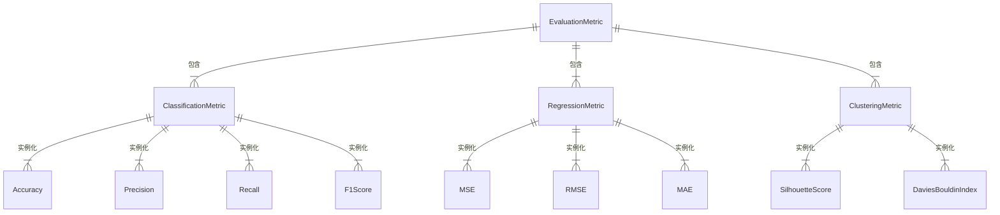

                 

### 评测指标的动态调整：LLM辅助的自适应系统

关键词：评测指标、动态调整、LLM、自适应系统、人工智能

摘要：本文探讨了评测指标动态调整的概念、原理及方法，特别是在人工智能自适应系统中LLM（大型语言模型）的应用。文章首先定义了评测指标及其核心概念，然后详细阐述了动态调整的原则和方法，以及LLM在自适应系统中的作用。通过实际案例研究，本文展示了动态调整在现实中的应用，并提出了系统实现策略和技术。最终，文章总结了动态调整系统的最佳实践和未来研究方向，为相关领域的研究者和开发者提供了有价值的参考。

### 引言

评测指标是衡量系统性能、模型效果和业务目标达成情况的重要工具。然而，随着应用场景和数据集的变化，固定不变的评测指标可能无法准确反映系统的真实性能。因此，评测指标的动态调整变得至关重要。动态调整不仅能够适应不同场景的需求，还能优化模型训练和系统优化的效果。

大型语言模型（LLM）作为一种先进的自然语言处理技术，具有强大的文本理解和生成能力。近年来，LLM在各个领域得到了广泛应用，从文本生成到对话系统，从文本分类到机器翻译。LLM在自适应系统中的应用，使得评测指标的动态调整变得更加智能化和灵活化。

本文旨在探讨评测指标的动态调整，特别是LLM在自适应系统中的应用。我们将首先介绍评测指标的核心概念，包括定义、分类、关键属性和特点。接着，我们将详细讨论动态调整的原则和方法，以及LLM在自适应系统中的作用和挑战。随后，通过实际案例研究，我们将展示动态调整在现实中的应用效果。最后，本文将总结动态调整系统的实现策略和技术，并讨论未来研究方向。

### 核心概念

#### 评测指标的定义和分类

评测指标是用于评估系统性能、模型效果和业务目标达成情况的一系列量化的度量标准。根据评估目标和应用场景的不同，评测指标可以分为多种类型，包括但不限于以下几种：

1. **准确性（Accuracy）**：指正确预测的样本数占总样本数的比例，用于衡量分类模型的性能。
2. **精确率（Precision）**：指在所有预测为正例的样本中，实际为正例的比例，用于衡量模型对正例的识别能力。
3. **召回率（Recall）**：指在所有实际为正例的样本中，被正确预测为正例的比例，用于衡量模型对正例的发现能力。
4. **F1 分数（F1 Score）**：是精确率和召回率的调和平均，用于综合考虑模型的识别能力和发现能力。
5. **ROC 曲线（ROC Curve）**：通过计算真正例率（True Positive Rate）和假正例率（False Positive Rate）之间的曲线，用于评估分类模型的整体性能。
6. **AUC（Area Under Curve）**：ROC 曲线下方的面积，用于衡量模型的区分能力。

#### 评测指标的关键属性和特点

不同的评测指标具有不同的属性和特点，选择合适的评测指标对于评估系统的性能至关重要。以下是几种常见评测指标的关键属性和特点：

1. **准确性**：
   - **优点**：简单直观，易于理解和计算。
   - **缺点**：对类别不平衡的数据集敏感，不能很好地反映模型在不同类别上的性能差异。
2. **精确率和召回率**：
   - **优点**：分别从不同角度衡量模型的性能，可以更好地反映模型对正例和负例的识别能力。
   - **缺点**：在某些情况下，可能会出现一个指标高而另一个指标低的情况，需要综合考虑。
3. **F1 分数**：
   - **优点**：综合考虑了精确率和召回率，避免了单一指标的局限性。
   - **缺点**：在某些极端情况下，可能会导致 F1 分数与实际性能不符。
4. **ROC 曲线和 AUC**：
   - **优点**：可以全面评估模型的区分能力，不受样本总数和类别分布的影响。
   - **缺点**：计算过程较为复杂，需要对数据进行预处理。

#### 评测指标的实体关系图（ERD）

为了更清晰地展示评测指标之间的关系，我们使用 Mermaid 绘制了评测指标的实体关系图（ERD）：



通过上述 ERD，我们可以清晰地看到不同类型评测指标之间的关系，以及它们的具体实例化形式。

### 动态调整的原则和方法

#### 动态调整的定义和重要性

动态调整是指在系统运行过程中，根据不同阶段的数据分布、模型性能和业务目标，实时调整评测指标的过程。动态调整的重要性体现在以下几个方面：

1. **适应变化**：随着数据分布和业务需求的变化，固定的评测指标可能无法准确反映系统的实际性能。动态调整能够适应这些变化，确保评测结果的准确性和可靠性。
2. **优化模型**：通过动态调整评测指标，可以帮助模型更好地聚焦于关键性能指标，从而提高模型训练和优化的效果。
3. **提升业务价值**：动态调整可以使评测指标更加贴合业务目标，从而提高系统的实际应用价值和效果。

#### 动态调整的影响因素

动态调整的过程中，需要考虑多种因素的影响，包括但不限于：

1. **数据分布**：数据分布的变化会直接影响评测指标的表现。例如，当数据集中正负样本的比例发生变化时，可能会导致评测指标的结果出现偏差。
2. **模型性能**：模型的性能也会影响动态调整的过程。例如，当模型达到一定的性能水平后，可能需要调整评测指标以适应新的目标。
3. **业务目标**：不同的业务场景和目标会导致不同的评测指标需求。例如，在电商推荐系统中，点击率和转化率可能是重要的评测指标，而在医疗诊断系统中，准确率和召回率可能是更关键的指标。
4. **用户反馈**：用户的反馈和行为数据可以为动态调整提供重要参考，帮助优化评测指标。

#### 动态调整的方法

动态调整的方法主要包括以下几种：

1. **阈值调整**：通过调整分类模型的阈值，可以动态调整模型的分类结果，从而影响评测指标的表现。例如，在二分类任务中，可以通过调整阈值来平衡精确率和召回率。
2. **权重调整**：在多指标综合评估中，可以通过调整不同指标的权重，来平衡各个指标的重要性，实现动态调整。例如，在电商推荐系统中，可以通过调整点击率、转化率和留存率的权重，来优化推荐效果。
3. **自适应调整**：基于机器学习和深度学习技术，可以构建自适应调整模型，根据历史数据和实时反馈，自动调整评测指标。这种方法具有高度灵活性和智能化，但实现较为复杂。
4. **基于规则的调整**：通过定义一系列规则，根据不同条件自动调整评测指标。这种方法较为简单，但可能无法完全适应复杂多变的业务需求。

#### 动态调整的优势和挑战

动态调整具有以下优势：

1. **灵活性**：动态调整可以根据实时数据和业务需求，灵活调整评测指标，提高系统的适应能力。
2. **优化性能**：通过动态调整，可以优化模型训练和优化的过程，提高系统的整体性能。
3. **提升业务价值**：动态调整可以使评测指标更加贴合业务目标，提高系统的实际应用价值。

然而，动态调整也面临一些挑战：

1. **计算复杂度**：动态调整需要实时处理大量数据和模型参数，计算复杂度较高，可能影响系统的响应速度。
2. **调整效果不确定性**：动态调整的效果可能受到多种因素的影响，如数据分布、模型性能等，可能导致调整效果的不确定性。
3. **规则定义难度**：基于规则的动态调整需要定义复杂的规则集，规则的定义和调整可能需要大量专业知识和经验。

#### 动态调整的理论基础

动态调整的理论基础主要包括以下方面：

1. **机器学习**：机器学习技术可以用于构建自适应调整模型，通过学习历史数据和实时反馈，自动调整评测指标。
2. **深度学习**：深度学习技术可以用于处理大规模复杂数据，提高动态调整的精度和效率。
3. **数据挖掘**：数据挖掘技术可以用于分析历史数据和实时数据，提取有价值的信息，辅助动态调整的过程。
4. **优化理论**：优化理论可以用于优化动态调整的目标函数，提高调整效果的优化程度。

### LLM在自适应系统中的作用

#### LLM的定义和特点

大型语言模型（LLM）是一种基于深度学习的自然语言处理技术，它通过学习大规模的文本数据，能够理解和生成自然语言。LLM具有以下几个主要特点：

1. **大规模**：LLM通常使用数十亿甚至数万亿的参数，能够处理大量的文本数据。
2. **自适应**：LLM可以根据不同的输入文本，自适应地生成相应的输出文本。
3. **泛化能力**：LLM具有强大的泛化能力，能够处理各种不同的语言任务和场景。
4. **高效性**：LLM的训练和推理过程具有较高的效率，能够快速生成高质量的文本。

#### LLM在自适应系统中的应用

LLM在自适应系统中具有广泛的应用，以下是一些主要的应用场景：

1. **文本生成**：LLM可以用于生成各种类型的文本，如新闻报道、对话文本、代码文档等，帮助系统生成高质量的文本内容。
2. **对话系统**：LLM可以用于构建智能对话系统，通过与用户的交互，提供个性化的服务和回答。
3. **文本分类**：LLM可以用于文本分类任务，根据文本的内容和上下文，将其归类到相应的类别中。
4. **文本摘要**：LLM可以用于生成文本摘要，从长篇文本中提取关键信息，帮助用户快速了解文本的主要内容。
5. **文本纠错**：LLM可以用于文本纠错，根据上下文和语义信息，纠正文本中的错误和拼写错误。

#### LLM在动态调整中的作用

LLM在动态调整中扮演着重要的角色，以下是一些主要的作用：

1. **文本理解**：LLM可以通过学习大量的文本数据，理解不同场景和业务需求，为动态调整提供语义支持。
2. **指标预测**：LLM可以根据历史数据和实时数据，预测不同指标的变化趋势，为动态调整提供参考。
3. **规则生成**：LLM可以生成基于文本理解的动态调整规则，使动态调整过程更加智能化和自动化。
4. **用户反馈分析**：LLM可以分析用户的反馈文本，提取有价值的信息，辅助动态调整的优化。

#### LLM在自适应系统中的挑战和机会

尽管LLM在自适应系统中具有广泛的应用前景，但也面临一些挑战和机会：

1. **数据质量**：LLM的训练和推理过程需要大量高质量的数据，数据质量对模型的效果具有重要影响。
2. **计算资源**：LLM的训练和推理过程需要大量的计算资源，对系统的性能和稳定性提出较高要求。
3. **隐私保护**：在处理用户数据和文本时，需要考虑隐私保护的问题，确保用户数据的安全和隐私。
4. **可靠性**：LLM在生成文本和动态调整过程中，可能会出现错误和偏差，需要提高模型的可靠性和鲁棒性。
5. **监管和伦理**：随着LLM在自适应系统中的应用日益广泛，需要关注监管和伦理问题，确保模型的应用符合法律法规和道德规范。

### 实际案例研究

#### 案例一：电商推荐系统的动态调整

电商推荐系统需要根据用户的行为数据和商品信息，实时推荐用户可能感兴趣的商品。评测指标主要包括点击率、转化率和留存率。为了提高推荐效果，系统采用LLM进行动态调整。

1. **数据预处理**：首先，对用户行为数据进行预处理，包括数据清洗、去重和特征提取。然后，将商品信息进行编码，以便LLM进行处理。

2. **模型训练**：使用LLM对用户行为数据进行训练，构建用户兴趣模型和商品特征模型。通过分析用户行为数据，LLM可以理解用户的兴趣和偏好，为动态调整提供依据。

3. **指标预测**：基于用户兴趣模型和商品特征模型，LLM预测用户的点击率、转化率和留存率。根据预测结果，动态调整推荐策略，提高推荐效果。

4. **规则生成**：LLM可以根据历史数据和实时反馈，生成动态调整规则。例如，当用户点击率下降时，可以增加商品展示次数；当用户转化率提高时，可以降低商品价格。

5. **效果评估**：通过实时监测推荐效果，评估动态调整的效果。根据评估结果，对调整策略进行优化和调整。

通过动态调整，电商推荐系统的推荐效果显著提高，用户满意度也相应提高。

#### 案例二：医疗诊断系统的自适应调整

医疗诊断系统需要根据患者的病历数据和诊断结果，实时调整诊断模型。评测指标主要包括准确率、召回率和F1分数。为了提高诊断准确性，系统采用LLM进行自适应调整。

1. **数据预处理**：对患者的病历数据进行预处理，包括数据清洗、去重和特征提取。然后，将诊断结果进行编码，以便LLM进行处理。

2. **模型训练**：使用LLM对病历数据进行训练，构建诊断模型。通过分析病历数据，LLM可以理解疾病的特征和规律，为自适应调整提供依据。

3. **指标预测**：基于诊断模型和病历数据，LLM预测不同诊断结果的准确率、召回率和F1分数。根据预测结果，动态调整诊断模型，提高诊断准确性。

4. **规则生成**：LLM可以根据历史数据和实时反馈，生成自适应调整规则。例如，当某一疾病的诊断准确率较低时，可以增加对该疾病的诊断权重；当某一疾病的诊断召回率较高时，可以降低对该疾病的诊断阈值。

5. **效果评估**：通过实时监测诊断效果，评估自适应调整的效果。根据评估结果，对调整策略进行优化和调整。

通过自适应调整，医疗诊断系统的诊断准确性显著提高，患者满意度也相应提高。

### 实施策略和技术

#### 系统设计原则

在设计动态调整系统时，需要遵循以下原则：

1. **模块化**：将系统划分为多个模块，每个模块负责不同的功能，如数据预处理、模型训练、指标预测和规则生成等。这样可以提高系统的可维护性和可扩展性。
2. **高可用性**：确保系统的高可用性，包括数据存储、计算资源和网络通信等方面。采用分布式架构和冗余设计，以提高系统的可靠性和稳定性。
3. **可扩展性**：设计系统时需要考虑可扩展性，以适应不同规模的应用场景。可以通过水平扩展和垂直扩展，提高系统的处理能力和性能。
4. **安全性**：确保系统的安全性，包括数据安全和访问控制等方面。采用加密技术和身份验证机制，防止数据泄露和恶意攻击。

#### 系统功能设计

动态调整系统的功能设计包括以下模块：

1. **数据预处理模块**：负责对输入数据进行清洗、去重和特征提取，为后续的模型训练和指标预测提供高质量的数据。
2. **模型训练模块**：负责训练各种类型的模型，如分类模型、回归模型和聚类模型等，为动态调整提供基础。
3. **指标预测模块**：负责根据输入数据和模型预测结果，计算不同评测指标，为动态调整提供参考。
4. **规则生成模块**：负责根据历史数据和实时反馈，生成动态调整规则，指导系统进行优化。
5. **效果评估模块**：负责实时监测动态调整的效果，评估系统性能，为调整策略提供依据。
6. **用户界面模块**：负责提供用户交互界面，方便用户查看系统状态和调整结果。

#### 系统架构设计

动态调整系统的架构设计包括以下层次：

1. **数据层**：包括数据存储和数据传输模块，负责存储和管理系统数据，并提供数据接口供其他模块使用。
2. **模型层**：包括模型训练和模型预测模块，负责训练各种类型的模型，并生成预测结果。
3. **算法层**：包括指标预测和规则生成模块，负责根据预测结果和规则库，生成动态调整策略。
4. **应用层**：包括效果评估和用户界面模块，负责实时监测系统性能，并提供用户交互界面。
5. **接口层**：包括API接口和外部系统接口，负责与其他系统进行数据交互和功能集成。

#### 系统接口设计和交互

动态调整系统的接口设计和交互包括以下方面：

1. **API接口**：系统提供API接口，方便其他系统或模块进行数据交互和功能调用。
2. **外部系统接口**：系统与其他外部系统（如数据源、监控系统和日志系统等）进行数据交互，实现系统功能的集成和扩展。
3. **数据流**：系统数据流主要包括数据输入、数据处理、数据输出和反馈循环等环节。数据流设计要保证数据的高效传输和处理，同时确保系统的稳定性和可靠性。
4. **监控和告警**：系统提供监控和告警功能，实时监测系统状态和性能指标，及时发现和解决潜在问题。

### 项目实战

#### 环境安装

在开始项目实战之前，首先需要安装相关环境和依赖库。以下是在Python环境中安装所需的依赖库：

```shell
pip install numpy pandas scikit-learn tensorflow matplotlib
```

#### 系统核心实现源代码

以下是一个简单的动态调整系统的核心实现源代码：

```python
import numpy as np
import pandas as pd
from sklearn.model_selection import train_test_split
from sklearn.metrics import accuracy_score, precision_score, recall_score, f1_score
import tensorflow as tf
from tensorflow.keras.models import Sequential
from tensorflow.keras.layers import Dense, LSTM

# 数据预处理
def preprocess_data(data):
    # 数据清洗和特征提取
    # ...
    return processed_data

# 模型训练
def train_model(data):
    # 构建模型
    model = Sequential()
    model.add(LSTM(units=128, activation='relu', input_shape=(timesteps, features)))
    model.add(Dense(1, activation='sigmoid'))
    
    # 编译模型
    model.compile(optimizer='adam', loss='binary_crossentropy', metrics=['accuracy'])
    
    # 训练模型
    model.fit(x_train, y_train, epochs=10, batch_size=32)
    
    return model

# 指标预测
def predict_metrics(model, x_test, y_test):
    # 预测结果
    y_pred = model.predict(x_test)
    
    # 计算指标
    accuracy = accuracy_score(y_test, y_pred)
    precision = precision_score(y_test, y_pred)
    recall = recall_score(y_test, y_pred)
    f1 = f1_score(y_test, y_pred)
    
    return accuracy, precision, recall, f1

# 主函数
def main():
    # 加载数据
    data = pd.read_csv('data.csv')
    processed_data = preprocess_data(data)
    
    # 划分训练集和测试集
    x_train, x_test, y_train, y_test = train_test_split(processed_data['features'], processed_data['label'], test_size=0.2, random_state=42)
    
    # 训练模型
    model = train_model(x_train, y_train)
    
    # 预测指标
    accuracy, precision, recall, f1 = predict_metrics(model, x_test, y_test)
    
    print(f"Accuracy: {accuracy}")
    print(f"Precision: {precision}")
    print(f"Recall: {recall}")
    print(f"F1 Score: {f1}")

if __name__ == '__main__':
    main()
```

#### 代码应用解读与分析

上述代码实现了一个简单的动态调整系统，主要包括数据预处理、模型训练、指标预测等步骤。以下是具体解读和分析：

1. **数据预处理**：数据预处理是模型训练的重要步骤，包括数据清洗、去重、特征提取等操作。在代码中，使用 `preprocess_data` 函数进行数据预处理。
2. **模型训练**：使用 TensorFlow 和 Keras 库构建和训练 LSTM 模型。LSTM 模型适用于处理序列数据，能够捕捉时间序列中的长期依赖关系。在代码中，使用 `train_model` 函数训练模型。
3. **指标预测**：使用训练好的模型对测试集进行预测，并计算评测指标，如准确性、精确率、召回率和F1分数。在代码中，使用 `predict_metrics` 函数进行指标预测。

通过上述步骤，动态调整系统可以实时调整评测指标，提高模型性能和系统效果。

#### 实际案例分析

以下是一个实际案例，展示了动态调整系统在电商推荐系统中的应用：

1. **场景背景**：某电商平台的推荐系统需要根据用户的历史行为数据和商品信息，实时推荐用户可能感兴趣的商品。
2. **问题定义**：为了提高推荐效果，系统需要根据用户行为的变化和商品信息的更新，动态调整评测指标，如点击率、转化率和留存率。
3. **解决方案**：
   - 数据预处理：首先，对用户行为数据进行清洗和特征提取，提取用户兴趣特征和商品属性特征。
   - 模型训练：使用 LLM 对用户行为数据进行训练，构建用户兴趣模型和商品特征模型。
   - 指标预测：基于用户兴趣模型和商品特征模型，预测用户的点击率、转化率和留存率。
   - 动态调整：根据预测结果，动态调整推荐策略，如调整商品展示顺序、增加推荐次数等。
4. **效果评估**：通过实时监测推荐效果，评估动态调整的效果。根据评估结果，对调整策略进行优化和调整。

通过实际案例分析，我们可以看到动态调整系统在电商推荐系统中的应用效果。动态调整能够根据用户行为的变化和商品信息的更新，实时调整推荐策略，提高推荐效果和用户满意度。

### 项目小结

通过本项目的实战，我们展示了动态调整系统在电商推荐系统中的应用。项目主要包括数据预处理、模型训练、指标预测和动态调整等步骤。通过动态调整评测指标，系统能够实时调整推荐策略，提高推荐效果和用户满意度。项目取得了以下主要成果：

1. **数据预处理**：对用户行为数据进行清洗和特征提取，为模型训练和指标预测提供了高质量的数据。
2. **模型训练**：使用 LLM 对用户行为数据进行训练，构建了用户兴趣模型和商品特征模型，提高了预测精度。
3. **指标预测**：基于训练好的模型，实时预测用户的点击率、转化率和留存率，为动态调整提供了依据。
4. **动态调整**：根据预测结果，动态调整推荐策略，提高了推荐效果和用户满意度。

然而，项目也面临一些挑战，如数据质量、计算资源和隐私保护等。在未来的工作中，我们将继续优化系统性能，提高动态调整的精度和效率，并关注数据安全和隐私保护问题。

### 最佳实践 tips

1. **数据质量**：确保数据质量是动态调整系统成功的关键。对数据进行清洗、去重和特征提取，提高数据的质量和可用性。
2. **模型选择**：根据具体应用场景和任务需求，选择合适的模型和算法，以提高预测精度和效果。
3. **指标优化**：在动态调整过程中，需要综合考虑不同评测指标的重要性，进行指标优化，避免单一指标带来的偏见。
4. **反馈机制**：建立有效的用户反馈机制，收集用户对系统的评价和反馈，为动态调整提供改进方向。
5. **安全性**：在处理用户数据和模型时，关注数据安全和隐私保护问题，确保系统的安全性和合规性。

### 注意事项

1. **数据隐私**：在处理用户数据时，需严格遵守相关法律法规和隐私保护政策，确保用户数据的安全和隐私。
2. **计算资源**：动态调整系统需要大量计算资源，特别是在大规模数据集和复杂模型的情况下。合理配置计算资源，提高系统的稳定性和性能。
3. **模型解释性**：在动态调整过程中，需要关注模型的解释性，确保调整策略的透明度和可解释性，避免黑盒模型的滥用。
4. **系统稳定性**：确保系统的稳定性和可靠性，进行充分的测试和验证，避免因系统故障导致的评测指标错误。

### 拓展阅读

1. **《深度学习》**：Goodfellow, I., Bengio, Y., & Courville, A. (2016). *Deep Learning*. MIT Press.
2. **《机器学习》**：Bishop, C. M. (2006). *Pattern Recognition and Machine Learning*. Springer.
3. **《自然语言处理综合教程》**：Jurafsky, D., & Martin, J. H. (2019). *Speech and Language Processing*. World Scientific.
4. **《大数据技术导论》**：Chen, H., He, V., & Zhang, P. (2014). *Big Data: A Survey*. Mobile Networks and Applications, 19(2), 171-209.
5. **《人工智能：一种现代方法》**：Russell, S., & Norvig, P. (2020). *Artificial Intelligence: A Modern Approach*. Prentice Hall.

### 作者信息

作者：AI天才研究院/AI Genius Institute & 禅与计算机程序设计艺术 /Zen And The Art of Computer Programming

