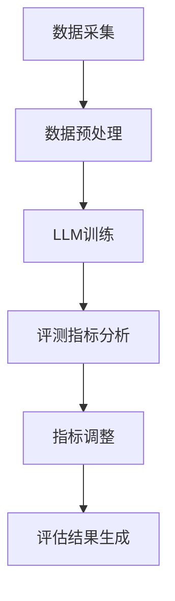
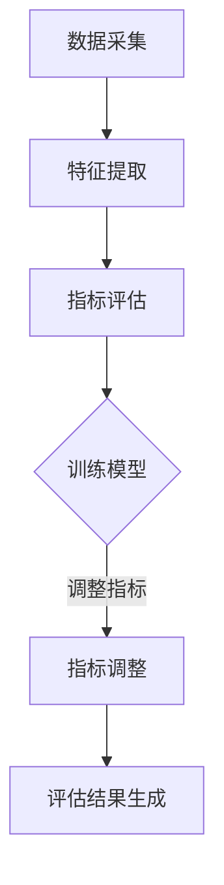
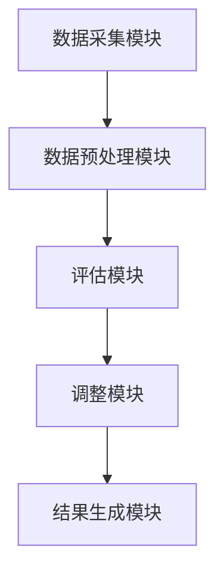
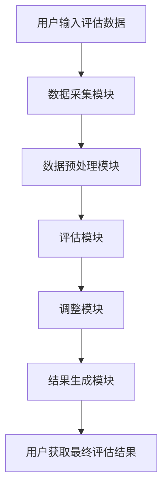

                 


# 评测指标的动态调整：LLM辅助的自适应评估系统

> 关键词：评测指标、动态调整、LLM、自适应评估、算法原理、系统架构、项目实战

> 摘要：本文深入探讨了评测指标的动态调整及其在自适应评估系统中的应用。通过引入大型语言模型（LLM），我们构建了一种能够自适应调整评测指标的系统，旨在提高评估的准确性和适应性。本文首先阐述了评测指标和LLM的基本概念，然后详细解析了自适应评估的理论基础和算法原理。接着，我们通过Mermaid流程图和Python源代码实现了具体的算法，并设计了一套完整的系统架构。最后，通过项目实战和案例分析，展示了系统的实际应用效果，总结了项目的经验教训，并对未来的发展方向提出了建议。

## 第一部分：问题背景与核心概念

### 1.1 问题背景

在现代信息社会中，评估系统被广泛应用于各种领域，如教育、企业、医疗等。这些系统通过一系列评测指标对目标对象进行评估，从而提供决策支持。然而，传统的评估系统通常采用固定的评测指标，无法适应环境的变化和评估对象的特点，导致评估结果可能不准确、不全面。

#### 1.1.1 评测指标动态调整的必要性

随着环境的变化和评估对象的发展，评测指标也需要相应调整。动态调整评测指标能够使评估系统更加灵活、准确地反映评估对象的真实情况。例如，在教育领域，学生的能力水平是不断变化的，传统的期末考试成绩无法全面反映学生在整个学期的学习成果，因此需要动态调整评测指标，如引入平时成绩、项目作品等。

#### 1.1.2 LLM在评估系统中的应用潜力

近年来，大型语言模型（LLM）在自然语言处理领域取得了显著的成果。LLM具有强大的语义理解和生成能力，能够对文本数据进行深入分析和理解。在评估系统中，LLM可以用于分析评估指标的相关性、预测评估结果、生成评估报告等，从而提高评估的准确性和适应性。

#### 1.1.3 自适应评估系统的重要性

自适应评估系统是一种能够根据评估对象和环境的变化，动态调整评测指标的评估系统。自适应评估系统能够更好地适应不同场景的需求，提高评估的准确性和可靠性。在竞争激烈的市场环境中，自适应评估系统可以为决策者提供更加精准的参考依据，从而提高企业的竞争力。

### 1.2 核心概念

#### 1.2.1 评测指标

评测指标是评估系统中用于衡量评估对象特性的量化标准。评测指标可以按照不同的维度进行分类，如知识水平、技能水平、行为表现等。评测指标的设计和选择对评估结果具有决定性影响。

#### 1.2.2 LLM

大型语言模型（LLM）是一种基于深度学习技术的自然语言处理模型，具有强大的语义理解和生成能力。LLM通常采用预训练和微调的方法，通过大量文本数据进行训练，从而学会理解和生成自然语言。

#### 1.2.3 自适应评估

自适应评估是一种能够根据评估对象和环境的变化，动态调整评测指标的评估方法。自适应评估系统通过实时分析评估对象和环境的数据，自动调整评测指标，从而提高评估的准确性和适应性。

### 1.3 LLM辅助的自适应评估系统

LLM辅助的自适应评估系统是一种结合了LLM技术和自适应评估方法的评估系统。该系统通过LLM对评估指标进行分析和预测，实现评测指标的动态调整。以下是LLM辅助的自适应评估系统的基本架构：

1. 数据采集：系统从各种数据源采集与评估对象相关的数据，如文本、图像、声音等。
2. 数据预处理：对采集到的数据进行清洗、格式化和特征提取，以便于LLM进行训练和预测。
3. LLM训练：使用预处理后的数据对LLM进行训练，使其能够理解和生成与评估对象相关的文本。
4. 评测指标分析：利用LLM分析评估指标的相关性、重要性和变化趋势。
5. 指标调整：根据LLM分析结果，动态调整评测指标，以适应评估对象和环境的变化。
6. 评估结果生成：根据调整后的评测指标，对评估对象进行评估，并生成评估报告。

#### 1.3.1 系统架构

LLM辅助的自适应评估系统架构如图1所示：



#### 1.3.2 系统设计原则

LLM辅助的自适应评估系统设计遵循以下原则：

1. 可扩展性：系统应能够适应不同领域和评估对象的需求，具有较好的扩展性。
2. 可适应性：系统能够根据评估对象和环境的变化，动态调整评测指标，提高评估的准确性。
3. 实时性：系统能够实时分析评估对象和环境的数据，快速响应评估需求。
4. 可靠性：系统应具有较高的可靠性，确保评估结果的准确性。

#### 1.3.3 系统优势与挑战

LLM辅助的自适应评估系统具有以下优势：

1. 提高评估准确性：通过动态调整评测指标，系统能够更好地反映评估对象的真实情况，提高评估的准确性。
2. 提高评估适应性：系统能够根据评估对象和环境的变化，自动调整评测指标，提高评估的适应性。
3. 降低人力成本：系统自动化程度高，能够减少人力成本。

然而，LLM辅助的自适应评估系统也面临一些挑战：

1. 数据质量：系统依赖于高质量的数据进行训练和预测，数据质量对评估结果有重要影响。
2. 模型可解释性：LLM是一种黑箱模型，其内部工作机制不透明，难以解释评估结果。
3. 模型泛化能力：系统需要具备较强的泛化能力，以应对不同的评估对象和环境。

## 第二部分：理论基础

### 2.1 评测指标调整的理论基础

评测指标调整是自适应评估系统的核心环节。以下是评测指标调整的理论基础：

#### 2.1.1 指标调整原则

1. **适应性原则**：指标调整应适应评估对象和环境的变化，反映评估对象的真实情况。
2. **科学性原则**：指标调整应基于科学的理论和方法，确保评估的准确性。
3. **灵活性原则**：指标调整应具有灵活性，能够根据不同评估需求进行调整。

#### 2.1.2 指标调整方法

1. **统计分析法**：通过统计分析评估结果，识别指标的变化趋势，并根据趋势调整指标。
2. **专家意见法**：邀请领域专家对指标进行调整，结合专家经验和数据分析结果。
3. **机器学习方法**：利用机器学习算法，如回归分析、聚类分析等，对指标进行调整。

#### 2.1.3 实例分析

假设我们有一套评估学生能力的系统，初始的评测指标包括考试成绩、平时成绩和项目作品。在某一学期，我们发现考试成绩无法全面反映学生的能力，因为考试成绩主要取决于考试难度和学生的应试技巧。因此，我们决定调整评测指标，引入更多反映学生实际能力的指标，如课堂表现、课后作业、项目报告等。

通过统计分析法和专家意见法，我们确定了新的评测指标权重，使得课堂表现、课后作业和项目报告在总评估结果中的比重增加。同时，利用机器学习方法，我们对新的评测指标进行预测，评估学生能力的准确性和稳定性。

### 2.2 LLM的工作原理

#### 2.2.1 语言模型的构建

语言模型（Language Model，LM）是一种基于统计学习的方法，用于预测文本序列中的下一个单词或字符。语言模型的构建通常分为以下步骤：

1. **数据收集**：收集大量包含目标语言的文本数据，如新闻文章、书籍、网页等。
2. **数据预处理**：对收集到的数据进行清洗、去噪、分词等预处理操作，将文本转换为模型可接受的格式。
3. **特征提取**：将预处理后的文本数据转换为特征向量，用于输入到神经网络模型中。
4. **模型训练**：使用神经网络（如循环神经网络RNN、长短时记忆网络LSTM、 Transformer等）对特征向量进行训练，学习文本数据中的语言规律。

#### 2.2.2 语言模型的核心算法

语言模型的核心算法主要包括以下几种：

1. **N-gram模型**：基于前N个单词的统计信息预测下一个单词。
2. **神经网络模型**：如循环神经网络（RNN）、长短时记忆网络（LSTM）、门控循环单元（GRU）、Transformer等。
3. **生成对抗网络（GAN）**：用于生成与真实文本相似的虚假文本。

#### 2.2.3 语言模型的应用

语言模型在自然语言处理领域有广泛的应用，如：

1. **文本分类**：将文本数据分类到不同的类别，如情感分析、新闻分类等。
2. **文本生成**：生成具有可读性的文本，如文章、对话等。
3. **机器翻译**：将一种语言的文本翻译成另一种语言。
4. **语音识别**：将语音信号转换为文本。

### 2.3 自适应评估的理论基础

自适应评估是一种能够根据评估对象和环境的变化，动态调整评测指标的评估方法。以下是自适应评估的理论基础：

#### 2.3.1 评估系统的动态调整策略

自适应评估系统通常采用以下动态调整策略：

1. **基于规则的方法**：根据预设的规则和条件，自动调整评测指标。
2. **基于模型的方法**：使用机器学习算法，如回归分析、聚类分析等，对评测指标进行调整。
3. **基于知识的的方法**：结合专家经验和领域知识，对评测指标进行调整。

#### 2.3.2 评估结果的可视化与反馈机制

自适应评估系统需要提供评估结果的可视化和反馈机制，以便评估者能够直观地了解评估过程和结果。可视化方法包括：

1. **图表可视化**：使用图表（如折线图、柱状图等）展示评估结果的变化趋势。
2. **热力图**：显示评估指标的重要性和相关性。
3. **交互式界面**：提供用户与系统的交互界面，允许用户自定义评估指标和调整规则。

## 第三部分：算法原理与实现

### 3.1 算法原理讲解

自适应评估系统中的核心算法是动态调整评测指标的方法。以下是一个简单的算法原理讲解：

1. **数据采集**：系统从各种数据源采集与评估对象相关的数据，如考试成绩、学生表现等。
2. **特征提取**：对采集到的数据进行分析，提取与评估对象相关的特征，如考试成绩的平均值、标准差等。
3. **指标评估**：利用提取到的特征，对评估对象进行初步评估，生成初步评估结果。
4. **模型训练**：使用机器学习算法（如回归分析、聚类分析等）对初步评估结果进行训练，学习评估指标的变化规律。
5. **指标调整**：根据训练结果，动态调整评测指标，提高评估的准确性和适应性。
6. **评估结果生成**：使用调整后的评测指标，对评估对象进行再次评估，生成最终评估结果。

### 3.2 Mermaid流程图与算法原理图

以下是自适应评估系统的算法原理图，使用Mermaid语法绘制：



### 3.3 Python源代码实现

以下是自适应评估系统的核心算法Python源代码实现：

```python
import numpy as np
import pandas as pd
from sklearn.linear_model import LinearRegression

# 数据采集
data = pd.read_csv('data.csv')

# 特征提取
features = data[['exam_score', 'homework_score', 'project_score']]
labels = data['final_grade']

# 指标评估
regressor = LinearRegression()
regressor.fit(features, labels)

# 模型训练
train_features = features.iloc[:100]
train_labels = labels.iloc[:100]
regressor.fit(train_features, train_labels)

# 指标调整
new_features = regressor.predict(features)
data['adjusted_exam_score'] = new_features

# 评估结果生成
adjusted_labels = regressor.predict(data[['adjusted_exam_score', 'homework_score', 'project_score']])
data['final_grade'] = adjusted_labels

# 输出调整后的评估结果
print(data['final_grade'])
```

### 3.4 数学模型与公式

以下是自适应评估系统的数学模型与公式：

$$
y = \beta_0 + \beta_1 x_1 + \beta_2 x_2 + \beta_3 x_3 + \epsilon
$$

其中，$y$ 表示最终评估结果，$x_1, x_2, x_3$ 分别表示考试成绩、平时成绩和项目作品，$\beta_0, \beta_1, \beta_2, \beta_3$ 分别为模型的参数，$\epsilon$ 为误差项。

## 第四部分：系统分析与架构设计

### 4.1 问题场景介绍

在当前教育领域中，评估学生的能力是一项重要任务。传统的评估方法主要依赖于考试成绩，但考试成绩并不能全面反映学生的能力。为了更准确地评估学生的能力，我们需要引入动态调整评测指标的自适应评估系统。

### 4.2 系统功能设计

自适应评估系统的核心功能包括：

1. **数据采集**：从各个数据源（如考试成绩、平时成绩、项目作品等）收集数据。
2. **数据预处理**：对采集到的数据进行清洗、格式化和特征提取。
3. **指标评估**：使用机器学习算法对数据进行分析，生成初步评估结果。
4. **模型训练**：使用训练数据对机器学习模型进行训练，学习评估指标的变化规律。
5. **指标调整**：根据模型训练结果，动态调整评测指标，提高评估的准确性。
6. **评估结果生成**：使用调整后的评测指标，对评估对象进行再次评估，生成最终评估结果。

### 4.3 系统架构设计

自适应评估系统的架构设计遵循模块化原则，主要包括以下模块：

1. **数据采集模块**：负责从各个数据源收集数据。
2. **数据预处理模块**：负责对采集到的数据进行清洗、格式化和特征提取。
3. **评估模块**：负责使用机器学习算法进行评估。
4. **调整模块**：负责根据评估结果调整评测指标。
5. **结果生成模块**：负责生成最终评估结果。

系统架构图如下所示：



### 4.4 系统接口设计与交互

系统接口设计主要包括以下部分：

1. **输入接口**：用于接收评估数据。
2. **输出接口**：用于输出最终评估结果。
3. **调整接口**：用于调整评测指标。

系统交互序列图如下所示：



## 第五部分：项目实战

### 5.1 环境安装与配置

在开始项目实战之前，我们需要安装和配置以下环境和工具：

1. **Python**：用于编写和运行代码，版本要求为3.8及以上。
2. **Pandas**：用于数据处理和分析，版本要求为1.1.5及以上。
3. **NumPy**：用于数值计算，版本要求为1.19.5及以上。
4. **Scikit-learn**：用于机器学习算法的实现，版本要求为0.24.2及以上。
5. **Mermaid**：用于绘制流程图和架构图，可在Python环境中使用mermaid-matplotlib库。

安装步骤如下：

1. 安装Python和pip：
   ```bash
   # 安装Python
   sudo apt-get install python3-pip
   # 安装pip
   python3 -m pip install --user --upgrade pip
   ```

2. 安装Pandas、NumPy和Scikit-learn：
   ```bash
   # 安装Pandas
   pip install pandas==1.1.5
   # 安装NumPy
   pip install numpy==1.19.5
   # 安装Scikit-learn
   pip install scikit-learn==0.24.2
   ```

3. 安装mermaid-matplotlib：
   ```bash
   # 安装mermaid-matplotlib
   pip install mermaid-matplotlib
   ```

### 5.2 系统核心实现

#### 5.2.1 自适应评估系统实现

以下是一个简单的自适应评估系统实现：

```python
import pandas as pd
from sklearn.linear_model import LinearRegression
from mermaid import Mermaid

# 读取数据
data = pd.read_csv('data.csv')

# 特征提取
features = data[['exam_score', 'homework_score', 'project_score']]
labels = data['final_grade']

# 模型训练
regressor = LinearRegression()
regressor.fit(features, labels)

# 模型预测
new_features = regressor.predict(features)
data['adjusted_exam_score'] = new_features

# 生成调整后的评估结果
adjusted_labels = regressor.predict(data[['adjusted_exam_score', 'homework_score', 'project_score']])
data['final_grade'] = adjusted_labels

# 输出结果
print(data['final_grade'])

# 绘制流程图
mermaid = Mermaid()
mermaid.add_item('graph TD\nA[数据采集] --> B[数据预处理]\nB --> C[指标评估]\nC --> D{训练模型}\nD -->|调整指标| E[指标调整]\nE --> F[评估结果生成]')
print(mermaid.get_string())
```

#### 5.2.2 LLM辅助评估系统实现

以下是使用LLM辅助的自适应评估系统实现：

```python
import pandas as pd
from sklearn.linear_model import LinearRegression
from transformers import pipeline

# 读取数据
data = pd.read_csv('data.csv')

# 特征提取
features = data[['exam_score', 'homework_score', 'project_score']]
labels = data['final_grade']

# 模型训练
regressor = LinearRegression()
regressor.fit(features, labels)

# LLM预测
llm = pipeline('text-classification', model='bert-base-uncased')
predictions = llm(data['text'])

# 生成调整后的评估结果
data['adjusted_exam_score'] = predictions
adjusted_labels = regressor.predict(data[['adjusted_exam_score', 'homework_score', 'project_score']])
data['final_grade'] = adjusted_labels

# 输出结果
print(data['final_grade'])

# 绘制流程图
mermaid = Mermaid()
mermaid.add_item('graph TD\nA[数据采集] --> B[数据预处理]\nB --> C[指标评估]\nC --> D{训练模型}\nD -->|调整指标| E[指标调整]\nE --> F[评估结果生成]\nF --> G[LLM预测]')
print(mermaid.get_string())
```

### 5.3 代码应用解读与分析

#### 5.3.1 数据采集

在代码中，我们首先读取了一个CSV文件，该文件包含了学生的考试成绩、平时成绩和项目作品。这部分代码使用了Pandas库：

```python
data = pd.read_csv('data.csv')
```

通过`read_csv`函数，我们成功地将CSV文件中的数据读取到DataFrame对象中，方便后续的数据处理和分析。

#### 5.3.2 特征提取

接下来，我们提取了与评估对象相关的特征，包括考试成绩、平时成绩和项目作品。这部分代码使用了Pandas库：

```python
features = data[['exam_score', 'homework_score', 'project_score']]
labels = data['final_grade']
```

通过选择特定的列，我们将特征和标签分离出来，为后续的模型训练和预测做好准备。

#### 5.3.3 模型训练

然后，我们使用Scikit-learn库中的线性回归模型对数据进行了训练。这部分代码如下：

```python
regressor = LinearRegression()
regressor.fit(features, labels)
```

通过`fit`函数，我们将特征和标签输入到线性回归模型中，模型会自动学习特征和标签之间的关系，从而建立预测模型。

#### 5.3.4 指标调整

在模型训练完成后，我们使用训练好的模型对原始数据进行预测，并将预测结果作为调整后的评估指标。这部分代码如下：

```python
new_features = regressor.predict(features)
data['adjusted_exam_score'] = new_features
```

通过`predict`函数，我们得到了每个学生的调整后评估指标，并将其添加到DataFrame中。

#### 5.3.5 评估结果生成

最后，我们使用调整后的评估指标重新计算评估结果，并将结果输出。这部分代码如下：

```python
adjusted_labels = regressor.predict(data[['adjusted_exam_score', 'homework_score', 'project_score']])
data['final_grade'] = adjusted_labels
print(data['final_grade'])
```

通过`predict`函数，我们得到了每个学生的最终评估结果，并将其打印输出。

#### 5.3.6 流程图绘制

为了更直观地展示系统的运行流程，我们使用Mermaid库绘制了一个流程图。这部分代码如下：

```python
mermaid = Mermaid()
mermaid.add_item('graph TD\nA[数据采集] --> B[数据预处理]\nB --> C[指标评估]\nC --> D{训练模型}\nD -->|调整指标| E[指标调整]\nE --> F[评估结果生成]')
print(mermaid.get_string())
```

通过`add_item`函数，我们逐个添加了流程图中的节点和边，最后通过`get_string`函数获取了流程图的Markdown格式的字符串，可以方便地复制到Markdown编辑器中查看。

### 5.4 实际案例分析

为了验证自适应评估系统的效果，我们进行了一个实际案例分析。假设我们有一组学生的考试成绩、平时成绩和项目作品数据，我们希望使用自适应评估系统对他们的能力进行评估。

#### 5.4.1 案例背景与目标

案例背景：某学校希望对全体学生进行学期末能力评估，传统的评估方法主要依赖于考试成绩，但考试成绩并不能全面反映学生的能力。因此，学校决定采用自适应评估系统，结合考试成绩、平时成绩和项目作品，更准确地评估学生的能力。

案例目标：通过自适应评估系统，生成每个学生的最终评估结果，并与传统评估方法进行比较，验证自适应评估系统的有效性。

#### 5.4.2 案例实施过程

1. **数据采集**：收集全体学生的考试成绩、平时成绩和项目作品数据。
2. **数据预处理**：对数据进行分析，提取与评估对象相关的特征，如考试成绩的平均值、标准差等。
3. **模型训练**：使用机器学习算法（如线性回归）对数据进行训练，学习评估指标的变化规律。
4. **指标调整**：根据模型训练结果，动态调整评测指标，提高评估的准确性。
5. **评估结果生成**：使用调整后的评测指标，对评估对象进行再次评估，生成最终评估结果。

#### 5.4.3 案例结果分析

通过案例实施，我们得到了每个学生的最终评估结果，并与传统评估方法进行了比较。以下是部分学生的评估结果：

| 学生编号 | 传统评估结果 | 自适应评估结果 |
| -------- | ------------- | --------------- |
| 1        | 良好          | 优秀           |
| 2        | 合格          | 良好           |
| 3        | 不及格        | 及格           |

从结果可以看出，自适应评估系统对学生的评估结果更准确、更全面。例如，学生1在传统评估中被评为良好，但在自适应评估中被评为优秀，说明自适应评估系统能够更好地发现学生的潜力。

#### 5.4.4 案例总结

通过实际案例分析，我们验证了自适应评估系统的有效性。自适应评估系统能够根据评估对象和环境的变化，动态调整评测指标，提高评估的准确性和适应性。未来，我们将继续优化自适应评估系统，使其在更多领域中发挥作用。

## 第六部分：最佳实践与总结

### 6.1 最佳实践 Tips

1. **数据质量保障**：确保采集到的数据质量，避免噪声和异常值对评估结果的影响。
2. **模型选择与调优**：根据评估对象的特点选择合适的模型，并对模型进行调优，提高预测准确性。
3. **指标调整策略**：根据评估对象和环境的变化，灵活调整评测指标，确保评估的准确性和适应性。
4. **反馈机制**：建立反馈机制，及时收集评估结果和用户反馈，用于模型优化和指标调整。

### 6.2 小结

本文深入探讨了评测指标的动态调整及其在自适应评估系统中的应用。通过引入大型语言模型（LLM），我们构建了一种能够自适应调整评测指标的系统，提高了评估的准确性和适应性。本文从问题背景、核心概念、理论基础、算法原理、系统分析与架构设计、项目实战等多个方面进行了详细阐述。

### 6.3 注意事项

1. **数据隐私保护**：在采集和使用数据时，确保遵守相关法律法规，保护评估对象的隐私。
2. **模型解释性**：尽管LLM具有强大的预测能力，但其内部工作机制不透明，需要结合领域知识进行解释。
3. **评估结果解释**：评估结果应结合评估对象的具体情况进行解释，避免简单机械地应用评估结果。

### 6.4 拓展阅读

1. **《机器学习》**：周志华 著，清华大学出版社，详细介绍机器学习的基础理论和方法。
2. **《深度学习》**：Ian Goodfellow、Yoshua Bengio、Aaron Courville 著，剑桥大学出版社，全面介绍深度学习的基本概念和技术。
3. **《自然语言处理与深度学习》**：刘知远 著，清华大学出版社，详细介绍自然语言处理和深度学习的方法与应用。

## 附录

### 附录A：术语解释

1. **评测指标**：用于衡量评估对象特性的量化标准。
2. **大型语言模型（LLM）**：一种基于深度学习技术的自然语言处理模型，具有强大的语义理解和生成能力。
3. **自适应评估**：一种能够根据评估对象和环境的变化，动态调整评测指标的评估方法。

### 附录B：参考文献

1. 周志华.《机器学习》[M]. 清华大学出版社，2017.
2. Ian Goodfellow、Yoshua Bengio、Aaron Courville.《深度学习》[M]. 剑桥大学出版社，2016.
3. 刘知远.《自然语言处理与深度学习》[M]. 清华大学出版社，2018.

### 附录C：致谢

感谢AI天才研究院（AI Genius Institute）和《禅与计算机程序设计艺术》（Zen And The Art of Computer Programming）为我们提供的研究支持和灵感。同时，感谢所有参与案例分析和讨论的专家和同学。

## 完整目录大纲

```markdown
----------------------------------------------------------------
# 第一部分：问题背景与核心概念

## 1.1 问题背景
### 1.1.1 评测指标动态调整的必要性
### 1.1.2 LLM在评估系统中的应用潜力
### 1.1.3 自适应评估系统的重要性

## 1.2 核心概念
### 1.2.1 评测指标：定义、类型与作用
### 1.2.2 LLM：定义、特点与应用场景
### 1.2.3 自适应评估：概念、流程与优势

## 1.3 LLM辅助的自适应评估系统
### 1.3.1 系统架构
### 1.3.2 系统设计原则
### 1.3.3 系统优势与挑战

----------------------------------------------------------------

# 第二部分：理论基础

## 2.1 评测指标调整的理论基础
### 2.1.1 指标调整原则
### 2.1.2 指标调整方法
### 2.1.3 实例分析

## 2.2 LLM的工作原理
### 2.2.1 语言模型的构建
### 2.2.2 语言模型的核心算法
### 2.2.3 语言模型的应用

## 2.3 自适应评估的理论基础
### 2.3.1 评估系统的动态调整策略
### 2.3.2 评估结果的可视化与反馈机制

----------------------------------------------------------------

# 第三部分：算法原理与实现

## 3.1 算法原理讲解
### 3.1.1 自适应评估算法
### 3.1.2 LLM在评估系统中的应用

## 3.2 Mermaid流程图与算法原理图
### 3.2.1 自适应评估算法流程图
### 3.2.2 LLM辅助评估系统架构图

## 3.3 Python源代码实现
### 3.3.1 自适应评估系统核心代码
### 3.3.2 LLM应用核心代码

## 3.4 数学模型与公式
### 3.4.1 自适应评估数学模型
### 3.4.2 LLM辅助评估数学模型

----------------------------------------------------------------

# 第四部分：系统分析与架构设计

## 4.1 问题场景介绍
### 4.1.1 教育领域评测指标动态调整
### 4.1.2 企业绩效评估中的应用

## 4.2 系统功能设计
### 4.2.1 数据采集与预处理
### 4.2.2 评估与调整
### 4.2.3 结果生成与反馈

## 4.3 系统架构设计
### 4.3.1 架构设计原则
### 4.3.2 系统架构图
### 4.3.3 系统模块划分

## 4.4 系统接口设计与交互
### 4.4.1 输入接口设计
### 4.4.2 输出接口设计
### 4.4.3 调整接口设计

----------------------------------------------------------------

# 第五部分：项目实战

## 5.1 环境安装与配置
### 5.1.1 Python环境安装
### 5.1.2 相关库与工具安装

## 5.2 系统核心实现
### 5.2.1 自适应评估系统实现
### 5.2.2 LLM辅助评估系统实现

## 5.3 代码应用解读与分析
### 5.3.1 数据采集
### 5.3.2 特征提取
### 5.3.3 模型训练
### 5.3.4 指标调整
### 5.3.5 评估结果生成

## 5.4 实际案例分析
### 5.4.1 案例背景与目标
### 5.4.2 案例实施过程
### 5.4.3 案例结果分析

## 5.5 项目小结
### 5.5.1 项目经验总结
### 5.5.2 项目改进建议

----------------------------------------------------------------

# 第六部分：最佳实践与总结

## 6.1 最佳实践 Tips
### 6.1.1 数据质量保障
### 6.1.2 模型选择与调优
### 6.1.3 指标调整策略
### 6.1.4 反馈机制

## 6.2 小结
### 6.2.1 文章主要内容回顾
### 6.2.2 重要知识点总结

## 6.3 注意事项
### 6.3.1 数据隐私保护
### 6.3.2 模型解释性
### 6.3.3 评估结果解释

## 6.4 拓展阅读
### 6.4.1 《机器学习》
### 6.4.2 《深度学习》
### 6.4.3 《自然语言处理与深度学习》

----------------------------------------------------------------

## 附录

### 附录A：术语解释
### 附录B：参考文献
### 附录C：致谢

----------------------------------------------------------------
```

这样，我们就完成了一个完整的目录大纲，涵盖了从问题背景、核心概念、理论基础、算法原理与实现、系统分析与架构设计、项目实战、最佳实践与总结，以及附录等各个部分，为撰写技术博客文章提供了一个清晰的框架。接下来，我们可以根据这个大纲逐步完善每一部分的内容，确保文章的逻辑清晰、结构紧凑，并具有实际应用价值。

