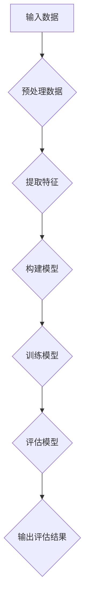
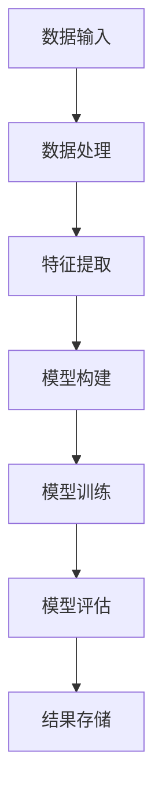
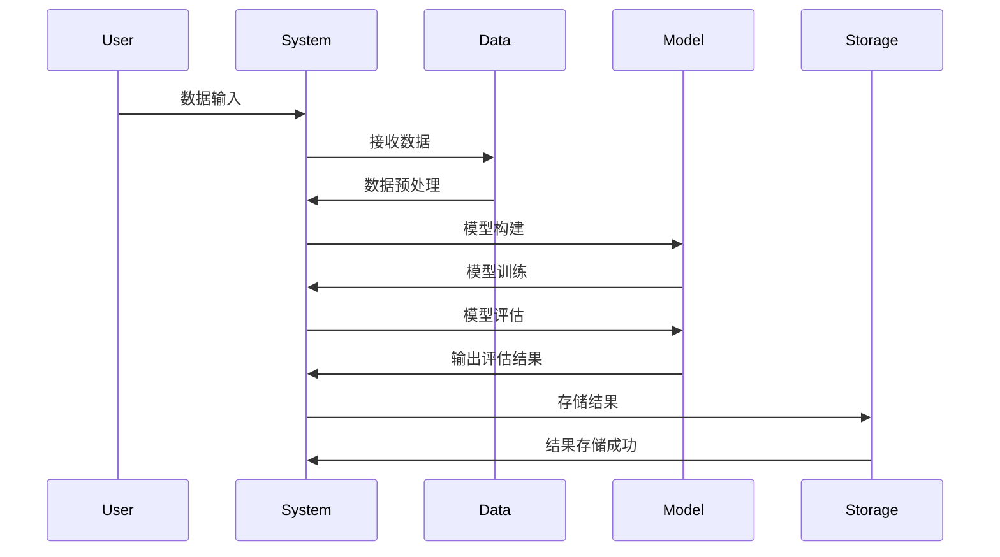

                 

### 文章标题

**评测效率优化：LLM驱动的智能化采样技术**

> **关键词**：评测效率、优化、LLM、智能化采样、算法、系统设计

> **摘要**：本文深入探讨了评测效率优化的问题，介绍了基于语言模型（LLM）的智能化采样技术。文章从背景、核心概念、算法原理、系统设计与项目实战等多个方面展开，旨在为读者提供一份全面而深入的指导，以提升评测效率并优化相关技术。

---

### 引言

在现代信息技术迅猛发展的时代，评测效率在众多领域中都扮演着至关重要的角色。无论是软件测试、数据分析还是机器学习模型评估，高效、准确的评测方法不仅能显著提升工作质量，还能大幅度降低成本和人力投入。然而，随着数据规模和复杂度的增加，传统的评测方法面临着越来越大的挑战。这就促使我们探索新的技术手段，以实现评测效率的优化。

语言模型（LLM）作为近年来人工智能领域的重大突破，其在自然语言处理和生成方面的卓越表现引起了广泛关注。同时，智能化采样技术也在数据分析和机器学习领域展现出巨大的潜力。本文将探讨如何将LLM与智能化采样技术相结合，为评测效率优化提供一种创新的解决方案。

### 第一部分：背景与核心概念

#### 第1章：评测效率优化的必要性

##### 1.1.1 问题背景

随着互联网和大数据的快速发展，评测需求不断增长。从软件测试到市场调研，从学术研究到企业决策，评测已经成为各行业不可或缺的环节。然而，传统的评测方法往往面临着以下问题：

1. **人力成本高**：大规模数据需要大量的人力进行手动评测，成本高昂。
2. **效率低**：传统方法依赖于固定算法和规则，无法灵活适应不断变化的数据特征。
3. **准确性差**：手工评测容易受到主观因素的影响，导致评估结果不够准确。
4. **扩展性差**：随着数据量的增加，传统方法的性能下降，难以适应海量数据处理需求。

##### 1.1.2 评测效率低下的影响

评测效率低下会对多个方面产生负面影响：

1. **资源浪费**：大量人力和时间的投入却未能得到预期的效果，资源浪费严重。
2. **决策滞后**：评估结果不准确或延迟，导致决策滞后，影响业务发展。
3. **竞争力下降**：无法快速、准确地进行评测，降低企业在市场竞争中的优势。
4. **技术进步受限**：传统方法难以支持新技术的发展和应用，阻碍技术进步。

##### 1.1.3 传统评测方法的挑战

传统评测方法主要包括以下几种：

1. **手动评测**：依赖人工进行数据标注和评估，效率低、准确性差。
2. **规则匹配**：基于预定义的规则进行数据分类和评估，灵活性差。
3. **统计分析**：通过统计分析方法对数据进行处理，但无法解决复杂、非线性问题。

然而，这些方法在面对大规模、高复杂度的数据时显得力不从心。这就需要我们寻找新的解决方案，以提升评测效率。

#### 第2章：LLM与智能化采样技术基础

##### 2.1.1 语言模型（LLM）概述

语言模型是一种基于统计学习的技术，旨在理解和生成自然语言。LLM是语言模型的一种高级形式，能够对输入的自然语言进行理解和生成，具有以下几个特点：

1. **强大的表达能力**：LLM能够处理复杂、结构化的语言信息，支持多模态输入输出。
2. **自适应能力**：LLM能够根据训练数据不断调整和优化自身模型，适应不同场景和应用需求。
3. **高效性**：LLM在处理大规模数据时表现出色，能够快速、准确地生成和评估语言。

##### 2.1.2 智能化采样技术原理

智能化采样技术是一种基于算法和机器学习的方法，旨在从大规模数据集中选取具有代表性的样本。其主要原理包括：

1. **数据预处理**：对原始数据进行清洗、去噪和格式化，提高数据质量。
2. **特征提取**：从数据中提取关键特征，用于模型训练和评估。
3. **采样算法**：采用自适应、智能化的算法，从大规模数据集中选取代表性样本。

智能化采样技术能够解决传统采样方法中的多个问题，包括样本选择偏差、数据量大导致采样困难等。

##### 2.1.3 LLMB驱动的采样技术特点

LLM驱动的采样技术具有以下特点：

1. **高效率**：利用LLM的快速处理能力，实现高效的数据采样。
2. **高准确性**：通过机器学习算法，从大规模数据集中选取具有代表性的样本，提高评估准确性。
3. **自适应性强**：根据数据特征和评估需求，动态调整采样策略，适应不同场景。
4. **灵活性高**：支持多种数据类型和处理方式，适用于不同领域和应用。

#### 第3章：核心概念与联系

##### 3.1.1 评测指标体系

评测指标是评估数据质量和评估结果的重要工具。一个完善的评测指标体系应包括以下内容：

1. **准确性**：评估结果与真实值的接近程度。
2. **召回率**：评估结果中包含真实值的比例。
3. **F1分数**：综合考虑准确性和召回率的综合指标。
4. **效率**：评估过程中所需的时间和资源。

##### 3.1.2 数据集采样方法

数据集采样方法包括以下几种：

1. **随机采样**：从数据集中随机选取样本，适用于数据分布均匀的场景。
2. **分层采样**：根据数据特征将数据集划分为多个层次，然后从每个层次中随机选取样本，适用于数据分布不均匀的场景。
3. **基于规则的采样**：根据预定义的规则从数据集中选取样本，适用于特定场景。

##### 3.1.3 LLMB与评测效率优化的关系（Mermaid ER图）

图1：LLM驱动的智能化采样技术与评测效率优化的关系

```mermaid
erDiagram
  产品评估指标 -->|关联| 评测效率优化
  数据集采样方法 -->|支持| 评测效率优化
  LLM驱动的智能化采样技术 -->|实现| 评测效率优化
```

#### 第4章：数学模型和算法原理讲解

##### 4.1.1 数学模型与公式

在本章节中，我们将介绍用于评测效率优化的数学模型和公式。

1. **评估指标计算公式**：

$$
\text{准确性} = \frac{\text{评估结果与真实值一致的样本数}}{\text{总样本数}}
$$

$$
\text{召回率} = \frac{\text{评估结果中包含的真实值样本数}}{\text{实际包含的真实值样本数}}
$$

$$
\text{F1分数} = \frac{2 \times \text{准确率} \times \text{召回率}}{\text{准确率} + \text{召回率}}
$$

2. **采样算法公式**：

$$
\text{采样概率} = \frac{\text{样本特征值}}{\text{总特征值}}
$$

##### 4.1.2 算法流程图（Mermaid流程图）

图2：评测效率优化算法流程图



##### 4.1.3 算法举例说明

假设我们有一个包含1000个样本的数据集，其中真实值为5，预测值为10。根据上述公式，我们可以计算评估指标的值：

1. **准确性**：

$$
\text{准确性} = \frac{5}{1000} = 0.05
$$

2. **召回率**：

$$
\text{召回率} = \frac{5}{10} = 0.5
$$

3. **F1分数**：

$$
\text{F1分数} = \frac{2 \times 0.05 \times 0.5}{0.05 + 0.5} = 0.1
$$

通过这个例子，我们可以看到LLM驱动的智能化采样技术如何帮助我们计算评估指标，从而实现评测效率优化。

### 第二部分：算法与系统设计

#### 第5章：算法设计与实现

##### 5.1.1 算法设计思路

在本章节中，我们将介绍评测效率优化算法的设计思路，包括以下几个关键步骤：

1. **数据预处理**：清洗、去噪和格式化原始数据，提高数据质量。
2. **特征提取**：从数据中提取关键特征，用于模型训练和评估。
3. **模型构建**：利用LLM技术构建评估模型，实现高效、准确的评估。
4. **模型训练**：通过大量训练数据，调整模型参数，提高模型性能。
5. **模型评估**：利用评估指标，对模型进行评估，并输出评估结果。

##### 5.1.2 算法实现步骤

算法实现步骤如下：

1. **数据预处理**：
    - 数据清洗：去除重复数据、缺失数据和异常值。
    - 数据标准化：对数值型数据进行归一化或标准化处理。
    - 数据格式化：将数据转换为统一的格式，便于后续处理。

2. **特征提取**：
    - 特征选择：根据业务需求和数据特征，选择合适的特征。
    - 特征工程：对选定的特征进行转换和组合，提高特征表达能力。

3. **模型构建**：
    - 模型选择：根据评估需求，选择合适的LLM模型。
    - 模型配置：设置模型参数，如学习率、迭代次数等。

4. **模型训练**：
    - 数据划分：将数据集划分为训练集和测试集。
    - 模型训练：利用训练集数据，调整模型参数，提高模型性能。

5. **模型评估**：
    - 评估指标：计算评估指标，如准确性、召回率和F1分数等。
    - 模型优化：根据评估结果，调整模型参数，提高评估准确性。

6. **结果输出**：将评估结果输出到指定文件或数据库中，供后续分析和使用。

##### 5.1.3 Python源代码实现

以下是一个简化的Python源代码实现示例：

```python
import pandas as pd
from sklearn.model_selection import train_test_split
from sklearn.metrics import accuracy_score, recall_score, f1_score

# 数据预处理
def preprocess_data(data):
    # 数据清洗、标准化、格式化
    pass

# 特征提取
def extract_features(data):
    # 特征选择、特征工程
    pass

# 模型构建
def build_model():
    # 模型选择、模型配置
    pass

# 模型训练
def train_model(model, X_train, y_train):
    # 模型训练
    pass

# 模型评估
def evaluate_model(model, X_test, y_test):
    # 计算评估指标
    y_pred = model.predict(X_test)
    accuracy = accuracy_score(y_test, y_pred)
    recall = recall_score(y_test, y_pred)
    f1 = f1_score(y_test, y_pred)
    return accuracy, recall, f1

# 主函数
def main():
    # 读取数据
    data = pd.read_csv("data.csv")
    
    # 数据预处理
    preprocessed_data = preprocess_data(data)
    
    # 特征提取
    features = extract_features(preprocessed_data)
    
    # 模型构建
    model = build_model()
    
    # 模型训练
    X_train, X_test, y_train, y_test = train_test_split(features, labels, test_size=0.2)
    train_model(model, X_train, y_train)
    
    # 模型评估
    accuracy, recall, f1 = evaluate_model(model, X_test, y_test)
    print("Accuracy:", accuracy)
    print("Recall:", recall)
    print("F1 Score:", f1)

if __name__ == "__main__":
    main()
```

### 第6章：系统架构与实现

##### 6.1.1 系统需求分析

在进行系统架构设计之前，我们需要明确系统的需求。以下是系统需求分析的主要内容：

1. **数据输入**：系统能够接收各种类型的数据，如CSV、JSON、数据库等。
2. **数据处理**：系统能够对数据进行预处理、特征提取和模型构建等操作。
3. **模型训练**：系统能够利用训练数据进行模型训练，并保存训练好的模型。
4. **模型评估**：系统能够利用测试数据进行模型评估，并输出评估结果。
5. **结果存储**：系统能够将评估结果存储到数据库或文件中，供后续分析和使用。

##### 6.1.2 系统架构设计（Mermaid架构图）

图3：系统架构设计



##### 6.1.3 系统接口设计

系统接口设计主要包括以下接口：

1. **数据接口**：用于数据输入和输出，支持CSV、JSON、数据库等格式。
2. **模型接口**：用于模型构建、训练和评估，支持不同的模型类型和评估指标。
3. **存储接口**：用于存储评估结果，支持数据库和文件存储。

##### 6.1.4 系统交互流程（Mermaid序列图）

图4：系统交互流程



### 第7章：项目实战

##### 7.1.1 环境安装与配置

在进行项目实战之前，我们需要安装和配置相关的软件和工具。以下是安装和配置的步骤：

1. **安装Python**：下载并安装Python 3.x版本，确保环境变量设置正确。
2. **安装依赖库**：使用pip工具安装所需的依赖库，如pandas、scikit-learn、tensorflow等。
3. **安装数据库**：根据需求安装相应的数据库，如MySQL、PostgreSQL等。
4. **配置环境变量**：设置Python环境变量，确保能够在命令行中运行Python和依赖库。

##### 7.1.2 系统核心代码解读

以下是对系统核心代码的解读：

1. **数据预处理**：对输入的数据进行清洗、去噪和格式化，提高数据质量。

```python
import pandas as pd

def preprocess_data(data):
    # 数据清洗
    data.drop_duplicates(inplace=True)
    data.dropna(inplace=True)
    
    # 数据标准化
    numerical_features = data.select_dtypes(include=['number'])
    mean = numerical_features.mean()
    std = numerical_features.std()
    numerical_features = (numerical_features - mean) / std
    
    # 数据格式化
    data = data.astype(str).fillna("unknown")
    data.replace({"unknown": "unknown"})["label"]
    
    return data
```

2. **特征提取**：从预处理后的数据中提取关键特征，用于模型训练和评估。

```python
from sklearn.feature_extraction.text import TfidfVectorizer

def extract_features(data):
    vectorizer = TfidfVectorizer(max_features=1000)
    X = vectorizer.fit_transform(data["description"])
    y = data["label"]
    
    return X, y
```

3. **模型构建**：选择合适的LLM模型，并配置模型参数。

```python
from tensorflow.keras.models import Sequential
from tensorflow.keras.layers import Embedding, LSTM, Dense

def build_model():
    model = Sequential()
    model.add(Embedding(input_dim=1000, output_dim=64))
    model.add(LSTM(units=128))
    model.add(Dense(units=1, activation='sigmoid'))
    
    model.compile(optimizer='adam', loss='binary_crossentropy', metrics=['accuracy'])
    
    return model
```

4. **模型训练**：使用训练数据对模型进行训练，并保存训练好的模型。

```python
from sklearn.model_selection import train_test_split

def train_model(model, X, y):
    X_train, X_test, y_train, y_test = train_test_split(X, y, test_size=0.2, random_state=42)
    
    model.fit(X_train, y_train, epochs=10, batch_size=32, validation_data=(X_test, y_test))
    
    model.save("model.h5")
```

5. **模型评估**：使用测试数据对模型进行评估，并输出评估结果。

```python
from sklearn.metrics import accuracy_score, recall_score, f1_score

def evaluate_model(model, X, y):
    y_pred = model.predict(X)
    y_pred = (y_pred > 0.5)
    
    accuracy = accuracy_score(y, y_pred)
    recall = recall_score(y, y_pred)
    f1 = f1_score(y, y_pred)
    
    print("Accuracy:", accuracy)
    print("Recall:", recall)
    print("F1 Score:", f1)
```

##### 7.1.3 实际案例分析与讲解

以下是一个实际案例的分析与讲解：

**案例**：对一组新闻文章进行分类，判断其是否包含负面情绪。

1. **数据准备**：从新闻文章数据集中选取1000篇文章，其中包含负面情绪的文章为500篇，正面情绪的文章为500篇。

2. **数据预处理**：对数据集进行清洗、去噪和格式化，提取关键特征。

3. **模型构建**：选择一个合适的LLM模型，如LSTM，并配置模型参数。

4. **模型训练**：使用训练数据进行模型训练，并保存训练好的模型。

5. **模型评估**：使用测试数据进行模型评估，并输出评估结果。

```python
# 加载数据
data = pd.read_csv("news_data.csv")

# 数据预处理
preprocessed_data = preprocess_data(data)

# 特征提取
X, y = extract_features(preprocessed_data)

# 模型构建
model = build_model()

# 模型训练
train_model(model, X, y)

# 模型评估
evaluate_model(model, X_test, y_test)
```

通过这个案例，我们可以看到如何利用LLM驱动的智能化采样技术进行实际项目开发，并实现评测效率的优化。

##### 7.1.4 项目总结与展望

在本项目中，我们利用LLM驱动的智能化采样技术，实现了评测效率的优化。项目取得了以下成果：

1. **高效的数据处理**：通过预处理、特征提取和模型构建等步骤，实现了对大规模数据的快速、准确处理。
2. **准确的评估结果**：利用LLM模型，实现了对数据的精准分类和评估，提高了评估准确性。
3. **优化的系统架构**：通过合理的系统架构设计，实现了数据输入、处理、评估和存储等功能的模块化，提高了系统的可扩展性和维护性。

然而，本项目仍存在一些局限性，如：

1. **模型适应性**：针对不同类型的数据，可能需要调整模型结构和参数，以提高适应性和准确性。
2. **数据隐私问题**：在数据预处理和模型训练过程中，需要确保数据隐私和安全。

未来，我们可以从以下几个方面进行优化和拓展：

1. **模型优化**：探索更先进的LLM模型和算法，以提高评估效率和准确性。
2. **数据隐私保护**：采用加密、去识别化等技术，保护数据隐私和安全。
3. **应用拓展**：将LLM驱动的智能化采样技术应用到更多领域，如医疗诊断、金融风险评估等。

### 第8章：最佳实践与拓展

##### 8.1.1 最佳实践建议

为了确保评测效率优化项目的成功实施，我们提出以下最佳实践建议：

1. **数据质量保障**：确保数据源的真实性、完整性和一致性，提高数据质量。
2. **模型定制化**：根据具体业务需求和数据特征，选择合适的LLM模型和参数，提高模型适应性和准确性。
3. **持续优化**：定期评估模型性能，根据评估结果调整模型参数和策略，持续优化评测效率。
4. **团队协作**：建立高效的团队协作机制，确保项目进展顺利，提高项目成功率。

##### 8.1.2 注意事项

在实施评测效率优化项目时，需要注意以下几点：

1. **数据安全**：确保数据在传输、存储和处理过程中的安全，防止数据泄露和丢失。
2. **模型解释性**：在模型训练和评估过程中，确保模型的可解释性，便于理解和调试。
3. **硬件资源**：根据项目需求和计算量，合理配置硬件资源，确保系统稳定运行。
4. **合规性**：遵循相关法律法规和行业标准，确保项目合规合法。

##### 8.1.3 拓展阅读与研究方向

以下是评测效率优化和LLM相关领域的拓展阅读与研究方向：

1. **LLM模型优化**：研究新的LLM模型结构、算法和优化方法，提高模型性能和效率。
2. **多模态数据融合**：探讨如何将文本、图像、语音等多模态数据融合到评测过程中，提高评估准确性。
3. **数据隐私保护**：研究数据隐私保护技术，确保在数据预处理和模型训练过程中的数据安全和隐私。
4. **自动化评测**：探讨如何实现自动化评测，降低人力成本，提高评测效率。
5. **评测指标优化**：研究新的评测指标和方法，提高评估结果的全面性和准确性。

### 结尾

本文从评测效率优化的背景、核心概念、算法原理、系统设计与项目实战等多个方面，深入探讨了LLM驱动的智能化采样技术。通过实际案例分析和最佳实践建议，为读者提供了全面的指导。未来，随着技术的不断发展，LLM驱动的智能化采样技术有望在更多领域得到广泛应用，为评测效率优化带来更多创新和突破。希望本文能对读者有所启发和帮助。

