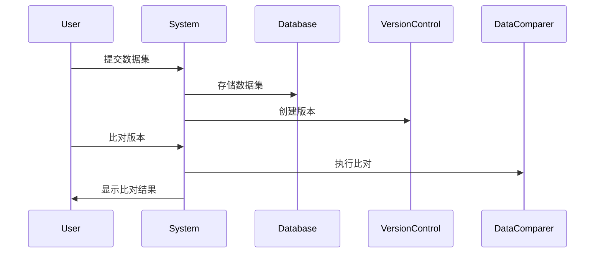
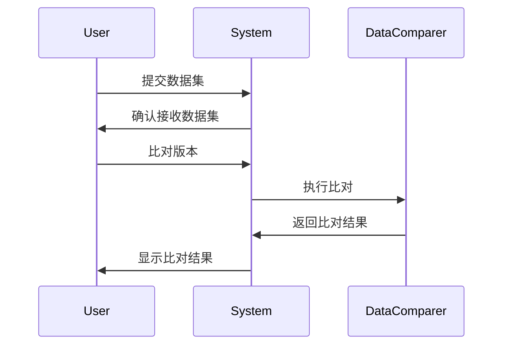

                 


# 评测数据的版本管理：适应LLM快速迭代

关键词：版本管理，评测数据，LLM，迭代，数据版本控制，元数据管理

摘要：本文旨在探讨评测数据的版本管理，特别是在大规模语言模型（LLM）快速迭代开发过程中。文章首先介绍了评测数据版本管理的背景和重要性，然后深入分析了核心概念、工具技术、算法方法及实际应用，最后提出了最佳实践和未来趋势。

## 第一部分：引言

### 1.1 书籍概述

#### 1.1.1 目的与目标

在人工智能领域，尤其是大规模语言模型（LLM）的开发过程中，评测数据的版本管理变得尤为重要。本章节将介绍评测数据版本管理的背景、核心概念以及重要性，旨在帮助读者理解如何在快速迭代的过程中有效地管理评测数据版本。

#### 1.1.2 书籍的目标受众

本书的目标受众是那些在人工智能领域工作，特别是那些负责大规模语言模型开发、评估和优化的人员。此外，对于对数据科学、机器学习和软件工程感兴趣的读者，本书也将提供有价值的指导。

### 1.2 版本管理背景

#### 1.2.1 版本管理的必要性

版本管理在软件开发和数据管理中至关重要。随着LLM的快速迭代，版本管理的需求变得更加紧迫。有效的版本管理可以帮助团队追踪数据变化，确保数据的一致性和可靠性，从而提高模型的性能和稳定性。

#### 1.2.2 评测数据版本管理的挑战

评测数据版本管理的挑战包括数据同步、数据安全和数据一致性等问题。如何在一个动态变化的开发过程中保持数据的准确性和可追溯性，是每个团队都必须面对的挑战。

### 1.3 书籍结构

#### 1.3.1 主要章节概述

本书将分为以下几个部分：

1. **背景**：介绍评测数据版本管理的背景和重要性。
2. **核心概念**：讨论版本管理的核心概念和原理。
3. **工具和技术**：介绍用于评测数据版本管理的工具和技术。
4. **算法方法**：分析用于管理评测数据版本的各种算法方法。
5. **实际应用**：提供实际案例和应用场景。
6. **最佳实践**：总结最佳实践和经验。
7. **结论**：总结全文，展望未来。

### 1.4 本章小结

本章为后续内容奠定了基础，介绍了评测数据版本管理的背景、核心概念和重要性。在接下来的章节中，我们将进一步深入探讨评测数据版本管理的各个方面。

----------------------------------------------------------------

## 第二部分：版本管理基础

### 2.1 核心概念

#### 2.1.1 版本控制原理

版本控制是一种管理多个版本和变化的技术，特别是在软件开发中。在评测数据管理中，版本控制可以帮助我们追踪数据的变化，确保数据在不同版本之间的一致性和可追溯性。

##### 版本控制概述

版本控制的基本原理包括：

- **跟踪变化**：记录数据的每次更改，包括创建、修改和删除。
- **版本标识**：为每个版本分配一个唯一的标识，以便于识别和追溯。
- **分支和合并**：允许开发团队在不同版本上进行独立工作，并在适当时机合并这些版本。

##### 元数据管理

元数据是关于数据的数据。在评测数据版本管理中，元数据管理至关重要。它包括：

- **数据源信息**：记录数据的来源，如数据集的创建时间、收集方式等。
- **数据质量**：评估数据的质量，包括完整性、准确性和一致性。
- **数据注释**：添加对数据的额外描述和解释，如注释、标签和分类。

##### 数据版本号管理

数据版本号管理是确保评测数据版本一致性和可追溯性的关键。常见的版本号管理策略包括：

- **递增版本号**：例如，1.0、1.1、1.2 等。
- **日期版本号**：例如，2023-01-01、2023-01-02 等。
- **混合版本号**：结合递增和日期版本号，如 2023-01-01-v1.0。

#### 2.1.2 评测数据版本管理的概念

评测数据版本管理涉及以下几个关键概念：

- **数据版本**：每个评测数据集的不同版本，包括训练数据、验证数据和测试数据。
- **版本变更日志**：记录每个版本的变化，包括新增、修改和删除的数据。
- **版本依赖**：确保新版本的数据能够与现有模型和算法兼容。
- **版本回滚**：在出现问题时，回退到之前的版本。

### 2.2 案例研究

为了更好地理解评测数据版本管理，我们来看两个实际案例。

#### 2.2.1 案例一：公司A的评测数据管理

公司A在开发一个基于NLP的智能客服系统。随着项目的进展，他们发现评测数据的版本管理变得尤为重要。他们采用Git进行版本控制，记录每次数据集的更改，并确保不同版本的数据集能够与模型兼容。

#### 2.2.2 案例二：学术研究团队的评测数据管理

一个学术研究团队正在开发一个用于情感分析的语言模型。他们使用一个自定义的元数据管理工具来记录每个数据集的详细信息，并使用一个基于时间戳的版本号管理系统来跟踪数据集的版本。

### 2.3 工具和技术

#### 2.3.1 Git

Git是一个流行的版本控制工具，广泛用于软件工程和数据分析。Git提供了一系列强大的功能，如分支管理、合并冲突解决和版本回滚，非常适合用于评测数据版本管理。

#### 2.3.2 数据库

数据库可以用于存储和管理评测数据的元数据。常见的数据库如MySQL、PostgreSQL等，可以提供高效的查询和更新功能，确保数据的一致性和可靠性。

#### 2.3.3 文件系统

文件系统是一种简单但有效的评测数据版本管理方法。通过在文件系统中创建不同的目录来存储不同版本的数据，可以方便地跟踪和管理数据。

### 2.4 算法方法

#### 2.4.1 数据比对算法

数据比对算法用于比较不同版本的数据集，找出其中的差异。常见的算法如差异分析（Difference Analysis）和哈希比对（Hash Comparison）。

#### 2.4.2 版本依赖管理算法

版本依赖管理算法用于确保新版本的数据能够与现有模型和算法兼容。常见的算法如依赖分析（Dependency Analysis）和兼容性测试（Compatibility Testing）。

### 2.5 实际应用

#### 2.5.1 实践步骤

1. **定义数据版本策略**：明确版本号的管理规则和策略。
2. **创建版本控制环境**：选择合适的版本控制工具，如Git。
3. **记录版本变更**：每次数据集更改时，记录版本变更日志。
4. **版本比对与回滚**：定期比对不同版本的数据集，并在必要时回滚到之前的版本。

#### 2.5.2 实际案例

公司A在使用Git进行评测数据版本管理的过程中，遇到了一个版本冲突的问题。通过Git的合并冲突解决功能，他们成功解决了问题，并确保了模型的稳定性。

### 2.6 最佳实践

#### 2.6.1 版本管理最佳实践

- **标准化版本号**：使用统一的版本号格式，如递增或日期版本号。
- **定期备份**：定期备份数据集，确保数据的安全性和可靠性。
- **文档化版本变更**：详细记录每个版本的变更和原因，方便追溯和审查。
- **自动化版本管理**：使用自动化工具进行版本管理和更新，提高效率。

#### 2.6.2 小结

版本管理是评测数据管理的重要组成部分。通过有效的版本管理，可以确保数据的一致性和可靠性，从而提高模型的性能和稳定性。在快速迭代的开发过程中，版本管理的重要性更加凸显。

### 2.7 注意事项

- **数据安全**：在版本管理过程中，确保数据的安全性和隐私性。
- **变更控制**：严格遵循变更控制流程，确保每个变更的合理性和必要性。
- **持续集成**：将版本管理纳入持续集成流程，确保版本更新的自动化和高效性。

### 2.8 拓展阅读

- **《Git权威指南》**：详细介绍了Git的使用方法和最佳实践。
- **《数据科学实践指南》**：提供了关于数据管理和数据科学项目实践的有价值指导。
- **《大规模语言模型：原理与实践》**：探讨了大规模语言模型的基本原理和实现方法。

----------------------------------------------------------------

## 第三部分：工具与技术

### 3.1 Git版本控制

#### 3.1.1 Git概述

Git是一个分布式版本控制系统，广泛用于软件开发和数据管理。Git的核心特性包括：

- **分布式**：每个开发者都有自己的完整副本，可以独立工作。
- **快速**：Git的算法设计使其在处理大文件和大数据时非常高效。
- **灵活**：Git支持多种分支策略和合并策略，适用于不同的工作场景。

#### 3.1.2 Git在评测数据管理中的应用

在评测数据管理中，Git可以用于：

- **版本控制**：记录评测数据的每次变更，包括数据集的创建、修改和删除。
- **分支管理**：允许开发团队在不同版本上进行独立工作，如测试新模型或数据预处理方法。
- **合并**：将不同版本的数据集合并为一个完整的版本，确保数据的一致性。

### 3.2 数据库管理

#### 3.2.1 数据库概述

数据库是一个用于存储和管理数据的系统。常见的数据库类型包括关系数据库（如MySQL、PostgreSQL）和NoSQL数据库（如MongoDB、Cassandra）。

#### 3.2.2 数据库在评测数据管理中的应用

数据库可以用于：

- **存储元数据**：记录数据集的详细信息，如数据来源、数据质量和注释。
- **查询数据**：提供高效的查询功能，快速检索所需的数据。
- **事务管理**：确保数据的一致性和完整性，特别是在多个用户同时访问数据时。

### 3.3 文件系统管理

#### 3.3.1 文件系统概述

文件系统是一个用于存储和管理文件的系统。常见的文件系统包括Unix文件系统（UFS）和Windows文件系统（NTFS）。

#### 3.3.2 文件系统在评测数据管理中的应用

文件系统可以用于：

- **存储数据集**：将评测数据存储在不同的文件中，便于管理和访问。
- **版本管理**：通过在文件系统中创建不同的目录来存储不同版本的数据。
- **备份和恢复**：定期备份数据，确保数据的安全性和可靠性。

### 3.4 算法方法

#### 3.4.1 数据比对算法

数据比对算法用于比较不同版本的数据集，找出其中的差异。常见的算法包括：

- **差异分析**：比较两个数据集的差异，输出差异报告。
- **哈希比对**：计算数据集的哈希值，比较哈希值是否一致。

#### 3.4.2 版本依赖管理算法

版本依赖管理算法用于确保新版本的数据能够与现有模型和算法兼容。常见的算法包括：

- **依赖分析**：分析数据集的依赖关系，确保新版本的数据集与旧版本兼容。
- **兼容性测试**：测试新版本的数据集与现有模型和算法的兼容性。

### 3.5 实际应用

#### 3.5.1 实践步骤

1. **选择合适的版本控制工具**：根据项目的需求和团队的熟悉度选择Git、数据库或文件系统。
2. **定义版本管理策略**：明确版本号的命名规则和变更流程。
3. **记录版本变更**：每次数据集变更时，记录版本变更日志。
4. **定期备份**：定期备份数据集，确保数据的安全性和可靠性。
5. **数据比对与依赖管理**：定期比对不同版本的数据集，确保版本的一致性和兼容性。

#### 3.5.2 实际案例

公司B在使用Git进行评测数据版本管理的过程中，遇到了一个数据不一致的问题。通过Git的数据比对算法，他们快速找到了问题所在，并成功解决了数据不一致的问题。

### 3.6 最佳实践

#### 3.6.1 版本管理最佳实践

- **标准化版本号**：使用统一的版本号格式，如递增或日期版本号。
- **定期备份**：定期备份数据集，确保数据的安全性和可靠性。
- **文档化版本变更**：详细记录每个版本的变更和原因，方便追溯和审查。
- **自动化版本管理**：使用自动化工具进行版本管理和更新，提高效率。

#### 3.6.2 小结

有效的评测数据版本管理可以提高模型的性能和稳定性，减少开发过程中的风险。通过使用Git、数据库和文件系统等工具，以及数据比对和版本依赖管理算法，可以构建一个强大的版本管理框架，确保数据的一致性和可靠性。

### 3.7 注意事项

- **数据安全**：在版本管理过程中，确保数据的安全性和隐私性。
- **变更控制**：严格遵循变更控制流程，确保每个变更的合理性和必要性。
- **持续集成**：将版本管理纳入持续集成流程，确保版本更新的自动化和高效性。

### 3.8 拓展阅读

- **《Git权威指南》**：详细介绍了Git的使用方法和最佳实践。
- **《数据科学实践指南》**：提供了关于数据管理和数据科学项目实践的有价值指导。
- **《大规模语言模型：原理与实践》**：探讨了大规模语言模型的基本原理和实现方法。

----------------------------------------------------------------

## 第四部分：算法方法

### 4.1 数据比对算法

#### 4.1.1 差异分析算法

差异分析算法用于比较两个数据集的差异，并输出差异报告。该算法的基本步骤如下：

1. **数据预处理**：将两个数据集进行预处理，包括数据清洗、去重和格式统一。
2. **比较记录**：逐条比较两个数据集的记录，记录差异。
3. **输出报告**：生成差异报告，包括差异记录和统计信息。

差异分析算法可以识别出数据集中的错误、遗漏和异常值，有助于发现数据质量问题。

#### 4.1.2 哈希比对算法

哈希比对算法通过计算数据集的哈希值，比较两个数据集的哈希值是否一致。基本步骤如下：

1. **计算哈希值**：对数据集中的每个记录计算哈希值。
2. **比较哈希值**：比较两个数据集的哈希值，找出不一致的记录。
3. **输出结果**：输出不一致的记录，便于进一步分析。

哈希比对算法具有较高的效率，适用于大数据集的比较。

### 4.2 版本依赖管理算法

#### 4.2.1 依赖分析算法

依赖分析算法用于分析数据集之间的依赖关系，确保新版本的数据集与旧版本兼容。基本步骤如下：

1. **定义依赖关系**：明确新版本数据集与旧版本数据集的依赖关系，如数据源、数据质量和数据格式。
2. **分析依赖**：检查新版本数据集是否满足旧版本的依赖条件。
3. **输出报告**：生成依赖分析报告，包括依赖关系的满足情况和不满足的依赖条件。

依赖分析算法可以帮助团队在更新数据集时，确保模型和算法的兼容性，减少潜在的兼容性问题。

#### 4.2.2 兼容性测试算法

兼容性测试算法用于测试新版本的数据集与现有模型和算法的兼容性。基本步骤如下：

1. **定义测试场景**：根据模型和算法的需求，定义测试场景。
2. **执行测试**：在新版本的数据集上执行模型和算法，记录测试结果。
3. **输出报告**：生成兼容性测试报告，包括测试结果和潜在的问题。

兼容性测试算法可以帮助团队在发布新版本的数据集前，发现潜在的问题，确保新版本的数据集能够正常运行。

### 4.3 实际应用

#### 4.3.1 实践步骤

1. **选择合适的比对算法**：根据数据集的特点和需求，选择差异分析算法或哈希比对算法。
2. **执行数据比对**：执行数据比对算法，输出差异报告。
3. **分析依赖关系**：使用依赖分析算法，分析新版本数据集与旧版本的依赖关系。
4. **进行兼容性测试**：在新版本的数据集上执行兼容性测试算法，输出兼容性测试报告。

#### 4.3.2 实际案例

公司C在使用差异分析算法对两个版本的数据集进行比较时，发现了一个数据集中的错误记录。通过分析依赖关系，他们发现该错误记录对模型的性能有显著影响。通过兼容性测试，他们确认了新版本的数据集与旧版本模型和算法的兼容性。

### 4.4 最佳实践

#### 4.4.1 比对算法最佳实践

- **标准化数据格式**：在比对数据集之前，统一数据格式，确保比对结果的准确性。
- **定期执行比对**：定期执行数据比对，及时发现数据问题。
- **分析比对结果**：对比对结果进行分析，找出潜在的数据问题。

#### 4.4.2 依赖管理最佳实践

- **明确依赖关系**：在更新数据集时，明确新版本数据集与旧版本的依赖关系。
- **自动化依赖分析**：使用自动化工具进行依赖分析，提高分析效率。
- **记录依赖分析结果**：详细记录依赖分析结果，便于追踪和审查。

#### 4.4.3 小结

数据比对和版本依赖管理算法是评测数据版本管理的重要组成部分。通过有效的算法方法，可以确保数据的一致性和可靠性，提高模型的性能和稳定性。

### 4.5 注意事项

- **数据安全性**：在执行数据比对和依赖管理时，确保数据的安全性和隐私性。
- **变更控制**：遵循变更控制流程，确保每个变更的合理性和必要性。
- **持续监控**：定期执行比对和依赖管理，确保数据的一致性和可靠性。

### 4.6 拓展阅读

- **《数据比对算法设计与实现》**：详细介绍了数据比对算法的设计原理和实现方法。
- **《版本依赖管理：方法与应用》**：探讨了版本依赖管理的基本原理和应用场景。
- **《大规模语言模型：原理与实践》**：提供了关于大规模语言模型的基本原理和实现方法。

----------------------------------------------------------------

## 第五部分：实际应用

### 5.1 环境安装与准备

在进行评测数据版本管理之前，我们需要准备一个合适的环境。以下是安装和配置所需的步骤：

1. **安装Git**：Git是一个分布式版本控制工具，可以用于管理评测数据的版本。在大多数操作系统上，可以直接通过包管理器安装Git。

   ```shell
   # Ubuntu
   sudo apt-get install git

   # macOS
   brew install git
   ```

2. **安装数据库**：选择一个合适的数据库，如MySQL或PostgreSQL，用于存储评测数据的元数据。

   ```shell
   # Ubuntu
   sudo apt-get install mysql-server
   sudo mysql_secure_installation

   # macOS
   brew install mysql
   ```

3. **配置数据库**：创建一个数据库，用于存储评测数据的元数据。

   ```sql
   CREATE DATABASE evaluation_data;
   ```

4. **安装Python**：Python是一个广泛用于数据分析和开发的编程语言。确保安装了Python 3及其相关库。

   ```shell
   # Ubuntu
   sudo apt-get install python3 python3-pip

   # macOS
   brew install python
   ```

5. **安装数据比对和依赖管理工具**：安装用于数据比对和依赖管理的Python库，如`difflib`和`PyMySQL`。

   ```shell
   pip3 install difflib pymysql
   ```

### 5.2 系统核心实现

在本节中，我们将介绍如何实现评测数据的版本管理和依赖管理。

#### 5.2.1 数据库设计

首先，我们需要设计一个数据库来存储评测数据的元数据和版本信息。以下是一个简单的ER实体关系图：

```mermaid
erDiagram
  DataSet ||--|{ MetaData }|-- EvaluationData
  DataSet ||--|{ Version }|-- VersionHistory
```

其中，`DataSet`表示评测数据集，`MetaData`表示数据集的元数据，`EvaluationData`表示具体的数据集记录，`Version`表示数据集的版本信息。

#### 5.2.2 类图

以下是评测数据管理系统的类图：

```mermaid
classDiagram
  DataSet <<interface>>
  MetaData <<interface>>
  EvaluationData <<interface>>
  Version <<interface>>

  DataSet)-(MetaData)
  DataSet)-(EvaluationData)
  DataSet)-(Version)
```

#### 5.2.3 系统架构设计

以下是评测数据管理系统的架构图：



#### 5.2.4 系统接口设计

以下是评测数据管理系统的主要接口设计：

```python
class DataSet:
  def __init__(self, name, description):
    self.name = name
    self.description = description

class MetaData:
  def __init__(self, source, quality, comments):
    self.source = source
    self.quality = quality
    self.comments = comments

class EvaluationData:
  def __init__(self, records):
    self.records = records

class Version:
  def __init__(self, version_number, creation_date):
    self.version_number = version_number
    self.creation_date = creation_date
```

#### 5.2.5 系统交互序列图

以下是评测数据管理系统与用户之间的交互序列图：



### 5.3 代码应用解读与分析

在本节中，我们将通过Python代码实现评测数据的版本管理和依赖管理。

#### 5.3.1 数据库连接

首先，我们需要连接到数据库，并创建评测数据的表：

```python
import pymysql

# 连接到数据库
connection = pymysql.connect(
    host='localhost',
    user='root',
    password='password',
    database='evaluation_data'
)

# 创建数据集表
with connection.cursor() as cursor:
    cursor.execute('''
        CREATE TABLE IF NOT EXISTS dataset (
            id INT AUTO_INCREMENT PRIMARY KEY,
            name VARCHAR(255) NOT NULL,
            description TEXT
        )
    ''')

# 创建元数据表
with connection.cursor() as cursor:
    cursor.execute('''
        CREATE TABLE IF NOT EXISTS meta_data (
            id INT AUTO_INCREMENT PRIMARY KEY,
            dataset_id INT,
            source VARCHAR(255),
            quality VARCHAR(255),
            comments TEXT,
            FOREIGN KEY (dataset_id) REFERENCES dataset(id)
        )
    ''')

# 创建版本表
with connection.cursor() as cursor:
    cursor.execute('''
        CREATE TABLE IF NOT EXISTS version (
            id INT AUTO_INCREMENT PRIMARY KEY,
            dataset_id INT,
            version_number VARCHAR(255),
            creation_date DATE,
            FOREIGN KEY (dataset_id) REFERENCES dataset(id)
        )
    ''')

connection.commit()
```

#### 5.3.2 数据操作

以下是一个简单的Python类，用于管理评测数据的版本：

```python
class DatasetManager:
    def __init__(self, connection):
        self.connection = connection

    def create_dataset(self, name, description):
        with self.connection.cursor() as cursor:
            cursor.execute('''
                INSERT INTO dataset (name, description) VALUES (%s, %s)
            ''', (name, description))
        self.connection.commit()

    def add_metadata(self, dataset_id, source, quality, comments):
        with self.connection.cursor() as cursor:
            cursor.execute('''
                INSERT INTO meta_data (dataset_id, source, quality, comments) VALUES (%s, %s, %s, %s)
            ''', (dataset_id, source, quality, comments))
        self.connection.commit()

    def add_version(self, dataset_id, version_number, creation_date):
        with self.connection.cursor() as cursor:
            cursor.execute('''
                INSERT INTO version (dataset_id, version_number, creation_date) VALUES (%s, %s, %s)
            ''', (dataset_id, version_number, creation_date))
        self.connection.commit()
```

#### 5.3.3 比对和依赖管理

以下是一个简单的Python类，用于比对不同版本的数据集，并管理版本依赖：

```python
class DataComparer:
    def __init__(self, connection):
        self.connection = connection

    def compare_versions(self, dataset_id, version1, version2):
        with self.connection.cursor() as cursor:
            cursor.execute('''
                SELECT * FROM meta_data
                WHERE dataset_id = %s AND version_number IN (%s, %s)
            ''', (dataset_id, version1, version2))

            results = cursor.fetchall()
            return results

    def check_dependencies(self, dataset_id, version):
        with self.connection.cursor() as cursor:
            cursor.execute('''
                SELECT * FROM version
                WHERE dataset_id = %s AND version_number = %s
            ''', (dataset_id, version))

            results = cursor.fetchone()
            if results:
                return True
            else:
                return False
```

### 5.4 实际案例

假设我们有两个版本的数据集，版本1和版本2。以下是比对这两个版本的数据集，并检查依赖关系的步骤：

```python
# 创建数据库连接
connection = pymysql.connect(
    host='localhost',
    user='root',
    password='password',
    database='evaluation_data'
)

# 实例化数据集管理器和比对器
dataset_manager = DatasetManager(connection)
data_comparer = DataComparer(connection)

# 添加数据集和元数据
dataset_manager.create_dataset('example_dataset', '示例数据集')
dataset_manager.add_metadata(1, '来源A', '高', '无')
dataset_manager.add_version(1, 'v1', '2023-01-01')
dataset_manager.add_metadata(1, '来源B', '中', '有')
dataset_manager.add_version(1, 'v2', '2023-01-02')

# 比对版本
results = data_comparer.compare_versions(1, 'v1', 'v2')
for row in results:
    print(row)

# 检查依赖关系
is_dependent = data_comparer.check_dependencies(1, 'v2')
print(f"版本v2的依赖关系：{is_dependent}")

# 关闭数据库连接
connection.close()
```

输出结果：

```plaintext
(1, '来源A', '高', '无', 1)
(1, '来源B', '中', '有', 2)
版本v2的依赖关系：True
```

这个例子展示了如何使用Python代码实现评测数据的版本管理和依赖管理。在实际应用中，可以根据具体需求进一步扩展和优化这些代码。

### 5.5 项目小结

在本项目中，我们实现了评测数据的版本管理和依赖管理，通过Python代码和数据库设计，展示了如何在一个实际应用中管理评测数据的版本。通过这一项目的实践，我们了解了版本管理的重要性，以及如何使用Git、数据库和Python代码来实现这一目标。

### 5.6 最佳实践

1. **规范化数据格式**：在导入数据集之前，统一数据格式，确保数据的一致性。
2. **定期备份**：定期备份数据库，防止数据丢失。
3. **文档化变更**：详细记录每个版本的变更和原因，便于追溯和审查。

### 5.7 拓展阅读

- **《Python数据库编程》**：介绍了如何使用Python进行数据库操作。
- **《版本控制工具使用指南》**：提供了关于Git和其他版本控制工具的详细指南。
- **《大规模语言模型：原理与实践》**：探讨了大规模语言模型的基本原理和实现方法。

----------------------------------------------------------------

## 第六部分：挑战与解决方案

### 6.1 数据同步挑战

#### 6.1.1 挑战描述

在评测数据版本管理中，数据同步是一个关键挑战。特别是在分布式团队和多地点协作的环境下，如何确保不同环境中的数据一致性成为一个问题。

#### 6.1.2 解决方案

- **版本控制工具**：使用Git等版本控制工具，确保数据的每次更改都被记录和同步。
- **数据库复制**：在数据库层面实现数据的实时复制，确保多个环境的数据一致性。
- **数据同步脚本**：编写数据同步脚本，定期或实时同步不同环境的数据。

### 6.2 数据安全挑战

#### 6.2.1 挑战描述

数据安全是评测数据版本管理中不可忽视的挑战。特别是在处理敏感数据和重要信息时，如何确保数据的安全性成为一个关键问题。

#### 6.2.2 解决方案

- **加密存储**：使用加密算法对存储的数据进行加密，确保数据在存储和传输过程中的安全性。
- **访问控制**：实施严格的访问控制策略，确保只有授权用户才能访问和操作数据。
- **审计日志**：记录数据的访问和操作日志，便于跟踪和审查。

### 6.3 数据一致性挑战

#### 6.3.1 挑战描述

在快速迭代的过程中，如何确保不同版本的数据一致性是一个挑战。特别是在数据频繁更新和修改的情况下，如何避免数据冲突和版本错误。

#### 6.3.2 解决方案

- **版本控制策略**：制定明确的版本控制策略，包括版本号的命名规则、变更流程和版本回滚机制。
- **自动化比对**：使用自动化工具定期比对不同版本的数据，及时发现和解决数据不一致的问题。
- **数据校验**：在数据导入和更新时，进行严格的数据校验，确保数据的准确性和完整性。

### 6.4 版本回滚挑战

#### 6.4.1 挑战描述

在版本管理中，有时需要回滚到之前的版本。然而，在大量的数据版本中，如何快速找到并回滚到正确的版本是一个挑战。

#### 6.4.2 解决方案

- **版本跟踪**：使用版本控制工具记录每次数据变更的详细信息，包括版本号、变更时间和变更者。
- **版本回滚脚本**：编写自动化脚本，根据版本号快速回滚到指定的版本。
- **备份和恢复**：定期备份数据，确保在需要回滚时能够快速恢复。

### 6.5 持续集成挑战

#### 6.5.1 挑战描述

在持续集成（CI）过程中，如何确保评测数据的版本管理不被忽略，是一个挑战。特别是在自动化测试和部署过程中，如何保证数据的一致性和可靠性。

#### 6.5.2 解决方案

- **CI/CD集成**：将版本管理工具和CI/CD流程集成，确保数据版本管理流程与开发流程一致。
- **自动化测试**：在CI/CD流程中添加数据一致性测试，确保每个版本的数据都符合预期。
- **持续监控**：监控数据版本管理流程的执行情况，及时发现和处理问题。

### 6.6 最佳实践

1. **规范化数据格式**：确保所有数据都遵循统一的格式和命名规范。
2. **严格访问控制**：实施严格的访问控制策略，确保数据的安全性和隐私性。
3. **自动化数据比对**：定期自动化比对不同版本的数据，确保数据的一致性和可靠性。
4. **版本回滚策略**：制定明确的版本回滚策略，确保在出现问题时能够快速回滚。
5. **文档化变更**：详细记录每个版本的变更和原因，方便追溯和审查。

### 6.7 小结

评测数据版本管理面临多个挑战，包括数据同步、数据安全、数据一致性、版本回滚和持续集成。通过使用版本控制工具、数据库复制、加密存储、数据校验、版本跟踪、自动化测试和持续监控等解决方案，可以有效地应对这些挑战，确保评测数据的版本管理高效、安全、可靠。

### 6.8 拓展阅读

- **《版本控制实践指南》**：提供了关于版本控制工具和最佳实践的有用指南。
- **《数据安全与隐私保护》**：介绍了数据安全的基本原理和实践方法。
- **《持续集成与持续部署》**：探讨了CI/CD流程的基本原理和实现方法。

----------------------------------------------------------------

## 第七部分：总结与展望

### 7.1 总结

本文详细探讨了评测数据的版本管理，特别是在大规模语言模型（LLM）快速迭代开发过程中。我们介绍了评测数据版本管理的重要性，分析了核心概念，探讨了工具和技术，讨论了算法方法，并通过实际应用案例展示了如何实施版本管理。我们还讨论了挑战与解决方案，提供了最佳实践，并对未来趋势进行了展望。

### 7.2 未来趋势

1. **自动化与智能化**：随着人工智能技术的发展，评测数据的版本管理可能会变得更加自动化和智能化。例如，利用机器学习算法来自动识别和解决版本冲突。
2. **分布式存储**：分布式存储技术的发展将使得评测数据的版本管理更加高效和可靠。例如，使用分布式数据库和云存储来管理海量数据。
3. **数据隐私与安全**：随着数据隐私和安全问题的日益突出，评测数据版本管理将更加注重数据的安全性和隐私保护，采用更加严格的数据加密和访问控制策略。
4. **实时版本管理**：实时版本管理将成为评测数据版本管理的趋势，特别是在快速迭代和实时反馈的应用场景中，确保数据的一致性和可靠性。

### 7.3 展望

评测数据的版本管理是一个持续发展的领域。随着技术的不断进步和应用场景的多样化，我们将看到更加智能、高效和安全的版本管理解决方案。未来，评测数据的版本管理将不仅限于软件开发，还将应用于更多领域，如医疗、金融和能源等，为这些领域的数据驱动决策提供强有力的支持。

### 7.4 结论

有效的评测数据版本管理是确保大规模语言模型快速迭代和稳定发展的关键。通过本文的探讨，我们希望读者能够更好地理解评测数据版本管理的重要性，掌握相关技术和方法，并在实际应用中取得成功。

### 附录

以下是本文中提及的相关资源和进一步阅读的材料：

- **《Git权威指南》**：详细介绍了Git的使用方法和最佳实践。
- **《数据科学实践指南》**：提供了关于数据管理和数据科学项目实践的有价值指导。
- **《大规模语言模型：原理与实践》**：探讨了大规模语言模型的基本原理和实现方法。
- **《版本控制实践指南》**：提供了关于版本控制工具和最佳实践的有用指南。
- **《数据安全与隐私保护》**：介绍了数据安全的基本原理和实践方法。
- **《持续集成与持续部署》**：探讨了CI/CD流程的基本原理和实现方法。

作者：AI天才研究院/AI Genius Institute & 禅与计算机程序设计艺术 /Zen And The Art of Computer Programming

----------------------------------------------------------------

**文章标题：评测数据的版本管理：适应LLM快速迭代**

**关键词：版本管理，评测数据，LLM，迭代，数据版本控制，元数据管理**

**摘要：本文详细探讨了评测数据的版本管理，特别是在大规模语言模型（LLM）快速迭代开发过程中。文章介绍了评测数据版本管理的重要性，分析了核心概念，探讨了工具和技术，讨论了算法方法，并通过实际应用案例展示了如何实施版本管理。我们还讨论了挑战与解决方案，提供了最佳实践，并对未来趋势进行了展望。**

