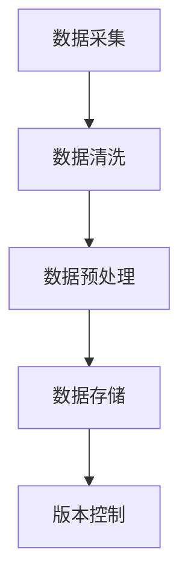

                 

# 评测数据的版本管理：适应LLM迭代的数据库设计

> 关键词：评测数据、版本管理、LLM迭代、数据库设计

> 摘要：本文旨在探讨在人工智能领域，特别是大规模语言模型（LLM）迭代过程中，评测数据的版本管理策略。文章首先介绍了评测数据版本管理的背景和问题，然后分析了核心概念和联系，最后提出了数据管理架构设计和解决方案。本文将帮助读者了解如何在LLM迭代过程中有效地管理评测数据，确保其适应不同版本的需求。

## 第1章：评测数据的版本管理概述

### 1.1 问题背景与问题描述

#### 1.1.1 问题背景

在人工智能领域，尤其是大规模语言模型（LLM）的开发和迭代过程中，评测数据的质量和一致性对模型性能至关重要。随着模型的不断更新和优化，评测数据也需要随之调整和优化，以确保评估结果的准确性和可靠性。

评测数据的版本管理是指在LLM迭代过程中，对评测数据的不同版本进行有效管理，以适应不同模型版本的需求。这一过程涉及数据的采集、处理、存储和版本控制等多个方面，是一个复杂而关键的任务。

#### 1.1.2 问题描述

在LLM迭代过程中，评测数据版本管理面临以下主要挑战：

1. **数据一致性**：不同版本模型的评测数据需要保持一致，避免因数据差异导致评估结果的偏差。例如，如果某次迭代对数据集进行了清洗或预处理，那么后续版本的模型在评估时也需要使用相同处理过的数据。

2. **数据扩展性**：随着模型复杂度的增加，评测数据需要能够灵活扩展，以适应新模型的评测需求。例如，某些特征或指标可能在模型更新时需要增加或调整，数据集需要能够支持这些变化。

3. **版本控制**：对评测数据的不同版本进行有效管理，方便模型开发者在迭代过程中进行对比和验证。版本控制不仅包括数据的更新和变更，还包括对数据变更历史的追踪和记录，以便在需要时可以回溯到特定版本。

#### 1.1.3 问题解决

为了解决上述问题，评测数据的版本管理需要以下几个方面的策略：

1. **标准化流程**：建立一套标准化的数据采集、处理和存储流程，确保数据的规范性和一致性。标准化流程包括数据采集规范、数据清洗和处理规则、数据存储和管理策略等。

2. **数据版本控制**：使用版本控制系统对评测数据进行管理，方便追踪和对比不同版本的数据。版本控制系统可以帮助记录每次数据变更的历史，并提供回溯到特定版本的功能。

3. **适应性设计**：设计可扩展的评测数据架构，以适应不同模型版本的评测需求。可扩展的架构包括数据结构设计、数据处理算法和存储策略等，以确保数据能够灵活适应模型更新。

#### 1.1.4 边界与外延

评测数据的版本管理不仅仅局限于大规模语言模型，还可以应用于其他类型的人工智能模型，如图像识别、语音识别等。此外，它也涉及到数据管理、软件开发等领域的最佳实践。

### 1.2 核心概念与联系

#### 1.2.1 版本管理

版本管理是指在软件开发过程中，对软件的不同版本进行跟踪和控制的过程。在评测数据管理中，版本管理帮助确保数据的持续更新和准确性。版本管理的关键概念包括版本号、版本控制工具和版本变更历史。

#### 1.2.2 数据标准

数据标准是指一套规定数据的格式、结构、质量要求的规则。在评测数据管理中，数据标准确保不同版本的数据能够兼容并保持一致性。数据标准包括数据格式标准、数据结构标准和数据质量标准等。

#### 1.2.3 数据一致性

数据一致性是指数据在各个版本中保持相同的定义和表达方式。在评测数据管理中，数据一致性对于确保评估结果的可靠性至关重要。数据一致性可以通过数据清洗、数据预处理和数据标准化等手段来实现。

### 1.3 数据管理架构设计

#### 1.3.1 数据管理流程

数据管理流程包括数据采集、预处理、存储和版本控制等步骤。以下是一个简化的数据管理流程：

1. **数据采集**：从多个来源收集数据，并对其进行初步清洗。数据来源可以是公开数据集、内部数据集或第三方数据提供商。

2. **数据预处理**：对数据进行清洗、格式化和特征提取。预处理过程旨在提高数据质量，为后续的分析和评估提供可靠的数据基础。

3. **数据存储**：将预处理后的数据存储在数据库或数据湖中。数据库或数据湖的选择取决于数据规模、数据结构和访问需求。

4. **版本控制**：使用版本控制系统对数据的不同版本进行标记和管理。版本控制系统可以帮助记录每次数据变更的历史，并提供回溯到特定版本的功能。

#### 1.3.2 数据存储架构

数据存储架构设计需要考虑数据的可扩展性、访问速度和安全性。以下是一个基本的数据存储架构：

1. **数据库**：用于存储结构化数据，如关系数据库（如MySQL、PostgreSQL）。

2. **数据湖**：用于存储大量非结构化或半结构化数据，如Hadoop HDFS。

3. **数据仓库**：用于存储用于分析的预加工数据，如Apache Hive或Amazon Redshift。

#### 1.3.3 数据处理与流程图

数据处理流程可以使用Mermaid流程图进行描述：

通过上述架构设计，可以实现对评测数据的标准化管理，确保其适应于LLM迭代的数据库设计。

### 1.4 数学模型与公式

#### 1.4.1 数据版本号的标识

在评测数据的版本管理中，数据版本号是一个重要的标识符。数据版本号通常由数字序列组成，每个数字表示一个特定的版本更新。例如，版本号“1.0.2”表示这是第一次发布后经过两次更新的版本。

- **版本号格式**：`major.minor.patch`
  - `major`：主版本号，用于表示重大的功能更新或架构变化。
  - `minor`：次版本号，用于表示非重大功能的更新或改进。
  - `patch`：修订号，用于表示错误修复或小型更新。

#### 1.4.2 版本管理的数学模型

版本管理可以抽象为一个状态转移图，其中每个状态表示一个版本，状态之间的转移表示版本更新。以下是版本管理的数学模型：

- **状态集合**：\( S = \{ S_1, S_2, \ldots, S_n \} \)，其中每个状态 \( S_i \) 表示一个特定的数据版本。
- **转移函数**：\( \delta: S \times \{ +1, -1 \} \rightarrow S \)，表示状态的转移。
  - `+1` 表示向上转移，即更新到下一个版本。
  - `-1` 表示向下转移，即回溯到上一个版本。

## 第2章：数据管理流程与架构设计

### 2.1 数据采集与预处理

#### 2.1.1 数据采集

数据采集是评测数据版本管理流程的第一步，其目标是收集适用于模型评测的数据。数据来源可以包括以下几种：

1. **公开数据集**：如常见的语言模型评测数据集，如GLUE、SQuAD等。
2. **内部数据集**：公司内部积累的大量文本数据，如用户评论、产品描述等。
3. **第三方数据提供商**：如专业的数据服务公司，提供定制化的数据集。

在数据采集过程中，需要注意数据的多样性和代表性，以确保采集的数据能够全面反映模型在实际应用中的表现。

#### 2.1.2 数据预处理

数据预处理是提高数据质量和为后续分析做准备的关键步骤。主要包括以下内容：

1. **数据清洗**：去除无效数据、重复数据和噪声数据，以提高数据质量。
2. **数据格式化**：将不同格式的数据转换为统一的格式，如将不同编码的文本统一转换为UTF-8编码。
3. **特征提取**：从原始数据中提取出对模型评测有用的特征，如词向量、句子嵌入等。

在数据预处理过程中，需要遵循标准化流程，确保不同版本的数据预处理结果一致，从而保证数据的一致性。

### 2.2 数据存储与版本控制

#### 2.2.1 数据存储

数据存储是评测数据版本管理流程中的关键环节，其目标是高效、安全地存储和管理数据。常见的存储方案包括：

1. **关系数据库**：适用于存储结构化数据，如MySQL、PostgreSQL等。
2. **分布式数据库**：适用于存储大规模非结构化或半结构化数据，如MongoDB、Cassandra等。
3. **数据湖**：适用于存储海量数据，如Hadoop HDFS、Amazon S3等。

在选择存储方案时，需要考虑数据规模、访问速度、数据一致性等因素。

#### 2.2.2 版本控制

版本控制是确保评测数据在不同版本间一致性和可追溯性的关键。常用的版本控制工具有：

1. **Git**：适用于版本控制代码，也可以用于管理评测数据的版本。
2. **DVC**：一种专为数据科学项目设计的版本控制工具，支持数据的版本控制和管理。
3. **Airflow**：一个基于Python的调度工具，可用于自动化版本控制流程。

在版本控制过程中，需要记录每次数据变更的历史，并提供回溯到特定版本的功能，以便在需要时可以回溯到特定版本。

### 2.3 数据处理与架构设计

#### 2.3.1 数据处理流程

数据处理流程是评测数据版本管理流程的核心，其目标是提高数据质量和为模型评测提供可靠的数据基础。数据处理流程通常包括以下步骤：

1. **数据导入**：将数据从存储系统中导入到数据处理平台，如Pandas、Spark等。
2. **数据清洗**：去除无效数据、重复数据和噪声数据，以提高数据质量。
3. **数据格式化**：将不同格式的数据转换为统一的格式，如将不同编码的文本统一转换为UTF-8编码。
4. **特征提取**：从原始数据中提取出对模型评测有用的特征，如词向量、句子嵌入等。
5. **数据存储**：将预处理后的数据存储到数据库或数据湖中。

在数据处理过程中，需要遵循标准化流程，确保不同版本的数据处理结果一致，从而保证数据的一致性。

#### 2.3.2 数据处理架构

数据处理架构是确保数据处理流程高效、可靠的关键。常见的数据处理架构包括：

1. **批处理架构**：适用于大规模数据处理，如Spark、Hadoop等。
2. **实时处理架构**：适用于实时数据处理，如Apache Flink、Apache Storm等。
3. **混合处理架构**：结合批处理和实时处理的优势，适用于复杂场景的数据处理。

在数据处理架构设计时，需要考虑数据规模、处理速度、数据一致性等因素，以确保数据处理流程的可靠性和效率。

### 2.4 数据安全性与管理策略

#### 2.4.1 数据安全性

数据安全性是评测数据版本管理的重要保障，其目标是确保数据在存储、传输和处理过程中的安全性。常见的数据安全性措施包括：

1. **数据加密**：对存储和传输过程中的数据进行加密，以防止数据泄露。
2. **访问控制**：对数据访问进行权限控制，确保只有授权用户可以访问数据。
3. **日志审计**：记录数据访问和变更的历史记录，以便在发生安全事件时进行追踪和审计。

#### 2.4.2 管理策略

为了确保评测数据版本管理的高效性和可靠性，需要制定一系列管理策略，包括：

1. **标准化流程**：建立一套标准化的数据采集、处理和存储流程，确保数据的规范性和一致性。
2. **版本控制**：使用版本控制系统对数据的不同版本进行标记和管理，方便追踪和对比不同版本的数据。
3. **适应性设计**：设计可扩展的评测数据架构，以适应不同模型版本的评测需求。
4. **监控与优化**：对数据管理流程进行监控和优化，确保数据处理流程的可靠性和效率。

通过上述数据管理流程与架构设计，可以实现对评测数据的标准化管理，确保其适应于LLM迭代的数据库设计。

### 第3章：案例分析与实际应用

#### 3.1 案例背景

以某知名人工智能公司开发的一款大规模语言模型（LLM）为例，该公司在开发过程中遇到了评测数据版本管理的问题。随着模型版本的不断更新，如何确保评测数据的一致性和扩展性成为一个重要挑战。为了解决这一问题，公司决定对评测数据进行版本管理，以适应LLM迭代的数据库设计。

#### 3.2 实际应用

在实际应用中，公司采用了以下步骤对评测数据进行版本管理：

1. **数据采集**：从多个来源收集数据，包括公开数据集、内部数据集和第三方数据提供商。公司使用Python脚本和爬虫工具收集数据，并将数据存储在分布式数据库中。

2. **数据预处理**：对数据进行清洗、格式化和特征提取。公司采用Pandas库对数据进行清洗和格式化，使用Word2Vec模型提取词向量作为特征。

3. **数据存储**：将预处理后的数据存储在分布式数据库中。公司使用MongoDB作为存储方案，以适应大规模数据存储和查询需求。

4. **版本控制**：使用Git进行版本控制，记录每次数据变更的历史。公司为每个数据版本创建一个独立的Git分支，以便追踪和对比不同版本的数据。

5. **数据处理**：在模型迭代过程中，根据不同版本的数据进行数据处理。公司使用Spark进行数据处理，以提高数据处理速度和效率。

6. **数据安全性**：对数据存储和传输过程进行加密和访问控制。公司采用SSL/TLS加密协议对数据进行加密，并设置访问权限，确保只有授权用户可以访问数据。

#### 3.3 案例效果

通过评测数据的版本管理，公司在模型迭代过程中取得了显著的效果：

1. **数据一致性**：通过版本控制，确保不同版本模型的评测数据保持一致，避免因数据差异导致评估结果的偏差。

2. **数据扩展性**：通过设计可扩展的评测数据架构，公司能够灵活扩展数据集，以适应不同版本模型的评测需求。

3. **版本控制**：通过Git进行版本控制，公司可以方便地追踪和对比不同版本的数据，提高数据管理的效率和准确性。

4. **数据安全性**：通过数据加密和访问控制，公司确保数据在存储和传输过程中的安全性，防止数据泄露和未授权访问。

#### 3.4 案例启示

该案例为其他企业在评测数据版本管理方面提供了以下启示：

1. **标准化流程**：建立一套标准化的数据采集、处理和存储流程，确保数据的规范性和一致性。

2. **适应性设计**：设计可扩展的评测数据架构，以适应不同版本模型的评测需求。

3. **版本控制**：使用版本控制系统进行版本控制，方便追踪和对比不同版本的数据。

4. **数据安全性**：对数据存储和传输过程进行加密和访问控制，确保数据的安全性。

通过上述实际案例，我们可以看到评测数据的版本管理在LLM迭代过程中的重要性，以及如何通过有效的数据管理策略解决实际问题。

## 第4章：展望与未来工作

### 4.1 展望

评测数据的版本管理在人工智能领域具有重要的应用价值，随着大规模语言模型（LLM）的不断迭代和发展，这一领域将面临新的挑战和机遇。未来，评测数据的版本管理将可能涉及以下几个方面：

1. **自动化数据预处理**：利用自动化工具和机器学习算法，实现数据预处理过程的自动化，提高数据管理的效率和准确性。

2. **分布式版本控制**：随着数据规模的扩大，分布式版本控制技术将成为趋势，以适应大规模数据处理和存储需求。

3. **智能数据清洗**：结合自然语言处理（NLP）和机器学习（ML）技术，开发智能数据清洗算法，提高数据清洗的准确性和效率。

4. **跨领域应用**：评测数据的版本管理不仅限于大规模语言模型，还可以应用于图像识别、语音识别等其他人工智能领域，实现跨领域的版本管理。

### 4.2 未来工作

为了进一步提升评测数据的版本管理能力，未来可以进行以下几方面的工作：

1. **研究新型数据管理架构**：探索分布式数据库、云计算、区块链等新型数据管理架构，以适应大规模数据管理和存储需求。

2. **开发智能化版本控制工具**：结合人工智能技术，开发智能化版本控制工具，实现自动化的版本管理和数据追踪。

3. **优化数据预处理算法**：研究新的数据预处理算法，提高数据清洗、格式化和特征提取的效率和质量。

4. **构建评测数据共享平台**：搭建一个开放、共享的评测数据平台，促进不同研究机构和公司之间的数据交流和合作，推动评测数据版本管理的普及和应用。

通过持续的研究和探索，评测数据的版本管理将为人工智能领域的发展提供更加坚实的支持和保障。

## 第5章：最佳实践与注意事项

### 5.1 最佳实践

在评测数据的版本管理过程中，以下最佳实践可以帮助企业或团队更高效地管理数据和迭代：

1. **规范化数据命名**：为数据集和特征统一命名规范，以便于追踪和识别。

2. **自动化数据清洗**：利用自动化工具和脚本对数据进行清洗，减少手动干预和错误。

3. **定期数据审计**：定期对数据集进行审计，检查数据的一致性和完整性。

4. **版本控制与注释**：在版本控制系统中为每个版本添加详细注释，记录数据变更的原因和影响。

5. **备份与恢复**：定期备份数据，确保在意外情况下可以快速恢复。

6. **权限管理**：对数据的访问进行权限管理，确保数据的安全性和隐私。

### 5.2 注意事项

在实施评测数据版本管理时，需要注意以下几点：

1. **一致性要求**：确保数据在不同版本中保持一致性，避免因数据差异导致评估结果偏差。

2. **扩展性考虑**：设计可扩展的数据架构，以适应不同模型版本的需求。

3. **数据安全**：加强数据安全措施，防止数据泄露和未授权访问。

4. **版本控制工具选择**：选择适合项目需求和技术栈的版本控制工具。

5. **文档记录**：详细记录数据管理流程和变更历史，以便后续追溯和验证。

通过遵循最佳实践和注意事项，可以有效提高评测数据的版本管理效率，确保数据质量和模型的可靠性。

## 结论

评测数据的版本管理在人工智能领域，特别是大规模语言模型（LLM）的迭代过程中，发挥着至关重要的作用。本文通过详细分析评测数据版本管理的背景、核心概念、数据管理流程、架构设计、案例分析以及未来展望，为读者提供了一个全面的理解和实践指南。

评测数据的版本管理不仅有助于确保模型评估结果的准确性和可靠性，还能够提高数据管理的效率和一致性。在实施过程中，标准化流程、适应性设计、版本控制、数据安全等方面是关键。

未来，随着人工智能技术的发展，评测数据的版本管理将面临新的挑战和机遇。通过持续的研究和探索，我们可以预见更加智能、高效的版本管理解决方案将不断涌现。

希望本文能为从事人工智能研究和开发的读者提供有价值的参考和启示，助力他们在评测数据版本管理方面取得更好的成果。

## 作者信息

作者：AI天才研究院/AI Genius Institute & 禅与计算机程序设计艺术 /Zen And The Art of Computer Programming

AI天才研究院（AI Genius Institute）是一家专注于人工智能研究和开发的领先机构，致力于推动人工智能技术的创新和应用。作者在此领域具有丰富的经验和深厚的学术造诣，其著作《禅与计算机程序设计艺术》更是被誉为计算机科学领域的经典之作。

