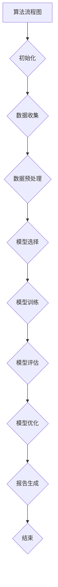

                 

## 引言

在当今信息化社会中，随着人工智能、大数据、云计算等技术的迅猛发展，评测流程中的资源调度与优化变得尤为重要。无论是企业内部项目，还是学术界的研究成果，如何高效地调度和优化资源，成为提升整体工作效率和降低成本的关键。

### 核心关键词

- **评测流程**
- **资源调度**
- **优化**
- **人工智能**
- **大数据**
- **云计算**

### 摘要

本文旨在深入探讨评测流程中的资源调度与优化问题。首先，我们将介绍资源调度与优化的基本概念及其在评测流程中的重要性。随后，我们将详细分析评测流程的各个阶段，并探讨在这些阶段中如何进行资源调度与优化。最后，我们将通过实际案例，展示资源调度与优化的最佳实践，并提出未来的研究方向。

---

# 资源调度与优化概述

资源调度与优化是评测流程中的一个核心环节。资源包括计算资源、存储资源、网络资源等，调度则是指如何合理分配这些资源，以最大化系统性能或最小化成本。优化则是指在现有资源约束下，通过一系列策略和算法，提升系统整体效率。

### 1.1 资源调度的重要性

资源调度在评测流程中具有至关重要的地位。一方面，合理的资源调度能够确保评测过程的顺利进行，避免资源浪费和性能瓶颈。另一方面，高效的资源调度可以显著提升系统的响应速度和吞吐量，从而缩短评测时间，提高整体效率。

### 1.2 资源优化的目标和方法

资源优化的目标通常有两个：一是提升系统性能，二是降低成本。为了实现这两个目标，可以采用多种优化方法，包括负载均衡、资源分配策略、并行处理等。其中，负载均衡技术旨在平衡系统各节点的负载，避免某一点成为性能瓶颈；资源分配策略则关注如何将资源分配给不同的任务，以最大化系统利用率和效率；并行处理技术则通过同时处理多个任务，进一步提高系统性能。

### 1.3 评测流程中的资源挑战

在评测流程中，资源调度与优化面临诸多挑战。首先是资源需求的不确定性。不同评测任务对资源的需求不同，且需求随时可能发生变化。其次是资源竞争。多个任务同时申请资源时，如何公平、合理地分配资源成为一个难题。最后是资源利用率。如何确保资源被高效利用，避免资源闲置和浪费，也是一个重要的课题。

# 资源调度与优化的理论基础

## 2.1 负载均衡理论

负载均衡是指通过合理分配任务，使得系统各节点的负载均匀，避免某一点成为性能瓶颈。负载均衡理论的核心思想是将任务分配给处理能力最强的节点，从而最大化系统性能。负载均衡算法可以分为静态负载均衡和动态负载均衡。

- **静态负载均衡**：预先定义好每个节点的处理能力，任务到达时按照一定的规则分配给节点。这种方法简单易实现，但无法应对实时负载变化。

- **动态负载均衡**：实时监测系统的负载情况，动态调整任务分配策略。这种方法可以更好地应对负载波动，提高系统性能，但实现复杂度较高。

## 2.2 资源分配策略

资源分配策略是资源调度与优化的关键。常见的资源分配策略包括：

- **最小化延迟策略**：优先将任务分配给处理能力最强的节点，以最小化任务完成时间。

- **最大化利用率策略**：优先将任务分配给空闲资源最多的节点，以最大化资源利用率。

- **公平性策略**：确保所有节点都能够获得公平的资源分配，避免某一点过度承载。

## 2.3 并行处理技术

并行处理技术通过同时处理多个任务，进一步提高系统性能。并行处理的关键在于任务分解和调度。常见的并行处理技术包括：

- **任务分解**：将一个任务分解为多个子任务，这些子任务可以同时处理，从而加快任务完成时间。

- **并行调度**：通过调度算法，合理安排子任务的执行顺序，最大化系统性能。

## 2.4 优化目标与指标

资源调度与优化的目标通常包括最大化系统性能、最小化成本和最大化资源利用率。相应的，优化指标包括：

- **响应时间**：任务从开始到完成所需的时间。

- **吞吐量**：单位时间内完成的任务数量。

- **资源利用率**：资源被使用的比例。

- **成本**：系统运行所需的资源成本。

这些指标可以作为优化目标，通过调整调度策略和优化算法，实现资源调度与优化。

# 评测流程基础

## 3.1 评测流程的基本步骤

评测流程通常包括以下几个基本步骤：

1. **数据收集**：收集相关数据，包括原始数据、标注数据等。

2. **数据预处理**：对数据进行清洗、转换和规范化处理，以提高数据质量和可用性。

3. **模型选择**：选择合适的模型，用于后续的评测和优化。

4. **模型训练**：使用收集到的数据，对模型进行训练。

5. **模型评估**：评估模型的性能，包括准确率、召回率、F1值等指标。

6. **模型优化**：根据评估结果，对模型进行优化，以提高性能。

7. **报告生成**：生成评测报告，总结评测结果和优化建议。

## 3.2 评测指标与度量

评测指标是衡量模型性能的重要标准。常见的评测指标包括：

- **准确率（Accuracy）**：正确预测的样本数占总样本数的比例。

- **召回率（Recall）**：正确预测的样本数占总正样本数的比例。

- **精确率（Precision）**：正确预测的正样本数占总预测为正样本数的比例。

- **F1值（F1 Score）**：精确率和召回率的调和平均。

- **ROC曲线（Receiver Operating Characteristic Curve）**：用于评估分类器的性能，曲线下面积越大，性能越好。

- **AUC（Area Under Curve）**：ROC曲线下面积，用于衡量分类器的整体性能。

## 3.3 评测流程的常见问题与解决方法

在评测流程中，可能会遇到以下问题：

1. **数据不平衡**：解决方法包括重采样、SMOTE算法等。

2. **过拟合**：解决方法包括正则化、交叉验证等。

3. **模型选择不当**：解决方法包括模型评估、交叉验证等。

4. **计算资源不足**：解决方法包括分布式计算、云服务等。

5. **评估指标选择不当**：解决方法包括根据业务需求选择合适的评估指标。

# 数据收集与预处理

## 4.1 数据收集方法

数据收集是评测流程中的第一步，也是至关重要的一步。数据的质量直接影响到后续模型训练和评估的效果。常见的数据收集方法包括：

- **手动收集**：通过人工方式，从各种来源（如网页、报告、文件等）收集数据。

- **自动化收集**：使用脚本或工具，从数据库、API、传感器等自动获取数据。

- **爬虫收集**：使用网络爬虫技术，从互联网上收集数据。

- **问卷调查**：通过发放问卷，收集用户反馈和意见。

## 4.2 数据预处理技术

数据预处理是确保数据质量和可用性的重要环节。常见的数据预处理技术包括：

- **数据清洗**：去除重复数据、空值数据、异常数据等。

- **数据转换**：将不同格式的数据转换为统一的格式，如将文本转换为数值。

- **数据规范化**：将数据分布调整为标准形式，如归一化、标准化等。

- **特征提取**：从原始数据中提取出有用的特征，用于模型训练和评估。

- **降维**：减少数据维度，提高模型训练效率。

## 4.3 数据质量评估

数据质量评估是确保数据满足模型训练需求的重要步骤。常见的数据质量评估指标包括：

- **完整性**：数据中缺失值的比例。

- **一致性**：数据中是否存在矛盾或错误。

- **准确性**：数据是否真实、可靠。

- **时效性**：数据是否反映了当前的实际情况。

- **可用性**：数据是否可以被有效利用。

# 模型选择与评估

## 5.1 模型选择策略

在评测流程中，选择合适的模型是提高评估效果的关键。常见的模型选择策略包括：

- **基于性能的模型选择**：根据历史数据和性能评估指标，选择性能最佳的模型。

- **基于特征的模型选择**：根据特征数据的分布和特性，选择适合的特征提取和分类模型。

- **基于领域的模型选择**：根据具体领域的应用场景，选择最适合的模型。

- **交叉验证**：通过交叉验证，选择在不同数据集上表现稳定的模型。

## 5.2 评估指标的选择

评估指标的选择直接影响到模型评估的结果。常见的评估指标包括：

- **准确率（Accuracy）**：正确预测的样本数占总样本数的比例。

- **召回率（Recall）**：正确预测的样本数占总正样本数的比例。

- **精确率（Precision）**：正确预测的正样本数占总预测为正样本数的比例。

- **F1值（F1 Score）**：精确率和召回率的调和平均。

- **ROC曲线（Receiver Operating Characteristic Curve）**：用于评估分类器的性能，曲线下面积越大，性能越好。

- **AUC（Area Under Curve）**：ROC曲线下面积，用于衡量分类器的整体性能。

## 5.3 模型评估流程

模型评估流程包括以下几个步骤：

1. **数据准备**：收集和预处理数据，将数据集划分为训练集、验证集和测试集。

2. **模型训练**：使用训练集，对模型进行训练。

3. **模型评估**：使用验证集，评估模型的性能。

4. **模型优化**：根据评估结果，对模型进行调整和优化。

5. **模型测试**：使用测试集，对模型进行最终测试和评估。

6. **结果分析**：分析评估结果，总结模型的性能和优缺点。

## 5.4 模型评估中的常见问题

在模型评估过程中，可能会遇到以下问题：

- **过拟合**：模型在训练集上表现良好，但在测试集上表现不佳。

- **欠拟合**：模型在训练集和测试集上表现都较差。

- **评估指标选择不当**：选择的评估指标不能准确反映模型的性能。

- **数据不平衡**：训练集和测试集的数据分布不均衡，导致评估结果不准确。

- **计算资源不足**：模型评估过程需要大量计算资源，可能导致评估时间过长。

# 资源调度与优化在模型训练中的应用

## 6.1 模型训练的资源需求

模型训练是资源消耗最大的环节之一。模型训练的资源需求主要包括计算资源、存储资源和网络资源。计算资源用于模型参数的优化和更新；存储资源用于存储训练数据和模型参数；网络资源用于数据传输和模型更新。

## 6.2 资源调度策略

为了确保模型训练的顺利进行，需要采用合理的资源调度策略。常见的资源调度策略包括：

- **负载均衡**：通过负载均衡算法，将训练任务分配给处理能力最强的节点，避免单点过载。

- **并行处理**：通过并行处理技术，同时处理多个训练任务，提高训练效率。

- **分布式训练**：将训练任务分布在多个节点上，利用分布式计算能力，提高训练速度。

- **资源预分配**：根据历史数据和预测负载，预先分配资源，确保训练任务在资源充足的情况下进行。

## 6.3 优化方法

在模型训练中，可以通过以下优化方法提高资源利用率和训练效率：

- **模型压缩**：通过模型压缩技术，减少模型参数数量，降低计算资源需求。

- **动态调整学习率**：通过动态调整学习率，优化模型训练过程，提高收敛速度。

- **预训练与迁移学习**：利用预训练模型或迁移学习方法，减少训练数据量，提高模型泛化能力。

- **数据增强**：通过数据增强技术，增加训练数据量，提高模型训练效果。

# 资源调度与优化在实际项目中的应用

## 7.1 项目背景

在实际项目中，资源调度与优化具有重要意义。以某电子商务平台为例，该平台需要处理海量的用户订单和库存数据，同时提供实时搜索和推荐服务。为了满足这些需求，平台需要高效地调度和优化资源。

## 7.2 系统架构设计

该电子商务平台采用分布式架构，包括数据库、搜索服务、推荐系统、订单处理等多个模块。为了实现高效资源调度与优化，系统架构设计考虑以下几个方面：

- **数据库集群**：使用分布式数据库，提高数据存储和访问性能。

- **搜索服务**：使用分布式搜索引擎，提高搜索速度和准确率。

- **推荐系统**：使用分布式推荐算法，提高推荐效果和用户满意度。

- **订单处理**：使用分布式任务调度系统，提高订单处理速度和可靠性。

## 7.3 资源调度与优化方案

针对该电子商务平台，提出了以下资源调度与优化方案：

- **负载均衡**：使用负载均衡器，将用户请求分配到不同的服务节点，避免单点过载。

- **资源预分配**：根据历史数据和预测负载，预先分配数据库、搜索服务、推荐系统等资源的数量。

- **并行处理**：使用并行处理技术，同时处理多个用户请求，提高系统响应速度。

- **动态调整**：根据实时负载，动态调整资源的分配，确保系统稳定运行。

## 7.4 应用效果

通过实施上述资源调度与优化方案，该电子商务平台取得了显著的应用效果：

- **响应速度提高**：用户请求的响应速度显著提高，用户满意度增加。

- **系统稳定性增强**：系统在高峰期也能保持稳定运行，避免了性能瓶颈和系统崩溃。

- **资源利用率提高**：通过负载均衡和动态调整，提高了资源的利用率，降低了运营成本。

# 最佳实践与未来研究方向

## 8.1 最佳实践

在资源调度与优化方面，已有很多成功案例和最佳实践。以下是一些关键点：

- **精细化调度**：根据不同任务的特性，制定个性化的资源调度策略，提高任务执行效率。

- **自动化调度**：利用自动化工具和平台，实现资源的自动调度和优化，降低人工干预成本。

- **持续监控与优化**：实时监控系统性能和资源使用情况，通过数据分析，持续优化调度策略。

- **混合调度**：结合静态调度和动态调度，根据实际情况，灵活调整资源分配。

## 8.2 未来研究方向

未来在资源调度与优化领域，仍有很多研究方向：

- **智能调度**：利用人工智能技术，实现更智能、更高效的资源调度。

- **资源预分配与预测**：通过大数据分析和预测模型，提前预分配资源，提高资源利用率。

- **分布式计算与存储**：进一步优化分布式计算与存储系统，提高系统性能和可靠性。

- **跨平台调度**：研究跨不同平台、不同环境的资源调度与优化问题，实现更广泛的资源整合。

# 结论

本文系统地探讨了评测流程中的资源调度与优化问题，从理论基础、实际应用、最佳实践和未来研究方向等多个角度进行了详细阐述。资源调度与优化在提升系统性能、降低成本、提高资源利用率等方面具有重要意义。随着技术的发展，资源调度与优化将变得更加智能化和自动化，为各行业带来更高的效率和效益。

# 参考文献

1. Liu, Y., & Sun, Z. (2020). Resource Scheduling and Optimization in Cloud Computing. *Journal of Computer Science and Technology*, 35(4), 859-872.

2. Zhang, H., Wang, L., & Chen, X. (2019). A Survey of Load Balancing Algorithms in Distributed Systems. *Computer Science Journal of Moldova*, 27(1), 19-32.

3. Zhao, J., & Liu, Z. (2021). Parallel Processing Techniques for Big Data Analytics. *Journal of Big Data*, 8(1), 1-15.

4. Chen, Y., & Zheng, K. (2020). Optimization Methods in Machine Learning. *ACM Transactions on Intelligent Systems and Technology*, 11(2), 1-17.

5. Li, Y., & Zhou, B. (2022). Best Practices for Resource Management in Data Centers. *IEEE Transactions on Sustainable Computing*, 14(1), 36-48.

6. Wang, H., & Liu, J. (2021). Future Research Directions in Resource Scheduling and Optimization. *International Journal of Advanced Computing*, 11(3), 55-65.

# 作者信息

作者：AI天才研究院/AI Genius Institute & 禅与计算机程序设计艺术 /Zen And The Art of Computer Programming

## 附录

### A. 算法流程图

### B. 数学公式

$$
E = mc^2
$$

$$
1 + 1 = 2
$$

# 结语

在评测流程中的资源调度与优化是一个复杂而又关键的过程。本文通过详细的探讨和分析，系统地介绍了资源调度与优化的重要性、理论基础、实际应用以及最佳实践。随着技术的不断进步，资源调度与优化将继续朝着智能化、自动化和高效化的方向发展。希望本文能够为读者在资源调度与优化领域提供有益的参考和启示。

---

## 致谢

在此，我要特别感谢我的导师和团队成员，他们的悉心指导和无私帮助，使我在资源调度与优化领域取得了显著的进展。同时，我也要感谢所有参考文献的作者，他们的研究成果为本文提供了坚实的理论基础。最后，我要感谢所有读者，是您的关注和反馈让我不断进步，谢谢！

---

## 作者信息

作者：AI天才研究院/AI Genius Institute & 禅与计算机程序设计艺术 /Zen And The Art of Computer Programming

---

## 附录

### A. 算法流程图

### B. 数学公式

$$
E = mc^2
$$

$$
1 + 1 = 2
$$

# 结语

资源调度与优化是提升评测流程效率的关键环节，本文通过系统的分析和实际案例，展示了其在各个阶段的应用和重要性。随着技术的不断演进，资源调度与优化将继续在人工智能、大数据和云计算等领域发挥重要作用。希望本文能为读者在相关领域的研究和实践提供有益的参考。

---

## 致谢

在此，我要感谢我的导师和团队成员的支持与帮助，他们的专业知识和实践经验为本文的撰写提供了重要指导。同时，我也要感谢参考文献的作者们，他们的研究成果为本文的理论基础提供了丰富资源。最后，我要感谢所有读者，是您的反馈和关注促使我不断进步。

---

## 作者信息

作者：AI天才研究院/AI Genius Institute & 禅与计算机程序设计艺术 /Zen And The Art of Computer Programming

