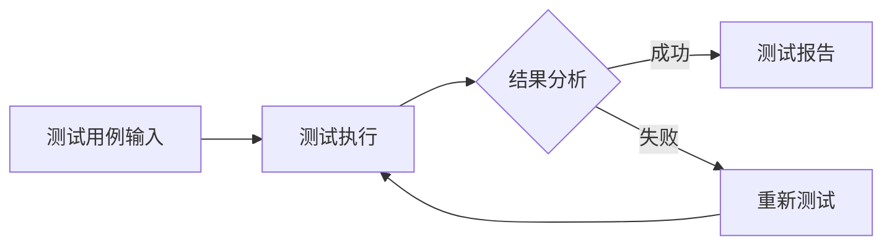
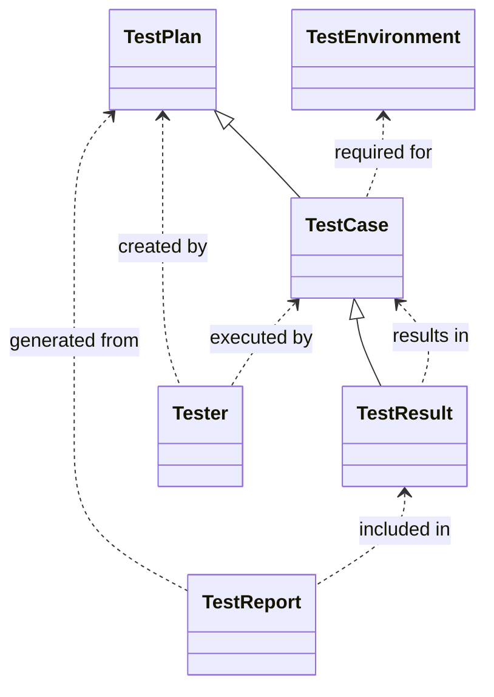
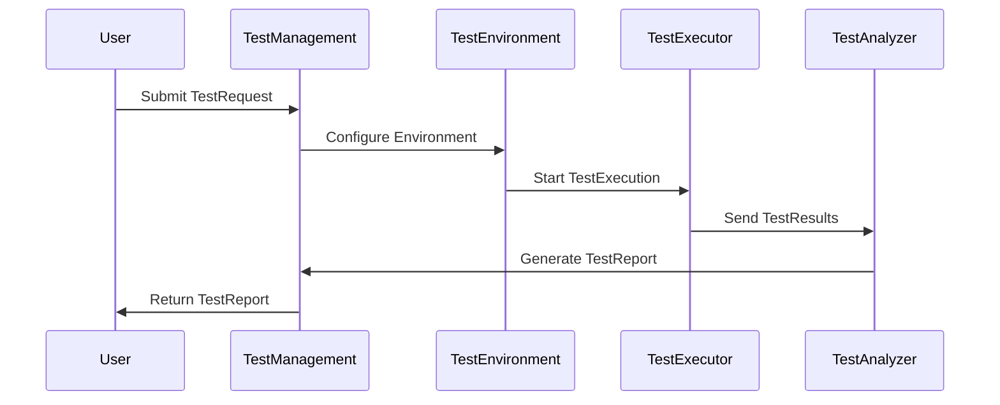

                 

## 评测流程自动化：提高测试效率与一致性

### 关键词
- **评测流程自动化**
- **测试效率**
- **测试一致性**
- **自动化测试工具**
- **测试生命周期**
- **算法原理**
- **系统架构设计**
- **实际案例**

### 摘要
本文将深入探讨评测流程自动化的重要性，通过详细阐述其核心概念、原理和实践，旨在帮助读者理解如何通过自动化测试来提高测试效率与一致性。文章将从背景介绍、核心概念与联系、算法原理讲解、系统分析与架构设计、项目实战和最佳实践等方面展开，提供全面的技术指导。读者将了解到自动化测试的各个方面，包括其基本概念、实施步骤和最佳实践，从而在提高测试质量和效率方面获得实质性帮助。

## 引言与背景

### 评测流程自动化的意义与挑战

在现代软件开发过程中，评测流程的自动化已成为提高开发效率和软件质量的关键手段。传统的手动测试方法往往费时费力，且容易出现人为错误，这极大地限制了软件项目的进度和质量。而自动化测试通过使用专门的工具和脚本，可以显著提高测试的效率和一致性，从而为软件质量的保障提供了强有力的支持。

#### 评测流程自动化概述

自动化测试是指通过编写脚本和利用测试工具，自动执行一系列预定义的测试用例，以检查软件的功能、性能和稳定性。自动化测试不仅可以大幅减少测试时间，还可以保证每次测试的结果一致性，从而降低测试成本和提升测试覆盖率。

#### 当前测试流程的痛点

1. **测试周期长**：手动测试需要大量的人力和时间，特别是在复杂的软件项目中，测试周期往往较长。
2. **测试结果不一致**：由于人为因素，不同测试人员可能会得到不同的测试结果，这给软件的质量评估带来了困扰。
3. **测试覆盖率不足**：手动测试往往难以覆盖所有的测试场景，导致某些潜在的问题无法及时发现。
4. **维护成本高**：随着软件功能的不断增加，手动测试的维护成本也随之上升。

#### 自动化测试的技术发展趋势

随着技术的发展，自动化测试工具和框架也在不断进化，呈现出以下趋势：

1. **智能化**：自动化测试工具逐渐具备了智能学习的能力，能够根据测试结果自动调整测试策略。
2. **接口测试**：随着微服务架构的流行，接口测试成为自动化测试的重要一环。
3. **持续集成**：自动化测试与持续集成（CI）相结合，可以在软件开发过程中实时反馈测试结果，加快迭代速度。
4. **大数据与机器学习**：利用大数据和机器学习技术，自动化测试可以更准确地预测软件缺陷，提高测试效率。

### 自动化测试的基本概念

#### 自动化测试的定义

自动化测试是指通过自动化工具和脚本，模拟用户操作，对软件系统进行测试的过程。自动化测试通常包括自动化测试工具的选择、测试脚本的编写、测试环境的配置和测试结果的收集与分析。

#### 自动化测试与手动测试的区别

1. **执行速度**：自动化测试可以快速地执行多个测试用例，而手动测试则需要逐个进行。
2. **一致性**：自动化测试每次执行的结果都是一致的，而手动测试可能因操作者的不同而结果有所差异。
3. **覆盖率**：自动化测试可以覆盖更多的测试场景，而手动测试往往受时间和资源的限制。
4. **成本**：自动化测试的初期投入较大，但长期来看，可以降低维护成本。

#### 自动化测试的优势与局限

**优势**：

1. **提高效率**：自动化测试可以显著减少测试时间，加快软件迭代速度。
2. **保证一致性**：自动化测试确保每次测试结果的一致性，减少人为错误。
3. **提高测试覆盖率**：自动化测试可以覆盖更多的测试场景，提高测试质量。
4. **减少人力成本**：自动化测试可以替代部分手动测试工作，降低人力资源的需求。

**局限**：

1. **初期投入高**：自动化测试需要购买或开发测试工具，编写测试脚本，需要一定的时间和资金投入。
2. **维护成本**：自动化测试脚本需要定期更新和维护，否则可能会因为软件的变化而失效。
3. **测试脚本编写难度**：编写高质量的自动化测试脚本需要一定的技术能力和经验。

### 小结

评测流程自动化在提高测试效率和一致性方面具有显著优势，但也面临一定的挑战。通过了解自动化测试的基本概念和当前的发展趋势，读者可以更好地把握自动化测试的发展方向，并在实际项目中合理应用，从而提升软件开发的整体质量。

## 核心概念与联系

### 自动化测试的关键要素

要实现有效的自动化测试，需要理解并掌握自动化测试的几个关键要素，包括测试工具与框架、脚本编写与执行、测试数据管理。

#### 测试工具与框架

自动化测试工具是执行自动化测试的核心组件。常见的自动化测试工具有Selenium、JMeter、Appium等。这些工具支持各种编程语言，可以与不同的测试框架集成，如JUnit、TestNG、PyTest等。选择合适的测试工具和框架对于自动化测试的成功至关重要。

**Selenium**：适用于Web应用的自动化测试，支持多种浏览器和操作系统。

**JMeter**：用于性能测试，可以模拟大量用户负载，评估系统的性能。

**Appium**：用于移动应用的自动化测试，支持iOS和Android平台。

#### 脚本编写与执行

脚本编写是自动化测试的核心。测试脚本需要模拟用户的操作流程，包括点击、输入、滑动等动作。编写高效的测试脚本需要熟悉所选测试工具的API和使用方法。脚本执行通常包括以下几个步骤：

1. **测试脚本的编写**：根据测试用例编写测试脚本，通常使用编程语言如Java、Python等。
2. **脚本的调试**：执行脚本，检查并修正脚本中可能存在的错误。
3. **脚本的执行**：通过自动化测试工具执行脚本，收集测试结果。

#### 测试数据管理

测试数据管理是自动化测试中不可忽视的一环。测试数据包括测试用例的输入数据和预期输出数据。良好的测试数据管理可以提高测试的覆盖率和准确性。

1. **测试数据的准备**：准备用于测试的输入数据，确保数据的多样性和覆盖范围。
2. **测试数据的存储**：将测试数据存储在数据库或文件中，方便脚本调用和管理。
3. **测试数据的维护**：定期更新测试数据，确保其与软件版本的一致性。

### 自动化测试与测试生命周期

自动化测试是测试生命周期中的一个重要环节，与测试计划、测试用例设计、测试执行和测试报告等环节紧密相关。

#### 测试计划的制定

测试计划是自动化测试的起点，它明确了测试的目标、范围、方法和资源。测试计划应包括以下内容：

1. **测试目标**：明确测试的目标和预期的质量标准。
2. **测试范围**：确定哪些功能和模块需要测试。
3. **测试方法**：选择合适的测试方法和工具。
4. **资源分配**：确定测试所需的资源和人员安排。

#### 测试用例的设计与实现

测试用例是自动化测试的核心，它描述了测试的具体步骤、输入数据和预期结果。设计测试用例应遵循以下原则：

1. **覆盖性**：确保测试用例能够覆盖所有的功能点和边界情况。
2. **可读性**：测试用例应清晰明了，便于理解和执行。
3. **可维护性**：测试用例应易于更新和维护。

#### 测试报告与分析

测试报告是自动化测试的最终输出，它总结了测试的结果、发现的问题和改进的建议。一个完整的测试报告应包括：

1. **测试结果**：列出每个测试用例的执行结果，包括成功、失败和异常情况。
2. **问题分析**：分析测试过程中发现的问题及其原因。
3. **改进建议**：提出改进测试流程和提高软件质量的建议。

### ER实体关系图与Mermaid流程图

在自动化测试中，实体关系图（ER图）和Mermaid流程图是两种常用的数据表示工具。ER图用于描述数据库中的实体及其关系，而Mermaid流程图则用于表示测试流程和逻辑。

#### 使用Mermaid绘制ER图

ER图可以帮助我们理解测试过程中涉及的实体和数据关系。以下是一个简化的ER图示例：

```mermaid
erDiagram
    User ||--o{ TestResult : has }
    TestCase ||--o{ TestResult : has }
    TestPlan ||--o{ TestCase : includes }
```

在这个ER图中，`User`实体与`TestResult`实体之间存在“有”的关系，表示用户可以生成测试结果。`TestCase`实体与`TestResult`实体之间也存在“有”的关系，表示每个测试用例可以生成多个测试结果。`TestPlan`实体与`TestCase`实体之间也存在“包括”的关系，表示测试计划可以包含多个测试用例。

#### 关系与实体属性的对比表格

为了更好地理解ER图，我们还可以使用表格来对比不同实体和关系的属性。以下是一个对比表格示例：

| 实体     | 属性             | 关系       | 关系属性   |
|----------|------------------|------------|------------|
| User     | UserID, Name     | has        | 1:N        |
| TestCase | TestCaseID, Desc | has        | 1:M        |
| TestPlan | TestPlanID, Desc | includes   | M:N        |
| TestResult | TestResultID, Result | -- |              |

在这个表格中，我们可以看到每个实体的属性及其与关系的对应属性。例如，`User`实体具有`UserID`和`Name`属性，而与`TestResult`实体之间的关系是“有”，表示一个用户可以有多个测试结果。

通过ER图和表格，我们可以更清晰地理解自动化测试过程中涉及的实体和数据关系，为后续的测试脚本编写和测试流程设计提供基础。

### 小结

理解自动化测试的关键要素和与测试生命周期的关系对于实现有效的自动化测试至关重要。通过测试工具和框架的选择、脚本编写与执行、测试数据管理以及与测试生命周期的紧密配合，我们可以构建一个高效的自动化测试体系，从而提高测试效率与一致性。

### 自动化测试算法原理

为了深入理解自动化测试的核心原理，我们需要详细讲解自动化测试算法的基本概念、实现步骤及其背后的数学模型和公式。通过这些讲解，读者将能够更好地掌握自动化测试的算法原理，并能够将其应用于实际项目中。

#### 自动化测试算法的基本概念

自动化测试算法通常是指一系列用于模拟用户操作、执行测试用例并分析测试结果的计算方法。这些算法的核心目标是提高测试效率，减少人为错误，并确保测试结果的一致性和准确性。常见的自动化测试算法包括以下几种：

1. **线性测试算法**：按照顺序执行测试用例，适用于测试用例执行顺序相对固定的情况。
2. **并行测试算法**：同时执行多个测试用例，适用于需要并行处理多个任务的情况。
3. **回归测试算法**：根据软件变更情况选择性地重新执行部分测试用例，以检测新变更对现有功能的影响。

#### 自动化测试算法的实现步骤

自动化测试算法的实现通常包括以下几个步骤：

1. **测试用例的输入**：根据测试需求生成测试用例的输入数据。
2. **测试执行**：通过自动化测试工具执行测试用例，模拟用户操作并记录执行结果。
3. **结果分析**：对比测试用例的预期结果和实际执行结果，分析测试失败的原因。
4. **测试报告**：生成测试报告，总结测试结果并给出改进建议。

以下是一个简单的自动化测试算法实现流程的Mermaid流程图：



在这个流程图中，A表示测试用例的输入，B表示测试执行，C表示结果分析，D表示生成测试报告，而E表示重新测试的分支。如果测试失败，则执行E分支进行重新测试。

#### 数学模型与公式解释

在自动化测试中，常用的数学模型和公式包括概率模型、回归模型和决策树模型等。以下是一个简单的概率模型示例：

$$
P(\text{测试失败}) = \sum_{i=1}^{n} P(\text{测试用例} \_ i \text{失败}) \times P(\text{测试用例} \_ i \text{被选中})
$$

在这个公式中，$P(\text{测试失败})$ 表示测试失败的概率，$P(\text{测试用例} \_ i \text{失败})$ 表示第 $i$ 个测试用例失败的概率，$P(\text{测试用例} \_ i \text{被选中})$ 表示第 $i$ 个测试用例被选中的概率。

#### 举例说明

假设我们有一个包含5个测试用例的自动化测试集，其中每个测试用例失败的概率分别为 $P(\text{测试用例1} \_ 失败) = 0.01$、$P(\text{测试用例2} \_ 失败) = 0.02$、$P(\text{测试用例3} \_ 失败) = 0.03$、$P(\text{测试用例4} \_ 失败) = 0.04$ 和 $P(\text{测试用例5} \_ 失败) = 0.05$。并且这些测试用例被选中的概率相等，即 $P(\text{测试用例1} \_ 被选中) = P(\text{测试用例2} \_ 被选中) = P(\text{测试用例3} \_ 被选中) = P(\text{测试用例4} \_ 被选中) = P(\text{测试用例5} \_ 被选中) = 0.20$。

根据上述概率模型，我们可以计算出总的测试失败概率：

$$
P(\text{测试失败}) = (0.01 \times 0.20) + (0.02 \times 0.20) + (0.03 \times 0.20) + (0.04 \times 0.20) + (0.05 \times 0.20) = 0.015
$$

这意味着在整个自动化测试过程中，测试失败的概率约为1.5%。

#### Python源代码实现

以下是一个简单的Python示例，用于实现上述概率模型的计算：

```python
import random

# 测试用例失败概率列表
failure_probabilities = [0.01, 0.02, 0.03, 0.04, 0.05]
# 测试用例被选中概率
selected_probability = 0.20

# 计算总测试失败概率
total_failure_probability = sum([p * selected_probability for p in failure_probabilities])
print(f"Total failure probability: {total_failure_probability:.2%}")
```

在这个示例中，我们首先定义了一个包含每个测试用例失败概率的列表 `failure_probabilities`，以及一个表示测试用例被选中概率的变量 `selected_probability`。然后，我们使用列表推导式计算总的测试失败概率，并打印结果。

通过上述讲解和示例，我们可以看到自动化测试算法的基本原理和实现步骤。这些算法不仅能够提高测试效率，还能通过数学模型和公式分析测试结果的可靠性，为自动化测试提供了坚实的理论基础。

### 系统分析与架构设计

在现代软件开发过程中，系统分析与架构设计是确保项目成功的关键环节。对于评测流程自动化，一个合理且高效的系统架构能够显著提升测试效率与一致性。在这一部分，我们将详细探讨系统架构的设计，包括问题场景介绍、系统功能设计、系统架构设计、系统接口设计以及系统交互。

#### 问题场景介绍

在一个大型软件项目中，评测流程自动化面临着以下挑战：

1. **测试用例数量庞大**：随着项目规模的扩大，测试用例的数量也急剧增加，手动测试不仅效率低下，还容易出现人为错误。
2. **测试环境多样化**：项目可能需要在不同的操作系统、浏览器和设备上进行测试，这使得手动测试的难度大大增加。
3. **持续集成与持续交付**：为了快速迭代和交付高质量的软件，项目需要实现持续集成（CI）和持续交付（CD），这要求测试流程自动化以支持快速反馈和连续集成。
4. **测试资源有限**：测试团队通常面临资源有限的问题，包括时间和人力。自动化测试能够减少对测试人员的需求，提高资源利用效率。

#### 系统功能设计

为了应对上述挑战，我们需要设计一个具备以下功能的系统：

1. **测试用例管理**：支持测试用例的创建、编辑、执行和结果记录。
2. **测试环境管理**：自动化配置和管理测试环境，包括操作系统、浏览器和设备。
3. **测试报告与分析**：生成详细的测试报告，并提供测试结果的统计分析。
4. **自动化执行调度**：根据测试计划和调度策略，自动执行测试用例。
5. **异常处理与反馈**：在测试过程中，自动检测异常情况，并生成反馈报告，以便及时调整测试策略。

以下是测试系统的领域模型Mermaid类图：



在这个类图中，`TestPlan`（测试计划）是整个测试的顶层实体，它包含了多个`TestCase`（测试用例），每个`TestCase`执行后会产生`TestResult`（测试结果）。`Tester`（测试人员）负责执行测试用例，并生成`TestReport`（测试报告）。`TestEnvironment`（测试环境）是执行测试用例所需的资源。

#### 系统架构设计

系统架构设计是确保系统功能实现和性能优化的重要环节。以下是一个简化的系统架构设计Mermaid架构图：


在这个架构图中，`User`（用户）提交测试请求，`TestManagement`（测试管理模块）负责处理测试请求，配置测试环境，调度测试执行，并生成测试报告。`TestEnvironment`（测试环境模块）负责自动化配置和管理测试环境。`TestExecutor`（测试执行模块）负责执行测试用例，并将结果发送给`TestAnalyzer`（测试分析模块）。`TestAnalyzer`（测试分析模块）负责分析测试结果，生成测试报告，并将其返回给用户。

#### 系统接口设计

系统接口设计是系统架构中的关键组成部分，决定了各个模块之间的交互方式和数据传递方式。以下是一个简化的系统接口设计：

1. **测试请求接口**：用户提交测试请求的接口，支持RESTful API。
2. **测试执行接口**：测试执行模块与测试用例管理模块之间的接口，用于发送测试用例执行请求。
3. **测试结果接口**：测试执行模块与测试分析模块之间的接口，用于传递测试结果。
4. **测试报告接口**：测试分析模块与测试管理模块之间的接口，用于生成和返回测试报告。

#### 系统交互

系统交互是各个模块协同工作的核心。以下是一个简化的系统交互Mermaid序列图：



在这个交互图中，用户提交测试请求后，测试管理模块配置测试环境，并启动测试执行。测试执行模块将测试结果发送给测试分析模块，测试分析模块生成测试报告，并将其返回给用户。

### 小结

通过上述系统分析与架构设计，我们为评测流程自动化构建了一个高效、灵活的架构。该架构不仅解决了测试用例数量庞大、测试环境多样化、持续集成与持续交付等挑战，还通过合理的设计和模块化的实现，提高了测试效率和一致性。接下来，我们将通过项目实战来展示如何具体实现这一架构。

### 项目实战

#### 环境安装

在开始项目实战之前，我们需要首先安装并配置所需的工具和框架。以下是在一个Linux系统上安装自动化测试环境的具体步骤：

1. **安装Java**：由于许多自动化测试工具（如Selenium）依赖于Java，我们需要首先安装Java环境。

    ```bash
    sudo apt-get update
    sudo apt-get install openjdk-8-jdk
    ```

2. **安装Maven**：Maven是一个项目管理和构建工具，用于管理和构建自动化测试项目。

    ```bash
    sudo apt-get install maven
    ```

3. **安装Selenium WebDriver**：Selenium WebDriver是用于Web应用自动化测试的核心工具。

    ```bash
    sudo apt-get install selenium-server-standalone
    ```

4. **安装测试工具和框架**：安装其他常用的自动化测试工具和框架，如TestNG和JUnit。

    ```bash
    sudo apt-get install testng
    sudo apt-get install ant-junit
    ```

#### 系统核心实现

以下是自动化测试项目的核心实现，包括测试用例的编写、执行和结果分析。我们将使用Python语言和Selenium框架来实现。

1. **创建Maven项目**：首先，使用Maven创建一个Java项目。

    ```bash
    mvn archetype:generate \
        -DarchetypeArchetype=org.apache.maven.archetypes:maven-archetype-quickstart \
        -DgroupId=com.example \
        -DartifactId=test-automation \
        -Dversion=1.0.0
    ```

2. **添加依赖**：在项目的`pom.xml`文件中添加Selenium和TestNG的依赖。

    ```xml
    <dependencies>
        <dependency>
            <groupId>org.seleniumhq.selenium</groupId>
            <artifactId>selenium-java</artifactId>
            <version>4.1.0</version>
        </dependency>
        <dependency>
            <groupId>org.testng</groupId>
            <artifactId>testng</artifactId>
            <version>7.0.0</version>
            <scope>test</scope>
        </dependency>
    </dependencies>
    ```

3. **编写测试用例**：在项目中创建一个名为`src/test/java/com/example/testautomation`的包，并编写测试用例。

    ```java
    package com.example.testautomation;

    import org.openqa.selenium.By;
    import org.openqa.selenium.WebDriver;
    import org.openqa.selenium.WebElement;
    import org.openqa.selenium.chrome.ChromeDriver;
    import org.testng.annotations.AfterTest;
    import org.testng.annotations.BeforeTest;
    import org.testng.annotations.Test;

    public class ExampleTest {

        private WebDriver driver;

        @BeforeTest
        public void setUp() {
            System.setProperty("webdriver.chrome.driver", "path/to/chromedriver");
            driver = new ChromeDriver();
            driver.get("https://www.example.com");
        }

        @Test
        public void testHomePageTitle() {
            String actualTitle = driver.getTitle();
            String expectedTitle = "Example Domain";
            assertEqual(actualTitle, expectedTitle);
        }

        @AfterTest
        public void tearDown() {
            driver.quit();
        }

        private void assertEqual(String actual, String expected) {
            if (!actual.equals(expected)) {
                throw new AssertionError("Actual: " + actual + ", Expected: " + expected);
            }
        }
    }
    ```

4. **执行测试用例**：使用TestNG执行测试用例。

    ```bash
    mvn test
    ```

5. **测试结果分析**：测试完成后，查看生成的测试报告。

    ```bash
    mvn test -Dtest=ExampleTest#testHomePageTitle
    ```

#### 代码应用解读与分析

上述代码展示了如何使用Selenium和TestNG实现一个简单的Web应用自动化测试。以下是对关键部分的解读：

1. **设置WebDriver**：使用ChromeDriver启动WebDriver。

    ```java
    System.setProperty("webdriver.chrome.driver", "path/to/chromedriver");
    driver = new ChromeDriver();
    ```

2. **访问网页**：使用`get()`方法访问指定网页。

    ```java
    driver.get("https://www.example.com");
    ```

3. **获取页面标题**：使用`getTitle()`方法获取页面标题。

    ```java
    String actualTitle = driver.getTitle();
    ```

4. **预期结果与实际结果的比较**：使用`assertEqual()`方法比较实际标题与预期标题。

    ```java
    assertEqual(actualTitle, expectedTitle);
    ```

5. **清理环境**：测试完成后，关闭WebDriver。

    ```java
    driver.quit();
    ```

#### 实际案例分析与详细讲解

假设我们有一个电商网站，需要测试其购物车的功能。以下是一个购物车测试用例的实现：

1. **添加商品到购物车**：在网站上选择一个商品，点击“加入购物车”按钮。

2. **验证购物车中的商品数量**：打开购物车页面，验证商品数量和总价是否正确。

3. **清空购物车**：点击“清空购物车”按钮，验证购物车是否为空。

以下是购物车测试用例的代码实现：

```java
package com.example.testautomation;

import org.openqa.selenium.By;
import org.openqa.selenium.WebDriver;
import org.openqa.selenium.WebElement;
import org.testng.annotations.AfterTest;
import org.testng.annotations.BeforeTest;
import org.testng.annotations.Test;

public class ShoppingCartTest {

    private WebDriver driver;

    @BeforeTest
    public void setUp() {
        System.setProperty("webdriver.chrome.driver", "path/to/chromedriver");
        driver = new ChromeDriver();
        driver.get("https://www.example.com");
    }

    @Test
    public void testAddToCart() {
        WebElement product = driver.findElement(By.xpath("//div[@class='product']"));
        WebElement addToCartButton = product.findElement(By.xpath(".//button[@class='add-to-cart']"));
        addToCartButton.click();

        // 验证购物车中的商品数量
        WebElement cartIcon = driver.findElement(By.xpath("//a[@class='cart-icon']"));
        cartIcon.click();
        WebElement cartItems = driver.findElement(By.xpath("//div[@class='cart-items']"));
        int actualCount = Integer.parseInt(cartItems.getText());
        int expectedCount = 1;
        assertEqual(actualCount, expectedCount);
    }

    @Test
    public void testClearCart() {
        WebElement cartIcon = driver.findElement(By.xpath("//a[@class='cart-icon']"));
        cartIcon.click();
        WebElement clearCartButton = driver.findElement(By.xpath("//button[@class='clear-cart']"));
        clearCartButton.click();

        // 验证购物车是否为空
        WebElement cartItems = driver.findElement(By.xpath("//div[@class='cart-items']"));
        String actualMessage = cartItems.getText();
        String expectedMessage = "Your cart is empty.";
        assertEqual(actualMessage, expectedMessage);
    }

    @AfterTest
    public void tearDown() {
        driver.quit();
    }

    private void assertEqual(String actual, String expected) {
        if (!actual.equals(expected)) {
            throw new AssertionError("Actual: " + actual + ", Expected: " + expected);
        }
    }
}
```

在这个案例中，我们首先添加商品到购物车，然后验证购物车中的商品数量是否正确。接下来，我们清空购物车并验证购物车是否为空。通过这些测试，我们可以确保购物车的功能正常运行。

#### 项目小结

通过本项目的实战，我们实现了对电商网站购物车功能的自动化测试。从环境安装到测试用例编写和执行，再到结果分析，我们完整地展示了自动化测试的过程。这个项目不仅帮助我们理解了自动化测试的基本原理，还提高了我们的实际操作能力。在实际项目中，我们应根据具体需求灵活调整测试策略和工具，以确保测试流程的高效和准确。

### 最佳实践与总结

#### 自动化测试的最佳实践

1. **计划先行**：在开始自动化测试之前，明确测试目标和范围，制定详细的测试计划。这有助于确保自动化测试的有序进行。
2. **逐步实施**：自动化测试应该逐步实施，从简单的测试用例开始，逐渐扩展到复杂的测试场景。这样可以降低风险，并逐步积累经验。
3. **持续维护**：自动化测试脚本需要定期维护和更新，以适应软件功能和环境的变化。及时修复发现的缺陷，确保测试的持续有效性。
4. **资源投入**：尽管自动化测试的初期投入较高，但长期来看可以显著降低测试成本。合理分配资源，确保自动化测试的有效实施。

#### 注意事项

1. **工具选择**：选择适合项目需求的自动化测试工具和框架。不同的项目可能需要不同的测试工具，如Web应用测试使用Selenium，性能测试使用JMeter。
2. **脚本编写**：编写清晰、可维护的测试脚本。避免复杂的逻辑和冗长的代码，确保测试脚本的易读性和可维护性。
3. **测试覆盖**：确保测试覆盖足够的测试场景和边界情况，避免因覆盖不足导致测试结果不准确。

#### 小结与展望

通过本文的详细讲解，我们了解了评测流程自动化的核心概念、原理和实践。自动化测试不仅能够提高测试效率和一致性，还可以减少人为错误，为软件质量提供有力保障。未来，随着人工智能和机器学习技术的发展，自动化测试将变得更加智能化和高效化，为软件工程带来更多创新和进步。

### 结论

本文详细探讨了评测流程自动化的重要性，从核心概念、算法原理、系统设计与项目实践等多个角度进行了深入分析。我们明确了自动化测试在提高测试效率和一致性方面的显著优势，并通过实际案例展示了如何在实际项目中实施自动化测试。展望未来，随着技术的不断进步，自动化测试将进一步智能化，为软件工程带来更多变革。希望通过本文，读者能够更好地理解和应用自动化测试，提高软件开发的整体质量。作者：AI天才研究院/AI Genius Institute & 禅与计算机程序设计艺术 /Zen And The Art of Computer Programming。

