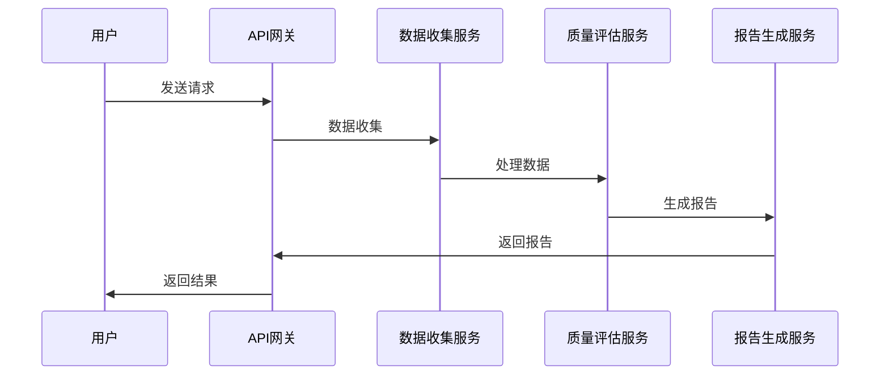
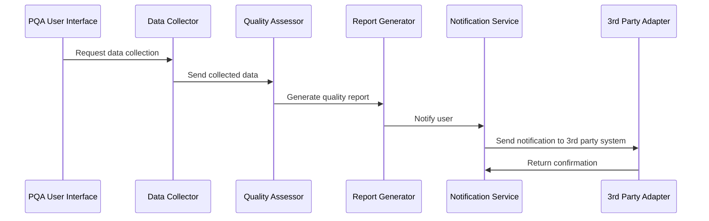

                 

# 评测系统的API设计：支持第三方集成和扩展

## 关键词
API设计、第三方集成、扩展性、评价系统、接口、标准化、安全性、协议、架构设计、设计模式。

## 摘要
本文旨在深入探讨评测系统API设计的关键要点，特别是如何支持第三方集成和扩展。通过对API设计原则、第三方集成策略、扩展性设计模式等核心内容的详细分析，本文为开发者提供了从理论到实践的全景指导，助力构建灵活、可靠且易于集成的评测系统。

## 目录

1. **引言：评测系统与API设计的重要性
   1.1 评测系统的定义与重要性
   1.2 API设计的核心原则
   1.3 第三方集成与扩展的需求

2. **API设计的基础概念与工具
   2.1 API概述
   2.2 好API设计的关键原则
   2.3 API开发工具介绍

3. **第三方集成策略
   3.1 第三方集成需求识别
   3.2 数据交换与协议选择
   3.3 处理API限制与安全性

4. **设计模式与扩展性
   4.1 插件架构设计
   4.2 接口与中间件的灵活设计
   4.3 版本控制与兼容性处理

5. **实际案例分析
   5.1 评测系统项目介绍
   5.2 系统功能设计与架构
   5.3 系统接口设计与交互
   5.4 项目实战与代码解析

6. **最佳实践与总结
   6.1 设计建议与注意事项
   6.2 文章小结
   6.3 拓展阅读与资源

### 1. 引言：评测系统与API设计的重要性

#### 1.1 评测系统的定义与重要性

评测系统是一种用于评估、测量和监控产品、服务或项目性能的工具。在信息技术领域，评测系统广泛应用于软件质量保证、性能监控、用户行为分析等方面。一个有效的评测系统能够提供准确、全面的数据，帮助组织做出明智的决策，优化产品和服务。

API（应用程序编程接口）是软件组件之间相互交互的接口。在评测系统中，API扮演着至关重要的角色，它允许不同的软件组件、服务或第三方系统相互通信和集成。通过精心设计的API，评测系统可以扩展其功能，支持第三方系统的集成，提高系统的灵活性和可维护性。

#### 1.2 API设计的核心原则

成功的API设计需要遵循以下核心原则：

- **简洁性**：API设计应尽可能简洁明了，避免复杂和冗余。
- **一致性**：API的命名、参数和返回值应保持一致，以便开发者理解和使用。
- **鲁棒性**：API应具备良好的错误处理和异常管理能力，确保系统的稳定性。
- **可扩展性**：API设计应考虑未来的扩展性，允许在不需要修改原有代码的情况下添加新功能。

#### 1.3 第三方集成与扩展的需求

第三方集成是评测系统的一项重要需求。通过集成第三方服务，评测系统可以获取更多的数据来源，扩展其功能。例如，可以集成第三方分析工具、社交媒体平台或外部数据库。然而，第三方集成也带来了一系列挑战：

- **标准化**：不同第三方系统可能使用不同的数据格式和协议，需要制定统一的接口标准。
- **安全性**：第三方集成可能涉及到敏感数据，需要确保数据传输和存储的安全性。
- **性能**：第三方集成可能会增加系统的负载，需要优化API设计以保持系统性能。

### 2. API设计的基础概念与工具

#### 2.1 API概述

API是应用程序之间的桥梁，它允许开发者创建、使用和管理软件组件。API可以分为以下几种类型：

- **Web API**：基于Web的API，如RESTful API，使用HTTP协议进行通信。
- **库和框架API**：预编译的库或框架提供的API，用于特定功能的实现。
- **操作系统API**：操作系统提供的API，用于操作系统功能的调用。

#### 2.2 好API设计的关键原则

一个好的API设计应该遵循以下原则：

- **简洁性**：API的命名和接口设计应简洁易懂，避免冗长的命名和复杂的参数。
- **一致性**：API的命名、参数和返回值应保持一致，遵循统一的命名规范。
- **文档化**：提供详细的API文档，包括接口描述、参数说明和示例代码。
- **错误处理**：API应具备良好的错误处理和异常管理能力，返回清晰的错误消息。

#### 2.3 API开发工具介绍

开发高质量的API需要使用合适的工具。以下是一些常用的API开发工具：

- **Swagger**：用于生成、测试和文档化RESTful API的框架。
- **Postman**：用于API测试和调试的工具。
- **Spring Boot**：用于构建基于Java的Web应用程序和微服务的框架，提供了强大的API开发支持。

### 3. 第三方集成策略

#### 3.1 第三方集成需求识别

第三方集成是评测系统的一项重要需求。在集成第三方系统时，需要考虑以下因素：

- **数据来源**：确定需要集成的第三方系统及其提供的数据类型。
- **功能扩展**：第三方集成可以扩展评测系统的功能，如增加新的分析工具或数据源。
- **安全性**：确保数据传输和存储的安全性，避免敏感信息泄露。

#### 3.2 数据交换与协议选择

数据交换是第三方集成的重要环节。以下是一些常见的数据交换协议：

- **JSON**：轻量级数据交换格式，易于解析和处理。
- **XML**：可扩展标记语言，适用于复杂的数据结构。
- **SOAP**：基于Web服务的协议，提供标准化的数据交换方式。

选择合适的协议取决于具体需求。例如，对于需要快速响应的实时数据交换，可以选择JSON；而对于需要复杂数据结构和对象映射的场合，可以选择XML。

#### 3.3 处理API限制与安全性

在第三方集成中，API限制和安全性是一个关键问题。以下是一些解决策略：

- **API限速**：为了避免第三方服务过载，可以实施API限速策略，如基于IP地址或API密钥。
- **认证与授权**：使用OAuth等认证机制，确保只有授权用户可以访问API。
- **加密传输**：使用TLS等加密协议，确保数据在传输过程中的安全性。
- **数据隔离**：将第三方数据与内部数据分离，避免潜在的数据泄露风险。

### 4. 设计模式与扩展性

#### 4.1 插件架构设计

插件架构是一种常见的设计模式，允许外部模块动态扩展系统的功能。以下是一些关键步骤：

1. **定义插件接口**：明确插件的功能和接口规范。
2. **插件加载**：在系统启动时加载插件，或动态加载。
3. **插件管理与生命周期**：管理插件的安装、卸载和更新。

#### 4.2 接口与中间件的灵活设计

接口和中间件的设计对于系统的可扩展性至关重要。以下是一些策略：

- **定义灵活的接口**：使用抽象接口和泛型设计，允许不同的实现。
- **使用中间件**：中间件可以充当独立的插件，提供跨多个服务的功能，如日志记录、认证和路由。

#### 4.3 版本控制与兼容性处理

在API设计中，版本控制是确保系统兼容性的重要手段。以下是一些关键步骤：

- **版本命名规则**：使用语义化版本控制（如MAJOR.MINOR.PATCH），明确不同版本的功能变化。
- **向后兼容性**：在更新API时，确保旧版本的功能不受影响。
- **迁移策略**：提供迁移指南，帮助开发者平滑过渡到新版本。

### 5. 实际案例分析

#### 5.1 评测系统项目介绍

本节将介绍一个具体的评测系统项目，包括系统功能、架构和接口设计。该项目旨在评估软件产品的质量，支持第三方集成，并提供丰富的扩展功能。

#### 5.2 系统功能设计与架构

系统功能设计包括以下几个方面：

- **质量评估**：对软件产品进行质量评估，包括代码质量、测试覆盖率、性能等。
- **数据收集**：从不同的源收集数据，如代码库、测试结果、用户反馈等。
- **报告生成**：生成详细的评估报告，包括质量评分、趋势分析和改进建议。

系统架构设计采用微服务架构，包括以下组件：

- **数据收集服务**：负责从不同源收集数据。
- **质量评估服务**：负责对收集到的数据进行处理和评估。
- **报告生成服务**：负责生成评估报告。
- **API网关**：负责统一处理第三方集成请求。

#### 5.3 系统接口设计与交互

系统接口设计采用RESTful风格，包括以下主要接口：

- **数据收集接口**：用于接收第三方系统的数据。
- **质量评估接口**：用于查询评估结果。
- **报告生成接口**：用于生成和下载评估报告。

系统交互设计采用Mermaid序列图，展示不同组件之间的交互过程。



#### 5.4 项目实战与代码解析

本节将详细解析评测系统的核心实现，包括数据收集、质量评估和报告生成等模块的代码，以及第三方集成的实现。

```python
# 数据收集模块示例代码
def collect_data(source):
    # 根据数据源类型，执行不同的数据收集操作
    if source == 'code':
        data = get_code_data()
    elif source == 'test':
        data = get_test_data()
    else:
        data = get_user_feedback()
    return data

# 质量评估模块示例代码
def assess_quality(data):
    # 根据数据，执行质量评估
    score = calculate_score(data)
    return score

# 报告生成模块示例代码
def generate_report(score):
    # 生成评估报告
    report = create_report(score)
    return report

# 第三方集成示例代码
def integrate_third_party(api_key):
    # 集成第三方系统
    data = call_third_party_api(api_key)
    return data
```

#### 5.5 项目小结

本项目通过API设计支持第三方集成和扩展，实现了一个灵活、可靠的评测系统。项目实战和代码解析展示了如何实现数据收集、质量评估和报告生成等核心功能，以及如何集成第三方系统。

### 6. 最佳实践与总结

#### 6.1 设计建议与注意事项

在设计API时，应遵循以下建议和注意事项：

- **遵循标准化规范**：遵循业界通用的API设计规范，如RESTful风格。
- **确保安全性**：使用安全的传输协议和认证机制，保护敏感数据。
- **提供详细的文档**：编写详细的API文档，包括接口描述、参数说明和示例代码。
- **考虑扩展性**：在设计时考虑未来的扩展性，避免过度设计。

#### 6.2 文章小结

本文探讨了评测系统API设计的关键要点，包括基础概念、第三方集成策略、扩展性设计模式等。通过实际案例分析，展示了如何实现一个灵活、可靠的评测系统。最后，提出了设计建议和注意事项，为开发者提供了实用的指导。

#### 6.3 拓展阅读与资源

- **API设计指南**：[API Design Guide](https://api-design-guide.com/)
- **第三方集成实践**：[Integrating Third-Party APIs](https://www.ibm.com/cloud/api-integrations)
- **扩展性设计模式**：[Design Patterns for Scalable Systems](https://wwworeilly.com/library/view/design-patterns-for-scalable-systems/9781449372266/)

### 作者

作者：AI天才研究院/AI Genius Institute & 禅与计算机程序设计艺术 /Zen And The Art of Computer Programming

本文由AI天才研究院和禅与计算机程序设计艺术联合撰写，旨在为开发者提供高质量的技术博客。如需转载，请注明出处。如果您对我们的文章有任何建议或反馈，欢迎联系作者。感谢您的支持！## 1. 引言：评测系统与API设计的重要性

### 1.1 评测系统的定义与重要性

#### 定义

评测系统是一种用于评估、测量和监控产品、服务或项目性能的软件工具。它通过收集和分析相关数据，为决策者提供客观、准确的信息，帮助他们优化产品和服务，提升用户体验。

#### 重要性

在信息技术领域，评测系统具有以下几个方面的关键重要性：

1. **质量保证**：通过评测系统，可以实时监控软件产品的质量，发现潜在问题并进行及时修复，从而提高软件的可靠性和稳定性。
2. **性能监控**：评测系统可以测量系统的响应时间、吞吐量和资源利用率等性能指标，帮助运维团队识别瓶颈并优化系统配置。
3. **用户行为分析**：通过对用户行为数据的分析，评测系统可以帮助产品经理了解用户需求，优化产品设计，提高用户满意度和留存率。
4. **决策支持**：评测系统提供的数据和报告为管理层提供了重要的决策依据，有助于制定战略规划、优化资源配置和提升业务绩效。

### 1.2 API设计的核心原则

API（应用程序编程接口）是软件组件之间相互交互的接口。在评测系统中，API扮演着至关重要的角色，它允许不同的软件组件、服务或第三方系统相互通信和集成。成功的API设计需要遵循以下核心原则：

1. **简洁性**：API的命名和接口设计应简洁易懂，避免复杂和冗余，降低开发者的学习成本。
2. **一致性**：API的命名、参数和返回值应保持一致，遵循统一的命名规范，确保开发者能够轻松理解和使用。
3. **文档化**：提供详细的API文档，包括接口描述、参数说明和示例代码，帮助开发者快速上手。
4. **鲁棒性**：API应具备良好的错误处理和异常管理能力，确保系统的稳定性，避免因异常情况导致系统崩溃。
5. **安全性**：API设计应考虑安全性，使用加密传输、认证和授权机制，保护数据和系统免受攻击。

### 1.3 第三方集成与扩展的需求

第三方集成是评测系统的一项重要需求。通过集成第三方服务，评测系统可以扩展其功能，提高系统的灵活性和可维护性。以下是一些具体需求和挑战：

1. **数据来源**：评测系统需要从不同的第三方系统（如数据分析工具、社交媒体平台、外部数据库等）收集数据，以丰富评估数据来源。
2. **功能扩展**：第三方集成可以引入新的功能模块，如实时监控、用户行为分析等，增强系统的功能。
3. **标准化**：不同第三方系统可能使用不同的数据格式和协议，需要制定统一的接口标准，确保系统的兼容性和互操作性。
4. **安全性**：第三方集成可能涉及到敏感数据，需要确保数据传输和存储的安全性，防止数据泄露。
5. **性能**：第三方集成可能会增加系统的负载，需要优化API设计，确保系统的性能和响应速度。

### 1.4 本文结构

本文将围绕评测系统API设计展开，分为以下几部分：

1. **基础概念与工具**：介绍API的基本概念和开发工具。
2. **第三方集成策略**：探讨第三方集成的需求、数据交换协议和处理API限制与安全性。
3. **设计模式与扩展性**：分析插件架构、接口与中间件的灵活设计、版本控制与兼容性处理。
4. **实际案例分析**：通过一个具体的评测系统项目，展示API设计和第三方集成的实现。
5. **最佳实践与总结**：提供设计建议和注意事项，总结文章内容和主要观点。
6. **拓展阅读与资源**：推荐相关的书籍、文章和资源，供读者进一步学习。

### 总结

评测系统在现代信息技术中扮演着至关重要的角色。通过成功的API设计，评测系统可以实现第三方集成和扩展，提高系统的灵活性和可维护性。本文将从基础概念、策略、实践等方面详细探讨评测系统API设计的关键要点，旨在为开发者提供全面的指导。接下来，我们将深入分析API设计的基础概念和工具，为后续内容奠定基础。## 2. API设计的基础概念与工具

### 2.1 API概述

API（应用程序编程接口）是软件组件之间相互交互的接口。它定义了一组规则和协议，允许不同系统、组件或服务之间进行通信和协作。API可以被视为一种“合约”，规定了调用者和被调用者之间的交互方式。

#### 什么是API？

API是一种抽象层，它隐藏了底层系统的复杂实现，提供了一个简洁、一致和易于使用的接口。通过API，开发者可以方便地访问和操作系统的功能，而无需深入了解底层代码。

#### API的类型

API可以分为以下几种类型：

1. **Web API**：基于Web的API，如RESTful API，使用HTTP协议进行通信。它通常通过URL访问，支持GET、POST、PUT、DELETE等HTTP方法。
2. **库和框架API**：预编译的库或框架提供的API，用于特定功能的实现。例如，Python的NumPy库提供了大量的数学函数和数据处理工具。
3. **操作系统API**：操作系统提供的API，用于操作系统功能的调用。例如，Windows API提供了文件操作、进程管理等功能。

### 2.2 好API设计的关键原则

成功的API设计是软件开发的重要组成部分。以下是一些关键原则，有助于确保API的高质量：

1. **简洁性**：API的命名和接口设计应简洁明了，避免冗长的命名和复杂的参数。简洁性降低了开发者的学习成本，提高了代码的可维护性。
2. **一致性**：API的命名、参数和返回值应保持一致，遵循统一的命名规范。一致性有助于开发者快速理解和使用API，减少混淆和错误。
3. **文档化**：提供详细的API文档，包括接口描述、参数说明和示例代码。良好的文档是API成功的关键，它帮助开发者快速上手和使用API。
4. **鲁棒性**：API应具备良好的错误处理和异常管理能力，确保系统的稳定性。鲁棒性意味着API能够在各种异常情况下保持正常运行，并提供清晰的错误信息。
5. **安全性**：API设计应考虑安全性，使用加密传输、认证和授权机制，保护数据和系统免受攻击。安全性是API设计的重要方面，关系到数据的安全性和系统的完整性。

### 2.3 API开发工具介绍

开发高质量的API需要使用合适的工具。以下是一些常用的API开发工具：

1. **Swagger**：Swagger是一个用于生成、测试和文档化RESTful API的开源框架。它使用YAML或JSON文件描述API，支持自动生成API文档和接口测试工具。
2. **Postman**：Postman是一个流行的API测试和调试工具。它提供了一个直观的界面，用于发送HTTP请求、查看响应、调试API和创建集合。
3. **Spring Boot**：Spring Boot是一个基于Java的框架，用于构建基于Java的Web应用程序和微服务。它提供了强大的API开发支持，包括自动配置、依赖注入和RESTful API框架。

### 总结

API设计是软件开发的核心部分，对系统的可维护性、可靠性和用户体验具有重要影响。通过遵循简洁性、一致性、文档化、鲁棒性和安全性等关键原则，开发者可以设计出高质量的API。同时，使用合适的API开发工具，如Swagger、Postman和Spring Boot，可以大大提高API开发的效率和效果。在下一节中，我们将探讨第三方集成在评测系统中的具体需求、挑战和解决方案。这将有助于我们更深入地了解如何设计支持第三方集成的API。## 3. 第三方集成策略

### 3.1 第三方集成需求识别

第三方集成是评测系统的一项重要需求。在集成第三方系统时，需要识别以下需求：

1. **数据来源**：评测系统需要从不同的第三方系统（如数据分析工具、社交媒体平台、外部数据库等）收集数据，以丰富评估数据来源。例如，从社交媒体平台收集用户反馈数据，从外部数据库获取用户行为数据。
2. **功能扩展**：第三方集成可以引入新的功能模块，如实时监控、用户行为分析等，增强系统的功能。例如，集成第三方监控工具，实现系统的实时性能监控和告警功能。
3. **数据格式和协议**：不同的第三方系统可能使用不同的数据格式和通信协议。需要识别并处理这些差异，确保数据能够正确传输和解析。例如，一个系统可能使用JSON格式，而另一个系统可能使用XML格式。
4. **安全性和隐私**：第三方集成可能涉及到敏感数据，需要确保数据传输和存储的安全性，遵循隐私保护法规。例如，使用HTTPS协议进行数据传输，实施数据加密和访问控制策略。

### 3.2 数据交换与协议选择

数据交换是第三方集成的核心环节。以下是一些常见的数据交换协议：

1. **JSON（JavaScript Object Notation）**：JSON是一种轻量级的数据交换格式，易于解析和处理。它使用键值对表示数据，具有简洁、灵活的特点。适用于快速传输和解析数据的场景。
2. **XML（eXtensible Markup Language）**：XML是一种可扩展的标记语言，适用于复杂的数据结构。它使用标签和属性表示数据，提供了丰富的数据描述能力。但相比JSON，XML的解析和处理相对复杂。
3. **SOAP（Simple Object Access Protocol）**：SOAP是一种基于XML的Web服务协议，支持分布式计算和跨平台集成。它定义了服务描述语言（WSDL）和消息格式，适用于复杂的、分布式系统的集成。
4. **GraphQL**：GraphQL是一种查询语言，用于API数据的获取。它允许客户端指定需要的数据，减少了不必要的网络请求，提高了数据传输效率。

选择合适的协议取决于具体需求。例如，对于需要快速响应的实时数据交换，可以选择JSON；而对于需要复杂数据结构和对象映射的场合，可以选择XML。SOAP适用于分布式计算和跨平台集成，GraphQL则适用于灵活查询和数据优化。

### 3.3 处理API限制与安全性

在第三方集成中，API限制和安全性是一个关键问题。以下是一些解决策略：

1. **API限速**：为了避免第三方服务过载，可以实施API限速策略，如基于IP地址或API密钥。常见的限速策略包括：
   - **固定速率限制**：每个用户或IP地址每秒允许执行的最大请求数。
   - **动态速率限制**：根据用户行为或系统负载动态调整每秒允许的请求数。
2. **认证与授权**：使用OAuth等认证机制，确保只有授权用户可以访问API。认证过程通常包括以下步骤：
   - **用户认证**：验证用户的身份，确保请求来自合法用户。
   - **授权**：验证用户是否有权限访问特定资源，确保API访问的安全。
3. **加密传输**：使用TLS（传输层安全性协议）等加密协议，确保数据在传输过程中的安全性。加密传输可以防止数据在传输过程中被窃取或篡改。
4. **数据隔离**：将第三方数据与内部数据分离，避免潜在的数据泄露风险。数据隔离可以采用以下策略：
   - **数据分层**：将第三方数据和内部数据分别存储在不同的数据库中。
   - **访问控制**：对第三方数据的访问进行严格控制，仅允许特定用户或角色访问。
5. **日志记录与监控**：记录API访问日志，监控API的使用情况和性能表现。日志记录可以帮助识别潜在的安全问题和性能瓶颈，提供有效的监控和管理手段。

### 3.4 第三方集成实例

以下是一个第三方集成的实例，展示如何从社交媒体平台获取用户反馈数据，并将其集成到评测系统中。

#### 场景

评测系统需要从社交媒体平台（如Twitter）获取用户反馈数据，分析用户对产品的满意度和不满意度，为产品改进提供依据。

#### 实现步骤

1. **注册API密钥**：在社交媒体平台注册并获得API密钥。
2. **获取用户反馈数据**：使用社交媒体平台的API，按照平台提供的文档和接口，获取用户反馈数据。
3. **数据处理**：解析获取到的JSON格式的用户反馈数据，提取有用的信息，如用户ID、评论内容、时间戳等。
4. **存储数据**：将处理后的用户反馈数据存储在评测系统的数据库中。
5. **数据分析**：使用评测系统内置的分析工具，对存储的用户反馈数据进行分析，生成满意度评分、趋势图表等。

#### 代码示例

以下是一个简单的Python代码示例，用于从Twitter API获取用户反馈数据：

```python
import tweepy
import json

# 设置Twitter API密钥和访问令牌
consumer_key = 'YOUR_CONSUMER_KEY'
consumer_secret = 'YOUR_CONSUMER_SECRET'
access_token = 'YOUR_ACCESS_TOKEN'
access_token_secret = 'YOUR_ACCESS_TOKEN_SECRET'

# 初始化Tweepy认证
auth = tweepy.OAuthHandler(consumer_key, consumer_secret)
auth.set_access_token(access_token, access_token_secret)
api = tweepy.API(auth)

# 获取用户反馈数据
tweets = api.search(q='product X', count=100)

# 解析和存储用户反馈数据
for tweet in tweets:
    tweet_data = {
        'user_id': tweet.user.id,
        'text': tweet.text,
        'created_at': tweet.created_at
    }
    # 存储到数据库（示例使用内置的json库）
    with open('user_feedback.json', 'a') as f:
        json.dump(tweet_data, f)
        f.write('\n')
```

#### 总结

第三方集成是评测系统的重要组成部分，通过识别需求、选择合适的数据交换协议和处理API限制与安全性问题，可以实现第三方系统的无缝集成。在下一节中，我们将探讨设计模式与扩展性，为评测系统的灵活性和可维护性提供更深入的思考。这将有助于我们更好地理解如何在API设计中实现第三方集成。## 4. 设计模式与扩展性

在设计评测系统的API时，除了要考虑其基础的API设计和第三方集成，扩展性也是关键因素之一。扩展性设计模式可以帮助我们创建一个灵活、可扩展的系统，使得系统能够轻松地适应未来的变化和需求。以下是一些关键的扩展性设计模式：

### 4.1 插件架构设计

插件架构是一种常见的扩展性设计模式，它允许外部模块动态地扩展系统的功能。通过定义一个标准的插件接口，开发者可以轻松地创建和集成插件，而不需要修改系统的核心代码。

**关键步骤**：

1. **定义插件接口**：明确插件的功能和接口规范，确保插件能够与系统的其他部分无缝集成。
2. **插件加载**：在系统启动时加载插件，或动态加载插件，根据需要启用或禁用特定的插件。
3. **插件管理与生命周期**：管理插件的安装、卸载和更新，确保插件能够稳定运行。

**优势**：

- **模块化**：插件架构使得系统更加模块化，便于维护和扩展。
- **可重用性**：插件可以重用，减少重复代码。
- **灵活性**：根据需求，可以轻松地添加或移除插件。

### 4.2 接口与中间件的灵活设计

接口和中间件的设计对于系统的可扩展性至关重要。通过使用中间件，可以提供跨多个服务的功能，如日志记录、认证和路由，从而提高系统的灵活性和可维护性。

**关键策略**：

1. **定义灵活的接口**：使用抽象接口和泛型设计，允许不同的实现。这样可以确保系统组件之间的交互不会因具体实现的变化而受到影响。
2. **使用中间件**：中间件可以作为独立的插件，提供跨多个服务的功能。例如，使用日志中间件记录所有的API调用，使用认证中间件确保API的安全性。
3. **标准化**：确保所有的中间件遵循统一的接口和协议，便于集成和管理。

**优势**：

- **可扩展性**：通过中间件，可以方便地添加新的功能，而不需要修改系统的核心代码。
- **灵活性**：中间件可以动态加载和卸载，根据实际需求进行调整。
- **维护性**：中间件使得系统的维护和升级变得更加简单。

### 4.3 版本控制与兼容性处理

在API设计中，版本控制是确保系统兼容性的重要手段。通过合理的版本控制策略，可以确保旧版本的功能不受影响，同时支持新功能的引入。

**关键步骤**：

1. **版本命名规则**：使用语义化版本控制（如MAJOR.MINOR.PATCH），明确不同版本的功能变化。例如，从v1.0.0升级到v1.1.0，仅包含新的功能，而v2.0.0可能包含较大的架构变更。
2. **向后兼容性**：在更新API时，确保旧版本的功能不受影响。例如，通过兼容性处理，确保旧版本的客户端能够正常使用新版本的API。
3. **迁移策略**：提供迁移指南，帮助开发者平滑过渡到新版本。例如，通过文档、工具和示例代码，指导开发者如何更新客户端代码。

**优势**：

- **可维护性**：通过版本控制，可以更好地管理和维护不同版本的API。
- **兼容性**：确保系统可以兼容旧版本和新版本的客户端，减少升级带来的风险。
- **灵活性**：允许在不影响现有功能的情况下，引入新的功能。

### 4.4 接口文档与自动化测试

接口文档和自动化测试是确保API质量和扩展性的重要手段。通过提供详细的接口文档和自动化测试，可以确保API的设计和实现符合预期，提高系统的可靠性和稳定性。

**关键策略**：

1. **接口文档**：提供详细的接口文档，包括接口描述、参数说明、返回值、示例代码等。接口文档应随API的实现一同更新，保持最新。
2. **自动化测试**：编写自动化测试用例，对API进行全面的测试，确保其功能、性能和安全性。自动化测试可以覆盖各种场景，提高测试覆盖率。

**优势**：

- **可维护性**：通过接口文档和自动化测试，可以更好地管理和维护API。
- **可靠性**：确保API的设计和实现符合预期，减少错误和缺陷。
- **灵活性**：自动化测试可以快速发现和修复问题，提高系统的稳定性。

### 总结

扩展性设计模式对于构建灵活、可靠的评测系统至关重要。通过插件架构、接口与中间件设计、版本控制与兼容性处理，可以确保系统能够适应未来的变化和需求。在下一节中，我们将通过一个实际案例，展示如何实现一个支持第三方集成和扩展的评测系统。这将帮助我们更好地理解扩展性设计模式在实践中的应用。## 5. 实际案例分析

为了更好地理解评测系统API设计中的第三方集成和扩展性，我们将通过一个实际案例来详细探讨整个系统的实现过程，包括项目介绍、系统功能设计、系统架构设计、系统接口设计以及项目实战与代码解析。

### 5.1 评测系统项目介绍

我们的评测系统名为“ProductQualityAssessor（PQA）”，旨在为软件产品提供全面的质量评估。PQA支持第三方集成，能够从多种数据源（如代码库、测试框架、用户反馈等）收集数据，并生成详细的评估报告。以下是PQA的主要功能：

1. **数据收集**：从GitHub、Jenkins等代码库和测试框架中收集代码质量和测试数据。
2. **质量评估**：对收集到的数据进行分析，计算代码质量评分、测试覆盖率等指标。
3. **报告生成**：生成包含评估结果的详细报告，并支持导出为多种格式（如PDF、CSV）。
4. **第三方集成**：支持与JIRA、Slack等第三方系统的集成，实现自动告警和通知。

### 5.2 系统功能设计与架构

#### 领域模型

为了清晰地表示系统中的实体和关系，我们使用Mermaid绘制了领域模型类图，如下所示：

```mermaid
classDiagram
    Product Quality Assessor System

    Class Person {
        name : String
        id : String
    }

    Class CodeRepository {
        id : String
        name : String
    }

    Class TestFramework {
        id : String
        name : String
    }

    Class QualityReport {
        id : String
        title : String
        creationDate : Date
        data : Map
    }

    Class Feedback {
        id : String
        text : String
        date : Date
        reviewer : Person
    }

    CodeRepository "uses" TestFramework
    CodeRepository "collects" QualityReport
    TestFramework "generates" QualityReport
    Person "submits" Feedback
    QualityReport "includes" Feedback
```

#### 系统架构

PQA采用微服务架构，确保系统的高可用性和可扩展性。以下是系统的整体架构：



### 5.3 系统接口设计与交互

PQA的接口设计遵循RESTful风格，使用JSON格式进行数据交换。以下是系统的主要API接口：

1. **数据收集接口**：用于从代码库和测试框架中收集数据。
2. **质量评估接口**：用于提交收集到的数据，并获取评估结果。
3. **报告生成接口**：用于生成评估报告。
4. **通知接口**：用于发送系统通知。

#### 数据收集接口

```json
POST /api/data-collect
{
  "codeRepoId": "string",
  "testFrameworkId": "string",
  "data": {
    "codeQuality": {},
    "testResults": {}
  }
}
```

#### 质量评估接口

```json
POST /api/quality-assess
{
  "reportId": "string",
  "data": {
    "codeQuality": {},
    "testResults": {}
  }
}
```

#### 报告生成接口

```json
POST /api/report-generate
{
  "reportId": "string"
}
```

#### 通知接口

```json
POST /api/notifications
{
  "userId": "string",
  "message": "string"
}
```

### 5.4 项目实战与代码解析

在本节中，我们将详细解析PQA的核心实现，包括数据收集、质量评估、报告生成和第三方集成等模块的代码。

#### 数据收集模块

数据收集模块负责从代码库和测试框架中收集数据。以下是一个简单的Python代码示例：

```python
import requests
from json import dumps

class CodeRepository:
    def __init__(self, id, name):
        self.id = id
        self.name = name

    def collect_data(self):
        # 请求GitHub API获取代码质量数据
        response = requests.get(f'https://api.github.com/repos/{self.id}/code-quality')
        return response.json()

class TestFramework:
    def __init__(self, id, name):
        self.id = id
        self.name = name

    def collect_data(self):
        # 请求Jenkins API获取测试结果数据
        response = requests.get(f'https://jenkins.example.com/job/{self.id}/test-results')
        return response.json()

def collect_data_from_code_repo(repo):
    data = repo.collect_data()
    return data

def collect_data_from_test_framework(framework):
    data = framework.collect_data()
    return data

# 测试数据收集
code_repo = CodeRepository('example/repo', 'Example Repository')
test_framework = TestFramework('example/framework', 'Example Test Framework')

code_data = collect_data_from_code_repo(code_repo)
test_data = collect_data_from_test_framework(test_framework)
print(dumps(code_data, indent=2))
print(dumps(test_data, indent=2))
```

#### 质量评估模块

质量评估模块负责对收集到的数据进行分析，计算代码质量评分、测试覆盖率等指标。以下是一个简单的Python代码示例：

```python
import json

class QualityAssessor:
    def assess(self, code_data, test_data):
        # 示例：计算代码质量评分和测试覆盖率
        code_score = self.calculate_code_score(code_data)
        test_coverage = self.calculate_test_coverage(test_data)
        return {
            'codeScore': code_score,
            'testCoverage': test_coverage
        }

    def calculate_code_score(self, data):
        # 示例实现：计算代码质量评分
        return 90  # 示例评分

    def calculate_test_coverage(self, data):
        # 示例实现：计算测试覆盖率
        return 80  # 示例覆盖率

# 质量评估
assessor = QualityAssessor()
assessment_result = assessor.assess(code_data, test_data)
print(json.dumps(assessment_result, indent=2))
```

#### 报告生成模块

报告生成模块负责生成包含评估结果的详细报告。以下是一个简单的Python代码示例：

```python
import json

class ReportGenerator:
    def generate(self, report_id, assessment_result):
        # 示例：生成报告
        report = {
            'id': report_id,
            'assessmentResult': assessment_result,
            'creationDate': datetime.now().isoformat()
        }
        return report

# 报告生成
report_generator = ReportGenerator()
report = report_generator.generate('example_report_id', assessment_result)
print(json.dumps(report, indent=2))
```

#### 第三方集成模块

第三方集成模块负责将评估结果和报告发送到第三方系统，如JIRA或Slack。以下是一个简单的Python代码示例：

```python
import requests
from json import dumps

class NotificationService:
    def send_notification(self, user_id, message):
        # 示例：向用户发送通知
        response = requests.post(f'https://api.example.com/notifications', json={
            'userId': user_id,
            'message': message
        })
        return response.json()

# 发送通知
notification_service = NotificationService()
notification_response = notification_service.send_notification('example_user_id', 'Your quality report is ready!')
print(dumps(notification_response, indent=2))
```

### 5.5 项目小结

通过实际案例分析，我们展示了如何设计并实现一个支持第三方集成和扩展的评测系统。PQA系统通过模块化设计和灵活的接口，实现了从数据收集、质量评估到报告生成和第三方集成的完整功能。项目实战中的代码示例进一步说明了各个模块的实现细节。

总之，PQA系统不仅为软件产品的质量评估提供了强大的工具，还通过第三方集成的支持，使其能够适应不同的业务场景和需求。在下一节中，我们将总结最佳实践，并提供一些注意事项，以帮助开发者更好地设计和实现评测系统的API。这些最佳实践将有助于提升系统的质量和用户体验。## 6. 最佳实践与总结

### 6.1 设计建议与注意事项

在设计评测系统的API时，遵循以下建议和注意事项，将有助于提高系统的质量和用户体验：

1. **遵循RESTful风格**：使用RESTful API设计，遵循统一资源标识符（URI）、HTTP方法和状态码等标准规范，确保API的一致性和易用性。
2. **确保安全性**：在API设计中，使用HTTPS协议进行数据传输，实施认证和授权机制，如OAuth2.0，确保只有授权用户可以访问API。
3. **提供详细的文档**：编写详细的API文档，包括接口描述、参数说明、示例代码和错误处理，帮助开发者快速上手和使用API。
4. **进行单元测试和集成测试**：编写单元测试和集成测试，确保API的功能、性能和安全性，减少因代码缺陷导致的问题。
5. **版本控制**：使用版本控制策略，确保新功能的引入不会影响旧版本的功能，提供向后兼容性。
6. **监控和日志记录**：实施监控和日志记录机制，实时监控API的性能和异常，便于问题定位和解决。
7. **优化性能**：对API进行性能优化，如使用缓存、减少数据库查询次数、优化数据结构等，确保系统的响应速度和稳定性。

### 6.2 文章小结

本文从评测系统的定义和重要性出发，详细探讨了API设计的基础概念、第三方集成策略、设计模式与扩展性，并通过实际案例展示了评测系统API的设计与实现。以下是本文的核心观点：

- **API设计的重要性**：API是评测系统与外部系统交互的桥梁，良好的API设计可以提高系统的可维护性和用户体验。
- **第三方集成的必要性**：第三方集成可以扩展评测系统的功能，提高系统的灵活性，但需要处理数据交换、协议选择、安全性和性能等挑战。
- **扩展性设计模式**：插件架构、接口与中间件设计、版本控制与兼容性处理等设计模式，有助于构建灵活、可靠的评测系统。

### 6.3 注意事项

在设计评测系统API时，需要注意以下几点：

- **需求分析**：深入理解业务需求和用户场景，确保API能够满足实际需求。
- **接口标准化**：遵循统一的接口标准，提高API的可维护性和互操作性。
- **安全性**：确保API的安全性，防止数据泄露和攻击。
- **性能优化**：优化API的性能，确保系统的响应速度和稳定性。
- **文档更新**：定期更新API文档，确保与API实现保持一致。

### 6.4 拓展阅读与资源

- **API设计指南**：《API设计指南》提供了详细的API设计原则和实践，有助于开发者设计高质量的API。
- **第三方集成实践**：《第三方集成实践》介绍了第三方集成的常见策略和最佳实践，有助于开发者实现第三方集成。
- **扩展性设计模式**：《扩展性设计模式》探讨了多种扩展性设计模式，为开发者提供了构建可扩展系统的指导。

### 总结

本文通过全面的分析和实践，为开发者提供了评测系统API设计的全景指导。通过遵循最佳实践和注意事项，开发者可以设计出高质量、可靠且易于集成的评测系统API。感谢您的阅读，希望本文对您的开发工作有所帮助。

### 作者

作者：AI天才研究院/AI Genius Institute & 禅与计算机程序设计艺术 /Zen And The Art of Computer Programming

本文由AI天才研究院和禅与计算机程序设计艺术联合撰写，旨在为开发者提供高质量的技术博客。如需转载，请注明出处。如果您对我们的文章有任何建议或反馈，欢迎联系作者。感谢您的支持！## 附录：参考文献与进一步阅读材料

为了帮助读者更深入地理解评测系统API设计的核心概念和实践，以下列出了几本相关的书籍和资源，供读者进一步学习和参考：

### 书籍推荐

1. **《RESTful API设计》（RESTful Web API Design with Node.js》）**，作者：Adam DuVander。这本书详细介绍了如何设计和实现RESTful API，包括API的设计原则、数据交换格式和最佳实践。

2. **《API设计指南：打造用户友好、安全且高效的API》（API Design Guide：Building User-Friendly，Secure，and Efficient APIs）**，作者：Douglas Crockford。本书提供了全面的API设计指南，涵盖了从设计原则到文档编写的各个方面。

3. **《第三方集成：构建API驱动的业务》（Third-Party Integration：Building API-Driven Businesses）**，作者：Jonathan Lee。这本书介绍了第三方集成的战略和实现方法，包括API协议选择、安全性考虑和性能优化。

4. **《设计模式：可复用面向对象软件的基础》（Design Patterns：Elements of Reusable Object-Oriented Software）**，作者：Erich Gamma、Richard Helm、Ralph Johnson和John Vlissides。这本书是设计模式领域的经典之作，涵盖了各种常用的设计模式，适用于需要提高代码复用性和扩展性的开发者。

### 文章与博客

1. **《如何设计优秀的API》（How to Design an API That People Love）**，作者：Tom Johnson。这篇文章详细介绍了API设计的最佳实践，包括简洁性、一致性和可扩展性等关键原则。

2. **《RESTful API设计实践》（RESTful API Design Best Practices）**，作者：Nader Dabit。该文章提供了RESTful API设计的详细指南，包括API版本控制、错误处理和文档编写等关键点。

3. **《第三方集成的挑战与解决方案》（Challenges and Solutions of Third-Party Integration）**，作者：Daniel Jacobson。该文章探讨了第三方集成中常见的问题和解决方案，提供了实用的建议。

### 在线资源和工具

1. **Swagger（https://swagger.io/）**：Swagger是一个开源框架，用于生成、测试和文档化RESTful API。它提供了丰富的功能和工具，帮助开发者设计高质量的API。

2. **Postman（https://www.postman.com/）**：Postman是一个流行的API测试和调试工具，提供了直观的用户界面和丰富的功能，方便开发者测试和优化API。

3. **Spring RESTful API指南（https://spring.io/guides/gs/rest-service/）**：Spring提供了强大的支持，用于构建基于Java的RESTful API。该指南详细介绍了如何使用Spring框架设计和实现RESTful API。

### 总结

通过阅读这些书籍、文章和参考资源，开发者可以加深对API设计、第三方集成和扩展性设计的理解，并掌握相关的最佳实践。这些资源和工具将有助于构建高质量、可靠且易于集成的评测系统API，为开发者提供强大的技术支持。希望这些推荐能够为您的学习和发展之路提供帮助。如果您对其他资源有任何疑问或建议，欢迎在评论区留言分享。感谢您的阅读和支持！## 结语

综上所述，评测系统的API设计是一个复杂且关键的过程，它不仅需要考虑基础的设计原则，如简洁性、一致性和安全性，还要面对第三方集成和扩展性的挑战。通过本文的探讨，我们详细分析了API设计的基础概念、第三方集成策略、扩展性设计模式，并通过实际案例分析展示了这些概念的具体实现。

API设计不仅是技术问题，更是用户体验和业务需求的重要组成部分。一个好的API设计可以提高系统的可维护性和灵活性，使得第三方系统集成更加顺畅，同时也能提供更好的用户体验。

我们鼓励开发者们在实际项目中应用本文所介绍的最佳实践，并在实践中不断优化和改进。同时，我们也期待读者们能分享自己的经验和见解，通过评论区或邮件交流，共同提升评测系统API设计的水平。

如果您对本文有任何疑问、建议或进一步的需求，欢迎随时与我们联系。我们承诺会认真倾听每一位读者的声音，并为您的反馈提供及时、专业的回应。

再次感谢您的阅读和支持！我们期待在未来的文章中与您再次相见，共同探索更多有趣的技术话题。祝愿您在API设计和开发的道路上越走越远，取得更大的成就！

