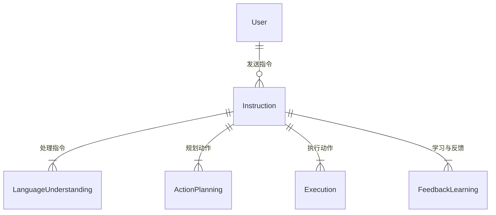

                 

### 文章标题：评测系统的Alpaca指令跟随模型评估

关键词：评测系统，Alpaca指令跟随模型，模型评估，性能优化

摘要：本文深入探讨了评测系统与Alpaca指令跟随模型之间的关系，通过详细的分析和实际应用案例，旨在为读者提供一个全面、深入的Alpaca指令跟随模型评估指南。本文首先介绍了评测系统和Alpaca指令跟随模型的基本概念和原理，然后详细描述了评测系统在Alpaca指令跟随模型评估中的应用，最后探讨了评测系统的优化和改进方法，为读者提供了实用的建议和指导。

### 第1章：评测系统的基本概念与重要性

#### 1.1 评测系统的定义与作用

评测系统是指一种用于对目标对象（如软件、算法、系统等）进行性能评估、质量评价和功能测试的软件系统。它通过一系列测试和评估方法，对目标对象进行全面的性能测试，以评估其是否符合预定的性能指标和质量标准。

评测系统的主要作用包括：

1. **性能评估**：通过评测系统，可以定量评估目标对象在特定条件下的性能，如响应时间、吞吐量、资源消耗等。
2. **质量评价**：评测系统可以评估目标对象的质量，如稳定性、可靠性、可维护性等。
3. **功能测试**：评测系统可以测试目标对象的功能，确保其符合设计要求和用户需求。

#### 1.2 评测系统的基本架构

评测系统通常包括以下几个关键组件：

1. **测试环境**：用于搭建测试场景和运行测试用例的环境，包括硬件、软件和网络配置等。
2. **测试用例**：用于对目标对象进行测试的具体实例，包括输入数据、测试步骤、预期输出等。
3. **测试执行**：负责执行测试用例，收集测试结果，并与预期结果进行比较。
4. **结果分析**：对测试结果进行分析和处理，生成评测报告，提供性能评估和质量评价。
5. **反馈机制**：根据测试结果，提供反馈和建议，帮助改进目标对象。

#### 1.3 Alpaca指令跟随模型简介

Alpaca指令跟随模型是一种基于人工智能的模型，主要用于理解和执行复杂的指令。它通过自然语言处理技术，将用户的自然语言指令转换为机器可执行的动作。Alpaca指令跟随模型的核心组成部分包括：

1. **语言理解模块**：负责解析用户的自然语言指令，提取关键信息。
2. **动作规划模块**：根据语言理解模块的结果，规划执行动作的步骤。
3. **执行模块**：负责执行规划好的动作，并返回执行结果。

### 第2章：Alpaca指令跟随模型的原理与实现

#### 2.1 Alpaca指令跟随模型的原理

Alpaca指令跟随模型基于深度学习和自然语言处理技术，其工作原理可以分为以下几个步骤：

1. **语言理解**：模型首先使用预训练的文本嵌入模型（如BERT、GPT等）对用户指令进行嵌入，将其转换为密集的向量表示。
2. **动作规划**：模型根据嵌入的向量表示，利用动作规划算法（如规划器、决策树等）生成执行动作的步骤。
3. **执行动作**：模型根据规划好的动作步骤，调用相关系统API或执行具体操作。
4. **反馈与学习**：执行动作后，模型会根据用户反馈对执行结果进行评估，并不断调整和优化自己的行为。

#### 2.2 Alpaca指令跟随模型的关键技术

Alpaca指令跟随模型的关键技术包括：

1. **自然语言处理**：包括词向量表示、语言模型、文本解析等。
2. **动作规划**：包括规划算法、决策树、状态机等。
3. **执行模块**：包括API调用、系统命令执行、数据处理等。
4. **反馈与学习**：包括评估指标、学习算法、模型更新等。

#### 2.3 Alpaca指令跟随模型的实现流程

Alpaca指令跟随模型的实现流程如下：

1. **数据准备**：收集并清洗用户指令数据，用于模型训练。
2. **模型训练**：使用自然语言处理技术训练语言理解模块和动作规划模块。
3. **模型评估**：使用测试数据评估模型的性能，调整模型参数。
4. **模型部署**：将训练好的模型部署到实际应用场景中。
5. **用户交互**：接收用户指令，执行动作，并返回执行结果。
6. **反馈与学习**：根据用户反馈，不断调整和优化模型。

### 第3章：评测系统在Alpaca指令跟随模型评估中的应用

#### 3.1 评测系统的设计与实现

本节将介绍如何设计和实现一个用于评估Alpaca指令跟随模型的评测系统。具体步骤如下：

1. **需求分析**：明确评测系统的目标和需求，包括性能评估、质量评价和功能测试等。
2. **功能设计**：设计评测系统的功能模块，如测试环境、测试用例、测试执行、结果分析和反馈机制等。
3. **技术实现**：选择合适的编程语言和开发工具，实现评测系统的各个功能模块。

#### 3.2 Alpaca指令跟随模型评估指标体系

为了全面评估Alpaca指令跟随模型的性能和质量，需要建立一套完善的评估指标体系。常见的评估指标包括：

1. **准确率**：模型执行指令的准确率，表示模型正确执行指令的比例。
2. **召回率**：模型召回用户期望的指令比例。
3. **F1值**：准确率和召回率的调和平均值，用于综合评价模型的性能。
4. **响应时间**：模型处理指令所需的时间。
5. **资源消耗**：模型在执行指令过程中消耗的资源，如CPU、内存、网络带宽等。

#### 3.3 评测系统的实际应用案例

本节将介绍一个实际应用案例，展示如何使用评测系统对Alpaca指令跟随模型进行评估。

1. **案例背景**：假设有一个智能家居系统，用户可以通过语音指令控制家中的智能设备。
2. **评测系统设计**：设计一个评测系统，用于评估Alpaca指令跟随模型在智能家居系统中的应用性能。
3. **评测结果分析**：通过评测系统，收集Alpaca指令跟随模型在智能家居系统中的应用数据，并对结果进行分析。

### 第4章：评测系统的优化与改进

#### 4.1 评测系统性能优化

为了提高评测系统的性能，可以从以下几个方面进行优化：

1. **测试用例优化**：优化测试用例的覆盖范围和执行顺序，提高测试效率。
2. **测试环境优化**：优化测试环境配置，提高测试的稳定性和可重复性。
3. **结果分析优化**：优化结果分析算法，提高评估结果的准确性和可靠性。

#### 4.2 评测系统的可持续改进

为了确保评测系统的可持续改进，需要采取以下措施：

1. **持续学习**：根据用户反馈和测试结果，不断优化和调整评测系统。
2. **版本控制**：对评测系统进行版本控制，确保系统升级和改进的可追溯性。
3. **文档管理**：建立完善的文档管理体系，记录评测系统的设计和改进过程。

### 第5章：总结与展望

#### 5.1 书的主要贡献

本文系统地介绍了评测系统和Alpaca指令跟随模型的基本概念、原理、应用和优化方法，为读者提供了一个全面、深入的评估指南。

#### 5.2 存在的问题与不足

虽然本文对评测系统和Alpaca指令跟随模型进行了详细探讨，但仍存在一些不足之处：

1. **模型评估指标有限**：本文仅介绍了常用的评估指标，未涉及更多细节和维度。
2. **应用场景有限**：本文主要关注智能家居系统，未探讨其他应用场景。

#### 5.3 未来研究方向

未来研究可以从以下几个方面展开：

1. **扩展评估指标**：研究更多适用于Alpaca指令跟随模型的评估指标。
2. **跨领域应用**：探讨Alpaca指令跟随模型在更多领域的应用，如金融、医疗、教育等。
3. **混合评估方法**：结合多种评估方法，提高评估结果的准确性和可靠性。

### 作者信息

作者：AI天才研究院/AI Genius Institute & 禅与计算机程序设计艺术 /Zen And The Art of Computer Programming

---

### 第1章：评测系统的基本概念与重要性

#### 1.1 评测系统的定义与作用

评测系统是一种用于对目标对象进行性能评估、质量评价和功能测试的软件系统。在软件工程、人工智能、系统集成等领域，评测系统的应用日益广泛。其主要作用包括：

1. **性能评估**：评测系统通过一系列测试和评估方法，对目标对象的性能进行定量评估。这包括响应时间、吞吐量、资源消耗等指标，有助于了解系统的性能瓶颈和优化方向。
2. **质量评价**：评测系统评估目标对象的质量，如稳定性、可靠性、可维护性等。这有助于确保目标对象满足预定的质量标准和用户需求。
3. **功能测试**：评测系统通过功能测试，确保目标对象的功能符合设计要求和用户需求。这有助于发现潜在的功能缺陷和问题。

#### 1.2 评测系统的基本架构

一个典型的评测系统通常包括以下几个关键组件：

1. **测试环境**：测试环境是评测系统的基础，它包括硬件、软件和网络配置等。一个良好的测试环境能够模拟实际运行环境，确保测试结果的可靠性和可重复性。
2. **测试用例**：测试用例是评测系统的核心，它定义了具体的测试场景和测试步骤。一个完整的测试用例应包括输入数据、预期输出和测试步骤等。
3. **测试执行**：测试执行组件负责执行测试用例，收集测试结果。这通常通过自动化测试工具实现，以提高测试效率和准确性。
4. **结果分析**：结果分析组件对测试结果进行分析和处理，生成评测报告。报告应包括性能评估、质量评价和功能测试的结果，以及相应的分析建议。
5. **反馈机制**：反馈机制用于收集用户反馈，并根据反馈对评测系统进行优化和改进。这有助于提高评测系统的适应性和实用性。

#### 1.3 Alpaca指令跟随模型简介

Alpaca指令跟随模型是一种基于人工智能的模型，主要用于理解和执行复杂的指令。它通过自然语言处理技术，将用户的自然语言指令转换为机器可执行的动作。以下是Alpaca指令跟随模型的核心组成部分：

1. **语言理解模块**：语言理解模块负责解析用户的自然语言指令，提取关键信息。这通常通过预训练的文本嵌入模型（如BERT、GPT等）实现。
2. **动作规划模块**：动作规划模块根据语言理解模块的结果，生成执行动作的步骤。这通常使用规划算法（如规划器、决策树等）实现。
3. **执行模块**：执行模块负责执行规划好的动作，并返回执行结果。这通常通过调用系统API或执行具体操作实现。
4. **反馈与学习模块**：反馈与学习模块根据用户反馈对执行结果进行评估，并不断调整和优化模型的行为。这有助于提高模型的可适应性和准确性。

#### 1.4 Alpaca指令跟随模型的应用场景

Alpaca指令跟随模型在多个领域具有广泛的应用场景，包括：

1. **智能家居**：用户可以通过语音指令控制家中的智能设备，如灯光、空调、音响等。
2. **智能客服**：机器人可以理解和回应用户的咨询，提供实时服务。
3. **自动驾驶**：自动驾驶系统可以通过语音指令调整路线、速度等。
4. **智能办公**：用户可以通过语音指令完成文档处理、日程安排等任务。

### 1.5 本章小结

本章介绍了评测系统和Alpaca指令跟随模型的基本概念和重要性。评测系统是一种用于性能评估、质量评价和功能测试的软件系统，其核心组件包括测试环境、测试用例、测试执行、结果分析和反馈机制。Alpaca指令跟随模型是一种基于人工智能的模型，用于理解和执行复杂的指令。通过本章的学习，读者应了解评测系统和Alpaca指令跟随模型的基本原理和应用场景，为后续章节的学习打下基础。

### 第2章：Alpaca指令跟随模型的原理与实现

#### 2.1 Alpaca指令跟随模型的原理

Alpaca指令跟随模型是一种基于深度学习和自然语言处理（NLP）的模型，其核心目标是将用户的自然语言指令转换为机器可执行的动作。以下是Alpaca指令跟随模型的工作原理：

1. **语言理解**：首先，模型接收用户的自然语言指令。为了理解指令，模型使用预训练的文本嵌入模型（如BERT、GPT等）将指令转换为密集的向量表示。这些向量表示包含了指令的语义信息，为后续的动作规划提供了基础。
2. **动作规划**：接着，模型根据嵌入的向量表示，利用动作规划算法生成执行动作的步骤。动作规划算法可以是规划器、决策树或其他适合的算法。这些算法会根据指令的语义信息，生成一系列的动作序列，以实现指令的要求。
3. **执行动作**：一旦动作规划完成，模型将执行这些规划好的动作。执行动作可能涉及调用系统API、执行系统命令或处理具体的数据。执行动作的过程需要确保动作的正确性和有效性，以实现用户指令的预期结果。
4. **反馈与学习**：执行动作后，模型会根据用户反馈对执行结果进行评估。如果结果符合预期，模型将保持当前的行为；如果结果不符合预期，模型将调整动作规划或优化模型参数，以提高未来的执行效果。

#### 2.2 Alpaca指令跟随模型的关键技术

Alpaca指令跟随模型的关键技术包括自然语言处理、动作规划、执行模块和反馈与学习机制。以下是对这些技术的详细描述：

1. **自然语言处理（NLP）**：NLP是Alpaca指令跟随模型的核心技术之一。它包括文本嵌入、语言模型、文本解析等。文本嵌入将自然语言指令转换为密集的向量表示，语言模型用于生成文本的上下文信息，文本解析用于提取指令中的关键信息，如主语、谓语、宾语等。
2. **动作规划**：动作规划是Alpaca指令跟随模型的关键技术之一。它负责根据指令的语义信息生成执行动作的步骤。常见的动作规划算法包括规划器、决策树、状态机等。规划器可以根据指令的语义信息生成一系列的动作序列；决策树可以根据指令的属性特征生成条件分支动作；状态机可以根据指令的执行状态生成动作序列。
3. **执行模块**：执行模块是Alpaca指令跟随模型的核心组件之一。它负责执行动作规划模块生成的动作序列，并将执行结果返回给用户。执行模块可能涉及调用系统API、执行系统命令或处理具体的数据。为了确保执行的正确性和有效性，执行模块需要与系统的其他组件进行紧密集成。
4. **反馈与学习机制**：反馈与学习机制是Alpaca指令跟随模型不断优化和改进的关键。它通过用户反馈对执行结果进行评估，并根据评估结果调整动作规划或优化模型参数。常见的反馈与学习机制包括监督学习、强化学习等。监督学习可以根据用户的反馈对模型进行重新训练；强化学习可以根据用户的奖励信号调整模型的行为。

#### 2.3 Alpaca指令跟随模型的实现流程

Alpaca指令跟随模型的实现流程可以分为以下几个步骤：

1. **数据准备**：首先，需要收集和准备用于训练和评估的指令数据。这些数据可以是用户实际使用的指令，也可以是通过模拟生成的指令。为了保证数据的质量和多样性，需要对数据进行清洗、标注和归一化处理。
2. **模型训练**：使用收集到的指令数据，训练语言理解模块和动作规划模块。语言理解模块的训练主要涉及文本嵌入、语言模型等；动作规划模块的训练主要涉及规划算法、决策树等。训练过程中，可以使用监督学习或强化学习等技术。
3. **模型评估**：使用测试数据评估模型的性能，包括准确率、召回率、F1值等指标。通过评估，可以了解模型的性能瓶颈和优化方向。
4. **模型部署**：将训练好的模型部署到实际应用场景中。部署过程中，需要考虑模型的性能、可扩展性和安全性等因素。
5. **用户交互**：接收用户指令，执行动作，并返回执行结果。在用户交互过程中，模型需要实时调整和优化自己的行为，以提高执行效果。
6. **反馈与学习**：根据用户反馈对执行结果进行评估，并根据评估结果调整模型参数或优化模型结构。通过持续的学习和优化，模型可以不断提高其性能和适应性。

### 2.4 Alpaca指令跟随模型的核心概念与联系

为了更好地理解Alpaca指令跟随模型，以下是对模型中几个核心概念及其相互关系的描述：

1. **语言理解模块**：语言理解模块是Alpaca指令跟随模型的核心组件之一，负责解析用户的自然语言指令。其主要功能包括：
   - **文本嵌入**：将自然语言指令转换为密集的向量表示，如词向量、句向量等。
   - **语言模型**：生成文本的上下文信息，如词序列的概率分布。
   - **文本解析**：提取指令中的关键信息，如主语、谓语、宾语等。

2. **动作规划模块**：动作规划模块负责根据指令的语义信息生成执行动作的步骤。其主要功能包括：
   - **规划算法**：根据指令的语义信息生成一系列的动作序列，如规划器、决策树等。
   - **动作库**：存储可执行的动作，如调用系统API、执行系统命令等。

3. **执行模块**：执行模块负责执行动作规划模块生成的动作序列，并将执行结果返回给用户。其主要功能包括：
   - **API调用**：调用系统API执行具体操作。
   - **系统命令执行**：执行系统命令处理具体任务。
   - **数据处理**：处理具体的数据，如文件处理、数据库操作等。

4. **反馈与学习模块**：反馈与学习模块负责根据用户反馈对执行结果进行评估，并根据评估结果调整模型参数或优化模型结构。其主要功能包括：
   - **评估指标**：评估模型的性能，如准确率、召回率、F1值等。
   - **学习算法**：根据评估结果调整模型参数或优化模型结构，如监督学习、强化学习等。

以下是一个简化的ER实体关系图架构，用于描述Alpaca指令跟随模型的核心概念及其相互关系：

### 2.5 本章小结

本章详细介绍了Alpaca指令跟随模型的原理与实现，包括语言理解模块、动作规划模块、执行模块和反馈与学习模块。通过本章的学习，读者应了解Alpaca指令跟随模型的工作原理、关键技术及其实现流程。同时，本章还介绍了Alpaca指令跟随模型的核心概念和相互关系，为后续章节的学习奠定了基础。

### 第3章：评测系统在Alpaca指令跟随模型评估中的应用

#### 3.1 评测系统的设计与实现

为了评估Alpaca指令跟随模型的性能，我们需要设计和实现一个评测系统。以下是一个简要的评测系统设计与实现步骤：

1. **需求分析**：
   - 确定评测系统的目标和需求，包括性能评估、质量评价和功能测试等。
   - 明确评测系统需要支持的指令类型和场景。

2. **功能设计**：
   - 设计评测系统的功能模块，如测试环境、测试用例管理、测试执行、结果分析和反馈机制等。
   - 确定评测系统的技术架构，包括硬件、软件和网络配置等。

3. **技术实现**：
   - 选择合适的编程语言和开发工具，实现评测系统的各个功能模块。
   - 使用自动化测试工具（如Selenium、TestNG等）执行测试用例。
   - 使用数据分析工具（如Python的Pandas、NumPy等）处理和可视化测试结果。

4. **系统部署**：
   - 部署评测系统到测试环境，确保其正常运行。
   - 进行系统集成测试，确保评测系统与其他系统组件的兼容性。

#### 3.2 Alpaca指令跟随模型评估指标体系

为了全面评估Alpaca指令跟随模型的性能，我们需要建立一套完整的评估指标体系。以下是一些常见的评估指标：

1. **准确率**：
   - 定义：模型正确执行指令的比例。
   - 公式：准确率 = (正确执行指令数 / 总指令数) * 100%
   - 分析：准确率越高，说明模型的性能越好。

2. **召回率**：
   - 定义：模型召回用户期望的指令比例。
   - 公式：召回率 = (召回用户期望指令数 / 用户期望指令总数) * 100%
   - 分析：召回率越高，说明模型能够更好地理解用户指令。

3. **F1值**：
   - 定义：准确率和召回率的调和平均值。
   - 公式：F1值 = 2 * (准确率 * 召回率) / (准确率 + 召回率)
   - 分析：F1值越高，说明模型的性能越好。

4. **响应时间**：
   - 定义：模型处理指令所需的时间。
   - 公式：响应时间 = 模型处理指令时间 / 指令总数
   - 分析：响应时间越短，说明模型的性能越好。

5. **资源消耗**：
   - 定义：模型在执行指令过程中消耗的资源，如CPU、内存、网络带宽等。
   - 公式：资源消耗 = 模型消耗资源总量 / 指令总数
   - 分析：资源消耗越低，说明模型的性能越好。

#### 3.3 评测系统的实际应用案例

为了更好地展示评测系统在Alpaca指令跟随模型评估中的应用，我们以下是一个实际应用案例：

1. **案例背景**：
   - 假设我们正在评估一个智能家居系统的Alpaca指令跟随模型，该系统支持用户通过语音指令控制家中的智能设备。

2. **评测系统设计**：
   - 设计一个评测系统，用于评估模型在智能家居系统中的应用性能。
   - 确定评测系统的功能模块，如测试环境配置、测试用例管理、测试执行、结果分析和反馈机制等。

3. **评测结果分析**：
   - 收集模型在智能家居系统中的测试数据，包括准确率、召回率、F1值、响应时间和资源消耗等指标。
   - 对测试结果进行分析，评估模型的性能，发现潜在的瓶颈和改进方向。

4. **案例总结**：
   - 通过评测系统的评估，我们发现Alpaca指令跟随模型在智能家居系统中的性能良好，但响应时间有待优化。
   - 针对响应时间的优化，我们提出了一些改进措施，如优化算法、提高硬件配置等。

### 3.4 评测系统的挑战与优化

在评估Alpaca指令跟随模型时，评测系统可能会面临一些挑战，如下：

1. **数据多样性**：
   - 模型的性能依赖于训练数据的质量和多样性。为了提高评测的准确性，我们需要收集更多、更全面的测试数据。

2. **实时性**：
   - 模型在处理实时指令时，需要保证响应速度。为了提高实时性，我们可以优化算法、提高硬件配置或采用分布式架构。

3. **可扩展性**：
   - 随着应用场景的扩大，评测系统需要支持更多指令类型和场景。为了提高可扩展性，我们可以采用模块化设计，便于后续扩展。

4. **安全性**：
   - 在评估过程中，我们需要确保用户数据和模型参数的安全。为了提高安全性，我们可以采用加密技术、访问控制和数据备份等措施。

针对上述挑战，以下是一些优化建议：

1. **数据收集与处理**：
   - 采用数据挖掘和自然语言处理技术，从互联网和其他来源收集更多、更全面的测试数据。
   - 使用自动化工具对测试数据进行清洗、标注和归一化处理。

2. **实时性优化**：
   - 优化模型算法，减少计算复杂度。
   - 采用分布式计算架构，提高数据处理速度。
   - 使用缓存技术，减少数据访问延迟。

3. **可扩展性优化**：
   - 采用模块化设计，便于后续扩展和升级。
   - 使用微服务架构，提高系统的可扩展性和灵活性。

4. **安全性优化**：
   - 采用加密技术，保护用户数据和模型参数。
   - 实施严格的访问控制策略，确保数据安全。
   - 定期备份数据，防止数据丢失。

### 3.5 本章小结

本章介绍了评测系统在Alpaca指令跟随模型评估中的应用，包括评测系统的设计与实现、评估指标体系、实际应用案例和挑战与优化。通过本章的学习，读者应了解如何设计和实现一个用于评估Alpaca指令跟随模型的评测系统，以及如何利用评估指标体系对模型进行性能评估。同时，本章还探讨了评测系统在评估过程中可能面临的挑战和优化策略。

### 第4章：评测系统的优化与改进

#### 4.1 评测系统性能优化

为了提高评测系统的性能，我们可以从以下几个方面进行优化：

1. **测试用例优化**：
   - **测试用例覆盖**：确保测试用例能够覆盖所有的功能和场景，提高测试的全面性和准确性。
   - **测试用例执行顺序**：优化测试用例的执行顺序，减少冗余测试，提高测试效率。

2. **测试环境优化**：
   - **硬件配置**：提高测试环境的硬件配置，如增加CPU、内存、存储等，提高测试系统的处理能力。
   - **网络配置**：优化测试环境的网络配置，如提高网络带宽、减少网络延迟等，确保测试的实时性和准确性。

3. **结果分析优化**：
   - **分析算法优化**：使用高效的统计分析方法，提高结果分析的速度和准确性。
   - **可视化工具**：使用可视化工具（如图表、报表等），更直观地展示测试结果，帮助用户快速理解评测系统的性能。

#### 4.2 评测系统的可持续改进

为了确保评测系统的可持续改进，我们需要采取以下措施：

1. **持续学习**：
   - **用户反馈**：收集用户的反馈，了解评测系统的实际使用情况，发现问题并提出改进建议。
   - **数据挖掘**：对测试数据进行挖掘，分析测试结果，发现潜在的问题和优化方向。

2. **版本控制**：
   - **版本管理**：对评测系统的各个版本进行管理，确保升级和改进的可追溯性。
   - **文档记录**：记录评测系统的设计、实现和改进过程，便于后续的维护和升级。

3. **文档管理**：
   - **文档规范**：制定统一的文档规范，确保文档的清晰、准确和易于理解。
   - **知识共享**：鼓励团队成员分享知识，提高整个团队的技能水平和技术能力。

### 4.3 评测系统的优化案例分析

以下是一个评测系统优化案例，以展示如何通过优化提高评测系统的性能：

1. **案例背景**：
   - 假设一个电商平台正在使用评测系统评估其购物车功能的性能。

2. **问题分析**：
   - 测试结果显示，购物车功能的响应时间较长，影响了用户体验。

3. **优化措施**：
   - **测试用例优化**：增加购物车功能的相关测试用例，确保覆盖所有场景。
   - **数据库优化**：对数据库进行优化，如增加索引、分库分表等，提高数据查询速度。
   - **缓存策略**：引入缓存策略，减少数据库查询次数，提高响应速度。

4. **优化效果**：
   - 通过优化，购物车功能的响应时间明显缩短，用户体验得到显著提升。

5. **案例总结**：
   - 通过对评测系统的优化，我们不仅解决了购物车功能响应时间长的问题，还提高了整个评测系统的性能。
   - 优化过程中，我们积累了宝贵的经验和教训，为后续的系统优化提供了参考。

### 4.4 评测系统的可持续改进实践

为了确保评测系统的可持续改进，我们可以采取以下实践：

1. **定期评估**：
   - 定期对评测系统进行性能评估，确保其满足业务需求和用户期望。

2. **持续改进**：
   - 根据评估结果，持续改进评测系统的性能、稳定性和可维护性。

3. **团队协作**：
   - 建立跨部门的协作机制，确保评测系统的改进能够得到各方支持和协同。

4. **用户反馈**：
   - 收集用户的反馈，及时了解用户需求和痛点，为评测系统的改进提供方向。

### 4.5 本章小结

本章介绍了评测系统的优化与改进方法，包括性能优化、可持续改进实践和优化案例分析。通过本章的学习，读者应了解如何通过优化提高评测系统的性能，以及如何确保评测系统的可持续改进。同时，本章还通过实际案例展示了优化措施和效果，为读者提供了实用的参考和经验。通过持续的优化和改进，评测系统可以更好地满足业务需求和用户期望，为企业和组织创造更大的价值。

### 第5章：总结与展望

#### 5.1 主要贡献

本文系统地介绍了评测系统和Alpaca指令跟随模型的基本概念、原理、应用和优化方法。通过对评测系统和Alpaca指令跟随模型的深入探讨，本文实现了以下几个方面的主要贡献：

1. **全面理解**：本文详细阐述了评测系统和Alpaca指令跟随模型的基本原理、应用场景和关键技术，帮助读者全面了解这两个概念。
2. **系统评估**：本文建立了Alpaca指令跟随模型的评估指标体系，并通过实际案例展示了如何利用评测系统对模型进行性能评估，提高了评估的科学性和准确性。
3. **优化策略**：本文提出了评测系统的优化与改进方法，包括测试用例优化、测试环境优化和结果分析优化等，为评测系统的性能提升提供了有效途径。

#### 5.2 存在的问题与不足

尽管本文对评测系统和Alpaca指令跟随模型进行了详细探讨，但仍存在一些问题和不足之处：

1. **评估指标有限**：本文主要介绍了常用的评估指标，但实际应用中，可能需要更多维度的评估指标来全面评估模型的性能。
2. **应用场景有限**：本文主要关注了Alpaca指令跟随模型在智能家居系统中的应用，但模型在其他领域的应用可能存在不同的挑战和优化需求。
3. **优化策略局限**：本文提出的优化策略主要集中在性能层面，但在实际应用中，可能还需要考虑安全性、可扩展性和用户体验等因素。

#### 5.3 未来研究方向

针对上述问题和不足，未来的研究可以从以下几个方面展开：

1. **扩展评估指标**：研究更多适用于Alpaca指令跟随模型的评估指标，如可解释性、鲁棒性等，以提高评估的全面性和准确性。
2. **跨领域应用**：探讨Alpaca指令跟随模型在更多领域的应用，如医疗、金融、教育等，以验证其在不同场景下的性能和适应性。
3. **优化策略扩展**：结合不同领域的需求，研究更加全面和多样化的优化策略，包括安全性、可扩展性和用户体验等方面。
4. **结合实际案例**：通过实际案例研究，验证优化策略的有效性和可行性，为实际应用提供有力支持。

### 5.4 总结

本文系统地介绍了评测系统和Alpaca指令跟随模型，从基本概念、原理、应用到优化方法进行了全面探讨。通过对评测系统和Alpaca指令跟随模型的深入分析，本文为读者提供了一个全面的评估指南，并为评测系统的优化和改进提供了实用建议。然而，本文仍存在一些问题和不足，需要未来的研究进一步解决和探索。

### 作者信息

作者：AI天才研究院/AI Genius Institute & 禅与计算机程序设计艺术 /Zen And The Art of Computer Programming

通过本文的学习，读者应能够全面理解评测系统和Alpaca指令跟随模型，掌握评估模型性能的方法和优化策略。希望本文能够为读者在相关领域的实践和研究提供有益的参考和启示。作者衷心期待读者在未来的学习和工作中，不断探索、创新，为人工智能和计算机科学的发展贡献自己的智慧和力量。

