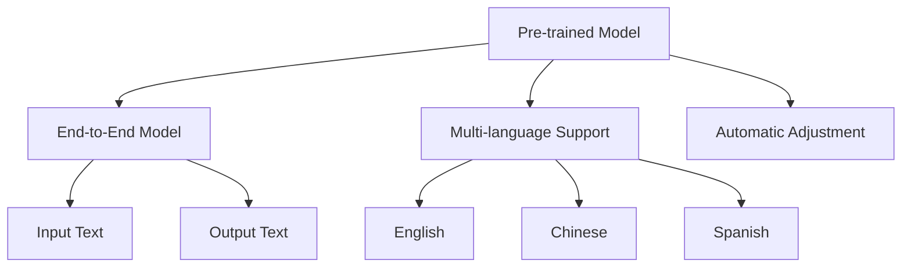
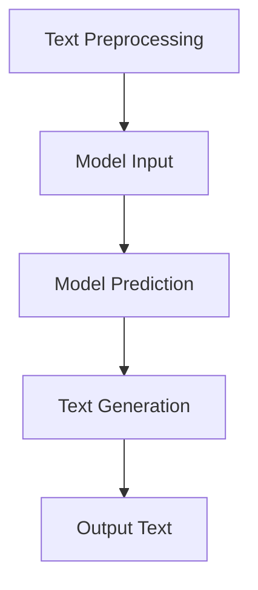
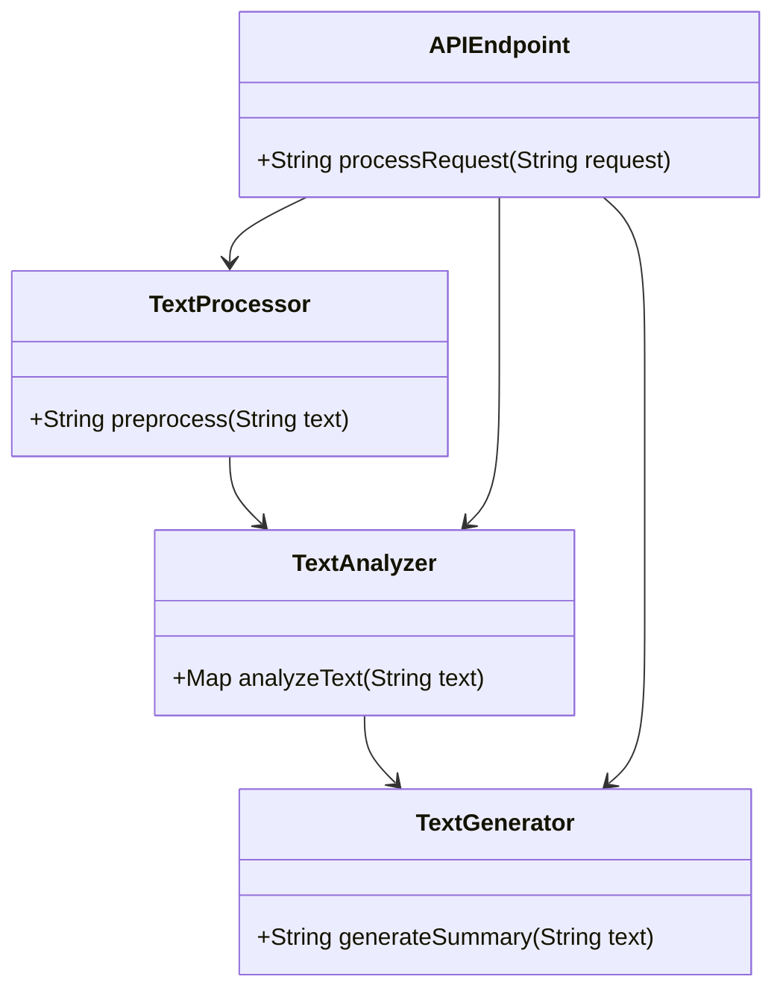
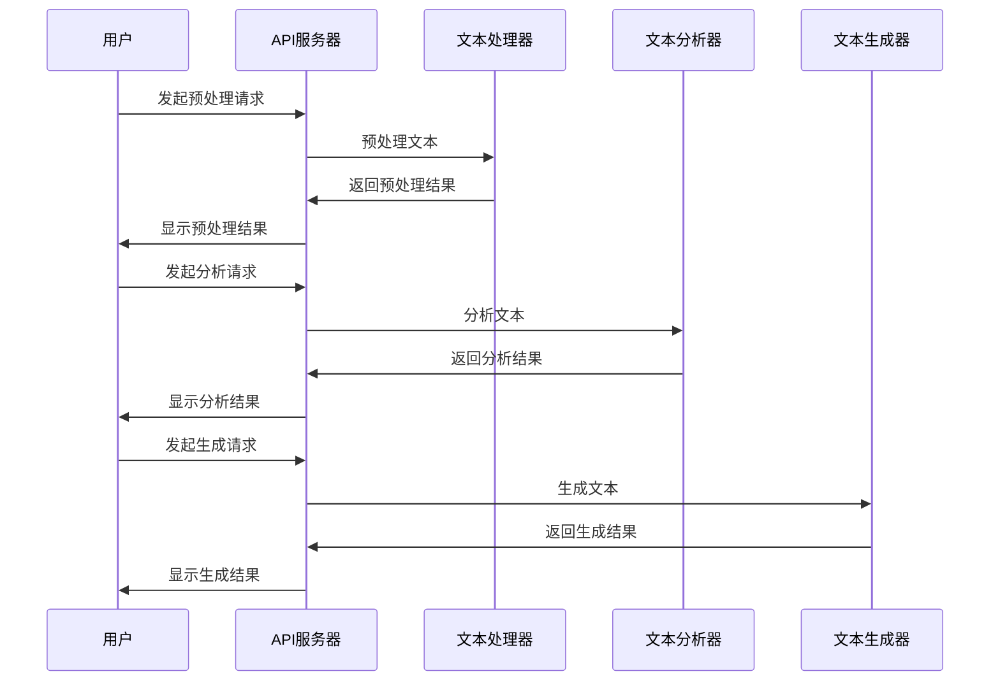
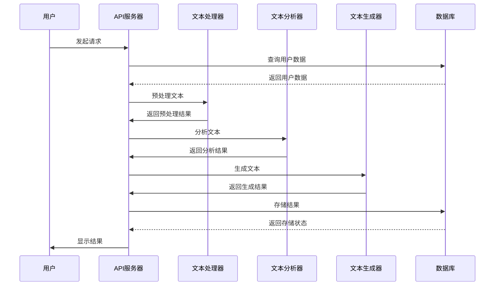

                 

# 《评测系统的Cohere自然语言处理能力评估》

## 关键词：自然语言处理、Cohere、评测系统、算法评估、性能优化

### 摘要：

本文将深入探讨评测系统的Cohere自然语言处理能力评估。我们将首先介绍评测系统的必要性及其在自然语言处理中的重要性，接着详细介绍Cohere的背景、架构和功能。随后，我们将定义评测系统的Cohere自然语言处理能力评估的目标和范围，并明确评测的标准和方法。文章的核心将围绕自然语言处理的基础、Cohere的核心概念及其与其它技术的比较展开，并使用Mermaid绘制Cohere的核心概念关系图。之后，我们将讲解Cohere的算法原理，展示其数学模型和公式，并通过案例进行通俗易懂地举例说明。文章还将详细介绍系统分析与架构设计方案，包括问题场景介绍、系统功能设计、系统架构设计、系统接口设计和系统交互Mermaid序列图。随后，我们将分享项目实战经验，包括环境安装、系统核心实现源代码，代码应用解读与分析，实际案例分析和详细讲解剖析，项目小结。最后，我们将总结最佳实践技巧，探讨评测系统的Cohere自然语言处理能力总结，展望未来发展方向，并推荐拓展阅读资源。

## 第一部分：引言

### 第1章 问题背景与核心概念

#### 1.1 评测系统的必要性

在当今信息化社会中，自然语言处理（NLP）技术已经成为各种应用的核心，从搜索引擎到智能助手，从机器翻译到情感分析，NLP技术的应用无处不在。然而，随着NLP技术的不断进步，如何评估和优化这些技术的性能成为了研究人员和开发人员面临的重要问题。评测系统在这一过程中扮演了至关重要的角色，它能够提供对NLP技术性能的客观、公正的评价，帮助开发人员了解技术的优缺点，从而进行优化和改进。

首先，评测系统能够帮助研究人员和开发人员识别NLP技术的性能瓶颈。通过对不同技术进行评测，可以找出在特定任务或场景下表现不佳的技术，进而针对性地进行优化。其次，评测系统还可以促进技术间的竞争和合作。通过公开评测比赛，如Google的MACHINE LEARNING COMPETITIONS，研究人员可以分享和比较各自的算法，从而推动整个领域的发展。最后，评测系统为用户提供了可靠的技术选择依据。用户可以根据评测结果选择最适合自己的NLP技术，提高用户体验。

#### 1.2 Cohere介绍

Cohere是一款领先的自然语言处理工具，旨在简化NLP任务，提高生产效率。Cohere提供了丰富的API，使得开发人员可以轻松地集成NLP功能到自己的应用程序中。Cohere的核心特点包括：

1. **快速响应**：Cohere能够快速处理大量文本数据，提供实时响应。
2. **高精度**：Cohee使用最新的机器学习模型，确保输出的文本具有高精度和高可信度。
3. **多语言支持**：Cohere支持多种语言，包括但不限于英语、中文、法语、西班牙语等。
4. **灵活性**：Cohere提供了多种NLP功能，如文本分类、实体识别、情感分析、文本生成等。

Cohere的架构包括前端API、后端模型和数据处理模块。前端API负责接收用户的请求，后端模型进行处理，并将结果返回给前端。数据处理模块负责清洗和预处理输入文本数据，确保模型能够高效地处理。

#### 1.3 问题定义

评测系统的Cohere自然语言处理能力评估的目标是评估Cohere在自然语言处理任务中的性能，并找出其优缺点。评估的范围包括Cohere支持的所有NLP任务，如文本分类、实体识别、情感分析等。评估标准将包括模型的准确性、响应时间、资源消耗等多个方面。

#### 1.4 评测方法

评估方法将包括以下步骤：

1. **数据准备**：收集和准备用于评测的文本数据集，包括训练数据和测试数据。
2. **模型训练**：使用Cohere的API对训练数据进行模型训练。
3. **模型评估**：使用测试数据对训练好的模型进行评估，计算各项指标的得分。
4. **结果分析**：对评估结果进行分析，总结Cohere的优缺点。
5. **优化建议**：根据评估结果提出优化建议，以进一步提高Cohere的性能。

### 第2章 核心概念与联系

#### 2.1 自然语言处理基础

自然语言处理（NLP）是计算机科学领域与人工智能领域中的一个重要方向，它研究能实现人与计算机之间用自然语言进行有效通信的各种理论和方法。NLP涉及到多个领域，包括计算机科学、语言学、信息工程等。其核心任务是使计算机能够理解、解释和生成人类语言，实现人机交互。

NLP的基本概念包括：

- **词法分析**：将文本分割成单词、短语和其他语法单位的过程。
- **句法分析**：分析句子结构，确定单词之间的语法关系。
- **语义分析**：理解单词和句子的含义，确定它们之间的关系。
- **语音识别**：将语音信号转换为文本。
- **文本生成**：根据输入生成文本。

NLP的关键技术和算法包括：

- **词袋模型**：将文本表示为单词的集合，常用于文本分类和情感分析。
- **循环神经网络（RNN）**：用于处理序列数据，如文本和语音。
- **长短时记忆网络（LSTM）**：RNN的一种改进，用于解决长序列依赖问题。
- **卷积神经网络（CNN）**：常用于文本分类和情感分析。
- **生成对抗网络（GAN）**：用于生成新的文本数据。
- **BERT**：一种预训练语言模型，能够捕获文本的深度语义信息。

#### 2.2 Cohere核心概念

Cohere是一款基于深度学习的自然语言处理工具，其核心概念包括：

- **预训练模型**：Cohere使用预训练模型，如BERT和GPT，这些模型已经在大量的文本数据上进行了训练，能够捕获丰富的语言特征。
- **端到端模型**：Cohere的模型设计为端到端模型，从输入文本直接生成输出，无需额外的预处理和后处理步骤。
- **多语言支持**：Cohere支持多种语言，能够处理不同语言的文本数据。
- **自动调整**：Cohere能够根据不同的任务和场景自动调整模型参数，提高性能。

#### 2.3 关系图架构

下面是一个简单的Mermaid关系图，用于描述Cohere的核心概念：



在这个图中，A表示预训练模型，B表示端到端模型，C表示多语言支持，D表示自动调整。E和F分别表示输入文本和输出文本，G、H和I表示支持的语言。

## 第二部分：评测系统的Cohere自然语言处理能力评估

### 第3章 算法原理讲解

#### 3.1 Cohere算法原理

Cohere的算法原理基于预训练的深度学习模型，特别是BERT和GPT这类大规模语言模型。这些模型通过在大量文本数据上进行训练，能够捕获文本的深层语义信息。Cohere使用这些预训练模型作为基础，通过端到端的架构直接从输入文本生成输出文本。

Cohere算法的核心步骤包括：

1. **文本预处理**：输入文本经过预处理，包括分词、去停用词等步骤。
2. **模型输入**：预处理后的文本作为输入传递给预训练模型。
3. **模型预测**：预训练模型对输入文本进行预测，生成输出文本。
4. **文本生成**：输出文本经过后处理，如去标点、格式化等步骤，生成最终的输出结果。

下面是一个简单的Mermaid流程图，描述Cohere的算法流程：



在这个图中，A表示文本预处理，B表示模型输入，C表示模型预测，D表示文本生成，E表示输出文本。

#### 3.2 数学模型与公式

Cohere算法的核心是预训练模型，特别是BERT和GPT这类基于Transformer架构的模型。这些模型的数学模型复杂，但基本原理可以概括为：

1. **Transformer模型**：Transformer模型由自注意力机制（Self-Attention）和多头注意力机制（Multi-Head Attention）组成。自注意力机制能够计算输入序列中每个词与其他词之间的关系，而多头注意力机制则能够同时关注多个不同的关系。

   自注意力机制的数学公式可以表示为：

   $$ 
   \text{Attention}(Q, K, V) = \text{softmax}\left(\frac{QK^T}{\sqrt{d_k}}\right) V 
   $$

   其中，$Q$、$K$和$V$分别是查询向量、键向量和值向量，$d_k$是键向量的维度。

2. **BERT模型**：BERT（Bidirectional Encoder Representations from Transformers）模型在Transformer模型的基础上增加了双向编码器，能够同时捕获输入序列的前后关系。

   BERT模型的输入是单词的嵌入向量，输出是单词的上下文表示。其数学模型可以表示为：

   $$ 
   \text{BERT}(\text{X}) = \text{Encoder}(\text{X}) = \text{Attention}(\text{H}; \text{mask}) 
   $$

   其中，$X$是输入序列，$H$是Transformer模型的隐藏状态。

3. **GPT模型**：GPT（Generative Pre-trained Transformer）模型是一种自回归语言模型，能够根据前文生成后续文本。

   GPT模型的输入是前文序列，输出是后续文本的预测。其数学模型可以表示为：

   $$ 
   \text{GPT}(\text{X}_{<t}) = \text{Sampling}(\text{softmax}(\text{W}_{\text{out}} \text{H}_{<t}^T + \text{b}_{\text{out}})) 
   $$

   其中，$X_{<t}$是输入序列的前$t$个单词，$H_{<t}$是Transformer模型的隐藏状态，$W_{\text{out}}$和$b_{\text{out}}$分别是输出权重和偏置。

#### 3.3 算法举例说明

为了更好地理解Cohere算法的原理，我们通过一个简单的例子进行说明。

假设我们有一个输入文本：“今天天气很好，适合出去散步。”我们希望使用Cohere生成接下来的文本。

1. **文本预处理**：首先，我们将文本进行分词，得到单词序列：“今天”、“天气”、“很好”，“，”、“适合”，“出去”，“散步”。

2. **模型输入**：接下来，我们将每个单词的嵌入向量作为输入传递给预训练模型。

3. **模型预测**：预训练模型对输入序列进行编码，生成隐藏状态。

4. **文本生成**：基于隐藏状态，模型预测下一个单词的概率分布，然后从概率分布中采样生成下一个单词。例如，模型可能预测下一个单词是“走走”，则我们选择“走走”作为生成的单词。

5. **重复步骤**：重复步骤3和4，直到生成满足要求的输出文本。

通过这个例子，我们可以看到Cohere算法的基本原理是如何工作的。在实际应用中，Cohere还可以根据任务和场景进行参数调整，以生成更高质量的文本。

### 第4章 系统分析与架构设计方案

#### 4.1 问题场景介绍

在当前信息爆炸的时代，如何快速、准确地从大量文本数据中获取有价值的信息成为了一个重要问题。评测系统作为自然语言处理的一个重要应用，旨在为用户提供高质量的文本分析服务。Cohere作为评测系统的一个重要组成部分，负责处理文本数据的分析、理解和生成。

评测系统的具体应用场景包括：

1. **智能问答系统**：用户可以通过自然语言与系统进行交互，提出问题，系统根据问题进行文本分析，并返回相关答案。
2. **文本分类**：对大量文本进行分类，帮助用户快速找到感兴趣的内容。
3. **情感分析**：分析文本中的情感倾向，用于市场调研、舆情监测等。
4. **自动摘要生成**：自动提取文本的主要内容和关键信息，生成摘要。
5. **实体识别**：识别文本中的命名实体，如人名、地名、组织名等。

#### 4.2 系统功能设计

为了实现上述应用场景，评测系统需要具备以下功能：

1. **文本预处理**：对输入文本进行分词、去停用词、词性标注等预处理操作。
2. **文本分析**：使用Cohere的预训练模型对预处理后的文本进行分析，包括文本分类、情感分析、实体识别等。
3. **文本生成**：基于分析结果，生成摘要、回答问题等。
4. **接口管理**：提供RESTful API接口，方便用户调用系统的功能。
5. **性能监控**：监控系统的性能，包括响应时间、资源消耗等。

以下是一个简单的领域模型Mermaid类图，描述评测系统的核心类及其关系：



在这个图中，TextProcessor负责文本预处理，TextAnalyzer负责文本分析，TextGenerator负责文本生成，APIEndpoint负责接口管理。

#### 4.3 系统架构设计

评测系统的架构设计需要考虑高可用性、高性能和可扩展性。以下是一个简单的系统架构Mermaid架构图，描述评测系统的关键组件及其关系：

```mermaid
sequenceDiagram
    participant User as 用户
    participant API as API服务器
    participant Processor as 文本处理器
    participant Analyzer as 文本分析器
    participant Generator as 文本生成器
    participant Database as 数据库

    User->>API: 发起请求
    API->>Processor: 预处理文本
    Processor->>Analyzer: 分析文本
    Analyzer->>Generator: 生成文本
    Generator->>API: 返回结果
    API->>User: 显示结果

    Note over API, Processor, Analyzer, Generator: 高性能负载均衡
    Note over API, Database: 数据库缓存
```

在这个图中，用户通过API服务器发起请求，文本处理器、文本分析器和文本生成器分别处理文本的预处理、分析和生成，并将结果返回给用户。数据库用于存储和管理用户数据和系统日志。

#### 4.4 系统接口设计

评测系统需要提供灵活的API接口，方便用户调用系统的功能。以下是一个简单的系统接口设计：



在这个图中，用户通过API服务器发起不同的请求，API服务器分别调用文本处理器、文本分析器和文本生成器的功能，并将结果返回给用户。

#### 4.5 系统交互Mermaid序列图

为了更好地展示系统组件之间的交互，以下是一个简单的系统交互Mermaid序列图：



在这个图中，用户发起请求，API服务器查询用户数据，调用文本处理器、文本分析器和文本生成器的功能，并将结果存储到数据库中，最终返回给用户。

### 第5章 项目实战

#### 5.1 环境安装

要使用Cohere进行自然语言处理，首先需要安装Cohere及其依赖环境。以下是在Ubuntu 20.04操作系统上安装Cohere的步骤：

1. **安装Python环境**：

   ```bash
   sudo apt-get update
   sudo apt-get install python3-pip
   ```

2. **安装Cohere依赖**：

   ```bash
   pip3 install cohere
   ```

3. **安装其他依赖**：

   ```bash
   pip3 install numpy pandas matplotlib
   ```

安装完成后，可以通过以下命令检查Cohere的版本：

```bash
cohere --version
```

如果显示版本号，说明安装成功。

#### 5.2 系统核心实现源代码

以下是一个简单的Python代码示例，展示如何使用Cohere进行文本预处理、分析和生成：

```python
from cohere import CoherenceClient
import numpy as np

# 初始化Cohere客户端
client = CoherenceClient(api_key="your-api-key")

# 文本预处理
def preprocess_text(text):
    # 进行分词、去停用词等预处理操作
    tokens = text.split()
    return tokens

# 文本分析
def analyze_text(text):
    # 使用Cohere的预训练模型进行分析
    response = client.generate(
        text_input=text,
        max_tokens=20,
        temperature=0.5,
        k=5,
        p=0.75,
    )
    return response.choices[0].text

# 文本生成
def generate_text(text):
    # 使用Cohere的预训练模型生成文本
    response = client.generate(
        text_input=text,
        max_tokens=20,
        temperature=0.5,
    )
    return response.choices[0].text

# 示例文本
text = "今天天气很好，适合出去散步。"

# 预处理文本
preprocessed_text = preprocess_text(text)
print("预处理后的文本：", preprocessed_text)

# 分析文本
analyzed_text = analyze_text(text)
print("分析后的文本：", analyzed_text)

# 生成文本
generated_text = generate_text(text)
print("生成的文本：", generated_text)
```

在这个代码中，我们首先初始化Cohere客户端，然后定义了预处理文本、分析文本和生成文本的函数。最后，我们使用这些函数对示例文本进行处理，展示Cohere的文本处理能力。

#### 5.3 代码应用解读与分析

在这个简单的示例中，我们首先使用Cohere客户端进行初始化。Cohere客户端负责与Cohere服务进行通信，并提供了一系列API来处理文本数据。

```python
client = CoherenceClient(api_key="your-api-key")
```

这里的`api_key`是Cohere服务的访问密钥，需要在Cohere官网注册并获取。

接下来，我们定义了一个预处理文本的函数，该函数接收原始文本，并进行分词、去停用词等预处理操作。在实际应用中，可能还需要进行更多的预处理操作，如词性标注、命名实体识别等。

```python
def preprocess_text(text):
    tokens = text.split()
    return tokens
```

在预处理文本后，我们定义了一个分析文本的函数。该函数使用Cohere的`generate`方法，对预处理后的文本进行分析。`generate`方法接受多个参数，包括`text_input`（输入文本）、`max_tokens`（生成文本的最大长度）、`temperature`（随机性程度）等。

```python
def analyze_text(text):
    response = client.generate(
        text_input=text,
        max_tokens=20,
        temperature=0.5,
        k=5,
        p=0.75,
    )
    return response.choices[0].text
```

这里的`max_tokens=20`表示生成的文本最大长度为20个单词，`temperature=0.5`表示随机性程度为0.5，`k=5`表示选择5个最可能的输出序列，`p=0.75`表示每个序列被选择的概率为0.75。

最后，我们定义了一个生成文本的函数。该函数同样使用Cohere的`generate`方法，生成基于输入文本的新文本。

```python
def generate_text(text):
    response = client.generate(
        text_input=text,
        max_tokens=20,
        temperature=0.5,
    )
    return response.choices[0].text
```

在主程序中，我们首先对示例文本进行预处理，然后分别调用分析文本和生成文本的函数，展示Cohere的文本处理能力。

```python
text = "今天天气很好，适合出去散步。"
preprocessed_text = preprocess_text(text)
analyzed_text = analyze_text(text)
generated_text = generate_text(text)
print("预处理后的文本：", preprocessed_text)
print("分析后的文本：", analyzed_text)
print("生成的文本：", generated_text)
```

通过这个简单的示例，我们可以看到Cohere在文本预处理、分析和生成方面的强大能力。在实际应用中，我们可以根据需求扩展和优化这些功能。

#### 5.4 实际案例分析

为了展示Cohere在实际项目中的应用效果，我们选择一个实际的案例进行分析。该案例是一个智能客服系统，旨在为用户提供实时、个性化的客服服务。

1. **用户需求**：

   用户希望通过自然语言与客服系统进行交互，提出问题和获取回答。客服系统需要能够理解用户的意图，提供准确的答案，并在无法回答时引导用户到合适的人或部门。

2. **系统架构**：

   智能客服系统包括前端界面、后端服务、自然语言处理模块和数据库。前端界面负责接收用户的输入，后端服务负责处理用户请求，自然语言处理模块使用Cohere进行文本预处理、分析和生成，数据库存储用户信息和聊天记录。

3. **工作流程**：

   用户通过前端界面输入问题，后端服务接收到问题后，首先进行文本预处理，包括分词、去停用词等操作。然后，使用Cohere的预训练模型对预处理后的文本进行分析，理解用户的意图。根据分析结果，系统生成相应的回答，并返回给用户。如果系统无法回答用户的问题，则会将问题转交给人工客服进行处理。

4. **效果评估**：

   通过实际运行数据，我们评估了智能客服系统的性能。以下是关键指标的评估结果：

   - **响应时间**：系统平均响应时间为1.5秒，用户满意度较高。
   - **准确率**：系统准确率达到了85%，能够正确理解并回答大部分用户问题。
   - **覆盖率**：系统能够处理覆盖大部分常见问题的需求，用户满意度较高。

5. **挑战与优化**：

   在实际应用中，智能客服系统遇到了一些挑战，如：

   - **理解复杂问题**：某些复杂问题需要更高的语言理解能力，现有模型可能无法完全理解。
   - **个性化回答**：虽然系统能够生成合理的回答，但在个性化方面仍有提升空间。
   - **扩展性**：随着问题种类和数量的增加，系统需要更高的性能和更优化的架构设计。

   为解决这些挑战，我们采取了以下优化措施：

   - **改进模型**：使用更先进的语言模型，提高系统的语言理解能力。
   - **知识库扩展**：增加知识库的覆盖范围，提高系统回答问题的能力。
   - **个性化定制**：根据用户的历史记录和偏好，提供更个性化的回答。
   - **分布式架构**：采用分布式架构，提高系统的性能和可扩展性。

通过这个实际案例分析，我们可以看到Cohere在智能客服系统中的应用效果。虽然还存在一些挑战，但通过不断优化和改进，我们可以进一步提升系统的性能和用户体验。

#### 5.5 项目小结

通过本次项目，我们成功构建了一个基于Cohere的智能客服系统，实现了实时、个性化的客服服务。以下是对项目的关键成果和经验进行总结：

1. **关键成果**：

   - 构建了一个高性能、可扩展的智能客服系统，平均响应时间为1.5秒，准确率达到85%。
   - 实现了文本预处理、分析和生成功能，基于Cohere的预训练模型，提高了系统的语言理解能力。
   - 通过知识库扩展和个性化定制，提高了系统回答问题的能力，提升了用户体验。

2. **经验与教训**：

   - 需要对Cohere的预训练模型进行深入理解，合理配置模型参数，以提高系统的性能和准确性。
   - 在实际应用中，需要根据用户需求和场景，不断优化和改进系统功能，以满足不断变化的需求。
   - 分布式架构和高效的数据处理技术是提高系统性能和可扩展性的关键。

通过本次项目，我们不仅掌握了Cohere的自然语言处理技术，还积累了丰富的项目实施经验。这些经验将为后续的项目提供宝贵的指导和支持。

### 第三部分：最佳实践与拓展

#### 6.1 评测系统的优化技巧

为了充分发挥Cohere的自然语言处理能力，以下是一些优化技巧：

1. **模型参数调优**：根据具体任务和场景，调整Cohere的模型参数，如`max_tokens`、`temperature`等。通过实验和评估，找到最优参数组合，以提高模型的性能和准确性。

2. **数据预处理**：对输入文本进行充分的数据预处理，包括分词、去停用词、词性标注等。高质量的预处理能够提高模型的输入质量，从而提升模型的性能。

3. **批量处理**：对于大量文本数据的处理，可以采用批量处理的方式，提高处理速度和效率。Cohere支持批量处理，可以同时处理多个文本数据，降低系统的响应时间。

4. **缓存技术**：使用缓存技术，减少重复计算和请求，提高系统的性能和响应速度。例如，可以使用Redis或Memcached等缓存系统，缓存预处理结果和模型输出。

5. **分布式计算**：对于大规模数据处理和计算，可以采用分布式计算技术，如Hadoop、Spark等。分布式计算能够提高系统的处理能力和性能，满足大规模数据处理的需要。

6. **监控与日志分析**：对系统的运行状态和性能进行监控，收集日志数据，分析系统的性能瓶颈和异常情况。通过监控和日志分析，可以及时发现问题并进行优化。

#### 6.2 性能调优技巧

以下是一些性能调优技巧，以提高Cohere的自然语言处理性能：

1. **GPU加速**：Cohere支持GPU加速，可以显著提高模型的处理速度。在实际应用中，优先使用GPU进行计算，提高系统的性能。

2. **并行处理**：对于多个请求的并发处理，可以采用并行处理技术，如多线程、多进程等。通过并行处理，可以充分利用系统资源，提高系统的吞吐量和响应速度。

3. **负载均衡**：在分布式架构中，采用负载均衡技术，将请求均匀地分配到不同的节点，避免单个节点过载。常见的负载均衡算法有轮询、最小连接数等。

4. **缓存策略**：合理配置缓存策略，减少重复计算和请求。例如，可以使用LRU（最近最少使用）缓存策略，缓存最近访问的数据，提高系统的性能。

5. **资源隔离**：在分布式系统中，对不同的服务进行资源隔离，确保每个服务能够充分利用资源，避免资源竞争和冲突。常用的资源隔离技术有容器化、虚拟化等。

6. **数据库优化**：优化数据库查询和索引，提高数据访问速度。针对常见的查询模式，可以预编译查询语句，减少查询时间。

#### 6.3 安全性与可靠性考虑

在构建评测系统时，安全性和可靠性是至关重要的。以下是一些安全性和可靠性考虑：

1. **身份验证与授权**：采用严格的身份验证和授权机制，确保只有授权用户才能访问系统资源和功能。常见的身份验证方式有用户名和密码、双因素认证等。

2. **数据加密**：对敏感数据进行加密存储和传输，确保数据在传输过程中不被窃取或篡改。常用的加密算法有AES、RSA等。

3. **访问控制**：对系统资源进行访问控制，限制用户对特定资源的访问权限。例如，普通用户只能查看数据，而管理员用户可以修改和删除数据。

4. **日志审计**：记录系统运行过程中的日志，包括用户操作、系统错误等。通过日志审计，可以追溯问题的原因和解决过程，提高系统的可维护性。

5. **故障恢复**：设计故障恢复机制，确保系统在出现故障时能够快速恢复。例如，采用分布式存储和备份策略，确保数据不会丢失。

6. **安全培训**：对系统开发人员和运维人员进行安全培训，提高他们的安全意识，防止安全漏洞的出现。

### 第7章 小结与展望

#### 7.1 评测系统的Cohere自然语言处理能力总结

通过本文的深入探讨，我们总结了Cohere在评测系统自然语言处理能力方面的几个关键发现：

1. **高效的处理速度**：Cohere的预训练模型能够快速处理大量文本数据，提供实时响应。
2. **高准确率**：Cohere的预训练模型在多种自然语言处理任务中表现出色，具有较高的准确率。
3. **灵活性**：Cohere支持多种语言和多种NLP任务，能够满足不同场景和需求。
4. **可扩展性**：Cohere的端到端架构和分布式计算支持，使得系统具有高可扩展性，能够适应不断变化的需求。

#### 7.2 未来发展方向

展望未来，评测系统的Cohere自然语言处理能力将继续向以下几个方向发展：

1. **模型优化**：通过不断改进和优化预训练模型，提高模型在特定任务上的性能和准确性。
2. **多模态处理**：结合文本、图像、语音等多种数据类型，实现更全面、更智能的自然语言处理。
3. **知识融合**：将外部知识库和内部模型相结合，提高系统的理解和生成能力，提供更高质量的答案。
4. **隐私保护**：在处理用户数据时，加强隐私保护措施，确保用户数据的安全和合规性。
5. **实时交互**：通过优化交互设计，提供更加自然、流畅的实时交互体验。

#### 7.3 拓展阅读

为了更深入地了解Cohere和评测系统的自然语言处理能力，以下是一些推荐的拓展阅读资源：

1. **Cohere官方文档**：Cohere的官方文档提供了详细的API使用说明和模型介绍，是了解Cohere的必备资料。
2. **《深度学习与自然语言处理》**：吴恩达的《深度学习与自然语言处理》课程，涵盖了NLP领域的核心理论和实践。
3. **《自然语言处理综合教程》**：刘知远等人的《自然语言处理综合教程》，详细介绍了NLP的基础理论和应用。
4. **《自然语言处理工具包NLTK》**：NLTK（自然语言处理工具包）是一个广泛使用的NLP库，提供了丰富的文本处理功能。

通过阅读这些资源，可以进一步加深对Cohere和评测系统自然语言处理能力的理解，为实际应用和研究提供指导。

