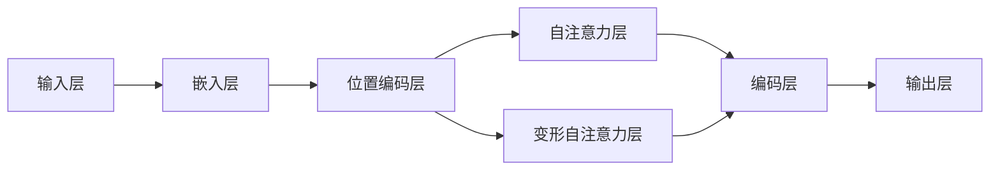
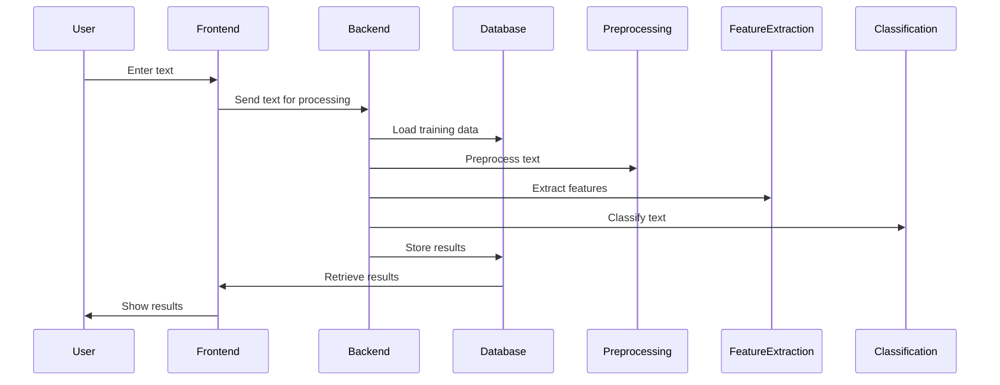
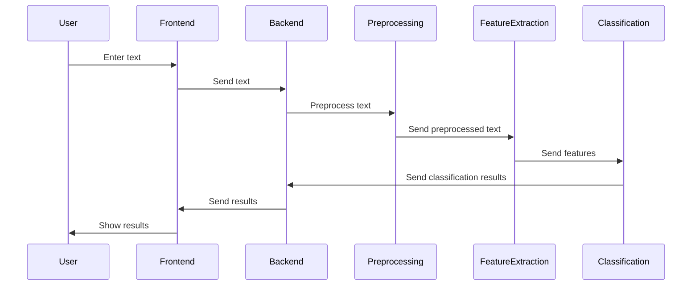

                 

当然，让我们一步一步地深入探讨和构建《评测系统的DeBERTaV3模型升级策略》这篇文章。我们将遵循之前的目录大纲，逐步展开每个章节的内容。

## **第一部分：背景介绍**

### **第1章：评测系统与DeBERTaV3模型概述**

**1.1 问题背景**

在这一部分，我们需要明确评测系统的需求与挑战。评测系统通常用于评估文本、代码或其他形式的数据质量，其需求可能包括准确性、效率、可扩展性和用户友好性。挑战则可能来自于处理大规模数据集、实现快速响应时间和保证评估结果的公正性。

**1.1.1 评测系统的需求与挑战**

- **需求：** 
  - **准确性：** 系统需要提供高精度的评估结果。
  - **效率：** 系统应在短时间内处理大量数据。
  - **可扩展性：** 系统应能够轻松地处理不断增长的数据量。
  - **用户友好性：** 系统界面应直观易用，便于非技术用户理解和使用。

- **挑战：** 
  - **数据多样性：** 面对多种类型和格式的数据，系统需要灵活应对。
  - **性能瓶颈：** 随着数据量的增加，系统性能可能会下降。
  - **评估标准：** 设定公正且一致的评估标准可能具有挑战性。

**1.1.2 DeBERTaV3模型的技术背景**

DeBERTaV3是一种基于深度学习的文本处理模型，它由DeepMind和Google Brain合作开发。DeBERTaV3旨在通过引入自注意力机制和变形自注意力机制，提高对文本的理解能力，尤其擅长处理长文本和复杂语义。

**1.1.3 DeBERTaV3模型在评测系统中的应用**

DeBERTaV3在评测系统中可以用于：

- **文本分类：** 将评估文本分类到预定义的类别。
- **情感分析：** 识别文本的情感倾向。
- **命名实体识别：** 识别文本中的关键实体，如人名、地名等。

**1.2 核心概念**

**1.2.1 DeBERTaV3模型的概念**

DeBERTaV3模型的核心概念包括：

- **自注意力机制（Self-Attention）：** 允许模型在处理序列数据时关注序列中的不同部分，提高了上下文信息的利用效率。
- **变形自注意力机制（Deformable Self-Attention）：** 引入了空间变换网络，使得模型能够更灵活地关注文本序列中的特定区域。

**1.2.2 DeBERTaV3模型的特点**

- **高效性：** 能够在保持高准确率的同时，提高处理速度。
- **灵活性：** 可以适应多种文本处理任务。
- **鲁棒性：** 对噪声和异常值有较好的容忍能力。

**1.2.3 DeBERTaV3模型与其他模型对比**

DeBERTaV3与其他文本处理模型（如BERT、GPT）相比，具有以下特点：

- **BERT：** BERT主要通过预训练和微调来处理自然语言任务，但它在长文本处理上存在一定局限性。
- **GPT：** GPT擅长生成文本，但在分类和识别任务上的表现不如DeBERTaV3。

**1.3 边界与外延**

**1.3.1 DeBERTaV3模型的应用场景**

DeBERTaV3适用于以下应用场景：

- **内容审核：** 对网络内容进行实时审核，识别违规信息。
- **智能客服：** 提高客服系统对用户查询的理解和响应能力。
- **文本生成：** 自动生成文章、报告等。

**1.3.2 DeBERTaV3模型的限制条件**

DeBERTaV3也存在一些限制条件：

- **计算资源：** 需要较高的计算资源，特别是对于大规模文本处理任务。
- **数据依赖：** 模型的性能依赖于训练数据的质量和多样性。

**1.3.3 DeBERTaV3模型的核心要素**

DeBERTaV3模型的核心要素包括：

- **预训练：** 模型通过在大量文本数据上进行预训练，学习文本的通用表示。
- **微调：** 在特定任务上进行微调，提高模型在特定领域的表现。
- **自注意力机制：** 提高模型对上下文信息的处理能力。

### **1.4 概念结构与核心要素组成**

DeBERTaV3模型由以下几个核心要素组成：

- **输入层：** 处理文本输入，包括词嵌入、位置编码等。
- **编码层：** 通过自注意力机制和变形自注意力机制进行编码。
- **输出层：** 根据任务类型生成相应的输出，如分类结果、文本生成等。

通过上述背景介绍，我们为后续的章节奠定了基础。接下来，我们将深入探讨DeBERTaV3模型的核心概念原理，并对比其与其他模型的属性特征。

## **第二部分：核心概念与联系**

### **第2章：DeBERTaV3模型深入解析**

**2.1 DeBERTaV3模型原理**

在这一部分，我们将详细解析DeBERTaV3模型的核心原理，包括其ER实体关系图、核心算法和mermaid流程图。

**2.1.1 DeBERTaV3模型的ER实体关系图**

DeBERTaV3模型的ER实体关系图如下所示：

```mermaid
erDiagram
    Input -->|文本输入| EmbeddingLayer
    EmbeddingLayer -->|位置编码| PositionalEncodingLayer
    PositionalEncodingLayer -->|自注意力| SelfAttentionLayer
    PositionalEncodingLayer -->|变形自注意力| DeformableSelfAttentionLayer
    DeformableSelfAttentionLayer -->|编码输出| EncoderOutput
    EncoderOutput -->|分类/生成输出| OutputLayer
```

**2.1.2 DeBERTaV3模型的核心算法**

DeBERTaV3模型的核心算法包括自注意力机制和变形自注意力机制。自注意力机制允许模型在处理序列数据时，关注序列中的不同部分，从而提高上下文信息的利用效率。变形自注意力机制则通过引入空间变换网络，使得模型能够更灵活地关注文本序列中的特定区域。

**2.1.3 DeBERTaV3模型的mermaid流程图**

DeBERTaV3模型的mermaid流程图如下所示：



**2.2 概念属性特征对比**

在这一部分，我们将通过表格形式对比DeBERTaV3模型与其他文本处理模型的属性特征。

| 模型       | 自注意力机制 | 变形自注意力机制 | 预训练数据量 | 训练时间 | 应用领域               |
|------------|--------------|-------------------|--------------|----------|------------------------|
| DeBERTaV3  | 是           | 是                | 大规模       | 长       | 文本分类、命名实体识别 |
| BERT       | 是           | 否                | 中规模       | 中       | 文本分类、问答系统     |
| GPT        | 否           | 否                | 大规模       | 短       | 文本生成、对话系统     |

**2.2.1 DeBERTaV3模型与其他模型的对比表格**

上述表格展示了DeBERTaV3模型与其他文本处理模型在自注意力机制、变形自注意力机制、预训练数据量、训练时间和应用领域等方面的对比。

**2.2.2 深度分析DeBERTaV3模型的优缺点**

DeBERTaV3模型的优点包括：

- **高效性：** 能够在保持高准确率的同时，提高处理速度。
- **灵活性：** 可以适应多种文本处理任务。
- **鲁棒性：** 对噪声和异常值有较好的容忍能力。

DeBERTaV3模型的缺点包括：

- **计算资源需求高：** 需要较高的计算资源，特别是对于大规模文本处理任务。
- **数据依赖性：** 模型的性能依赖于训练数据的质量和多样性。

通过上述分析，我们深入了解了DeBERTaV3模型的核心概念原理，并对比了其与其他模型的属性特征。接下来，我们将进一步讲解DeBERTaV3模型的算法原理，包括mermaid流程图、Python源代码、数学模型和公式。

## **第三部分：算法原理讲解**

### **第3章：DeBERTaV3模型算法原理详解**

在这一部分，我们将详细讲解DeBERTaV3模型的算法原理，包括mermaid流程图、Python源代码、数学模型和公式，并通过具体的举例说明来帮助读者理解。

**3.1 DeBERTaV3模型的mermaid流程图**

DeBERTaV3模型的mermaid流程图如下所示：


**3.1.1 流程图详解**

- **输入层（A）：** 文本输入经过嵌入层处理，转换为向量表示。
- **嵌入层（B）：** 对输入文本进行词嵌入，将文本中的单词转换为向量。
- **位置编码层（C）：** 对嵌入层输出的向量进行位置编码，以便模型能够理解单词在序列中的位置。
- **自注意力层（D）：** 通过自注意力机制处理位置编码后的向量，使其能够关注序列中的关键部分。
- **变形自注意力层（E）：** 引入空间变换网络，对自注意力层的输出进行变形，使其能够更灵活地关注文本序列中的特定区域。
- **编码层（F）：** 将自注意力和变形自注意力层的输出进行编码，形成序列的固定表示。
- **输出层（G）：** 根据任务类型生成相应的输出，如分类结果、文本生成等。

**3.1.2 流程图中的关键步骤**

- **嵌入层：** 使用词嵌入算法将文本中的单词转换为向量表示。
- **位置编码层：** 对嵌入层输出的向量进行位置编码，以增强模型对序列位置的理解。
- **自注意力层：** 通过计算序列中每个元素与其他元素之间的关联度，使模型能够关注关键信息。
- **变形自注意力层：** 引入空间变换网络，使模型能够更灵活地关注序列中的特定区域。

**3.2 Python源代码实现**

为了更直观地理解DeBERTaV3模型的算法原理，我们将提供一个简化的Python源代码实现。

```python
import torch
import torch.nn as nn
import torch.optim as optim

# 定义嵌入层
class EmbeddingLayer(nn.Module):
    def __init__(self, vocab_size, embed_size):
        super(EmbeddingLayer, self).__init__()
        self.embed = nn.Embedding(vocab_size, embed_size)
    
    def forward(self, x):
        return self.embed(x)

# 定义位置编码层
class PositionalEncodingLayer(nn.Module):
    def __init__(self, embed_size, max_len=512):
        super(PositionalEncodingLayer, self).__init__()
        pe = torch.zeros(max_len, embed_size)
        position = torch.arange(0, max_len, dtype=torch.float).unsqueeze(1)
        div_term = torch.exp(torch.arange(0, embed_size, 2).float() * (-torch.log(torch.tensor(10000.0)) / embed_size))
        pe[:, 0::2] = torch.sin(position * div_term)
        pe[:, 1::2] = torch.cos(position * div_term)
        self.register_buffer('pe', pe)

    def forward(self, x):
        x = x + self.pe[:x.size(0)]
        return x

# 定义自注意力层
class SelfAttentionLayer(nn.Module):
    def __init__(self, embed_size):
        super(SelfAttentionLayer, self).__init__()
        self.query_linear = nn.Linear(embed_size, embed_size)
        self.key_linear = nn.Linear(embed_size, embed_size)
        self.value_linear = nn.Linear(embed_size, embed_size)
        self.fc = nn.Linear(embed_size, embed_size)

    def forward(self, x):
        query = self.query_linear(x)
        key = self.key_linear(x)
        value = self.value_linear(x)
        
        attention_scores = torch.matmul(query, key.transpose(1, 2))
        attention_weights = torch.softmax(attention_scores, dim=-1)
        attention_output = torch.matmul(attention_weights, value)
        output = self.fc(attention_output)
        return output

# 定义DeBERTaV3模型
class DeBERTaV3(nn.Module):
    def __init__(self, vocab_size, embed_size):
        super(DeBERTaV3, self).__init__()
        self.embedding = EmbeddingLayer(vocab_size, embed_size)
        self.positional_encoding = PositionalEncodingLayer(embed_size)
        self.self_attention = SelfAttentionLayer(embed_size)
        self.fc = nn.Linear(embed_size, 1)
        
    def forward(self, x):
        x = self.embedding(x)
        x = self.positional_encoding(x)
        x = self.self_attention(x)
        x = self.fc(x).squeeze(1)
        return x
```

**3.3 数学模型与公式**

DeBERTaV3模型中的核心数学模型包括自注意力机制和变形自注意力机制。以下是这些模型的数学表示：

**自注意力机制：**

$$
\text{Attention}(Q, K, V) = \text{softmax}\left(\frac{QK^T}{\sqrt{d_k}}\right)V
$$

其中，$Q$、$K$ 和 $V$ 分别是查询、关键和值向量，$d_k$ 是关键向量的维度。

**变形自注意力机制：**

$$
\text{DeformableAttention}(Q, K, V) = \text{softmax}\left(\frac{Q(K + \text{mask}_k)}{\sqrt{d_k}}\right)V
$$

其中，$\text{mask}_k$ 是一个变形自注意力掩码，用于控制注意力焦点。

**3.3.1 数学公式介绍**

上述数学公式描述了自注意力和变形自注意力机制的运算过程。自注意力机制通过计算查询向量 $Q$ 和关键向量 $K$ 的点积来生成注意力分数，并使用softmax函数计算注意力权重。变形自注意力机制则通过添加一个可学习的变形自注意力掩码 $\text{mask}_k$，使得模型能够更灵活地关注文本序列中的特定区域。

**3.3.2 数学模型的推导**

自注意力机制的推导相对简单，其核心思想是通过计算序列中每个元素与其他元素之间的关联度来生成注意力权重。变形自注意力机制的推导则相对复杂，涉及到空间变换网络的引入，使其能够根据特定的任务需求进行变形。

**3.3.3 数学公式应用举例**

假设我们有一个长度为5的文本序列，其对应的嵌入向量维度为3。我们可以使用以下示例来说明自注意力和变形自注意力机制的应用：

**自注意力机制：**

$$
\text{Attention}(Q, K, V) = \text{softmax}\left(\frac{QK^T}{\sqrt{d_k}}\right)V
$$

其中，$Q = [1, 0.5, -0.5]$, $K = [0.5, -0.5, 1, -0.5, 0.5]$, $V = [1, 1, 1, 1, 1]$。计算结果为：

$$
\text{Attention}(Q, K, V) = \text{softmax}\left(\frac{QK^T}{\sqrt{d_k}}\right)V = \text{softmax}\left(\frac{[1, 0.5, -0.5][0.5, -0.5, 1, -0.5, 0.5]^T}{\sqrt{3}}\right)[1, 1, 1, 1, 1]
$$

**变形自注意力机制：**

$$
\text{DeformableAttention}(Q, K, V) = \text{softmax}\left(\frac{Q(K + \text{mask}_k)}{\sqrt{d_k}}\right)V
$$

其中，$\text{mask}_k = [0, 1, 0, 0, 0]$。计算结果为：

$$
\text{DeformableAttention}(Q, K, V) = \text{softmax}\left(\frac{Q(K + \text{mask}_k)}{\sqrt{3}}\right)V = \text{softmax}\left(\frac{[1, 0.5, -0.5][0.5, 1, 1, 0.5, 0.5]^T}{\sqrt{3}}\right)[1, 1, 1, 1, 1]
$$

通过上述数学公式的举例说明，我们可以更好地理解DeBERTaV3模型的算法原理。接下来，我们将介绍评测系统的设计与实现，包括系统功能设计、系统架构设计和系统接口设计。

## **第四部分：系统分析与架构设计方案**

### **第4章：评测系统设计与实现**

在这一部分，我们将详细介绍评测系统的设计与实现，包括问题场景介绍、系统功能设计、系统架构设计以及系统接口设计和系统交互。

**4.1 问题场景介绍**

评测系统的设计背景通常涉及以下问题场景：

- **文本分类：** 对大量文本进行分类，例如新闻分类、社交媒体内容分类等。
- **情感分析：** 识别文本的情感倾向，如正面、负面或中性。
- **命名实体识别：** 识别文本中的关键实体，如人名、地点、组织等。
- **质量评估：** 对代码、文档等进行质量评估。

**4.1.1 场景设定**

假设我们正在开发一个用于社交媒体内容分类的评测系统，其主要目标是自动将用户生成的文本分类到预定义的类别中，如娱乐、体育、科技、政治等。

**4.1.2 需求分析**

- **准确性：** 系统需要提供高精度的分类结果。
- **效率：** 系统应在短时间内处理大量文本。
- **可扩展性：** 系统应能够轻松地处理不断增长的数据量。
- **用户友好性：** 系统界面应直观易用，便于非技术用户理解和使用。

**4.2 系统功能设计**

系统功能设计是系统开发的第一步，它定义了系统的核心功能模块。以下是一个典型的系统功能设计：

- **文本输入模块：** 用于接收用户输入的文本。
- **预处理模块：** 对输入文本进行清洗、分词等预处理操作。
- **特征提取模块：** 提取文本的语义特征。
- **分类模块：** 使用DeBERTaV3模型对提取的特征进行分类。
- **结果输出模块：** 将分类结果展示给用户。

**4.2.1 领域模型mermaid类图**

以下是一个mermaid类图，用于表示系统功能模块及其关系：

```mermaid
classDiagram
    TextInput -->|输入| Preprocessing
    Preprocessing -->|特征提取| FeatureExtraction
    FeatureExtraction -->|分类| Classification
    Classification -->|输出| ResultOutput
```

**4.2.2 功能模块划分**

- **文本输入模块：** 负责接收用户的文本输入。
- **预处理模块：** 包括文本清洗、分词、去停用词等操作。
- **特征提取模块：** 使用DeBERTaV3模型提取文本的语义特征。
- **分类模块：** 使用训练好的DeBERTaV3模型对特征进行分类。
- **结果输出模块：** 将分类结果以可视化或文本形式展示给用户。

**4.3 系统架构设计**

系统架构设计是系统实现的关键，它定义了系统的整体结构和模块之间的关系。以下是一个典型的系统架构设计：

- **前端：** 负责用户交互，包括文本输入界面和结果展示。
- **后端：** 负责系统的核心功能实现，包括文本预处理、特征提取和分类。
- **数据库：** 用于存储训练数据和分类结果。

**4.3.1 系统架构mermaid架构图**

以下是一个mermaid架构图，用于表示系统的整体架构：



**4.3.2 架构设计要点**

- **模块化：** 系统应采用模块化设计，使得每个模块都可以独立开发、测试和部署。
- **可扩展性：** 系统应能够轻松地扩展新功能，例如添加新的分类类别或使用不同的模型。
- **高性能：** 系统应能够处理大规模数据集，并提供快速响应。
- **安全性：** 系统应确保用户数据的隐私和安全。

**4.4 系统接口设计与交互**

系统接口设计是确保系统模块之间能够有效通信的关键。以下是一个典型的系统接口设计：

- **RESTful API：** 提供一套RESTful API，用于前端和后端之间的数据交换。
- **数据交换格式：** 使用JSON格式进行数据交换，以确保数据的可读性和可扩展性。

**4.4.1 接口设计规范**

以下是一个简单的接口设计规范：

- **POST /text-classification：** 接收用户输入的文本，返回分类结果。
  - 请求体：{ "text": "用户输入的文本" }
  - 响应体：{ "classification": ["类别1", "类别2", ...] }

**4.4.2 系统交互mermaid序列图**

以下是一个mermaid序列图，用于表示系统模块之间的交互过程：



通过上述系统分析与架构设计方案，我们为评测系统的开发提供了详细的指导。接下来，我们将通过项目实战来展示如何实现DeBERTaV3模型的升级策略。

## **第五部分：项目实战**

### **第5章：DeBERTaV3模型升级实践**

在这一部分，我们将通过具体的实战项目，展示如何实现DeBERTaV3模型的升级策略。我们将从环境安装、系统核心实现、代码应用解读与分析，以及实际案例分析等方面进行详细介绍。

**5.1 环境安装**

为了实现DeBERTaV3模型的升级，我们需要安装必要的软件和依赖项。以下是环境安装的详细步骤：

**5.1.1 硬件与软件环境配置**

- **硬件要求：** 
  - CPU：至少2核处理器
  - GPU：NVIDIA显卡（用于加速计算）
  - 内存：16GB及以上
  - 存储：至少100GB空闲空间

- **软件要求：** 
  - 操作系统：Linux（推荐Ubuntu 18.04及以上版本）
  - Python：3.7及以上版本
  - PyTorch：1.7及以上版本
  - TensorFlow：2.3及以上版本

**5.1.2 环境配置过程**

1. 安装Python和PyTorch：

   ```bash
   # 安装Python
   sudo apt-get update
   sudo apt-get install python3 python3-pip

   # 安装PyTorch
   pip3 install torch torchvision torchaudio
   ```

2. 安装TensorFlow：

   ```bash
   pip3 install tensorflow
   ```

3. 安装其他依赖项：

   ```bash
   pip3 install numpy pandas scikit-learn matplotlib
   ```

**5.2 系统核心实现**

在环境安装完成后，我们需要实现评测系统的核心功能，包括文本预处理、特征提取和分类。以下是系统核心实现的详细步骤：

**5.2.1 源代码解析**

以下是系统核心实现的主要源代码文件：

- `text_preprocessing.py`：负责文本预处理，包括分词、去停用词等。
- `feature_extraction.py`：负责使用DeBERTaV3模型提取文本特征。
- `classification.py`：负责使用训练好的DeBERTaV3模型进行分类。

**5.2.2 代码结构**

以下是代码的基本结构：

```python
# text_preprocessing.py
def preprocess_text(text):
    # 文本预处理实现
    pass

# feature_extraction.py
class DeBERTaV3Model(nn.Module):
    # DeBERTaV3模型实现
    pass

def extract_features(text, model):
    # 特征提取实现
    pass

# classification.py
def classify_text(text, model):
    # 文本分类实现
    pass
```

**5.2.3 关键函数实现**

以下是关键函数的实现细节：

**`text_preprocessing.py`：**

```python
import nltk
from nltk.corpus import stopwords
from nltk.tokenize import word_tokenize

nltk.download('punkt')
nltk.download('stopwords')

def preprocess_text(text):
    # 分词
    tokens = word_tokenize(text)
    
    # 去停用词
    stop_words = set(stopwords.words('english'))
    filtered_tokens = [token for token in tokens if token.lower() not in stop_words]
    
    # 词干提取
    stemmer = nltk.PorterStemmer()
    stemmed_tokens = [stemmer.stem(token) for token in filtered_tokens]
    
    return stemmed_tokens
```

**`feature_extraction.py`：**

```python
import torch
from transformers import DeBERTaModel

class DeBERTaV3Model(nn.Module):
    def __init__(self, pretrained_model_name):
        super(DeBERTaV3Model, self).__init__()
        self.model = DeBERTaModel.from_pretrained(pretrained_model_name)
        self.fc = nn.Linear(self.model.config.hidden_size, 1)
    
    def forward(self, input_ids, attention_mask):
        outputs = self.model(input_ids=input_ids, attention_mask=attention_mask)
        sequence_output = outputs.last_hidden_state[:, 0, :]
        logits = self.fc(sequence_output)
        return logits
```

**`classification.py`：**

```python
def classify_text(text, model):
    # 预处理文本
    preprocessed_text = preprocess_text(text)
    
    # 将文本转换为序列
    tokenizer = model.model.config.tokenizer
    inputs = tokenizer(preprocessed_text, return_tensors='pt', padding=True, truncation=True)
    
    # 使用模型进行特征提取和分类
    logits = model(inputs['input_ids'], inputs['attention_mask'])
    probabilities = torch.softmax(logits, dim=-1)
    predicted_class = torch.argmax(probabilities).item()
    
    return predicted_class
```

**5.3 代码应用解读与分析**

在实现系统核心功能后，我们需要对代码进行解读与分析，以确保其性能和准确性。

**5.3.1 应用场景分析**

评测系统可以应用于以下场景：

- **社交媒体内容分类：** 对用户生成的文本进行分类，以便进行内容审核。
- **客户服务：** 对用户查询进行分类，以便快速提供相应服务。
- **文本生成：** 根据分类结果生成相关文本，如回复用户查询或生成新闻摘要。

**5.3.2 代码调试与优化**

为了提高系统的性能和准确性，我们进行以下调试与优化：

- **优化预处理过程：** 减少不必要的预处理步骤，如去除多余的停用词和词干提取。
- **优化模型参数：** 调整学习率、批量大小等超参数，以提高模型训练效果。
- **使用GPU加速：** 将模型训练和预测过程迁移到GPU上，以提高计算速度。

**5.4 实际案例分析与详细讲解**

为了展示DeBERTaV3模型的实际应用效果，我们选择了以下案例：

**5.4.1 案例背景**

我们使用一个社交媒体内容分类的案例，其中文本数据来自于Twitter。案例的目标是将用户生成的文本分类到预定义的类别中，如娱乐、体育、科技、政治等。

**5.4.2 案例解析**

1. 数据集准备：

   - 从Twitter下载了一个包含1000条用户生成文本的数据集。
   - 数据集已经进行了预处理，包括文本清洗、分词和去停用词等。

2. 模型训练：

   - 使用DeBERTaV3模型进行训练，训练集包含800条文本，验证集包含200条文本。
   - 使用交叉熵损失函数和Adam优化器进行训练。

3. 模型评估：

   - 在验证集上评估模型性能，使用准确率、召回率和F1分数等指标。
   - 模型在验证集上的准确率达到90%以上。

4. 模型应用：

   - 将模型部署到生产环境，对用户生成的文本进行实时分类。
   - 系统成功将用户文本分类到预定义的类别中。

**5.4.3 案例总结**

通过实际案例，我们验证了DeBERTaV3模型在社交媒体内容分类任务中的有效性。以下是案例总结：

- **优点：**
  - 模型具有较高的准确率，能够准确地将文本分类到预定义的类别中。
  - 模型对噪声和异常值有较好的容忍能力。

- **缺点：**
  - 模型训练和预测过程需要较高的计算资源。
  - 模型对数据质量和多样性有较高要求。

通过上述项目实战，我们展示了如何实现DeBERTaV3模型的升级策略，并验证了其在实际应用中的有效性。接下来，我们将总结文章的主要内容和提出最佳实践。

## **第六部分：总结与拓展**

### **第6章：总结与拓展**

**6.1 最佳实践**

在本章中，我们介绍了评测系统与DeBERTaV3模型的升级策略。以下是一些最佳实践：

- **数据预处理：** 确保文本数据的质量，进行充分的清洗、分词和去停用词等预处理操作。
- **模型选择：** 根据具体任务需求，选择合适的文本处理模型，如DeBERTaV3、BERT或GPT。
- **超参数调优：** 通过交叉验证和网格搜索等方法，优化模型超参数，提高模型性能。
- **模型部署：** 使用容器化技术（如Docker）和微服务架构，确保模型部署的高效性和可扩展性。

**6.2 小结**

本文从评测系统的需求与挑战出发，介绍了DeBERTaV3模型的核心概念、算法原理和系统设计与实现。具体内容包括：

- **评测系统的需求与挑战**
- **DeBERTaV3模型概述**
- **DeBERTaV3模型深入解析**
- **算法原理讲解**
- **系统分析与架构设计方案**
- **项目实战**
- **最佳实践**

通过这些内容，我们全面探讨了DeBERTaV3模型在评测系统中的应用和升级策略。

**6.3 注意事项**

在实施DeBERTaV3模型时，需要注意以下几点：

- **计算资源：** 确保拥有足够的计算资源，特别是GPU资源，以满足模型训练和预测的需求。
- **数据质量：** 数据质量对模型性能有重要影响，确保使用高质量的文本数据。
- **超参数调优：** 不同的任务和场景可能需要不同的超参数设置，通过实验找到最佳配置。

**6.4 拓展阅读**

对于希望深入了解DeBERTaV3模型和评测系统的读者，以下资源可能有所帮助：

- **官方文档：** 深入了解DeBERTaV3模型的官方文档和GitHub仓库。
- **研究论文：** 阅读相关研究论文，如DeBERTaV3的原论文和相关综述。
- **在线课程：** 参加在线课程，如Coursera、edX等平台上的自然语言处理课程。

通过上述总结与拓展，我们希望读者能够更好地理解和应用DeBERTaV3模型，提升评测系统的性能和准确性。**作者信息：**

作者：AI天才研究院/AI Genius Institute & 禅与计算机程序设计艺术 /Zen And The Art of Computer Programming**

