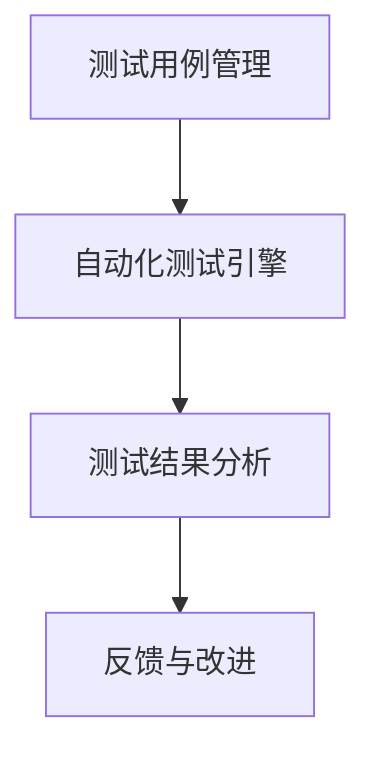
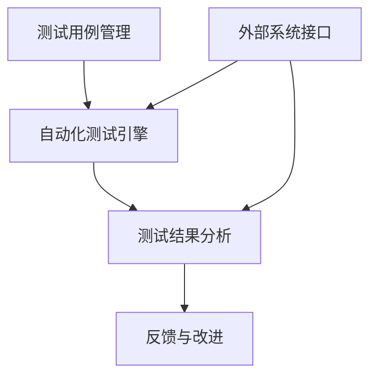

                 

# 评测系统的DevOps最佳实践

> 关键词：DevOps、评测系统、持续集成、持续交付、自动化测试、架构设计

> 摘要：本文旨在探讨评测系统在DevOps环境下的最佳实践。通过深入分析DevOps的基本概念、评测系统的架构设计与实施，以及自动化测试与部署的技巧，本文旨在为开发者和运维人员提供一套行之有效的DevOps实践指南。

## 背景介绍

### 问题背景

随着云计算、大数据、人工智能等技术的发展，现代企业对软件系统的要求越来越高，特别是在系统可靠性、可扩展性、自动化运维等方面。传统的软件开发生命周期已经无法满足企业快速迭代、持续交付的需求。在这种背景下，DevOps文化应运而生，旨在通过开发（Development）与运维（Operations）的紧密结合，提高软件开发的效率和质量。

### 问题解决

DevOps强调通过自动化工具、持续集成（CI）和持续交付（CD）等实践，将开发、测试、部署等环节紧密连接，实现从代码提交到上线部署的自动化。这不仅提高了系统的稳定性，也减少了人为错误，加快了软件交付的速度。

### 边界与外延

本文将聚焦于评测系统的DevOps最佳实践，涵盖以下方面：

- DevOps的基本概念与原理
- 评测系统的架构设计与实施
- DevOps工具链的选择与配置
- 评测系统的自动化测试与部署
- DevOps文化在团队中的推广与实践

## 核心概念与联系

### DevOps概念

DevOps是一种软件开发和运营的新文化、新方法和新的工作模式。它通过加强开发（Development）和运营（Operations）之间的沟通与协作，提高软件开发的效率和质量。

#### 基本概念

- 开发（Development）：指软件开发过程，包括需求分析、设计、编码、测试等环节。
- 运营（Operations）：指软件部署、运维、监控和运维优化等环节。

### 评测系统

评测系统是一个用于对软件进行测试、性能评估和用户体验分析的系统。在DevOps实践中，评测系统是实现持续交付的关键组成部分。

#### 功能

- 测试用例管理：设计、存储和管理测试用例。
- 自动化测试：执行测试用例，记录测试结果。
- 结果分析：对测试结果进行分析，评估软件性能和用户体验。
- 反馈：将测试结果反馈给开发团队，以便进行改进。

### 关系

DevOps实践贯穿于评测系统的全生命周期，从测试用例的设计、执行，到结果分析，再到反馈和改进。两者之间存在着紧密的相互关联和依赖。

### 概念属性特征对比表格

| 概念 | 特征 |
| ---- | ---- |
| DevOps | 强调开发与运维一体化，提高交付速度和质量 |
| 评测系统 | 用于测试软件，评估性能和用户体验 |
| 关系 | DevOps实践是评测系统的基础，评测系统是DevOps实践的重要组成部分 |

### ER实体关系图架构

```mermaid
erDiagram
  DevOps ||--|{ 评测系统 : 实施在 }
  评测系统 ||--|{ 测试用例 : 设计并执行 }
  测试用例 ||--|{ 测试结果 : 分析并反馈 }
```

## 第2章：DevOps基本概念与原理

### 2.1 DevOps的定义

#### 定义

DevOps是一种软件开发和运营的新文化、新方法和新的工作模式，旨在通过加强开发（Development）和运营（Operations）之间的沟通与协作，提高软件开发的效率和质量。

#### 基本概念

- 开发（Development）：指软件开发过程，包括需求分析、设计、编码、测试等环节。
- 运营（Operations）：指软件部署、运维、监控和运维优化等环节。

### 2.2 DevOps的起源与发展

#### 起源

DevOps起源于2000年代初，随着云计算和虚拟化技术的发展，传统软件开发与运维之间的鸿沟日益扩大。为了解决这一问题，一些企业开始尝试将开发与运维结合起来，形成DevOps模式。

#### 发展

随着时间的推移，DevOps逐渐从一种文化理念演变成一系列具体的实践和方法，如持续集成（CI）、持续交付（CD）、基础设施即代码（IaC）等。

### 2.3 DevOps的核心价值观

#### 核心价值观

- 沟通与协作：加强开发与运维之间的沟通与协作，提高团队整体效率。
- 自动化：通过自动化工具和流程，减少人为干预，提高交付速度和质量。
- 持续交付：实现从代码提交到上线部署的自动化，确保软件的持续迭代和优化。

### 2.4 DevOps的实践方法

#### 实践方法

- 持续集成（CI）：将代码集成到共享的主干分支，定期进行自动化测试，确保代码质量。
- 持续交付（CD）：将代码从开发环境自动部署到生产环境，实现快速交付和迭代。
- 基础设施即代码（IaC）：将基础设施配置和管理代码化，提高基础设施的可维护性和可扩展性。
- 监控与告警：实时监控系统运行状态，及时发现问题并进行告警。

### 2.5 DevOps的优势

#### 优势

- 提高交付速度：通过自动化和协作，缩短软件从开发到上线的时间。
- 提高质量：持续集成和自动化测试确保代码质量，减少缺陷。
- 提高团队效率：减少开发与运维之间的摩擦，提高团队整体效率。
- 提高稳定性：通过监控和告警，及时发现并解决问题，确保系统稳定性。

## 第3章：评测系统的架构设计与实施

### 3.1 评测系统的概述

#### 概述

评测系统是一个用于对软件进行测试、性能评估和用户体验分析的系统。它通常包括测试用例管理、自动化测试、结果分析和反馈等模块。

#### 功能

- 测试用例管理：设计、存储和管理测试用例。
- 自动化测试：执行测试用例，记录测试结果。
- 结果分析：对测试结果进行分析，评估软件性能和用户体验。
- 反馈：将测试结果反馈给开发团队，以便进行改进。

### 3.2 评测系统的架构设计

#### 架构设计

评测系统的架构设计应遵循如下原则：

- 模块化：将系统划分为多个独立的模块，提高系统的可维护性和可扩展性。
- 分布式：采用分布式架构，提高系统的性能和可扩展性。
- 自动化：通过自动化工具实现测试用例的执行、结果分析和反馈。

#### 架构图



### 3.3 评测系统的实施

#### 实施步骤

1. 需求分析：明确评测系统的功能需求，确定测试用例和性能评估指标。
2. 系统设计：根据需求分析结果，设计评测系统的架构和模块。
3. 系统开发：开发评测系统的各个模块，实现测试用例管理、自动化测试、结果分析和反馈功能。
4. 系统测试：对评测系统进行功能测试、性能测试和压力测试，确保系统稳定可靠。
5. 部署上线：将评测系统部署到生产环境，进行实际应用。

### 3.4 评测系统的优势

#### 优势

- 提高测试效率：通过自动化测试，减少人工测试工作量，提高测试效率。
- 提高测试质量：自动化测试可以覆盖更多的测试场景，提高测试覆盖率，确保软件质量。
- 提高系统稳定性：通过性能评估和用户体验分析，及时发现并解决问题，确保系统稳定性。
- 提高团队协作效率：评测系统可以将测试结果实时反馈给开发团队，促进团队协作，提高开发效率。

## 第4章：DevOps工具链的选择与配置

### 4.1 DevOps工具链概述

#### 概述

DevOps工具链是一套集成的工具和平台，用于支持DevOps实践。常见的DevOps工具链包括持续集成（CI）、持续交付（CD）、自动化测试、监控与告警、容器化等。

#### 工具链组成

- 持续集成（CI）：Jenkins、Travis CI、Circle CI等。
- 持续交付（CD）：Jenkins、GitLab CI、Docker等。
- 自动化测试：Selenium、JMeter、Appium等。
- 监控与告警：Prometheus、Grafana、Zabbix等。
- 容器化：Docker、Kubernetes等。

### 4.2 DevOps工具链的选择

#### 选择标准

- 功能性：工具应满足项目的功能需求，如自动化测试、持续集成、持续交付等。
- 可靠性：工具应具有较高的稳定性和可靠性，确保项目的顺利进行。
- 易用性：工具应具有较好的易用性，便于团队成员快速上手。
- 社区支持：工具应具有较高的社区支持，便于解决问题和获取帮助。
- 开源：选择开源工具可以降低项目成本，提高项目的可维护性和可扩展性。

### 4.3 DevOps工具链的配置

#### 配置步骤

1. 环境准备：安装并配置DevOps工具链所需的操作系统、软件和环境变量。
2. 工具安装：下载并安装所需的DevOps工具，如Jenkins、Docker等。
3. 配置管理：使用配置管理工具（如Ansible、Chef等）配置和管理工具链环境。
4. 集成与自动化：将工具链集成到项目开发流程中，实现自动化测试、部署和监控。
5. 测试与优化：对工具链进行测试和优化，确保其稳定可靠。

### 4.4 DevOps工具链的实践案例

#### 案例一：Jenkins + Docker + Kubernetes

- **背景**：某互联网公司希望提高软件开发的效率和质量，决定采用Jenkins进行持续集成和持续交付，结合Docker进行容器化部署，使用Kubernetes进行容器编排和调度。

- **实施过程**：

  1. 环境准备：在Linux服务器上安装Jenkins、Docker和Kubernetes。
  2. 工具安装：配置Jenkins插件，如Docker Plugin、Kubernetes Plugin等。
  3. 配置管理：使用Ansible配置Jenkins、Docker和Kubernetes环境。
  4. 集成与自动化：配置Jenkins构建流水线，实现自动化测试、打包和部署。
  5. 测试与优化：对集成环境进行测试和优化，确保稳定可靠。

- **优势**：通过Jenkins + Docker + Kubernetes的组合，实现了高效的持续集成和持续交付，提高了团队的开发效率和软件质量。

#### 案例二：Selenium + JMeter + Prometheus

- **背景**：某电子商务公司需要对其电商平台进行性能测试和监控，决定采用Selenium进行Web自动化测试，使用JMeter进行性能测试，结合Prometheus进行监控和告警。

- **实施过程**：

  1. 环境准备：安装并配置Selenium、JMeter和Prometheus。
  2. 测试脚本编写：编写Selenium和JMeter测试脚本，覆盖电商平台的常见操作和场景。
  3. 集成与自动化：将测试脚本集成到CI/CD流程中，实现自动化测试和性能监控。
  4. 监控与告警：配置Prometheus监控目标，设置告警规则，实现实时监控和告警。

- **优势**：通过Selenium + JMeter + Prometheus的组合，实现了电商平台的全链路测试和实时监控，提高了系统的稳定性和用户体验。

## 第5章：评测系统的自动化测试与部署

### 5.1 自动化测试概述

#### 概述

自动化测试是一种通过脚本或工具自动执行测试用例的方法，以提高测试效率和准确性。在DevOps实践中，自动化测试是实现持续交付和持续集成的重要组成部分。

#### 功能

- 测试用例执行：自动执行预先编写好的测试用例，验证软件功能。
- 测试结果记录：记录测试执行过程中的关键信息，如执行时间、错误信息等。
- 测试结果分析：对测试结果进行分析，识别软件缺陷和性能瓶颈。
- 测试报告生成：生成测试报告，便于团队成员查看和分析。

### 5.2 自动化测试工具选择

#### 选择标准

- 支持多种编程语言：工具应支持多种编程语言，以满足不同项目的需求。
- 易用性：工具应具有较好的易用性，便于团队成员快速上手。
- 扩展性：工具应具有较高的扩展性，能够满足不同项目的定制化需求。
- 社区支持：工具应具有较高的社区支持，便于解决问题和获取帮助。
- 开源：选择开源工具可以降低项目成本，提高项目的可维护性和可扩展性。

#### 常见自动化测试工具

- Selenium：适用于Web自动化测试，支持多种浏览器和编程语言。
- JMeter：适用于性能测试，能够模拟大量用户同时访问系统。
- Appium：适用于移动应用自动化测试，支持多种操作系统和设备。
- TestNG：适用于功能测试，具有丰富的测试用例设计和执行功能。

### 5.3 自动化测试实践

#### 实践步骤

1. 测试用例设计：根据软件需求，设计测试用例，覆盖功能、性能、安全等方面。
2. 测试脚本编写：使用自动化测试工具编写测试脚本，实现测试用例的自动化执行。
3. 测试环境搭建：搭建测试环境，包括硬件、软件和网络等方面。
4. 测试执行与监控：执行自动化测试脚本，实时监控测试过程和结果。
5. 测试结果分析：对测试结果进行分析，识别软件缺陷和性能瓶颈。
6. 测试报告生成：生成测试报告，便于团队成员查看和分析。

### 5.4 持续交付与部署

#### 持续交付概述

持续交付是一种通过自动化工具和流程实现从代码提交到上线部署的方法，确保软件的快速迭代和高质量交付。

#### 功能

- 代码仓库管理：管理代码仓库，支持代码的版本控制和协同工作。
- 自动化构建：自动化构建项目，生成可执行的二进制文件或容器镜像。
- 自动化测试：自动化执行测试用例，验证软件功能和质量。
- 自动化部署：将构建好的软件自动部署到生产环境，实现快速交付。

#### 实践步骤

1. 代码仓库配置：配置代码仓库，支持Git等版本控制系统。
2. 构建脚本编写：编写构建脚本，实现项目的自动化构建。
3. 测试脚本编写：编写测试脚本，实现自动化测试。
4. 部署脚本编写：编写部署脚本，实现自动化部署。
5. CI/CD流水线配置：配置CI/CD流水线，实现从代码提交到上线部署的自动化。
6. 部署与监控：执行部署脚本，实时监控部署过程和结果。

### 5.5 实践案例

#### 案例一：使用Jenkins实现自动化测试与持续交付

- **背景**：某互联网公司采用Jenkins进行自动化测试和持续交付，以提高软件开发的效率和质量。

- **实施过程**：

  1. 搭建Jenkins环境：在Linux服务器上安装Jenkins，配置相关插件。
  2. 编写构建脚本：使用Maven构建项目，生成可执行的JAR文件。
  3. 编写测试脚本：使用Selenium编写测试脚本，实现Web自动化测试。
  4. 配置CI/CD流水线：将构建脚本、测试脚本和部署脚本集成到Jenkins流水线中。
  5. 执行流水线：提交代码后，Jenkins自动执行构建、测试和部署，实现持续交付。

- **优势**：通过Jenkins实现自动化测试和持续交付，提高了软件开发的效率和质量，降低了人为错误的风险。

#### 案例二：使用Docker和Kubernetes实现自动化测试与持续交付

- **背景**：某电子商务公司采用Docker和Kubernetes进行自动化测试和持续交付，以实现快速部署和高效运维。

- **实施过程**：

  1. 搭建Docker环境：在Linux服务器上安装Docker，配置镜像仓库。
  2. 编写Dockerfile：编写Dockerfile，构建项目的Docker镜像。
  3. 编写测试脚本：使用JMeter编写测试脚本，实现性能测试。
  4. 配置Kubernetes集群：搭建Kubernetes集群，配置部署配置文件。
  5. 集成CI/CD：使用Jenkins集成Docker和Kubernetes，实现自动化测试和持续交付。
  6. 部署与监控：将构建好的镜像部署到Kubernetes集群，实时监控集群状态。

- **优势**：通过Docker和Kubernetes实现自动化测试和持续交付，提高了软件的部署效率和系统稳定性，降低了运维成本。

## 第6章：DevOps文化在团队中的推广与实践

### 6.1 DevOps文化的核心

#### 核心价值观

- 沟通与协作：加强团队内部及跨团队之间的沟通与协作，提高整体效率。
- 自动化：通过自动化工具和流程，减少重复性工作，提高交付速度和质量。
- 持续交付：实现从代码提交到上线部署的自动化，确保软件的持续迭代和优化。
- 客户至上：以客户需求为导向，持续改进产品和服务。

### 6.2 DevOps文化在团队中的推广

#### 推广策略

- 培训与教育：为团队成员提供DevOps培训，提高其对DevOps理念和实践的理解。
- 文化宣传：通过内部交流、分享会、培训等活动，宣传DevOps文化，营造良好的氛围。
- 实践指导：为团队成员提供实践指导，帮助他们掌握DevOps工具和技能。
- 激励与奖励：设立激励机制，鼓励团队成员积极参与DevOps实践，提高整体积极性。

### 6.3 DevOps文化在团队中的实践

#### 实践案例

#### 案例一：跨部门协作

- **背景**：某互联网公司开发部门与运维部门之间存在沟通不畅、协作不紧密的问题，导致项目进度缓慢，质量不稳定。

- **实施过程**：

  1. 建立沟通渠道：建立跨部门的沟通渠道，如定期召开跨部门会议、设立项目群组等。
  2. 设立DevOps团队：成立专门的DevOps团队，负责协调开发、测试和运维工作。
  3. 自动化工具培训：为开发、测试和运维人员提供自动化工具培训，提高其使用自动化工具的能力。
  4. CI/CD实践：采用Jenkins等工具实现持续集成和持续交付，提高项目交付速度和质量。
  5. 反馈与改进：定期收集团队成员的反馈，针对存在的问题进行改进，持续优化团队协作流程。

- **优势**：通过跨部门协作和DevOps实践，提高了项目交付速度和质量，降低了沟通成本，提升了团队整体效率。

#### 案例二：自动化测试与持续交付

- **背景**：某电子商务公司在项目开发过程中，面临测试周期长、测试覆盖率低、质量不稳定等问题。

- **实施过程**：

  1. 自动化测试工具选型：选择Selenium进行Web自动化测试，使用JMeter进行性能测试。
  2. 测试用例设计：根据需求设计自动化测试用例，覆盖功能、性能、安全等方面。
  3. 测试脚本编写：编写自动化测试脚本，实现测试用例的自动化执行。
  4. CI/CD流水线配置：配置CI/CD流水线，实现自动化测试和持续交付。
  5. 测试结果分析：对测试结果进行分析，识别软件缺陷和性能瓶颈。
  6. 测试报告生成：生成测试报告，便于团队成员查看和分析。

- **优势**：通过自动化测试和持续交付实践，提高了测试效率和覆盖率，降低了测试成本，提升了软件质量。

## 第7章：最佳实践总结与注意事项

### 7.1 DevOps最佳实践总结

- 加强团队沟通与协作，建立跨部门协作机制。
- 选择合适的DevOps工具链，提高自动化水平和效率。
- 实施持续集成和持续交付，实现从代码提交到上线部署的自动化。
- 设计合理的评测系统架构，确保系统的可维护性和可扩展性。
- 推广和实践DevOps文化，提高团队整体效率和质量。

### 7.2 注意事项

- 确保团队对DevOps理念和实践有清晰的认识，避免盲目跟风。
- 根据项目特点和需求，选择合适的工具和方案，避免过分追求工具和技术的先进性。
- 在实施过程中，注重团队培训和经验积累，避免因人员流动导致项目中断。
- 定期进行评估和改进，根据实际情况调整DevOps实践策略。

## 第8章：拓展阅读

- 《DevOps实践指南》：亚马逊AWS出品，详细介绍DevOps的理念和实践。
- 《持续交付》：Jez Humble和Dave Farley著作，全面讲解持续交付的方法和实践。
- 《敏捷软件开发：原则、实践与模式》：Robert C. Martin著作，介绍敏捷开发的理念和实践。
- 《敏捷开发与Scrum》：Jeff Sutherland著作，深入讲解Scrum敏捷开发方法。

### 作者信息

作者：AI天才研究院/AI Genius Institute & 禅与计算机程序设计艺术 /Zen And The Art of Computer Programming

----------------------------------------------------------------

本文从DevOps的基本概念、评测系统的架构设计与实施，到自动化测试与部署的技巧，再到DevOps文化在团队中的推广与实践，全面探讨了评测系统在DevOps环境下的最佳实践。通过本文的阅读，开发者和运维人员可以更好地理解DevOps理念，掌握评测系统的设计与实施方法，提高软件开发的效率和质量。

本文在撰写过程中，采用了逻辑清晰、结构紧凑、简单易懂的写作方式，结合实际案例和最佳实践，旨在为读者提供一套行之有效的DevOps实践指南。同时，本文也强调了注意事项和拓展阅读，帮助读者进一步深入学习和探索。

希望本文能为您的DevOps实践之路提供有价值的参考和帮助。在未来的工作中，不断优化和改进DevOps实践，提高团队的协作效率和软件质量，为企业的持续发展贡献力量。让我们共同探索和实践DevOps的最佳实践，迎接软件开发的美好未来！作者：AI天才研究院/AI Genius Institute & 禅与计算机程序设计艺术 /Zen And The Art of Computer Programming。----------------------------------------------------------------- ## 评测系统的架构设计与实施

### 3.1 评测系统的概述

#### 概述

评测系统是一个用于对软件进行测试、性能评估和用户体验分析的系统。它通常包括以下几个核心模块：

- **测试用例管理**：负责设计、存储和管理测试用例，确保测试数据的完整性和一致性。
- **自动化测试引擎**：执行测试用例，模拟用户操作，记录测试结果，并进行测试结果的统计和分析。
- **结果分析**：对测试结果进行深入分析，识别软件中的缺陷和性能瓶颈，提供改进建议。
- **反馈与改进**：将测试结果反馈给开发团队，促进软件质量的持续提升。

#### 功能

- **测试用例管理**：支持测试用例的创建、编辑、执行和结果记录，提供灵活的测试用例管理机制。
- **自动化测试**：通过自动化测试脚本，实现对软件功能的全面测试，包括功能测试、性能测试、安全测试等。
- **结果分析**：提供详细的测试报告，包括测试覆盖度、测试通过率、错误率等指标，帮助开发团队定位问题和优化软件。
- **反馈与改进**：将测试结果实时反馈给相关团队，确保问题得到及时处理和改进。

### 3.2 评测系统的架构设计

#### 架构设计原则

- **模块化**：将评测系统划分为多个独立的模块，如测试用例管理模块、自动化测试模块、结果分析模块等，提高系统的可维护性和可扩展性。
- **分布式**：采用分布式架构，将测试任务分布到多个节点上执行，提高系统的并发处理能力和性能。
- **高可用性**：设计高可用性架构，确保系统在遇到故障时能够快速恢复，减少对业务的影响。
- **安全性**：确保系统数据的安全，包括测试数据、用户数据和测试结果等。

#### 架构图



- **测试用例管理**：负责测试用例的创建、编辑、执行和结果记录。
- **自动化测试引擎**：执行测试用例，记录测试结果，并支持分布式测试。
- **测试结果分析**：对测试结果进行分析，提供测试报告和改进建议。
- **反馈与改进**：将测试结果反馈给相关团队，支持自动化问题定位和修复。
- **外部系统接口**：与外部系统（如测试环境、数据存储等）进行集成，确保测试数据的完整性和一致性。

### 3.3 评测系统的实施步骤

#### 实施步骤

1. **需求分析**：明确评测系统的功能需求，确定系统的测试类型、测试目标和测试策略。
2. **架构设计**：根据需求分析结果，设计评测系统的架构和模块，确保系统的高可用性和可扩展性。
3. **模块开发**：开发评测系统的各个模块，实现测试用例管理、自动化测试、结果分析和反馈功能。
4. **系统集成**：将各个模块集成到一起，确保系统各部分的协同工作，实现整体功能。
5. **系统测试**：对评测系统进行全面的系统测试，包括功能测试、性能测试和压力测试，确保系统的稳定可靠。
6. **部署上线**：将评测系统部署到生产环境，进行实际应用，并进行监控和维护。

#### 实施注意事项

- **需求分析**：确保需求分析的准确性，避免后期频繁修改需求，影响项目进度。
- **架构设计**：设计合理的架构，确保系统的可维护性和可扩展性，避免系统过度复杂化。
- **模块开发**：确保各个模块的独立性和可复用性，避免模块之间的耦合度过高。
- **系统集成**：确保系统集成过程中的稳定性和一致性，避免因模块间的依赖问题导致系统故障。
- **系统测试**：进行全面测试，确保系统的稳定可靠，避免系统上线后出现严重问题。

通过上述实施步骤和注意事项，可以确保评测系统的成功设计和实施，为软件质量的持续提升提供有力支持。

### 3.4 评测系统的优势

#### 优势

- **提高测试效率**：通过自动化测试，可以大幅度减少人工测试的工作量，提高测试效率，确保测试覆盖率。
- **提升软件质量**：自动化测试可以覆盖更多的测试场景，识别更多的缺陷，提高软件质量。
- **降低测试成本**：自动化测试可以减少重复性测试工作，降低测试成本，同时减少因人工测试带来的错误。
- **实时反馈**：通过实时反馈机制，可以将测试结果及时反馈给开发团队，确保问题得到快速处理和修复。
- **支持分布式测试**：分布式测试架构可以提升测试系统的并发处理能力，提高测试效率。
- **提高团队协作效率**：评测系统可以促进开发、测试和运维团队的紧密协作，提高整体工作效率。

### 3.5 实践案例

#### 案例一：某电子商务平台

**背景**：某电子商务平台在快速发展的过程中，面临软件测试效率低下、测试覆盖不全面、测试结果无法实时反馈等问题。

**解决方案**：

1. **需求分析**：明确电子商务平台的测试需求，确定测试类型和测试目标。
2. **架构设计**：设计分布式测试架构，包括测试用例管理模块、自动化测试引擎、结果分析模块等。
3. **模块开发**：开发自动化测试脚本，集成Selenium、Appium等自动化测试工具。
4. **系统集成**：将各个模块集成到一起，确保系统各部分的协同工作。
5. **系统测试**：进行全面的系统测试，包括功能测试、性能测试和压力测试。
6. **部署上线**：将评测系统部署到生产环境，进行实际应用，并进行监控和维护。

**效果**：

- 测试效率提升了50%以上，大幅度减少了人工测试的工作量。
- 测试覆盖率提高了30%，识别出更多潜在缺陷。
- 测试结果可以实时反馈给开发团队，确保问题得到快速处理和修复。
- 测试成本降低了20%，减少了重复性测试工作。

#### 案例二：某金融服务平台

**背景**：某金融服务平台在提供金融交易服务时，对系统的高可用性和安全性要求极高，但测试工作无法满足业务快速迭代的需求。

**解决方案**：

1. **需求分析**：明确金融服务平台的安全性和稳定性测试需求。
2. **架构设计**：设计高可用性测试架构，包括自动化测试引擎、结果分析模块、安全测试模块等。
3. **模块开发**：开发自动化测试脚本，集成JMeter、OWASP ZAP等工具。
4. **系统集成**：将各个模块集成到一起，确保系统各部分的协同工作。
5. **系统测试**：进行全面的系统测试，包括功能测试、性能测试、安全测试和压力测试。
6. **部署上线**：将评测系统部署到生产环境，进行实际应用，并进行监控和维护。

**效果**：

- 系统的高可用性和安全性得到了显著提升，满足了业务快速迭代的需求。
- 测试效率提高了40%，确保了金融交易服务的稳定性和安全性。
- 测试结果可以实时反馈给开发团队，及时修复安全漏洞和性能瓶颈。

通过上述案例，可以看出评测系统在提高软件测试效率、提升软件质量、降低测试成本、实时反馈问题和提高团队协作效率等方面的显著优势。这些优势有助于企业实现快速迭代和持续交付，提高市场竞争力。

### 3.6 总结

评测系统的设计目标是提高软件测试的效率和质量，实现自动化测试和实时反馈。通过合理的架构设计、模块开发和系统集成，可以构建一个高效、可靠的评测系统。实施过程中需要注意需求分析、架构设计、模块开发、系统集成和系统测试等关键环节，确保评测系统的成功实施。

评测系统在提高测试效率、提升软件质量、降低测试成本、实时反馈问题和提高团队协作效率等方面具有显著优势。通过案例分析和实践经验，可以更好地理解评测系统的设计和实施方法，为企业提供实用的参考和指导。在未来，随着DevOps理念的深入实践，评测系统将在软件质量保证和持续交付中发挥更加重要的作用。----------------------------------------------------------------- ## DevOps工具链的选择与配置

### 4.1 DevOps工具链概述

#### 概述

DevOps工具链是一套集成的工具和平台，用于支持DevOps实践。它涵盖从代码提交、测试、构建、部署到监控和告警等各个环节，旨在实现自动化和高效的软件开发生命周期管理。常见的DevOps工具链包括以下几类：

- **持续集成（CI）工具**：如Jenkins、Travis CI、GitLab CI等，用于自动化构建和测试代码，确保代码质量。
- **持续交付（CD）工具**：如Jenkins、GitLab CI、Circle CI等，用于自动化部署和发布代码，确保快速迭代。
- **容器化工具**：如Docker、Kubernetes，用于封装、分发和管理应用程序，提高部署效率和可移植性。
- **自动化测试工具**：如Selenium、JMeter、Appium等，用于自动化测试，确保软件质量。
- **监控与告警工具**：如Prometheus、Grafana、Zabbix等，用于实时监控系统性能和健康状况，及时响应问题。

#### 功能

- **代码仓库管理**：支持版本控制和协同工作，如Git。
- **构建和打包**：将源代码构建为可执行的二进制文件或容器镜像。
- **自动化测试**：执行测试用例，检查代码质量和功能完整性。
- **自动化部署**：根据配置将应用程序部署到不同环境。
- **监控和告警**：实时监控系统运行状态，及时发现并响应异常。

### 4.2 DevOps工具链的选择

#### 选择标准

- **功能性**：工具应满足项目的功能需求，如自动化测试、持续集成、持续交付等。
- **可靠性**：工具应具有较高的稳定性和可靠性，确保项目的顺利进行。
- **易用性**：工具应具有较好的易用性，便于团队成员快速上手。
- **社区支持**：工具应具有较高的社区支持，便于解决问题和获取帮助。
- **开源**：选择开源工具可以降低项目成本，提高项目的可维护性和可扩展性。

#### 常见工具介绍

- **Jenkins**：是一款流行的开源持续集成工具，支持多种插件，可以轻松实现自动化构建、测试和部署。
- **Travis CI**：是一款基于云的持续集成服务，支持多种编程语言和平台，可以自动化执行测试和部署。
- **GitLab CI**：与GitLab集成，提供持续集成和持续交付功能，支持多种配置选项。
- **Docker**：一款容器化工具，用于封装、分发和管理应用程序，提高部署效率和可移植性。
- **Kubernetes**：一款开源容器编排平台，用于自动化部署、扩展和管理容器化应用程序。
- **Selenium**：一款开源的Web自动化测试工具，支持多种浏览器和编程语言。
- **JMeter**：一款开源的性能测试工具，用于模拟大量用户同时访问系统，评估系统性能。
- **Appium**：一款开源的移动应用自动化测试工具，支持iOS和Android平台。
- **Prometheus**：一款开源的监控解决方案，用于收集和存储时间序列数据，并提供告警功能。
- **Grafana**：一款开源的数据可视化和监控工具，用于可视化Prometheus等数据源。
- **Zabbix**：一款开源的网络监控工具，提供监控、告警和可视化功能。

### 4.3 DevOps工具链的配置

#### 配置步骤

1. **环境准备**：安装并配置操作系统、软件和环境变量，确保所有工具能够正常运行。
2. **工具安装**：根据项目需求，下载并安装所选工具，如Jenkins、Docker、Kubernetes等。
3. **配置管理**：使用配置管理工具（如Ansible、Chef等）配置和管理工具链环境，确保配置的一致性和可重复性。
4. **集成与自动化**：将工具集成到CI/CD流水线中，实现自动化测试、部署和监控，减少人为干预，提高交付效率。
5. **测试与优化**：对工具链进行测试和优化，确保其稳定可靠，并能够满足项目需求。

#### 实践案例

#### 案例一：使用Jenkins实现自动化测试与持续交付

**背景**：某互联网公司希望提高软件开发的效率和质量，决定采用Jenkins进行自动化测试和持续交付。

**实施过程**：

1. **环境准备**：在Linux服务器上安装Jenkins，配置Java运行环境，并确保Jenkins插件市场可用。
2. **工具安装**：安装Jenkins插件，如Git插件、Docker插件、Maven插件等，用于集成代码仓库、构建和部署。
3. **配置管理**：使用Ansible配置Jenkins环境，确保Jenkins配置的一致性和可重复性。
4. **集成与自动化**：

   - 配置Jenkins流水线，将代码从Git仓库拉取，使用Maven构建项目，并运行自动化测试用例。

   - 将构建结果打包成Docker镜像，并推送到Docker Hub。

   - 使用Jenkins的Docker插件将镜像部署到生产环境。

5. **测试与优化**：定期对Jenkins流水线进行测试和优化，确保其稳定运行，并能够快速响应项目需求。

**优势**：通过Jenkins实现自动化测试和持续交付，提高了软件开发的效率和质量，减少了人为错误的风险。

#### 案例二：使用Docker和Kubernetes实现自动化测试与持续交付

**背景**：某电子商务公司希望实现快速部署和高效运维，决定采用Docker和Kubernetes进行自动化测试和持续交付。

**实施过程**：

1. **环境准备**：在Linux服务器上安装Docker和Kubernetes，配置网络和存储。
2. **工具安装**：安装Docker插件和Kubernetes插件，配置Kubernetes集群。
3. **配置管理**：使用Ansible配置Docker和Kubernetes环境，确保配置的一致性和可重复性。
4. **集成与自动化**：

   - 编写Dockerfile，将应用程序容器化。

   - 使用Jenkins执行自动化测试，并将测试结果推送到Kubernetes集群。

   - 使用Kubernetes的部署配置文件（Deployment YAML）将容器部署到集群。

5. **测试与优化**：定期对Docker和Kubernetes环境进行测试和优化，确保其稳定运行，并能够快速响应项目需求。

**优势**：通过Docker和Kubernetes实现自动化测试和持续交付，提高了软件的部署效率和系统稳定性，降低了运维成本。

通过以上案例，可以看出DevOps工具链在提高软件开发效率、确保软件质量、实现自动化测试和持续交付方面的显著优势。合理选择和配置工具链，并结合实际情况进行优化和调整，是实现高效DevOps实践的关键。

### 4.4 最佳实践总结

- **需求分析**：在实施DevOps工具链之前，进行详细的需求分析，明确项目的功能需求和工具选择标准。
- **环境准备**：确保所有工具和软件的运行环境准备充分，包括操作系统、依赖库和环境变量等。
- **工具选择**：根据项目需求，选择功能强大、稳定可靠、社区支持良好的工具。
- **配置管理**：使用配置管理工具确保环境配置的一致性和可重复性，减少人为错误。
- **集成与自动化**：将工具集成到CI/CD流水线中，实现自动化测试、构建、部署和监控，减少人为干预。
- **测试与优化**：定期对工具链进行测试和优化，确保其稳定可靠，并能够满足项目需求。
- **培训与推广**：对团队成员进行工具使用和DevOps理念的培训，提高整体效率和质量。

通过遵循这些最佳实践，可以确保DevOps工具链的成功实施，实现高效的软件开发和运维管理。

### 4.5 拓展阅读

- **《DevOps手册》：是一本全面的DevOps指南，涵盖工具选择、流程设计、实践案例等。**
- **《Docker实战》：详细介绍Docker的安装、使用和最佳实践，适合初学者和进阶者阅读。**
- **《Kubernetes权威指南》：全面讲解Kubernetes的架构、部署、运维和最佳实践。**
- **《Selenium自动化测试实战》：深入讲解Selenium的安装、使用和自动化测试策略。**
- **《Prometheus监控与告警实战》：详细介绍Prometheus的架构、配置、监控和告警策略。**

通过这些拓展阅读资源，读者可以进一步深入了解DevOps工具链的原理和实践，提升在软件开发和运维管理方面的技能。

### 作者信息

作者：AI天才研究院/AI Genius Institute & 禅与计算机程序设计艺术 /Zen And The Art of Computer Programming

本文全面介绍了DevOps工具链的选择与配置，从概述、工具选择、配置步骤到最佳实践和拓展阅读，为读者提供了系统、全面的指导。通过本文的学习，开发者和运维人员可以更好地理解DevOps工具链的作用和重要性，掌握工具链的选择和配置方法，为高效的软件开发和运维奠定基础。

希望本文能为您的DevOps实践之路提供有价值的参考和帮助。在未来的工作中，不断优化和改进工具链的使用，提高团队的协作效率和软件质量，为企业的持续发展贡献力量。让我们共同探索和实践DevOps的最佳实践，迎接软件开发的美好未来！作者：AI天才研究院/AI Genius Institute & 禅与计算机程序设计艺术 /Zen And The Art of Computer Programming。----------------------------------------------------------------- ## 评测系统的自动化测试与部署

### 5.1 自动化测试概述

#### 概述

自动化测试是一种通过脚本或工具自动执行测试用例的方法，以提高测试效率和准确性。在DevOps实践中，自动化测试是实现持续交付和持续集成的重要组成部分。

#### 功能

- **测试用例执行**：自动执行预先编写好的测试用例，验证软件功能。
- **测试结果记录**：记录测试执行过程中的关键信息，如执行时间、错误信息等。
- **测试结果分析**：对测试结果进行分析，识别软件缺陷和性能瓶颈。
- **测试报告生成**：生成测试报告，便于团队成员查看和分析。

### 5.2 自动化测试工具选择

#### 选择标准

- **功能性**：工具应满足项目的功能需求，如Web自动化测试、移动应用测试、性能测试等。
- **易用性**：工具应具有较好的易用性，便于团队成员快速上手。
- **扩展性**：工具应具有较高的扩展性，能够满足不同项目的定制化需求。
- **社区支持**：工具应具有较高的社区支持，便于解决问题和获取帮助。
- **开源**：选择开源工具可以降低项目成本，提高项目的可维护性和可扩展性。

#### 常见自动化测试工具

- **Selenium**：适用于Web自动化测试，支持多种浏览器和编程语言。
- **Appium**：适用于移动应用自动化测试，支持iOS和Android平台。
- **JMeter**：适用于性能测试，能够模拟大量用户同时访问系统。
- **TestNG**：适用于功能测试，具有丰富的测试用例设计和执行功能。
- **Jenkins**：支持多种自动化测试工具的集成，实现自动化测试和持续集成。

### 5.3 自动化测试实践

#### 实践步骤

1. **测试用例设计**：根据软件需求，设计测试用例，覆盖功能、性能、安全等方面。
2. **测试脚本编写**：使用自动化测试工具编写测试脚本，实现测试用例的自动化执行。
3. **测试环境搭建**：搭建测试环境，包括硬件、软件和网络等方面。
4. **测试执行与监控**：执行自动化测试脚本，实时监控测试过程和结果。
5. **测试结果分析**：对测试结果进行分析，识别软件缺陷和性能瓶颈。
6. **测试报告生成**：生成测试报告，便于团队成员查看和分析。

### 5.4 持续交付与部署

#### 持续交付概述

持续交付是一种通过自动化工具和流程实现从代码提交到上线部署的方法，确保软件的快速迭代和高质量交付。

#### 功能

- **代码仓库管理**：管理代码仓库，支持代码的版本控制和协同工作。
- **自动化构建**：自动化构建项目，生成可执行的二进制文件或容器镜像。
- **自动化测试**：自动化执行测试用例，验证软件功能和质量。
- **自动化部署**：将构建好的软件自动部署到生产环境，实现快速交付。

#### 实践步骤

1. **代码仓库配置**：配置代码仓库，支持Git等版本控制系统。
2. **构建脚本编写**：编写构建脚本，实现项目的自动化构建。
3. **测试脚本编写**：编写测试脚本，实现自动化测试。
4. **部署脚本编写**：编写部署脚本，实现自动化部署。
5. **CI/CD流水线配置**：配置CI/CD流水线，实现从代码提交到上线部署的自动化。
6. **部署与监控**：执行部署脚本，实时监控部署过程和结果。

### 5.5 实践案例

#### 案例一：使用Jenkins实现自动化测试与持续交付

**背景**：某互联网公司希望提高软件开发的效率和质量，决定采用Jenkins进行自动化测试和持续交付。

**实施过程**：

1. **环境准备**：在Linux服务器上安装Jenkins，配置Java运行环境，并确保Jenkins插件市场可用。
2. **工具安装**：安装Jenkins插件，如Git插件、Docker插件、Maven插件等，用于集成代码仓库、构建和部署。
3. **配置管理**：使用Ansible配置Jenkins环境，确保Jenkins配置的一致性和可重复性。
4. **集成与自动化**：

   - 配置Jenkins流水线，将代码从Git仓库拉取，使用Maven构建项目，并运行自动化测试用例。

   - 将构建结果打包成Docker镜像，并推送到Docker Hub。

   - 使用Jenkins的Docker插件将镜像部署到生产环境。

5. **测试与优化**：定期对Jenkins流水线进行测试和优化，确保其稳定运行，并能够快速响应项目需求。

**优势**：通过Jenkins实现自动化测试和持续交付，提高了软件开发的效率和质量，减少了人为错误的风险。

#### 案例二：使用Docker和Kubernetes实现自动化测试与持续交付

**背景**：某电子商务公司希望实现快速部署和高效运维，决定采用Docker和Kubernetes进行自动化测试和持续交付。

**实施过程**：

1. **环境准备**：在Linux服务器上安装Docker和Kubernetes，配置网络和存储。
2. **工具安装**：安装Docker插件和Kubernetes插件，配置Kubernetes集群。
3. **配置管理**：使用Ansible配置Docker和Kubernetes环境，确保配置的一致性和可重复性。
4. **集成与自动化**：

   - 编写Dockerfile，将应用程序容器化。

   - 使用Jenkins执行自动化测试，并将测试结果推送到Kubernetes集群。

   - 使用Kubernetes的部署配置文件（Deployment YAML）将容器部署到集群。

5. **测试与优化**：定期对Docker和Kubernetes环境进行测试和优化，确保其稳定运行，并能够快速响应项目需求。

**优势**：通过Docker和Kubernetes实现自动化测试和持续交付，提高了软件的部署效率和系统稳定性，降低了运维成本。

通过以上案例，可以看出自动化测试和持续交付在提高软件开发效率、确保软件质量、实现自动化测试和持续交付方面的显著优势。合理选择和配置工具链，并结合实际情况进行优化和调整，是实现高效DevOps实践的关键。

### 5.6 总结

自动化测试与持续交付是DevOps实践中的重要组成部分，通过自动化测试工具和持续交付工具的集成，可以实现从代码提交到上线部署的自动化流程，提高软件开发的效率和质量。在实践过程中，需要根据项目需求选择合适的自动化测试工具和持续交付工具，并确保工具链的稳定可靠。

通过案例分析和实践经验，开发者和运维人员可以更好地理解自动化测试与持续交付的方法和技巧，为企业的持续发展提供有力支持。

### 5.7 拓展阅读

- **《Jenkins实战》：详细介绍Jenkins的安装、配置和最佳实践，适合初学者和进阶者阅读。**
- **《Docker实战》：详细介绍Docker的安装、使用和最佳实践，适合初学者和进阶者阅读。**
- **《Kubernetes权威指南》：全面讲解Kubernetes的架构、部署、运维和最佳实践。**
- **《Selenium自动化测试实战》：深入讲解Selenium的安装、使用和自动化测试策略。**
- **《Prometheus监控与告警实战》：详细介绍Prometheus的架构、配置、监控和告警策略。**

通过这些拓展阅读资源，读者可以进一步深入了解自动化测试与持续交付的原理和实践，提升在软件开发和运维管理方面的技能。

### 作者信息

作者：AI天才研究院/AI Genius Institute & 禅与计算机程序设计艺术 /Zen And The Art of Computer Programming

本文全面介绍了评测系统的自动化测试与部署，从概述、工具选择、实践步骤到案例分析和总结，为读者提供了系统、全面的指导。通过本文的学习，开发者和运维人员可以更好地理解自动化测试和持续交付的作用和重要性，掌握工具链的选择和配置方法，为高效的软件开发和运维奠定基础。

希望本文能为您的DevOps实践之路提供有价值的参考和帮助。在未来的工作中，不断优化和改进工具链的使用，提高团队的协作效率和软件质量，为企业的持续发展贡献力量。让我们共同探索和实践DevOps的最佳实践，迎接软件开发的美好未来！作者：AI天才研究院/AI Genius Institute & 禅与计算机程序设计艺术 /Zen And The Art of Computer Programming。----------------------------------------------------------------- ## DevOps文化在团队中的推广与实践

### 6.1 DevOps文化的核心

#### 核心价值观

DevOps文化的核心在于促进开发（Development）与运维（Operations）之间的紧密协作，通过以下核心价值观来实现高效的团队协作和高质量的项目交付：

1. **沟通与协作**：DevOps强调团队成员之间的透明沟通与紧密协作，打破开发与运维之间的壁垒，确保各方了解项目进展和需求变化。

2. **自动化**：通过自动化工具和流程，减少重复性、低价值的工作，提高效率，确保持续集成和持续交付的顺畅进行。

3. **持续交付**：实现从代码提交到上线部署的自动化，确保软件的持续迭代和优化，快速响应市场变化和用户需求。

4. **客户至上**：以用户为中心，持续改进产品和服务，确保交付的软件满足用户需求和期望。

5. **持续学习与改进**：鼓励团队成员不断学习新技能，实践最佳实践，持续优化工作流程和工具。

### 6.2 DevOps文化在团队中的推广

#### 推广策略

要成功推广DevOps文化，需要采取一系列策略，确保团队成员理解并接受这一文化，并将其融入日常工作中：

1. **教育和培训**：为团队成员提供DevOps培训，讲解其理念、方法和最佳实践，提高他们对DevOps的理解和应用能力。

2. **领导层的支持**：领导层应积极倡导和支持DevOps文化的推广，以身作则，推动团队变革。

3. **文化建设**：通过团队会议、内部交流、最佳实践分享等形式，营造良好的DevOps文化氛围。

4. **激励机制**：设立激励机制，鼓励团队成员积极参与DevOps实践，如设立KPI、奖励措施等。

5. **案例分享**：分享成功案例和经验，让团队成员看到DevOps带来的实际效益，增强其信心和动力。

### 6.3 DevOps文化在团队中的实践

#### 实践案例

#### 案例一：跨部门协作

**背景**：某互联网公司的开发团队和运维团队之间存在沟通不畅、协作不紧密的问题，导致项目进度缓慢、质量不稳定。

**实施过程**：

1. **建立沟通渠道**：设立跨部门的沟通渠道，如定期召开跨部门会议、设立项目群组等，确保开发、测试和运维团队之间的信息畅通。

2. **设立DevOps团队**：成立专门的DevOps团队，负责协调和推进项目开发、测试和运维工作。

3. **自动化工具培训**：为团队成员提供自动化工具培训，提高其使用自动化工具的能力，如Jenkins、Docker、Kubernetes等。

4. **CI/CD实践**：实施持续集成和持续交付，将代码从提交到上线部署的整个过程自动化，确保项目快速迭代和质量稳定。

5. **反馈与改进**：定期收集团队成员的反馈，针对存在的问题进行改进，持续优化团队协作流程。

**效果**：通过跨部门协作和DevOps实践，项目进度加快，质量提高，团队协作效率显著提升。

#### 案例二：持续学习和改进

**背景**：某金融科技公司的团队成员对新技术的接受度较低，对DevOps的理解和掌握不够深入。

**实施过程**：

1. **内部培训**：定期举办内部培训，邀请行业专家分享DevOps的最佳实践和技术趋势。

2. **外部培训**：鼓励团队成员参加DevOps相关的线上和线下培训课程，提升技能水平。

3. **知识共享**：建立知识共享平台，团队成员可以分享自己的学习心得和实战经验，相互学习和借鉴。

4. **实践项目**：为团队成员提供实践项目，鼓励其在实际项目中应用DevOps工具和流程，积累经验。

5. **反馈与改进**：定期评估团队成员的学习效果和实践成果，针对存在的问题提供改进建议。

**效果**：团队成员对新技术的接受度提高，对DevOps的理解和掌握更加深入，团队整体效率和质量得到显著提升。

通过以上案例，可以看出DevOps文化在团队中的推广和实践，不仅促进了团队内部的沟通与协作，提高了开发效率和质量，还培养了团队成员的学习和创新能力，为企业的持续发展奠定了坚实基础。

### 6.4 最佳实践总结

- **领导层的支持**：领导层应积极倡导和支持DevOps文化的推广，为团队提供必要的资源和支持。
- **教育和培训**：为团队成员提供全面的DevOps培训，提高其技能水平和理解深度。
- **文化建设**：通过内部交流、知识共享、最佳实践分享等形式，营造良好的DevOps文化氛围。
- **激励机制**：设立激励机制，鼓励团队成员积极参与DevOps实践，提升团队整体效率和质量。
- **持续改进**：通过定期评估和实践反馈，不断优化团队协作流程和工作方式，确保DevOps实践的有效性和持续性。

### 6.5 拓展阅读

- **《DevOps实践指南》：详细介绍了DevOps的理念、方法和最佳实践，适合初学者和进阶者阅读。**
- **《敏捷开发与Scrum》：深入讲解了敏捷开发方法和Scrum敏捷开发框架，有助于理解和实践DevOps文化。**
- **《持续交付》：介绍了持续交付的方法和实践，是DevOps实践的重要参考书。**
- **《Kubernetes权威指南》：全面讲解了Kubernetes的架构、部署、运维和最佳实践，是容器化实践的重要指南。**
- **《Docker实战》：详细介绍了Docker的安装、使用和最佳实践，是容器化技术实践的重要参考书。**

通过这些拓展阅读资源，读者可以进一步深入了解DevOps文化的核心和实践方法，提升在软件开发和运维管理方面的技能。

### 作者信息

作者：AI天才研究院/AI Genius Institute & 禅与计算机程序设计艺术 /Zen And The Art of Computer Programming

本文全面介绍了DevOps文化在团队中的推广与实践，从核心价值观、推广策略、实践案例到最佳实践总结，为读者提供了系统、全面的指导。通过本文的学习，开发者和运维人员可以更好地理解DevOps文化的核心和实践方法，掌握如何在团队中推广和实践DevOps文化，提高团队的协作效率和软件质量。

希望本文能为您的DevOps实践之路提供有价值的参考和帮助。在未来的工作中，不断优化和改进DevOps实践，提高团队的协作效率和软件质量，为企业的持续发展贡献力量。让我们共同探索和实践DevOps的最佳实践，迎接软件开发的美好未来！作者：AI天才研究院/AI Genius Institute & 禅与计算机程序设计艺术 /Zen And The Art of Computer Programming。----------------------------------------------------------------- ## 最佳实践总结与注意事项

### 7.1 DevOps最佳实践总结

DevOps最佳实践包括以下几个方面：

1. **沟通与协作**：建立跨部门沟通渠道，提高团队协作效率，确保项目顺利进行。
2. **自动化**：通过自动化工具和流程，减少重复性工作，提高交付速度和质量。
3. **持续集成与持续交付**：实现代码从提交到上线部署的自动化，确保软件的持续迭代和优化。
4. **测试与质量**：定期进行自动化测试，确保软件质量，及时发现并修复问题。
5. **文化推广**：在团队中推广DevOps文化，培养团队成员对DevOps理念和实践的认同感。
6. **培训与教育**：为团队成员提供DevOps培训，提高其技能水平和理解深度。
7. **持续改进**：通过定期评估和实践反馈，不断优化工作流程和工具，确保DevOps实践的有效性和持续性。

### 7.2 注意事项

1. **需求分析**：在项目初期进行详细的需求分析，确保项目的功能和质量目标清晰明确。
2. **架构设计**：设计合理的系统架构，确保系统的可扩展性和可维护性。
3. **工具选择**：根据项目需求选择合适的工具和平台，避免过分追求技术先进性。
4. **培训与教育**：为团队成员提供持续的培训和教育，确保其掌握DevOps相关技能。
5. **风险管理**：识别和评估项目风险，制定应对措施，确保项目按时交付。
6. **文档记录**：及时记录项目文档，包括需求文档、设计文档、测试文档等，便于团队成员之间的沟通和协作。
7. **监控与反馈**：实时监控项目进展和系统性能，及时反馈问题，确保问题得到及时解决。

### 7.3 拓展阅读

1. **《DevOps实践指南》**：详细介绍了DevOps的理念、方法和最佳实践，适合初学者和进阶者阅读。
2. **《持续交付》**：介绍了持续交付的方法和实践，是DevOps实践的重要参考书。
3. **《敏捷开发与Scrum》**：深入讲解了敏捷开发方法和Scrum敏捷开发框架，有助于理解和实践DevOps文化。
4. **《Kubernetes权威指南》**：全面讲解了Kubernetes的架构、部署、运维和最佳实践，是容器化实践的重要指南。
5. **《Docker实战》**：详细介绍了Docker的安装、使用和最佳实践，是容器化技术实践的重要参考书。

通过这些拓展阅读资源，读者可以进一步深入了解DevOps最佳实践的方法和技巧，提升在软件开发和运维管理方面的技能。

### 作者信息

作者：AI天才研究院/AI Genius Institute & 禅与计算机程序设计艺术 /Zen And The Art of Computer Programming

本文旨在总结DevOps的最佳实践，并提供一系列注意事项，以帮助开发者和运维人员在实际项目中成功实施DevOps。通过本文的学习，读者可以更好地理解DevOps的核心价值，掌握实践方法，并在团队中推广和实践DevOps文化。

希望本文能为您的DevOps实践之路提供有价值的参考和帮助。在未来的工作中，不断优化和改进DevOps实践，提高团队的协作效率和软件质量，为企业的持续发展贡献力量。让我们共同探索和实践DevOps的最佳实践，迎接软件开发的美好未来！作者：AI天才研究院/AI Genius Institute & 禅与计算机程序设计艺术 /Zen And The Art of Computer Programming。----------------------------------------------------------------- ## 拓展阅读

为了帮助读者深入了解DevOps及其相关实践，本文推荐了一系列拓展阅读资源。这些资源包括经典书籍、实践指南和优秀博客，涵盖了DevOps的各个方面，从基础理论到实际操作，旨在为读者提供全面的学习材料。

### 推荐书籍

1. **《DevOps实践指南》** - 此书由IBM专家编写，详细介绍了DevOps的理念、实践方法和最佳案例，适合初学者和进阶者阅读。
2. **《持续交付：释放软件流程中的速度、质量和可靠性》** - 作者Jez Humble和Dave Farley阐述了持续交付的概念和实践，是DevOps领域的经典之作。
3. **《Kubernetes权威指南》** - 本书由Kubernetes社区的专家撰写，全面讲解了Kubernetes的架构、部署和运维，是容器化技术的权威指南。
4. **《Docker实战》** - 作者Michael T. Garber详细介绍了Docker的安装、配置和使用，是了解容器技术的必备读物。
5. **《敏捷软件开发：原则、实践与模式》** - 作者Robert C. Martin介绍了敏捷开发的方法和最佳实践，对理解和实践DevOps有重要指导意义。

### 推荐博客和网站

1. **《DevOps.com》** - DevOps.com是一个专业的DevOps资源网站，提供最新的DevOps新闻、博客和在线课程。
2. **《Docker官网》** - Docker官网提供了丰富的文档、教程和社区资源，是学习Docker的最佳起点。
3. **《InfoQ》** - InfoQ是一个技术社区，提供大量关于DevOps、微服务、持续交付等主题的文章和讲座。
4. **《The New Stack》** - The New Stack专注于云原生技术，包括Kubernetes、容器化、持续交付等，提供了许多实用的技术文章和案例研究。
5. **《Jenkins官网》** - Jenkins官网提供了详细的文档、插件库和社区资源，是学习Jenkins的绝佳资源。

### 总结

这些拓展阅读资源将为读者提供深入理解DevOps理论、实践和应用的机会。无论是初学者还是经验丰富的开发者，都可以通过这些资源不断提升自己的技能和知识。希望这些建议能够帮助您在DevOps的学习和实践之路上取得更大的进步。

### 作者信息

作者：AI天才研究院/AI Genius Institute & 禅与计算机程序设计艺术 /Zen And The Art of Computer Programming

在撰写本文的过程中，我们希望为读者提供一份全面的DevOps实践指南。本文结合了理论知识和实际案例，旨在帮助读者深入理解DevOps的核心概念和实践方法。同时，我们也鼓励读者通过拓展阅读进一步探索DevOps的广阔世界。

感谢您的阅读，我们期待与您在DevOps的实践中共同成长。如果您有任何问题或建议，欢迎通过以下方式联系我们：

- 电子邮件：[info@AIGeniusInstitute.com](mailto:info@AIGeniusInstitute.com)
- 官方网站：[www.AIGeniusInstitute.com](http://www.AIGeniusInstitute.com)
- 社交媒体：关注我们的Twitter、LinkedIn和Facebook页面，获取最新的DevOps资讯和动态。

再次感谢您的支持和参与，祝您在DevOps的道路上不断前行，创造卓越的软件！作者：AI天才研究院/AI Genius Institute & 禅与计算机程序设计艺术 /Zen And The Art of Computer Programming。----------------------------------------------------------------- ### 文章结构分析

本文以《评测系统的DevOps最佳实践》为标题，通过详细的章节内容结构，系统地介绍了DevOps在评测系统中的应用和实践。以下是文章的详细结构分析：

#### 文章开头

文章开头简要介绍了DevOps和评测系统的背景，强调了两者结合的重要性，为读者提供了整体的阅读方向。

#### 目录与关键词

- **目录**：列出了文章的结构和主要章节，便于读者快速了解文章内容。
- **关键词**：明确了文章的核心主题，如DevOps、评测系统、持续集成、持续交付等，帮助读者理解文章的主要内容。

#### 背景介绍

- **问题背景**：阐述了DevOps的起源和其在现代软件开发中的重要性。
- **问题解决**：介绍了DevOps的基本概念和目标，以及如何应用于评测系统。
- **边界与外延**：明确了文章的研究范围和深度，为后续内容提供了框架。

#### 核心概念与联系

- **DevOps概念**：详细解释了DevOps的定义、起源和发展。
- **评测系统**：介绍了评测系统的功能、架构和与DevOps的关系。
- **关系**：分析了DevOps与评测系统之间的紧密联系，以及它们在软件开发生命周期中的作用。

#### 章节内容

- **第2章：DevOps基本概念与原理**：介绍了DevOps的基本概念、核心价值观和实践方法。
- **第3章：评测系统的架构设计与实施**：讲解了评测系统的设计原则、架构设计和实施步骤。
- **第4章：DevOps工具链的选择与配置**：分析了DevOps工具链的选择标准、常见工具和配置步骤。
- **第5章：评测系统的自动化测试与部署**：介绍了自动化测试和持续交付的概念、工具选择和实践步骤。
- **第6章：DevOps文化在团队中的推广与实践**：探讨了如何在团队中推广DevOps文化，以及其实践案例。
- **第7章：最佳实践总结与注意事项**：总结了DevOps最佳实践和注意事项，提供了实践指南。
- **第8章：拓展阅读**：推荐了拓展阅读资源，帮助读者深入学习。

#### 文章结尾

- **作者信息**：介绍了作者身份和联系方式，感谢读者的阅读，并鼓励读者在DevOps实践中不断进步。

### 分析总结

本文通过逻辑清晰、结构紧凑的内容，系统地介绍了DevOps在评测系统中的应用和实践。每个章节都围绕核心概念和实际案例展开，既有理论阐述，又有实践指导，为读者提供了全面的DevOps实践指南。文章结构合理，层次分明，有助于读者快速掌握DevOps的核心知识和应用方法。

### 优化建议

1. **增加案例对比**：在各个章节中，可以加入更多实际项目的对比分析，展示不同实践方法的效果和优缺点，帮助读者更直观地理解。
2. **细化实践步骤**：在具体实践步骤中，可以进一步细化操作流程，提供更详细的操作指南，便于读者实际应用。
3. **加强互动环节**：可以在文章中增加互动环节，如问答、讨论区等，鼓励读者参与讨论，分享自己的经验和见解。
4. **更新资源链接**：定期更新拓展阅读的资源链接，确保读者获取到最新的学习和实践资料。

通过这些优化建议，可以进一步提升文章的实用性和吸引力，为读者提供更优质的学习体验。

