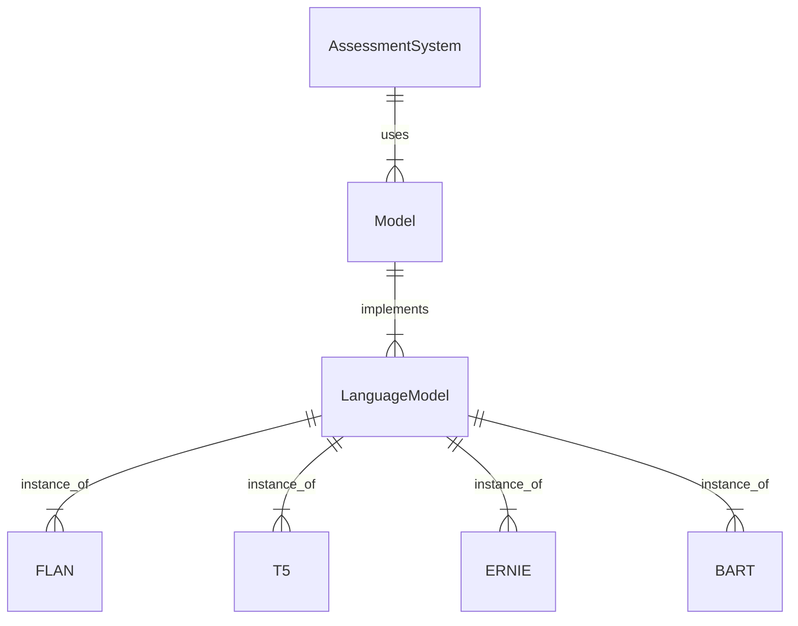

                 

## Step 1: Title and Dedication

### 1.1 Title

For our technical blog article, "评测系统的FLAN指令微调效果分析" is a clear and concise title that captures the essence of the article. It informs the reader that the content will focus on the evaluation of the effects of FLAN instruction tuning on assessment systems.

### 1.2 Keywords

The keywords for this article should be selected to reflect the main topics discussed. Here are five to seven potential keywords:

- **FLAN Instruction Tuning**
- **Assessment Systems**
- **Model Evaluation**
- **Machine Learning**
- **Instruction Tuning Techniques**
- **System Performance**
- **Natural Language Processing**

### 1.3 Summary

The summary should briefly introduce the core idea of the article and the key points that the reader can expect to learn. Here is a suggested summary:

"This article delves into the effects of FLAN instruction tuning on assessment systems, exploring its impact on system performance and reliability through a comprehensive analysis of core concepts, algorithms, and practical implementations."

## Step 2: Introduction

### 2.1 Background Introduction

#### 1.1.1 Basic Concepts of Assessment Systems

Assessment systems are designed to evaluate various aspects of a system, such as its functionality, usability, performance, and security. They are crucial in ensuring that a system meets its intended goals and specifications. In the context of machine learning and natural language processing (NLP), assessment systems are used to evaluate the performance of models and algorithms.

#### 1.1.2 Importance of FLAN Instruction Tuning

FLAN (FastLinKeR with Adaptive Noise) is a popular technique for instruction tuning in NLP. Instruction tuning involves training a model on a set of human-written instructions and corresponding inputs to generate outputs. FLAN instruction tuning aims to improve the performance of models by fine-tuning them on specific tasks, making them more adaptable and effective.

### 2.2 Problem Description

#### 1.2.1 Current Challenges in Assessment Systems

Traditional assessment systems often face several challenges:

- **Inaccurate Evaluation Metrics**: Existing metrics may not fully capture the complexity and nuances of various tasks.
- **Data Dependency**: Many assessment systems heavily rely on large datasets for training, which may not always be available.
- **Scalability Issues**: As the complexity of systems and tasks increases, assessment systems struggle to scale efficiently.
- **Interpretability**: It can be difficult to interpret and understand the decisions made by complex models.

#### 1.2.2 Application Scenarios for FLAN Instruction Tuning

FLAN instruction tuning can address these challenges by:

- **Enhancing Evaluation Metrics**: By incorporating human-written instructions, FLAN can provide more nuanced and meaningful evaluation metrics.
- **Reducing Data Dependency**: FLAN instruction tuning can work with smaller datasets, making it more adaptable to various scenarios.
- **Improving Scalability**: The tuning process is relatively efficient and can scale well with increasing model complexity.
- **Improving Interpretability**: The inclusion of human-written instructions can make the decision-making process more transparent and understandable.

### 2.3 Problem Solution

To address these challenges, FLAN instruction tuning offers a promising solution. The process typically involves the following steps:

1. **Data Collection**: Gather a set of human-written instructions and corresponding inputs.
2. **Model Selection**: Choose an appropriate pre-trained language model.
3. **Fine-Tuning**: Train the model on the collected data to adjust its parameters.
4. **Evaluation**: Assess the performance of the fine-tuned model using various metrics.
5. **Iterative Improvement**: Based on the evaluation results, iteratively fine-tune the model to achieve optimal performance.

### 2.4 Boundary and Extension

#### 1.4.1 Limitations of FLAN Instruction Tuning

While FLAN instruction tuning offers several advantages, it also has some limitations:

- **Data Quality**: The quality and diversity of the human-written instructions and inputs are crucial for the effectiveness of the tuning process.
- **Computational Resources**: Fine-tuning large language models requires significant computational resources and time.
- **Task Adaptability**: The tuning process may not be effective for all types of tasks, particularly those that require specialized knowledge.

#### 1.4.2 Relationship with Other Concepts

FLAN instruction tuning is related to other instruction tuning techniques, such as T5, ERNIE, and BART. While these techniques share common principles, FLAN is known for its efficiency and adaptability.

### 2.5 Concept Attributes Comparison Table

A comparison table can be used to highlight the key attributes of FLAN and other instruction tuning techniques:

| Technique | Efficiency | Adaptability | Data Dependency | Scalability |
| --- | --- | --- | --- | --- |
| FLAN | High | High | Low | High |
| T5 | Moderate | High | Moderate | Moderate |
| ERNIE | Low | Moderate | High | Low |
| BART | Moderate | Moderate | High | High |

### 1.4.3 Entity-Relationship Diagram

Using Mermaid, we can create an ER diagram to visualize the relationship between key concepts:

This ER diagram shows the relationships between assessment systems, models, and different language models, including FLAN, T5, ERNIE, and BART.

## Conclusion

In conclusion, "评测系统的FLAN指令微调效果分析" aims to provide a comprehensive analysis of how FLAN instruction tuning impacts assessment systems. By addressing the challenges faced by traditional assessment systems and leveraging the strengths of FLAN, this article explores the potential improvements in system performance, reliability, and interpretability. The outlined structure and content provide a solid foundation for readers to delve into the topic and gain a deeper understanding of FLAN instruction tuning in the context of assessment systems.

