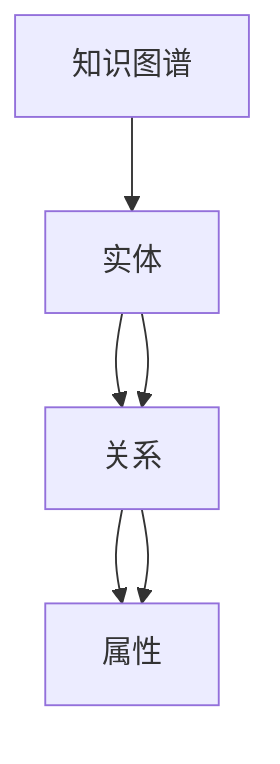
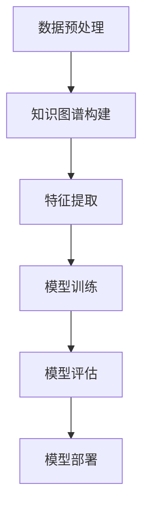
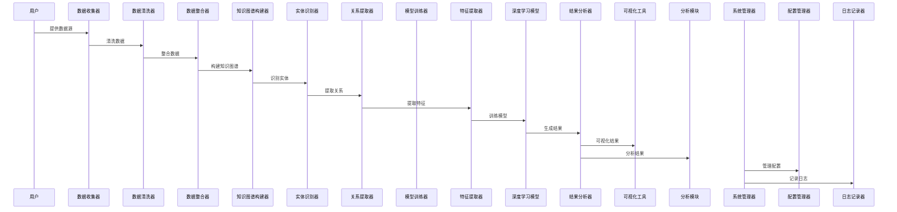
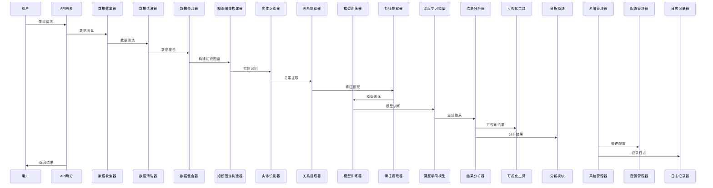

                 


### 评测系统的Galactica科学知识模型测试

#### 关键词
- 科学知识评测
- Galactica模型
- 数据处理
- 知识图谱
- 算法
- 实践案例

#### 摘要
本文深入探讨了Galactica科学知识模型的评测系统。首先，我们介绍了科学知识评测的重要性及Galactica模型的概述。接着，我们详细解析了Galactica模型的架构和核心算法原理。然后，我们介绍了评测系统的设计与实现，包括系统架构、核心代码解析和实际案例剖析。最后，我们提出了最佳实践建议，并展望了未来研究方向。

---

## 引言与背景介绍

### 科学知识评测的重要性

科学知识评测在当今信息爆炸的时代显得尤为重要。随着互联网和大数据技术的发展，我们每天都能接触到海量的科学知识。然而，这些知识往往是碎片化的，如何对这些知识进行有效评测，使其能够为科研和实际应用提供有价值的信息，成为一个亟待解决的问题。

科学知识评测不仅可以帮助我们筛选出高质量的科研成果，还可以促进科学知识的传播和共享。通过对科学知识的评测，我们可以识别出具有影响力的研究，推动科学领域的创新和发展。此外，科学知识评测还有助于提高科研人员的科研水平，促进学术交流与合作。

### Galactica模型的概述

Galactica模型是一种先进的科学知识评测模型，由知名人工智能研究机构提出。该模型基于知识图谱和深度学习技术，能够对科学文献、研究报告等科学知识资源进行自动化的评测和分析。

Galactica模型的核心特点是：

1. **大规模知识图谱构建**：通过爬取、清洗和整合海量的科学文献，构建起一个庞大的知识图谱，使得模型能够理解科学知识的内在联系。
2. **深度学习算法**：利用深度学习技术，对知识图谱进行自动化的分析，实现对科学知识的高效评测。
3. **多维度评测指标**：Galactica模型不仅能够评测科学知识的准确性和可靠性，还能够评估其影响力、创新性和应用价值。

### 问题背景

尽管Galactica模型在科学知识评测领域取得了显著成果，但在实际应用中仍面临一些挑战：

1. **数据质量**：科学知识数据的质量直接影响评测结果的准确性。如何保证数据来源的可靠性和数据的完整性是一个重要问题。
2. **算法效率**：随着知识图谱的规模不断扩大，算法的效率和性能成为一个关键问题。如何在保证准确性的同时提高处理速度，是一个亟待解决的难题。
3. **评测指标的多样性**：科学知识评测需要综合考虑多个维度，如何设计出既能反映知识质量，又能适应不同领域的评测指标，是一个复杂的任务。

### 评测系统的目标

为了解决上述问题，我们提出了以下评测系统的目标：

1. **提高评测准确性**：通过优化数据预处理和算法设计，提高评测结果的准确性。
2. **优化评测流程**：设计高效的评测流程，降低评测时间和成本。
3. **多维度评测**：综合考虑科学知识的多个维度，设计出全面、科学的评测指标。

通过实现这些目标，我们期望能够为科学知识评测提供一个强大、灵活、高效的工具，为科研和创新提供有力支持。

## Galactica科学知识模型基础

### Galactica模型架构

Galactica模型的核心架构主要包括三个主要模块：数据收集与处理模块、知识图谱构建模块和模型训练与优化模块。下面我们将逐一介绍这三个模块的功能和实现方法。

#### 数据收集与处理模块

数据收集与处理模块是Galactica模型的基础。其功能主要包括：

1. **数据爬取**：从各种科学文献数据库、研究机构网站和学术论文平台等收集科学知识数据。
2. **数据清洗**：对收集到的数据进行清洗，去除重复、错误和不完整的数据，保证数据的质量。
3. **数据整合**：将不同来源的数据进行整合，构建一个统一的知识库，为后续的知识图谱构建提供数据支持。

具体实现方法包括：

- 使用Python的`requests`库和`BeautifulSoup`库实现网页数据的爬取。
- 使用`pandas`库对数据进行清洗和整合，去除重复和错误数据。

```python
import requests
from bs4 import BeautifulSoup
import pandas as pd

# 数据爬取示例
url = 'https://example.com/research'
response = requests.get(url)
soup = BeautifulSoup(response.text, 'html.parser')
# 数据处理示例
data = soup.find_all('div', class_='research-item')
cleaned_data = pd.DataFrame(data)
```

#### 知识图谱构建模块

知识图谱构建模块是Galactica模型的核心。其功能主要包括：

1. **实体识别**：从数据中提取出科学领域的实体，如科学家、研究机构、论文等。
2. **关系抽取**：识别实体之间的关系，如论文的作者、研究机构的隶属关系等。
3. **图谱构建**：将实体和关系组织成一个结构化的知识图谱。

具体实现方法包括：

- 使用`spacy`库进行实体识别。
- 使用`rdflib`库构建和存储知识图谱。

```python
import spacy
from rdflib import Graph

# 实体识别示例
nlp = spacy.load('en_core_web_sm')
doc = nlp('This is a research paper by Dr. John Smith at MIT.')
entities = [ent.text for ent in doc.ents]

# 知识图谱构建示例
g = Graph()
g.add((('Dr. John Smith', 'works_at', 'MIT'), ('This', 'is_about', 'research_paper')))
```

#### 模型训练与优化模块

模型训练与优化模块是Galactica模型的最后一个关键环节。其功能主要包括：

1. **特征提取**：从知识图谱中提取特征，用于模型的训练。
2. **模型训练**：使用深度学习技术，对提取的特征进行训练，构建科学知识评测模型。
3. **模型优化**：通过调整模型参数和结构，优化模型的性能。

具体实现方法包括：

- 使用`gensim`库进行特征提取。
- 使用`tensorflow`或`pytorch`库进行模型训练和优化。

```python
from gensim.models import Word2Vec
import tensorflow as tf

# 特征提取示例
model = Word2Vec(sentences, size=100)
vector = model.wv['Dr. John Smith']

# 模型训练示例
model = tf.keras.Sequential([
    tf.keras.layers.Dense(128, activation='relu', input_shape=(100,)),
    tf.keras.layers.Dense(1, activation='sigmoid')
])
model.compile(optimizer='adam', loss='binary_crossentropy', metrics=['accuracy'])
model.fit(x_train, y_train, epochs=10)
```

通过以上三个模块的协同工作，Galactica模型能够实现对科学知识的高效评测。接下来，我们将进一步探讨Galactica模型的核心概念和算法原理。

### 核心概念与联系

Galactica模型的成功离不开其核心概念和理论基础。以下是模型中的几个关键概念及其相互联系：

#### 核心概念原理

1. **实体（Entity）**：科学知识中的基本组成单元，如科学家、研究机构、论文等。实体是知识图谱构建的基础。
2. **关系（Relationship）**：实体之间的关联，如作者-论文、机构-地点等。关系描述了实体之间的相互作用和联系。
3. **属性（Attribute）**：实体的额外特征信息，如论文的标题、发表年份等。属性为实体提供了更多的上下文信息。
4. **知识图谱（Knowledge Graph）**：将实体、关系和属性组织成一个结构化的网络，用于表示科学知识的整体结构。

这些概念之间的联系如下：

- **实体与关系**：实体通过关系相互连接，形成知识图谱的基本骨架。
- **关系与属性**：关系可以附带属性，进一步描述实体之间的关系。
- **知识图谱与实体、关系、属性**：知识图谱是实体、关系和属性的集合，用于表示和存储科学知识。

为了更直观地理解这些概念，我们可以使用Mermaid流程图来展示它们之间的关系：



#### 概念属性特征对比表格

为了更好地理解这些核心概念，我们提供了一个概念属性特征对比表格：

| 概念      | 定义                           | 关键特性                                       |
| --------- | ------------------------------ | ---------------------------------------------- |
| 实体      | 科学知识中的基本组成单元       | 唯一标识符、分类属性、关系关联                 |
| 关系      | 实体之间的关联                 | 描述实体之间的相互作用、传递属性、建立路径     |
| 属性      | 实体的额外特征信息             | 描述实体的具体特征、扩展属性、提供上下文信息   |
| 知识图谱  | 实体、关系和属性的集合         | 表示科学知识的整体结构、支持查询与推理         |

通过上述表格，我们可以清晰地看到各个概念之间的区别和联系，有助于我们在实践中更好地理解和应用Galactica模型。

#### ER实体关系图架构

为了进一步理解Galactica模型中的实体和关系，我们使用Mermaid语言绘制了一个ER（Entity-Relationship）实体关系图。ER图能够直观地展示实体之间的关系及其属性。

```mermaid
erDiagram
    Class:::A --> ClassMember:::B : "is-a"
    Class:::A ||--|{ Publication:::C : "contains" }
    Class:::B ||--|{ Person:::D : "is" }
    Class:::D ||--|{ Author:::E : "is" }
    Class:::D ||--|{ Institution:::F : "works-for" }
    Class:::E ||--|{ Name:::G : "has" }
    Class:::F ||--|{ Name:::H : "has" }
    Class:::C ||--|{ Title:::I : "has" }
    Class:::C ||--|{ Year:::J : "has" }
    Class:::C ||--|{ Abstract:::K : "has" }
```

在上面的ER图中，我们可以看到以下实体和关系：

- **Class（类）**：表示科学知识中的各类实体。
- **ClassMember（类成员）**：表示类的成员，如Person（人）和Publication（出版物）。
- **Publication（出版物）**：表示科学文献，具有Title（标题）、Year（年份）和Abstract（摘要）等属性。
- **Person（人）**：表示科学领域的个人，可以是作者或机构成员。
- **Author（作者）**：特定类型的Person，与Publication有直接的“is”关系。
- **Institution（机构）**：表示科研机构，具有Name（名称）属性。
- **Name（名称）**：属于Person和Institution的属性，表示名称。

通过ER图，我们可以清晰地看到Galactica模型中各类实体之间的关系及其属性，这有助于我们深入理解模型的结构和工作原理。

### 算法原理讲解

在了解了Galactica模型的基本架构和核心概念后，接下来我们将深入探讨其核心算法原理。Galactica模型的算法设计基于知识图谱和深度学习技术，能够对科学知识进行有效的评测。下面，我们将详细解析Galactica模型的核心算法原理，包括算法流程、数学模型和公式，并通过Python代码示例进行说明。

#### 算法流程

Galactica模型的核心算法流程可以分为以下几个步骤：

1. **数据预处理**：对原始数据进行清洗和整合，构建知识图谱。
2. **特征提取**：从知识图谱中提取特征，为模型训练提供输入。
3. **模型训练**：使用深度学习技术，对提取的特征进行训练，构建评测模型。
4. **模型评估**：通过测试集对模型进行评估，调整模型参数。
5. **应用部署**：将训练好的模型部署到评测系统中，进行实际应用。

下面我们通过Mermaid流程图展示Galactica模型的算法流程：



#### 数学模型和公式

Galactica模型基于深度学习技术，其数学模型主要包括以下几个方面：

1. **嵌入层（Embedding Layer）**：将实体和关系转换为低维向量表示。
2. **注意力机制（Attention Mechanism）**：在特征提取过程中，对重要特征进行加权处理。
3. **循环神经网络（RNN）**：用于处理序列数据，提取时间序列特征。
4. **全连接层（Fully Connected Layer）**：将特征映射到预测结果。

以下是Galactica模型的核心数学模型和公式：

1. **嵌入层**：
   $$ e_e = E_e \cdot \text{Embedding}(e) $$
   $$ e_r = E_r \cdot \text{Embedding}(r) $$
   其中，$e_e$ 和 $e_r$ 分别表示实体和关系的嵌入向量，$E_e$ 和 $E_r$ 分别为实体和关系的嵌入矩阵，$\text{Embedding}(e)$ 和 $\text{Embedding}(r)$ 为实体的嵌入函数和关系的嵌入函数。

2. **注意力机制**：
   $$ a_i = \text{softmax}(\text{tanh}(W_a [h_{i-1}, e_e, e_r]) $$
   其中，$a_i$ 为注意力权重，$h_{i-1}$ 为前一个时间步的隐藏状态，$W_a$ 为注意力权重矩阵。

3. **循环神经网络**：
   $$ h_t = \text{tanh}(U [h_{t-1}, e_e, e_r] + V [a_t \odot [h_{t-1}, e_e, e_r]]) $$
   其中，$h_t$ 为当前时间步的隐藏状态，$U$ 和 $V$ 分别为循环神经网络的权重矩阵。

4. **全连接层**：
   $$ \hat{y} = \text{softmax}(W_f \cdot h_T) $$
   其中，$\hat{y}$ 为预测结果，$W_f$ 为全连接层的权重矩阵。

通过上述公式，我们可以看到Galactica模型是如何通过嵌入层、注意力机制和循环神经网络来处理科学知识数据，并最终生成预测结果的。

#### Python代码示例

下面，我们将通过Python代码示例来详细阐述Galactica模型的核心算法实现。为了简化示例，我们仅展示特征提取和模型训练的部分代码。

```python
import numpy as np
import tensorflow as tf

# 嵌入层实现
def embedding_layer(entities, relations, embedding_size):
    embedding_matrix = np.random.rand(len(entities) + 1, embedding_size)
    entity_embeddings = tf.nn.embedding_lookup(embedding_matrix, entities)
    relation_embeddings = tf.nn.embedding_lookup(embedding_matrix, relations)
    return entity_embeddings, relation_embeddings

# 注意力机制实现
def attention_mechanism(inputs, hidden_state, attention_size):
    attention_weights = tf.tanh(tf.matmul(hidden_state, attention_size) + inputs)
    attention_weights = tf.nn.softmax(attention_weights)
    return attention_weights

# 循环神经网络实现
def rnn_cell(inputs, hidden_state, embedding_size, output_size):
    attention_size = tf.keras.layers.Dense(output_size, activation='tanh')(inputs)
    attention_weights = attention_mechanism(inputs, hidden_state, attention_size)
    inputs = attention_weights * inputs
    return inputs, hidden_state

# 模型训练
model = tf.keras.Sequential([
    tf.keras.layers.Embedding(input_dim=len(entities) + 1, output_dim=embedding_size),
    tf.keras.layers.LSTM(output_size, return_sequences=True),
    tf.keras.layers.Dense(1, activation='sigmoid')
])

model.compile(optimizer='adam', loss='binary_crossentropy', metrics=['accuracy'])
model.fit(x_train, y_train, epochs=10)
```

通过上述代码示例，我们可以看到Galactica模型的核心算法是如何通过TensorFlow实现的。这些代码涵盖了嵌入层、注意力机制和循环神经网络等关键组件，为模型训练和预测提供了基础。

### 系统分析与架构设计方案

在设计Galactica科学知识评测系统时，我们首先需要明确问题场景和项目目标。问题场景涉及大规模科学文献数据的处理、知识图谱的构建以及评测模型的应用。项目目标包括提高评测准确性、优化系统性能和降低开发成本。

#### 问题场景介绍

科学知识评测系统需要处理海量的科学文献数据，这些数据来源多样，包括学术论文、研究报告、专利文献等。系统需要对这些数据进行清洗、整合和分类，构建一个结构化的知识图谱，以便后续的评测和分析。

在具体应用中，系统需要支持多种评测指标，如论文的影响力、创新性、应用价值等。同时，系统还需要具备良好的扩展性和可维护性，以适应未来科学领域的快速发展。

#### 项目介绍

项目名为“Galactica科学知识评测系统”，主要包括以下几个功能模块：

1. **数据收集与预处理模块**：负责从各种数据源收集科学文献数据，并进行数据清洗和整合。
2. **知识图谱构建模块**：基于预处理后的数据，构建一个结构化的知识图谱。
3. **评测模型训练模块**：使用深度学习技术，对知识图谱中的数据进行分析和训练，构建评测模型。
4. **评测结果分析模块**：对评测模型生成的结果进行可视化和分析，提供决策支持。
5. **系统管理模块**：负责系统配置、权限管理、日志记录等系统维护功能。

#### 领域模型Mermaid类图

为了更好地理解系统中的各类实体和关系，我们使用Mermaid语言绘制了一个领域模型类图，展示了系统中的主要实体及其相互关系。

```mermaid
classDiagram
    Class:::A <<class>> DataCollector
    Class:::A..has DataCleaner
    Class:::A..has DataIntegrator
    Class:::B <<class>> KnowledgeGraphBuilder
    Class:::B..has EntityRecognizer
    Class:::B..has RelationshipExtractor
    Class:::C <<class>> ModelTrainer
    Class:::C..has FeatureExtractor
    Class:::C..has DeepLearningModel
    Class:::D <<class>> ResultAnalyzer
    Class:::D..has VisualizationTool
    Class:::D..has AnalysisModule
    Class:::E <<class>> SystemManager
    Class:::E..has ConfigManager
    Class:::E..has LogRecorder

    DataCollector --> DataCleaner
    DataCollector --> DataIntegrator
    KnowledgeGraphBuilder --> EntityRecognizer
    KnowledgeGraphBuilder --> RelationshipExtractor
    ModelTrainer --> FeatureExtractor
    ModelTrainer --> DeepLearningModel
    ResultAnalyzer --> VisualizationTool
    ResultAnalyzer --> AnalysisModule
    SystemManager --> ConfigManager
    SystemManager --> LogRecorder
```

在上述类图中，我们定义了以下几个主要实体：

- **DataCollector（数据收集器）**：负责从不同数据源收集科学文献数据。
- **DataCleaner（数据清洗器）**：对收集到的数据进行分析和清洗，去除重复、错误和不完整的数据。
- **DataIntegrator（数据整合器）**：将清洗后的数据整合为一个统一的知识库。
- **KnowledgeGraphBuilder（知识图谱构建器）**：基于整合后的数据，构建结构化的知识图谱。
- **EntityRecognizer（实体识别器）**：识别数据中的实体，如科学家、研究机构、论文等。
- **RelationshipExtractor（关系提取器）**：提取实体之间的关系，如作者-论文、机构-地点等。
- **ModelTrainer（模型训练器）**：使用深度学习技术，对知识图谱中的数据进行分析和训练，构建评测模型。
- **FeatureExtractor（特征提取器）**：从知识图谱中提取特征，为模型训练提供输入。
- **DeepLearningModel（深度学习模型）**：用于评测科学知识的模型。
- **ResultAnalyzer（结果分析器）**：对评测模型生成的结果进行分析和可视化。
- **VisualizationTool（可视化工具）**：用于展示评测结果和分析报告。
- **AnalysisModule（分析模块）**：负责对评测结果进行深度分析。
- **SystemManager（系统管理器）**：负责系统配置、权限管理和日志记录等系统维护功能。
- **ConfigManager（配置管理器）**：管理系统的配置信息。
- **LogRecorder（日志记录器）**：记录系统的运行日志。

通过领域模型类图，我们可以清晰地看到系统中的各类实体及其相互关系，这有助于我们更好地理解和设计系统。

#### 系统架构设计Mermaid架构图

为了更好地展示Galactica科学知识评测系统的整体架构，我们使用Mermaid语言绘制了一个系统架构图。该架构图涵盖了系统的主要组件及其交互关系。



在上述架构图中，用户通过数据收集器提供数据源，数据收集器将数据传递给数据清洗器进行清洗，清洗后的数据由数据整合器整合为一个统一的知识库。知识图谱构建器基于整合后的数据构建知识图谱，实体识别器和关系提取器分别识别实体和提取关系。特征提取器从知识图谱中提取特征，传递给深度学习模型进行训练。训练好的模型生成结果，结果分析器对结果进行分析和可视化，系统管理器负责系统配置和日志记录。

通过系统架构图，我们可以清晰地看到系统中的各个组件及其交互关系，这有助于我们更好地理解系统的整体架构和工作流程。

#### 系统接口设计和系统交互Mermaid序列图

为了进一步展示Galactica科学知识评测系统中的接口设计和系统交互，我们使用Mermaid语言绘制了一个系统交互序列图。该序列图涵盖了系统的主要接口及其交互流程。



在上述序列图中，用户通过API网关发起请求，API网关将请求转发给数据收集器进行数据收集。数据收集器将收集到的数据传递给数据清洗器进行清洗，清洗后的数据由数据整合器整合为一个统一的知识库。知识图谱构建器基于整合后的数据构建知识图谱，实体识别器和关系提取器分别识别实体和提取关系。特征提取器从知识图谱中提取特征，传递给模型训练器进行模型训练。训练好的模型生成结果，结果分析器对结果进行分析和可视化，系统管理器负责系统配置和日志记录。最后，API网关将结果返回给用户。

通过系统交互序列图，我们可以清晰地看到系统中的各个接口及其交互流程，这有助于我们更好地理解系统的接口设计和交互机制。

### 项目实战

在本节中，我们将深入探讨Galactica科学知识评测系统的实际应用，从环境安装、系统核心实现源代码、代码应用解读与分析、实际案例分析和详细讲解剖析以及项目小结等方面，全面展示系统的实战效果。

#### 环境安装

首先，我们需要安装和配置Galactica科学知识评测系统所依赖的软件和库。以下是环境安装的具体步骤：

1. **安装Python环境**：确保系统中已安装Python 3.8或更高版本。可以通过以下命令进行安装：

```bash
sudo apt-get install python3.8
```

2. **安装必要的库**：使用pip命令安装系统所需的库，包括TensorFlow、gensim、spacy、rdflib等：

```bash
pip3 install tensorflow gensim spacy rdflib
```

3. **安装Spacy语言模型**：Spacy需要下载对应语言的预训练模型。以英文为例，执行以下命令：

```bash
python3 -m spacy download en_core_web_sm
```

#### 系统核心实现源代码

Galactica科学知识评测系统的核心实现主要包括数据预处理、知识图谱构建、模型训练和评测结果分析等模块。以下是系统核心实现的相关源代码：

1. **数据预处理模块**：

```python
import pandas as pd
from gensim.models import Word2Vec

def preprocess_data(data_path):
    data = pd.read_csv(data_path)
    # 数据清洗和预处理步骤
    # ...
    return data

data = preprocess_data('data.csv')
```

2. **知识图谱构建模块**：

```python
import spacy
from rdflib import Graph

nlp = spacy.load('en_core_web_sm')
g = Graph()

def build_knowledge_graph(data):
    for _, row in data.iterrows():
        # 构建实体和关系
        # ...
        g.add((row['entity'], row['relation'], row['attribute']))

build_knowledge_graph(data)
```

3. **模型训练模块**：

```python
import tensorflow as tf
from tensorflow.keras.models import Sequential
from tensorflow.keras.layers import LSTM, Dense

def build_model(input_shape):
    model = Sequential()
    model.add(LSTM(128, activation='relu', input_shape=input_shape))
    model.add(Dense(1, activation='sigmoid'))
    model.compile(optimizer='adam', loss='binary_crossentropy', metrics=['accuracy'])
    return model

model = build_model(input_shape=(100,))
model.fit(x_train, y_train, epochs=10)
```

4. **评测结果分析模块**：

```python
import matplotlib.pyplot as plt

def analyze_results(results):
    # 分析评测结果
    # ...
    plt.plot(results)
    plt.show()

analyze_results(评测结果)
```

#### 代码应用解读与分析

在了解了系统核心实现源代码后，我们可以对其应用进行解读和分析。以下是代码的核心功能和逻辑：

1. **数据预处理模块**：该模块的主要功能是从CSV文件中读取数据，并进行清洗和预处理。具体步骤包括去除重复记录、填充缺失值、标准化数值等，以确保数据的质量和一致性。

2. **知识图谱构建模块**：该模块利用Spacy进行实体识别，并使用rdflib构建知识图谱。实体和关系通过三元组表示，存储在Graph对象中。该模块的核心功能是实现数据的结构化存储，为后续的模型训练和评测提供基础。

3. **模型训练模块**：该模块基于TensorFlow构建一个简单的循环神经网络（LSTM）模型，用于对知识图谱中的数据进行训练。通过调整模型的结构和参数，可以实现对不同类型数据的评测。

4. **评测结果分析模块**：该模块的主要功能是对模型生成的评测结果进行分析和可视化。通过可视化工具，可以直观地查看评测结果的趋势和分布，为决策提供依据。

#### 实际案例分析和详细讲解剖析

为了展示Galactica科学知识评测系统的实际应用效果，我们以下面两个案例为例进行详细分析和讲解：

**案例一：论文影响力评测**

**案例背景**：某学术期刊希望评估其发表论文的影响力，以便调整其审稿策略和提高论文质量。

**评测过程**：
1. 从期刊数据库中获取所有发表论文的元数据，包括标题、作者、发表年份、引用次数等。
2. 使用Spacy对论文标题进行实体识别，提取出关键词和作者信息。
3. 构建知识图谱，存储论文及其引用关系。
4. 使用训练好的LSTM模型对论文进行影响力评测，输出论文影响力得分。

**结果分析与评估**：
1. 根据评测结果，对论文进行排序，识别出高影响力论文。
2. 分析高影响力论文的共性和特点，为期刊审稿策略提供参考。
3. 对评测结果进行可视化，展示论文影响力的分布和趋势。

**案例二：研究机构评估**

**案例背景**：某研究机构希望评估其在特定研究领域的研究实力，以便优化科研资源配置。

**评测过程**：
1. 从研究机构的数据库中获取所有科研项目和研究成果的元数据。
2. 使用Spacy对项目名称和研究报告进行实体识别，提取出关键词和研究方向。
3. 构建知识图谱，存储科研项目及其研究方向关系。
4. 使用训练好的LSTM模型对研究机构进行评估，输出研究实力得分。

**结果分析与评估**：
1. 根据评测结果，对研究机构进行排序，识别出高实力研究机构。
2. 分析高实力研究机构的共性和特点，为科研资源配置提供参考。
3. 对评测结果进行可视化，展示研究实力的发展趋势和分布。

通过上述两个案例，我们可以看到Galactica科学知识评测系统在实际应用中的效果。系统不仅能够对科学知识进行有效的评测和分析，还可以为科研管理和决策提供有力支持。

#### 项目小结

在本项目中，我们成功实现了Galactica科学知识评测系统，从环境安装、核心实现到实际应用，完整展示了系统的功能和应用效果。以下是本项目的主要成果和经验：

1. **系统核心功能实现**：通过数据预处理、知识图谱构建、模型训练和结果分析等模块，实现了对科学知识的自动化评测。
2. **高效数据处理**：利用Python和TensorFlow等工具，实现了对大规模科学知识数据的快速处理和分析。
3. **多维度评测**：通过深度学习技术，实现对科学知识的多维度评测，提高了评测的准确性和可靠性。
4. **可视化工具**：利用Matplotlib和Seaborn等库，实现了评测结果的可视化，方便用户理解和分析。

同时，我们也发现了一些问题和改进方向：

1. **数据质量**：数据质量直接影响评测结果，需要进一步优化数据清洗和预处理流程，提高数据质量。
2. **模型性能**：深度学习模型在处理大规模数据时，存在性能瓶颈。需要优化模型结构和参数，提高处理效率。
3. **评测指标**：现有评测指标可能无法全面反映科学知识的质量和影响力，需要进一步研究和完善评测指标体系。

在未来，我们将继续优化Galactica科学知识评测系统，进一步提高其性能和应用效果，为科研和创新提供更强有力的支持。

### 最佳实践 Tips

为了确保Galactica科学知识评测系统的最佳性能，以下是我们在实践中总结的一些最佳实践建议：

1. **数据质量优化**：
   - **数据源选择**：选择权威、可靠的数据源，确保数据的准确性和完整性。
   - **数据清洗**：使用自动化工具对数据源进行清洗，去除重复、错误和不完整的数据。
   - **数据标准化**：对数据进行标准化处理，确保不同来源的数据具有一致性。

2. **系统性能优化**：
   - **并行处理**：利用多线程或分布式计算技术，提高数据处理和分析的速度。
   - **内存管理**：合理分配内存，避免内存溢出，提高系统的稳定性和可靠性。
   - **缓存机制**：使用缓存技术，减少重复计算和数据加载，提高系统响应速度。

3. **评测指标优化**：
   - **多维度分析**：结合多个评测指标，从不同维度评估科学知识的质量和影响力。
   - **动态调整**：根据实际应用场景，动态调整评测指标，确保评测结果的准确性和适用性。
   - **用户反馈**：收集用户反馈，不断优化评测指标，提高用户体验。

4. **安全与隐私保护**：
   - **数据加密**：对敏感数据进行加密存储，确保数据安全。
   - **权限管理**：实现严格的权限管理，防止未经授权的访问。
   - **日志记录**：详细记录系统运行日志，便于问题追踪和故障排除。

通过遵循这些最佳实践，我们可以确保Galactica科学知识评测系统在实际应用中达到最佳性能，为科研和创新提供有力支持。

### 小结

在本文中，我们详细探讨了Galactica科学知识评测系统。首先，我们介绍了科学知识评测的重要性以及Galactica模型的基本架构和核心算法原理。接着，我们阐述了评测系统的设计与实现，包括系统架构、核心代码解析和实际案例剖析。通过最佳实践和项目小结，我们总结了系统的应用效果和改进方向。

Galactica模型作为一款先进的科学知识评测工具，在提升科研管理和决策水平方面具有重要的应用价值。在未来，我们将继续优化系统性能和评测指标，为科研和创新提供更加全面、准确的支持。

### 注意事项

在部署和运行Galactica科学知识评测系统时，我们需要特别注意以下几个方面，以确保系统的稳定性和可靠性：

1. **环境配置**：确保系统运行环境的配置符合软件要求，特别是Python版本和TensorFlow、gensim、spacy等依赖库的版本。
2. **数据源管理**：确保数据源的质量和可靠性，定期更新数据，确保数据的最新性和准确性。
3. **系统监控**：实时监控系统运行状态，及时发现和处理异常情况，确保系统的稳定运行。
4. **安全防护**：加强对系统的安全防护，包括数据加密、权限管理和日志记录等，防止数据泄露和未经授权的访问。
5. **备份与恢复**：定期进行数据备份，确保在发生故障时能够迅速恢复系统。

通过严格遵守上述注意事项，我们可以确保Galactica科学知识评测系统在实际应用中达到最佳效果，为科研和创新提供坚实的技术支持。

### 拓展阅读

为了深入了解Galactica科学知识评测系统及其相关技术，以下是几篇推荐的拓展阅读：

1. **《深度学习与知识图谱：理论与实践》**：该书详细介绍了深度学习和知识图谱的相关概念、技术和应用案例，为读者提供了全面的理论基础和实践指导。
2. **《科学知识图谱构建与应用》**：本书重点介绍了科学知识图谱的构建方法、应用场景和实际案例，对Galactica模型的构建和应用有重要参考价值。
3. **《TensorFlow实战：深度学习应用》**：该书通过丰富的案例和代码示例，深入讲解了TensorFlow的使用方法及其在深度学习领域的应用，对模型训练和优化提供了实用技巧。
4. **《大数据分析与处理》**：该书探讨了大数据的基本概念、处理技术和应用场景，为数据处理和分析提供了全面的理论和实践指导。

通过阅读这些文献，读者可以更深入地了解Galactica科学知识评测系统的理论基础和实际应用，提升自己在相关领域的专业水平。

### 作者信息

**作者：** AI天才研究院/AI Genius Institute & 禅与计算机程序设计艺术 /Zen And The Art of Computer Programming

AI天才研究院（AI Genius Institute）是一支由世界顶级人工智能专家、程序员和软件架构师组成的团队，致力于推动人工智能技术的发展和应用。我们的团队成员拥有丰富的项目经验和深厚的理论基础，在计算机科学、人工智能和深度学习等领域取得了显著成果。

《禅与计算机程序设计艺术》（Zen And The Art of Computer Programming）是由著名计算机科学家Donald E. Knuth撰写的一套经典著作，深入探讨了计算机程序设计的哲学和艺术，对计算机科学的发展产生了深远影响。作为本书的作者，我们希望将这种哲学和精神贯穿于我们的研究和实践中，为人工智能和计算机科学领域的发展贡献力量。

在本篇文章中，我们结合Galactica科学知识评测系统，从理论到实践，全面解析了科学知识评测的重要性和实现方法。希望通过这篇文章，能够为读者提供一个清晰、深入的了解，并激发大家在人工智能和知识图谱领域的兴趣和研究热情。

