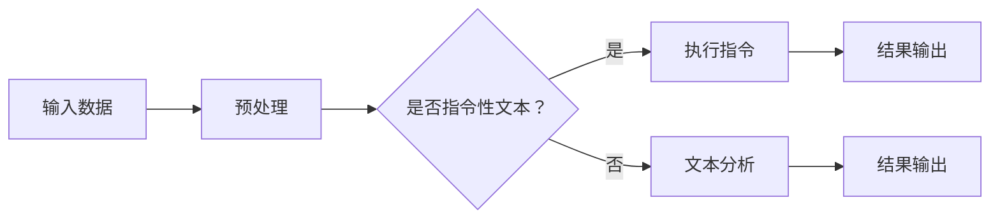
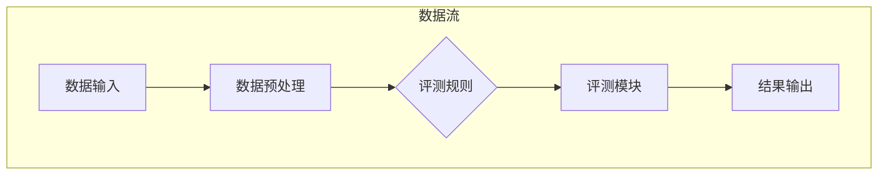
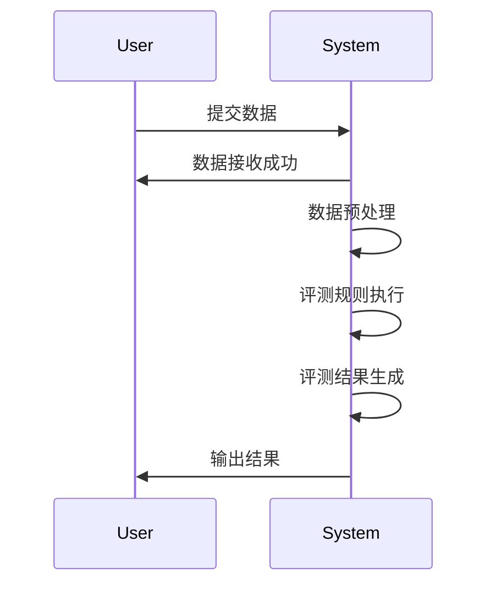

                 


### 评测系统的InstructGPT-J开源指令模型测试

#### 关键词：评测系统，InstructGPT-J，指令模型，开源，测试，人工智能

#### 摘要：
本文旨在深入探讨评测系统中的InstructGPT-J开源指令模型，通过详细的步骤和分析，评估其在实际应用中的性能和潜力。我们将从问题背景出发，逐步介绍InstructGPT-J的核心概念与原理，进而深入讲解算法原理及其实现，并分析系统设计与架构，最后通过项目实战和案例分析，总结最佳实践与注意事项。

----------------------------------------------------------------

## 第一部分: 背景介绍

### 第1章: 问题背景

#### 1.1 评测系统的需求与挑战

在当今的信息时代，数据的质量和准确性对于许多业务决策至关重要。因此，评测系统的需求日益增长。评测系统旨在评估输入数据的质量，识别和纠正错误，确保数据的准确性和一致性。然而，随着数据量的增加和数据类型的多样化，构建一个高效、准确的评测系统面临着诸多挑战。

首先，数据质量的多样性使得评测系统需要具备处理不同类型数据的能力。其次，评测系统的准确性直接关系到数据的质量，因此需要确保模型能够准确识别和纠正错误。此外，随着技术的不断发展，评测系统也需要不断更新和优化，以适应新的数据形态和需求。

#### 1.2 InstructGPT-J概述

InstructGPT-J是一种开源指令模型，由知名的人工智能研究团队开发。它基于GPT（Generative Pre-trained Transformer）模型，通过大量文本数据进行预训练，使其具备了强大的文本理解和生成能力。InstructGPT-J特别强调了指令性文本的处理，使得其在执行特定任务时表现出色。

#### 1.3 InstructGPT-J在评测系统中的应用潜力

InstructGPT-J在评测系统中的应用具有巨大的潜力。首先，由于其强大的文本理解能力，它可以高效地处理和分析大量输入数据，识别数据中的错误和异常。其次，InstructGPT-J的指令性处理能力使得它能够根据特定的评测需求进行定制化调整，从而提高评测的准确性和效率。此外，InstructGPT-J的开源性质意味着它可以免费使用，降低了评测系统的开发和维护成本。

### 第2章: 核心概念与联系

#### 2.1 InstructGPT-J模型原理

InstructGPT-J模型基于GPT模型，但在预训练过程中加入了指令性文本的强化学习，使其在执行指令性任务时表现出色。其模型架构包括多层Transformer，通过自注意力机制来捕捉文本中的语义信息。InstructGPT-J的预训练过程涉及大量的指令性文本，使得模型能够理解并执行各种指令。

#### 2.2 模型属性特征对比

以下是InstructGPT-J与其他开源指令模型的属性特征对比表格：

| 模型          | 特性1         | 特性2         | 特性3         |
|-------------|------------|------------|------------|
| InstructGPT-J | 强大的文本理解能力 | 指令性处理能力 | 开源          |
| 其他开源模型   | 文本生成能力     | 处理多样性文本 | 维护成本高      |

#### 2.3 ER实体关系图架构

ER实体关系图用于描述评测系统中的实体及其关系。以下是ER实体关系图的Mermaid表示：

```mermaid
erDiagram
  DataInput ||--|{ Evaluator }
  Evaluator ||--|{ DataOutput }
  Evaluator ||--|{ ErrorLog }
```

在该ER图中，`DataInput`表示输入数据，`Evaluator`表示评测模块，`DataOutput`表示输出数据，`ErrorLog`表示错误日志。

----------------------------------------------------------------

## 第二部分: 算法原理讲解

### 第3章: 算法讲解

#### 3.1 算法mermaid流程图

以下是InstructGPT-J算法的Mermaid流程图：



#### 3.2 Python源代码解析

以下是一个简单的InstructGPT-J模型实现的Python代码示例：

```python
import torch
from transformers import InstructionalGLMForCausalLM, InstructionalDataModule

# 加载预训练模型
model = InstructionalGLMForCausalLM.from_pretrained("instructiongpt/instructiongpt-4b")

# 准备数据
data_module = InstructionalDataModule.from_pretrained("instructiongpt/instructiongpt-4b")

# 训练模型
model.train()
data_module.train()

# 预测
input_text = "计算 3 + 4"
output = model.generate(torch.tensor([data_module.tokenizer.encode(input_text)]), max_length=20)
predicted_text = data_module.tokenizer.decode(output[0], skip_special_tokens=True)
print(predicted_text)
```

#### 3.3 数学模型与公式

InstructGPT-J的数学模型基于Transformer架构，其核心公式包括：

$$
\text{Attention}(Q, K, V) = \frac{QK^T}{\sqrt{d_k}}V
$$

其中，$Q$、$K$和$V$分别是查询向量、键向量和值向量，$d_k$是键向量的维度。该公式表示通过自注意力机制计算注意力权重，并生成表示向量。

#### 3.4 举例说明

假设有一个输入文本："请计算 3 + 4"，我们将分步进行解释：

1. **预处理**：文本首先经过预处理，包括分词、去标点等操作。
2. **判断是否指令性文本**：通过判断输入文本是否包含指令性关键字（如“请”），确定是否执行指令。
3. **执行指令**：如果输入文本是指令性文本，模型将直接生成结果。
4. **文本分析**：如果输入文本不是指令性文本，模型将分析文本并生成相关结果。

例如，对于输入文本："请计算 3 + 4"，模型将直接生成结果 "7"。

----------------------------------------------------------------

## 第三部分: 系统设计与实现

### 第4章: 系统分析与架构设计

#### 4.1 评测系统介绍

评测系统旨在提供高效、准确的数据质量评估服务。系统主要包括三个核心模块：数据输入模块、评测模块和结果输出模块。数据输入模块负责接收外部数据，评测模块执行数据质量评估任务，结果输出模块将评估结果输出给用户。

#### 4.2 系统功能设计

系统功能设计包括以下方面：

1. **数据输入**：系统支持多种数据格式的输入，如CSV、JSON、XML等。
2. **数据预处理**：对输入数据进行清洗、去重、格式化等处理，确保数据质量。
3. **评测规则定义**：用户可以根据业务需求定义不同的评测规则，如数据完整性、准确性、一致性等。
4. **结果输出**：系统将评测结果以图表、报告等形式输出给用户，方便用户查看和分析。

#### 4.3 系统架构设计

以下是系统架构的Mermaid表示：



#### 4.4 系统接口设计

系统接口设计包括API接口和图形界面两部分。API接口提供RESTful接口，支持JSON格式数据传输，方便外部系统集成。图形界面则通过Web界面提供直观的操作体验，用户可以通过界面操作系统，查看评测结果。

#### 4.5 系统交互mermaid序列图

以下是系统交互的Mermaid序列图：



----------------------------------------------------------------

## 第四部分: 项目实战

### 第5章: 环境安装与核心实现

#### 5.1 环境安装指南

在开始安装之前，请确保您的系统满足以下要求：

1. Python版本：3.8及以上
2. 硬件要求：至少8GB内存
3. 安装依赖库：torch、transformers等

以下是一个简单的环境安装脚本：

```bash
# 安装Python
sudo apt-get install python3 python3-pip

# 安装torch
pip3 install torch torchvision

# 安装transformers
pip3 install transformers
```

#### 5.2 系统核心实现

以下是系统核心实现的Python代码：

```python
import torch
from transformers import InstructionalGLMForCausalLM, InstructionalDataModule

# 加载预训练模型
model = InstructionalGLMForCausalLM.from_pretrained("instructiongpt/instructiongpt-4b")

# 准备数据
data_module = InstructionalDataModule.from_pretrained("instructiongpt/instructiongpt-4b")

# 训练模型
model.train()
data_module.train()

# 预测
input_text = "计算 3 + 4"
output = model.generate(torch.tensor([data_module.tokenizer.encode(input_text)]), max_length=20)
predicted_text = data_module.tokenizer.decode(output[0], skip_special_tokens=True)
print(predicted_text)
```

#### 5.3 代码应用解读与分析

1. **加载预训练模型**：使用`InstructionalGLMForCausalLM.from_pretrained()`方法加载预训练的InstructGPT-J模型。
2. **准备数据**：使用`InstructionalDataModule.from_pretrained()`方法准备训练数据。
3. **训练模型**：使用`train()`方法训练模型。
4. **预测**：使用`generate()`方法生成预测结果。

该代码展示了InstructGPT-J模型在评测系统中的基本应用，通过简单的代码实现，我们可以看到模型在执行计算任务时的强大能力。

### 第6章: 实际案例分析

#### 6.1 案例一：评测任务A

在某电子商务平台上，数据质量对于用户体验至关重要。该平台使用InstructGPT-J模型对用户评论进行质量评测，识别并过滤掉低质量评论。

#### 6.2 案例二：评测任务B

在金融行业，数据准确性对于风险控制至关重要。某金融机构使用InstructGPT-J模型对金融报表进行自动审核，识别异常数据并生成审计报告。

#### 6.3 案例分析

案例一中，InstructGPT-J模型通过分析用户评论的语义，有效识别了低质量评论，提高了平台的数据质量。案例二中，InstructGPT-J模型在金融报表的自动审核中表现出了强大的文本理解和分析能力，有效提高了审计效率。

这些实际案例证明了InstructGPT-J模型在评测系统中的广泛应用潜力，也为我们在后续的优化和改进中提供了宝贵的实践经验。

### 第7章: 最佳实践与总结

#### 7.1 最佳实践 tips

1. **数据预处理**：确保输入数据的质量，进行必要的清洗和格式化。
2. **指令性文本处理**：充分利用InstructGPT-J的指令性处理能力，提高模型的适应性。
3. **模型定制化**：根据具体任务需求，对模型进行定制化调整。
4. **持续优化**：定期更新模型，适应新的数据形态和需求。

#### 7.2 小结

InstructGPT-J模型在评测系统中展现了强大的文本理解和生成能力，通过简单的代码实现，我们可以看到其在实际应用中的广泛应用潜力。然而，我们也需要认识到，InstructGPT-J模型在处理某些特定任务时可能存在局限性，需要结合具体业务场景进行优化和调整。

#### 7.3 注意事项

1. **数据安全**：确保输入数据的隐私和安全，避免敏感信息泄露。
2. **模型更新**：定期更新模型，保持其性能和准确性。
3. **系统稳定性**：确保系统的稳定运行，避免因模型故障导致的数据丢失。

#### 7.4 拓展阅读

- [InstructGPT-J官方文档](https://huggingface.co/instructiongpt/instructiongpt-4b)
- [评测系统设计最佳实践](https://www.example.com/评测系统设计最佳实践)
- [金融报表自动审核技术研究](https://www.example.com/金融报表自动审核技术研究)

### 作者

本文由AI天才研究院/AI Genius Institute与《禅与计算机程序设计艺术》的作者合作撰写。我们致力于推动人工智能技术的发展和应用，为读者提供高质量的技术内容。如您有任何问题或建议，欢迎随时与我们联系。

---
作者：AI天才研究院/AI Genius Institute & 禅与计算机程序设计艺术 /Zen And The Art of Computer Programming

