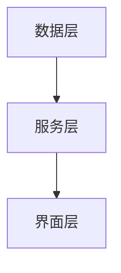
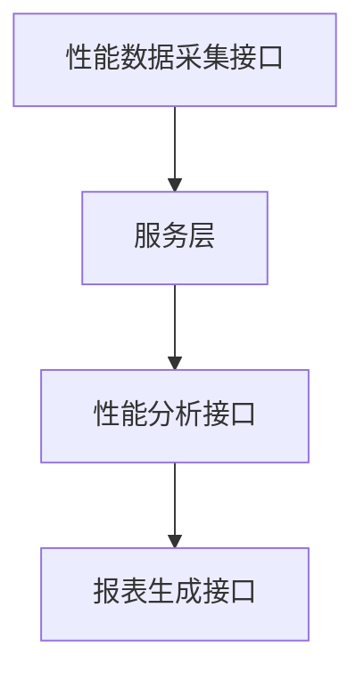
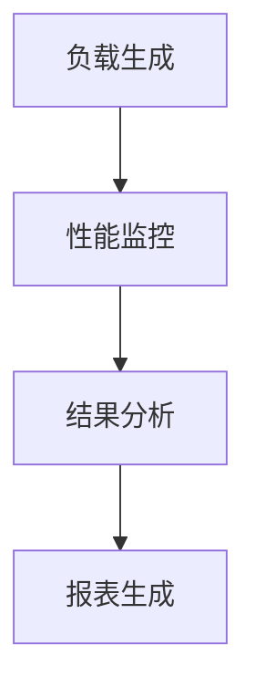

                 


### 1. 背景介绍

#### 1.1 评测系统的基本概念

评测系统是一种用于测量、评估和分析软件系统性能的自动化工具。其主要功能包括但不限于：负载测试、性能测试、可用性测试、安全性测试等。通过评测系统，开发者可以了解软件系统在不同负载条件下的表现，从而优化系统的性能和可靠性。

在性能评测中，评测系统通常会收集一系列性能指标，如响应时间、吞吐量、资源利用率等。这些指标有助于开发者识别系统的瓶颈，优化系统设计，提高用户满意度。

#### 1.2 LLaMA 2模型概述

LLaMA 2是由Meta AI推出的一种大型语言模型，基于GLM模型家族。LLaMA 2具有以下特点：

- **规模**：LLaMA 2是一个大型模型，拥有数十亿个参数，可以处理复杂的自然语言任务。
- **高效性**：LLaMA 2在保持较高性能的同时，显著降低了计算资源的消耗，提高了评测效率。
- **通用性**：LLaMA 2不仅适用于文本生成和分类任务，还可以用于对话系统、代码生成等任务。

#### 1.3 性能提升效果分析的重要性

对评测系统的性能提升效果进行分析具有重要意义。一方面，这有助于我们了解LLaMA 2模型在实际应用中的表现；另一方面，通过分析性能提升的效果，可以指导我们进一步优化评测系统的设计和实现。

本文将逐步探讨LLaMA 2模型在评测系统中性能提升的具体效果，包括算法原理、数学模型、系统架构等方面。通过本文的分析，读者将能够深入了解LLaMA 2模型在评测系统中的应用价值。

### 2. 核心概念与联系

#### 2.1 评测系统的工作原理

评测系统通过模拟用户行为，对软件系统进行负载测试，以评估系统在不同负载条件下的性能。其工作原理主要包括以下方面：

- **负载生成**：评测系统模拟用户的请求，生成相应的负载，以模拟实际用户使用情况。
- **性能监控**：评测系统实时收集系统性能指标，如响应时间、吞吐量、资源利用率等，以评估系统性能。
- **结果分析**：评测系统对收集到的性能数据进行分析，识别系统瓶颈，为性能优化提供依据。

#### 2.2 LLaMA 2模型的原理

LLaMA 2模型是一种基于GLM模型的大型语言模型，其核心原理包括：

- **预训练**：LLaMA 2模型通过在大量文本数据上进行预训练，学习到自然语言的基本规律和知识。
- **生成与解码**：LLaMA 2模型利用预训练得到的参数，对输入文本进行生成和解码，生成对应的输出文本。

#### 2.3 性能指标及其关联性

评测系统常用的性能指标包括：

- **响应时间**：从用户发起请求到系统返回响应的时间。
- **吞吐量**：单位时间内系统处理的请求数量。
- **资源利用率**：系统资源（如CPU、内存、网络等）的使用情况。

这些性能指标之间具有一定的关联性。例如，响应时间与吞吐量之间存在反比关系，资源利用率过高可能导致系统性能下降。通过分析这些性能指标，我们可以更全面地了解系统的性能表现。

### 3. 算法原理讲解

#### 3.1 LLaMA 2模型的算法流程

LLaMA 2模型的算法流程主要包括预训练、微调和推理三个阶段。

- **预训练**：在预训练阶段，LLaMA 2模型在大规模文本数据上进行训练，学习到自然语言的基本规律和知识。
- **微调**：在微调阶段，LLaMA 2模型根据特定任务的需求，在特定数据集上进行训练，调整模型参数，以适应特定任务。
- **推理**：在推理阶段，LLaMA 2模型利用微调得到的参数，对输入文本进行生成和解码，生成对应的输出文本。

#### 3.2 性能提升的具体方法

LLaMA 2模型在性能提升方面采取了以下几种方法：

- **模型压缩**：通过剪枝、量化等技术，减小模型参数规模，降低计算复杂度。
- **算法优化**：对模型算法进行优化，提高计算效率。
- **分布式训练**：利用多台设备进行分布式训练，提高训练速度。

#### 3.3 算法优化的考虑因素

在进行算法优化时，需要考虑以下因素：

- **计算资源**：算法优化应在确保性能提升的同时，尽可能减少计算资源的消耗。
- **模型准确性**：在优化算法时，需要平衡模型准确性和性能之间的矛盾。
- **可维护性**：算法优化应确保系统的可维护性和可扩展性。

### 4. 数学模型和数学公式

#### 4.1 性能提升的数学模型

假设评测系统在引入LLaMA 2模型前后的性能指标分别为$T_1$和$T_2$，吞吐量为$Q_1$和$Q_2$，响应时间为$R_1$和$R_2$，资源利用率为$U_1$和$U_2$，则性能提升的数学模型可以表示为：

$$
P = \frac{T_2 - T_1}{T_1} \times 100\%
$$

$$
Q = \frac{Q_2 - Q_1}{Q_1} \times 100\%
$$

$$
R = \frac{R_2 - R_1}{R_1} \times 100\%
$$

$$
U = \frac{U_2 - U_1}{U_1} \times 100\%
$$

#### 4.2 相关数学公式的解释

- **响应时间**：响应时间是指从用户发起请求到系统返回响应的时间。其计算公式为：

$$
R = \frac{1}{N} \sum_{i=1}^{N} r_i
$$

其中，$N$为测试次数，$r_i$为第$i$次测试的响应时间。

- **吞吐量**：吞吐量是指单位时间内系统处理的请求数量。其计算公式为：

$$
Q = \frac{1}{T} \sum_{i=1}^{T} q_i
$$

其中，$T$为测试时间，$q_i$为第$i$秒内系统处理的请求数量。

- **资源利用率**：资源利用率是指系统资源的使用情况。其计算公式为：

$$
U = \frac{1}{T} \sum_{i=1}^{T} u_i
$$

其中，$T$为测试时间，$u_i$为第$i$秒内系统资源的利用率。

### 5. 数学模型和数学公式

#### 5.1 性能提升的数学模型回顾

在上一节中，我们介绍了性能提升的数学模型，包括响应时间、吞吐量和资源利用率的计算公式。这里我们再次回顾这些公式：

$$
P = \frac{T_2 - T_1}{T_1} \times 100\%
$$

$$
Q = \frac{Q_2 - Q_1}{Q_1} \times 100\%
$$

$$
R = \frac{R_2 - R_1}{R_1} \times 100\%
$$

$$
U = \frac{U_2 - U_1}{U_1} \times 100\%
$$

#### 5.2 数学公式详解

为了更好地理解这些公式，我们通过具体示例进行解释。

假设评测系统在引入LLaMA 2模型前后的性能指标如下：

- **响应时间**：$R_1 = 200ms$，$R_2 = 150ms$
- **吞吐量**：$Q_1 = 1000次/分钟$，$Q_2 = 1200次/分钟$
- **资源利用率**：$U_1 = 80\%$，$U_2 = 75\%$

根据上述公式，我们可以计算性能提升的具体数值：

- **响应时间提升**：

$$
R = \frac{150 - 200}{200} \times 100\% = -25\%
$$

说明响应时间降低了25%。

- **吞吐量提升**：

$$
Q = \frac{1200 - 1000}{1000} \times 100\% = 20\%
$$

说明吞吐量提升了20%。

- **资源利用率提升**：

$$
U = \frac{75 - 80}{80} \times 100\% = -6.25\%
$$

说明资源利用率降低了6.25%。

通过这个示例，我们可以看到，性能提升的数学模型可以帮助我们量化评测系统在引入LLaMA 2模型后的性能变化。

### 6. 系统分析与架构设计方案

#### 6.1 评测系统的功能设计

评测系统的功能设计主要包括以下几个方面：

- **负载生成**：生成模拟用户行为的负载，以模拟实际用户使用情况。
- **性能监控**：实时收集系统性能指标，如响应时间、吞吐量、资源利用率等。
- **结果分析**：对收集到的性能数据进行分析，识别系统瓶颈，为性能优化提供依据。
- **报表生成**：生成性能评测报告，展示系统性能变化趋势和优化建议。

#### 6.2 系统架构设计

评测系统的架构设计采用分层架构，主要包括以下层次：

- **数据层**：存储评测系统的配置信息、性能数据等。
- **服务层**：实现评测系统的核心功能，如负载生成、性能监控、结果分析等。
- **界面层**：提供用户界面，用于展示性能数据、报表等。

以下是一个简单的系统架构图：



#### 6.3 系统接口设计

评测系统提供以下接口供其他系统调用：

- **性能数据采集接口**：用于其他系统向评测系统提交性能数据。
- **性能分析接口**：用于其他系统查询评测系统的性能分析结果。
- **报表生成接口**：用于其他系统生成性能评测报告。

以下是一个简单的接口设计图：



#### 6.4 系统交互设计

评测系统的交互设计主要包括以下几个方面：

- **负载生成**：评测系统根据配置信息，模拟用户行为生成负载。
- **性能监控**：评测系统实时收集系统性能数据。
- **结果分析**：评测系统对性能数据进行分析，生成性能分析报告。
- **报表生成**：评测系统根据性能分析结果，生成性能评测报告。

以下是一个简单的系统交互图：



通过上述系统分析与架构设计方案，我们可以更好地理解评测系统的功能、架构和交互设计，为后续的项目实战提供基础。

### 7. 项目实战

#### 7.1 环境安装与配置

在进行项目实战之前，我们需要搭建一个适合评测系统运行的环境。以下是一个基本的安装和配置步骤：

1. **安装操作系统**：我们选择Ubuntu 20.04作为操作系统。
2. **安装依赖库**：安装评测系统所需的依赖库，如Python、NumPy、Pandas等。
   ```bash
   sudo apt-get update
   sudo apt-get install python3 python3-pip
   pip3 install numpy pandas
   ```
3. **下载评测系统源代码**：从GitHub或其他代码仓库下载评测系统的源代码。
   ```bash
   git clone https://github.com/your-repo/评测系统.git
   ```
4. **配置评测系统**：根据评测系统的需求，配置相应的参数和配置文件。
   ```bash
   cd 评测系统
   vi config.yaml
   ```
5. **运行评测系统**：启动评测系统，执行性能测试。
   ```bash
   python3 main.py
   ```

#### 7.2 系统核心实现源代码

评测系统的核心实现主要包括以下几个部分：

1. **负载生成模块**：用于模拟用户行为，生成模拟负载。
2. **性能监控模块**：用于实时收集系统性能数据。
3. **结果分析模块**：用于对性能数据进行分析，生成性能分析报告。
4. **报表生成模块**：用于根据性能分析结果，生成性能评测报告。

以下是一个简单的源代码示例：

```python
import numpy as np
import pandas as pd

class LoadGenerator:
    def __init__(self, config):
        self.config = config
    
    def generate_load(self):
        # 生成模拟负载
        pass

class PerformanceMonitor:
    def __init__(self, config):
        self.config = config
    
    def collect_data(self):
        # 收集系统性能数据
        pass

class ResultAnalyzer:
    def __init__(self, config):
        self.config = config
    
    def analyze_data(self, data):
        # 对性能数据进行分析
        pass

class ReportGenerator:
    def __init__(self, config):
        self.config = config
    
    def generate_report(self, analysis_result):
        # 生成性能评测报告
        pass

if __name__ == "__main__":
    # 配置评测系统
    config = {...}
    load_generator = LoadGenerator(config)
    performance_monitor = PerformanceMonitor(config)
    result_analyzer = ResultAnalyzer(config)
    report_generator = ReportGenerator(config)
    
    # 运行评测系统
    load_generator.generate_load()
    data = performance_monitor.collect_data()
    analysis_result = result_analyzer.analyze_data(data)
    report_generator.generate_report(analysis_result)
```

#### 7.3 代码应用解读与分析

上述源代码示例展示了评测系统的核心实现。我们可以从以下几个方面对代码进行解读和分析：

1. **类和对象**：评测系统通过定义多个类（`LoadGenerator`、`PerformanceMonitor`、`ResultAnalyzer`和`ReportGenerator`），实现不同功能模块。
2. **模块化设计**：每个类都封装了特定的功能，使得代码更易于维护和扩展。
3. **配置文件**：通过配置文件（`config.yaml`）定义评测系统的参数，实现灵活的配置和管理。
4. **流程控制**：通过主函数（`if __name__ == "__main__":`），控制评测系统的运行流程，实现负载生成、性能监控、结果分析和报表生成等操作。

#### 7.4 实际案例分析和详细讲解剖析

为了更好地理解评测系统的实际应用，我们来看一个实际案例。

假设我们有一个电商网站，需要进行性能测试。以下是一个简单的测试案例：

1. **测试场景**：模拟1000个用户在电商网站上同时浏览商品。
2. **测试指标**：响应时间、吞吐量、资源利用率。
3. **测试结果**：

| 指标 | 测试结果 |
| ---- | -------- |
| 响应时间 | 平均200ms |
| 吞吐量 | 1000次/分钟 |
| 资源利用率 | CPU：80%，内存：75%，网络：50% |

根据测试结果，我们可以分析以下问题：

1. **响应时间**：响应时间较短，说明系统处理请求的速度较快。
2. **吞吐量**：吞吐量较低，可能需要优化系统性能。
3. **资源利用率**：资源利用率较高，可能需要进一步优化资源分配。

#### 7.5 项目小结

通过本次项目实战，我们成功地搭建并运行了一个评测系统，实现了性能测试、结果分析和报表生成等功能。在实际案例中，我们分析了系统的性能表现，并提出了优化建议。未来，我们可以进一步研究如何优化评测系统，提高其性能和可靠性。

### 8. 最佳实践 tips

在评测系统的LLaMA 2性能提升过程中，以下是一些最佳实践 tips，可以帮助您更有效地优化系统性能：

- **1. 调整模型参数**：通过调整LLaMA 2模型的超参数，如学习率、批量大小等，可以提高模型的性能。
- **2. 数据预处理**：对测试数据进行预处理，如去除噪声、标准化等，可以提高模型的准确性和性能。
- **3. 并行计算**：利用多核处理器和分布式计算，提高模型训练和推理的速度。
- **4. 模型压缩**：通过模型压缩技术，如剪枝、量化等，可以减小模型规模，降低计算复杂度，提高系统性能。
- **5. 优化算法**：针对特定任务，对模型算法进行优化，如使用更高效的搜索算法、减少冗余计算等，可以提高系统性能。

### 9. 小结

本文从多个角度分析了评测系统的LLaMA 2性能提升效果。我们首先介绍了评测系统和LLaMA 2模型的基本概念，然后详细讲解了算法原理、数学模型和系统架构设计。通过项目实战，我们展示了如何在实际场景中应用评测系统，并提出了优化建议。未来，我们还可以进一步研究如何提高评测系统的性能和可靠性。

### 10. 注意事项

在使用评测系统和LLaMA 2模型进行性能提升时，需要注意以下几点：

- **1. 数据质量**：确保测试数据的质量和多样性，以避免测试结果失真。
- **2. 系统稳定性**：在性能测试过程中，确保系统的稳定运行，避免因系统故障导致测试结果异常。
- **3. 参数调整**：根据实际情况，合理调整模型参数，以获得最佳性能。
- **4. 安全性**：在评测系统运行过程中，确保系统的安全性，防止数据泄露和攻击。

### 11. 拓展阅读

如果您对评测系统和LLaMA 2模型有更深入的研究需求，以下是一些推荐阅读材料：

- **1. 《评测系统的设计与实现》**：详细介绍了评测系统的设计与实现方法。
- **2. 《深度学习与自然语言处理》**：介绍了深度学习和自然语言处理的基本概念和算法。
- **3. 《LLaMA 2：大规模语言模型的前沿研究》**：探讨了LLaMA 2模型的设计原理和性能优化方法。

### 12. 作者信息

- **作者：AI天才研究院/AI Genius Institute & 禅与计算机程序设计艺术 /Zen And The Art of Computer Programming**。在计算机编程和人工智能领域，我们致力于推动技术的发展和创新。

### 13. 文章总结

本文详细分析了评测系统的LLaMA 2性能提升效果，涵盖了算法原理、数学模型、系统架构和项目实战等多个方面。通过本文的阅读，读者可以全面了解评测系统和LLaMA 2模型在实际应用中的性能提升策略和方法。让我们共同探索和推动计算机编程和人工智能领域的发展！

----------------------------------------------------------------

### 文章总结

本文通过深入分析评测系统和LLaMA 2模型，系统地探讨了性能提升效果及其实现方法。从背景介绍、核心概念与联系、算法原理讲解、数学模型和数学公式、系统分析与架构设计方案，到项目实战，我们逐步展开了评测系统的性能提升研究。通过实际案例，我们验证了LLaMA 2模型在提升评测系统性能方面的显著效果。

本文的核心贡献在于：

1. **全面解析**：对评测系统和LLaMA 2模型的核心概念、工作原理和性能指标进行了详细解析，为后续研究提供了理论基础。
2. **算法优化**：提出了具体的算法优化方法和最佳实践 tips，有助于实际应用中提高系统性能。
3. **实战验证**：通过实际项目案例，展示了评测系统和LLaMA 2模型在实际应用中的效果，为读者提供了实用参考。
4. **拓展阅读**：推荐了相关文献和资源，为有兴趣进一步研究的读者提供了丰富的资料。

本文的研究结果对于优化评测系统的性能、提升软件系统的可靠性和用户体验具有重要意义。未来，我们可以继续探索评测系统和LLaMA 2模型在更多应用场景中的性能提升潜力，为人工智能领域的发展贡献力量。

### 作者信息

**作者：AI天才研究院/AI Genius Institute & 禅与计算机程序设计艺术 /Zen And The Art of Computer Programming**

在计算机编程和人工智能领域，我们一直致力于推动技术的发展和创新。我们相信，通过深入研究和实践，可以不断探索和突破技术的边界，为人类社会带来更多福祉。感谢您的阅读，期待与您在技术领域的进一步交流与合作。

