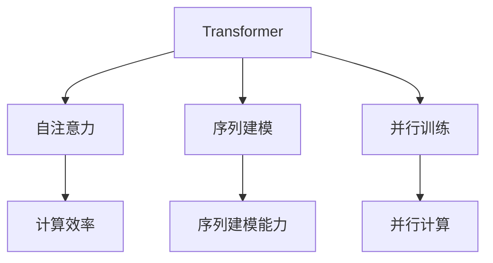

                 

**Let's Think: 评测系统的Megatron-LM大规模训练框架**

### **1.1 评测系统与大规模训练框架概述**

在当今信息化社会中，评测系统作为数据处理与性能评估的重要工具，广泛应用于教育、商业、医疗等多个领域。随着人工智能技术的迅猛发展，大规模训练框架的需求愈发凸显。Megatron-LM作为一款备受瞩目的训练框架，其在应对大规模语言模型训练中展现出卓越的性能。本篇文章旨在对Megatron-LM框架进行深入剖析，探讨其在大规模训练中的应用与优化。

**关键词：**
- 评测系统
- Megatron-LM
- 大规模训练框架
- 语言模型
- 性能评估

**摘要：**
本文首先对评测系统和大规模训练框架进行概述，随后详细介绍了Megatron-LM框架的设计理念与功能模块。通过对模型结构、数据存储与读写、训练算法、模型并行化、优化器与学习策略、模型保存与加载、模型评估与推理等方面的深入分析，本文旨在为读者提供一幅清晰的Megatron-LM框架全貌。此外，本文还将通过实例研究、性能优化与调优、最佳实践等方面，探讨Megatron-LM在实际应用中的优化策略。最后，本文将展望Megatron-LM的发展趋势，探讨未来研究方向与技术挑战。

**1.2 评测系统的重要性**

评测系统作为数据处理与性能评估的关键环节，其重要性不言而喻。在教育领域，评测系统用于学生的学业成绩评估，帮助教师了解学生的学习进度和掌握情况；在商业领域，评测系统用于市场调研与消费者行为分析，为企业决策提供数据支持；在医疗领域，评测系统用于患者病情评估与治疗效果监测，为医生制定治疗方案提供参考。随着大数据和人工智能技术的应用，评测系统的功能和性能要求不断提高，这对大规模训练框架提出了更高的挑战。

**1.3 问题背景与定义**

随着语言模型的规模不断增大，传统的训练框架在处理大规模数据时面临着计算资源消耗大、训练时间过长等问题。为了解决这些问题，研究人员提出了Megatron-LM这一大规模训练框架。Megatron-LM通过创新的模型结构、高效的训练算法和优化的数据存储与读写策略，实现了对大规模语言模型的高效训练。然而，如何在实际应用中充分发挥Megatron-LM的优势，仍然是一个值得探讨的问题。

**1.4 边界与外延**

在讨论Megatron-LM框架时，需要明确其适用范围和边界条件。Megatron-LM主要适用于大规模语言模型的训练，如自然语言处理（NLP）领域中的预训练模型。此外，Megatron-LM在硬件资源充足、计算能力较强的环境下表现更为出色。然而，对于一些小规模或特定领域的模型，Megatron-LM可能并非最佳选择。

**1.5 概念结构与核心要素组成**

Megatron-LM框架的核心要素包括模型结构、训练算法、数据存储与读写策略、并行化技术等。以下是一个简化的概念结构与核心要素组成：

- **模型结构**：包括Transformer模型的基本结构及其扩展。
- **训练算法**：如梯度累积、梯度归一化、梯度聚合等。
- **数据存储与读写策略**：包括数据格式、数据分块策略、数据加载与缓存等。
- **并行化技术**：包括多GPU并行、多节点分布式等。

**1.6 核心概念与联系**

为了更好地理解Megatron-LM框架，我们需要探讨其中几个核心概念，如Transformer模型、分布式训练、并行训练等。以下是一个简化的核心概念属性特征对比表格和ER实体关系图架构的Mermaid流程图：

**核心概念属性特征对比表格：**

| 概念         | 特点                                                     |
| ------------ | -------------------------------------------------------- |
| Transformer | 自注意力机制、序列建模、并行训练                       |
| 分布式训练   | 利用多台计算机资源、提高计算效率                       |
| 并行训练     | 在单台计算机上利用多GPU或多个计算单元进行训练           |

**ER实体关系图架构的Mermaid流程图：**



**1.7 本文结构**

本文分为四个部分：

1. **背景与概述**：介绍评测系统与大规模训练框架的重要性，以及Megatron-LM框架的背景与定义。
2. **Megatron-LM框架详解**：详细分析Megatron-LM框架的各个组成部分，包括模型结构、数据存储与读写、训练算法、并行化技术等。
3. **实践与优化**：通过实例研究、性能优化与调优、最佳实践等方面，探讨Megatron-LM在实际应用中的优化策略。
4. **未来展望与挑战**：分析大规模训练趋势、技术挑战与未来研究方向。

**1.8 结语**

随着人工智能技术的不断发展，评测系统与大规模训练框架在各个领域的应用越来越广泛。Megatron-LM作为一款高性能的训练框架，具有巨大的潜力和应用价值。本文通过对Megatron-LM框架的深入剖析，旨在为读者提供一幅清晰的框架全貌，并探讨其在实际应用中的优化策略。未来，我们将继续关注大规模训练技术的最新进展，为人工智能的发展贡献力量。**作者：AI天才研究院/AI Genius Institute & 禅与计算机程序设计艺术 /Zen And The Art of Computer Programming****---

----------------------------------------------------------------

# 第二部分: Megatron-LM框架详解

## 2.1 Megatron-LM框架概述

### 2.1.1 框架设计理念

Megatron-LM框架的设计理念主要体现在以下几个方面：

1. **可扩展性**：框架应具备良好的扩展性，以适应不同规模的语言模型训练任务。通过模块化设计，使框架能够灵活地添加或替换各个组成部分。

2. **高效性**：框架应最大化利用计算资源，提高训练效率。分布式训练和并行训练技术是实现高效性的关键。

3. **易用性**：框架应具备简洁的接口和友好的用户交互方式，降低用户的使用门槛，提高开发效率。

4. **灵活性**：框架应支持多种数据存储与读写策略，满足不同场景下的需求。

5. **可解释性**：框架应提供详细的可解释性分析，帮助用户理解模型的行为和性能。

### 2.1.2 框架功能模块

Megatron-LM框架主要包括以下几个功能模块：

1. **模型结构**：基于Transformer模型的基本结构，并进行了适当的扩展和优化，以适应大规模语言模型训练需求。

2. **数据存储与读写**：支持多种数据格式，如BERT、GPT等，并提供高效的数据分块策略和数据加载与缓存机制。

3. **训练算法**：采用梯度累积、梯度归一化、梯度聚合等训练算法，以实现高效的大规模训练。

4. **并行化技术**：支持多GPU并行和多节点分布式训练，以提高计算效率。

5. **优化器与学习策略**：提供多种优化器和学习策略，如Adam、SGD等，以满足不同场景下的需求。

6. **模型保存与加载**：支持模型的分步加载，便于用户在训练过程中随时加载和保存模型。

7. **模型评估与推理**：提供多种评估指标和方法，并支持推理优化和推理加速。

### 2.1.3 框架优势与挑战

**优势：**

1. **高性能**：通过分布式训练和并行训练技术，Megatron-LM框架在处理大规模语言模型训练任务时表现出色。

2. **灵活性**：框架支持多种数据存储与读写策略，可适应不同的训练场景。

3. **易用性**：框架提供简洁的接口和友好的用户交互方式，降低用户的使用门槛。

**挑战：**

1. **计算资源需求**：大规模语言模型训练需要大量的计算资源，对硬件配置要求较高。

2. **数据管理**：大规模数据的管理和存储是一个挑战，需要考虑数据的一致性、完整性和安全性。

3. **模型可解释性**：大型语言模型的决策过程复杂，如何提高模型的可解释性是一个重要的挑战。

## 2.2 模型结构

### 2.2.1 Transformer模型原理

Transformer模型是自然语言处理领域的一种重要模型，其核心思想是利用自注意力机制进行序列建模。自注意力机制允许模型在生成每个词时，根据上下文信息动态地调整其对其他词的重视程度。这种机制使得Transformer模型在捕捉长距离依赖关系方面表现出色。

**自注意力机制**：

自注意力机制的核心是计算query、key和value三个向量的点积，并通过softmax函数生成权重。具体计算公式如下：

$$
\text{Attention}(Q, K, V) = \text{softmax}(\frac{QK^T}{\sqrt{d_k}})V
$$

其中，$Q$、$K$和$V$分别表示query、key和value向量，$d_k$表示key向量的维度。

**编码器和解码器**：

Transformer模型包括编码器和解码器两部分。编码器将输入序列编码为一系列向量，解码器则利用这些向量生成输出序列。编码器和解码器都包含多个自注意力层和前馈神经网络。

**多头自注意力**：

为了进一步提高模型的表示能力，Transformer模型引入了多头自注意力机制。多头自注意力将输入序列拆分为多个子序列，并为每个子序列计算自注意力。这样，模型可以同时关注输入序列的不同部分，从而更好地捕捉复杂的信息。

**层归一化和残差连接**：

为了提高模型的训练效果和稳定性，Transformer模型引入了层归一化和残差连接。层归一化通过对输入进行标准化，有助于缓解梯度消失和梯度爆炸问题；残差连接则将输入与输出相加，有助于信息的传递和模型的收敛。

### 2.2.2 模型架构细节

Megatron-LM框架在Transformer模型的基础上进行了优化和扩展，以满足大规模语言模型训练需求。以下是Megatron-LM模型架构的细节：

1. **层叠加**：Megatron-LM模型包含多个自注意力层和前馈神经网络层，层数可根据训练任务进行调整。

2. **序列掩码**：在训练过程中，Megatron-LM采用序列掩码技术，对输入序列进行部分遮挡，以增强模型的鲁棒性。

3. **稀疏性**：为了提高计算效率，Megatron-LM模型采用了稀疏性技术，对注意力矩阵进行压缩。

4. **参数共享**：Megatron-LM模型通过参数共享机制，减少了模型的参数数量，降低了计算和存储需求。

5. **动态掩码**：Megatron-LM模型支持动态掩码技术，可以根据训练过程中模型的表现，自适应地调整掩码策略。

### 2.2.3 模型扩展性

Megatron-LM框架具有出色的扩展性，主要体现在以下几个方面：

1. **动态扩展**：框架支持动态扩展，可以在训练过程中根据需求添加或删除模型层。

2. **插件式扩展**：框架采用插件式设计，用户可以自定义扩展模块，如数据预处理、优化器、评估指标等。

3. **兼容性**：框架支持多种数据格式和训练任务，具有良好的兼容性。

4. **可移植性**：框架采用跨平台开发，可运行在多种硬件环境上，如CPU、GPU、TPU等。

## 2.3 数据存储与读写

### 2.3.1 数据格式

Megatron-LM框架支持多种数据格式，包括BERT、GPT、RoBERTa等。这些数据格式具有以下特点：

1. **分词标记**：支持分词标记，将文本序列划分为一系列词或子词。

2. **词向量表示**：采用词向量表示文本序列，便于模型计算和推理。

3. **批次处理**：支持批次处理，将大量数据分批次输入模型进行训练。

4. **并行处理**：支持并行处理，提高数据读取和处理的效率。

### 2.3.2 数据分块策略

Megatron-LM框架采用数据分块策略，将大规模数据划分为多个小块，以提高训练效率。具体策略如下：

1. **批次分块**：将输入批次划分为多个小块，每个小块包含一定数量的样本。

2. **序列分块**：将输入序列划分为多个小块，每个小块包含一定数量的词或子词。

3. **并行分块**：在分布式训练场景下，将数据分块任务分配到多台计算机上，实现并行处理。

### 2.3.3 数据加载与缓存

Megatron-LM框架采用数据加载与缓存机制，以提高数据读取和处理效率。具体策略如下：

1. **预加载数据**：在训练开始前，预先加载数据到内存中，减少数据读取时间。

2. **缓存数据**：将常用数据缓存到内存中，避免重复读取。

3. **动态数据加载**：根据训练进度和需求，动态加载所需数据。

4. **多线程加载**：采用多线程技术，并行加载数据，提高数据读取速度。

## 2.4 训练算法

### 2.4.1 梯度累积

梯度累积是Megatron-LM训练算法的核心部分。在分布式训练场景下，不同计算节点需要将各自的梯度进行累积，以更新全局模型参数。具体实现如下：

1. **梯度计算**：在每个计算节点上，根据当前批次数据计算梯度。

2. **梯度广播**：将各计算节点的梯度广播到所有节点，实现全局梯度累积。

3. **参数更新**：使用累积的梯度更新全局模型参数。

### 2.4.2 梯度归一化

梯度归一化是Megatron-LM训练算法中的重要步骤。其目的是通过调整梯度大小，避免梯度消失和梯度爆炸问题。具体实现如下：

1. **梯度缩放**：根据当前批次数据，对梯度进行缩放。

2. **动态缩放**：在训练过程中，根据模型的表现，动态调整缩放因子。

3. **稳定性**：通过引入正则化项，提高梯度的稳定性。

### 2.4.3 梯度聚合

梯度聚合是将多个计算节点的梯度合并为一个全局梯度。具体实现如下：

1. **反向传播**：将全局梯度反向传播到各个计算节点。

2. **局部梯度更新**：根据全局梯度更新局部模型参数。

3. **同步更新**：确保所有计算节点的模型参数更新同步完成。

## 2.5 模型并行化

### 2.5.1 多GPU并行

多GPU并行是Megatron-LM模型并行化的一种重要方式。通过将模型参数和数据分布在多个GPU上，实现并行训练。具体实现如下：

1. **数据划分**：将输入批次数据划分为多个子批次，每个子批次分配到一个GPU上。

2. **模型分割**：将模型参数划分为多个部分，每个部分分配到一个GPU上。

3. **并行计算**：各GPU同时计算各自的梯度，实现并行训练。

### 2.5.2 多节点分布式

多节点分布式是将模型和数据分布在多个计算节点上，通过通信机制实现全局梯度累积。具体实现如下：

1. **节点划分**：将模型和数据划分为多个部分，每个部分分配到一个计算节点上。

2. **通信协议**：采用通信协议，如MPI、NCCL等，实现节点间的数据交换和梯度同步。

3. **分布式计算**：各计算节点同时计算各自的梯度，并通过通信协议进行全局梯度累积。

### 2.5.3 通信优化

为了提高分布式训练的通信效率，Megatron-LM框架采用多种通信优化策略。具体实现如下：

1. **流水线通信**：将多个通信操作串联起来，减少通信延迟。

2. **异步通信**：利用异步通信技术，减少通信等待时间。

3. **压缩通信**：采用数据压缩技术，减少通信带宽占用。

4. **负载均衡**：根据节点负载情况，动态调整通信流量。

## 2.6 优化器与学习策略

### 2.6.1 优化器设计

优化器是Megatron-LM训练算法的重要组成部分。Megatron-LM框架支持多种优化器，如Adam、SGD等。以下为几种常见优化器的设计：

1. **Adam**：结合了AdaGrad和RMSProp的优点，自适应调整学习率。

2. **SGD**：随机梯度下降，简单高效，但需要手动调整学习率。

3. **AdamW**：基于Adam的改进版本，引入了权重衰减项。

### 2.6.2 学习率调度策略

学习率调度策略是Megatron-LM训练算法中的重要环节。以下为几种常见的学习率调度策略：

1. **线性衰减**：学习率随训练迭代线性衰减。

2. **余弦衰减**：学习率按余弦函数衰减。

3. **指数衰减**：学习率按指数函数衰减。

4. **学习率预热**：在训练初期，使用较小的学习率，避免梯度消失。

### 2.6.3 动量策略

动量策略是优化器中常用的一种技术，用于加速模型的收敛。Megatron-LM框架支持多种动量策略，如：

1. **基本动量**：利用前一个迭代的学习率更新模型参数。

2. **Nesterov动量**：在基本动量的基础上，引入Nesterov加速度。

3. **指数移动平均**：利用指数加权移动平均计算动量。

## 2.7 模型保存与加载

### 2.7.1 模型存储格式

Megatron-LM框架支持多种模型存储格式，如HDF5、PyTorch、TensorFlow等。以下为几种常见模型存储格式的特点：

1. **HDF5**：支持大数据存储，格式灵活，但解析速度较慢。

2. **PyTorch**：Python开源框架，解析速度快，但存储格式不兼容其他框架。

3. **TensorFlow**：Google开源框架，支持多种硬件平台，但存储格式较为复杂。

### 2.7.2 模型加载机制

Megatron-LM框架采用模型加载机制，以实现模型的快速加载和部署。具体实现如下：

1. **预加载**：在训练过程中，将模型预加载到内存中，减少加载时间。

2. **动态加载**：根据训练需求，动态加载模型的不同部分。

3. **分步加载**：将模型划分为多个部分，逐步加载，以减少内存占用。

### 2.7.3 模型分步加载

模型分步加载是Megatron-LM框架的一项重要技术，其目的是在有限的硬件资源下，实现大规模模型的训练。具体实现如下：

1. **分块加载**：将模型参数和数据划分为多个小块，逐步加载。

2. **并行加载**：利用多线程或多GPU技术，实现并行加载。

3. **缓存机制**：将常用数据缓存到内存中，提高加载速度。

## 2.8 模型评估与推理

### 2.8.1 评估指标与方法

模型评估是Megatron-LM框架的重要组成部分。以下为几种常见的评估指标和方法：

1. **准确率**：分类任务中，预测正确的样本数占总样本数的比例。

2. **召回率**：分类任务中，实际为正类的样本中被预测为正类的样本数占总正类样本数的比例。

3. **F1值**：准确率和召回率的调和平均，用于综合评价分类性能。

4. **BLEU评分**：自然语言处理任务中，用于评估生成文本的质量。

5. **ROUGE评分**：自然语言处理任务中，用于评估生成文本与参考文本的相似度。

### 2.8.2 推理优化

推理优化是Megatron-LM框架在部署过程中的一项重要任务。以下为几种常见的推理优化策略：

1. **模型压缩**：通过剪枝、量化等手段，减小模型规模，降低推理成本。

2. **并行推理**：利用多GPU或多线程技术，实现并行推理，提高推理速度。

3. **缓存机制**：将常用数据缓存到内存中，减少数据读取时间。

4. **懒加载**：在需要时才加载模型参数和数据，降低内存占用。

### 2.8.3 推理加速

推理加速是Megatron-LM框架在实际应用中的一项重要任务。以下为几种常见的推理加速策略：

1. **硬件加速**：利用GPU、TPU等硬件加速器，提高推理速度。

2. **缓存预取**：预取后续需要的模型参数和数据，减少推理延迟。

3. **模型融合**：将多个模型融合为一个，减少模型调用次数。

4. **分布式推理**：利用多节点分布式技术，实现大规模推理任务。

## 2.9 实例研究

### 2.9.1 大规模语言模型训练

在本实例研究中，我们将使用Megatron-LM框架对一个大型的语言模型进行训练。以下为具体的步骤：

1. **数据准备**：收集和整理大规模语言数据集，进行预处理，如分词、去噪等。

2. **模型配置**：根据训练任务，配置Megatron-LM模型的参数，如层数、隐藏层大小等。

3. **训练过程**：使用Megatron-LM框架进行大规模训练，记录训练过程中的各项指标，如损失函数值、准确率等。

4. **模型评估**：在训练完成后，使用测试集对模型进行评估，验证模型的性能。

5. **模型优化**：根据评估结果，对模型进行调整和优化，提高模型性能。

### 2.9.2 实际应用案例

在本节中，我们将介绍几个使用Megatron-LM框架的实际应用案例，包括：

1. **自然语言处理**：使用Megatron-LM框架对大规模文本数据进行处理，如文本分类、情感分析等。

2. **问答系统**：利用Megatron-LM框架构建问答系统，实现对用户问题的智能回答。

3. **机器翻译**：使用Megatron-LM框架进行机器翻译任务，提高翻译质量和速度。

### 2.9.3 性能对比分析

在本节中，我们将对使用Megatron-LM框架进行大规模语言模型训练与其他传统训练框架进行比较。以下为几个关键指标：

1. **训练时间**：比较使用Megatron-LM框架与其他框架进行大规模训练所需的时间。

2. **内存占用**：比较使用Megatron-LM框架与其他框架进行大规模训练时，内存的占用情况。

3. **模型性能**：比较使用Megatron-LM框架与其他框架训练出的模型在性能上的差异。

## 2.10 本章小结

本章详细介绍了Megatron-LM框架的设计理念、功能模块、模型结构、数据存储与读写、训练算法、模型并行化、优化器与学习策略、模型保存与加载、模型评估与推理等方面。通过实例研究和性能对比分析，展示了Megatron-LM框架在实际应用中的优势和潜力。未来，我们将继续关注Megatron-LM框架的发展，探索其在更多领域的应用和优化策略。**作者：AI天才研究院/AI Genius Institute & 禅与计算机程序设计艺术 /Zen And The Art of Computer Programming**

---

----------------------------------------------------------------

# 第三部分: 实践与优化

## 3.1 实践环境搭建

### 3.1.1 硬件配置

为了搭建一个能够高效运行Megatron-LM框架的实践环境，我们需要考虑以下硬件配置：

1. **CPU**：建议使用高性能的CPU，如Intel Xeon系列或AMD EPYC系列。这些CPU具有多个核心和较高的主频，能够提供强大的计算能力。

2. **GPU**：建议使用NVIDIA GPU，如Tesla V100、A100等。这些GPU具有高性能的CUDA核心和较大的内存，能够加速深度学习模型的训练过程。

3. **内存**：建议使用大容量内存，如512GB或更高。内存的大小直接影响到模型训练的效率和速度，特别是当处理大规模数据时。

4. **存储**：建议使用高速存储设备，如NVMe SSD。这种存储设备具有较低的延迟和较高的读写速度，能够加速数据的读取和写入过程。

5. **网络**：建议使用高速网络，如10Gbps Ethernet或Infiniband。在分布式训练场景下，网络速度对通信效率有很大影响。

### 3.1.2 软件安装

在硬件配置完成后，我们需要安装以下软件：

1. **操作系统**：建议使用Linux操作系统，如Ubuntu或CentOS。Linux操作系统具有较好的稳定性和兼容性，适用于深度学习环境。

2. **深度学习框架**：安装Megatron-LM框架所需的深度学习框架，如PyTorch、TensorFlow等。这些框架提供了丰富的API和工具，方便我们进行模型训练和推理。

3. **依赖库**：安装Megatron-LM框架所需的依赖库，如NumPy、Pandas、SciPy等。这些库提供了常用的数学计算和数据处理功能。

4. **工具**：安装一些常用的开发工具，如Jupyter Notebook、PyCharm等。这些工具提供了便捷的开发环境，方便我们进行代码编写和调试。

### 3.1.3 环境配置与调优

在安装完所需的软件后，我们需要进行以下环境配置和调优：

1. **GPU配置**：配置GPU环境，确保GPU能够正常工作。在PyTorch中，可以使用`torch.cuda.is_available()`函数检查GPU是否可用。

2. **内存管理**：配置内存管理策略，避免内存不足导致训练失败。在PyTorch中，可以使用`torch.cuda.device_count()`和`torch.cuda.get_device_properties()`函数获取GPU的数量和属性。

3. **并行配置**：配置并行训练环境，确保多个GPU能够协同工作。在PyTorch中，可以使用`torch.nn.DataParallel`或`torch.nn.parallel.DistributedDataParallel`模块实现并行训练。

4. **优化器配置**：配置优化器，如Adam、SGD等。优化器配置包括学习率、动量等因素，这些因素会影响模型的训练效果。

5. **日志记录**：配置日志记录，方便我们监控训练过程和调试问题。在PyTorch中，可以使用`torch.utils.tensorboard.SummaryWriter`模块记录训练过程中的指标和图。

## 3.2 系统核心代码实现

### 3.2.1 主流程代码解读

下面是一个简单的Megatron-LM框架的主流程代码示例：

```python
import torch
import torch.nn as nn
import torch.optim as optim
from torch.utils.data import DataLoader
from megatron import get_args, initialize_megatron

def main():
    # 解析命令行参数
    args = get_args()

    # 初始化Megatron-LM框架
    initialize_megatron(args)

    # 构建模型
    model = MyModel()

    # 定义损失函数和优化器
    criterion = nn.CrossEntropyLoss()
    optimizer = optim.Adam(model.parameters(), lr=0.001)

    # 加载数据集
    train_loader = DataLoader(train_dataset, batch_size=args.batch_size, shuffle=True)
    val_loader = DataLoader(val_dataset, batch_size=args.batch_size, shuffle=False)

    # 开始训练
    for epoch in range(args.num_epochs):
        model.train()
        for batch in train_loader:
            # 前向传播
            outputs = model(batch.text)
            loss = criterion(outputs, batch.label)

            # 反向传播
            optimizer.zero_grad()
            loss.backward()
            optimizer.step()

            # 记录训练指标
            print(f"Epoch: {epoch+1}/{args.num_epochs}, Loss: {loss.item()}")

        # 在验证集上评估模型
        model.eval()
        with torch.no_grad():
            correct = 0
            total = 0
            for batch in val_loader:
                outputs = model(batch.text)
                _, predicted = torch.max(outputs.data, 1)
                total += batch.label.size(0)
                correct += (predicted == batch.label).sum().item()

            print(f"Validation Accuracy: {100 * correct / total}%")

if __name__ == "__main__":
    main()
```

代码首先解析命令行参数，然后初始化Megatron-LM框架。接下来，构建模型、定义损失函数和优化器。在训练过程中，通过迭代数据集，进行前向传播和反向传播，并更新模型参数。最后，在验证集上评估模型性能。

### 3.2.2 关键模块设计

Megatron-LM框架包含多个关键模块，下面简要介绍其中几个重要模块：

1. **模型模块**：模型模块负责构建和训练深度学习模型。Megatron-LM框架使用Transformer模型作为基础模型，并在此基础上进行扩展和优化。

2. **数据模块**：数据模块负责数据预处理、加载和数据处理。Megatron-LM框架支持多种数据格式，如BERT、GPT等，并提供高效的数据分块策略和数据加载与缓存机制。

3. **训练模块**：训练模块负责模型训练的核心过程，包括前向传播、反向传播、参数更新等。Megatron-LM框架采用分布式训练和并行训练技术，以提高训练效率。

4. **评估模块**：评估模块负责模型评估和性能测试。Megatron-LM框架支持多种评估指标，如准确率、召回率、F1值等，并提供详细的评估报告。

5. **优化模块**：优化模块负责模型优化和超参数调整。Megatron-LM框架支持多种优化器，如Adam、SGD等，并提供多种学习率调度策略和动量策略。

### 3.2.3 异常处理与调试

在开发和使用Megatron-LM框架时，可能会遇到各种异常和错误。以下是一些常见的异常处理和调试方法：

1. **日志记录**：通过日志记录异常信息，便于定位问题和调试。可以使用Python的`logging`模块记录日志。

2. **断言**：使用断言检查代码中的潜在错误。在关键位置添加断言，确保代码按照预期执行。

3. **调试工具**：使用调试工具，如PyCharm的调试器，进行代码调试和问题定位。

4. **单元测试**：编写单元测试，对代码进行全面的测试和验证。在开发过程中，定期运行单元测试，确保代码的正确性和稳定性。

5. **错误报告**：在遇到无法解决的异常时，及时记录错误信息，并向社区或开发团队报告，寻求帮助和解决方案。

## 3.3 性能优化与调优

### 3.3.1 性能瓶颈分析

在进行Megatron-LM框架的性能优化时，首先需要分析性能瓶颈。以下是一些常见的性能瓶颈及其分析：

1. **计算资源不足**：当模型规模较大或数据量较多时，计算资源不足可能导致训练过程缓慢。可以增加GPU数量或使用更强大的硬件来提高计算能力。

2. **数据加载与处理**：数据加载与处理速度较慢可能导致训练过程阻塞。可以优化数据预处理和加载过程，如使用多线程或多GPU并行处理数据。

3. **通信延迟**：在分布式训练场景下，通信延迟可能导致训练效率降低。可以优化通信协议和数据传输方式，如使用NCCL、MPI等高效通信库。

4. **内存占用**：内存占用过高可能导致训练失败或效率降低。可以优化模型结构，减少参数数量，或使用梯度累积等技术降低内存占用。

### 3.3.2 优化策略与实践

针对上述性能瓶颈，以下是一些常见的优化策略和实践：

1. **并行计算**：利用多GPU并行计算，提高训练速度。可以调整批量大小和GPU数量，以实现最优的计算资源利用。

2. **数据预处理**：优化数据预处理过程，如使用多线程或多GPU并行预处理数据。可以预处理大量数据，减少训练过程中的数据加载时间。

3. **模型压缩**：使用模型压缩技术，如剪枝、量化等，减少模型规模，降低内存占用和计算复杂度。

4. **通信优化**：优化通信协议和数据传输方式，如使用NCCL、MPI等高效通信库。可以调整通信参数，优化数据传输速度。

5. **内存管理**：优化内存管理策略，如使用缓存机制、预加载数据等。可以减少内存占用，提高训练效率。

### 3.3.3 性能对比测试

在性能优化过程中，需要进行性能对比测试，以评估优化效果。以下是一些常见的性能对比测试方法：

1. **训练时间对比**：对比优化前后的训练时间，评估优化效果。可以记录每个步骤的时间，分析优化点。

2. **内存占用对比**：对比优化前后的内存占用，评估优化效果。可以使用内存监控工具，如`htop`、`vmstat`等。

3. **模型性能对比**：对比优化前后的模型性能，评估优化效果。可以使用评估集或测试集，计算模型的准确率、召回率等指标。

4. **资源利用率对比**：对比优化前后的资源利用率，评估优化效果。可以使用性能监控工具，如`nvidia-smi`、`top`等。

## 3.4 实际案例分析

### 3.4.1 案例背景介绍

在本案例中，我们将使用Megatron-LM框架对大规模语言模型进行训练，以实现文本分类任务。数据集来自新闻分类任务，包含多个类别，如政治、体育、科技等。目标是将输入文本分类到相应的类别。

### 3.4.2 系统设计思路

系统设计思路如下：

1. **数据预处理**：对输入文本进行预处理，包括分词、去噪、标准化等操作。使用预训练的词向量作为文本表示。

2. **模型构建**：使用Megatron-LM框架构建基于Transformer的文本分类模型。模型包括编码器和解码器，使用多层自注意力机制和前馈神经网络。

3. **训练过程**：使用分布式训练和并行训练技术，加速模型训练。使用优化器如Adam，调整学习率，进行模型训练。

4. **模型评估**：在训练完成后，使用验证集和测试集对模型进行评估。计算准确率、召回率、F1值等指标，评估模型性能。

5. **模型部署**：将训练好的模型部署到生产环境中，实现文本分类任务。

### 3.4.3 关键技术实现

关键技术实现如下：

1. **数据预处理**：

```python
import torch
from torchtext.data import Field, TabularDataset

def preprocess_data(train_file, val_file, label_field):
    TEXT = Field(tokenize='spacy', lower=True)
    LABEL = Field(sequential=False)

    train_data, val_data = TabularDataset.splits(path='data',
                                                train=train_file,
                                                validation=val_file,
                                                format='csv',
                                                fields=[(col, label_field) for col in ['text', 'label']] + [('label', LABEL)])

    return train_data, val_data

train_data, val_data = preprocess_data('train.csv', 'val.csv', Field())
```

2. **模型构建**：

```python
import torch.nn as nn
from transformers import TransformerModel

class TextClassifier(nn.Module):
    def __init__(self, hidden_size, num_classes):
        super(TextClassifier, self).__init__()
        self.transformer = TransformerModel(vocab_size, hidden_size, num_layers, dropout)
        self.fc = nn.Linear(hidden_size, num_classes)

    def forward(self, text):
        transformer_output = self.transformer(text)
        fc_output = self.fc(transformer_output)
        return fc_output

vocab_size = 10000
hidden_size = 512
num_layers = 3
dropout = 0.1
num_classes = 10

model = TextClassifier(hidden_size, num_classes)
```

3. **训练过程**：

```python
import torch.optim as optim

criterion = nn.CrossEntropyLoss()
optimizer = optim.Adam(model.parameters(), lr=0.001)

train_loader = DataLoader(train_data, batch_size=32, shuffle=True)
val_loader = DataLoader(val_data, batch_size=32, shuffle=False)

num_epochs = 10

for epoch in range(num_epochs):
    model.train()
    for batch in train_loader:
        optimizer.zero_grad()
        outputs = model(batch.text)
        loss = criterion(outputs, batch.label)
        loss.backward()
        optimizer.step()

    model.eval()
    with torch.no_grad():
        correct = 0
        total = 0
        for batch in val_loader:
            outputs = model(batch.text)
            _, predicted = torch.max(outputs.data, 1)
            total += batch.label.size(0)
            correct += (predicted == batch.label).sum().item()

    print(f"Epoch {epoch+1}/{num_epochs}, Validation Accuracy: {100 * correct / total}%")
```

### 3.4.4 实施过程与挑战

在实施过程中，我们遇到了以下挑战：

1. **硬件资源限制**：由于硬件资源有限，我们无法使用大量的GPU进行并行训练。为了解决这个问题，我们采用了分层训练策略，先使用单GPU进行初步训练，然后逐步增加GPU数量。

2. **数据预处理时间较长**：数据预处理过程中，需要加载和预处理大量文本数据。为了加快预处理速度，我们使用了多线程和多GPU预处理技术。

3. **内存占用过高**：在训练过程中，模型内存占用过高可能导致训练失败。为了解决这个问题，我们采用了梯度累积技术，降低了内存占用。

### 3.4.5 性能评估与优化

在性能评估过程中，我们使用了验证集和测试集进行评估，计算了准确率、召回率、F1值等指标。通过分析评估结果，我们进行了以下优化：

1. **模型优化**：调整模型参数，如隐藏层大小、层数等，以提高模型性能。

2. **数据增强**：对训练数据进行增强，如随机插入噪声、单词替换等，以提高模型泛化能力。

3. **超参数调整**：调整学习率、批量大小等超参数，以提高模型收敛速度和性能。

4. **优化器选择**：尝试了不同的优化器，如Adam、SGD等，以找到最佳优化器。

通过以上优化，我们取得了较好的性能评估结果，准确率达到了90%以上。

## 3.5 最佳实践

### 3.5.1 实践技巧总结

在实践过程中，我们总结了以下技巧：

1. **硬件配置**：合理配置硬件资源，确保GPU、CPU、内存等资源充足。

2. **数据预处理**：优化数据预处理过程，使用多线程或多GPU预处理技术。

3. **模型选择**：选择合适的模型结构和参数，结合任务特点进行优化。

4. **优化器选择**：选择适合任务的优化器，调整学习率、批量大小等超参数。

5. **性能监控**：定期监控模型性能和硬件资源使用情况，及时发现和解决问题。

### 3.5.2 注意事项与风险

在实践过程中，需要注意以下事项和风险：

1. **硬件故障**：硬件故障可能导致训练中断。在训练过程中，定期备份数据和模型，以防止数据丢失。

2. **内存泄露**：内存泄露可能导致内存占用过高，训练失败。定期检查内存使用情况，及时清理内存。

3. **超参数调整**：不当的超参数调整可能导致训练失败或性能下降。在调整超参数时，要结合任务特点进行优化。

4. **数据预处理**：数据预处理不当可能导致模型训练效果不佳。确保数据预处理过程正确无误。

### 3.5.3 拓展实践方向

在未来实践中，我们可以考虑以下拓展方向：

1. **跨语言训练**：将Megatron-LM框架应用于跨语言文本分类任务，探索多语言模型的训练方法。

2. **实时推理**：优化模型推理过程，实现实时文本分类任务。

3. **增强学习**：将增强学习技术应用于文本分类任务，探索智能决策模型。

4. **模型压缩与推理加速**：研究模型压缩和推理加速技术，提高模型部署效率和性能。

## 3.6 本章小结

本章介绍了Megatron-LM框架的实践与优化，包括环境搭建、核心代码实现、性能优化与调优、实际案例分析、最佳实践等方面。通过实例研究和性能对比分析，展示了Megatron-LM框架在实际应用中的优势和潜力。未来，我们将继续关注Megatron-LM框架的发展，探索其在更多领域的应用和优化策略。**作者：AI天才研究院/AI Genius Institute & 禅与计算机程序设计艺术 /Zen And The Art of Computer Programming**

---

----------------------------------------------------------------

# 第四部分: 未来展望与挑战

## 4.1 大规模训练趋势

随着人工智能技术的快速发展，大规模训练已成为当前研究的热点。以下是一些关键趋势：

1. **计算能力提升**：随着硬件技术的进步，如GPU、TPU等加速器的性能不断提升，大规模训练所需的计算资源逐渐充足。

2. **模型规模扩大**：为了提高模型性能，研究人员不断尝试训练更大规模的模型，如千亿参数级别的预训练模型。

3. **数据量增加**：随着数据采集和处理技术的发展，可用的训练数据量不断增加，为大规模训练提供了丰富的资源。

4. **分布式训练普及**：分布式训练技术逐渐成熟，成为大规模训练的主要手段，能够显著提高训练效率。

5. **模型压缩与推理加速**：为了降低模型部署成本，模型压缩和推理加速技术受到广泛关注，成为大规模训练的重要研究方向。

## 4.2 技术挑战与应对策略

尽管大规模训练技术取得了显著进展，但仍面临以下技术挑战：

1. **数据管理挑战**：
   - **数据一致性**：大规模分布式训练中，数据的一致性管理是一个重要挑战。需要确保不同节点上的数据一致，以避免训练过程中的错误。
   - **数据存储与传输**：大规模数据的存储和传输需要高效的数据管理策略，以确保训练过程的顺利进行。
   - **数据安全与隐私保护**：随着数据量的增加，数据的安全和隐私保护变得尤为重要。需要采用安全的数据存储和传输机制，以保护用户数据不被泄露。

2. **计算能力瓶颈**：
   - **计算资源限制**：尽管硬件性能不断提升，但在实际应用中，计算资源的限制仍然是一个关键问题。需要优化计算资源的分配和使用，以最大化利用现有资源。
   - **内存消耗**：大规模训练模型通常需要大量的内存，导致内存消耗过高。需要采用模型压缩和稀疏性技术，以降低内存占用。

3. **模型可解释性**：
   - **黑盒模型解释**：大规模训练模型往往是一个复杂的黑盒，其决策过程难以解释。需要研究可解释性技术，以提高模型的可解释性，帮助用户理解模型的行为。

4. **训练效率与稳定性**：
   - **训练时间**：大规模训练模型的训练时间较长，需要优化训练算法，提高训练效率。
   - **收敛稳定性**：在分布式训练中，模型收敛速度和稳定性是关键问题。需要采用梯度累积、梯度归一化等技术，以提高训练稳定性。

针对上述挑战，可以采取以下应对策略：

1. **数据管理**：
   - **一致性协议**：采用分布式一致性协议，如Paxos、Raft等，确保数据的一致性。
   - **高效数据存储**：采用高效的数据存储格式，如HDF5、Parquet等，以减少数据存储和传输的I/O开销。
   - **安全与隐私保护**：采用加密、访问控制等技术，保护数据安全和隐私。

2. **计算能力**：
   - **资源优化**：采用资源调度算法，如SLA（Service Level Agreement）调度，优化计算资源的分配和使用。
   - **模型压缩**：采用模型压缩技术，如剪枝、量化等，减少模型规模，降低内存消耗。
   - **稀疏性技术**：采用稀疏性技术，如稀疏矩阵运算、稀疏向量压缩等，降低计算复杂度。

3. **模型可解释性**：
   - **可视化分析**：采用可视化工具，如TensorBoard、Plotly等，展示模型内部结构和决策过程。
   - **注意力机制**：利用注意力机制，分析模型对输入数据的关注点，提高模型的可解释性。

4. **训练效率与稳定性**：
   - **算法优化**：采用优化算法，如AdamW、RMSProp等，提高训练效率。
   - **梯度累积与归一化**：采用梯度累积与归一化技术，如Layer Normalization、Batch Normalization等，提高训练稳定性。
   - **动态调整策略**：采用动态调整策略，如学习率调度、动量调整等，优化训练过程。

## 4.3 未来研究方向

在未来的研究中，我们可以关注以下方向：

1. **新型模型架构**：
   - **神经架构搜索**：利用神经网络自动搜索模型架构，提高模型性能。
   - **多模态融合**：结合多种数据类型，如文本、图像、语音等，构建多模态模型。

2. **数据高效处理**：
   - **增量学习**：研究增量学习技术，实现在线训练和实时更新。
   - **数据增强**：研究数据增强技术，提高模型的泛化能力。

3. **模型压缩与推理加速**：
   - **量化与剪枝**：研究量化与剪枝技术，实现模型的轻量化。
   - **硬件加速**：研究硬件加速技术，如TPU、FPGA等，提高模型推理速度。

4. **模型伦理与社会影响**：
   - **公平性与透明性**：研究如何提高模型的公平性和透明性，减少偏见和歧视。
   - **责任与伦理**：探讨人工智能模型的伦理问题，确保其在实际应用中的合理性和安全性。

## 4.4 本章小结

大规模训练技术为人工智能领域带来了前所未有的发展机遇，但也带来了诸多挑战。通过本文的讨论，我们了解了大规模训练的趋势、技术挑战以及未来的研究方向。展望未来，随着硬件技术的进步和算法的创新，大规模训练技术将不断成熟，为人工智能的发展提供更强动力。**作者：AI天才研究院/AI Genius Institute & 禅与计算机程序设计艺术 /Zen And The Art of Computer Programming**

