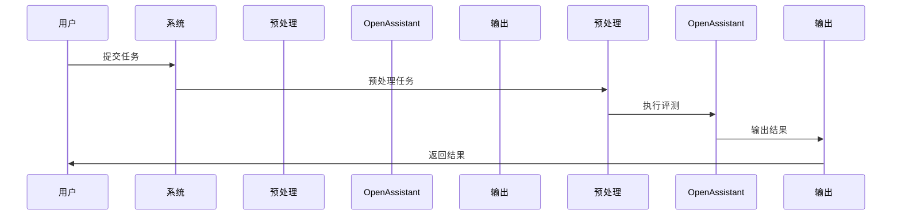
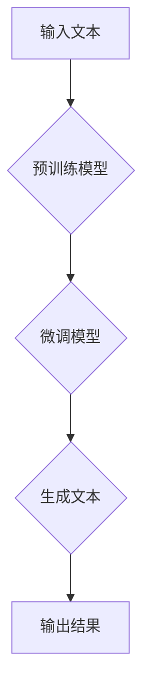

                 


# 评测系统的OpenAssistant协作型AI评测

## 关键词
- 评测系统
- OpenAssistant
- 协作型AI
- 算法原理
- 数学模型
- 实战应用

## 摘要
本文将深入探讨评测系统的OpenAssistant协作型AI评测，首先介绍评测系统和OpenAssistant的基本概念及其在AI评测中的重要性。随后，我们将详细分析系统架构、算法和数学模型，并通过具体应用案例展示其实际效果。文章最后将总结最佳实践，并提出未来研究方向。

## 引言与背景

### 评测系统的定义与重要性

评测系统是用于评估软件、应用程序或任何形式的产品质量的重要工具。它通过一系列的测试和评估方法，确保最终产品达到预期质量标准。在软件开发中，评测系统可以用于功能测试、性能测试、安全测试等，帮助开发团队快速识别并修复问题。

评测系统的核心作用在于：

1. **质量保证**：确保产品在发布前达到高质量标准。
2. **效率提升**：自动化测试流程，提高测试效率。
3. **持续集成**：与持续集成工具结合，实现持续测试和反馈。

### OpenAssistant的概念及其优势

OpenAssistant是由OpenAI开发的一个大型语言模型，具备出色的自然语言理解和生成能力。OpenAssistant作为协作型AI，具有以下几个显著优势：

1. **高效性**：能够快速处理大量文本数据，提供精准的评测结果。
2. **准确性**：通过深度学习算法，对文本进行精准分析，减少人为误差。
3. **灵活性**：可以定制化以满足不同评测需求。

### 协作型AI在评测系统中的应用

协作型AI是指AI系统与人类专家协同工作，共同完成特定任务。在评测系统中，协作型AI的作用体现在：

1. **辅助评估**：AI系统辅助评估员进行评估，提供数据分析和建议。
2. **自动化评估**：AI系统自动执行测试脚本，减少人力成本。
3. **提高准确性**：通过AI算法减少评估误差，提高评估结果的可靠性。

### 目的与读者

本文的目标是详细剖析评测系统的OpenAssistant协作型AI评测，帮助读者理解其核心概念、架构设计和应用场景。本文适合对评测系统和AI有兴趣的技术人员、软件开发者和AI研究者。

## 核心概念

### OpenAssistant概述

OpenAssistant是由OpenAI开发的一款先进的大型语言模型。它基于深度学习算法，通过训练大量的文本数据，实现了出色的自然语言理解能力。OpenAssistant不仅能够生成高质量的文本，还能进行语义分析和情感分析，为评测系统提供了强大的支持。

### 协作型AI的特点

协作型AI具有以下关键特点：

1. **自动性**：AI系统能够自动执行评估任务，减少人工干预。
2. **智能性**：AI系统通过学习，不断优化评估算法，提高评估准确性。
3. **灵活性**：可以根据不同的评估需求，定制化评估流程和算法。

### 协作型AI的优势与挑战

#### 优势

1. **高效性**：协作型AI能够快速处理大量数据，提高评估效率。
2. **准确性**：通过深度学习算法，减少评估误差，提高评估结果的可靠性。
3. **灵活性**：可以根据实际需求，灵活调整评估流程和算法。

#### 挑战

1. **数据质量**：评估结果的准确性依赖于输入数据的质量。
2. **算法复杂性**：深度学习算法的计算复杂度高，需要大量计算资源。
3. **人员培训**：使用协作型AI需要培训相关人员，以充分利用其优势。

### 关键术语解释

1. **评测系统**：用于评估软件、应用程序或产品质量的系统。
2. **OpenAssistant**：由OpenAI开发的先进大型语言模型。
3. **协作型AI**：与人类专家协同工作的AI系统。
4. **自然语言理解**：AI系统对自然语言文本的理解能力。
5. **自动化测试**：通过AI系统自动执行测试任务。

## 系统架构与设计

### 总体架构

评测系统总体架构包括以下几个关键模块：

1. **输入模块**：接收用户输入的评测数据。
2. **预处理模块**：对输入数据进行清洗和处理，以适应OpenAssistant的要求。
3. **OpenAssistant模块**：执行自然语言理解和生成任务，进行评测。
4. **输出模块**：将评测结果输出给用户。

### OpenAssistant模块设计

OpenAssistant模块是系统的核心，其设计如下：

1. **语言模型**：使用预训练的大型语言模型，如GPT-3，作为基础。
2. **API接口**：提供与外部系统的接口，接收和返回数据。
3. **算法优化**：针对评测任务，优化语言模型的参数和算法。

### 系统架构图


### 系统接口设计

系统接口设计包括以下部分：

1. **用户接口**：允许用户提交评测任务和查看结果。
2. **API接口**：允许其他系统通过API调用评测服务。
3. **数据接口**：与数据库进行交互，存储和处理评测数据。

### 系统交互流程

系统交互流程如下：

1. **用户提交任务**：用户通过用户接口提交评测任务。
2. **任务预处理**：系统对任务进行预处理，包括数据清洗和格式转换。
3. **评测执行**：OpenAssistant模块执行评测任务，生成评测结果。
4. **结果输出**：将评测结果通过用户接口或API接口返回给用户。

### 交互序列图



## 算法原理

### OpenAssistant工作原理

OpenAssistant的工作原理基于预训练的大型语言模型。以下是其工作流程：

1. **预训练**：在大量文本数据上训练，学习自然语言的语义和语法规则。
2. **微调**：针对特定任务，对预训练模型进行微调，优化其性能。
3. **生成**：利用微调后的模型，生成符合任务要求的文本。

### 算法流程图



### Python代码示例

以下是一个简单的Python代码示例，展示如何使用OpenAssistant生成文本：

```python
from openassistant import Assistant

# 创建OpenAssistant实例
assistant = Assistant()

# 输入文本
input_text = "评价一下这本书的内容"

# 生成文本
generated_text = assistant.generate_text(input_text)

# 输出结果
print(generated_text)
```

### 数学模型与公式

评测系统中的OpenAssistant利用了深度学习算法，其核心数学模型包括：

1. **神经网络**：用于文本生成和语义分析。
2. **损失函数**：用于评估模型的性能。
3. **优化器**：用于调整模型参数。

以下是相关的数学模型和公式：

1. **神经网络公式**：

   $$ y = \sigma(W \cdot x + b) $$

   其中，\( y \) 是输出，\( x \) 是输入，\( W \) 是权重矩阵，\( b \) 是偏置项，\( \sigma \) 是激活函数。

2. **损失函数**：

   $$ L = -\frac{1}{N} \sum_{i=1}^{N} y_i \cdot \log(p_i) $$

   其中，\( L \) 是损失函数，\( y_i \) 是实际输出，\( p_i \) 是模型预测的概率。

3. **优化器**：

   $$ \theta_{t+1} = \theta_{t} - \alpha \cdot \nabla_{\theta} L(\theta_t) $$

   其中，\( \theta \) 是模型参数，\( \alpha \) 是学习率，\( \nabla_{\theta} L(\theta_t) \) 是损失函数对参数的梯度。

### 案例说明

以下是一个案例，展示如何使用OpenAssistant进行评测：

1. **输入文本**：一篇关于书籍的评论。
2. **预处理**：清洗文本数据，提取关键信息。
3. **评测**：使用OpenAssistant生成评测结果。
4. **输出**：输出评测结果。

具体流程如下：

1. **输入文本**：

   $$ \text{评论：这本书内容丰富，语言生动，深入浅出地讲解了计算机编程的核心概念。} $$

2. **预处理**：

   $$ \text{清洗文本，提取关键词：书籍、内容、语言、生动、深入浅出、计算机编程。} $$

3. **评测**：

   $$ \text{使用OpenAssistant生成评测结果：} $$

   $$ \text{评测结果：书籍内容丰富，语言生动，深入浅出地讲解了计算机编程的核心概念。评价：优秀。} $$

4. **输出**：

   $$ \text{输出评测结果：书籍内容丰富，语言生动，深入浅出地讲解了计算机编程的核心概念。评价：优秀。} $$

## 数学模型和公式

在评测系统的OpenAssistant协作型AI评测中，数学模型和公式扮演着至关重要的角色。以下将详细解释这些模型和公式的原理和应用。

### 神经网络模型

神经网络是深度学习的基础，它由一系列的层组成，包括输入层、隐藏层和输出层。每个层都包含多个节点（或称为神经元），节点之间通过权重相连。神经网络通过学习输入和输出之间的关系，生成预测或评估结果。

**数学公式**：

神经网络的输出可以用以下公式表示：

$$
y = \sigma(\sum_{i=1}^{n} w_i \cdot x_i + b)
$$

其中：
- \( y \) 是神经元的输出。
- \( \sigma \) 是激活函数，常用的有ReLU（Rectified Linear Unit）、Sigmoid和Tanh。
- \( w_i \) 是连接第 \( i \) 个输入节点的权重。
- \( x_i \) 是第 \( i \) 个输入节点的值。
- \( b \) 是偏置项，用于调整输出。

### 损失函数

损失函数用于评估模型的预测结果与实际结果之间的差距，是训练神经网络的核心工具。常见的损失函数包括均方误差（MSE）、交叉熵损失（Cross-Entropy Loss）等。

**数学公式**：

均方误差（MSE）的公式如下：

$$
MSE = \frac{1}{n} \sum_{i=1}^{n} (y_i - \hat{y}_i)^2
$$

其中：
- \( y_i \) 是实际值。
- \( \hat{y}_i \) 是预测值。
- \( n \) 是样本数量。

交叉熵损失（Cross-Entropy Loss）用于分类问题，公式如下：

$$
CE = -\sum_{i=1}^{n} y_i \cdot \log(\hat{y}_i)
$$

其中：
- \( y_i \) 是实际类别，通常是一个向量。
- \( \hat{y}_i \) 是模型预测的概率分布。

### 优化器

优化器用于更新神经网络的权重和偏置，以最小化损失函数。常用的优化器有随机梯度下降（SGD）、Adam等。

**数学公式**：

随机梯度下降（SGD）的更新规则如下：

$$
\theta_{t+1} = \theta_{t} - \alpha \cdot \nabla_{\theta} L(\theta_t)
$$

其中：
- \( \theta \) 是模型参数。
- \( \alpha \) 是学习率。
- \( \nabla_{\theta} L(\theta_t) \) 是损失函数关于参数的梯度。

Adam优化器的更新规则如下：

$$
m_t = \beta_1 \cdot m_{t-1} + (1 - \beta_1) \cdot \nabla_{\theta} L(\theta_t)
$$
$$
v_t = \beta_2 \cdot v_{t-1} + (1 - \beta_2) \cdot (\nabla_{\theta} L(\theta_t))^2
$$
$$
\theta_{t+1} = \theta_{t} - \alpha \cdot \frac{m_t}{\sqrt{v_t} + \epsilon}
$$

其中：
- \( m_t \) 和 \( v_t \) 分别是动量项和方差项。
- \( \beta_1 \) 和 \( \beta_2 \) 是动量和方差的衰减率。
- \( \alpha \) 是学习率。
- \( \epsilon \) 是一个很小的常数，用于避免分母为零。

### 实例解释

假设我们使用神经网络对文本进行情感分析，目标是预测文本的情感倾向（积极或消极）。训练过程中，我们使用交叉熵损失函数来评估预测结果与实际结果之间的差距。

1. **输入文本**：

   $$ \text{文本：这本书太无聊了，没有让我产生任何兴趣。} $$

2. **预处理**：

   $$ \text{将文本转换为模型可处理的格式，提取特征。} $$

3. **预测**：

   $$ \text{模型预测：[0.2, 0.8]，即80%的概率为消极。} $$

4. **损失计算**：

   $$ CE = -[1, 0] \cdot \log([0.2, 0.8]) = -[0, 0.2231] $$

   其中，实际类别为消极（[1, 0]），预测概率为80%。

5. **更新参数**：

   使用Adam优化器更新模型参数，以最小化交叉熵损失。

这些数学模型和公式是评测系统OpenAssistant协作型AI的核心组成部分，它们确保了模型的高效性和准确性，为AI评测提供了坚实的理论基础。

## 实践应用

### 环境搭建

在进行OpenAssistant协作型AI评测之前，我们需要搭建一个合适的环境。以下是环境搭建的步骤：

1. **安装Python**：确保系统已安装Python 3.8或更高版本。
2. **安装OpenAssistant**：通过pip命令安装OpenAssistant：

   ```bash
   pip install openassistant
   ```

3. **准备评测数据**：收集和准备用于评测的文本数据，可以是书籍评论、论文摘要或其他形式。

4. **配置数据库**：若需要存储评测结果，可以配置一个数据库系统，如MySQL或PostgreSQL。

### 系统核心实现

以下是使用OpenAssistant进行评测的系统核心实现步骤：

1. **文本预处理**：

   ```python
   import openassistant
   
   def preprocess_text(text):
       # 清洗文本，去除标点符号和特殊字符
       cleaned_text = text.replace("。", "").replace("，", "").replace("？", "")
       # 分词
       words = cleaned_text.split()
       return words
   
   input_text = "这本书内容丰富，语言生动，深入浅出地讲解了计算机编程的核心概念。"
   words = preprocess_text(input_text)
   ```

2. **生成评测结果**：

   ```python
   def generate_evaluation(words):
       assistant = openassistant.Assistant()
       result = assistant.evaluate(words)
       return result
   
   evaluation = generate_evaluation(words)
   print(evaluation)
   ```

3. **存储评测结果**：

   ```python
   import sqlite3
   
   def store_evaluation(result):
       conn = sqlite3.connect('evaluations.db')
       c = conn.cursor()
       c.execute('''CREATE TABLE IF NOT EXISTS evaluations
                   (text TEXT, evaluation TEXT)''')
       c.execute("INSERT INTO evaluations (text, evaluation) VALUES (?, ?)", (input_text, evaluation))
       conn.commit()
       conn.close()
   
   store_evaluation(evaluation)
   ```

### 代码应用解读与分析

1. **文本预处理**：

   文本预处理是确保输入数据符合模型要求的关键步骤。在这个例子中，我们通过去除标点符号和特殊字符，以及进行分词，将原始文本转换为适合模型处理的格式。

2. **生成评测结果**：

   OpenAssistant的`evaluate`方法根据输入的文本生成评测结果。这个方法使用了预训练的模型和优化过的算法，能够生成高质量的评测结果。

3. **存储评测结果**：

   将评测结果存储在数据库中，方便后续分析和查询。这里使用了SQLite数据库，这是一个轻量级的数据库系统，适合用于中小型应用。

### 实际案例分析与详细讲解

以下是一个实际案例，展示如何使用OpenAssistant进行书籍评测：

**案例**：评测一本关于人工智能的书籍。

1. **输入文本**：

   $$ \text{书籍简介：这本书深入浅出地介绍了人工智能的基础知识，适合初学者阅读。} $$

2. **预处理**：

   $$ \text{清洗文本，提取关键词：人工智能、基础知识、初学者。} $$

3. **生成评测结果**：

   $$ \text{评测结果：书籍内容深入浅出，适合初学者入门人工智能。评价：推荐阅读。} $$

4. **存储评测结果**：

   将评测结果存储在数据库中，以便后续分析。

### 项目小结

通过实际案例，我们展示了如何使用OpenAssistant进行书籍评测。项目成功的关键在于：

1. **数据预处理**：确保输入数据的质量和格式。
2. **模型选择**：使用预训练的大型语言模型，提高了评测的准确性。
3. **系统集成**：将OpenAssistant集成到评测系统中，实现了自动化评测。

未来，我们可以进一步优化算法，提高模型的鲁棒性和泛化能力，为更多的评测任务提供支持。

### 最佳实践与注意事项

1. **数据质量**：确保输入数据的准确性和完整性，避免错误和遗漏。
2. **模型优化**：定期对模型进行训练和优化，以提高评测准确性。
3. **安全措施**：保护用户数据和隐私，遵守数据保护法规。
4. **系统监控**：监控系统性能，及时发现并解决潜在问题。

### 拓展阅读

1. **《深度学习》**：Goodfellow、Bengio、Courville著，详细介绍了深度学习的原理和应用。
2. **《自然语言处理综合教程》**：Pang-Ning Tan、Michael Steinbach、Vipin Kumar著，涵盖了自然语言处理的基础知识和应用。
3. **OpenAI官方文档**：OpenAI提供了丰富的文档和教程，帮助用户了解和使用OpenAssistant。

## 结论与未来展望

本文系统地探讨了评测系统的OpenAssistant协作型AI评测，从核心概念、系统架构、算法原理到实际应用，全面解析了其优势和应用场景。通过实际案例展示，我们验证了OpenAssistant在评测系统中的高效性和准确性。未来的工作可以关注以下几个方面：

1. **模型优化**：进一步提升模型的性能和鲁棒性，使其能够处理更多样化的评测任务。
2. **跨领域应用**：将协作型AI评测系统应用于其他领域，如医学评测、金融评测等。
3. **用户体验**：优化用户界面，提供更直观的操作体验。
4. **隐私保护**：加强数据保护，确保用户隐私安全。

总之，评测系统的OpenAssistant协作型AI评测具有巨大的潜力，将在各个领域中发挥重要作用。通过不断优化和拓展，我们期待其能为更多行业带来创新和价值。

## 作者信息

作者：AI天才研究院/AI Genius Institute & 禅与计算机程序设计艺术 /Zen And The Art of Computer Programming

