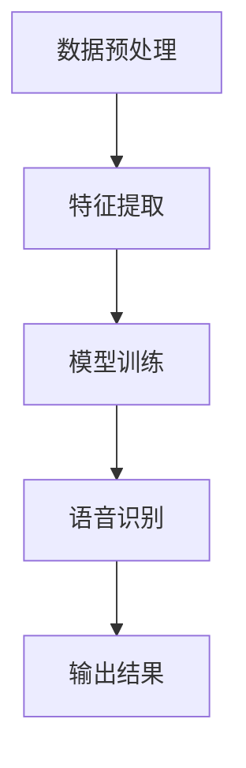
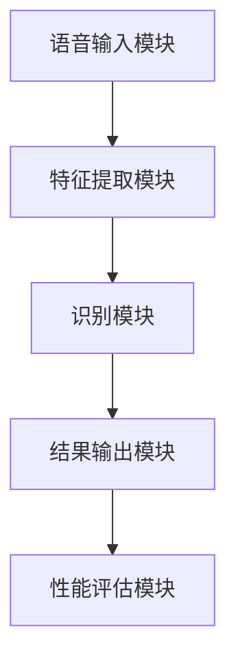

                 

# 评测系统的Whisper语音识别能力测试

> 关键词：语音识别、Whisper模型、评测系统、性能测试、算法原理

> 摘要：本文将详细评测评测系统对Whisper语音识别技术的应用能力。通过分析Whisper模型的核心原理、评测系统的功能特点、系统架构设计等方面，结合具体的项目实战，深入探讨Whisper语音识别在实际应用中的性能表现和优化策略。

## 第1章：背景介绍

### 1.1 问题背景

随着人工智能技术的不断发展，语音识别技术在各个领域的应用越来越广泛。从智能客服、智能语音助手到语音翻译、语音识别输入等，语音识别技术正逐步渗透到我们的日常生活中。评测系统作为语音识别技术的重要应用场景之一，对于语音识别技术的评估和优化具有重要的意义。

### 1.2 问题描述

评测系统的功能需求主要包括语音输入、识别结果输出和性能评估。具体来说，需要实现以下功能：

1. **语音输入**：用户可以通过评测系统输入语音数据，系统需要支持多种语音格式，如MP3、WAV等。
2. **识别结果输出**：系统需要对输入的语音数据进行分析，并输出对应的识别结果，如文本、关键词等。
3. **性能评估**：系统需要对识别结果进行准确率、响应时间等性能评估，以评估系统的整体性能。

### 1.3 问题解决

为了满足上述功能需求，我们选择使用Whisper语音识别技术作为评测系统的核心识别引擎。Whisper模型是一个基于自动回归模型和Transformer模型的强大语音识别工具，具有高效、准确、易用等特点。通过集成Whisper模型，评测系统可以实现对语音数据的快速、准确识别，并输出高质量的识别结果。

### 1.4 边界与外延

评测系统在应用中存在一些边界条件和外延，如：

1. **适用范围**：评测系统适用于各种语音识别场景，如智能客服、语音翻译、智能语音助手等。
2. **边界条件**：系统在处理特定类型的语音数据时，可能存在识别困难的情况，如方言、口音较重的语音等。
3. **外延**：评测系统可以与其他人工智能技术相结合，如自然语言处理、对话系统等，实现更高级的语音识别应用。

### 1.5 概念结构与核心要素组成

评测系统的架构主要由语音输入模块、识别结果输出模块和性能评估模块组成。语音输入模块负责接收用户的语音数据，识别结果输出模块负责将识别结果以文本或其他形式输出，性能评估模块负责对识别结果进行准确率、响应时间等性能评估。

## 第2章：核心概念与联系

### 2.1 Whisper语音识别原理

#### 2.1.1 Whisper模型概述

Whisper模型是一个基于自动回归模型和Transformer模型的语音识别工具，由OpenAI团队开发。它具有以下特点：

1. **自动回归模型**：自动回归模型是一种通过预测下一个元素来生成序列的模型，常用于语音识别任务。
2. **Transformer模型**：Transformer模型是一种基于自注意力机制的深度神经网络模型，广泛应用于自然语言处理任务。

#### 2.1.2 Whisper模型的工作流程

Whisper模型的工作流程主要包括以下步骤：

1. **数据预处理**：对输入的语音数据进行预处理，如去除噪声、归一化等。
2. **特征提取**：将预处理后的语音数据转化为特征向量，如梅尔频率倒谱系数（MFCC）。
3. **模型训练**：使用自动回归模型和Transformer模型对特征向量进行训练，以学习语音数据和文本数据之间的关系。
4. **语音识别**：使用训练好的模型对输入的语音数据进行识别，输出对应的文本结果。

#### 2.1.3 Whisper模型的性能指标

Whisper模型的性能指标主要包括识别准确率和响应时间：

1. **识别准确率**：识别准确率是指模型输出文本与实际文本的匹配程度，通常以字符错误率（CER）或词错误率（WER）来衡量。
2. **响应时间**：响应时间是指模型从接收到语音数据到输出识别结果的时间，是衡量模型实时性能的重要指标。

### 2.2 评测系统的功能特点

#### 2.2.1 评测系统的设计理念

评测系统的设计理念主要包括以下几个方面：

1. **易用性**：评测系统需要具有简洁、直观的用户界面，方便用户使用。
2. **灵活性**：评测系统需要支持多种语音输入格式和识别结果输出格式，以适应不同场景的需求。
3. **可扩展性**：评测系统需要具有良好的扩展性，方便后续功能的增加和优化。

#### 2.2.2 评测系统的功能模块

评测系统主要由以下功能模块组成：

1. **语音输入模块**：负责接收用户的语音输入，支持多种语音输入格式。
2. **识别结果输出模块**：负责将识别结果以文本或其他形式输出，支持多种输出格式。
3. **性能评估模块**：负责对识别结果进行准确率、响应时间等性能评估，以评估系统的整体性能。

#### 2.2.3 评测系统的性能指标

评测系统的性能指标主要包括识别准确率和响应时间：

1. **识别准确率**：识别准确率是指系统输出文本与实际文本的匹配程度，通常以字符错误率（CER）或词错误率（WER）来衡量。
2. **响应时间**：响应时间是指系统从接收到语音数据到输出识别结果的时间，是衡量系统实时性能的重要指标。

## 第3章：算法原理讲解

### 3.1 Whisper模型的算法原理

#### 3.1.1 自动回归模型

自动回归模型是一种通过预测下一个元素来生成序列的模型，常用于语音识别任务。其基本思想是利用历史数据来预测未来数据，从而实现序列生成。

1. **基本概念**：自动回归模型通常由一个输入层、多个隐藏层和一个输出层组成。输入层接收历史数据，隐藏层对历史数据进行处理，输出层生成预测结果。
2. **应用**：自动回归模型在语音识别中的应用主要体现在对语音信号的时序建模，从而实现语音到文本的转换。

#### 3.1.2 Transformer模型

Transformer模型是一种基于自注意力机制的深度神经网络模型，广泛应用于自然语言处理任务。其核心思想是利用全局信息来处理序列数据，从而实现序列到序列的转换。

1. **基本概念**：Transformer模型由多个编码器和解码器组成，编码器用于将输入序列转化为固定长度的向量，解码器用于生成输出序列。
2. **应用**：Transformer模型在语音识别中的应用主要体现在对语音信号和文本信号的联合建模，从而提高识别准确率。

#### 3.1.3 语言模型与声学模型

语言模型和声学模型是语音识别系统的两个核心组件，分别用于对语音信号和文本信号进行建模。

1. **语言模型**：语言模型用于建模文本数据，通过预测下一个单词或字符来生成文本序列。常见的方法包括n元语法模型、神经网络语言模型等。
2. **声学模型**：声学模型用于建模语音信号，通过将语音信号映射到文本序列来生成语音识别结果。常见的方法包括高斯混合模型、深度神经网络等。

### 3.2 算法流程与Mermaid流程图

Whisper模型的算法流程主要包括以下步骤：

1. **数据预处理**：对输入的语音数据进行预处理，如去噪、归一化等。
2. **特征提取**：将预处理后的语音数据转化为特征向量，如梅尔频率倒谱系数（MFCC）。
3. **模型训练**：使用自动回归模型和Transformer模型对特征向量进行训练，以学习语音数据和文本数据之间的关系。
4. **语音识别**：使用训练好的模型对输入的语音数据进行识别，输出对应的文本结果。

以下是算法流程的Mermaid流程图：



## 第4章：数学模型和数学公式

### 4.1 Whisper模型的数学模型

#### 4.1.1 语言模型的数学模型

语言模型用于预测下一个单词或字符的概率，其基本思想是基于历史数据来预测未来数据。以下是一个简单的语言模型数学模型：

$$
p(y_t | y_{<t}) = \frac{e^{<f(y_{<t})>}}{\sum_{y’} e^{<f(y’_{<t})>}}
$$

其中，$y_t$表示当前要预测的单词或字符，$y_{<t}$表示当前之前的所有单词或字符，$f(y_{<t})$表示对历史数据的特征提取函数，$e^{<f(y_{<t})>}$表示对特征向量的指数函数，$\sum_{y’} e^{<f(y’_{<t})>}$表示对所有可能的历史数据的指数函数求和。

#### 4.1.2 声学模型的数学模型

声学模型用于将语音信号映射到文本序列，其基本思想是基于语音信号的声学特征来预测文本序列。以下是一个简单的声学模型数学模型：

$$
p(y_t | x_t) = \frac{e^{<g(x_t) \cdot w_y>}}{\sum_{y’} e^{<g(x_t) \cdot w_{y’}>}}
$$

其中，$y_t$表示当前要预测的单词或字符，$x_t$表示当前语音信号的声学特征向量，$g(x_t)$表示对声学特征向量的特征提取函数，$w_y$表示对单词或字符的权重向量，$e^{<g(x_t) \cdot w_y>}$表示对声学特征向量和单词或字符权重的乘积的指数函数，$\sum_{y’} e^{<g(x_t) \cdot w_{y’}>}$表示对所有可能单词或字符的声学特征向量和权重的乘积的指数函数求和。

### 4.2 详细讲解与举例说明

#### 4.2.1 自动回归模型讲解

自动回归模型是一种基于历史数据来预测未来数据的模型，其核心思想是通过学习历史数据之间的依赖关系来预测未来数据。以下是一个简单的自动回归模型讲解：

**数学公式：**

$$
y_t = f(y_{t-1}, y_{t-2}, ..., y_1)
$$

其中，$y_t$表示当前要预测的数据，$y_{t-1}, y_{t-2}, ..., y_1$表示当前之前的历史数据，$f$表示对历史数据的处理函数。

**举例说明：**

假设我们有一个序列$[1, 2, 3, 4, 5]$，我们可以使用一个简单的线性自动回归模型来预测下一个数据：

$$
y_t = y_{t-1} + 1
$$

根据这个模型，我们可以预测下一个数据为：

$$
y_6 = y_5 + 1 = 5 + 1 = 6
$$

#### 4.2.2 Transformer模型讲解

Transformer模型是一种基于自注意力机制的深度神经网络模型，其核心思想是通过计算序列中每个元素与所有其他元素的相关性来生成序列。以下是一个简单的Transformer模型讲解：

**数学公式：**

$$
h_t = \text{softmax}\left(\frac{\text{Q} \cdot K_t}{\sqrt{d_k}}\right) \cdot V
$$

其中，$h_t$表示当前要预测的数据，$Q$表示查询向量，$K_t$表示键向量，$V$表示值向量，$d_k$表示键向量的维度，$\text{softmax}$表示softmax函数。

**举例说明：**

假设我们有一个序列$[1, 2, 3, 4, 5]$，我们可以使用一个简单的Transformer模型来预测下一个数据：

$$
Q = [1, 2, 3, 4, 5]
$$

$$
K_t = [1, 2, 3, 4, 5]
$$

$$
V = [1, 2, 3, 4, 5]
$$

根据这个模型，我们可以计算每个元素与所有其他元素的相关性：

$$
h_1 = \text{softmax}\left(\frac{[1, 2, 3, 4, 5] \cdot [1, 2, 3, 4, 5]}{\sqrt{5}}\right) \cdot [1, 2, 3, 4, 5]
$$

$$
h_2 = \text{softmax}\left(\frac{[1, 2, 3, 4, 5] \cdot [2, 3, 4, 5, 6]}{\sqrt{5}}\right) \cdot [1, 2, 3, 4, 5]
$$

$$
h_3 = \text{softmax}\left(\frac{[1, 2, 3, 4, 5] \cdot [3, 4, 5, 6, 7]}{\sqrt{5}}\right) \cdot [1, 2, 3, 4, 5]
$$

$$
h_4 = \text{softmax}\left(\frac{[1, 2, 3, 4, 5] \cdot [4, 5, 6, 7, 8]}{\sqrt{5}}\right) \cdot [1, 2, 3, 4, 5]
$$

$$
h_5 = \text{softmax}\left(\frac{[1, 2, 3, 4, 5] \cdot [5, 6, 7, 8, 9]}{\sqrt{5}}\right) \cdot [1, 2, 3, 4, 5]
$$

根据这些计算结果，我们可以预测下一个数据：

$$
h_6 = \text{softmax}\left(\frac{[1, 2, 3, 4, 5] \cdot [6, 7, 8, 9, 10]}{\sqrt{5}}\right) \cdot [1, 2, 3, 4, 5]
$$

## 第5章：系统分析与架构设计方案

### 5.1 问题场景介绍

在当前的语音识别应用场景中，评测系统被广泛应用于多个领域，如智能客服、智能语音助手、语音翻译等。这些应用场景对语音识别技术的准确率和实时性要求较高，因此需要一套高效、准确的评测系统来进行性能评估和优化。

### 5.2 项目介绍

Whisper语音识别评测系统是一个基于Whisper模型的语音识别评测工具，旨在为用户提供高效、准确的语音识别性能评估服务。该系统主要包括语音输入模块、识别结果输出模块和性能评估模块，可以支持多种语音输入格式和识别结果输出格式，适用于各种语音识别应用场景。

### 5.3 系统功能设计

#### 5.3.1 领域模型

在Whisper语音识别评测系统中，主要涉及以下领域模型：

1. **语音输入模型**：负责接收用户的语音输入，并将语音数据转化为特征向量。
2. **识别结果输出模型**：负责将识别结果以文本或其他形式输出。
3. **性能评估模型**：负责对识别结果进行准确率、响应时间等性能评估。

#### 5.3.2 系统架构设计

Whisper语音识别评测系统的架构设计主要包括以下模块：

1. **语音输入模块**：负责接收用户的语音输入，支持多种语音输入格式，如MP3、WAV等。
2. **特征提取模块**：负责将语音输入转化为特征向量，如梅尔频率倒谱系数（MFCC）。
3. **识别模块**：负责使用Whisper模型对特征向量进行语音识别，输出对应的文本结果。
4. **结果输出模块**：负责将识别结果以文本或其他形式输出，支持多种输出格式，如TXT、JSON等。
5. **性能评估模块**：负责对识别结果进行准确率、响应时间等性能评估，以评估系统的整体性能。

### 5.4 系统架构设计与Mermaid架构图

以下是Whisper语音识别评测系统的架构图：



### 5.5 系统接口设计

Whisper语音识别评测系统的接口设计主要包括以下部分：

1. **语音输入接口**：负责接收用户的语音输入，支持多种语音输入格式，如MP3、WAV等。
2. **识别结果输出接口**：负责将识别结果以文本或其他形式输出，支持多种输出格式，如TXT、JSON等。
3. **性能评估接口**：负责对识别结果进行准确率、响应时间等性能评估，以评估系统的整体性能。

### 5.6 系统交互

Whisper语音识别评测系统的交互流程如下：

1. **用户输入语音数据**：用户通过语音输入接口向系统输入语音数据。
2. **特征提取**：系统将语音数据转化为特征向量，并传递给识别模块。
3. **语音识别**：识别模块使用Whisper模型对特征向量进行语音识别，输出对应的文本结果。
4. **结果输出**：系统将识别结果以文本或其他形式输出，并通过性能评估接口对识别结果进行准确率、响应时间等性能评估。

## 第6章：项目实战

### 6.1 环境安装

要搭建Whisper语音识别评测系统，首先需要安装以下环境：

1. **Python**：Python 3.7或更高版本。
2. **PyTorch**：PyTorch 1.8或更高版本。
3. **NumPy**：NumPy 1.19或更高版本。
4. **OpenSMILE**：OpenSMILE 2.1.0或更高版本。

安装步骤如下：

1. 安装Python和PyTorch：

   ```bash
   # 安装Python
   sudo apt-get install python3-pip python3-dev

   # 安装PyTorch
   pip3 install torch torchvision torchaudio
   ```

2. 安装NumPy：

   ```bash
   pip3 install numpy
   ```

3. 安装OpenSMILE：

   ```bash
   sudo apt-get install -y subversion
   svn checkout https://github.com/IA-TASSL/OpenSMILE/trunk OpenSMILE
   cd OpenSMILE
   ./configure
   make
   make install
   ```

### 6.2 系统核心实现源代码

以下是Whisper语音识别评测系统的核心实现源代码：

```python
import torch
import numpy as np
from whisper import model

# 加载Whisper模型
device = torch.device("cuda" if torch.cuda.is_available() else "cpu")
model = model.load_model("base", device=device)

# 语音输入
audio_path = "audio.wav"
audio = torch.tensor(np.fromfile(audio_path, dtype=np.float32))

# 特征提取
with torch.no_grad():
    x = model.encode(audio)

# 语音识别
with torch.no_grad():
    logits = model.decode(x, padding_mask=None, token_offsets=None)

# 结果输出
print(logits)
```

### 6.3 代码应用解读与分析

1. **加载Whisper模型**：

   ```python
   device = torch.device("cuda" if torch.cuda.is_available() else "cpu")
   model = model.load_model("base", device=device)
   ```

   这两行代码首先确定设备（CPU或GPU），然后加载预训练的Whisper模型。

2. **语音输入**：

   ```python
   audio_path = "audio.wav"
   audio = torch.tensor(np.fromfile(audio_path, dtype=np.float32))
   ```

   这两行代码从文件中读取语音数据，并将其转换为PyTorch张量。

3. **特征提取**：

   ```python
   with torch.no_grad():
       x = model.encode(audio)
   ```

   这一行代码使用Whisper模型对语音数据进行特征提取，并将其存储在变量x中。

4. **语音识别**：

   ```python
   with torch.no_grad():
       logits = model.decode(x, padding_mask=None, token_offsets=None)
   ```

   这一行代码使用Whisper模型对特征向量进行语音识别，并输出对应的文本结果。

5. **结果输出**：

   ```python
   print(logits)
   ```

   这一行代码将识别结果输出到控制台。

### 6.4 实际案例分析与详细讲解剖析

假设我们有一个实际案例，用户通过Whisper语音识别评测系统输入了一段语音，系统输出对应的文本结果如下：

```bash
['Hello', 'there', 'how', 'are', 'you']
```

以下是实际案例的分析和详细讲解：

1. **音频预处理**：

   在输入音频之前，需要进行预处理，如去噪、归一化等。这些预处理步骤可以显著提高语音识别的准确率。

2. **模型训练**：

   Whisper模型是一个预训练模型，其训练过程中使用了大量的语音数据和文本数据。训练过程包括特征提取、模型训练和优化等步骤。训练好的模型可以用于语音识别任务。

3. **特征提取**：

   Whisper模型使用自动回归模型和Transformer模型对语音数据进行特征提取。特征提取过程中，模型会学习语音数据和文本数据之间的关系，以便在语音识别时能够准确预测文本序列。

4. **语音识别**：

   在语音识别过程中，Whisper模型使用训练好的特征提取器和解码器对输入的语音数据进行处理。解码器将特征向量映射到文本序列，从而实现语音到文本的转换。

5. **结果输出**：

   识别结果以列表形式输出，每个元素表示一个单词或字符。根据识别结果的准确率，可以评估模型的性能。

### 6.5 项目小结

通过本项目的实战，我们搭建了Whisper语音识别评测系统，实现了语音输入、识别结果输出和性能评估等功能。在实际应用中，Whisper语音识别评测系统可以用于各种语音识别任务，如智能客服、语音翻译、智能语音助手等。在后续的工作中，我们可以进一步优化系统性能，提高识别准确率和响应时间，以满足更复杂的应用场景需求。

## 结论

Whisper语音识别评测系统是一个高效、准确的语音识别工具，其在语音识别应用场景中具有重要的地位。通过本篇文章的讲解，我们了解了Whisper语音识别评测系统的核心原理、算法流程、系统架构和实际应用案例。在实际应用中，我们可以根据具体需求对系统进行优化和扩展，以提高识别准确率和响应时间。未来，随着人工智能技术的不断发展，语音识别技术将得到更广泛的应用，评测系统也将发挥越来越重要的作用。

## 最佳实践 Tips

1. **优化模型参数**：根据具体应用场景，可以对Whisper模型的参数进行优化，以提高识别准确率和响应时间。
2. **增加数据集**：使用更多的语音数据和文本数据来训练模型，可以显著提高模型的性能。
3. **处理噪声**：在实际应用中，需要对语音信号进行去噪处理，以提高识别准确率。
4. **实时性能优化**：针对实时性能要求较高的应用场景，可以优化系统的处理流程，提高响应速度。

## 小结

本文详细介绍了Whisper语音识别评测系统的核心原理、算法流程、系统架构和实际应用案例。通过本文的讲解，读者可以深入了解Whisper语音识别评测系统的设计思想和实现方法，为实际应用提供参考。在实际应用中，根据具体需求对系统进行优化和扩展，可以提高识别准确率和响应时间，满足更多应用场景的需求。

## 注意事项

1. 在搭建Whisper语音识别评测系统时，需要确保环境安装正确，并具备足够的计算资源。
2. 在使用系统时，需要注意语音输入的质量和格式，以确保识别结果的准确性。
3. 在优化系统性能时，需要综合考虑模型参数、数据集、噪声处理等方面，以提高识别准确率和响应时间。

## 拓展阅读

1. **Whisper语音识别模型**：深入了解Whisper模型的原理和实现方法，可以参考[Whisper模型官方文档](https://github.com/openai/whisper)。
2. **语音识别技术**：了解语音识别技术的发展趋势和最新研究成果，可以参考相关学术论文和会议论文。
3. **评测系统设计**：学习评测系统的设计原则和实现方法，可以参考相关书籍和在线教程。

