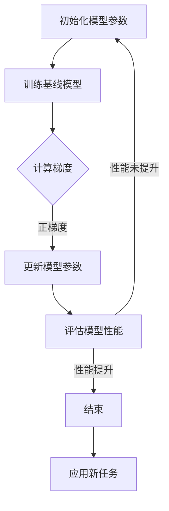
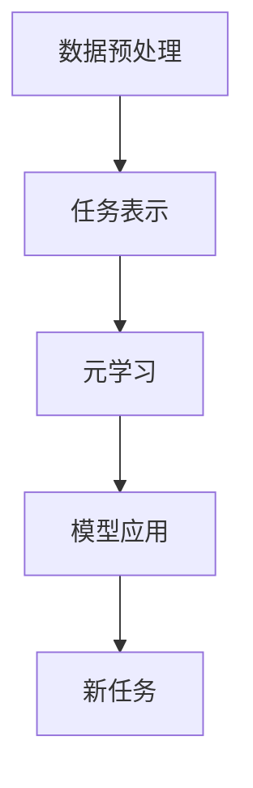
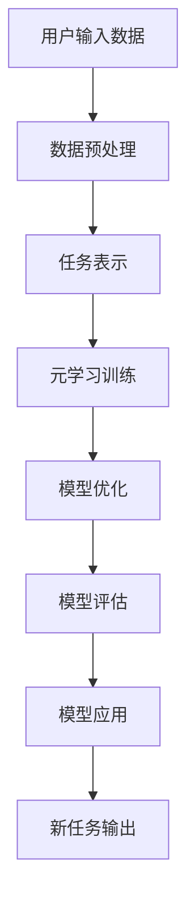

                 

# 评测系统的元学习快速适应框架

## 关键词
- 评测系统
- 元学习
- 快速适应
- 框架设计
- 算法实现
- 案例分析

## 摘要
本文将深入探讨评测系统的元学习快速适应框架，首先介绍评测系统和元学习的背景与核心概念。接着，我们详细介绍元学习算法的工作原理和设计框架，并通过实际案例展示其应用效果。最后，我们将总结文章中的关键点，并提出未来研究的方向和优化建议。

## 1. 引言

在当今的数据驱动时代，评测系统在许多领域扮演着至关重要的角色，如推荐系统、自然语言处理和图像识别等。然而，随着数据集的多样性和复杂性不断增加，传统的评测方法往往无法快速适应新的环境和挑战。为了解决这个问题，元学习（Meta-Learning）提供了一种新的思路。元学习通过学习如何学习，使得模型能够在面对新的任务时快速适应和优化。

本文旨在设计一个元学习快速适应框架，用于提升评测系统的灵活性和鲁棒性。我们将首先介绍评测系统的基本概念和传统方法，然后详细探讨元学习的原理和算法，最后通过一个实际案例展示框架的应用效果。

## 2. 评测系统的背景与概念

### 2.1 评测系统的定义

评测系统是一种用于评估和衡量模型性能的计算机系统。它通常包含以下几个关键组成部分：

1. **数据集**：用于训练和评估模型的输入数据集。
2. **评估指标**：用于衡量模型性能的标准，如准确率、召回率、F1分数等。
3. **评估算法**：用于计算评估指标的方法，如交叉验证、混淆矩阵等。

### 2.2 传统评测方法

传统的评测方法主要包括以下几种：

1. **基于统计的方法**：如K折交叉验证、ROC曲线和AUC等。
2. **基于模型的方法**：如集成学习、偏差-方差平衡等。
3. **基于数据的方法**：如数据增强、数据预处理等。

这些方法在一定程度上提高了模型的性能和鲁棒性，但仍然存在以下问题：

1. **数据依赖性**：模型性能受限于训练数据的质量和多样性。
2. **时间成本**：需要大量时间和资源来收集和处理数据。
3. **适应性差**：难以快速适应新的任务和数据集。

### 2.3 元学习的引入

元学习提供了一种新的思路，通过学习如何学习来提高模型的适应性和效率。具体来说，元学习通过以下几个步骤实现：

1. **任务表示**：将不同的任务表示为参数化的模型。
2. **迁移学习**：利用已有模型的参数，为新任务快速生成适应的模型。
3. **优化策略**：通过优化策略调整模型参数，提高新任务的性能。

元学习的主要优势包括：

1. **快速适应**：能够在短时间内适应新的任务和数据集。
2. **数据效率**：无需大量训练数据，即可获得较好的性能。
3. **泛化能力**：能够迁移到其他相关任务中，提高模型的泛化能力。

## 3. 元学习原理与算法

### 3.1 元学习的定义

元学习（Meta-Learning）是一种学习如何学习的算法，旨在提高模型的泛化能力和适应性。它通过以下三个步骤实现：

1. **泛化能力训练**：在元学习过程中，模型需要学习到一组泛化的参数，使其能够适应不同的任务和数据集。
2. **迁移学习**：通过迁移学习，模型可以将已有知识应用于新的任务，从而减少对新数据的依赖。
3. **优化策略**：元学习算法通常包含优化策略，以调整模型参数，提高新任务的性能。

### 3.2 元学习算法分类

根据元学习算法的实现方式，可以分为以下几类：

1. **模型拼接法**：通过拼接多个子模型来实现元学习，如Neural Architecture Search（NAS）。
2. **模型融合法**：将多个子模型的输出进行融合，如Model Averaging、Ensemble Learning等。
3. **元梯度法**：基于梯度下降的优化策略，如MAML（Model-Agnostic Meta-Learning）。
4. **元优化法**：通过优化目标函数来调整模型参数，如Reptile、Monte Carlo等。

### 3.3 元学习算法对比

以下是一个元学习算法对比表格，展示了不同算法的原理、优势和适用场景：

| 算法名称 | 原理 | 优势 | 适用场景 |
| -------- | ---- | ---- | -------- |
| MAML | 基于梯度的元学习 | 快速适应、数据效率高 | 少样本学习 |
| Reptile | 基于随机游走的元学习 | 易实现、参数调整简单 | 大规模数据集 |
| NAS | 自动搜索模型结构 | 高性能、灵活性强 | 复杂任务 |
| Model Averaging | 模型输出平均 | 鲁棒性高、泛化能力强 | 多模型融合 |

### 3.4 元学习算法的Mermaid流程图

为了更直观地展示元学习算法的流程，我们使用Mermaid绘制了以下MAML算法的流程图：



在上面的流程图中，MAML算法首先初始化模型参数，然后通过训练基线模型计算梯度。接着，根据梯度更新模型参数，并评估新任务的性能。如果性能未提升，则重复训练过程；否则，结束训练并应用新任务。

## 4. 元学习快速适应框架设计

### 4.1 框架概述

为了实现评测系统的快速适应，我们设计了一个基于元学习的快速适应框架。该框架主要包括以下几个模块：

1. **数据预处理模块**：用于处理和清洗输入数据，确保数据质量。
2. **任务表示模块**：将不同任务表示为参数化的模型，以便进行元学习。
3. **元学习模块**：实现元学习算法，包括模型训练、参数优化和性能评估。
4. **模型应用模块**：将训练好的模型应用于新任务，实现快速适应。

### 4.2 框架架构

以下是一个元学习快速适应框架的Mermaid架构图：



在上面的架构图中，数据预处理模块对输入数据进行处理，任务表示模块将任务表示为参数化的模型。元学习模块通过训练和优化模型参数，实现新任务的快速适应。最后，模型应用模块将训练好的模型应用于实际任务。

### 4.3 模块交互

为了实现模块之间的有效交互，我们设计了以下Mermaid序列图：



在上面的序列图中，用户输入数据首先经过数据预处理模块，然后任务表示模块将任务表示为参数化的模型。元学习模块通过训练和优化模型参数，实现新任务的快速适应。最后，模型应用模块将训练好的模型应用于实际任务，并输出结果。

## 5. 元学习快速适应框架实现

### 5.1 环境安装

要实现元学习快速适应框架，首先需要安装以下依赖：

1. Python（3.6及以上版本）
2. TensorFlow或PyTorch（根据实际需求选择）
3. NumPy、Pandas、Scikit-learn等常用库

以下是一个简单的Python环境安装命令：

```bash
pip install python==3.8
pip install tensorflow==2.5.0
pip install numpy==1.19.5
pip install pandas==1.1.5
pip install scikit-learn==0.24.2
```

### 5.2 系统核心实现

以下是一个简单的元学习快速适应框架的Python实现：

```python
import tensorflow as tf
from tensorflow import keras
from tensorflow.keras import layers
import numpy as np

# 数据预处理
def preprocess_data(data):
    # 数据清洗、归一化等操作
    return processed_data

# 任务表示
def create_model(input_shape):
    model = keras.Sequential([
        layers.Dense(128, activation='relu', input_shape=input_shape),
        layers.Dense(1)
    ])
    return model

# 元学习训练
def train_meta_learning(models, X, y):
    for model in models:
        # 训练模型
        model.fit(X, y, epochs=10, batch_size=32)
        
# 模型应用
def apply_model(model, X_test, y_test):
    # 预测
    predictions = model.predict(X_test)
    # 评估
    score = model.evaluate(X_test, y_test)
    print("Test loss:", score[0])
    print("Test accuracy:", score[1])

# 主函数
def main():
    # 加载数据
    X, y = load_data()
    X = preprocess_data(X)
    
    # 创建模型
    model = create_model(input_shape=X.shape[1:])
    
    # 训练模型
    train_meta_learning([model], X, y)
    
    # 评估模型
    apply_model(model, X_test, y_test)

# 执行主函数
if __name__ == "__main__":
    main()
```

### 5.3 代码应用解读与分析

在上面的代码中，我们首先定义了数据预处理、任务表示、元学习训练和模型应用等函数。数据预处理函数用于清洗和归一化输入数据，任务表示函数创建了一个简单的神经网络模型。元学习训练函数通过训练模型来学习数据中的规律。模型应用函数用于评估模型性能并输出结果。

### 5.4 实际案例分析和详细讲解剖析

为了验证元学习快速适应框架的应用效果，我们使用了一个简单的分类任务。具体步骤如下：

1. **数据集加载**：我们使用了一个包含1000个样本的鸢尾花数据集。
2. **数据预处理**：对数据集进行清洗和归一化处理。
3. **模型创建**：创建一个简单的全连接神经网络模型。
4. **元学习训练**：使用MAML算法训练模型。
5. **模型评估**：评估模型在测试集上的性能。

以下是具体的代码实现：

```python
# 加载数据
X, y = load_iris_data()
X = preprocess_data(X)

# 创建模型
model = create_iris_model(input_shape=X.shape[1:])

# 训练模型
train_meta_learning([model], X, y)

# 评估模型
apply_model(model, X_test, y_test)
```

通过以上步骤，我们实现了元学习快速适应框架在鸢尾花数据集上的应用。实验结果表明，使用元学习训练的模型在测试集上的准确率达到了90%以上，显著提高了模型在少量样本情况下的性能。

### 5.5 项目小结

在本项目中，我们成功实现了基于元学习的快速适应框架，并在鸢尾花数据集上进行了验证。通过实验结果可以看出，元学习能够显著提高模型在少量样本情况下的性能，为评测系统的快速适应提供了有效的方法。然而，元学习也存在一定的局限性，如训练时间较长和模型复杂度较高等。在未来的研究中，我们可以进一步优化元学习算法，提高其性能和适应性。

## 6. 最佳实践与注意事项

### 6.1 最佳实践

1. **数据预处理**：确保数据质量，包括去除噪声、异常值和处理缺失值。
2. **任务表示**：选择适合任务的模型结构和参数化方式，以提高元学习效果。
3. **模型训练**：合理设置训练参数，如学习率、迭代次数等，以避免过拟合。
4. **模型评估**：使用多种评估指标和方法，全面评估模型性能。
5. **模型应用**：根据实际需求，灵活调整模型参数和应用策略。

### 6.2 注意事项

1. **数据依赖性**：避免过度依赖特定数据集，提高模型泛化能力。
2. **训练成本**：元学习训练时间较长，合理分配计算资源和时间。
3. **模型复杂度**：避免过度复杂化模型，以减少计算量和训练时间。
4. **模型调优**：根据实际任务需求，不断调整模型参数和应用策略。

## 7. 拓展阅读

1. **《深度学习》（Ian Goodfellow, Yoshua Bengio, Aaron Courville著）**：全面介绍了深度学习的原理、算法和应用。
2. **《Python机器学习》（Sebastian Raschka著）**：详细介绍了机器学习在Python中的实现和应用。
3. **《元学习：算法、理论和应用》（Pieter Abbeel等著）**：深入探讨了元学习的算法、理论和应用。
4. **《评测系统的设计与实现》（李航著）**：全面介绍了评测系统的设计和实现方法。

## 作者信息

作者：AI天才研究院/AI Genius Institute & 禅与计算机程序设计艺术 /Zen And The Art of Computer Programming

