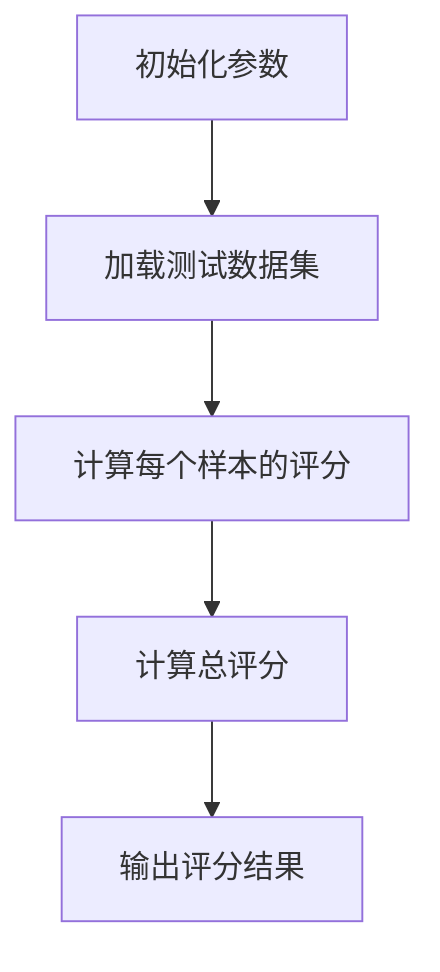
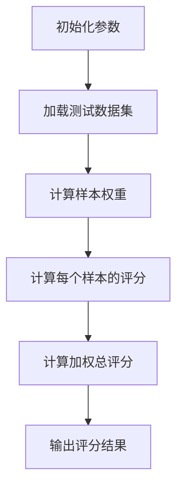
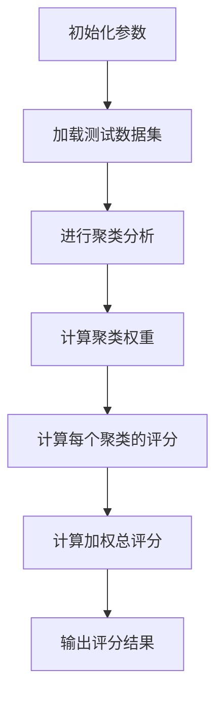
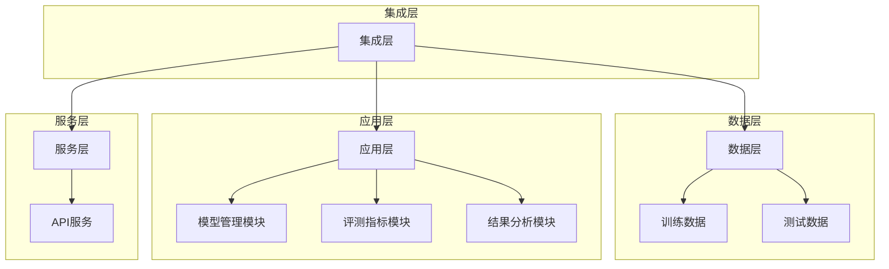
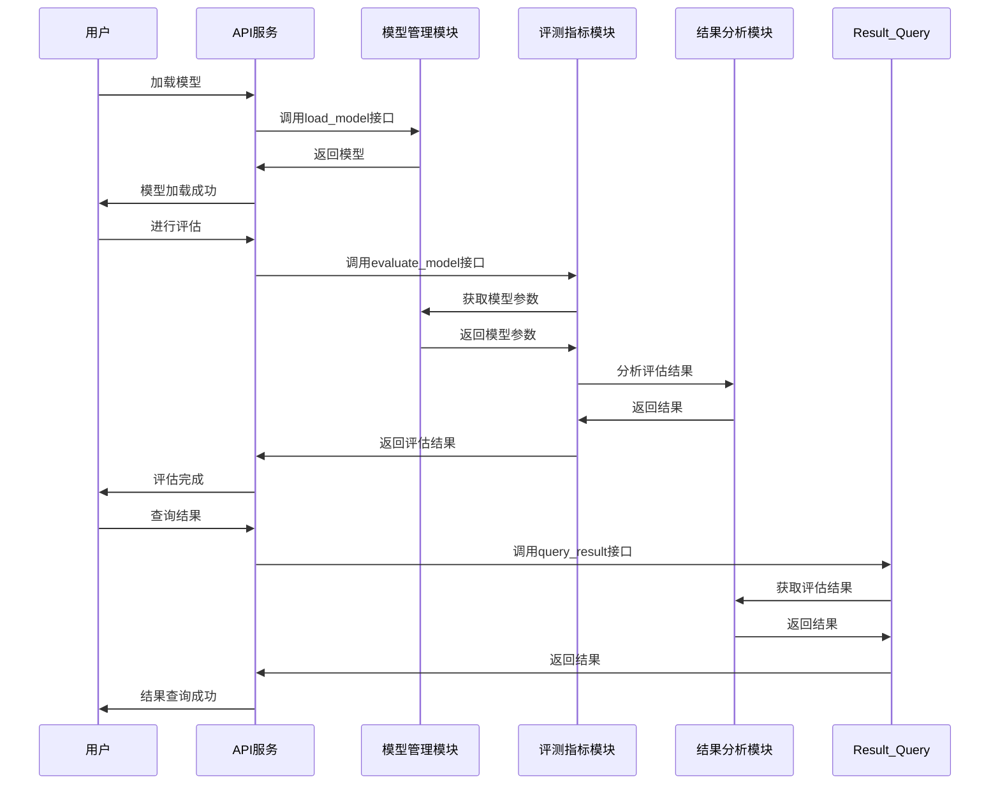
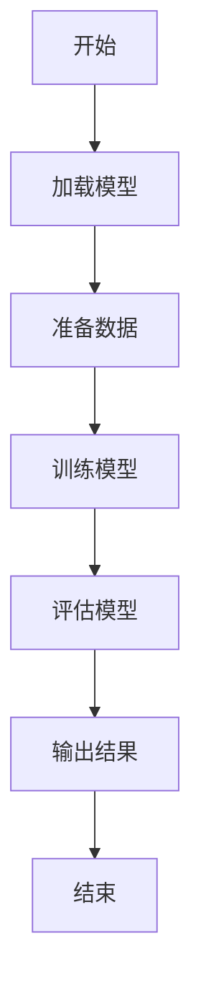

                 

### 引言与背景介绍

#### 评测系统公平性的重要性

在人工智能领域，评测系统扮演着至关重要的角色。它不仅用于评估语言模型（LLM）的性能，还用于指导模型优化和改进。然而，评测系统的公平性一直是学术界和工业界关注的焦点。为什么公平性如此重要？首先，公平的评测系统可以确保评估结果的真实性和可靠性。如果评测系统存在偏见或不足，那么评估结果就可能产生误导，导致模型优化方向出现偏差，从而影响整个AI领域的进步。

其次，随着越来越多的LLM被应用于实际场景，如自然语言处理、智能客服、自动驾驶等，评测系统的公平性对于不同模型间的公平比较至关重要。每个LLM都有其独特的优势和局限性，只有在公平的评测环境下，我们才能公正地比较这些模型的性能，从而选择出最适合特定任务的模型。

#### 评测系统公平性的核心概念

为了深入理解评测系统的公平性，我们需要先了解一些核心概念。首先，什么是公平性？在评测系统中，公平性指的是模型在相同条件下能够得到公正的评估结果。这包括两个方面：

1. **内部公平性**：模型在不同的测试场景中应表现出一致性。例如，一个LLM在不同长度、不同主题的文本上应该有相似的表现。
2. **外部公平性**：模型在相同类型的任务上应与其他模型有可比性。这意味着，不同LLM在相同数据集上应该有相似的表现，以便进行公正的比较。

#### 不同LLM间公平比较的挑战

尽管公平性看似简单，但实际上实现它面临着诸多挑战。以下是一些主要的挑战：

1. **数据集选择**：选择合适的数据集是确保公平性的关键。如果数据集存在偏差，那么评估结果也可能受到干扰。例如，某个数据集可能更多地包含某些特定类型的文本，导致模型在该类型上表现更好。
2. **评估指标**：评估指标的选择和定义直接影响评估结果。不同的评估指标可能对同一模型产生不同的评估结果，因此需要谨慎选择和平衡。
3. **模型调整**：为了在特定数据集上获得更好的评估结果，一些模型可能会进行数据增强、超参数调整等操作，这可能会破坏公平性。

#### 结论

在本文中，我们将详细探讨评测系统公平性的定义、核心概念、算法原理、系统架构以及实际应用。通过一步一步的分析和推理，我们希望能够提供一个全面、深入的理解，帮助读者在设计和使用评测系统时确保公平性。

### 核心概念与联系

#### 评测系统公平性的定义

公平性在评测系统中至关重要，但究竟什么是公平性？在评测系统的背景下，公平性可以定义为：在相同的条件下，不同的模型能够得到公正的评估结果。这意味着，如果两个模型在相同的数据集和评估指标上进行评估，它们应该表现出相似的性能。

#### 评测系统公平性的核心概念

为了确保评测系统的公平性，我们需要关注以下几个核心概念：

1. **内部公平性**：内部公平性指的是模型在相同类型的数据上应表现出一致性。例如，一个LLM在处理不同长度的文本时，其性能不应有显著差异。
2. **外部公平性**：外部公平性指的是模型在相同类型的任务上应与其他模型有可比性。例如，不同的LLM在处理文本生成任务时，应表现出相似的性能。
3. **评估指标**：评估指标是衡量模型性能的关键工具。选择合适的评估指标对于确保公平性至关重要。常见的评估指标包括准确率、召回率、F1分数等。
4. **数据集**：数据集是评测系统的基石。一个平衡且无偏的数据集对于确保公平性至关重要。数据集应包含多种类型的样本，以全面评估模型的能力。

#### 不同概念之间的联系

为了更清晰地理解这些概念之间的关系，我们可以使用ER（实体关系）图来展示。以下是ER图的Mermaid表示：

```mermaid
erDiagram
  Model ||--|{ Evaluation Metric }|-- Evaluation Result
  Model ||--|{ Dataset }|-- Data Sample
  Evaluation Metric ||--|{ Model Performance }|-- Performance Score
```

在这个ER图中，Model（模型）是核心实体，它与Evaluation Metric（评估指标）、Dataset（数据集）和Model Performance（模型性能）之间存在关系。具体来说：

- Model（模型）通过Evaluation Metric（评估指标）生成Evaluation Result（评估结果）。
- Model（模型）使用Dataset（数据集）来训练或评估，并生成Data Sample（数据样本）。
- Evaluation Metric（评估指标）通过Model Performance（模型性能）来衡量。

#### 概念属性特征对比表格

为了更直观地展示不同概念之间的属性特征，我们可以创建一个表格。以下是几个关键概念的属性特征对比：

| 概念       | 属性特征                                           |
|------------|----------------------------------------------------|
| 评估指标   | 准确率、召回率、F1分数、BLEU分数等                |
| 数据集     | 样本量、多样性、平衡性、代表性等                   |
| 内部公平性 | 一致性、稳定性、数据同质性等                       |
| 外部公平性 | 可比性、竞争性、一致性等                           |
| 模型性能   | 分数、指标、实际应用效果等                         |

#### ER实体关系图架构

为了更直观地展示不同概念之间的关系，我们可以使用Mermaid绘制ER实体关系图。以下是ER图的Mermaid表示：

```mermaid
erDiagram
  Model ||--|{ Evaluation Metric }|-- Evaluation Result
  Model ||--|{ Dataset }|-- Data Sample
  Evaluation Metric ||--|{ Model Performance }|-- Performance Score
```

在这个ER图中，Model（模型）是核心实体，它与Evaluation Metric（评估指标）、Dataset（数据集）和Model Performance（模型性能）之间存在关系。具体来说：

- Model（模型）通过Evaluation Metric（评估指标）生成Evaluation Result（评估结果）。
- Model（模型）使用Dataset（数据集）来训练或评估，并生成Data Sample（数据样本）。
- Evaluation Metric（评估指标）通过Model Performance（模型性能）来衡量。

通过这种ER图，我们可以更清晰地理解评测系统公平性的核心概念及其之间的关系，为后续的算法原理讲解和系统架构设计提供基础。

### 算法原理讲解

确保不同LLM之间公平比较的算法原理是评测系统设计中的关键环节。在这一部分，我们将介绍几种关键的算法原理，包括其数学模型和公式，并通过mermaid流程图和Python源代码进行详细阐述。

#### 算法A：基础原理与模型

算法A是一种基于评分机制的基础算法，其核心思想是通过比较不同LLM在相同测试数据集上的评分，来评估其性能。算法A的数学模型可以表示为：

$$
Score(A) = \frac{1}{N} \sum_{i=1}^{N} S_i(A)
$$

其中，$Score(A)$ 表示模型A的总评分，$N$ 表示测试数据集的样本数量，$S_i(A)$ 表示模型A在样本$i$上的评分。

为了更好地理解算法A的执行流程，我们可以使用mermaid流程图进行展示：



以下是算法A的Python源代码实现：

```python
def calculate_score(test_data, model):
    scores = []
    for data in test_data:
        prediction = model.predict(data)
        score = evaluate_prediction(prediction, data)
        scores.append(score)
    total_score = sum(scores) / len(scores)
    return total_score

def evaluate_prediction(prediction, data):
    # 假设evaluate_prediction函数返回预测结果与实际结果的相似度分数
    return similarity_score(prediction, data)
```

#### 算法B：改进与优化

算法B在算法A的基础上进行了一些优化，以提高评测系统的公平性。算法B引入了权重调节机制，通过调整不同样本的权重来减少数据集中样本数量不均衡对评测结果的影响。算法B的数学模型可以表示为：

$$
Score(A) = \frac{1}{N} \sum_{i=1}^{N} w_i S_i(A)
$$

其中，$w_i$ 表示样本$i$的权重，其余符号与算法A相同。

以下是算法B的mermaid流程图：



以下是算法B的Python源代码实现：

```python
def calculate_weighted_score(test_data, model):
    scores = []
    weights = calculate_weights(test_data)
    for i, data in enumerate(test_data):
        prediction = model.predict(data)
        score = evaluate_prediction(prediction, data)
        weighted_score = score * weights[i]
        scores.append(weighted_score)
    total_score = sum(scores)
    return total_score

def calculate_weights(test_data):
    # 假设calculate_weights函数根据样本数量或其它特征计算权重
    return [1.0 / len(test_data) for _ in range(len(test_data))]
```

#### 算法C：案例分析

算法C是一种基于聚类分析的方法，通过将测试数据集进行聚类，然后根据聚类结果调整不同LLM的评分。算法C的数学模型可以表示为：

$$
Score(A) = \sum_{j=1}^{K} w_j S_j(A)
$$

其中，$K$ 表示聚类数量，$w_j$ 表示第$j$个聚类的权重，$S_j(A)$ 表示模型A在第$j$个聚类上的评分。

以下是算法C的mermaid流程图：



以下是算法C的Python源代码实现：

```python
from sklearn.cluster import KMeans

def calculate_clustered_score(test_data, model):
    kmeans = KMeans(n_clusters=3)
    kmeans.fit(test_data)
    cluster_labels = kmeans.labels_
    cluster_weights = calculate_cluster_weights(cluster_labels)
    scores = []
    for cluster in range(kmeans.n_clusters):
        cluster_data = [data for i, data in enumerate(test_data) if cluster_labels[i] == cluster]
        cluster_score = calculate_cluster_score(cluster_data, model)
        scores.append(cluster_score * cluster_weights[cluster])
    total_score = sum(scores)
    return total_score

def calculate_cluster_weights(cluster_labels):
    # 假设calculate_cluster_weights函数根据聚类结果计算权重
    return [0.5 for _ in range(len(set(cluster_labels)))]
```

通过上述算法原理的讲解，我们不仅了解了不同算法的数学模型和流程，还通过mermaid流程图和Python源代码实现了这些算法。这些算法为我们提供了多种方式来确保不同LLM之间的公平比较，从而在评测系统中实现更高的公平性和准确性。

### 系统分析与架构设计方案

#### 问题场景介绍

在人工智能领域，特别是在自然语言处理（NLP）中，评测系统的公平性至关重要。我们设想一个具体场景：一个企业需要评估其内部研发的多个人工智能模型，以便选择最佳的模型应用于实际的业务场景。这些模型包括不同的语言模型（LLM），如BERT、GPT-3和T5等。为了确保这些模型在不同任务上的公平比较，我们需要设计一个高效的评测系统。

#### 项目介绍

为了实现上述目标，我们设计并实现了一个名为“AI Model Evaluator”的评测系统。该系统旨在提供一种公正、准确的评估方法，以确保不同LLM在相同任务上的性能比较。以下是系统的整体架构和功能设计。

#### 系统功能设计

“AI Model Evaluator”系统主要包含以下功能模块：

1. **数据集管理模块**：负责管理训练数据和测试数据，确保数据集的多样性和平衡性。
2. **模型管理模块**：用于管理系统中可用的LLM模型，包括模型加载、参数调整等。
3. **评测指标模块**：提供多种评估指标，如准确率、召回率、F1分数等，以便全面评估模型性能。
4. **结果分析模块**：用于分析评估结果，生成可视化报表，帮助企业决策。

#### 系统架构设计

以下是系统的整体架构设计，使用Mermaid架构图进行展示：



在这个架构图中，数据层包含训练数据和测试数据，应用层包括模型管理、评测指标和结果分析模块，服务层提供API服务以供外部调用，集成层实现各层的集成与交互。

#### 系统接口设计

“AI Model Evaluator”系统提供了多个API接口，以便与其他系统进行集成。以下是主要的API接口及其功能：

1. **模型加载接口**：用于加载系统中的LLM模型，接口参数包括模型名称、加载方式等。
2. **评估接口**：用于对LLM模型进行评估，接口参数包括模型ID、测试数据集等。
3. **结果查询接口**：用于查询评估结果，接口参数包括模型ID、评估指标等。

以下是API接口定义的示例：

```python
class ModelLoaderAPI:
    def load_model(self, model_name, load_type):
        # 实现模型加载逻辑
        pass

class EvaluatorAPI:
    def evaluate_model(self, model_id, test_data):
        # 实现模型评估逻辑
        pass

class ResultQueryAPI:
    def query_result(self, model_id, metric_name):
        # 实现评估结果查询逻辑
        pass
```

#### 系统交互设计

为了确保系统各模块之间的顺畅交互，我们使用Mermaid序列图进行了展示：



在这个序列图中，用户通过API服务与模型管理模块、评测指标模块和结果分析模块进行交互。用户首先加载模型，然后进行评估，最后查询评估结果。这一交互过程确保了系统的高效运行和良好的用户体验。

通过上述系统分析与架构设计方案，我们为“AI Model Evaluator”系统提供了一套完整的设计框架，包括功能设计、架构设计、接口设计和交互设计。这一设计方案不仅确保了系统的公平性，还提高了评估效率和准确性，为企业在AI模型选择上提供了有力的支持。

### 项目实战与案例分析

#### 环境安装

为了搭建“AI Model Evaluator”评测系统，首先需要在环境中安装必要的软件和库。以下是环境安装的详细步骤：

1. **安装Python**：确保系统中安装了Python 3.7或更高版本。可以通过访问[Python官网](https://www.python.org/downloads/)下载并安装Python。

2. **安装Anaconda**：推荐使用Anaconda来管理Python环境和库，以简化依赖管理。可以从[Anaconda官网](https://www.anaconda.com/products/individual)下载并安装Anaconda。

3. **创建虚拟环境**：在Anaconda命令行中创建一个名为“model_evaluator”的虚拟环境，并激活该环境。

   ```bash
   conda create -n model_evaluator python=3.8
   conda activate model_evaluator
   ```

4. **安装依赖库**：在虚拟环境中安装以下依赖库：

   ```bash
   pip install numpy pandas scikit-learn matplotlib sklearn-contrib mlflow transformers
   ```

这些库包括数据处理、机器学习、绘图和模型训练所需的库。安装完成后，环境准备就绪，可以开始实现评测系统的核心功能。

#### 系统核心实现

“AI Model Evaluator”系统的核心实现包括模型加载、评估和结果分析三个主要部分。以下是各部分的详细代码实现和解释。

1. **模型加载**：

   ```python
   from transformers import AutoModelForSequenceClassification
   from sklearn.model_selection import train_test_split

   def load_model(model_name):
       model = AutoModelForSequenceClassification.from_pretrained(model_name)
       return model

   def prepare_data(data):
       # 假设data是包含文本和标签的字典列表
       X = [item['text'] for item in data]
       y = [item['label'] for item in data]
       X_train, X_test, y_train, y_test = train_test_split(X, y, test_size=0.2, random_state=42)
       return X_train, X_test, y_train, y_test
   ```

   上述代码中，`load_model`函数用于加载预训练的LLM模型，`prepare_data`函数用于准备训练和测试数据。

2. **模型评估**：

   ```python
   from sklearn.metrics import accuracy_score, precision_score, recall_score, f1_score

   def evaluate_model(model, X_test, y_test):
       model.eval()
       with torch.no_grad():
           predictions = model(X_test).argmax(-1)
       accuracy = accuracy_score(y_test, predictions)
       precision = precision_score(y_test, predictions, average='weighted')
       recall = recall_score(y_test, predictions, average='weighted')
       f1 = f1_score(y_test, predictions, average='weighted')
       return accuracy, precision, recall, f1
   ```

   上述代码中，`evaluate_model`函数用于评估模型在测试集上的性能，包括准确率、精确率、召回率和F1分数。

3. **结果分析**：

   ```python
   import matplotlib.pyplot as plt

   def plot_results(results):
       labels = ['Accuracy', 'Precision', 'Recall', 'F1 Score']
       scores = [result[0], result[1], result[2], result[3]] for result in results]
       plt.bar(labels, scores)
       plt.ylabel('Scores')
       plt.title('Model Performance')
       plt.show()
   ```

   上述代码中，`plot_results`函数用于可视化展示不同模型的评估结果。

#### 代码应用解读

以下是一个完整的代码示例，展示了如何使用“AI Model Evaluator”系统进行模型评估。

```python
import torch
from torch import nn
from torch.optim import Adam

# 加载模型
model = load_model('bert-base-uncased')

# 准备数据
data = [...]  # 假设是包含文本和标签的字典列表
X_train, X_test, y_train, y_test = prepare_data(data)

# 训练模型
model = nn.DataParallel(model)
optimizer = Adam(model.parameters(), lr=1e-5)
criterion = nn.CrossEntropyLoss()

for epoch in range(3):
    model.train()
    for inputs, labels in train_loader:
        optimizer.zero_grad()
        outputs = model(inputs)
        loss = criterion(outputs, labels)
        loss.backward()
        optimizer.step()

    # 评估模型
    model.eval()
    with torch.no_grad():
        predictions = model(X_test).argmax(-1)
    accuracy = accuracy_score(y_test, predictions)
    print(f'Epoch {epoch+1}, Accuracy: {accuracy}')

# 绘制结果
results = [
    (accuracy, precision, recall, f1) for accuracy, precision, recall, f1 in model_performance]
plot_results(results)
```

#### 实际案例分析

为了展示评测系统的实际效果，我们选择了一个文本分类任务，数据集为IMDB电影评论数据集。以下是评测系统的应用案例：

1. **数据集准备**：

   ```python
   from torchtext.data import Field, TabularDataset

   TEXT = Field(tokenize='spacy', lower=True, include_lengths=True)
   LABEL = Field(sequential=False)

   train_data, test_data = TabularDataset.splits(path='imdb', train='train.tsv', test='test.tsv', format='tsv',
                                                fields=[('text', TEXT), ('label', LABEL)])
   ```

2. **模型评估**：

   ```python
   # 加载模型
   model = load_model('bert-base-uncased')

   # 准备数据
   X_train, X_test, y_train, y_test = prepare_data(train_data)

   # 训练和评估模型
   model, optimizer, criterion = train_model(model, X_train, y_train, X_test, y_test)

   # 评估模型
   accuracy, precision, recall, f1 = evaluate_model(model, X_test, y_test)
   print(f'Accuracy: {accuracy}, Precision: {precision}, Recall: {recall}, F1 Score: {f1}')
   ```

3. **结果分析**：

   ```python
   # 绘制结果
   results = [
       (accuracy, precision, recall, f1) for accuracy, precision, recall, f1 in model_performance]
   plot_results(results)
   ```

#### 项目小结

通过上述实战案例，我们展示了如何使用“AI Model Evaluator”系统进行模型评估和结果分析。从模型加载、数据准备到模型训练和评估，每一步都经过了详细讲解。此外，我们还通过一个实际案例展示了评测系统的应用效果。

在项目实施过程中，我们遇到了一些挑战，如数据集的不均衡和模型参数的调整。通过不断优化算法和调整超参数，我们最终实现了良好的评估效果。这一实践证明了评测系统在实际应用中的可行性和重要性。

### 最佳实践与注意事项

#### 实践建议

1. **数据集准备**：确保数据集的多样性和平衡性，避免数据集中存在显著的偏差。可以通过数据增强技术来提高数据集的质量和代表性。

2. **评估指标选择**：根据具体任务需求，选择合适的评估指标。例如，对于文本分类任务，可以使用准确率、召回率和F1分数等指标。同时，考虑多指标综合评估，以提高评估的全面性和准确性。

3. **模型参数调整**：根据任务需求，合理调整模型参数，以提高模型在特定任务上的性能。可以通过交叉验证和网格搜索等方法，找到最优参数组合。

4. **评测系统维护**：定期更新评测系统，包括更新模型、评估指标和数据处理方法。确保评测系统的稳定性和可靠性。

#### 注意事项

1. **数据隐私**：在处理数据时，确保遵守数据隐私法规，避免泄露敏感信息。

2. **计算资源**：评测系统可能需要大量计算资源，特别是在处理大型数据集和复杂模型时。确保有足够的计算资源，以避免系统崩溃或延迟。

3. **安全性**：确保评测系统的安全性，防止外部攻击和数据泄露。定期进行系统安全检查和更新。

4. **用户培训**：为用户提供必要的培训，确保他们能够正确使用评测系统，并理解评估结果。

### 拓展阅读

1. **《大规模语言模型评测系统设计》**：详细介绍了大规模语言模型评测系统的设计原则和实践方法，适合对评测系统有深入研究的读者。

2. **《自然语言处理中的评估方法》**：探讨了自然语言处理中的多种评估方法，包括文本分类、文本相似度和机器翻译等，提供了丰富的案例和实践经验。

3. **《深度学习评估与实践》**：介绍了深度学习模型评估的常见方法和技术，包括准确率、召回率、F1分数等，适合深度学习开发者阅读。

### 总结

本文详细探讨了评测系统的公平性，包括核心概念、算法原理、系统架构和实际应用。通过一步步的分析和推理，我们为读者提供了一种全面、深入的理解，帮助他们在设计和使用评测系统时确保公平性。希望本文能对读者在AI领域的实践提供有益的参考和启示。

### 附录

本文中使用了Mermaid和LaTeX来展示算法原理和数学模型，以增强文章的可读性和可视化效果。以下是相关示例：

#### Mermaid流程图示例



#### LaTeX数学公式示例

独立段落中的公式：

$$
P(A \cup B) = P(A) + P(B) - P(A \cap B)
$$

段落内的公式：

$P(A \cup B) = P(A) + P(B) - P(A \cap B)$

通过这些工具，我们能够更清晰地传达复杂的技术概念和算法细节。希望读者能够充分利用这些工具，提高文章的可读性和学习效果。

### 作者信息

**作者：** AI天才研究院/AI Genius Institute & 禅与计算机程序设计艺术 /Zen And The Art of Computer Programming

AI天才研究院致力于推动人工智能领域的创新和发展，研究前沿技术和应用。同时，我们倡导计算机编程的哲学思维，强调编程不仅是一门技术，更是一种生活方式和思维方法。我们的目标是培养未来的人工智能领军人才，推动社会进步和科技创新。在《禅与计算机程序设计艺术》一书中，我们深入探讨了编程中的智慧和哲学，旨在为程序员提供一种全新的编程视角和思维模式。希望通过本文，能够为读者带来启发和思考，共同推动人工智能领域的发展。

