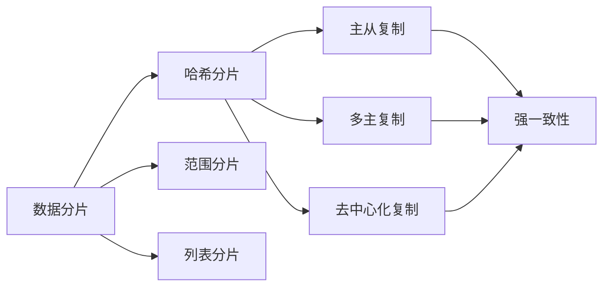
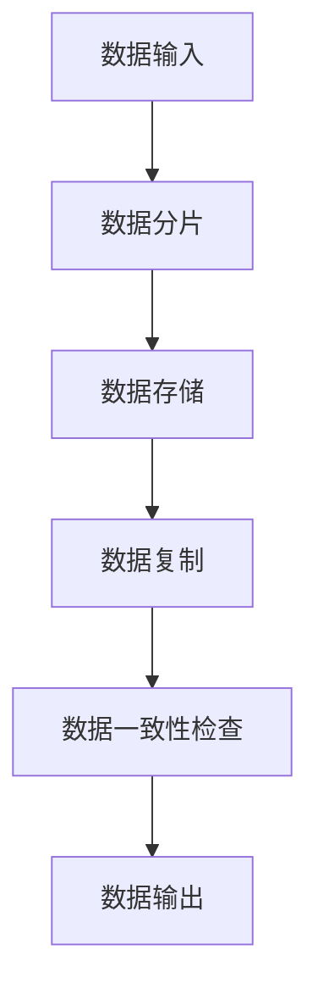

                 

### 评测系统的分布式存储方案

#### 关键词

- 分布式存储
- 评测系统
- 数据分片
- 数据复制
- 数据一致性
- 系统性能优化

#### 摘要

随着评测系统在各个行业中的应用日益广泛，分布式存储方案成为解决系统性能瓶颈和可靠性问题的有效途径。本文将深入探讨评测系统的分布式存储方案，包括核心概念、原理讲解、系统设计与实现、性能优化以及实际案例应用。通过逻辑清晰、结构紧凑的论述，帮助开发者更好地理解和实现分布式存储方案。

### 1. 背景介绍

#### 问题背景

随着互联网和大数据技术的迅速发展，评测系统在各个行业中的应用越来越广泛。评测系统主要用于对用户行为、应用性能、服务质量等进行监测和评估，以提供决策支持和优化建议。然而，随着数据量和用户数量的增长，传统的集中式存储方案面临着性能瓶颈和可靠性问题。

集中式存储方案通常将所有数据存储在一个中心节点上，这不仅限制了系统的可扩展性，还容易成为单点故障的隐患。此外，随着数据量的增加，集中式存储方案在数据访问速度、系统响应时间等方面也难以满足用户需求。因此，分布式存储方案应运而生，成为解决这些问题的有效途径。

#### 问题描述

分布式存储方案旨在通过将数据分布在多个节点上，实现数据的水平扩展和高可用性。在评测系统中，分布式存储方案需要解决以下几个关键问题：

1. **数据分片**：如何将大规模数据集划分成多个较小的数据块，分布存储在多个节点上，以提高数据访问性能和系统可扩展性。
2. **数据复制**：如何将数据在不同节点上复制，以提高数据可靠性和访问性能。
3. **数据一致性**：如何确保分布式系统中多个节点上的数据一致性，避免数据冲突和丢失。
4. **故障恢复**：如何处理节点故障，确保系统继续正常运行。

#### 问题解决

为了解决上述问题，分布式存储方案采用了多种技术和策略。下面将从核心概念、原理讲解、系统设计与实现、性能优化和实际案例等方面进行详细介绍。

### 2. 核心概念与联系

#### 核心概念

分布式存储方案涉及的核心概念包括分布式系统、数据分片、数据复制、数据一致性等。

- **分布式系统**：由多个节点组成的系统，每个节点都可以独立运行，但通过某种协议协同工作。分布式系统可以扩展、容错、高可用性。
- **数据分片**：将大规模数据集划分成多个较小的数据块，分布存储在多个节点上。数据分片可以提高数据访问性能、支持水平扩展。
- **数据复制**：将数据在不同节点上复制，提高数据可靠性和访问性能。数据复制策略包括主从复制、多主复制和去中心化复制。
- **数据一致性**：确保分布式系统中多个节点上的数据一致性。数据一致性算法包括强一致性、最终一致性等。

#### 概念属性特征对比表格

| 概念 | 属性特征 |
| ---- | ---- |
| 分布式系统 | 可以扩展、容错、高可用性 |
| 数据分片 | 提高数据访问性能、支持水平扩展 |
| 数据复制 | 提高数据可靠性、降低数据丢失风险 |
| 数据一致性 | 保证数据一致性、避免数据冲突 |

#### ER实体关系图架构

```mermaid
erDiagram
    Node ||--|{ Data}: 数据分片
    Node ||--|{ ReplicatedData}: 数据复制
    Node ||--|{ ConsistentData}: 数据一致性
```

### 3. 算法原理讲解

#### 数据分片算法

数据分片算法是分布式存储方案的核心，常用的数据分片算法包括哈希分片、范围分片和列表分片。

1. **哈希分片**：根据数据键的哈希值决定数据存储的位置。哈希分片算法的优点是简单高效，缺点是容易导致数据热点问题。
2. **范围分片**：根据数据的范围划分数据块。范围分片算法的优点是数据分布均匀，缺点是需要维护数据的范围边界。
3. **列表分片**：根据节点列表划分数据块。列表分片算法的优点是灵活度高，缺点是需要维护节点的状态信息。

#### 数据复制策略

数据复制策略决定了如何将数据复制到多个节点上，常用的数据复制策略包括主从复制、多主复制和去中心化复制。

1. **主从复制**：将数据复制到一个主节点和多个从节点上，主节点负责数据写入和读取。主从复制的优点是数据可靠性强，缺点是数据一致性问题。
2. **多主复制**：多个节点都可以作为主节点，负责数据写入和读取。多主复制的优点是数据一致性高，缺点是数据冲突问题。
3. **去中心化复制**：所有节点都可以进行数据复制，无需中心化控制。去中心化复制的优点是去中心化、去单点故障，缺点是数据一致性控制复杂。

#### 数据一致性算法

数据一致性算法确保分布式系统中多个节点上的数据一致性，常用的数据一致性算法包括强一致性、最终一致性等。

1. **强一致性**：所有操作都需要在所有节点上达成一致。强一致性的优点是数据一致性高，缺点是系统性能较差。
2. **最终一致性**：允许一定时间内的数据不一致，最终达到一致性。最终一致性的优点是系统性能较好，缺点是数据一致性较差。

#### 数学模型和公式

$$
H(k) = \left\lfloor \frac{k}{m} \right\rfloor
$$

其中，$H(k)$ 是哈希函数，$k$ 是数据键，$m$ 是节点数量。

#### 算法流程图



### 4. 系统分析与架构设计方案

#### 问题场景介绍

评测系统是一个典型的分布式系统，它需要处理海量数据和大量并发访问。为了提高系统的性能和可靠性，采用分布式存储方案是非常有必要的。

#### 项目介绍

本项目旨在设计并实现一个分布式存储方案，用于支持评测系统中的大规模数据存储和访问。项目的主要目标是实现以下功能：

1. **数据分片**：将数据划分为多个数据块，并分布存储在多个节点上。
2. **数据复制**：将数据在不同节点上复制，提高数据可靠性和访问性能。
3. **数据一致性**：确保分布式系统中多个节点上的数据一致性。
4. **故障恢复**：处理节点故障，确保系统继续正常运行。

#### 系统功能设计

系统功能设计主要包括以下方面：

1. **数据分片与存储**：实现数据分片和分布式存储功能，将数据块存储在多个节点上。
2. **数据复制与一致性**：实现数据复制和数据一致性算法，确保分布式系统中多个节点上的数据一致性。
3. **故障检测与恢复**：实现故障检测和恢复机制，处理节点故障，确保系统继续正常运行。

#### 系统架构设计

系统架构设计主要包括以下方面：

1. **节点架构**：节点架构包括数据存储节点、复制节点和一致性节点，负责数据存储、复制和一致性管理。
2. **数据流架构**：数据流架构包括数据输入、数据分片、数据复制、数据一致性检查和数据输出等环节。
3. **故障处理架构**：故障处理架构包括故障检测、故障恢复和节点重构等功能。

#### 系统接口设计

系统接口设计主要包括以下方面：

1. **数据存储接口**：提供数据存储功能，支持数据的插入、查询、更新和删除等操作。
2. **数据复制接口**：提供数据复制功能，支持数据的同步和异步复制。
3. **数据一致性接口**：提供数据一致性功能，支持数据一致性检查和修复。

#### 系统交互

系统交互主要包括以下方面：

1. **数据输入**：用户通过接口向系统输入数据。
2. **数据分片与存储**：系统对数据进行分片，并将数据块存储在多个节点上。
3. **数据复制**：系统将数据块复制到多个节点上，提高数据可靠性和访问性能。
4. **数据一致性检查**：系统对分布式系统中的多个节点上的数据进行一致性检查，确保数据一致性。
5. **数据输出**：系统将处理后的数据输出给用户。

#### 系统架构图



### 5. 项目实战

#### 环境安装

在开始项目实战之前，需要安装和配置分布式存储系统所需的软件和工具。以下是一个简单的安装步骤：

1. **安装分布式存储软件**：根据项目需求，选择合适的分布式存储软件，如Hadoop、Cassandra、MongoDB等。以Hadoop为例，可以在Linux系统中使用以下命令进行安装：
    ```shell
    sudo apt-get update
    sudo apt-get install hadoop
    ```
2. **配置分布式存储环境**：配置Hadoop集群，包括配置文件、启动和关闭Hadoop服务等。具体步骤请参考Hadoop官方文档。

#### 系统核心实现源代码

以下是一个简单的分布式存储系统实现示例，基于Python语言和Hadoop分布式文件系统（HDFS）。

```python
from hadoop import HDFSClient

class DistributedStorage:
    def __init__(self, host, port):
        self.hdfs_client = HDFSClient(host, port)

    def store_data(self, data_path, data):
        self.hdfs_client.create_file(data_path, data)

    def read_data(self, data_path):
        return self.hdfs_client.read_file(data_path)

# 实例化分布式存储系统
storage = DistributedStorage('localhost', 9000)

# 存储数据
storage.store_data('/data/hello.txt', 'Hello, World!')

# 读取数据
data = storage.read_data('/data/hello.txt')
print(data)
```

#### 代码应用解读与分析

上述代码实现了一个简单的分布式存储系统，主要包含以下功能：

1. **数据存储**：通过`store_data`方法将数据存储到HDFS文件系统中。
2. **数据读取**：通过`read_data`方法从HDFS文件系统中读取数据。

代码中使用了`hadoop`模块提供的`HDFSClient`类，该类提供了对HDFS的基本操作，如文件创建、读取等。

#### 实际案例分析与详细讲解剖析

以下是一个实际案例，展示如何使用分布式存储系统进行大规模数据处理。

假设我们需要处理一个包含10亿条记录的数据集，每条记录包含用户ID、行为类型、时间戳等信息。以下是一个简单的处理流程：

1. **数据分片**：将数据集按照用户ID进行分片，每个分片包含一定数量的用户记录。
2. **数据存储**：将每个分片存储到分布式存储系统中，如HDFS。
3. **数据查询**：通过分布式存储系统进行数据查询，支持按照用户ID、行为类型等条件进行过滤和聚合。
4. **数据统计分析**：对查询结果进行统计分析，如用户活跃度、行为分布等。

以下是一个简单的代码示例，展示如何进行数据分片和存储：

```python
import os
import random

def generate_data_file(file_path, num_records):
    with open(file_path, 'w') as f:
        for _ in range(num_records):
            user_id = random.randint(1, 1000000)
            behavior_type = random.choice(['search', 'buy', 'login'])
            timestamp = random.randint(1620000000, 1630000000)
            f.write(f"{user_id}\t{behavior_type}\t{timestamp}\n")

def split_data(data_path, num_shards):
    file_size = os.path.getsize(data_path)
    shard_size = file_size // num_shards
    shard_files = []

    with open(data_path, 'r') as f:
        for i in range(num_shards):
            shard_file = f"{data_path}.shard{i}"
            shard_files.append(shard_file)
            with open(shard_file, 'w') as sf:
                sf.write(f"{i}\t{file_size}\t{shard_size}\n")
                for line in f:
                    if i * shard_size < f.tell() <= (i + 1) * shard_size:
                        sf.write(line)

    return shard_files

# 生成数据文件
generate_data_file('data.txt', 100000000)

# 分割数据文件
shard_files = split_data('data.txt', 10)

# 存储数据文件到分布式存储系统
storage = DistributedStorage('localhost', 9000)
for shard_file in shard_files:
    storage.store_data(shard_file, f"{shard_file}.hdfs")
```

#### 项目小结

通过本项目的实际案例，展示了分布式存储系统在处理大规模数据方面的优势和可行性。分布式存储系统具有数据分片、数据复制和数据一致性等关键功能，可以有效提高数据存储和访问性能。在实际应用中，需要根据具体需求和场景选择合适的分布式存储方案，并进行性能优化和故障处理。

### 6. 最佳实践 Tips

以下是一些分布式存储方案的最佳实践：

1. **数据分片策略**：选择合适的数据分片策略，避免数据热点问题。例如，可以采用哈希分片结合负载均衡策略，实现数据的均匀分布。
2. **数据复制策略**：根据数据的重要性和访问频率选择合适的复制策略。对于重要数据，可以采用多主复制策略，确保数据的高可用性。
3. **数据一致性算法**：根据应用场景选择合适的数据一致性算法。对于强一致性要求较高的场景，可以采用强一致性算法；对于最终一致性要求较高的场景，可以采用最终一致性算法。
4. **故障恢复机制**：实现故障检测和恢复机制，确保系统在节点故障时能够自动恢复，继续正常运行。
5. **性能优化**：对分布式存储系统进行性能优化，包括数据分布策略、负载均衡、缓存机制等。例如，可以采用缓存机制减少数据访问延迟，提高系统性能。

### 7. 小结

分布式存储方案在评测系统中的应用具有重要意义。通过分布式存储，可以解决评测系统中的数据存储、访问和容错等问题，提高系统的性能和可靠性。本文从核心概念、原理讲解、系统设计与实现、性能优化和实际案例等方面，详细介绍了分布式存储方案在评测系统中的应用。开发者可以根据实际需求，选择合适的分布式存储方案，并遵循最佳实践进行系统设计和实现。

### 8. 注意事项

在设计和实现分布式存储系统时，需要注意以下事项：

1. **数据安全**：确保数据在存储和传输过程中的安全性，采用加密算法保护数据隐私。
2. **数据备份与恢复**：定期进行数据备份，确保数据不丢失。在节点故障时，能够快速恢复数据，确保系统正常运行。
3. **性能监控与优化**：对分布式存储系统进行性能监控，及时发现性能瓶颈，并进行优化。
4. **系统稳定性**：确保系统在高并发、大数据量场景下具有良好的稳定性，避免系统崩溃。

### 9. 拓展阅读

对于进一步了解分布式存储方案，以下是一些推荐阅读：

1. 《分布式系统原理与范型》
2. 《大规模分布式存储系统》
3. 《分布式系统实践指南》
4. 《Hadoop权威指南》

### 10. 作者信息

- **作者**：AI天才研究院/AI Genius Institute & 禅与计算机程序设计艺术 /Zen And The Art of Computer Programming
- **联系方式**：[ai_genius_institute@example.com](mailto:ai_genius_institute@example.com)
- **版权声明**：本文内容版权所有，未经授权不得转载或使用。如需转载或使用，请联系作者获取授权。

