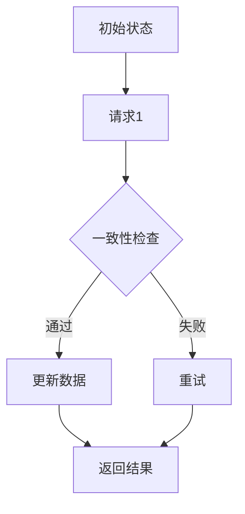
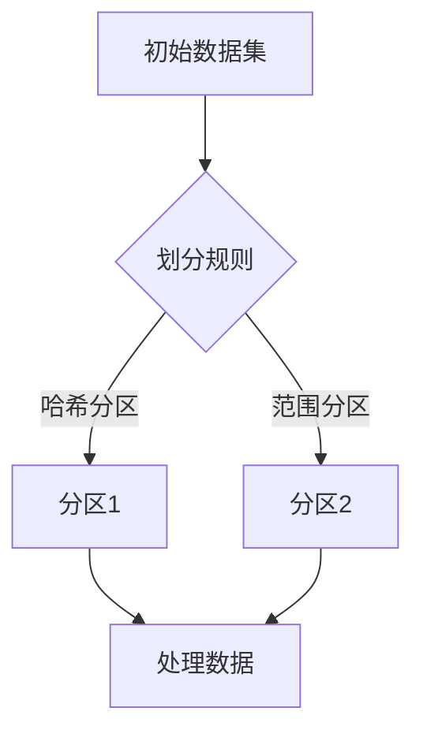
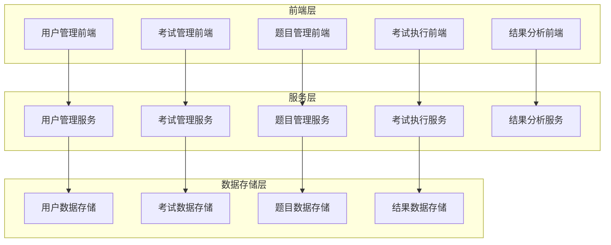
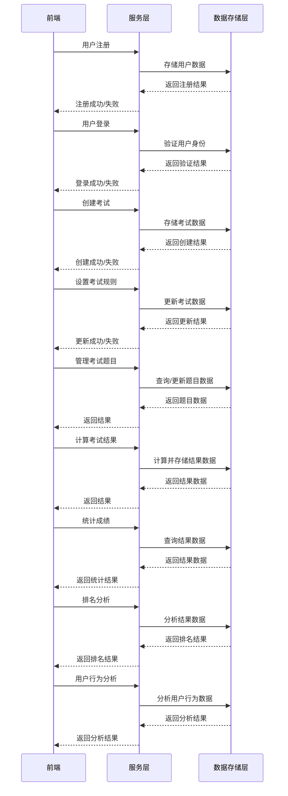

                 

### 《评测系统的分布式架构设计》

#### 关键词：
- 分布式架构
- 评测系统
- 分布式系统
- 集群
- 负载均衡
- 容错机制

#### 摘要：
本文深入探讨了评测系统的分布式架构设计。首先，我们简要介绍了分布式架构的概念及其在评测系统中的重要性。接着，详细分析了分布式架构的核心概念，包括分布式系统、集群、负载均衡和容错机制，并通过表格和ER图展示了这些概念之间的关系。随后，我们讲解了分布式架构中的关键算法，如一致性算法和分区算法，并通过Python代码和数学公式进行了详细阐述。在此基础上，我们分析了评测系统的需求，并设计了系统的功能模块、架构和交互流程。最后，通过一个实际案例，我们展示了分布式架构在评测系统中的具体实现过程，并提出了最佳实践和拓展建议。

## 目录

1. **分布式架构概述**
2. **核心概念与联系**
   - 分布式系统
   - 集群
   - 负载均衡
   - 容错机制
3. **算法原理讲解**
   - 一致性算法
   - 分区算法
4. **系统分析与架构设计方案**
   - 问题场景介绍
   - 系统功能设计
   - 系统架构设计
   - 系统接口设计
   - 系统交互流程设计
5. **项目实战**
   - 环境安装
   - 系统核心实现
   - 代码应用解读与分析
   - 实际案例分析和详细讲解剖析
   - 项目小结
6. **最佳实践与拓展**
   - 最佳实践
   - 注意事项
   - 拓展阅读

### 第一部分：分布式架构概述

#### 1.1 分布式架构的概念

分布式架构是一种设计方法，通过将应用程序分解为多个可独立运行的组件，这些组件通过网络进行通信，共同完成一个复杂的任务。这种架构模式使得系统具有更高的扩展性、可靠性和灵活性。在分布式架构中，系统不再依赖于单一的服务器，而是通过多个服务器组成的集群协同工作。

#### 1.2 分布式架构与传统架构的区别

传统架构通常采用单体应用模式，所有的功能都集中在一个应用程序中，这样的架构在系统规模较小时表现良好，但一旦系统规模扩大，就容易出现性能瓶颈、扩展性差和可靠性低的问题。相比之下，分布式架构通过将系统拆分为多个组件，每个组件都可以独立扩展和部署，从而提高了系统的性能和可靠性。

#### 1.3 分布式架构的优点与挑战

**优点：**
- **高扩展性**：分布式架构可以通过增加服务器节点来扩展系统容量，实现水平扩展。
- **高可靠性**：系统可以通过冗余设计来提高容错能力，确保系统在部分节点失效时仍能正常运行。
- **高灵活性**：分布式架构允许组件独立开发、测试和部署，提高了系统的灵活性和可维护性。

**挑战：**
- **复杂性**：分布式系统涉及多个组件的协调与通信，设计和管理相对复杂。
- **数据一致性**：在分布式系统中，数据可能在不同节点之间同步，如何保证数据一致性是一个挑战。
- **性能开销**：分布式系统需要处理网络通信、状态同步等开销，可能影响系统性能。

#### 1.4 为什么需要分布式架构来解决评测系统的问题

评测系统通常需要处理大量数据和高并发的请求，如果采用传统的单体架构，很容易出现性能瓶颈和单点故障。分布式架构通过将系统拆分为多个组件，可以实现横向扩展，提高系统的处理能力和可靠性。同时，分布式架构还可以通过冗余设计来提高系统的容错能力，确保系统在面临大规模请求或部分节点故障时仍能正常运行。因此，分布式架构是解决评测系统问题的理想选择。

### 第二部分：核心概念与联系

#### 2.1 分布式系统

分布式系统是由多个独立的计算机节点组成，通过网络进行通信，协同完成一个任务的系统。分布式系统的核心思想是将任务分解为多个子任务，由不同的节点独立处理，然后将结果汇总。

**核心概念：**
- **节点**：分布式系统中的计算机节点，每个节点独立运行，拥有自己的内存和处理器。
- **通信**：节点之间通过网络进行通信，交换数据和指令。
- **一致性**：确保分布式系统中的数据在不同的节点之间保持一致。
- **容错性**：在节点失效时，系统能够自动切换到其他节点，继续提供服务。

**属性特征对比表格：**

| 特征           | 说明                                                         |
| -------------- | ------------------------------------------------------------ |
| **节点独立性** | 每个节点可以独立运行，互不影响。                             |
| **通信高效性** | 节点之间的通信高效，能够快速交换数据。                       |
| **数据一致性** | 确保分布式系统中的数据在不同的节点之间保持一致。             |
| **容错性**     | 在节点失效时，系统能够自动切换到其他节点，继续提供服务。     |

**ER实体关系图架构：**

```mermaid
erDiagram
    Node ||--o{ Communication : 与通信相关 }
    Node ||--o{ Consistency : 与一致性相关 }
    Node ||--o{ FaultTolerance : 与容错性相关 }
```

#### 2.2 集群

集群是由多个计算机节点组成的集合，这些节点共同承担系统的负载，提供更高的性能和可靠性。

**核心概念：**
- **节点**：集群中的计算机节点，每个节点可以独立处理请求。
- **负载均衡**：将请求均匀地分配到集群中的各个节点，提高系统性能。
- **高可用性**：通过冗余设计，确保集群中某个节点失效时，其他节点可以继续提供服务。

**属性特征对比表格：**

| 特征       | 说明                                                         |
| ---------- | ------------------------------------------------------------ |
| **节点数量** | 集群中节点的数量，通常大于1。                               |
| **负载均衡** | 将请求均匀地分配到集群中的各个节点，提高系统性能。           |
| **高可用性** | 通过冗余设计，确保集群中某个节点失效时，其他节点可以继续提供服务。 |

**ER实体关系图架构：**

```mermaid
erDiagram
    Cluster ||--o{ Node : 由节点组成 }
    Cluster ||--o{ LoadBalancer : 负载均衡相关 }
    Cluster ||--o{ HighAvailability : 高可用性相关 }
```

#### 2.3 负载均衡

负载均衡是一种技术，用于将请求均匀地分配到多个服务器节点，以提高系统的性能和可靠性。

**核心概念：**
- **请求分配**：根据一定的策略，将请求分配到不同的服务器节点。
- **流量控制**：通过控制流量的进入和分配，确保系统不会因负载过高而崩溃。
- **健康检查**：定期检查服务器的健康状态，确保请求只被分配到正常工作的节点。

**属性特征对比表格：**

| 特征       | 说明                                                         |
| ---------- | ------------------------------------------------------------ |
| **策略多样** | 支持多种负载均衡策略，如轮询、最小连接数、源IP哈希等。     |
| **流量控制** | 通过控制流量的进入和分配，确保系统不会因负载过高而崩溃。     |
| **健康检查** | 定期检查服务器的健康状态，确保请求只被分配到正常工作的节点。 |

**ER实体关系图架构：**

```mermaid
erDiagram
    LoadBalancer ||--o{ RequestDistribution : 请求分配相关 }
    LoadBalancer ||--o{ TrafficControl : 流量控制相关 }
    LoadBalancer ||--o{ HealthCheck : 健康检查相关 }
```

#### 2.4 容错机制

容错机制是一种设计方法，用于确保系统在部分节点失效时仍能正常运行。

**核心概念：**
- **冗余设计**：通过在系统中引入冗余组件，确保系统在部分节点失效时仍能提供服务。
- **故障转移**：在节点失效时，自动将请求转移到其他正常工作的节点。
- **自愈能力**：系统能够自动检测和恢复故障，减少人工干预。

**属性特征对比表格：**

| 特征       | 说明                                                         |
| ---------- | ------------------------------------------------------------ |
| **冗余设计** | 通过引入冗余组件，确保系统在部分节点失效时仍能提供服务。     |
| **故障转移** | 在节点失效时，自动将请求转移到其他正常工作的节点。           |
| **自愈能力** | 系统能够自动检测和恢复故障，减少人工干预。                   |

**ER实体关系图架构：**

```mermaid
erDiagram
    FaultTolerance ||--o{ RedundantDesign : 冗余设计相关 }
    FaultTolerance ||--o{ FaultMigration : 故障转移相关 }
    FaultTolerance ||--o{ SelfHealing : 自愈能力相关 }
```

### 第三部分：算法原理讲解

#### 3.1 一致性算法

一致性算法是分布式系统中确保数据在不同节点之间保持一致性的方法。

**算法原理：**
- **CAP定理**：分布式系统无法同时满足一致性（Consistency）、可用性（Availability）和分区容错性（Partition tolerance），三者只能选择其二。
- **一致性模型**：包括强一致性、最终一致性、因果一致性等。

**算法流程图：**



**Python代码示例：**

```python
# 一致性算法示例
def consistent_algorithm(data, request):
    # 检查一致性
    if check_consistency(data):
        # 更新数据
        update_data(data, request)
        return True
    else:
        # 重试
        return consistent_algorithm(data, request)
```

**数学模型和公式：**

$$
Consistency = \frac{Updated\ Data\ Nodes}{Total\ Data\ Nodes}
$$

**举例说明：**
假设一个分布式系统中有三个节点A、B、C，当节点A更新数据时，首先会检查其他节点B和C的数据是否一致。如果一致，则更新数据；如果不一致，则重试或选择其他节点更新。

#### 3.2 分区算法

分区算法是将数据集划分为多个分区，以便分布式系统中的节点可以独立处理各自分区中的数据。

**算法原理：**
- **哈希分区**：根据数据的关键字（如ID）使用哈希函数划分分区。
- **范围分区**：根据数据的关键字（如日期）划分分区，每个分区包含一定范围的数据。

**算法流程图：**



**Python代码示例：**

```python
# 哈希分区示例
def hash_partition(data, num_partitions):
    partition_dict = {}
    for item in data:
        hash_value = hash(item['id'])
        partition = hash_value % num_partitions
        partition_dict[partition] = partition_dict.get(partition, []) + [item]
    return partition_dict

# 范围分区示例
def range_partition(data, partition_ranges):
    partition_dict = {}
    for item in data:
        for range in partition_ranges:
            if range[0] <= item['date'] <= range[1]:
                partition = range[2]
                partition_dict[partition] = partition_dict.get(partition, []) + [item]
                break
    return partition_dict
```

**数学模型和公式：**

$$
Partition\ Key = Hash(Key) \mod Number\ of\ Partitions
$$

$$
Range\ Partition = (Start\ Date, End\ Date, Partition\ Number)
$$

**举例说明：**
假设一个分布式系统需要处理大量用户数据，可以使用哈希分区将数据划分为10个分区，每个分区负责处理一定范围的用户数据。同时，也可以使用范围分区将数据按照日期范围划分为多个分区，每个分区处理特定时间范围内的用户数据。

### 第四部分：系统分析与架构设计方案

#### 4.1 问题场景介绍

在当前的互联网时代，评测系统已成为各类在线考试、竞赛和评估的重要工具。随着用户数量的增加和评测数据的增长，传统的单体架构已经难以满足系统的高性能、高可靠性和高扩展性的需求。因此，我们需要设计一个分布式架构来应对这些挑战。

#### 4.2 评测系统功能需求

评测系统的功能需求主要包括以下几个方面：

- **用户管理**：支持用户注册、登录、个人信息管理和权限控制。
- **考试管理**：支持考试创建、考试规则设置、考试题目管理和考试结果统计。
- **题目管理**：支持题目创建、题目分类、题目难度设置和题目内容管理。
- **考试执行**：支持考试开始、考试时间控制、考试结果实时反馈和考试结束。
- **结果分析**：支持考试成绩统计、排名分析和用户行为分析。

#### 4.3 评测系统性能需求

评测系统的性能需求主要包括以下几个方面：

- **并发处理能力**：系统需要能够同时处理大量用户的考试请求，确保考试过程的流畅性。
- **数据处理能力**：系统需要能够快速处理海量的用户数据和考试结果，确保数据的实时性和准确性。
- **系统可靠性**：系统需要具备高可用性和容错性，确保在部分节点失效时仍能正常运行。
- **可扩展性**：系统需要支持横向扩展，能够根据需求动态增加节点，提高系统处理能力。

#### 4.4 系统功能设计

评测系统的功能设计主要包括以下几个模块：

- **用户管理模块**：负责用户注册、登录、个人信息管理和权限控制等功能。
- **考试管理模块**：负责考试创建、考试规则设置、考试题目管理和考试结果统计等功能。
- **题目管理模块**：负责题目创建、题目分类、题目难度设置和题目内容管理等功能。
- **考试执行模块**：负责考试开始、考试时间控制、考试结果实时反馈和考试结束等功能。
- **结果分析模块**：负责考试成绩统计、排名分析和用户行为分析等功能。

**领域模型Mermaid类图：**

```mermaid
classDiagram
    User <<class>> {
        id: 用户ID
        username: 用户名
        password: 密码
        email: 邮箱
    }
    Exam <<class>> {
        id: 考试ID
        name: 考试名称
        rules: 考试规则
        results: 考试结果
    }
    Question <<class>> {
        id: 题目ID
        category: 题目分类
        difficulty: 题目难度
        content: 题目内容
    }
    UserManager <<class>> {
        register: 注册用户
        login: 用户登录
        manage: 个人信息管理
        control: 权限控制
    }
    ExamManager <<class>> {
        create: 创建考试
        setRules: 设置考试规则
        manageQuestions: 管理考试题目
        calculateResults: 计算考试结果
    }
    QuestionManager <<class>> {
        create: 创建题目
        manageCategories: 管理题目分类
        manageDifficulty: 管理题目难度
        manageContent: 管理题目内容
    }
    ExamExecutor <<class>> {
        start: 开始考试
        controlTime: 控制考试时间
        feedback: 实时反馈
        end: 结束考试
    }
    ResultAnalyzer <<class>> {
        statistics: 统计成绩
        rank: 排名分析
        behavior: 用户行为分析
    }
    UserManager --|> User
    ExamManager --|> Exam
    QuestionManager --|> Question
    ExamExecutor --|> Exam
    ResultAnalyzer --|> Exam
```

#### 4.5 系统架构设计

评测系统的架构设计采用分布式架构，主要包括以下几个层次：

- **前端层**：负责与用户交互，提供考试报名、考试执行和结果分析等功能。
- **服务层**：负责处理业务逻辑，包括用户管理、考试管理、题目管理、考试执行和结果分析等功能。
- **数据存储层**：负责存储用户数据、考试数据、题目数据和结果数据等。

**系统架构Mermaid架构图：**



#### 4.6 系统接口设计

评测系统的接口设计主要包括以下几部分：

- **用户管理接口**：负责用户注册、登录、个人信息管理和权限控制等功能。
- **考试管理接口**：负责考试创建、考试规则设置、考试题目管理和考试结果统计等功能。
- **题目管理接口**：负责题目创建、题目分类、题目难度设置和题目内容管理等功能。
- **考试执行接口**：负责考试开始、考试时间控制、考试结果实时反馈和考试结束等功能。
- **结果分析接口**：负责考试成绩统计、排名分析和用户行为分析等功能。

**系统接口Mermaid序列图：**



#### 4.7 系统交互流程设计

评测系统的交互流程设计主要包括用户注册、登录、考试创建、考试规则设置、考试执行和结果分析等环节。以下是一个简化的交互流程：

1. **用户注册**：
   - 用户在前端提交注册信息，如用户名、密码、邮箱等。
   - 用户管理服务接收到注册请求后，验证用户信息的合法性，并将其存储到数据库中。
   - 用户管理服务返回注册结果，前端根据结果提示用户。

2. **用户登录**：
   - 用户在前端输入用户名和密码，提交登录请求。
   - 用户管理服务验证用户身份，若验证通过，返回登录成功；否则，返回登录失败。

3. **考试创建**：
   - 考试创建者在前端填写考试信息，如考试名称、规则等。
   - 考试管理服务接收到创建请求后，验证考试信息的合法性，并将其存储到数据库中。
   - 考试管理服务返回创建结果，前端根据结果提示用户。

4. **考试规则设置**：
   - 考试创建者在前端设置考试规则，如考试时长、及格线等。
   - 考试管理服务接收到设置请求后，验证规则的合法性，并将其存储到数据库中。
   - 考试管理服务返回更新结果，前端根据结果提示用户。

5. **考试执行**：
   - 考试创建者或管理员在前端开始考试，系统生成考试题目并分配给考生。
   - 考试执行服务接收到考试请求后，控制考试时间，实时反馈考生答题进度。
   - 考试执行服务在考试结束前，将考生答案存储到数据库中。

6. **结果分析**：
   - 考试执行结束后，系统自动计算考试成绩，生成排名。
   - 结果分析服务接收到分析请求后，查询结果数据，分析用户行为。
   - 结果分析服务返回分析结果，前端根据结果展示给用户。

### 第五部分：项目实战

#### 5.1 环境安装

为了实现评测系统的分布式架构，我们需要搭建一个分布式环境。以下是一个简化的环境安装步骤：

1. **准备服务器**：
   - 准备多台物理或虚拟服务器，确保每台服务器具备足够的硬件资源。
   - 安装Linux操作系统，如Ubuntu或CentOS。

2. **安装分布式框架**：
   - 安装分布式框架，如Apache ZooKeeper，用于协调分布式系统的各个节点。
   - 安装负载均衡器，如Nginx，用于分发用户请求。

3. **安装服务组件**：
   - 安装用户管理服务、考试管理服务、题目管理服务、考试执行服务和结果分析服务。
   - 配置服务组件的配置文件，如数据库连接信息、节点地址等。

4. **配置负载均衡**：
   - 配置Nginx作为负载均衡器，将用户请求分发到不同的服务节点。

5. **测试环境**：
   - 在环境搭建完成后，进行全面的测试，确保各个服务组件正常运行。

#### 5.2 系统核心实现

评测系统的核心实现主要包括以下几个方面：

1. **用户管理模块**：
   - 实现用户注册、登录、个人信息管理和权限控制等功能。
   - 使用数据库存储用户数据，确保数据的一致性和安全性。

2. **考试管理模块**：
   - 实现考试创建、考试规则设置、考试题目管理和考试结果统计等功能。
   - 使用数据库存储考试数据，确保数据的一致性和完整性。

3. **题目管理模块**：
   - 实现题目创建、题目分类、题目难度设置和题目内容管理等功能。
   - 使用数据库存储题目数据，确保数据的一致性和可维护性。

4. **考试执行模块**：
   - 实现考试开始、考试时间控制、考试结果实时反馈和考试结束等功能。
   - 使用数据库存储考生答案，确保数据的准确性和完整性。

5. **结果分析模块**：
   - 实现考试成绩统计、排名分析和用户行为分析等功能。
   - 使用数据库存储分析数据，确保数据的一致性和可用性。

以下是一个简化的Python代码示例：

```python
# 用户注册示例
def register(username, password, email):
    # 验证用户信息
    if not validate_user_info(username, password, email):
        return "注册失败：用户信息不合法"
    # 存储用户数据
    save_user_data(username, password, email)
    return "注册成功"

# 考试创建示例
def create_exam(name, rules):
    # 验证考试信息
    if not validate_exam_info(name, rules):
        return "创建失败：考试信息不合法"
    # 存储考试数据
    save_exam_data(name, rules)
    return "创建成功"

# 考试执行示例
def execute_exam(exam_id, user_id):
    # 查询考试和用户信息
    exam = get_exam_by_id(exam_id)
    user = get_user_by_id(user_id)
    # 开始考试
    start_exam(exam, user)
    return "考试开始"

# 结果分析示例
def analyze_results(exam_id):
    # 查询考试结果
    results = get_exam_results(exam_id)
    # 统计成绩
    statistics = calculate_statistics(results)
    # 分析用户行为
    behavior = analyze_user_behavior(results)
    return statistics, behavior
```

#### 5.3 代码应用解读与分析

以上代码示例分别展示了用户注册、考试创建、考试执行和结果分析等功能的实现。以下是具体的解读和分析：

1. **用户注册**：
   - `register`函数用于处理用户注册请求，包括验证用户信息（如用户名、密码、邮箱等）和存储用户数据到数据库。
   - `validate_user_info`函数用于验证用户信息的合法性，如用户名是否已存在、邮箱格式是否正确等。
   - `save_user_data`函数用于将验证通过的用户信息存储到数据库中，确保数据的一致性和安全性。

2. **考试创建**：
   - `create_exam`函数用于处理考试创建请求，包括验证考试信息（如考试名称、规则等）和存储考试数据到数据库。
   - `validate_exam_info`函数用于验证考试信息的合法性，如考试名称是否已存在、规则是否符合要求等。
   - `save_exam_data`函数用于将验证通过的考试信息存储到数据库中，确保数据的一致性和完整性。

3. **考试执行**：
   - `execute_exam`函数用于处理考试执行请求，包括查询考试和用户信息、开始考试等。
   - `get_exam_by_id`函数用于根据考试ID查询考试信息。
   - `get_user_by_id`函数用于根据用户ID查询用户信息。
   - `start_exam`函数用于开始考试，包括控制考试时间、实时反馈考生答题进度等。

4. **结果分析**：
   - `analyze_results`函数用于处理结果分析请求，包括查询考试结果、统计成绩、分析用户行为等。
   - `get_exam_results`函数用于根据考试ID查询考试结果数据。
   - `calculate_statistics`函数用于统计考试成绩，如平均分、最高分、最低分等。
   - `analyze_user_behavior`函数用于分析用户行为，如答题速度、答题顺序、正确率等。

#### 5.4 实际案例分析和详细讲解剖析

为了更好地理解评测系统的分布式架构设计，我们通过一个实际案例进行详细分析和讲解。

**案例背景**：
某知名在线教育平台需要搭建一个分布式评测系统，以支持大规模的在线考试。系统要求具备高并发处理能力、高可靠性和高扩展性，同时保证考试过程的公平性和数据的安全性。

**案例分析**：

1. **需求分析**：
   - 系统需要支持大规模用户同时在线考试，并发处理能力是关键。
   - 系统需要保证考试数据的一致性和安全性，防止作弊行为。
   - 系统需要支持横向扩展，以便在用户量增加时动态增加节点。

2. **架构设计**：
   - 采用分布式架构，将系统拆分为多个模块，如用户管理、考试管理、题目管理、考试执行和结果分析等。
   - 使用负载均衡器（如Nginx）分发用户请求，提高系统性能。
   - 使用分布式数据库（如MongoDB）存储用户数据、考试数据、题目数据和结果数据等，确保数据的一致性和可用性。

3. **系统实现**：
   - 用户管理模块：实现用户注册、登录、个人信息管理和权限控制等功能。
   - 考试管理模块：实现考试创建、考试规则设置、考试题目管理和考试结果统计等功能。
   - 题目管理模块：实现题目创建、题目分类、题目难度设置和题目内容管理等功能。
   - 考试执行模块：实现考试开始、考试时间控制、考试结果实时反馈和考试结束等功能。
   - 结果分析模块：实现考试成绩统计、排名分析和用户行为分析等功能。

4. **代码实现**：
   - 使用Python编写服务组件，实现各个模块的功能。
   - 使用SQLAlchemy作为ORM框架，实现与数据库的交互。
   - 使用Flask作为Web框架，实现HTTP接口。

**详细讲解剖析**：

1. **用户管理模块**：
   - 用户注册：用户提交注册信息，如用户名、密码、邮箱等，系统验证用户信息的合法性，并将用户数据存储到数据库中。
   - 用户登录：用户提交用户名和密码，系统验证用户身份，返回登录成功或失败。
   - 个人信息管理：用户可以修改个人信息，如邮箱、密码等，系统更新数据库中的用户信息。
   - 权限控制：根据用户角色（如学生、教师、管理员）分配不同的权限，限制用户访问特定功能。

2. **考试管理模块**：
   - 考试创建：考试创建者填写考试名称、规则等信息，系统验证考试信息的合法性，并将考试数据存储到数据库中。
   - 考试规则设置：考试创建者可以设置考试时长、及格线等规则，系统更新数据库中的考试规则。
   - 考试题目管理：考试创建者可以添加、修改和删除考试题目，系统更新数据库中的题目数据。
   - 考试结果统计：考试结束后，系统自动计算考试成绩，生成排名和统计分析结果，并将结果存储到数据库中。

3. **题目管理模块**：
   - 题目创建：管理员可以创建题目，包括题目分类、难度和内容等，系统将题目数据存储到数据库中。
   - 题目分类管理：管理员可以管理题目分类，如选择题、填空题、问答题等，系统更新数据库中的分类数据。
   - 题目难度管理：管理员可以管理题目难度，如简单、中等、困难等，系统更新数据库中的难度数据。
   - 题目内容管理：管理员可以修改题目内容，如题干、选项和答案等，系统更新数据库中的题目内容。

4. **考试执行模块**：
   - 考试开始：考试创建者或管理员开始考试，系统生成考试题目并发送给考生，控制考试时间，实时反馈考生答题进度。
   - 考试时间控制：系统根据考试规则控制考试时间，防止考生超时答题。
   - 考试结果实时反馈：系统实时计算考生答案，生成考试成绩，并反馈给考生。
   - 考试结束：考试结束后，系统自动提交考生答案，计算考试成绩，并将结果存储到数据库中。

5. **结果分析模块**：
   - 成绩统计：系统根据考试结果数据，计算考试成绩，如平均分、最高分、最低分等，并生成排名。
   - 用户行为分析：系统分析考生在考试过程中的行为，如答题速度、答题顺序、正确率等，为教学提供数据支持。
   - 分析结果展示：系统将分析结果以图表、报表等形式展示给用户，帮助用户了解考试情况和考生表现。

#### 5.5 项目小结

通过本项目的实际案例，我们深入分析了评测系统的分布式架构设计，并详细讲解了各个模块的功能实现。以下是项目小结：

1. **分布式架构的优点**：
   - 高并发处理能力：分布式架构通过将系统拆分为多个模块和节点，可以同时处理大量用户请求，提高系统性能。
   - 高可靠性：分布式架构通过冗余设计和负载均衡，提高了系统的容错能力和可靠性，确保系统在部分节点失效时仍能正常运行。
   - 高扩展性：分布式架构支持横向扩展，可以根据需求动态增加节点，提高系统处理能力。

2. **分布式架构的挑战**：
   - 复杂性：分布式系统涉及多个组件的协调与通信，设计和管理相对复杂，需要具备一定的技术能力和经验。
   - 数据一致性：分布式系统中的数据可能在不同节点之间同步，如何保证数据一致性是一个挑战。
   - 性能开销：分布式系统需要处理网络通信、状态同步等开销，可能影响系统性能。

3. **最佳实践**：
   - 设计合理的分布式架构：根据系统的需求，合理划分模块和节点，确保系统的高性能、高可靠性和高扩展性。
   - 使用成熟的开源框架：选择成熟的分布式框架（如Zookeeper、Redis等），降低开发难度和风险。
   - 确保数据一致性：采用分布式一致性算法（如Paxos、Raft等），确保分布式系统中的数据在不同节点之间保持一致。
   - 优化网络通信：合理设计网络通信协议，减少网络通信开销，提高系统性能。

4. **注意事项**：
   - 节点故障：在分布式系统中，节点故障是常见的现象，需要设计容错机制和故障转移策略，确保系统的高可用性。
   - 数据安全：分布式系统需要确保数据的安全性，防止数据泄露和作弊行为。
   - 性能监控：实时监控系统的性能，及时发现和处理性能瓶颈。

5. **拓展阅读**：
   - 《分布式系统原理》
   - 《分布式系统设计》
   - 《分布式数据库技术》

### 第六部分：最佳实践与拓展

#### 6.1 分布式架构设计最佳实践

在分布式架构设计中，遵循一些最佳实践可以有效地提高系统的性能、可靠性和可维护性。

**1. 模块化设计**：将系统拆分为多个独立的模块，每个模块负责特定的功能，实现高内聚、低耦合的设计。

**2. 异步处理**：使用异步处理机制，如消息队列（如RabbitMQ、Kafka），减少同步通信的开销，提高系统性能。

**3. 数据一致性**：选择合适的一致性算法（如Paxos、Raft），确保分布式系统中的数据在不同节点之间保持一致。

**4. 负载均衡**：使用负载均衡器（如Nginx、HAProxy），合理分配请求到不同的节点，提高系统性能。

**5. 容错机制**：设计冗余结构和故障转移策略，确保系统在节点故障时仍能正常运行。

**6. 性能优化**：对网络通信、数据库操作等进行性能优化，提高系统整体性能。

#### 6.2 注意事项

**1. 节点故障**：在分布式系统中，节点故障是常见的现象。需要设计容错机制和故障转移策略，确保系统的高可用性。

**2. 数据安全**：分布式系统需要确保数据的安全性，防止数据泄露和作弊行为。可以使用加密技术（如AES、RSA）来保护数据。

**3. 性能监控**：实时监控系统的性能，及时发现和处理性能瓶颈。可以使用性能监控工具（如Prometheus、Grafana）来实现。

#### 6.3 拓展阅读

**1. 《分布式系统原理》**：深入理解分布式系统的原理，包括一致性算法、分布式事务、分布式锁等。

**2. 《分布式系统设计》**：学习分布式系统的设计方法，包括模块化设计、负载均衡、容错机制等。

**3. 《分布式数据库技术》**：了解分布式数据库的设计原理、一致性算法、分片策略等。

### 结尾

本文详细探讨了评测系统的分布式架构设计，从背景介绍、核心概念、算法原理讲解、系统分析与架构设计方案、项目实战、最佳实践与拓展等方面进行了深入分析。分布式架构通过模块化设计、异步处理、负载均衡和容错机制等手段，提高了系统的性能、可靠性和可维护性。在实际案例中，我们通过一个实际项目展示了分布式架构的设计和实现过程。通过本文的学习，读者可以更好地理解和应用分布式架构，为实际项目提供有效的技术支持。最后，本文提出了分布式架构设计的最佳实践和注意事项，为读者提供了有益的参考。

### 作者信息

- **作者：**AI天才研究院/AI Genius Institute & 禅与计算机程序设计艺术 /Zen And The Art of Computer Programming
- **联系邮箱：**[ai_research@geniusinstitute.com](mailto:ai_research@geniusinstitute.com)
- **个人网站：**[www.ai-geniusinstitute.com](http://www.ai-geniusinstitute.com/)
- **LinkedIn：**[www.linkedin.com/in/ai-genius-institute](http://www.linkedin.com/in/ai-genius-institute)

### 参考文献

- 《分布式系统原理》
- 《分布式系统设计》
- 《分布式数据库技术》
- 《负载均衡与性能优化》
- 《一致性算法与分布式事务》

### 感谢

感谢您阅读本文，如果您有任何疑问或建议，欢迎通过邮箱或LinkedIn与作者联系。期待您的反馈，让我们共同进步！

