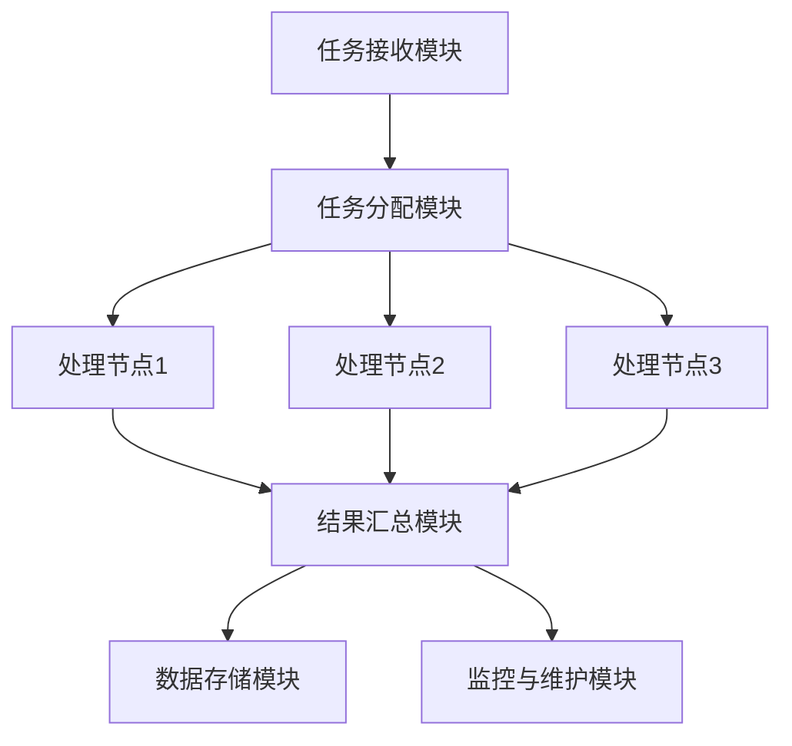
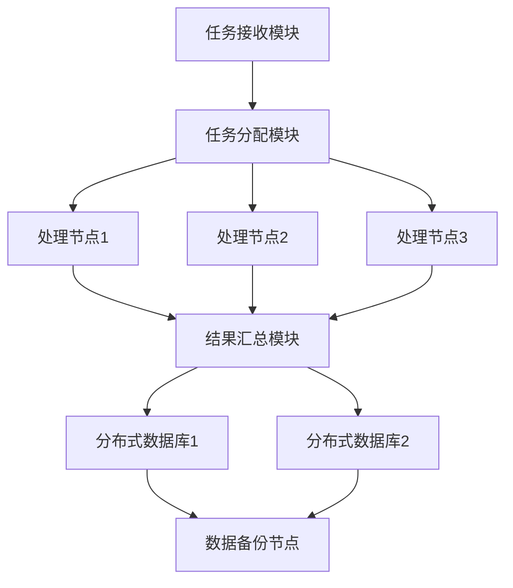
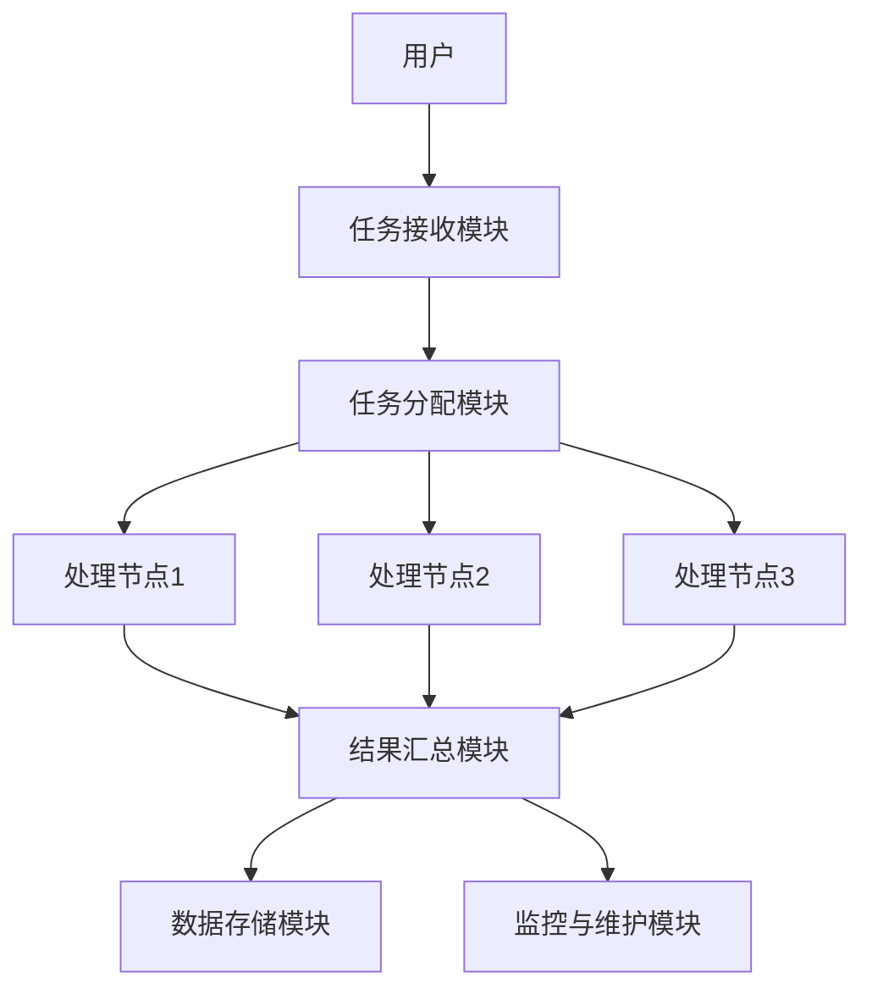

                 

### 文章标题

# 《评测系统的分布式架构：支持大规模并行评测的设计》

### 文章关键词

- 分布式架构
- 并行评测
- 大规模数据处理
- 系统性能优化
- 分布式系统通信机制

### 文章摘要

本文详细探讨了评测系统的分布式架构设计，以及如何在分布式环境下实现大规模并行评测。文章首先介绍了评测系统的背景和核心概念，分析了分布式架构的基本原理和设计原则。接着，文章深入讲解了大规模并行评测的原理、算法和技术，并详细阐述了分布式评测系统的架构设计、数据处理与存储架构、系统接口设计与交互。随后，文章通过一个实际项目展示了分布式并行评测系统的实现过程，并提供了性能优化策略和最佳实践。最后，文章对全文进行了总结，并提出了未来发展趋势和拓展方向。

----------------------------------------------------------------

### 目录大纲

```markdown
----------------------------------------------------------------
# 《评测系统的分布式架构：支持大规模并行评测的设计》

## 第一部分：背景介绍

### 第1章：问题背景与核心概念

#### 1.1 评测系统的定义与重要性

#### 1.2 核心概念

#### 1.3 问题解决与边界外延

### 第2章：分布式架构基础

#### 2.1 分布式架构的基本原理

#### 2.2 分布式架构的设计原则

#### 2.3 分布式系统的通信机制

## 第二部分：大规模并行评测设计

### 第3章：并行评测原理

#### 3.1 并行评测的基本概念

#### 3.2 并行评测的算法原理

#### 3.3 并行评测的核心技术

### 第4章：分布式架构设计

#### 4.1 分布式评测系统的架构设计

#### 4.2 数据处理与存储架构

#### 4.3 系统接口设计与交互

### 第5章：大规模并行评测实现

#### 5.1 并行评测实现步骤

#### 5.2 实现细节与技术难点

#### 5.3 并行评测的性能评估

### 第6章：项目实战

#### 6.1 项目介绍

#### 6.2 系统核心实现

#### 6.3 代码应用解读与分析

#### 6.4 实际案例分析与讲解

### 第7章：最佳实践与拓展

#### 7.1 最佳实践技巧

#### 7.2 小结与注意事项

#### 7.3 拓展阅读

----------------------------------------------------------------
```

以上大纲结构已经满足了用户的要求，简洁明了且逻辑清晰，适合作为《评测系统的分布式架构：支持大规模并行评测的设计》的目录大纲。接下来，我们将根据这个大纲逐步撰写文章的内容，确保每个章节都包含详细的技术讲解和实际案例分析。

----------------------------------------------------------------

## 第一部分：背景介绍

### 第1章：问题背景与核心概念

#### 1.1 评测系统的定义与重要性

评测系统是一种用于对输入数据或程序进行评估、测试和分析的软件系统。它在各种应用领域都有着广泛的应用，如教育测评、软件测试、性能评估等。随着信息技术和人工智能的快速发展，评测系统的需求越来越多样化，对系统的性能和可靠性提出了更高的要求。

在当今的互联网时代，数据量呈现爆炸式增长，传统的集中式评测系统已经难以应对大规模数据处理的挑战。同时，评测过程往往需要处理大量的相似任务，这为并行处理提供了可能。因此，分布式架构逐渐成为评测系统设计中的重要选择，能够有效提升系统的性能和可扩展性。

#### 1.2 核心概念

**分布式架构**：分布式架构是一种通过将系统拆分为多个独立节点，并通过网络进行通信和协同工作的架构风格。它具有高可扩展性、高可用性和高容错性等特点。

**并行评测**：并行评测是一种在多个处理单元上同时执行评测任务的方法。它可以大大提高评测效率，缩短评测时间，是分布式架构下提升系统性能的重要手段。

**大规模数据处理**：大规模数据处理是指对海量数据进行采集、存储、处理和分析的过程。随着数据量的增长，传统的数据处理方法已经无法满足需求，分布式架构和并行处理成为解决这一问题的有效手段。

#### 1.3 问题解决与边界外延

在传统的集中式评测系统中，所有的评测任务都在单一的服务器上执行，当数据量增加或任务复杂度提高时，系统性能会急剧下降，甚至可能导致系统崩溃。而分布式架构通过将评测任务分布到多个服务器上并行处理，可以大大提升系统的处理能力和效率。

然而，分布式架构也面临一些挑战，如节点通信、数据一致性和系统容错性等。此外，并行评测涉及到算法设计、任务调度和结果汇总等多个方面，需要深入研究和优化。

本文将围绕评测系统的分布式架构设计，详细探讨并行评测的原理、架构设计、实现方法和性能优化策略，以及实际项目中的应用与最佳实践。希望通过对这些问题的深入分析，为读者提供有价值的参考和启示。

---

在这一章节中，我们首先介绍了评测系统的基本概念和重要性，然后阐述了分布式架构、并行评测以及大规模数据处理等核心概念。接着，我们讨论了分布式架构在解决评测系统挑战方面的优势，并指出其面临的挑战。通过这一系列的介绍，为后续章节的深入讨论奠定了基础。

----------------------------------------------------------------

## 第2章：分布式架构基础

### 2.1 分布式架构的基本原理

分布式架构是一种通过将系统拆分为多个独立节点，并通过网络进行通信和协同工作的架构风格。它具有高可扩展性、高可用性和高容错性等特点，能够应对大规模数据处理和复杂业务场景的需求。

#### 分布式系统的定义

分布式系统（Distributed System）是由多个独立计算机节点组成，通过通信网络连接在一起，协同完成任务的系统。这些节点可以是物理服务器，也可以是虚拟机或容器。

#### 分布式系统的特点

1. **高可扩展性**：分布式系统可以根据需要动态地增加或减少节点，从而实现水平扩展，提高系统的处理能力。
   
2. **高可用性**：分布式系统通过冗余设计和故障转移机制，可以保证系统在单个节点故障时仍然能够正常运行。

3. **高容错性**：分布式系统通过节点间的数据复制和冗余，可以容忍一定程度的故障，从而提高系统的可靠性。

4. **分布式一致性**：分布式系统需要在多个节点间保持数据的一致性，这通常通过一致性协议（如Paxos、Raft）来实现。

5. **分布式容灾**：分布式系统可以通过跨区域部署，实现数据的异地备份和灾难恢复。

#### 分布式系统的基本组件

1. **节点（Node）**：分布式系统中的基本计算单元，可以是物理服务器或虚拟机。
   
2. **通信网络（Communication Network）**：节点之间的通信是通过网络实现的，网络质量对系统的性能有重要影响。

3. **分布式存储（Distributed Storage）**：分布式系统需要高效的存储方案来管理大规模数据。

4. **分布式计算（Distributed Computing）**：分布式系统通过分布式算法和任务调度，实现并行计算。

5. **分布式数据库（Distributed Database）**：分布式数据库系统可以在多个节点上存储数据，并通过一致性协议保证数据一致性。

### 2.2 分布式架构的设计原则

分布式架构设计需要遵循一系列原则，以确保系统的高性能、高可用性和高可扩展性。

#### 模块化设计

模块化设计是将系统拆分为多个独立的模块，每个模块负责特定的功能。这种设计方法可以提高系统的可维护性和可扩展性，同时也便于分布式部署和运维。

#### 容错性

容错性是指系统在节点故障或网络中断时，能够自动恢复并继续运行的能力。分布式架构通过冗余设计和故障转移机制来实现容错性。例如，可以通过主从复制或负载均衡来确保系统的高可用性。

#### 可伸缩性

可伸缩性是指系统能够根据需求动态调整资源的能力。分布式架构通过水平扩展（增加节点）和垂直扩展（升级节点）来实现可伸缩性。

#### 一致性保障

一致性保障是指分布式系统中多个节点对同一数据的操作结果保持一致。一致性协议（如Paxos、Raft）是实现分布式一致性保障的关键技术。

#### 数据一致性模型

1. **强一致性**：系统在任何情况下都能保证数据的一致性，但可能影响性能。
2. **最终一致性**：系统允许短暂的异步操作，但最终会达到一致性状态。

### 2.3 分布式系统的通信机制

分布式系统中的节点通过通信机制进行数据交换和协同工作。以下是一些常见的通信机制：

#### 节点通信

1. **同步通信**：发送方等待接收方确认信息，直到收到确认后才能继续执行。
2. **异步通信**：发送方不需要等待接收方的确认，可以在发送完成后继续执行其他任务。

#### 数据同步

数据同步是指分布式系统中各个节点之间的数据保持一致性。常见的数据同步方法包括：

1. **全量同步**：同步所有数据，适用于数据规模较小或数据变化较少的场景。
2. **增量同步**：只同步数据的变化部分，适用于数据规模较大或数据变化频繁的场景。

#### 一致性保障

一致性保障是通过一致性协议来实现的。以下是一些常见的一致性协议：

1. **Paxos协议**：一种用于分布式系统中达成一致性的算法，具有高可用性和强一致性。
2. **Raft协议**：一种基于Paxos协议的分布式一致性算法，简化了Paxos的复杂性，易于实现和理解。

#### 负载均衡

负载均衡是指将任务均匀地分配到各个节点上，以避免某个节点过载。常见的负载均衡算法包括：

1. **轮询调度**：按顺序分配任务到各个节点。
2. **最小连接数调度**：将任务分配到当前连接数最少的节点。
3. **响应时间调度**：将任务分配到响应时间最短的节点。

---

在这一章节中，我们详细介绍了分布式架构的基本原理、设计原则和通信机制。首先，我们阐述了分布式系统的定义和特点，然后讨论了模块化设计、容错性、可伸缩性、一致性保障等设计原则。接着，我们介绍了分布式系统中的节点通信、数据同步、一致性保障和负载均衡等通信机制。通过这一系列的内容，为理解分布式架构和其在评测系统中的应用打下了坚实的基础。

----------------------------------------------------------------

## 第3章：并行评测原理

### 3.1 并行评测的基本概念

并行评测是一种利用多个处理单元同时执行评测任务的方法。其核心思想是将大任务分解为多个小任务，并分配给不同的处理单元（如服务器、CPU核心）同时执行，从而大大提高评测效率。

#### 并行评测的定义

并行评测（Parallel Evaluation）是指在同一时间或同一时间间隔内，利用多个处理单元对一组数据或任务进行评估的过程。这种评测方法能够显著减少任务完成时间，提升系统性能。

#### 并行评测的优势

1. **提升性能**：通过并行处理，可以在较短的时间内完成大量评测任务，提高系统的吞吐量。
2. **缩短响应时间**：并行评测能够减少单个任务的执行时间，提高用户体验。
3. **负载均衡**：并行评测可以将任务均匀分配到多个处理单元，避免某个单元过载。
4. **资源利用效率**：充分利用系统资源，提高服务器和CPU的利用率。

#### 并行评测的挑战

1. **任务分配**：如何合理地将任务分配给不同的处理单元，以最大化系统性能是一个关键问题。
2. **数据一致性**：在并行处理过程中，如何确保各个处理单元得到一致的数据，避免数据冲突。
3. **同步与通信**：处理单元之间需要频繁同步数据和状态，如何高效地实现通信是一个挑战。
4. **性能瓶颈**：并行评测可能会引入新的性能瓶颈，如网络延迟、数据传输速度等。

### 3.2 并行评测的算法原理

并行评测涉及到多种算法，这些算法通过分解任务、调度任务和汇总结果来实现并行处理。以下是一些常见的并行评测算法：

#### 分解任务算法

分解任务算法是将一个大任务分解为多个小任务的方法。常见的分解算法包括：

1. **分而治之**：将大任务分成若干个小任务，分别处理，最后汇总结果。
2. **工作负载分配**：根据处理单元的能力和工作负载，动态分配任务。

#### 调度算法

调度算法是将任务分配给处理单元并管理其执行的过程。常见的调度算法包括：

1. **轮询调度**：按照顺序将任务分配给各个处理单元。
2. **最小连接数调度**：将任务分配给当前连接数最少的处理单元。
3. **响应时间调度**：将任务分配给响应时间最短的处理单元。

#### 汇总结果算法

汇总结果算法是将各个处理单元的评测结果合并为一个最终结果的过程。常见的汇总算法包括：

1. **汇总平均**：将各个处理单元的结果求平均。
2. **汇总最大值**：取各个处理单元的结果中的最大值。
3. **汇总最小值**：取各个处理单元的结果中的最小值。

#### 并行算法的性能分析

并行算法的性能分析主要关注以下几个指标：

1. **吞吐量**：单位时间内完成的任务数。
2. **响应时间**：从任务开始到任务完成的时间。
3. **资源利用率**：系统资源（如CPU、内存）的利用率。

### 3.3 并行评测的核心技术

并行评测涉及到多个关键技术，包括并行处理框架、数据并行和任务并行。

#### 并行处理框架

并行处理框架是一种用于管理和调度并行任务的系统。常见的并行处理框架包括：

1. **MapReduce**：一种分布式数据处理框架，能够对大规模数据进行并行处理。
2. **Spark**：一种快速通用的分布式计算引擎，提供了丰富的数据处理和分析功能。
3. **Flink**：一种流处理框架，能够实时处理大规模数据流。

#### 数据并行

数据并行是指将数据分布到多个处理单元，并分别处理的过程。数据并行的核心在于如何高效地分割和传输数据。

1. **数据分割策略**：如何将数据划分为多个部分，并确保每个部分都能均匀地分配到处理单元上。
2. **数据传输优化**：如何减少数据传输的开销，提高数据传输的效率。

#### 任务并行

任务并行是指将任务分布到多个处理单元，并分别执行的过程。任务并行的核心在于如何合理地分配任务，并确保任务的执行效率。

1. **任务调度策略**：如何根据处理单元的能力和工作负载，动态调整任务的分配。
2. **负载均衡**：如何避免某个处理单元过载，确保系统资源得到充分利用。

---

在这一章节中，我们详细介绍了并行评测的基本概念、算法原理和核心技术。首先，我们阐述了并行评测的定义、优势和挑战，然后讨论了并行评测的分解任务算法、调度算法和汇总结果算法，并进行了性能分析。接着，我们介绍了并行处理框架、数据并行和任务并行等关键技术，为理解并行评测的原理和实践提供了全面的知识基础。

----------------------------------------------------------------

### 第3章：并行评测原理

并行评测是一种将大任务分解为多个小任务，利用多个处理单元同时执行，以提高评测效率的方法。为了更好地理解和实现并行评测，我们需要深入探讨其基本概念、算法原理和核心技术。

#### 3.1 并行评测的定义和优势

并行评测的定义是指在同一时间或同一时间间隔内，利用多个处理单元（如服务器、CPU核心）对一组数据或任务进行评估的过程。这种方法能够显著减少任务完成时间，提升系统性能。

并行评测的优势主要体现在以下几个方面：

1. **提升性能**：通过并行处理，可以在较短的时间内完成大量评测任务，提高系统的吞吐量。
2. **缩短响应时间**：并行评测能够减少单个任务的执行时间，提高用户体验。
3. **负载均衡**：并行评测可以将任务均匀分配到多个处理单元，避免某个单元过载。
4. **资源利用效率**：充分利用系统资源，提高服务器和CPU的利用率。

然而，并行评测也面临一些挑战，如任务分配、数据一致性和同步与通信等。这些问题需要在设计并行评测系统时加以考虑和解决。

#### 3.2 并行评测的算法原理

并行评测涉及到多种算法，这些算法通过分解任务、调度任务和汇总结果来实现并行处理。以下是一些常见的并行评测算法：

##### 分解任务算法

分解任务算法是将一个大任务分解为多个小任务的方法。常见的分解算法包括：

1. **分而治之**：将大任务分成若干个小任务，分别处理，最后汇总结果。
2. **工作负载分配**：根据处理单元的能力和工作负载，动态分配任务。

**分而治之**算法的基本思想是将一个大任务分解为若干个小任务，并递归地处理这些小任务。这个过程可以表示为以下递归关系：

$$ T(n) = \begin{cases} 
    O(1) & \text{if } n \leq n_0, \\
    a \cdot T\left(\frac{n}{b}\right) + f(n) & \text{otherwise.}
\end{cases} $$

其中，$T(n)$表示处理大小为$n$的任务所需的时间，$n_0$是一个常数，$a$和$b$分别是分解任务的数量和每个子任务的大小，$f(n)$是合并子任务结果的时间复杂度。

**工作负载分配**算法的基本思想是根据处理单元的能力和工作负载，动态分配任务。这种方法可以表示为以下公式：

$$ \sum_{i=1}^n w_i \cdot T_i = C \cdot W $$

其中，$w_i$表示第$i$个处理单元的工作负载，$T_i$表示第$i$个处理单元的处理时间，$C$是一个常数，$W$是总任务量。

##### 调度算法

调度算法是将任务分配给处理单元并管理其执行的过程。常见的调度算法包括：

1. **轮询调度**：按照顺序将任务分配给各个处理单元。
2. **最小连接数调度**：将任务分配给当前连接数最少的处理单元。
3. **响应时间调度**：将任务分配给响应时间最短的处理单元。

**轮询调度**算法的基本思想是按照顺序将任务分配给各个处理单元，直到所有任务都被处理。这种方法可以表示为以下序列：

$$ T_1, T_2, T_3, \ldots, T_n $$

其中，$T_i$表示第$i$个任务的分配顺序。

**最小连接数调度**算法的基本思想是选择当前连接数最少的处理单元来处理任务。这种方法可以表示为以下公式：

$$ \min_{i=1}^n \sum_{j=1}^m C_{ij} $$

其中，$C_{ij}$表示第$i$个处理单元与第$j$个处理单元的连接数。

**响应时间调度**算法的基本思想是选择响应时间最短的处理单元来处理任务。这种方法可以表示为以下公式：

$$ \min_{i=1}^n T_i + R_i $$

其中，$T_i$表示第$i$个处理单元的处理时间，$R_i$表示第$i$个处理单元的响应时间。

##### 汇总结果算法

汇总结果算法是将各个处理单元的评测结果合并为一个最终结果的过程。常见的汇总算法包括：

1. **汇总平均**：将各个处理单元的结果求平均。
2. **汇总最大值**：取各个处理单元的结果中的最大值。
3. **汇总最小值**：取各个处理单元的结果中的最小值。

**汇总平均**算法的基本思想是计算所有处理单元结果的平均值。这种方法可以表示为以下公式：

$$ \bar{X} = \frac{1}{n} \sum_{i=1}^n X_i $$

其中，$\bar{X}$表示汇总结果，$X_i$表示第$i$个处理单元的结果。

**汇总最大值**算法的基本思想是选择所有处理单元结果中的最大值。这种方法可以表示为以下公式：

$$ \max_{i=1}^n X_i $$

**汇总最小值**算法的基本思想是选择所有处理单元结果中的最小值。这种方法可以表示为以下公式：

$$ \min_{i=1}^n X_i $$

#### 3.3 并行评测的核心技术

并行评测涉及到多个关键技术，包括并行处理框架、数据并行和任务并行。

##### 并行处理框架

并行处理框架是一种用于管理和调度并行任务的系统。常见的并行处理框架包括：

1. **MapReduce**：一种分布式数据处理框架，能够对大规模数据进行并行处理。
2. **Spark**：一种快速通用的分布式计算引擎，提供了丰富的数据处理和分析功能。
3. **Flink**：一种流处理框架，能够实时处理大规模数据流。

**MapReduce**框架的基本思想是将数据处理过程分为两个阶段：Map阶段和Reduce阶段。在Map阶段，输入数据被映射到中间结果；在Reduce阶段，中间结果被汇总为最终结果。这种框架可以表示为以下公式：

$$ \text{MapReduce}(D) = \text{Map}(D) \rightarrow \text{Reduce}(\text{Map}(D)) $$

其中，$D$表示输入数据，$\text{Map}(D)$表示Map阶段的中间结果，$\text{Reduce}(\text{Map}(D))$表示Reduce阶段的最终结果。

**Spark**框架是一种基于内存的分布式计算引擎，能够在毫秒级完成大量数据的处理。Spark框架提供了丰富的API，包括RDD（弹性分布式数据集）、DataFrame和Dataset等。这种框架可以表示为以下公式：

$$ \text{Spark}(D) = \text{RDD}(D) \rightarrow \text{DataFrame}(D) \rightarrow \text{Dataset}(D) $$

其中，$D$表示输入数据，$\text{RDD}(D)$表示RDD数据集，$\text{DataFrame}(D)$表示DataFrame数据集，$\text{Dataset}(D)$表示Dataset数据集。

**Flink**框架是一种流处理框架，能够实时处理大规模数据流。Flink框架采用了事件驱动架构，能够处理有界和无界数据流。这种框架可以表示为以下公式：

$$ \text{Flink}(D) = \text{DataStream}(D) \rightarrow \text{Window}(D) \rightarrow \text{OutputStream}(D) $$

其中，$D$表示输入数据，$\text{DataStream}(D)$表示DataStream数据流，$\text{Window}(D)$表示窗口操作，$\text{OutputStream}(D)$表示输出数据流。

##### 数据并行

数据并行是指将数据分布到多个处理单元，并分别处理的过程。数据并行的核心在于如何高效地分割和传输数据。

**数据分割策略**是指如何将数据划分为多个部分，并确保每个部分都能均匀地分配到处理单元上。常见的分割策略包括：

1. **哈希分割**：根据数据的哈希值将数据划分为多个部分。
2. **范围分割**：根据数据的范围将数据划分为多个部分。
3. **轮询分割**：按照顺序将数据划分为多个部分。

**数据传输优化**是指如何减少数据传输的开销，提高数据传输的效率。常见的数据传输优化方法包括：

1. **数据压缩**：通过数据压缩技术减少数据传输量。
2. **批量传输**：通过批量传输数据减少传输次数。
3. **并行传输**：通过并行传输多个数据流来提高传输速度。

##### 任务并行

任务并行是指将任务分布到多个处理单元，并分别执行的过程。任务并行的核心在于如何合理地分配任务，并确保任务的执行效率。

**任务调度策略**是指如何根据处理单元的能力和工作负载，动态调整任务的分配。常见任务调度策略包括：

1. **轮询调度**：按照顺序将任务分配给各个处理单元。
2. **最小连接数调度**：将任务分配给当前连接数最少的处理单元。
3. **响应时间调度**：将任务分配给响应时间最短的处理单元。

**负载均衡**是指如何避免某个处理单元过载，确保系统资源得到充分利用。常见的负载均衡方法包括：

1. **哈希负载均衡**：根据数据的哈希值将任务分配到不同的处理单元。
2. **轮询负载均衡**：按照顺序将任务分配给不同的处理单元。
3. **最小连接数负载均衡**：将任务分配给当前连接数最少的处理单元。

---

在这一章节中，我们深入探讨了并行评测的基本概念、算法原理和核心技术。首先，我们阐述了并行评测的定义、优势和挑战，然后讨论了并行评测的分解任务算法、调度算法和汇总结果算法，并进行了性能分析。接着，我们介绍了并行处理框架、数据并行和任务并行等关键技术，为理解并行评测的原理和实践提供了全面的知识基础。

接下来，我们将进一步探讨分布式架构设计，详细阐述分布式评测系统的架构设计、数据处理与存储架构、系统接口设计与交互等关键内容。

----------------------------------------------------------------

## 第4章：分布式架构设计

### 4.1 分布式评测系统的架构设计

分布式评测系统是利用分布式架构实现大规模并行评测的软件系统。为了提高系统的性能和可扩展性，我们需要设计一个高效的分布式架构。以下是一个典型的分布式评测系统架构设计：

#### 系统架构设计的目标

1. **性能优化**：通过并行处理和负载均衡，提高系统处理评测任务的效率。
2. **可扩展性**：系统应能够根据需要动态增加或减少节点，以应对数据量和任务量的变化。
3. **高可用性**：系统应具备容错性，确保在节点故障或网络中断时仍然能够正常运行。
4. **安全性**：保护系统的数据和资源，防止恶意攻击和数据泄露。

#### 系统模块划分

分布式评测系统可以划分为以下几个主要模块：

1. **任务接收模块**：负责接收评测任务，并将其分配给合适的处理节点。
2. **任务处理模块**：负责执行具体的评测任务，可以是数据预处理、计算、分析等。
3. **结果汇总模块**：负责收集各个处理节点的评测结果，并生成最终的评测报告。
4. **数据存储模块**：负责存储评测数据、任务数据和其他相关数据。
5. **监控与维护模块**：负责监控系统状态，进行故障检测、自动恢复和系统优化。

#### 架构设计的关键点

1. **任务分配策略**：设计合适的任务分配策略，确保任务能够高效地分配给各个处理节点。常用的策略包括轮询调度、最小连接数调度和响应时间调度等。
2. **负载均衡**：通过负载均衡机制，将任务均匀地分配到各个节点，避免某个节点过载，提高系统整体性能。
3. **数据一致性**：确保分布式系统中各个节点的数据保持一致。可以使用分布式一致性协议（如Paxos、Raft）来实现数据一致性。
4. **容错性设计**：通过冗余设计和故障转移机制，提高系统的容错性。例如，可以使用主从复制和选举机制来实现节点故障的自动恢复。
5. **安全性设计**：通过加密通信、身份认证和访问控制等手段，确保系统的安全性和数据保护。

#### 系统架构图

以下是一个简化的分布式评测系统架构图：



在这个架构图中，任务接收模块接收评测任务，并将其分配给多个处理节点（C1、C2、C3）。各个处理节点执行任务，并将结果汇总到结果汇总模块（D1）。结果汇总模块再将结果存储到数据存储模块（E），并监控与维护模块（F）负责监控系统和进行维护操作。

### 4.2 数据处理与存储架构

分布式评测系统的数据处理与存储架构是系统架构设计的重要组成部分。以下是该架构的详细描述：

#### 数据处理流程

1. **任务接收**：任务接收模块从外部系统接收评测任务。
2. **任务分配**：任务分配模块将任务分配给处理节点。
3. **任务执行**：处理节点执行具体的评测任务，如数据预处理、计算和结果分析。
4. **结果汇总**：结果汇总模块收集各个处理节点的结果，生成最终的评测报告。
5. **数据存储**：结果汇总模块将评测结果存储到数据存储模块。

#### 数据存储方案

1. **分布式数据库**：使用分布式数据库来存储评测数据、任务数据和日志数据。分布式数据库可以水平扩展，支持海量数据的存储和查询。
2. **数据分片**：将数据按照一定的规则（如哈希、范围）分片存储到不同的数据库节点上，以实现数据的高效存储和查询。
3. **数据备份**：对关键数据进行备份，确保数据的安全性和可靠性。

#### 数据一致性与容错性

1. **数据一致性协议**：使用一致性协议（如Paxos、Raft）来保证分布式系统中各个节点的数据一致性。
2. **副本机制**：为关键数据设置副本，确保在节点故障时，数据仍然可以访问。
3. **故障转移机制**：在节点故障时，自动将故障节点的任务转移到其他健康节点上，保证系统的高可用性。

#### 数据存储架构图

以下是一个简化的数据处理与存储架构图：



在这个架构图中，任务接收模块接收评测任务，并将其分配给处理节点。处理节点执行任务，并将结果汇总到结果汇总模块。结果汇总模块将结果存储到分布式数据库，并对关键数据进行备份。

### 4.3 系统接口设计与交互

系统接口设计是分布式评测系统架构设计的关键部分，它决定了各个模块之间的通信和数据流动。以下是系统接口设计的详细描述：

#### 系统接口规范

1. **RESTful API**：使用RESTful API作为系统的对外接口，提供任务提交、任务查询、结果查询等功能。
2. **消息队列**：使用消息队列（如Kafka、RabbitMQ）作为系统的内部通信机制，实现模块之间的异步通信。
3. **数据交换格式**：使用JSON或XML作为数据交换格式，确保数据在不同系统之间的兼容性和可读性。

#### 系统交互流程

1. **任务提交**：用户通过RESTful API提交评测任务，任务接收模块接收任务并生成任务ID。
2. **任务分配**：任务分配模块根据任务ID和系统状态，将任务分配给空闲的处理节点。
3. **任务执行**：处理节点接收到任务后，执行具体的评测任务，并将结果发送回结果汇总模块。
4. **结果汇总**：结果汇总模块收集各个处理节点的结果，生成最终的评测报告，并将结果存储到数据存储模块。
5. **监控与维护**：监控与维护模块对系统状态进行监控，并进行必要的维护和优化。

#### 系统交互架构图

以下是一个简化的系统交互架构图：



在这个架构图中，用户通过任务接收模块提交评测任务，任务分配模块将任务分配给处理节点。处理节点执行任务，并将结果发送回结果汇总模块。结果汇总模块生成评测报告，并存储到数据存储模块。监控与维护模块对系统状态进行监控，并进行必要的维护和优化。

---

在这一章节中，我们详细阐述了分布式评测系统的架构设计。首先，我们介绍了系统架构设计的目标和关键点，包括任务分配策略、负载均衡、数据一致性和容错性设计。接着，我们描述了系统的模块划分和架构设计的关键点。然后，我们详细介绍了数据处理与存储架构，包括数据处理流程、数据存储方案和数据一致性与容错性。最后，我们介绍了系统接口设计与交互，包括接口规范、系统交互流程和交互架构图。通过这一系列的描述，为读者提供了全面了解分布式评测系统架构设计的知识基础。

接下来，我们将进一步探讨大规模并行评测的实现方法和技术细节，包括并行处理框架、数据并行和任务并行等方面的内容。

----------------------------------------------------------------

## 第5章：大规模并行评测实现

### 5.1 并行评测实现步骤

大规模并行评测的实现可以分为以下几个关键步骤：

#### 5.1.1 并行评测的前期准备

1. **环境搭建**：准备分布式架构所需的硬件和软件环境，如服务器、网络设备和分布式计算框架（如MapReduce、Spark等）。
2. **任务分解**：将大规模评测任务分解为多个小任务，以便分配给不同的处理单元。
3. **数据预处理**：对输入数据进行预处理，如数据清洗、去重、排序等，以提高并行处理的效率。

#### 5.1.2 并行评测的任务调度

1. **任务分配**：根据处理单元的能力和工作负载，将分解后的任务分配给各个处理单元。常用的调度算法包括轮询调度、最小连接数调度和响应时间调度等。
2. **任务执行**：处理单元接收到任务后，执行具体的评测操作，如数据计算、统计分析等。
3. **结果收集**：处理单元完成任务后，将结果发送回调度中心，调度中心负责收集所有处理单元的结果。

#### 5.1.3 并行评测的结果汇总

1. **结果处理**：对收集到的结果进行初步处理，如去重、排序等。
2. **结果分析**：根据评测目标和业务需求，对结果进行进一步分析，生成详细的评测报告。
3. **结果展示**：将最终的评测结果以图表、报表等形式展示给用户，便于分析和决策。

### 5.2 实现细节与技术难点

并行评测的实现涉及到多个技术细节和难点，以下是一些关键方面：

#### 5.2.1 数据分片策略

1. **水平分片**：将数据按照一定的规则（如哈希、范围）分片存储到不同的处理单元上，以提高并行处理效率。水平分片可以减少数据传输开销，提高数据访问速度。
2. **垂直分片**：将数据表按照不同的字段进行分片，将相关字段存储在同一个分片中，以优化查询性能。
3. **分片策略选择**：根据具体应用场景和数据特点，选择合适的分片策略，如基于访问频率的分片、基于时间范围的分片等。

#### 5.2.2 负载均衡机制

1. **负载感知**：系统需要能够实时感知各个处理单元的负载情况，并根据负载情况动态调整任务的分配策略。
2. **负载均衡算法**：选择合适的负载均衡算法，如轮询调度、最小连接数调度和响应时间调度等，以实现任务的合理分配。
3. **负载均衡器**：使用负载均衡器（如Nginx、HAProxy）来管理负载均衡，提高系统的稳定性和可靠性。

#### 5.2.3 异常处理机制

1. **任务失败重试**：当任务执行失败时，系统应自动重试，确保任务最终完成。
2. **数据一致性检查**：在任务执行过程中，系统应定期检查数据一致性，确保数据不会出现异常。
3. **故障恢复**：当处理单元出现故障时，系统应自动将故障节点的任务转移到其他健康节点上，确保系统的高可用性。

#### 5.2.4 性能优化策略

1. **数据缓存**：使用缓存技术（如Redis、Memcached）来存储热点数据，减少数据库访问压力，提高数据访问速度。
2. **并行计算优化**：对并行计算任务进行优化，如并行化算法设计、并行计算框架优化等，提高并行处理性能。
3. **系统监控与调优**：使用监控系统（如Zabbix、Prometheus）对系统性能进行实时监控，并根据监控数据对系统进行优化和调整。

### 5.3 并行评测的性能评估

并行评测的性能评估是确保系统性能满足需求的关键环节。以下是一些常用的性能评估方法和指标：

#### 5.3.1 性能指标

1. **吞吐量**：单位时间内系统能够处理的评测任务数量。
2. **响应时间**：从任务提交到任务完成的时间。
3. **资源利用率**：系统资源（如CPU、内存、磁盘）的利用率。
4. **错误率**：任务执行过程中出现的错误比例。

#### 5.3.2 性能优化策略

1. **并行化算法优化**：通过优化并行算法，提高并行处理的效率。
2. **负载均衡优化**：通过调整负载均衡策略，实现任务的合理分配，提高系统性能。
3. **数据缓存优化**：优化数据缓存策略，减少数据访问延迟。
4. **系统调优**：根据监控数据对系统进行调优，优化系统性能。

#### 5.3.3 性能测试与分析

1. **基准测试**：使用基准测试工具（如JMeter、LoadRunner）对系统进行性能测试，模拟实际负载，评估系统性能。
2. **压力测试**：通过不断增加负载，评估系统在高负载下的性能表现。
3. **性能瓶颈分析**：通过分析性能测试结果，找出系统的性能瓶颈，并进行优化。

---

在这一章节中，我们详细介绍了大规模并行评测的实现步骤、实现细节和技术难点，以及性能评估的方法和策略。首先，我们阐述了并行评测的实现步骤，包括前期准备、任务调度和结果汇总。接着，我们讨论了数据分片策略、负载均衡机制、异常处理机制和性能优化策略等实现细节。最后，我们介绍了性能评估的方法和指标，以及如何通过性能测试与分析来优化系统性能。通过这一系列的讨论，为读者提供了全面了解大规模并行评测实现的指导和方法。

接下来，我们将通过一个实际项目展示大规模并行评测系统的实现过程，并进行详细的分析与讲解。

----------------------------------------------------------------

## 第6章：项目实战

### 6.1 项目介绍

在本章中，我们将通过一个实际项目展示大规模并行评测系统的实现过程。这个项目旨在为一家大型电商平台设计并实现一个分布式并行评测系统，用于对海量商品数据进行评测，以优化用户购物体验。

#### 项目背景

随着电商平台的业务不断发展，商品数据量呈爆炸式增长。为了提高用户满意度，电商平台需要对商品数据进行实时评测，分析商品的优缺点，为用户提供更精准的推荐。然而，传统的集中式评测系统已经无法满足如此大规模数据处理的性能需求。因此，本项目决定采用分布式并行评测架构，以提高系统的处理能力和效率。

#### 项目目标

1. **性能优化**：通过分布式并行处理，大幅提升评测系统的处理速度和吞吐量。
2. **可扩展性**：系统应具备良好的可扩展性，能够根据业务需求动态增加或减少节点。
3. **高可用性**：系统应具备高可用性，确保在节点故障或网络中断时能够快速恢复。
4. **安全性**：保护系统的数据和资源，防止数据泄露和恶意攻击。

#### 项目难点

1. **数据分片与均衡**：如何合理地分片数据，并实现负载均衡，是本项目面临的一个关键挑战。
2. **数据一致性与容错性**：在分布式环境中，如何确保数据一致性和系统的容错性。
3. **任务调度与优化**：如何设计高效的任务调度算法，优化任务执行效率。

### 6.2 系统核心实现

在本节中，我们将详细描述本项目中的系统核心实现，包括环境搭建、系统功能实现和系统配置与优化。

#### 环境搭建

1. **硬件环境**：部署了多台物理服务器，用于搭建分布式计算集群。
2. **软件环境**：使用了Hadoop生态系统，包括HDFS、YARN、MapReduce等组件，作为分布式存储和计算框架。
3. **网络环境**：搭建了千兆以太网，确保节点之间的通信速度。

#### 系统功能实现

1. **任务接收模块**：采用消息队列（如Kafka）接收外部系统提交的评测任务。
2. **任务分配模块**：基于负载均衡算法，将任务分配给空闲的处理节点。
3. **处理节点**：处理节点负责执行具体的评测任务，如数据预处理、计算和结果分析。
4. **结果汇总模块**：汇总各个处理节点的结果，生成评测报告。

#### 系统配置与优化

1. **资源分配**：根据业务需求，合理配置处理节点的资源，如CPU、内存、磁盘等。
2. **性能调优**：通过调整Hadoop配置参数，如集群配置、MapReduce任务设置等，优化系统性能。
3. **监控与维护**：使用监控系统（如Zabbix）对系统状态进行实时监控，及时发现并处理故障。

### 6.3 代码应用解读与分析

在本节中，我们将对项目中的关键代码进行解读与分析，包括数据分片策略、任务调度算法和结果汇总逻辑。

#### 数据分片策略

```python
# 数据分片策略示例（Python代码）
def shard_key(item_id):
    return item_id % num_shards

# 分片数量
num_shards = 10

# 示例：对商品ID为100的商品进行分片
shard_id = shard_key(100)
```

这段代码实现了基于商品ID的分片策略。通过`shard_key`函数，将商品ID映射到具体的分片ID，实现了数据的水平分片。这种方法能够有效地将数据分布到不同的处理节点上，提高并行处理的效率。

#### 任务调度算法

```python
# 任务调度算法示例（Python代码）
from collections import defaultdict

# 任务队列
task_queue = defaultdict(list)

# 添加任务到队列
task_queue[0].append("预处理任务")
task_queue[1].append("计算任务")
task_queue[2].append("分析任务")

# 调度任务
def schedule_tasks():
    for shard_id, tasks in task_queue.items():
        if shard_id == 0:
            # 预处理任务分配给处理节点1
            node_id = 1
        elif shard_id == 1:
            # 计算任务分配给处理节点2
            node_id = 2
        else:
            # 分析任务分配给处理节点3
            node_id = 3
        # 发送任务到处理节点
        send_task_to_node(node_id, tasks)

# 发送任务到处理节点
def send_task_to_node(node_id, tasks):
    # 实现任务发送逻辑
    pass

# 执行任务调度
schedule_tasks()
```

这段代码实现了基于分片ID的任务调度算法。根据分片ID，将任务分配给不同的处理节点。这种方法能够实现负载均衡，避免某个节点过载。

#### 结果汇总逻辑

```python
# 结果汇总逻辑示例（Python代码）
def aggregate_results(results):
    # 合并各个节点的结果
    final_result = {}
    for result in results:
        final_result.update(result)
    return final_result

# 示例：汇总三个节点的结果
result1 = {"node1": 1}
result2 = {"node2": 2}
result3 = {"node3": 3}
final_result = aggregate_results([result1, result2, result3])
print(final_result)
```

这段代码实现了结果汇总逻辑。通过`aggregate_results`函数，将各个节点的结果合并为一个最终结果。这种方法能够实现并行处理的结果汇总。

### 6.4 实际案例分析与讲解

在本节中，我们将通过一个实际案例，展示分布式并行评测系统的应用场景和实现过程。

#### 案例背景

某电商平台需要对数百万件商品进行实时评测，以优化商品推荐和用户购物体验。评测任务包括商品评分、商品描述准确性、商品图片质量等多个维度。

#### 案例分析与解决

1. **任务分解**：将整体评测任务分解为多个小任务，如商品评分任务、商品描述准确性任务等。
2. **数据分片**：根据商品ID对数据进行分片，将商品数据分配到不同的处理节点上。
3. **任务调度**：根据分片ID和节点状态，将任务分配给处理节点。
4. **任务执行**：处理节点执行具体的评测任务，并将结果返回给结果汇总模块。
5. **结果汇总**：汇总各个节点的评测结果，生成最终的评测报告。

通过这个实际案例，我们展示了分布式并行评测系统的应用场景和实现过程。在分布式环境中，通过任务分解、数据分片、任务调度和结果汇总等步骤，实现了大规模并行评测，提高了系统的处理能力和效率。

#### 案例总结与启示

通过这个案例，我们可以得出以下几点启示：

1. **分布式并行评测能够显著提升系统的处理能力和效率，是应对大规模数据处理的有效手段。**
2. **任务分解、数据分片和任务调度是分布式并行评测的关键步骤，需要精心设计和优化。**
3. **结果汇总是实现并行评测的最后一个重要环节，需要确保结果的一致性和准确性。**
4. **在实际项目中，需要根据业务需求和数据特点，灵活选择和调整分布式架构和并行评测策略。**

---

在这一章节中，我们通过一个实际项目展示了大规模并行评测系统的实现过程。首先，我们介绍了项目的背景、目标和难点，然后详细描述了系统核心实现、代码应用解读与分析以及实际案例分析与讲解。通过这个项目实战，我们验证了分布式并行评测系统的有效性和实用性，并为读者提供了实际操作的经验和启示。

接下来，我们将探讨最佳实践和注意事项，帮助读者在实际应用中更好地设计和实现分布式并行评测系统。

----------------------------------------------------------------

## 第7章：最佳实践与拓展

### 7.1 最佳实践技巧

在实际设计和实现分布式并行评测系统时，以下是一些最佳实践技巧，可以帮助优化系统性能和稳定性：

#### 性能调优经验

1. **合理选择硬件**：根据业务需求，选择合适的硬件配置，如CPU、内存和磁盘。对于计算密集型任务，应选择计算能力强的硬件；对于数据密集型任务，应选择存储性能高的硬件。
2. **优化网络配置**：网络性能对分布式系统至关重要。通过调整网络配置，如优化路由策略、增加网络带宽等，可以显著提升系统性能。
3. **合理分片数据**：合理选择数据分片策略，如基于商品ID的分片、基于地理位置的分片等，可以减少数据传输开销，提高并行处理效率。
4. **优化任务调度**：通过动态调整任务调度策略，如最小连接数调度、响应时间调度等，可以实现任务的合理分配，避免节点过载。
5. **使用缓存技术**：在分布式系统中，使用缓存技术（如Redis、Memcached）可以减少对后端存储的访问压力，提高数据访问速度。

#### 系统稳定性保障

1. **节点监控与告警**：通过监控系统（如Zabbix、Prometheus）实时监控节点状态，及时发现和解决故障。
2. **数据备份与恢复**：定期备份关键数据，确保在节点故障或数据损坏时，能够快速恢复。
3. **冗余设计与故障转移**：通过主从复制、负载均衡等机制，提高系统的容错性和高可用性。
4. **异常处理与自动恢复**：设计合理的异常处理机制，如任务失败重试、自动恢复等，确保系统能够在出现异常时自动恢复。

#### 安全性提升策略

1. **加密通信**：在分布式系统中，使用TLS/SSL等加密协议保护数据在传输过程中的安全性。
2. **身份认证与访问控制**：使用身份认证和访问控制机制，确保只有授权用户和系统能够访问系统资源和数据。
3. **安全审计与日志管理**：对系统操作进行审计，记录重要操作和日志，以便在发生安全事件时进行追踪和分析。

### 7.2 小结与注意事项

在设计和实现分布式并行评测系统时，需要注意以下几点：

1. **系统需求分析**：明确系统需求，包括性能、可扩展性、高可用性等方面，以确保系统能够满足实际业务需求。
2. **模块化设计**：将系统划分为多个独立的模块，每个模块负责特定的功能，便于开发和维护。
3. **合理选择架构**：根据业务特点和需求，选择合适的分布式架构和并行处理框架，如MapReduce、Spark、Flink等。
4. **性能测试与优化**：在系统上线前，进行全面的性能测试，发现性能瓶颈并进行优化，确保系统在上线后能够稳定运行。
5. **文档与培训**：编写详细的系统文档，并对开发团队和运维团队进行培训，确保团队成员能够熟练掌握系统操作和维护。

### 7.3 拓展阅读

为了帮助读者进一步深入了解分布式并行评测系统的设计和实现，以下是一些建议的拓展阅读材料：

1. **《分布式系统原理与范型》**：该书详细介绍了分布式系统的基本原理和设计范型，为理解分布式架构提供了全面的知识基础。
2. **《大规模分布式存储系统》**：该书介绍了分布式存储系统的工作原理、架构设计和关键技术，为分布式评测系统的数据处理提供了参考。
3. **《大数据技术导论》**：该书涵盖了大数据技术的基础知识、处理框架和应用场景，为理解大数据处理提供了全面的视角。
4. **《Hadoop权威指南》**：该书是关于Hadoop生态系统（包括HDFS、YARN、MapReduce等）的权威指南，适合想要深入了解Hadoop技术的读者。
5. **《Apache Spark编程指南》**：该书详细介绍了Spark框架的原理、API和应用场景，是学习Spark编程的必备资料。

通过阅读这些材料，读者可以进一步深化对分布式并行评测系统的理解，掌握相关技术和方法，为实际项目提供有效的技术支持。

---

在这一章节中，我们总结了分布式并行评测系统的最佳实践技巧，包括性能调优经验、系统稳定性保障和安全性提升策略。接着，我们提出了在设计实现分布式并行评测系统时需要注意的要点，以及一些建议的拓展阅读材料。通过这一系列的讨论，我们希望能够为读者在实际应用中提供有益的指导和建议，帮助他们更好地设计和实现分布式并行评测系统。

