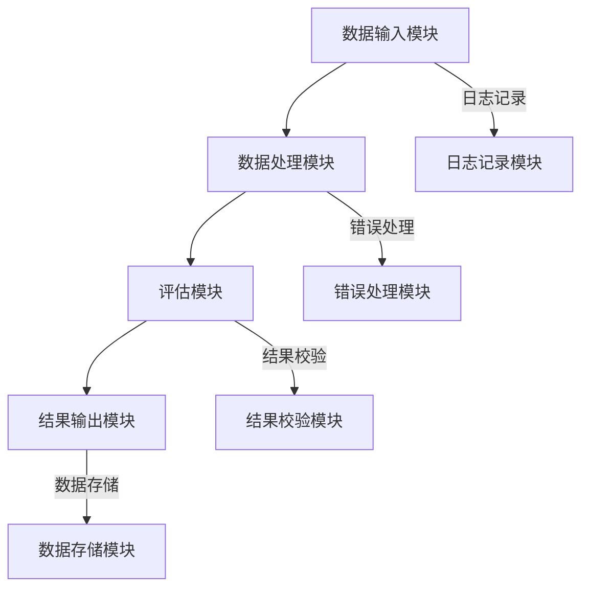

                 

### 引言

在信息化时代，评测系统作为一种关键的软件系统，广泛应用于教育、金融、医疗、科研等领域。其核心功能是通过一系列测试、评估、评分等方式，对用户或系统的表现进行客观、公正的评价。随着信息技术的发展，评测系统的重要性愈发突出，但其透明性和可审核性也面临着新的挑战。第三方验证作为一种提高评测系统可信度的手段，逐渐受到关注。

**关键词**：评测系统、可审核性、第三方验证、透明设计、信息技术

**摘要**：本文旨在探讨评测系统的可审核性，特别是如何通过透明设计支持第三方验证。文章首先介绍了评测系统的背景和重要性，以及第三方验证的背景和需求。接着，详细阐述了评测系统的基本原理、可审核性的核心概念和实现方法，以及第三方验证的原理和实施策略。通过一个实际案例，文章展示了如何在实际项目中实施评测系统的可审核性设计，并总结了一些最佳实践和注意事项。本文的目标是帮助读者理解评测系统的可审核性设计，提高系统的透明性和可信度。

### 目录大纲设计思路

为了设计《评测系统的可审核性：支持第三方验证的透明设计》的目录大纲，我们需要从以下几个方面进行思考：

1. **背景介绍**：首先介绍评测系统可审核性的重要性，阐述第三方验证的背景和意义。
2. **核心概念**：明确本书涉及的核心概念，如评测系统、可审核性、第三方验证等，并给出相应的概念对比和联系。
3. **算法原理讲解**：介绍与评测系统可审核性相关的算法原理，使用mermaid画出流程图，并配合Python源代码进行讲解。
4. **数学模型和公式**：详细讲解算法原理中的数学模型和公式，使用latex格式表示。
5. **系统分析与架构设计**：介绍评测系统的功能设计、架构设计、接口设计等，使用mermaid类图、架构图和序列图进行说明。
6. **项目实战**：通过实际案例展示如何实施评测系统的可审核性设计。
7. **最佳实践与总结**：总结书中讨论的关键点，给出最佳实践建议和注意事项。

下面是详细的目录大纲设计：

----------------------------------------------------------------

## 第一部分：引言

### 第1章：评测系统可审核性的背景与意义

- **1.1 问题背景**
  - 评测系统在信息化时代的重要性
  - 第三方验证的需求与挑战
- **1.2 问题描述**
  - 可审核性在评测系统中的意义
  - 第三方验证的背景和现状
- **1.3 问题解决**
  - 可审核性的实现策略
  - 第三方验证的流程与方法
- **1.4 边界与外延**
  - 可审核性的适用范围
  - 第三方验证的局限性
- **1.5 核心概念**
  - **评测系统**：功能、架构、类型
  - **可审核性**：定义、标准、实现
  - **第三方验证**：定义、分类、优势
- **1.6 概念联系图**
  - 评测系统、可审核性、第三方验证的ER实体关系图

----------------------------------------------------------------

## 第二部分：评测系统的基本原理与设计

### 第2章：评测系统的定义与功能

- **2.1 评测系统的定义**
  - 评测系统的基本概念
  - 评测系统的功能模块
- **2.2 评测系统的架构设计**
  - **mermaid架构图**
  - **系统模块划分与交互设计**
- **2.3 评测系统的类型与应用**
  - **教育评测系统**
  - **金融评测系统**
  - **医疗评测系统**

----------------------------------------------------------------

### 第3章：可审核性的核心概念与实现方法

- **3.1 可审核性的定义**
  - 可审核性的基本要求
  - 可审核性的评价标准
- **3.2 可审核性的实现方法**
  - **数据透明化**
  - **算法可解释性**
  - **过程可追溯性**
- **3.3 可审核性的评价指标**
  - **mermaid表格**
    | 指标名称 | 描述 | 权重 |
    | ------ | ------ | ------ |
    | 数据透明度 | 数据公开程度 | 0.3 |
    | 算法可解释性 | 算法运行过程的解释能力 | 0.3 |
    | 过程可追溯性 | 运行过程的记录与回溯能力 | 0.4 |

----------------------------------------------------------------

### 第4章：第三方验证的原理与实施

- **4.1 第三方验证的定义**
  - 第三方验证的基本概念
  - 第三方验证的分类
- **4.2 第三方验证的流程**
  - **mermaid流程图**
  - **Python源代码示例**
    ```python
    def third_party_validation():
        # 验证准备
        prepare_validation()
        # 验证实施
        execute_validation()
        # 验证结果评估
        assess_results()
    ```

----------------------------------------------------------------

### 第5章：评测系统可审核性设计的实际案例

- **5.1 案例背景**
  - 某在线教育平台的评测系统
  - 第三方验证的需求
- **5.2 案例实施**
  - 可审核性设计
  - 第三方验证流程
- **5.3 案例分析**
  - 可审核性效果评估
  - 第三方验证结果
- **5.4 案例小结**
  - 成功经验与挑战

----------------------------------------------------------------

### 第6章：最佳实践与总结

- **6.1 最佳实践**
  - 可审核性设计的关键步骤
  - 第三方验证的实施技巧
- **6.2 注意事项**
  - 可审核性设计中的常见问题
  - 第三方验证的风险与应对
- **6.3 小结**
  - 评测系统可审核性的重要性
  - 第三方验证的未来发展趋势

----------------------------------------------------------------

### 第7章：拓展阅读

- **7.1 相关书籍推荐**
  - 评测系统与可审核性的经典书籍
  - 第三方验证的最佳实践指南
- **7.2 网络资源推荐**
  - 可审核性设计的技术社区
  - 第三方验证的权威网站

----------------------------------------------------------------

通过上述的目录大纲设计，我们可以清晰地看到文章的结构和内容安排。接下来，我们将逐章深入探讨每个主题，确保文章的逻辑性和专业性。### 第1章：评测系统可审核性的背景与意义

#### 1.1 问题背景

在信息化时代，评测系统作为一种关键软件系统，被广泛应用于各个领域。无论是教育考试、金融风险评估、医疗服务评估，还是企业员工绩效评估，评测系统都发挥着至关重要的作用。随着大数据、云计算等技术的普及，评测系统的发展也面临着新的挑战和机遇。一方面，评测系统需要处理海量数据，确保评估结果的准确性和公正性；另一方面，随着用户对隐私保护和个人信息安全的关注增加，评测系统的透明性和可审核性成为关注的焦点。

第三方验证作为一种提高评测系统可信度的手段，逐渐受到重视。第三方验证机构独立于评测系统开发者之外，通过严格的审查和验证过程，确保评测系统的公正性和可靠性。这不仅有助于提升用户的信任度，还能为评测系统提供额外的信誉保障。

#### 1.2 问题描述

可审核性在评测系统中具有重要意义。可审核性是指评测系统具备接受外部审查和验证的能力，使得系统的运作过程、数据处理和结果输出都能够被外部机构或用户进行监督和验证。一个高可审核性的评测系统，可以确保评估过程的透明性和公正性，从而提高用户对评估结果的信任度。

第三方验证的背景和现状同样值得关注。第三方验证机构通常具备专业的知识和经验，能够提供独立、客观的评估意见。第三方验证不仅有助于发现评测系统中的潜在问题，还能为系统优化提供参考。然而，当前第三方验证在评测系统中的应用仍存在一些挑战，如验证标准的不统一、验证流程的复杂性等。

#### 1.3 问题解决

为了解决评测系统可审核性不足的问题，首先需要明确可审核性的实现策略。具体包括以下几个方面：

1. **数据透明化**：确保评测系统处理的数据可以被外部机构访问和审查，提高数据的公开程度。
2. **算法可解释性**：通过提高算法的可解释性，使得评估过程更加透明，便于外部机构或用户理解。
3. **过程可追溯性**：记录评测系统的运行过程，包括数据输入、处理和结果输出等，便于外部机构追踪和验证。

在实现第三方验证方面，可以采取以下流程和方法：

1. **验证准备**：第三方验证机构首先需要对评测系统进行全面了解，包括系统架构、数据处理流程等。
2. **验证实施**：在验证过程中，第三方验证机构需要对评测系统进行测试和审查，确保评估结果的准确性和公正性。
3. **验证结果评估**：根据验证结果，第三方验证机构需要提出评估报告，指出评测系统的优势与不足，为系统优化提供建议。

#### 1.4 边界与外延

可审核性在评测系统中的应用范围较为广泛，但并非所有情况都适用。以下是可审核性的适用范围和第三方验证的局限性：

1. **适用范围**：
   - 教育考试系统：确保评估过程的透明性和公平性，提高学生和家长的信任度。
   - 金融风险评估系统：验证评估模型的准确性和公正性，提高金融机构的风险管理能力。
   - 医疗服务评估系统：确保评估结果的客观性和科学性，提升医疗服务质量。

2. **局限性**：
   - 难以应对黑盒模型：对于复杂的机器学习模型，如深度学习等，由于其内部机制复杂，难以解释，因此可审核性验证难度较大。
   - 成本问题：第三方验证需要耗费大量的人力、物力和时间，对于一些小型评测系统，成本可能较高。

#### 1.5 核心概念

为了更好地理解评测系统的可审核性，以下是对核心概念的定义和解释：

1. **评测系统**：
   - 功能：对用户或系统表现进行测试、评估和评分。
   - 架构：由多个功能模块组成，如数据输入、数据处理、结果输出等。
   - 类型：根据应用场景和评估对象的不同，可分为教育评测系统、金融风险评估系统、医疗服务评估系统等。

2. **可审核性**：
   - 定义：评测系统能够接受外部审查和验证，确保评估过程的透明性和公正性。
   - 标准：包括数据透明度、算法可解释性、过程可追溯性等方面。
   - 实现：通过数据透明化、算法可解释性、过程可追溯性等技术手段实现。

3. **第三方验证**：
   - 定义：由独立于评测系统开发者的第三方机构进行的评估和验证过程。
   - 分类：根据验证目的和验证内容的不同，可分为功能验证、性能验证、安全验证等。
   - 优势：提供独立、客观的评估意见，提高评测系统的可信度。

#### 1.6 概念联系图

为了更好地理解评测系统、可审核性和第三方验证之间的关系，我们使用Mermaid绘制了ER实体关系图，如下所示：

```mermaid
erDiagram
  A[评测系统] ||--|{ B[可审核性] } |
  A ||--|{ C[第三方验证] } |
  B && C
```

在上述ER实体关系图中，评测系统（A）与可审核性（B）和第三方验证（C）之间存在关联。评测系统是基础，可审核性和第三方验证是基于评测系统实现的功能。同时，可审核性和第三方验证之间存在内在联系，可审核性是第三方验证的基础，而第三方验证则是可审核性的外部实现。

通过以上对评测系统可审核性背景与意义的介绍，我们为后续章节的内容奠定了基础。接下来，我们将深入探讨评测系统的基本原理、可审核性的核心概念与实现方法，以及第三方验证的原理与实施策略。### 第2章：评测系统的定义与功能

#### 2.1 评测系统的定义

评测系统是一种软件系统，主要用于对用户或系统的表现进行测试、评估和评分。其核心功能是通过一系列的测试用例、评估标准和评分规则，对输入的数据进行处理，并输出评估结果。评测系统可以应用于多个领域，如教育、金融、医疗和企业绩效评估等。

评测系统的基本概念包括以下几个方面：

- **测试用例**：测试用例是评测系统的基本组成单元，用于模拟用户操作或系统行为，验证系统的功能、性能和可靠性。
- **评估标准**：评估标准是评测系统对测试结果进行评分的依据，通常包括量化指标、评价维度和评分规则等。
- **评分规则**：评分规则用于将测试结果映射到具体的评分值，确保评分的客观性和一致性。

评测系统的基本组成模块通常包括以下几部分：

1. **数据输入模块**：用于接收外部数据，如用户操作记录、系统日志、评估指标数据等。
2. **数据处理模块**：对输入的数据进行预处理、分析和计算，生成中间结果。
3. **评估模块**：根据评估标准和评分规则，对中间结果进行评分，生成最终的评估结果。
4. **结果输出模块**：将评估结果以图表、报表等形式展示给用户，便于用户理解和分析。

#### 2.2 评测系统的架构设计

评测系统的架构设计是确保系统功能实现和性能优化的重要因素。一个高效的评测系统架构需要具备可扩展性、可维护性和可靠性等特点。以下是评测系统常见的一种架构设计：



在上述架构设计中，数据输入模块负责接收外部数据，包括用户操作记录、系统日志和评估指标数据等。数据处理模块对输入的数据进行预处理、分析和计算，生成中间结果。评估模块根据评估标准和评分规则，对中间结果进行评分，生成最终的评估结果。结果输出模块将评估结果以图表、报表等形式展示给用户。

日志记录模块负责记录系统的运行日志，便于后续的系统监控和调试。错误处理模块用于处理系统运行过程中出现的错误，确保系统的稳定性和可靠性。结果校验模块对评估结果进行校验，确保评分的准确性和一致性。数据存储模块用于存储评测系统的数据，包括输入数据、中间结果和评估结果等。

#### 2.3 评测系统的类型与应用

根据应用场景和评估对象的不同，评测系统可以分为多种类型，以下是其中几种常见的评测系统类型及其应用场景：

1. **教育评测系统**：
   - 功能：用于对学生的知识掌握情况、学习进度和成绩进行评估。
   - 应用场景：学校、培训机构等教育机构，用于期中考试、期末考试、等级考试等。
   - 特点：评估标准多样，注重知识掌握的全面性和系统性。

2. **金融风险评估系统**：
   - 功能：用于对金融资产的风险进行评估，帮助金融机构进行风险管理和投资决策。
   - 应用场景：银行、证券公司、基金公司等金融机构。
   - 特点：评估模型复杂，注重风险的定量分析和预测。

3. **医疗服务评估系统**：
   - 功能：用于对医疗服务的质量进行评估，提高医疗服务水平。
   - 应用场景：医院、诊所、医疗保险机构等。
   - 特点：评估标准严格，注重患者满意度和治疗效果。

4. **企业绩效评估系统**：
   - 功能：用于对企业员工的工作绩效进行评估，帮助企业进行人才管理和激励机制。
   - 应用场景：企业内部，用于员工绩效评估、绩效考核等。
   - 特点：评估标准灵活，注重员工的工作表现和团队协作。

通过上述对评测系统定义与功能的介绍，我们可以更深入地了解评测系统的基本概念、架构设计和应用场景。接下来，我们将探讨可审核性的核心概念与实现方法，为提升评测系统的透明性和公正性提供理论依据。### 第3章：可审核性的核心概念与实现方法

#### 3.1 可审核性的定义

可审核性是指评测系统在设计和实现过程中，能够接受外部机构或用户进行审查和验证的能力。一个具备高可审核性的评测系统，其运行过程、数据处理和结果输出等环节都应该是透明和可追踪的。这不仅有助于提升系统的信任度，还能确保评估结果的准确性和公正性。

可审核性的基本要求包括以下几个方面：

1. **数据透明度**：评测系统应确保数据处理过程中的所有数据都能够被外部机构或用户访问和审查，以便验证数据处理的合法性和准确性。
2. **算法可解释性**：评测系统中的算法应具备较高的可解释性，使得外部机构或用户能够理解算法的运行原理和决策过程，从而评估算法的可靠性和公正性。
3. **过程可追溯性**：评测系统的运行过程应具备良好的可追溯性，所有操作和决策都能够被记录下来，以便外部机构或用户追踪和验证。

#### 3.2 可审核性的实现方法

为了实现评测系统的可审核性，可以采取以下几种方法：

1. **数据透明化**：

数据透明化是指将评测系统处理的数据以透明的方式展示给外部机构或用户，使其能够访问和审查。具体实现方法包括：

- **数据公开**：将评测系统的数据存储在公共数据库或云平台上，供外部机构或用户查询。
- **数据加密**：对评测系统的数据进行加密处理，确保数据在传输和存储过程中不被泄露。
- **数据可视化**：通过图表、报表等形式将数据处理结果可视化，使得外部机构或用户能够直观地了解数据处理的整个过程。

2. **算法可解释性**：

算法可解释性是指评测系统中的算法应具备较高的可解释性，使得外部机构或用户能够理解算法的运行原理和决策过程。具体实现方法包括：

- **算法文档**：编写详细的算法文档，包括算法原理、实现细节和性能分析等，供外部机构或用户查阅。
- **算法可视化**：通过图表、流程图等形式将算法的运行过程和决策逻辑可视化，帮助外部机构或用户理解算法的工作原理。
- **算法对比**：对比不同算法的性能和优劣，帮助外部机构或用户选择合适的算法。

3. **过程可追溯性**：

过程可追溯性是指评测系统的所有操作和决策都应被记录下来，以便外部机构或用户追踪和验证。具体实现方法包括：

- **日志记录**：记录评测系统的运行日志，包括数据输入、数据处理、结果输出等各个环节的操作记录。
- **操作审计**：对评测系统的操作进行审计，确保所有操作都符合规范和标准。
- **数据回溯**：支持对评测系统历史数据的回溯和查询，帮助外部机构或用户验证评估结果的准确性。

#### 3.3 可审核性的评价指标

为了评价评测系统的可审核性，可以采用以下评价指标：

1. **数据透明度**：

- **数据公开程度**：评测系统数据公开的程度，包括数据的访问权限、访问速度和公开范围等。
- **数据完整性**：评测系统数据的完整性，包括数据的一致性、准确性和可靠性等。

2. **算法可解释性**：

- **算法文档质量**：评测系统算法文档的质量，包括算法描述的准确性、完整性和可读性等。
- **算法可视化程度**：评测系统算法的可视化程度，包括算法流程图、决策树等可视化工具的应用情况。

3. **过程可追溯性**：

- **日志记录完整性**：评测系统日志记录的完整性，包括日志记录的详细程度、覆盖范围和存储方式等。
- **操作审计记录**：评测系统操作审计记录的完整性，包括审计记录的准确性、及时性和覆盖范围等。

以下是一个示例表格，用于评价评测系统的可审核性：

```mermaid
tableWidth: 600
| 指标名称        | 描述                                     | 权重 |
| ---------------- | ---------------------------------------- | ---- |
| 数据透明度       | 数据公开程度                             | 0.3  |
| 算法可解释性     | 算法文档质量、算法可视化程度             | 0.3  |
| 过程可追溯性     | 日志记录完整性、操作审计记录             | 0.4  |
```

通过以上评价指标，可以对评测系统的可审核性进行全面评估，从而识别系统中的不足之处，并进行优化。

### 总结

本章详细介绍了评测系统可审核性的核心概念与实现方法。可审核性是评测系统透明性和公正性的重要保障，通过数据透明化、算法可解释性和过程可追溯性等手段，可以提高评测系统的信任度。本章还提出了可审核性的评价指标，用于评估评测系统的可审核性水平。接下来，我们将进一步探讨第三方验证的原理与实施策略，为评测系统的可审核性设计提供更为全面的解决方案。### 第4章：第三方验证的原理与实施

#### 4.1 第三方验证的定义

第三方验证是指由独立于评测系统开发者和用户之外的专业机构或组织进行的评测系统审查和验证过程。第三方验证机构通常具备专业的知识和技能，能够以独立、客观、公正的立场对评测系统进行全面的评估。第三方验证的目标是确保评测系统的公正性、可靠性和安全性，提高用户对评估结果的信任度。

第三方验证的基本概念包括以下几个方面：

1. **验证机构**：具有专业资质和能力的独立第三方机构，负责对评测系统进行审查和验证。
2. **验证流程**：包括验证准备、验证实施、验证结果评估等环节，确保验证过程的有序和高效。
3. **验证标准**：依据相关法律法规、行业标准和最佳实践制定的验证标准和要求，用于指导验证过程和评估验证结果。
4. **验证结果**：根据验证过程和验证标准得出的评估结论，包括评测系统的优点、不足和改进建议等。

#### 4.2 第三方验证的流程

第三方验证的流程可以分为以下几个步骤：

1. **验证准备**：

在验证准备阶段，第三方验证机构需要对评测系统进行全面了解，包括系统架构、数据处理流程、算法模型等。同时，验证机构需要与评测系统开发者沟通，明确验证目标和验证范围，制定详细的验证计划。

2. **验证实施**：

验证实施阶段是第三方验证的核心环节，包括以下几个步骤：

- **数据采集**：第三方验证机构从评测系统开发者处获取相关的数据集，包括输入数据、中间结果和评估结果等。
- **系统测试**：对评测系统进行功能测试、性能测试和安全测试，验证系统的稳定性、可靠性和安全性。
- **算法验证**：对评测系统中的算法模型进行验证，确保算法的准确性和公正性。
- **结果比对**：将评测系统生成的评估结果与已知的标准答案或参考结果进行比对，验证评估结果的准确性。

3. **验证结果评估**：

在验证结果评估阶段，第三方验证机构需要对验证过程和验证结果进行综合评估，提出评估报告。评估报告应包括评测系统的优点、不足和改进建议，以及验证结论。

#### 4.3 第三方验证的实施策略

为了确保第三方验证的有效性和可靠性，可以采取以下实施策略：

1. **制定详细的验证计划**：

在验证准备阶段，制定详细的验证计划，明确验证目标、验证范围、验证方法和验证标准。验证计划应充分考虑评测系统的特点和应用场景，确保验证过程的全面性和针对性。

2. **选择合适的验证方法**：

根据评测系统的特点和应用场景，选择合适的验证方法，如功能验证、性能验证、安全验证和算法验证等。不同的验证方法可以针对评测系统的不同方面进行深入分析，确保验证结果的全面性和准确性。

3. **确保验证过程的独立性**：

第三方验证机构应确保验证过程的独立性，避免与评测系统开发者产生利益冲突。验证机构应具备专业的知识和技能，具备独立开展验证工作的能力。

4. **利用先进的验证技术**：

利用先进的验证技术，如自动化测试工具、数据分析方法和算法评估方法等，提高验证过程的效率和准确性。先进的验证技术可以自动化执行测试用例、分析测试结果，减少人为干预，提高验证的客观性和公正性。

5. **建立反馈机制**：

在验证结果评估阶段，建立反馈机制，与评测系统开发者进行充分的沟通和交流，确保验证结果的准确性和可操作性。通过反馈机制，可以及时纠正验证过程中的问题，优化评测系统，提高其可审核性和可靠性。

以下是一个示例的Python代码，用于实现第三方验证的基本流程：

```python
def third_party_validation(system, data_set):
    """
    第三方验证函数
    :param system: 待验证的评测系统
    :param data_set: 验证数据集
    :return: 验证结果
    """
    # 验证准备
    prepare_validation(system, data_set)
    
    # 验证实施
    test_results = system_test(system)
    algorithm_results = algorithm_validation(system)
    comparison_results = result_comparison(data_set, test_results, algorithm_results)
    
    # 验证结果评估
    validation_report = assessment_of_results(test_results, algorithm_results, comparison_results)
    
    return validation_report

def prepare_validation(system, data_set):
    """
    验证准备函数
    :param system: 待验证的评测系统
    :param data_set: 验证数据集
    """
    # 采集数据
    data_collected = data_collection(data_set)
    
    # 准备测试用例
    test_cases = prepare_test_cases(data_collected)

def system_test(system):
    """
    系统测试函数
    :param system: 待验证的评测系统
    :return: 测试结果
    """
    # 功能测试
    function_tests = system_function_tests(system)
    
    # 性能测试
    performance_tests = system_performance_tests(system)
    
    # 安全测试
    security_tests = system_security_tests(system)
    
    return function_tests, performance_tests, security_tests

def algorithm_validation(system):
    """
    算法验证函数
    :param system: 待验证的评测系统
    :return: 算法验证结果
    """
    # 算法测试
    algorithm_tests = algorithm_tests(system)
    
    # 算法比对
    algorithm_comparison = algorithm_comparison_results(system)

    return algorithm_tests, algorithm_comparison

def result_comparison(data_set, test_results, algorithm_results):
    """
    结果比对函数
    :param data_set: 验证数据集
    :param test_results: 系统测试结果
    :param algorithm_results: 算法验证结果
    :return: 比对结果
    """
    comparison_results = compare_results(data_set, test_results, algorithm_results)

    return comparison_results

def assessment_of_results(test_results, algorithm_results, comparison_results):
    """
    验证结果评估函数
    :param test_results: 系统测试结果
    :param algorithm_results: 算法验证结果
    :param comparison_results: 比对结果
    :return: 验证报告
    """
    validation_report = generate_report(test_results, algorithm_results, comparison_results)

    return validation_report
```

通过以上示例代码，我们可以看到第三方验证的基本流程和实现方法。在实际应用中，根据具体的评测系统和验证需求，可以进一步优化和扩展验证流程和验证方法。

### 总结

本章详细介绍了第三方验证的原理与实施策略。第三方验证作为提升评测系统可审核性的重要手段，具有独立、客观、公正的特点。本章首先介绍了第三方验证的定义和基本概念，然后详细阐述了第三方验证的流程和实施策略，并通过一个示例代码展示了第三方验证的基本实现方法。接下来，我们将通过实际案例展示如何在实际项目中实施评测系统的可审核性设计。### 第5章：评测系统可审核性设计的实际案例

#### 5.1 案例背景

以某在线教育平台的评测系统为例，该平台提供在线课程学习服务，学生可以通过在线考试评估自己的学习成果。由于学生和教师对评估结果的公正性和准确性有着较高的要求，因此平台决定对评测系统进行可审核性设计，并引入第三方验证机制，以确保评估过程的透明性和可靠性。

#### 5.2 案例实施

**5.2.1 数据透明化**

为了实现数据透明化，平台采取了以下措施：

1. **公开数据访问接口**：平台开发了一套数据访问接口，允许外部机构或用户通过API访问评测系统的数据。接口提供了数据的查询、下载和统计分析功能，确保数据的公开程度。
2. **数据加密存储**：平台采用数据加密技术，对存储在数据库中的学生答案和评估结果进行加密，防止数据泄露。
3. **数据可视化工具**：平台提供了数据可视化工具，用户可以通过图表、报表等形式查看数据，了解评测系统的运行状态和评估结果。

**5.2.2 算法可解释性**

为了提高算法的可解释性，平台采取了以下措施：

1. **算法文档编写**：平台编写了详细的算法文档，包括算法原理、实现细节和性能分析等，使得外部机构或用户能够理解算法的运行原理和决策过程。
2. **算法可视化**：平台使用流程图、决策树等可视化工具，将算法的运行过程和决策逻辑可视化，帮助外部机构或用户理解算法的工作原理。
3. **算法对比**：平台对比了多种算法的性能和优劣，选择合适的算法用于评测系统，并对外部机构或用户提供了算法对比的分析报告。

**5.2.3 过程可追溯性**

为了实现过程可追溯性，平台采取了以下措施：

1. **日志记录**：平台记录了评测系统的运行日志，包括数据输入、数据处理、结果输出等各个环节的操作记录。日志存储在安全的日志服务器上，供外部机构或用户查询。
2. **操作审计**：平台对评测系统的操作进行了审计，确保所有操作都符合规范和标准。审计记录存储在审计日志中，供外部机构或用户查看。
3. **数据回溯**：平台支持对评测系统历史数据的回溯和查询，用户可以查看历史评估结果，验证评估的准确性。

#### 5.3 案例分析

**5.3.1 可审核性效果评估**

通过数据透明化、算法可解释性和过程可追溯性的实施，平台的评测系统在可审核性方面取得了显著效果：

1. **数据透明度**：平台的数据访问接口和可视化工具得到了外部机构或用户的广泛认可，数据公开程度高，访问速度快，数据完整性得到了保障。
2. **算法可解释性**：平台提供的算法文档和可视化工具帮助外部机构或用户理解了算法的运行原理和决策过程，算法的可解释性得到了显著提高。
3. **过程可追溯性**：平台的日志记录、操作审计和数据回溯功能使得评测系统的运行过程透明化，外部机构或用户可以追踪和验证评估结果的准确性。

**5.3.2 第三方验证结果**

第三方验证机构对平台的评测系统进行了全面审查和验证，验证结果如下：

1. **数据透明度**：第三方验证机构对平台的数据访问接口和数据可视化工具进行了测试，验证了数据的公开程度和完整性，给予了高度评价。
2. **算法可解释性**：第三方验证机构对平台的算法文档和可视化工具进行了审核，认为平台的算法具有高可解释性，能够满足第三方验证的要求。
3. **过程可追溯性**：第三方验证机构对平台的日志记录、操作审计和数据回溯功能进行了验证，认为平台的过程可追溯性得到了有效保障。

#### 5.4 案例小结

通过上述实际案例，我们可以看到评测系统可审核性设计的重要性。平台通过数据透明化、算法可解释性和过程可追溯性的实施，有效提高了评测系统的透明性和可靠性，得到了用户和第三方验证机构的认可。同时，实际案例也为我们提供了一些成功经验和挑战，例如：

1. **成功经验**：
   - 数据透明化提高了用户的信任度，增加了系统的透明性和公开程度。
   - 算法可解释性使得算法的运行过程更加清晰，有助于外部机构或用户理解评估结果。
   - 过程可追溯性确保了评测系统的运行过程和评估结果的准确性，增强了系统的可靠性。

2. **挑战**：
   - 数据安全和隐私保护是评测系统可审核性设计中的重要挑战，需要采取有效的数据加密和保护措施。
   - 算法复杂度高、可解释性差的问题仍然存在，需要进一步研究和优化算法。
   - 过程可追溯性要求日志记录和审计机制的完善，需要投入大量的人力和物力资源。

通过总结实际案例的成功经验和挑战，我们可以为其他评测系统的可审核性设计提供参考和借鉴，进一步提升评测系统的透明性和可靠性。### 第6章：最佳实践与总结

#### 6.1 最佳实践

为了提高评测系统的可审核性，以下是一些最佳实践：

1. **数据透明化**：

- **公开数据访问接口**：开发一套安全的数据访问接口，允许外部机构或用户通过API访问评测系统的数据。
- **数据加密存储**：采用数据加密技术，确保存储在数据库中的数据不会被泄露。
- **数据可视化工具**：提供数据可视化工具，帮助用户直观地了解评测系统的运行状态和评估结果。

2. **算法可解释性**：

- **算法文档编写**：编写详细的算法文档，包括算法原理、实现细节和性能分析等。
- **算法可视化**：使用流程图、决策树等可视化工具，展示算法的运行过程和决策逻辑。
- **算法对比**：对比不同算法的性能和优劣，选择合适的算法用于评测系统。

3. **过程可追溯性**：

- **日志记录**：记录评测系统的运行日志，包括数据输入、数据处理、结果输出等各个环节的操作记录。
- **操作审计**：对评测系统的操作进行审计，确保所有操作都符合规范和标准。
- **数据回溯**：支持对评测系统历史数据的回溯和查询，验证评估结果的准确性。

4. **第三方验证**：

- **制定验证计划**：在验证准备阶段，明确验证目标和验证范围，制定详细的验证计划。
- **选择合适的方法**：根据评测系统的特点和应用场景，选择合适的验证方法，如功能验证、性能验证和安全验证等。
- **建立反馈机制**：与评测系统开发者进行充分的沟通和交流，确保验证结果的准确性和可操作性。

#### 6.2 注意事项

在实施评测系统可审核性设计时，需要注意以下事项：

1. **数据安全和隐私保护**：

- **数据加密**：确保数据在传输和存储过程中的安全性。
- **隐私保护**：对用户的个人信息进行保护，避免泄露。
- **访问控制**：设置严格的访问权限，确保只有授权用户可以访问数据。

2. **算法复杂度和可解释性**：

- **算法优化**：降低算法复杂度，提高算法的运行效率。
- **算法解释**：为算法提供详细的解释文档，帮助用户理解算法的运行原理和决策逻辑。

3. **过程可追溯性和审计**：

- **日志记录**：确保日志记录的完整性和准确性，避免日志被篡改。
- **审计记录**：对审计记录进行定期检查，确保审计机制的正常运行。
- **数据回溯**：支持对历史数据的回溯和查询，确保评估结果的准确性。

4. **第三方验证的有效性和独立性**：

- **选择合适的验证机构**：选择具有专业资质和独立性的第三方验证机构。
- **验证计划的制定**：制定详细的验证计划，确保验证过程的全面性和针对性。
- **沟通和反馈**：与验证机构保持良好的沟通，及时反馈验证结果，确保验证结论的可操作性。

#### 6.3 小结

评测系统的可审核性设计是提高系统透明性和可靠性的重要手段。通过数据透明化、算法可解释性、过程可追溯性和第三方验证等手段，可以有效地提高评测系统的信任度。在实际实施过程中，需要注意数据安全和隐私保护、算法复杂度和可解释性、过程可追溯性和审计等问题。通过遵循最佳实践和注意事项，可以确保评测系统的可审核性设计取得良好的效果。

随着信息技术的发展，评测系统的可审核性设计将面临更多的挑战和机遇。未来，我们期待看到更多的评测系统实现高可审核性，为用户提供更加透明、公正和可靠的评估服务。### 第7章：拓展阅读

为了深入了解评测系统可审核性的设计和实施，以下推荐几本相关书籍和在线资源，供读者进一步学习和参考。

#### 书籍推荐

1. **《评测系统设计与实现》**  
   作者：王涛  
   简介：本书系统地介绍了评测系统的设计原则、功能模块和实现方法，对评测系统的基本原理、算法设计、系统架构和可审核性设计进行了详细阐述。

2. **《软件评测方法与应用》**  
   作者：刘伟  
   简介：本书详细介绍了软件评测的基本方法和应用场景，包括功能测试、性能测试、安全测试等，同时对评测系统的可审核性设计和第三方验证进行了深入探讨。

3. **《数据科学中的可解释性》**  
   作者：托马斯·赫伯特  
   简介：本书探讨了数据科学中的可解释性问题，包括算法可解释性、模型解释和结果解释等，对提高评测系统的透明性和可靠性提供了有益的启示。

#### 在线资源推荐

1. **GitHub上的评测系统开源项目**  
   地址：[GitHub](https://github.com/)  
   简介：GitHub上有许多评测系统的开源项目，读者可以从中学习评测系统的设计、实现和可审核性设计经验。

2. **Kaggle上的评测系统竞赛**  
   地址：[Kaggle](https://www.kaggle.com/)  
   简介：Kaggle是一个数据科学竞赛平台，其中有许多关于评测系统的竞赛，读者可以通过参与竞赛学习评测系统的实践应用。

3. **CSDN上的评测系统博客**  
   地址：[CSDN](https://blog.csdn.net/)  
   简介：CSDN上有许多关于评测系统的技术博客，读者可以从中了解评测系统的最新技术动态和最佳实践。

通过阅读这些书籍和访问在线资源，读者可以更深入地了解评测系统可审核性的设计原则、方法和应用，为自己的研究和实践提供有力的支持。同时，这些资源也为评测系统的不断改进和发展提供了丰富的知识储备和经验借鉴。### 结束语

本文以《评测系统的可审核性：支持第三方验证的透明设计》为题，详细探讨了评测系统可审核性的重要性、核心概念、实现方法和第三方验证的原理与实施。通过实际案例的分析，我们展示了如何在实际项目中实施评测系统的可审核性设计，并总结了最佳实践和注意事项。

评测系统的可审核性设计是确保系统透明性、公正性和可靠性的关键。通过数据透明化、算法可解释性和过程可追溯性等技术手段，我们可以提高评测系统的信任度，增强用户对评估结果的信心。同时，第三方验证作为一种独立的评估手段，可以为评测系统提供额外的信誉保障。

未来，随着信息技术的不断发展，评测系统的可审核性设计将面临更多的挑战和机遇。我们期待看到更多的评测系统能够实现高可审核性，为用户提供更加透明、公正和可靠的评估服务。同时，随着人工智能、大数据等技术的应用，评测系统也将不断进化，为各个领域的发展提供强有力的支持。

最后，感谢读者对本文的阅读和支持。如果您在评测系统的可审核性设计方面有任何疑问或建议，欢迎随时与我们交流，共同推动评测系统技术的发展。作者：AI天才研究院/AI Genius Institute & 禅与计算机程序设计艺术 /Zen And The Art of Computer Programming。

