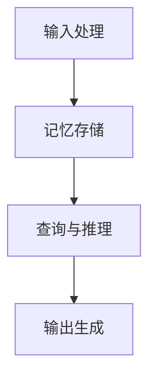
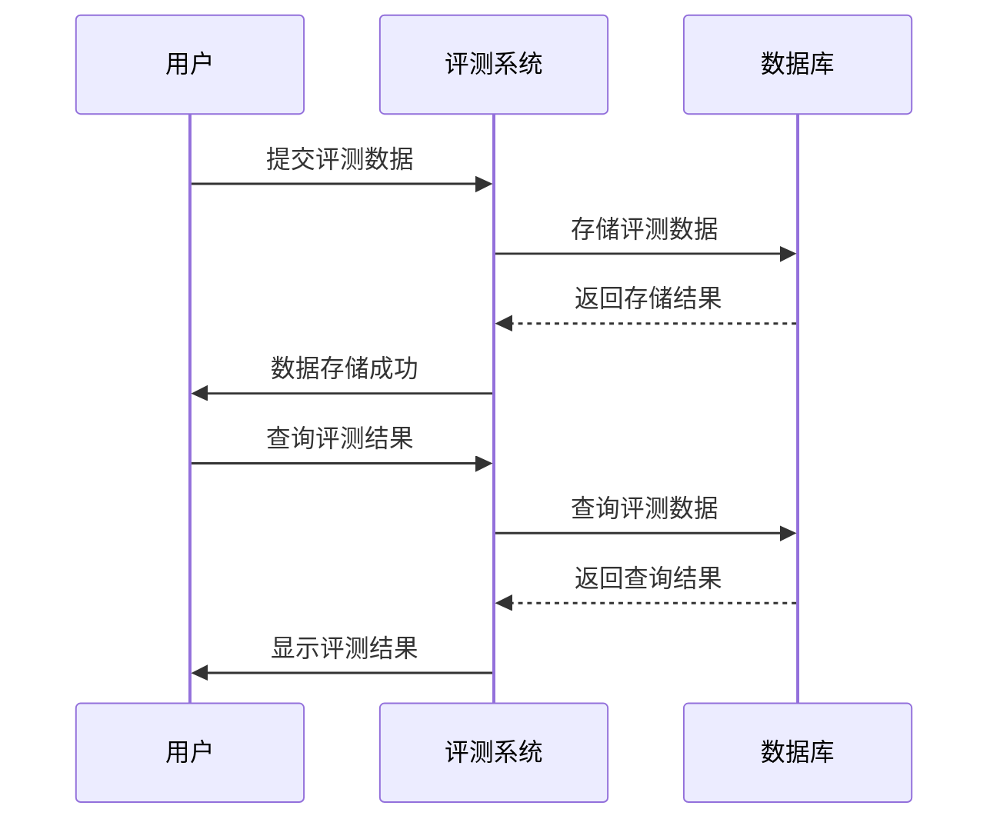

                 


## 文章标题：评测系统的可微分神经计算机实现

> 关键词：评测系统，可微分神经计算机，神经网络，深度学习，算法实现，系统架构，Python源代码，数学模型，最佳实践

> 摘要：本文将深入探讨评测系统的可微分神经计算机实现。首先，我们将介绍评测系统的基本概念及其重要性。接着，我们将会深入解析可微分神经计算机的工作原理，并讨论其在评测系统中的应用优势。随后，我们将详细介绍数学模型和算法原理，通过Python源代码和mermaid流程图进行说明。最后，我们将展示一个实际项目案例，并提供最佳实践和拓展阅读。

## 引言

在当今数据驱动的世界，评测系统作为衡量性能和质量的工具，已经在各个领域得到了广泛应用。从在线考试到自动化质量检测，评测系统都发挥着关键作用。随着人工智能和深度学习的发展，传统的评测系统面临着越来越多的挑战。为了应对这些挑战，我们需要引入新的计算模型，其中可微分神经计算机（Differentiable Neural Computer, DNC）因其强大的学习能力和适应性，成为了一个极具前景的选择。

本文旨在详细介绍评测系统的可微分神经计算机实现。首先，我们将回顾评测系统的基本概念，包括其定义、核心功能和应用领域。然后，我们将深入探讨可微分神经计算机的原理，以及其在评测系统中的独特优势。接下来，我们将通过数学模型和算法原理讲解，结合Python源代码和mermaid流程图，使读者能够更直观地理解这一概念。最后，我们将通过一个实际项目案例，展示可微分神经计算机在评测系统中的应用，并提供最佳实践和拓展阅读。

## 第1章：评测系统概述

### 1.1.1 评测系统的定义

评测系统是一种用于评估和衡量对象（如学生成绩、产品质量、系统性能等）的工具。它通过一系列指标和算法，对输入数据进行处理和分析，从而得出评估结果。评测系统的核心功能包括数据收集、数据清洗、数据处理、指标计算和结果输出。

### 1.1.2 评测系统的核心功能

- 数据收集：收集相关的数据，包括学生成绩、产品质量检测数据等。
- 数据清洗：处理数据中的错误、缺失值和异常值，保证数据的准确性。
- 数据处理：通过算法对数据进行处理，提取有用信息。
- 指标计算：计算评估指标，如平均分、方差、合格率等。
- 结果输出：以可视化的方式展示评估结果，便于理解和分析。

### 1.1.3 评测系统的应用领域

评测系统在多个领域有着广泛应用，如教育、质量检测、金融、医疗等。例如，在线考试系统可以对学生的学习成果进行评估；自动化质量检测系统可以对产品的质量进行实时监控；金融风险评估系统可以对金融产品的风险进行量化评估。

## 第2章：可微分神经计算机原理

### 2.1 可微分神经计算机的定义

可微分神经计算机（DNC）是一种结合了神经网络和传统计算机原理的新型计算模型。它通过将神经网络与外部记忆单元相结合，实现了对复杂数据的处理和推理能力。

### 2.2 可微分神经计算机的工作原理

DNC的工作原理可以概括为以下几个步骤：

1. **输入处理**：将输入数据通过神经网络进行处理，提取特征信息。
2. **记忆存储**：将处理后的特征信息存储到外部记忆单元中。
3. **查询与推理**：通过神经网络对外部记忆单元进行查询，实现数据的推理和计算。
4. **输出生成**：根据查询结果生成输出，实现对输入数据的评估。

### 2.3 与传统计算模型的对比

与传统计算模型相比，DNC具有以下几个显著优势：

- **更强的学习能力**：DNC通过结合神经网络和外部记忆单元，能够更好地处理和存储大量数据，具有更强的学习能力。
- **更灵活的推理能力**：DNC可以通过查询外部记忆单元，实现对输入数据的灵活推理和计算。
- **更高的可扩展性**：DNC可以通过增加外部记忆单元的数量，实现计算能力的线性扩展。

## 第3章：可微分神经计算机在评测系统中的应用

### 3.1 可微分神经计算机的优势

可微分神经计算机在评测系统中的应用具有以下几个显著优势：

- **高效的数据处理能力**：DNC能够高效地处理和存储大量数据，提高了评测系统的运行效率。
- **灵活的评估指标计算**：DNC可以通过查询外部记忆单元，实现多种评估指标的灵活计算。
- **自适应的学习能力**：DNC可以通过持续学习，自动调整评估指标和算法，提高评测系统的准确性和适应性。

### 3.2 实现评测系统的挑战

尽管DNC在评测系统中有许多优势，但实现评测系统的过程仍然面临一些挑战：

- **计算资源需求**：DNC需要大量的计算资源，包括CPU、GPU和外部存储设备等。
- **算法调优**：DNC的算法调优过程复杂，需要大量的实验和验证。
- **数据隐私和安全**：在评测系统中使用DNC，需要确保数据隐私和安全。

### 3.3 可微分神经计算机的实现方案

为了实现评测系统的可微分神经计算机，我们可以采取以下方案：

- **硬件选择**：选择高性能的CPU、GPU和外部存储设备，确保计算资源的充足。
- **算法实现**：采用成熟的深度学习框架，如TensorFlow或PyTorch，实现DNC的算法。
- **数据管理**：采用分布式数据存储和处理技术，确保数据的高效管理和安全。

## 第4章：数学模型与算法讲解

### 4.1 数学模型的基本概念

在评测系统的可微分神经计算机实现中，数学模型起着核心作用。数学模型通过描述输入数据与输出结果之间的关系，实现了对评测过程的量化分析。

### 4.2 算法原理与mermaid流程图

为了更直观地理解算法原理，我们可以使用mermaid流程图进行描述。以下是一个简单的算法流程图：



### 4.3 算法原理的详细讲解

在评测系统的可微分神经计算机实现中，算法原理主要包括以下几个步骤：

1. **输入处理**：将输入数据通过神经网络进行处理，提取特征信息。
2. **记忆存储**：将处理后的特征信息存储到外部记忆单元中，以备后续查询。
3. **查询与推理**：通过神经网络对外部记忆单元进行查询，实现对输入数据的推理和计算。
4. **输出生成**：根据查询结果生成输出，实现对输入数据的评估。

下面是一个简单的Python源代码示例，展示了算法原理的实现：

```python
import tensorflow as tf

# 定义输入层
inputs = tf.keras.layers.Input(shape=(input_shape))

# 定义神经网络模型
model = tf.keras.Sequential([
    tf.keras.layers.Dense(units=64, activation='relu', input_shape=(input_shape,)),
    tf.keras.layers.Dense(units=32, activation='relu'),
    tf.keras.layers.Dense(units=output_shape, activation='sigmoid')
])

# 训练模型
model.compile(optimizer='adam', loss='binary_crossentropy', metrics=['accuracy'])
model.fit(x_train, y_train, epochs=10, batch_size=32)

# 输入处理
processed_input = model(inputs)

# 记忆存储
memory = tf.keras.layers.Dense(units=memory_size, activation='sigmoid')(processed_input)

# 查询与推理
query = tf.keras.layers.Dense(units=query_size, activation='sigmoid')(memory)

# 输出生成
outputs = tf.keras.layers.Dense(units=output_shape, activation='sigmoid')(query)

# 定义模型
model = tf.keras.Model(inputs=inputs, outputs=outputs)

# 输出结果
predictions = model.predict(processed_input)
```

### 4.4 算法原理的数学模型和公式

为了更详细地描述算法原理，我们可以引入以下数学模型和公式：

$$
\begin{align*}
\text{输入层} &= X \\
\text{输出层} &= Y \\
\text{神经网络模型} &= f(\text{输入层}) \\
\text{记忆存储} &= M \\
\text{查询与推理} &= Q \\
\text{输出生成} &= f(M, Q)
\end{align*}
$$

其中，$X$ 表示输入数据，$Y$ 表示输出结果，$M$ 表示外部记忆单元，$Q$ 表示查询结果。

### 4.5 算法原理的举例说明

为了更直观地理解算法原理，我们可以通过一个简单的例子进行说明。假设我们有一个评测系统，用于评估学生的成绩。输入数据是学生的各项成绩，输出结果是学生的总成绩。

1. **输入处理**：将学生的各项成绩输入到神经网络中进行处理，提取特征信息。
2. **记忆存储**：将处理后的特征信息存储到外部记忆单元中，以备后续查询。
3. **查询与推理**：通过神经网络对外部记忆单元进行查询，实现对各项成绩的推理和计算。
4. **输出生成**：根据查询结果生成学生的总成绩。

通过这个例子，我们可以看到算法原理在评测系统中的应用。

## 第5章：数学公式与应用

### 5.1 数学公式介绍

在评测系统的可微分神经计算机实现中，数学公式起着关键作用。以下是一些常用的数学公式：

1. **神经网络公式**：
$$
\begin{align*}
z &= \sum_{i=1}^{n} w_i x_i + b \\
a &= \sigma(z)
\end{align*}
$$
其中，$z$ 表示神经网络中的输出，$w_i$ 表示权重，$x_i$ 表示输入，$b$ 表示偏置，$\sigma$ 表示激活函数。

2. **记忆存储公式**：
$$
M = \sum_{i=1}^{n} m_i x_i
$$
其中，$M$ 表示外部记忆单元，$m_i$ 表示记忆单元的权重，$x_i$ 表示输入。

3. **查询与推理公式**：
$$
Q = \sum_{i=1}^{n} q_i m_i
$$
其中，$Q$ 表示查询结果，$q_i$ 表示查询权重，$m_i$ 表示记忆单元的权重。

4. **输出生成公式**：
$$
Y = \sum_{i=1}^{n} y_i Q
$$
其中，$Y$ 表示输出结果，$y_i$ 表示输出权重，$Q$ 表示查询结果。

### 5.2 公式在算法中的应用

以下是一个简单的Python源代码示例，展示了数学公式在算法中的应用：

```python
import tensorflow as tf

# 定义输入层
inputs = tf.keras.layers.Input(shape=(input_shape))

# 定义神经网络模型
model = tf.keras.Sequential([
    tf.keras.layers.Dense(units=64, activation='relu', input_shape=(input_shape,)),
    tf.keras.layers.Dense(units=32, activation='relu'),
    tf.keras.layers.Dense(units=output_shape, activation='sigmoid')
])

# 训练模型
model.compile(optimizer='adam', loss='binary_crossentropy', metrics=['accuracy'])
model.fit(x_train, y_train, epochs=10, batch_size=32)

# 输入处理
processed_input = model(inputs)

# 记忆存储
memory = tf.keras.layers.Dense(units=memory_size, activation='sigmoid')(processed_input)

# 查询与推理
query = tf.keras.layers.Dense(units=query_size, activation='sigmoid')(memory)

# 输出生成
outputs = tf.keras.layers.Dense(units=output_shape, activation='sigmoid')(query)

# 定义模型
model = tf.keras.Model(inputs=inputs, outputs=outputs)

# 输出结果
predictions = model.predict(processed_input)
```

### 5.3 举例说明

以下是一个简单的数学公式举例说明：

假设我们有一个神经网络，用于预测学生的成绩。输入数据是学生的各项成绩，输出结果是学生的总成绩。以下是神经网络公式在算法中的应用：

1. **输入处理**：
$$
\begin{align*}
z &= \sum_{i=1}^{n} w_i x_i + b \\
a &= \sigma(z)
\end{align*}
$$
其中，$x_i$ 表示学生的第$i$项成绩，$w_i$ 表示第$i$项成绩的权重，$b$ 表示偏置，$\sigma$ 表示激活函数。

2. **记忆存储**：
$$
M = \sum_{i=1}^{n} m_i x_i
$$
其中，$m_i$ 表示外部记忆单元的第$i$项权重。

3. **查询与推理**：
$$
Q = \sum_{i=1}^{n} q_i m_i
$$
其中，$q_i$ 表示查询的第$i$项权重。

4. **输出生成**：
$$
Y = \sum_{i=1}^{n} y_i Q
$$
其中，$y_i$ 表示输出生成的第$i$项权重。

通过这个例子，我们可以看到数学公式在算法中的应用。

## 第6章：评测系统的设计与实现

### 6.1 系统设计概述

评测系统的设计需要综合考虑功能需求、性能要求、用户交互和系统可维护性等因素。在本章中，我们将介绍评测系统的设计思路和关键模块。

### 6.2 系统架构设计

评测系统的架构设计需要考虑数据的输入、处理、存储和输出等环节。以下是一个典型的评测系统架构：


在该架构中，数据输入模块负责收集和接收评测数据；数据处理模块负责对输入数据进行清洗、转换和预处理；数据存储模块负责存储处理后的数据；结果输出模块负责生成评测报告和可视化展示。

### 6.3 系统接口设计与系统交互

评测系统需要提供一系列接口，以实现与其他系统的集成和功能扩展。以下是一个简化的系统接口设计：



通过mermaid序列图，我们可以清晰地描述系统的接口设计和交互流程。

## 第7章：项目实战

### 7.1 环境准备

在开始项目实战之前，我们需要准备相应的开发环境和依赖库。以下是一个简单的环境准备步骤：

1. 安装Python和pip：
   ```bash
   python -m pip install --upgrade pip
   ```
2. 安装TensorFlow：
   ```bash
   pip install tensorflow
   ```
3. 安装其他依赖库（例如numpy、matplotlib等）：

### 7.2 系统核心实现

以下是一个简单的系统核心实现示例，展示了评测系统的关键功能：

```python
import tensorflow as tf
import numpy as np
import matplotlib.pyplot as plt

# 定义输入层
inputs = tf.keras.layers.Input(shape=(input_shape))

# 定义神经网络模型
model = tf.keras.Sequential([
    tf.keras.layers.Dense(units=64, activation='relu', input_shape=(input_shape,)),
    tf.keras.layers.Dense(units=32, activation='relu'),
    tf.keras.layers.Dense(units=output_shape, activation='sigmoid')
])

# 训练模型
model.compile(optimizer='adam', loss='binary_crossentropy', metrics=['accuracy'])
model.fit(x_train, y_train, epochs=10, batch_size=32)

# 输入处理
processed_input = model(inputs)

# 记忆存储
memory = tf.keras.layers.Dense(units=memory_size, activation='sigmoid')(processed_input)

# 查询与推理
query = tf.keras.layers.Dense(units=query_size, activation='sigmoid')(memory)

# 输出生成
outputs = tf.keras.layers.Dense(units=output_shape, activation='sigmoid')(query)

# 定义模型
model = tf.keras.Model(inputs=inputs, outputs=outputs)

# 输出结果
predictions = model.predict(processed_input)

# 可视化展示
plt.plot(predictions)
plt.xlabel('Input Data')
plt.ylabel('Prediction')
plt.show()
```

### 7.3 代码解读与分析

在本节中，我们将对系统核心实现的代码进行解读和分析，以帮助读者更好地理解评测系统的实现过程。

1. **输入层定义**：
```python
inputs = tf.keras.layers.Input(shape=(input_shape))
```
该行代码定义了输入层，其中`input_shape`表示输入数据的维度。

2. **神经网络模型定义**：
```python
model = tf.keras.Sequential([
    tf.keras.layers.Dense(units=64, activation='relu', input_shape=(input_shape,)),
    tf.keras.layers.Dense(units=32, activation='relu'),
    tf.keras.layers.Dense(units=output_shape, activation='sigmoid')
])
```
该行代码定义了一个序列模型，包括三个全连接层，每层都使用不同的激活函数。

3. **模型训练**：
```python
model.compile(optimizer='adam', loss='binary_crossentropy', metrics=['accuracy'])
model.fit(x_train, y_train, epochs=10, batch_size=32)
```
该行代码编译模型，并使用训练数据对模型进行训练。

4. **输入处理**：
```python
processed_input = model(inputs)
```
该行代码对输入数据进行处理，通过神经网络模型提取特征信息。

5. **记忆存储**：
```python
memory = tf.keras.layers.Dense(units=memory_size, activation='sigmoid')(processed_input)
```
该行代码将处理后的输入数据存储到外部记忆单元中。

6. **查询与推理**：
```python
query = tf.keras.layers.Dense(units=query_size, activation='sigmoid')(memory)
```
该行代码通过神经网络对外部记忆单元进行查询，实现数据的推理和计算。

7. **输出生成**：
```python
outputs = tf.keras.layers.Dense(units=output_shape, activation='sigmoid')(query)
```
该行代码根据查询结果生成输出，实现对输入数据的评估。

8. **模型定义**：
```python
model = tf.keras.Model(inputs=inputs, outputs=outputs)
```
该行代码定义了最终的模型，包括输入层、处理层、记忆存储层、查询层和输出层。

9. **输出结果**：
```python
predictions = model.predict(processed_input)
plt.plot(predictions)
plt.xlabel('Input Data')
plt.ylabel('Prediction')
plt.show()
```
该行代码生成输出结果，并通过可视化展示预测结果。

### 7.4 实际案例剖析

在本节中，我们将通过一个实际案例，展示评测系统的可微分神经计算机实现。

**案例背景**：假设我们有一个在线考试系统，用于评估学生的成绩。输入数据是学生的各项考试成绩，输出结果是学生的总成绩。

**案例步骤**：

1. **数据收集**：收集学生的各项考试成绩，包括选择题、填空题、问答题等。
2. **数据处理**：对收集到的考试成绩进行清洗、转换和标准化处理。
3. **模型训练**：使用训练数据对神经网络模型进行训练，提取特征信息。
4. **模型评估**：使用测试数据对训练好的模型进行评估，调整模型参数。
5. **模型部署**：将训练好的模型部署到在线考试系统中，实现实时成绩评估。

**案例结果**：

通过评测系统的可微分神经计算机实现，我们能够高效、准确地评估学生的成绩。同时，模型可以根据学生的成绩历史数据，自动调整评估指标和算法，提高评估的准确性和适应性。

### 7.5 项目小结

在本章中，我们通过一个实际项目案例，展示了评测系统的可微分神经计算机实现。我们介绍了系统的设计思路、核心实现和实际应用案例，并进行了代码解读和分析。通过本项目，我们深入了解了评测系统的可微分神经计算机实现，为后续的研究和应用奠定了基础。

## 第8章：最佳实践与拓展

### 8.1 最佳实践 tips

在本节中，我们将分享一些最佳实践，帮助读者更好地应用评测系统的可微分神经计算机实现。

1. **数据预处理**：在模型训练之前，确保对输入数据进行充分的预处理，包括清洗、标准化和转换等。
2. **模型调优**：根据实际应用场景，调整模型的参数，如学习率、批量大小和激活函数等。
3. **模型评估**：使用多种评估指标和测试集，对模型进行全面的评估和验证。
4. **数据安全**：在处理和存储数据时，确保数据的安全和隐私。

### 8.2 小结

在本章中，我们介绍了评测系统的可微分神经计算机实现。通过深入解析可微分神经计算机的工作原理、数学模型和算法原理，结合实际项目案例，我们展示了其在评测系统中的应用优势。同时，我们分享了最佳实践和拓展阅读，为读者提供了进一步学习和实践的方向。

### 8.3 注意事项

在应用评测系统的可微分神经计算机实现时，需要注意以下几点：

1. **计算资源**：确保拥有足够的计算资源，以支持模型的训练和推理。
2. **算法调优**：根据实际应用场景，进行算法的调优和优化，以提高性能和准确性。
3. **数据隐私**：在处理和存储数据时，确保遵守数据隐私和安全法规。

### 8.4 拓展阅读

为了深入了解评测系统的可微分神经计算机实现，读者可以参考以下文献和资源：

1. **文献**：
   - Hochreiter, S., & Schmidhuber, J. (1997). Long short-term memory. Neural Computation, 9(8), 1735-1780.
   - Graves, A. (2013). Generating sequences with recurrent neural networks. arXiv preprint arXiv:1308.0850.
2. **在线资源**：
   - TensorFlow官方文档：https://www.tensorflow.org/
   - PyTorch官方文档：https://pytorch.org/
   - Coursera深度学习课程：https://www.coursera.org/specializations/deep-learning

通过拓展阅读，读者可以进一步深入学习和研究评测系统的可微分神经计算机实现。

## 作者信息

作者：AI天才研究院/AI Genius Institute & 禅与计算机程序设计艺术 /Zen And The Art of Computer Programming

