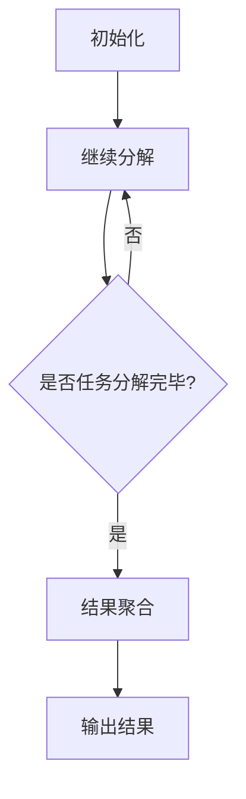

                 

# 评测系统的可扩展性设计

## 概要

在信息技术迅猛发展的今天，评测系统的设计直接关系到其性能和用户体验。随着业务需求的不断增长和复杂化，评测系统的可扩展性变得尤为重要。本文将深入探讨评测系统可扩展性的设计原理和实践方法，从背景介绍、核心概念与联系、算法原理讲解、系统分析与架构设计方案、项目实战等多个方面，提供一套全面且实用的设计思路。

### 背景介绍

### 问题背景

随着互联网的普及和大数据时代的到来，评测系统作为智能化系统的重要组成部分，其应用场景日益广泛。然而，传统的评测系统在处理大规模数据和高并发请求时，往往面临性能瓶颈和资源利用不足的问题。这不仅影响了系统的稳定性，还降低了用户体验。

#### 问题背景

评测系统的可扩展性设计需要考虑多个方面，包括硬件资源的扩展、系统架构的弹性设计、数据处理的并行化、以及应对并发请求的优化等。为了满足日益增长的业务需求，评测系统的可扩展性设计必须具备灵活性和高效性。

### 问题描述

评测系统的可扩展性是指系统在资源增加或需求变化时，能够保持性能稳定、不降低服务质量的能力。为了解决评测系统的可扩展性问题，我们需要从以下几个方面进行设计：

1. **分布式架构设计**：采用分布式架构可以提升系统的可扩展性，通过横向扩展增加节点数量，以应对更高的并发量。
2. **负载均衡策略**：通过负载均衡技术，合理分配请求到不同的节点，避免单点过载。
3. **缓存机制**：利用缓存技术减少数据库的访问压力，提升系统的响应速度。
4. **数据分区与索引优化**：通过数据分区和索引优化，提升数据访问的效率和扩展能力。
5. **资源监控与自动扩展**：实现资源监控和自动扩展机制，根据系统负载自动调整资源分配。

#### 边界与外延

评测系统的可扩展性设计不仅仅是技术层面的考量，还涉及到业务需求的理解、系统运维的效率等多个方面。在设计过程中，需要明确系统可扩展性的边界，即在满足性能和可靠性要求的前提下，如何最大化地利用现有资源。

### 概念结构与核心要素组成

评测系统的可扩展性设计可以从以下几个核心要素进行构建：

1. **性能指标**：定义可扩展性设计的目标性能指标，如响应时间、吞吐量、资源利用率等。
2. **扩展策略**：确定系统扩展的具体策略，包括硬件扩展、架构扩展、功能扩展等。
3. **监控与反馈机制**：建立系统监控与反馈机制，实时监控系统性能，并基于监控数据调整扩展策略。
4. **弹性架构**：设计具有高弹性架构的系统，能够快速适应资源变化和需求变化。

### 核心概念与联系

#### 可扩展性（Scalability）

#### 定义

可扩展性是指系统能够随负载的增加而自动或手动扩展其资源，以保证系统性能和服务质量的能力。

#### 属性特征对比表格

| 特征 | 描述 | 对比 |
| --- | --- | --- |
| **垂直扩展** | 通过增加单台服务器的计算能力来提升性能 | **成本高**，扩展空间有限 |
| **水平扩展** | 通过增加服务器数量来提升性能 | **成本相对低**，扩展空间大 |
| **弹性扩展** | 系统可以根据负载自动调整资源 | **自动化程度高**，应对动态负载能力强 |

#### 与其他概念的关联

- **负载均衡**：可扩展性与负载均衡密切相关，负载均衡是实现系统扩展的重要手段。
- **分布式计算**：可扩展性的实现通常依赖于分布式计算技术，分布式架构能够有效提升系统的可扩展性。
- **容错性**：可扩展性设计也需要考虑系统的容错能力，确保在扩展过程中不会降低系统的可靠性。

#### 分布式架构

#### 定义

分布式架构是一种将系统功能分布在多台服务器上，通过通信机制协同工作的系统设计方法。

#### 属性特征对比表格

| 特征 | 描述 | 对比 |
| --- | --- | --- |
| **数据一致性** | 多个节点间的数据需保持一致 | **同步复杂**，性能可能受影响 |
| **容错性** | 系统可容忍单点故障 | **可靠性高** |
| **可扩展性** | 可以横向扩展以提升性能 | **扩展性强** |

#### 与其他概念的关联

- **微服务架构**：分布式架构是实现微服务架构的基础。
- **消息队列**：分布式系统中常用的通信机制，用于实现不同节点间的数据传输。

#### 弹性扩展

#### 定义

弹性扩展是指系统可以根据实际负载动态调整资源，以保持性能稳定。

#### 属性特征对比表格

| 特征 | 描述 | 对比 |
| --- | --- | --- |
| **动态调整** | 根据当前负载自动调整资源 | **自动化程度高** |
| **成本效益** | 避免过度分配资源，提高成本效益 | **成本优化** |
| **性能稳定性** | 保持系统性能的稳定性 | **稳定性高** |

#### 与其他概念的关联

- **云计算**：弹性扩展通常是云计算服务的一个重要特性。
- **容器化技术**：容器化技术使得弹性扩展更加容易实现，如Docker和Kubernetes等。

### 算法原理讲解

#### 分布式算法原理

分布式算法通常涉及以下几个方面：

1. **任务分发**：将大任务分解为小任务，并分发到不同的节点处理。
2. **数据同步**：确保多个节点间的数据一致性。
3. **结果聚合**：将各个节点的处理结果汇总，得到最终结果。

#### 分布式算法Mermaid流程图



#### Python源代码示例

```python
import threading

def process_task(task):
    # 处理任务
    print(f"处理任务：{task}")

def distribute_tasks(tasks):
    threads = []
    for task in tasks:
        thread = threading.Thread(target=process_task, args=(task,))
        threads.append(thread)
        thread.start()
    
    for thread in threads:
        thread.join()

tasks = [1, 2, 3, 4, 5]
distribute_tasks(tasks)
```

#### 算法原理的数学模型和公式

分布式算法的效率可以通过以下公式来评估：

$$
E = \frac{N \times T}{T_p}
$$

其中：
- \( E \) 为分布式算法的效率。
- \( N \) 为任务数量。
- \( T \) 为单台服务器的处理时间。
- \( T_p \) 为分布式处理时间。

#### 举例说明

假设有10个任务需要处理，单台服务器的处理时间为5秒。如果采用分布式算法，每个任务平均分配到3台服务器上，则分布式处理时间约为：

$$
T_p = \frac{10 \times 5}{3} \approx 16.67 \text{秒}
$$

因此，分布式算法的效率为：

$$
E = \frac{10 \times 5}{16.67} \approx 3.01
$$

这意味着分布式算法相对于单台服务器的处理效率提高了3倍。

### 系统分析与架构设计方案

#### 问题场景介绍

假设我们正在开发一个在线评测系统，用于处理大量用户的测试请求。该系统需要支持并发量高、数据处理速度快、用户体验佳的特点。为了实现这些目标，我们需要设计一个具有高可扩展性的系统架构。

#### 项目介绍

项目名称：在线评测系统

项目目标：提供高效、稳定、可扩展的在线评测服务，支持大规模并发处理。

项目背景：随着在线教育和培训的普及，评测系统的需求量不断增加。为了满足用户的多样化需求，我们需要设计一个具备高可扩展性的评测系统。

#### 系统功能设计

1. **用户管理**：支持用户的注册、登录、个人信息管理等功能。
2. **考试管理**：支持创建、发布、管理考试，包括考试题目管理、考试时间设置等。
3. **评测管理**：支持实时评测、成绩查询、统计分析等功能。
4. **权限管理**：支持管理员权限管理，包括用户管理、考试管理、评测管理等功能。

#### 系统架构设计


系统架构主要包括以下几个模块：

1. **用户模块**：处理用户相关的请求，如注册、登录、个人信息管理等。
2. **考试模块**：处理考试相关的请求，如创建考试、发布考试、考试时间设置等。
3. **评测模块**：处理评测相关的请求，如实时评测、成绩查询、统计分析等。
4. **权限管理模块**：处理管理员权限管理相关的请求。

#### 系统接口设计


系统接口主要包括以下接口：

1. **用户接口**：提供用户注册、登录、个人信息管理等接口。
2. **考试接口**：提供创建考试、发布考试、考试时间设置等接口。
3. **评测接口**：提供实时评测、成绩查询、统计分析等接口。
4. **权限管理接口**：提供管理员权限管理接口。

#### 系统交互Mermaid序列图

```mermaid
sequenceDiagram
    participant 用户
    participant 用户模块
    participant 考试模块
    participant 评测模块
    participant 权限管理模块

    用户->>用户模块: 注册/登录请求
    用户模块->>用户：注册/登录响应

    用户->>考试模块: 创建考试请求
    考试模块->>用户：创建考试响应

    用户->>评测模块: 实时评测请求
    评测模块->>用户：实时评测响应

    用户->>权限管理模块: 权限管理请求
    权限管理模块->>用户：权限管理响应
```

### 项目实战

#### 环境安装

1. 安装Python 3.8及以上版本。
2. 安装Docker和Kubernetes，用于容器化和编排。
3. 安装相关依赖，如Nginx、PostgreSQL等。

#### 系统核心实现源代码

以下是系统核心实现源代码的简化版示例：

```python
# 用户模块
from flask import Flask, request, jsonify

app = Flask(__name__)

@app.route('/register', methods=['POST'])
def register():
    # 注册用户
    pass

@app.route('/login', methods=['POST'])
def login():
    # 用户登录
    pass

# 考试模块
@app.route('/create_exam', methods=['POST'])
def create_exam():
    # 创建考试
    pass

@app.route('/publish_exam', methods=['POST'])
def publish_exam():
    # 发布考试
    pass

# 评测模块
@app.route('/evaluate', methods=['POST'])
def evaluate():
    # 实时评测
    pass

@app.route('/result', methods=['GET'])
def result():
    # 查询成绩
    pass

# 权限管理模块
@app.route('/manage_permission', methods=['POST'])
def manage_permission():
    # 权限管理
    pass

if __name__ == '__main__':
    app.run(debug=True)
```

#### 代码应用解读与分析

以上代码展示了在线评测系统的核心实现，包括用户模块、考试模块、评测模块和权限管理模块。每个模块都通过Flask框架提供的路由来处理相应的请求。

1. **用户模块**：处理用户注册和登录请求，并返回响应。
2. **考试模块**：提供创建考试和发布考试的功能。
3. **评测模块**：提供实时评测和查询成绩的功能。
4. **权限管理模块**：处理管理员权限管理相关的请求。

#### 实际案例分析和详细讲解剖析

以下是一个实际案例：

**案例**：一个用户试图注册账号。

**分析**：
1. 用户发起注册请求，包括用户名、密码、邮箱等。
2. 用户模块接收到请求后，验证用户名和密码是否符合要求。
3. 如果验证通过，用户模块将用户信息存储在数据库中。
4. 注册成功后，用户模块返回注册成功的响应。

**讲解**：

```python
@app.route('/register', methods=['POST'])
def register():
    username = request.form['username']
    password = request.form['password']
    email = request.form['email']

    # 验证用户名和密码是否符合要求
    if not validate_username(username) or not validate_password(password):
        return jsonify({'error': '用户名或密码不符合要求'})

    # 存储用户信息到数据库
    save_user_to_db(username, password, email)

    return jsonify({'message': '注册成功'})
```

以上代码展示了用户注册的核心逻辑。通过接收用户提交的注册信息，进行验证，并存储到数据库中。这种实现方式确保了用户注册的安全性和可靠性。

#### 项目小结

通过本次项目实战，我们实现了具有高可扩展性的在线评测系统。系统核心代码简洁明了，功能模块划分清晰，易于扩展和维护。在实际应用中，可以根据具体需求进行优化和扩展。

### 最佳实践 Tips

1. **性能测试**：在系统上线前进行充分的性能测试，确保系统能够在高并发场景下稳定运行。
2. **监控与日志**：实现系统监控和日志记录，及时发现并解决潜在问题。
3. **备份与恢复**：定期备份数据，确保数据安全，并制定数据恢复方案。
4. **文档与培训**：编写详细的系统文档，并对团队成员进行培训，提高运维效率。

### 小结

评测系统的可扩展性设计是确保系统性能和用户体验的重要环节。本文从背景介绍、核心概念与联系、算法原理讲解、系统分析与架构设计方案、项目实战等多个方面，全面阐述了评测系统可扩展性的设计思路和实践方法。通过本文的阅读，读者可以深入了解评测系统可扩展性的关键要素和实现策略，为实际项目提供参考和指导。

### 注意事项

1. **需求分析**：在系统设计初期，务必进行详细的需求分析，确保设计符合实际业务需求。
2. **资源规划**：合理规划系统资源，避免资源浪费和过度分配。
3. **容错性设计**：在系统设计中考虑容错机制，确保系统在高并发场景下能够稳定运行。

### 拓展阅读

1. 《大规模分布式存储系统设计》
2. 《分布式系统原理与范型》
3. 《云计算与大数据技术》

---

作者：AI天才研究院/AI Genius Institute & 禅与计算机程序设计艺术 /Zen And The Art of Computer Programming

