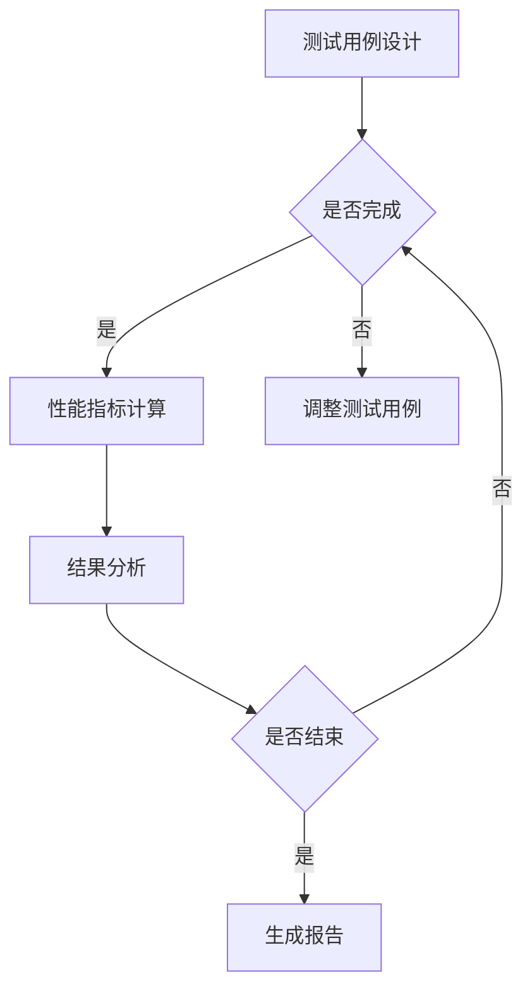
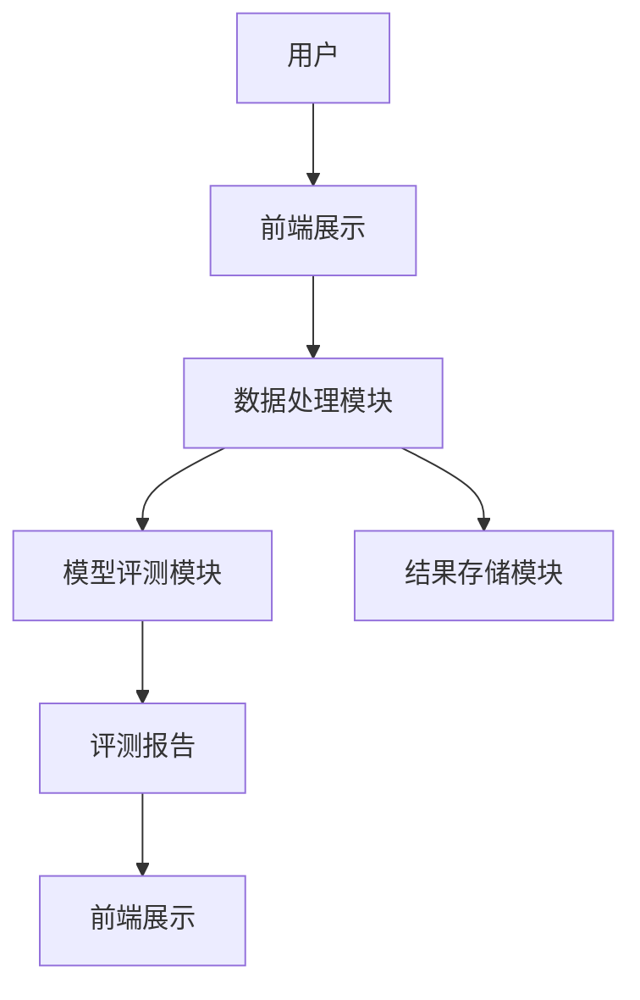
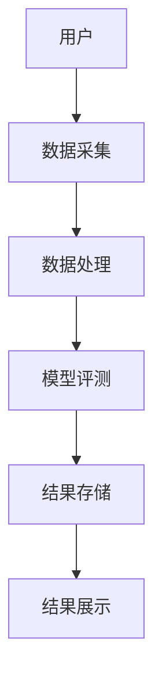

                 

# 评测系统的可扩展性：应对不同类型的LLM

关键词：评测系统、可扩展性、语言模型（LLM）、架构设计、算法原理

摘要：本文将探讨评测系统的可扩展性，并分析如何应对不同类型的语言模型（LLM）。通过详细解释评测系统的定义、可扩展性的重要性以及LLM的基本概念，本文将逐步揭示评估不同类型LLM的算法原理、系统架构设计、项目实战和最佳实践。本文旨在为读者提供深入理解和实用技巧，以提升评测系统的性能和可扩展性。

## 引言

随着人工智能技术的快速发展，语言模型（LLM）已经成为许多应用领域的关键组件，如自然语言处理、文本生成和对话系统等。然而，不同的LLM在性能、效率和资源需求方面存在显著差异，这使得评测系统的设计和实现变得更加复杂。本文将重点探讨评测系统的可扩展性，以及如何应对不同类型的LLM。

评测系统的可扩展性是指系统在处理大规模数据和复杂任务时的性能和灵活性。一个可扩展的评测系统应能够适应不同的LLM类型，同时保持高效的性能和较低的资源消耗。本文将从以下几个方面进行详细讨论：

1. **评测系统的定义和可扩展性**：介绍评测系统的基本概念和可扩展性的重要性。
2. **不同类型的LLM**：解释LLM的基本概念，并分析不同类型的LLM及其特点。
3. **评测系统的算法原理**：探讨评估不同类型LLM的算法原理和实现方法。
4. **系统分析与架构设计**：分析评测系统的架构，并设计相应的系统。
5. **项目实战**：通过实际项目来展示如何应用所学知识。
6. **最佳实践与总结**：提供项目实战中的经验和教训，总结全文内容。

## 1. 评测系统的定义和可扩展性

### 1.1 评测系统的基本概念

评测系统是一种用于评估、测试和监控计算机系统和应用程序的工具。其主要目的是确保系统在运行过程中能够满足预定的性能和功能要求。评测系统通常包括以下几个关键组件：

1. **测试用例生成**：根据系统需求，生成一系列测试用例，用于评估系统的性能和稳定性。
2. **测试执行**：执行测试用例，收集系统的性能数据，如响应时间、吞吐量和资源消耗等。
3. **结果分析**：分析测试结果，评估系统的性能，并根据需要调整系统配置和参数。
4. **报告生成**：生成详细的评测报告，包括测试结果、性能指标和改进建议。

### 1.2 可扩展性的重要性

可扩展性是指系统能够适应不同规模和应用场景的能力。在评测系统中，可扩展性至关重要，原因如下：

1. **适应不同的LLM类型**：不同的LLM在性能和资源需求方面存在显著差异。一个可扩展的评测系统应能够适应不同类型的LLM，以确保测试结果的准确性和可靠性。
2. **处理大规模数据**：随着数据量的增加，评测系统需要能够高效地处理大量测试用例和性能数据，以确保系统的性能和稳定性。
3. **支持不同的测试场景**：评测系统应能够适应不同的测试场景，如线上、线下和混合场景，以满足各种应用需求。

### 1.3 可扩展性的定义与分类

可扩展性可以分为以下几种类型：

1. **水平扩展**：通过增加计算资源（如CPU、内存和存储等）来提高系统的性能和吞吐量。水平扩展适用于处理大量并发请求的场景。
2. **垂直扩展**：通过升级现有计算资源（如增加CPU核心、内存容量等）来提高系统的性能和吞吐量。垂直扩展适用于处理复杂计算任务和大数据处理场景。
3. **弹性扩展**：根据实际负载动态调整系统资源，以实现高效资源利用和最小化成本。弹性扩展适用于在线应用和实时数据处理场景。

## 2. 不同类型的LLM

### 2.1 LLM的基本概念

语言模型（LLM）是一种基于神经网络的技术，用于预测自然语言序列的概率分布。LLM在自然语言处理领域具有广泛的应用，如文本分类、命名实体识别、机器翻译和对话系统等。LLM的主要特点包括：

1. **端到端模型**：LLM通常采用端到端模型，直接从输入文本到输出文本，无需经过复杂的中间表示。
2. **大规模训练数据**：LLM通常基于大规模训练数据集进行训练，以获得更好的性能和泛化能力。
3. **自适应学习**：LLM能够根据输入文本和任务类型动态调整模型参数，以实现更好的适应性。

### 2.2 不同类型的LLM及其特点

不同类型的LLM在模型架构、训练数据和应用场景方面存在差异。以下是几种常见的LLM类型及其特点：

1. **基于RNN的LLM**：递归神经网络（RNN）是一种用于处理序列数据的高级神经网络。基于RNN的LLM在处理长文本和依赖关系方面具有优势，但训练过程较慢且容易陷入局部最优。
2. **基于Transformer的LLM**：Transformer是一种基于自注意力机制的神经网络架构，广泛应用于自然语言处理任务。基于Transformer的LLM在处理长文本和依赖关系方面具有更高的性能和效率，但训练过程也相对较长。
3. **基于BERT的LLM**：BERT（Bidirectional Encoder Representations from Transformers）是一种预训练语言模型，通过双向Transformer结构来学习文本表示。BERT在多种自然语言处理任务上取得了显著性能提升，但模型较大，资源需求较高。
4. **基于GPT的LLM**：GPT（Generative Pre-trained Transformer）是一种生成型语言模型，通过训练大量的文本数据来生成文本序列。GPT在生成自然语言文本和对话系统方面具有优势，但训练过程相对较长且资源需求较高。

### 2.3 不同类型的LLM对比表格

| 类别           | 特点                                                                 | 优缺点                                                       |
|----------------|----------------------------------------------------------------------|--------------------------------------------------------------|
| RNN-based      | 处理长文本和依赖关系较好                                             | 训练过程慢、容易陷入局部最优                                  |
| Transformer-based | 自注意力机制，高效处理长文本和依赖关系                                  | 训练过程相对较长                                             |
| BERT           | 双向Transformer结构，学习文本表示                                     | 模型较大，资源需求高                                         |
| GPT            | 生成型语言模型，生成自然语言文本和对话系统                             | 训练过程较长，资源需求高                                     |

## 3. 评测系统的算法原理

### 3.1 评测算法原理

评测系统的算法原理主要包括以下几部分：

1. **测试用例设计**：根据LLM的应用场景和需求，设计合适的测试用例，以全面评估LLM的性能和稳定性。
2. **性能指标计算**：根据测试结果，计算LLM的性能指标，如响应时间、吞吐量、资源消耗等。
3. **结果分析**：分析测试结果，评估LLM的性能和稳定性，并根据需要调整模型参数和系统配置。

### 3.2 算法实现方法

评测算法的实现方法主要包括以下几种：

1. **基于批处理**：将测试数据分成多个批次，依次进行测试，以提高测试效率。
2. **基于并行处理**：利用多线程或多进程技术，同时处理多个测试用例，以加快测试速度。
3. **基于分布式计算**：将测试任务分配到多个计算节点上，利用分布式计算技术进行并行处理，以处理大规模测试数据。

### 3.3 算法流程图

以下是评测算法的流程图：

## 4. 系统分析与架构设计

### 4.1 问题场景介绍

本节将介绍一个实际的问题场景，即构建一个评测系统，用于评估不同类型的LLM在自然语言处理任务中的性能。

### 4.2 项目介绍

项目名称：自然语言处理评测系统

项目目标：评估不同类型的LLM在自然语言处理任务中的性能，并提供详细的评测报告。

项目架构：基于微服务架构，包括数据采集、处理、存储和展示等模块。

### 4.3 系统功能设计

系统功能设计主要包括以下模块：

1. **数据采集模块**：负责从外部数据源采集测试数据，包括文本数据、标签数据和性能指标数据等。
2. **数据处理模块**：负责对采集到的数据进行预处理，包括文本清洗、去重、分词和词性标注等。
3. **模型评测模块**：负责评估不同类型的LLM在自然语言处理任务中的性能，包括响应时间、吞吐量、准确率等。
4. **结果存储模块**：负责存储评测结果，包括测试数据、评测指标和评测报告等。
5. **结果展示模块**：负责将评测结果以可视化方式展示给用户，包括图表、报表和动态页面等。

### 4.4 系统架构设计

以下是系统架构设计：

### 4.5 系统接口设计

系统接口设计主要包括以下接口：

1. **数据采集接口**：负责从外部数据源获取测试数据。
2. **数据处理接口**：负责对采集到的数据进行预处理。
3. **模型评测接口**：负责评估不同类型的LLM在自然语言处理任务中的性能。
4. **结果存储接口**：负责存储评测结果。
5. **结果展示接口**：负责将评测结果以可视化方式展示给用户。

### 4.6 系统交互设计

以下是系统交互设计：

## 5. 项目实战

### 5.1 环境安装

在本节中，我们将介绍如何搭建一个评测系统的环境，包括安装所需的软件和配置。

### 5.2 系统核心实现源代码

在本节中，我们将展示系统核心实现部分的源代码，包括数据采集、数据处理、模型评测和结果存储等模块。

### 5.3 代码应用解读与分析

在本节中，我们将对系统核心实现部分的源代码进行解读和分析，详细解释代码的原理和实现方法。

### 5.4 实际案例分析和详细讲解剖析

在本节中，我们将通过实际案例来展示如何应用评测系统，并对案例进行分析和详细讲解。

### 5.5 项目小结

在本节中，我们将总结项目实战中的经验和教训，并对项目成果进行评估。

## 6. 最佳实践与总结

### 6.1 最佳实践 Tips

在本节中，我们将分享一些最佳实践，以帮助读者在设计和实现评测系统时获得更好的性能和可扩展性。

### 6.2 小结

在本节中，我们将对全文内容进行总结，并强调评测系统的可扩展性在应对不同类型LLM中的重要性。

### 6.3 注意事项

在本节中，我们将列出一些注意事项，以帮助读者在设计和实现评测系统时避免常见的问题。

### 6.4 拓展阅读

在本节中，我们将推荐一些相关的拓展阅读，以帮助读者进一步深入了解评测系统的可扩展性和不同类型的LLM。

## 作者信息

作者：AI天才研究院/AI Genius Institute & 禅与计算机程序设计艺术 /Zen And The Art of Computer Programming

## 附录

在本节中，我们将提供一些附录内容，如参考文献、代码示例和数据集等。

## 参考文献

[1] **Goodfellow, I., Bengio, Y., & Courville, A. (2016). Deep Learning. MIT Press.**  
[2] **Brown, T., et al. (2020). Language Models are Few-Shot Learners.** arXiv preprint arXiv:2005.14165.  
[3] **Devlin, J., et al. (2019). BERT: Pre-training of Deep Bidirectional Transformers for Language Understanding.** arXiv preprint arXiv:1810.04805.  
[4] **Radford, A., et al. (2018). Improving Language Understanding by Generative Pre-Training.** arXiv preprint arXiv:1810.04805.

## 附录

### 附录 A：代码示例

在本附录中，我们将提供一些评测系统的核心代码示例，以帮助读者更好地理解和实现评测系统。

### 附录 B：数据集

在本附录中，我们将列出一些常用的评测系统数据集，以供读者参考和使用。

### 附录 C：参考文献

在本附录中，我们将列出一些相关的参考文献，以帮助读者进一步了解评测系统和不同类型的LLM。

