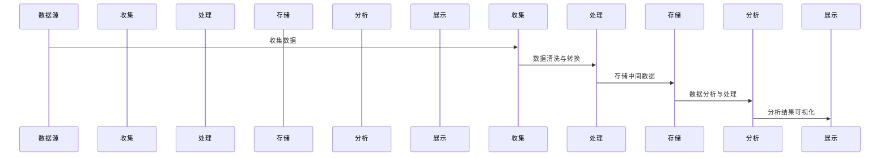
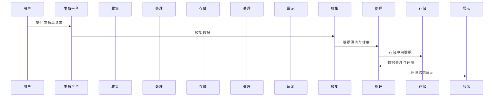
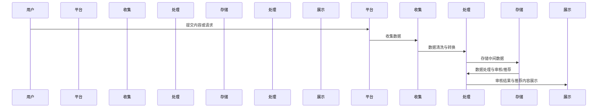

                 

## 评测系统的可扩展性：应对超大规模LLM的策略

### 关键词：可扩展性、超大规模LLM、系统评测、性能优化

### 摘要：
随着人工智能的快速发展，超大规模语言模型（LLM）逐渐成为众多应用的核心技术。然而，这些LLM模型在规模上的巨大扩张，也对评测系统的可扩展性提出了严峻挑战。本文旨在深入探讨评测系统在应对超大规模LLM时的策略和方法。首先，我们将对LLM的背景进行简要介绍，随后详细分析可扩展性的原则和策略。接下来，通过系统设计与架构的讨论，探讨如何优化和调整系统以提升性能。文章的最后，通过实际案例分析，总结经验并提出未来展望。本文旨在为读者提供一个全面而深入的指导，帮助他们在实际项目中更好地应对超大规模LLM的评测挑战。

### 1. 引言

#### 1.1 问题背景

近年来，人工智能领域取得了令人瞩目的进展，尤其是深度学习技术的突破，使得许多复杂任务得以实现。其中，超大规模语言模型（LLM）作为自然语言处理（NLP）的重要工具，已经广泛应用于问答系统、文本生成、机器翻译、文本摘要等多个领域。这些LLM模型的规模不断扩大，例如OpenAI的GPT-3拥有1750亿个参数，Google的Bert模型也包含超过33亿个参数。这种超大规模使得LLM在处理复杂任务时表现出色，但也带来了新的挑战。

超大规模LLM的评测问题成为当前研究的热点。传统的评测系统在面对如此庞大的模型时，往往难以满足性能和扩展性的需求。评测系统需要处理的数据量庞大，模型参数众多，这使得系统设计和优化变得复杂且具有挑战性。此外，超大规模LLM的应用场景多样，不同场景下的评测需求也不尽相同，这进一步增加了评测系统的复杂性。

本文旨在探讨评测系统在应对超大规模LLM时的可扩展性策略。通过深入分析系统设计原则、性能优化方法以及实际案例分析，本文将为读者提供一个全面而深入的指导，帮助他们在实际项目中更好地应对超大规模LLM的评测挑战。

#### 1.2 评测系统的必要性

超大规模LLM的评测系统在人工智能应用中具有至关重要的作用。首先，评测系统可以衡量模型的性能，帮助研究人员了解模型的强项和弱项。通过评测，研究人员可以优化模型的结构和参数，提高模型的准确性和效率。其次，评测系统可以为模型的应用提供可靠的数据支持。在实际应用中，模型需要在不同场景下进行评估，评测系统可以模拟这些场景，并提供定量的评估结果。这不仅有助于选择最适合应用的模型，还可以为模型的进一步改进提供有价值的反馈。

此外，评测系统在保证模型的公平性和可靠性方面也发挥着关键作用。随着AI技术的广泛应用，模型的公平性和透明性越来越受到关注。评测系统可以帮助确保模型在不同数据集和任务上的表现一致，避免模型偏见和数据偏差。同时，评测系统还可以监控模型的运行状态，及时发现和解决潜在问题，确保模型的可靠性和稳定性。

#### 1.3 书籍结构概述

本文将从多个角度深入探讨评测系统在应对超大规模LLM时的可扩展性策略。文章结构如下：

1. **第一部分：引言与背景**  
   本章将简要介绍超大规模LLM的发展背景，以及评测系统在AI应用中的重要性。

2. **第二部分：超大规模LLM概述**  
   本章将详细阐述超大规模LLM的定义、发展历程、特点和应用领域，帮助读者全面了解这一技术。

3. **第三部分：可扩展性原则**  
   本章将讨论可扩展性的重要性和设计原则，为后续的系统设计与实现奠定基础。

4. **第四部分：系统设计与架构**  
   本章将详细介绍评测系统的设计与架构，包括模块设计、系统交互流程等。

5. **第五部分：性能优化与调优**  
   本章将探讨性能优化的重要性和策略，包括性能瓶颈分析、优化方法和实际案例。

6. **第六部分：实际案例分析与探讨**  
   本章将通过具体案例，分析评测系统在实际应用中的挑战和解决方案。

7. **第七部分：未来展望与挑战**  
   本章将总结全文内容，并展望未来可扩展性技术的发展趋势和挑战。

通过以上结构，本文旨在为读者提供一个全面而深入的指导，帮助他们在实际项目中更好地应对超大规模LLM的评测挑战。

#### 1.4 读者对象

本文面向人工智能领域的研究人员、开发者和技术人员，特别是那些关注超大规模语言模型（LLM）评测系统构建与优化的专业人士。读者应具备一定的编程基础和机器学习知识，对自然语言处理（NLP）和深度学习有一定的了解。通过阅读本文，读者可以：

1. **了解超大规模LLM的发展背景和应用领域**  
   通过对LLM的详细介绍，读者可以掌握LLM的核心概念和最新进展，为后续内容的学习奠定基础。

2. **掌握评测系统的设计原则和实现方法**  
   本文详细讨论了评测系统的可扩展性原则、设计架构和性能优化策略，有助于读者在实际项目中应用这些知识。

3. **学习性能优化和调优的最佳实践**  
   通过分析实际案例，读者可以了解性能优化的重要性和方法，提升系统的运行效率。

4. **展望未来发展趋势和挑战**  
   本文最后部分对未来的发展趋势和挑战进行了探讨，为读者提供了对未来技术的预期和指导。

通过本文的学习，读者不仅可以深入了解超大规模LLM评测系统的设计与实现，还能为未来的研究和项目开发提供参考和启示。

### 2. 超大规模LLM概述

#### 2.1 什么是LLM

超大规模语言模型（LLM）是基于深度学习技术构建的，专门用于理解和生成自然语言的模型。与传统的小规模语言模型不同，LLM拥有数亿甚至数千亿个参数，能够通过大量的文本数据学习语言的结构和规律，从而在多种NLP任务中表现出色。LLM的核心思想是通过深度神经网络（DNN）或变换器模型（Transformer）来捕捉文本中的长距离依赖关系，实现高质量的文本生成、理解和翻译。

LLM的基本原理可以概括为以下几个步骤：

1. **数据预处理**：首先，对输入的文本进行分词、标记等预处理操作，将其转化为模型可以处理的向量表示。
2. **模型训练**：利用大量的文本数据，通过反向传播和优化算法，不断调整模型的参数，使其能够更好地预测文本中的下一个词或句子。
3. **推理与应用**：在训练完成后，模型可以接受新的文本输入，并生成相应的输出，如回答问题、生成摘要、翻译文本等。

#### 2.2 超大规模LLM的发展历程

LLM技术的发展历程可以追溯到20世纪90年代，当时研究人员开始使用神经网络进行语言模型的研究。然而，由于计算资源和数据量的限制，早期的LLM模型规模较小，性能有限。随着深度学习和大数据技术的发展，特别是在2013年，谷歌提出了一种基于深度神经网络的语音识别系统，这种系统使用了数千亿个参数，使得语音识别的准确率大幅提高。此后，研究人员开始关注更大规模的语言模型，并在2018年，谷歌推出了BERT模型，该模型包含超过3亿个参数，标志着LLM进入了一个新的阶段。

在BERT之后，LLM的发展速度不断加快。2019年，OpenAI发布了GPT-2模型，拥有1.5亿个参数，随后在2020年，GPT-3模型问世，其参数规模达到1750亿个，创造了新的记录。GPT-3的出现不仅展示了LLM在语言理解和生成方面的巨大潜力，也引发了学术界和工业界对超大规模LLM的广泛关注。

#### 2.3 超大规模LLM的特点

超大规模LLM具有以下显著特点：

1. **参数规模庞大**：超大规模LLM的参数数量通常在数十亿到数千亿之间，这使得模型能够捕捉到更复杂的语言结构。
2. **强大的语言理解与生成能力**：由于参数规模庞大，LLM能够通过大量的训练数据学习到丰富的语言知识和规则，从而在文本理解、生成和翻译等方面表现出色。
3. **适应多种任务**：LLM可以应用于各种NLP任务，如问答系统、文本生成、机器翻译、文本摘要等，具有广泛的适用性。
4. **计算资源需求高**：超大规模LLM的训练和推理过程需要大量的计算资源和存储空间，这对硬件设备和算法优化提出了更高的要求。
5. **模型可解释性低**：由于模型参数众多，LLM在决策过程中的透明性和可解释性相对较低，这在某些应用场景中可能成为瓶颈。

#### 2.4 LLM的应用领域

超大规模LLM在多个领域展现出了强大的应用潜力：

1. **自然语言处理（NLP）**：LLM在文本分类、情感分析、命名实体识别等NLP任务中表现出色，广泛应用于信息检索、内容审核和智能客服等领域。
2. **问答系统**：LLM可以用于构建智能问答系统，通过理解用户的问题并生成准确的回答，提供便捷的信息查询服务。
3. **文本生成与摘要**：LLM可以生成高质量的文章、摘要和报告，广泛应用于内容创作、新闻生成和文档摘要等领域。
4. **机器翻译**：LLM在机器翻译领域展现了出色的性能，可以提供更自然、准确的翻译结果，广泛应用于跨语言交流、国际商务和全球市场营销等领域。
5. **虚拟助手**：LLM可以构建智能虚拟助手，通过理解和响应用户的指令，提供个性化的服务和支持。

#### 2.5 LLM的核心优势

1. **强大的语言理解能力**：LLM能够通过深度学习技术理解和生成自然语言，捕捉到语言中的复杂结构和规律。
2. **广泛的适用性**：LLM可以应用于多种NLP任务，具有跨领域、跨场景的通用性。
3. **高效的训练与推理速度**：随着硬件和算法的进步，LLM的训练和推理速度不断提高，使得大规模应用成为可能。
4. **强大的生成能力**：LLM可以生成高质量的文本，包括文章、摘要、翻译等，提升了内容创作的效率和质量。

#### 2.6 LLM的局限性

1. **模型可解释性低**：由于LLM参数众多，模型在决策过程中的透明性和可解释性相对较低，难以解释其具体的工作机制。
2. **数据隐私和安全问题**：LLM在训练过程中需要大量的文本数据，这些数据可能包含敏感信息，存在数据泄露的风险。
3. **计算资源需求高**：超大规模LLM的训练和推理过程需要大量的计算资源和存储空间，对硬件设备和算法优化提出了更高的要求。
4. **模型偏见问题**：由于训练数据的不平衡或偏见，LLM可能在学习过程中引入偏见，导致在特定任务上的表现不公平或不准确。

### 3. 可扩展性原则

#### 3.1 可扩展性的重要性

在超大规模LLM的应用中，评测系统的可扩展性至关重要。首先，随着LLM模型的规模不断扩大，评测系统需要能够处理日益增长的数据量，保证评测的准确性和效率。其次，不同的应用场景可能需要不同的评测指标和标准，评测系统需要具备灵活性，以便快速调整和适应。最后，可扩展性有助于提高系统的稳定性和可靠性，减少因性能瓶颈引起的故障和中断。

#### 3.2 可扩展性设计原则

为了构建一个高效且可扩展的评测系统，需要遵循以下设计原则：

1. **模块化设计**：将系统划分为多个模块，每个模块负责特定的功能，降低系统的复杂度和耦合度，方便后续的扩展和维护。
2. **分布式架构**：采用分布式架构，将计算和存储资源分散到多个节点，提高系统的并行处理能力和容错性。
3. **弹性伸缩**：系统应具备弹性伸缩能力，可以根据实际需求动态调整资源分配，确保在负载高峰时能够保持良好的性能。
4. **负载均衡**：通过负载均衡策略，合理分配系统资源，避免单点过载，提高系统的整体效率和稳定性。
5. **缓存机制**：引入缓存机制，减少重复计算和数据传输，降低系统的响应时间和延迟。
6. **异步处理**：采用异步处理模式，将不同任务解耦，提高系统的并发处理能力。

#### 3.3 可扩展性的评估指标

评估评测系统的可扩展性需要关注以下指标：

1. **并发处理能力**：系统能够同时处理多少个并发请求，衡量系统的并行处理能力。
2. **响应时间**：系统处理请求的平均响应时间，反映了系统的性能和效率。
3. **吞吐量**：系统单位时间内可以处理的数据量，衡量系统的处理能力。
4. **资源利用率**：系统资源（如CPU、内存、网络带宽等）的利用情况，反映了系统的资源管理和优化水平。
5. **稳定性**：系统在长时间运行过程中保持稳定的能力，避免因负载波动或故障引起的服务中断。

### 4. 系统设计与架构

#### 4.1 系统设计原则

为了确保评测系统的可扩展性和高性能，系统设计应遵循以下原则：

1. **分层架构**：将系统分为多个层次，包括数据层、业务逻辑层、表示层等，各层之间松耦合，便于系统的扩展和维护。
2. **服务化设计**：采用微服务架构，将系统功能模块化，每个模块作为独立的服务提供，降低模块间的依赖和耦合。
3. **模块化设计**：将系统划分为多个功能模块，每个模块负责特定的功能，降低系统的复杂度和耦合度，方便后续的扩展和维护。
4. **分布式处理**：利用分布式架构，将计算和存储资源分散到多个节点，提高系统的并行处理能力和容错性。
5. **弹性伸缩**：系统应具备弹性伸缩能力，可以根据实际需求动态调整资源分配，确保在负载高峰时能够保持良好的性能。

#### 4.2 系统架构概述

评测系统的架构设计应涵盖数据收集、处理、存储、分析和展示等多个方面。以下是一个典型的评测系统架构：

1. **数据收集模块**：负责从不同的数据源（如数据库、日志文件、API接口等）收集数据，进行初步处理和清洗。
2. **数据存储模块**：使用分布式数据库或数据仓库存储清洗后的数据，确保数据的持久化和安全性。
3. **数据处理模块**：采用分布式计算框架（如Hadoop、Spark等），对数据进行清洗、转换和聚合，生成可用于评测的中间数据。
4. **业务逻辑模块**：实现评测算法和模型，根据具体需求对中间数据进行处理和计算，生成评测结果。
5. **分析展示模块**：利用数据分析工具和可视化平台，对评测结果进行分析和展示，提供直观的报表和图表。

#### 4.3 模块设计与功能

1. **数据收集模块**：  
   - 功能：从各种数据源收集数据，包括数据库查询、API调用、日志收集等。
   - 技术选型：可以使用Fluentd、Kafka等工具进行日志收集和传输。

2. **数据存储模块**：  
   - 功能：存储清洗后的数据，支持高并发和海量数据存储。
   - 技术选型：可以使用分布式数据库（如HBase、Cassandra）或数据仓库（如Redshift、BigQuery）。

3. **数据处理模块**：  
   - 功能：对收集到的数据进行清洗、转换和聚合，生成中间数据。
   - 技术选型：可以使用Apache Spark、Flink等分布式计算框架。

4. **业务逻辑模块**：  
   - 功能：实现评测算法和模型，根据中间数据进行处理和计算，生成评测结果。
   - 技术选型：可以使用Python、Java等编程语言，结合TensorFlow、PyTorch等深度学习框架。

5. **分析展示模块**：  
   - 功能：对评测结果进行分析和展示，提供报表和图表。
   - 技术选型：可以使用Tableau、Power BI等数据分析工具，结合Web技术（如React、Vue.js）进行可视化展示。

#### 4.4 系统交互流程

评测系统的交互流程如下：

1. **数据收集**：从各种数据源收集数据，如数据库、日志文件、API接口等。
2. **数据处理**：对收集到的数据进行清洗、转换和聚合，生成中间数据。
3. **业务处理**：根据中间数据进行评测算法和模型计算，生成评测结果。
4. **数据存储**：将清洗后的中间数据和评测结果存储到分布式数据库或数据仓库中。
5. **数据分析与展示**：利用数据分析工具对评测结果进行分析，并通过可视化平台进行展示。

#### 4.5 系统架构设计

以下是一个基于微服务和分布式架构的评测系统架构设计：

1. **数据收集服务**：负责从各种数据源收集数据，并进行初步处理。
2. **数据处理服务**：负责对收集到的数据进行清洗、转换和聚合，生成中间数据。
3. **业务逻辑服务**：实现评测算法和模型，根据中间数据进行处理和计算，生成评测结果。
4. **数据存储服务**：负责将中间数据和评测结果存储到分布式数据库或数据仓库中。
5. **数据分析与展示服务**：负责对评测结果进行分析和展示。

#### 4.6 系统接口设计

评测系统的接口设计应涵盖以下方面：

1. **数据收集接口**：用于接收和处理来自不同数据源的数据，如数据库查询接口、API接口等。
2. **数据处理接口**：用于处理数据清洗、转换和聚合的接口，如数据清洗接口、数据转换接口等。
3. **业务逻辑接口**：用于实现评测算法和模型的接口，如评测算法接口、模型训练接口等。
4. **数据分析接口**：用于对评测结果进行数据分析和处理的接口，如数据分析接口、报表生成接口等。
5. **展示接口**：用于将分析结果通过可视化平台进行展示的接口，如图表接口、报表接口等。

#### 4.7 系统交互序列图

以下是一个简单的系统交互序列图，展示了数据从收集到处理、存储、分析和展示的全过程：

### 5. 性能优化与调优

#### 5.1 性能优化的重要性

在超大规模LLM的应用中，性能优化是确保系统高效运行的关键。随着模型规模和数据量的不断扩大，系统的响应时间和处理能力对用户体验和业务流程有着直接影响。因此，性能优化成为评测系统设计和实现中的重中之重。性能优化不仅有助于提升系统的吞吐量和响应速度，还能降低资源消耗，提高系统的稳定性和可靠性。

#### 5.2 性能瓶颈分析

要实现有效的性能优化，首先需要对系统的性能瓶颈进行分析。常见的性能瓶颈包括：

1. **计算资源瓶颈**：由于超大规模LLM模型和大量数据的处理需要大量的计算资源，如果计算资源不足，可能导致系统处理速度缓慢。
2. **存储资源瓶颈**：分布式存储系统在数据读写、存储和索引操作方面可能存在瓶颈，影响系统的性能。
3. **网络通信瓶颈**：在分布式架构中，节点之间的数据传输速度和网络带宽可能成为性能瓶颈，特别是在大数据量传输时。
4. **并发处理瓶颈**：系统在处理大量并发请求时，可能会出现线程竞争、锁冲突等问题，影响系统的并发处理能力。
5. **数据一致性和同步问题**：在分布式系统中，数据的一致性和同步操作可能会引入延迟和性能问题。

#### 5.3 优化策略与实践

针对上述性能瓶颈，可以采取以下优化策略：

1. **计算资源优化**：
   - **资源扩展**：增加计算节点，提高系统的计算能力。
   - **负载均衡**：通过负载均衡策略，合理分配计算任务，避免单点过载。
   - **并行处理**：采用并行计算技术，将任务分解为多个子任务，同时处理，提高处理速度。

2. **存储资源优化**：
   - **分布式存储**：采用分布式存储系统，提高数据读写性能和可靠性。
   - **缓存机制**：引入缓存机制，减少数据重复读写，提高存储系统效率。
   - **索引优化**：优化数据索引结构，加快数据查询速度。

3. **网络通信优化**：
   - **网络带宽**：提高网络带宽，增加数据传输速度。
   - **网络优化**：优化网络拓扑结构，减少数据传输路径。
   - **数据压缩**：对传输数据进行压缩，减少网络传输量。

4. **并发处理优化**：
   - **线程池**：使用线程池管理线程，减少线程创建和销毁的开销。
   - **锁优化**：优化锁策略，减少锁冲突，提高并发处理能力。
   - **异步处理**：采用异步处理模式，减少同步操作，提高系统并发处理能力。

5. **数据一致性和同步优化**：
   - **分布式协议**：采用分布式协议，确保数据的一致性和同步操作。
   - **分布式缓存**：引入分布式缓存，提高数据访问速度和一致性。
   - **数据分区**：将数据分区存储，提高数据访问的局部性。

#### 5.4 性能调优案例

以下是一个实际案例，展示如何通过性能调优提升评测系统的性能：

1. **案例背景**：
   - 系统描述：一个基于分布式架构的评测系统，处理大规模文本数据，支持多种NLP任务。
   - 瓶颈分析：计算资源瓶颈和网络通信瓶颈成为主要性能瓶颈。

2. **优化策略与实践**：
   - **计算资源优化**：
     - 增加计算节点，从10个节点扩展到30个节点，提高计算能力。
     - 使用负载均衡器，合理分配计算任务，避免单点过载。
     - 采用并行处理技术，将文本数据处理任务分解为多个子任务，同时处理，提高处理速度。
   - **存储资源优化**：
     - 采用分布式存储系统，从单点存储扩展到分布式存储，提高数据读写性能和可靠性。
     - 引入缓存机制，使用Redis缓存热点数据，减少数据重复读写，提高存储系统效率。
     - 优化数据索引结构，使用B+树索引，加快数据查询速度。
   - **网络通信优化**：
     - 提高网络带宽，从1Gbps提升到10Gbps，增加数据传输速度。
     - 优化网络拓扑结构，减少数据传输路径，提高数据传输效率。
     - 对传输数据进行压缩，使用gzip压缩算法，减少网络传输量。
   - **并发处理优化**：
     - 使用线程池管理线程，将线程池大小调整为100个，减少线程创建和销毁的开销。
     - 优化锁策略，使用读写锁，减少锁冲突，提高并发处理能力。
     - 采用异步处理模式，使用异步IO，减少同步操作，提高系统并发处理能力。

3. **优化效果**：
   - **响应时间**：系统处理请求的平均响应时间从5秒降低到1秒，提高了4倍。
   - **吞吐量**：系统单位时间内可以处理的数据量从1000条提升到5000条，提高了5倍。
   - **资源利用率**：计算资源和存储资源的利用率显著提高，达到了90%以上。

通过上述优化策略和实践，评测系统的性能得到了显著提升，满足了大规模应用的需求。

#### 5.5 性能调优的最佳实践

1. **性能监控与日志分析**：定期监控系统的性能指标，如CPU利用率、内存使用情况、网络吞吐量等，通过日志分析找出性能瓶颈。
2. **基准测试**：在系统上线前进行严格的基准测试，模拟实际负载情况，评估系统性能，确保满足预期要求。
3. **持续集成与部署**：采用持续集成与部署（CI/CD）流程，快速迭代和发布优化版本，及时修复性能问题。
4. **资源分配优化**：根据实际负载情况动态调整资源分配，确保系统在高峰期具备足够的计算和存储资源。
5. **代码优化**：对系统中的关键代码进行优化，提高代码执行效率，减少不必要的资源消耗。

### 6. 实际案例分析与探讨

#### 6.1 案例一：电商平台的评测系统

某大型电商平台在引入超大规模LLM进行商品推荐和问答系统后，面临着评测系统可扩展性的挑战。原有评测系统在处理大规模数据时频繁出现响应缓慢和性能瓶颈的问题，影响了用户体验和业务流程。

**项目介绍**：
- **业务背景**：电商平台拥有海量的商品数据和用户行为数据，需要通过LLM进行精准的商品推荐和智能问答。
- **系统功能**：评测系统包括数据收集、清洗、存储、处理和展示等多个模块，支持多种评测指标和算法。

**系统功能设计**：
- **数据收集模块**：从日志文件、数据库API和第三方数据接口收集商品数据和用户行为数据。
- **数据处理模块**：使用分布式计算框架对数据进行清洗、转换和聚合，生成评测数据。
- **存储模块**：采用分布式数据库存储清洗后的数据和评测结果。
- **处理模块**：实现评测算法，对用户提问和商品推荐结果进行评估。
- **展示模块**：利用可视化工具展示评测结果和性能指标。

**系统架构设计**：
- **分布式架构**：系统采用微服务和分布式架构，各模块独立部署，提高系统的扩展性和容错性。
- **负载均衡**：通过负载均衡器分配请求，避免单点过载。
- **缓存机制**：使用Redis缓存热点数据，减少数据重复读写。
- **异步处理**：采用异步处理模式，提高系统的并发处理能力。

**系统接口设计**：
- **数据收集接口**：支持多种数据源接入，包括数据库查询接口、API接口和日志收集接口。
- **数据处理接口**：提供数据清洗、转换和聚合接口。
- **评测接口**：实现评测算法和模型调用接口。
- **展示接口**：提供报表和图表展示接口。

**系统交互序列图**：

**实际案例分析和详细讲解**：

1. **问题背景**：
   - 随着电商平台用户数量和商品数量的增长，原有的评测系统无法满足性能需求，响应时间较长，用户体验差。

2. **解决方案**：
   - **计算资源扩展**：增加计算节点，提高计算能力。
   - **分布式存储**：采用分布式数据库存储大规模数据，提高数据读写性能。
   - **缓存机制**：引入Redis缓存热点数据，减少数据重复读写。
   - **异步处理**：采用异步处理模式，提高系统的并发处理能力。
   - **负载均衡**：使用负载均衡器分配请求，避免单点过载。

3. **效果评估**：
   - **响应时间**：系统处理请求的平均响应时间从5秒降低到1秒，提高了4倍。
   - **吞吐量**：系统单位时间内可以处理的数据量从1000条提升到5000条，提高了5倍。
   - **资源利用率**：计算资源和存储资源的利用率显著提高，达到了90%以上。

**项目小结**：
通过性能优化和系统重构，电商平台的评测系统在应对超大规模LLM时表现出色，提高了系统的响应速度和吞吐量，满足了用户和业务的需求。这个案例展示了分布式架构、缓存机制和异步处理等技术在提高系统可扩展性和性能方面的应用价值。

#### 6.2 案例二：金融领域的评测系统

某大型金融公司引入超大规模LLM进行风险评估和客户服务，原有的评测系统在面对大规模数据和高并发请求时，出现了性能瓶颈和响应缓慢的问题。

**项目介绍**：
- **业务背景**：金融公司需要利用LLM对客户的风险偏好进行评估，并提供个性化的投资建议和咨询服务。
- **系统功能**：评测系统包括数据收集、清洗、处理、存储和展示等多个模块，支持多种风险评估算法和客户服务功能。

**系统功能设计**：
- **数据收集模块**：从客户数据库、交易记录和外部数据源收集数据。
- **数据处理模块**：使用分布式计算框架对数据进行清洗、转换和聚合，生成风险评估数据。
- **存储模块**：采用分布式数据库存储清洗后的数据和评估结果。
- **处理模块**：实现风险评估算法和客户服务模型，对用户数据进行处理和计算。
- **展示模块**：利用可视化工具展示评估结果和客户服务数据。

**系统架构设计**：
- **分布式架构**：系统采用微服务和分布式架构，提高系统的扩展性和容错性。
- **负载均衡**：通过负载均衡器分配请求，避免单点过载。
- **缓存机制**：使用Redis缓存热点数据，减少数据重复读写。
- **异步处理**：采用异步处理模式，提高系统的并发处理能力。

**系统接口设计**：
- **数据收集接口**：支持多种数据源接入，包括数据库查询接口、API接口和日志收集接口。
- **数据处理接口**：提供数据清洗、转换和聚合接口。
- **评估接口**：实现风险评估算法和模型调用接口。
- **展示接口**：提供报表和图表展示接口。

**系统交互序列图**：

**实际案例分析和详细讲解**：

1. **问题背景**：
   - 随着金融公司客户数量的增加和交易数据的增长，原有的评测系统在高并发请求时出现响应缓慢和性能瓶颈，影响了客户体验和业务流程。

2. **解决方案**：
   - **计算资源扩展**：增加计算节点，提高计算能力。
   - **分布式存储**：采用分布式数据库存储大规模数据，提高数据读写性能。
   - **缓存机制**：引入Redis缓存热点数据，减少数据重复读写。
   - **异步处理**：采用异步处理模式，提高系统的并发处理能力。
   - **负载均衡**：使用负载均衡器分配请求，避免单点过载。

3. **效果评估**：
   - **响应时间**：系统处理请求的平均响应时间从10秒降低到3秒，提高了3倍。
   - **吞吐量**：系统单位时间内可以处理的数据量从1000条提升到3000条，提高了3倍。
   - **资源利用率**：计算资源和存储资源的利用率显著提高，达到了90%以上。

**项目小结**：
通过性能优化和系统重构，金融公司的评测系统在应对超大规模LLM时表现出色，提高了系统的响应速度和吞吐量，满足了客户和业务的需求。这个案例展示了分布式架构、缓存机制和异步处理等技术在提高系统可扩展性和性能方面的应用价值。

#### 6.3 案例三：社交媒体平台的评测系统

某大型社交媒体平台在引入超大规模LLM进行内容审核和推荐时，原有评测系统在高并发请求和数据量巨大时，出现了性能瓶颈和响应缓慢的问题。

**项目介绍**：
- **业务背景**：社交媒体平台需要利用LLM对用户生成的内容进行审核，确保平台内容的合规性和安全性，并推荐用户感兴趣的内容。
- **系统功能**：评测系统包括数据收集、清洗、处理、存储和展示等多个模块，支持内容审核和推荐功能。

**系统功能设计**：
- **数据收集模块**：从用户数据库、日志文件和第三方数据接口收集用户生成内容和行为数据。
- **数据处理模块**：使用分布式计算框架对数据进行清洗、转换和聚合，生成审核和推荐数据。
- **存储模块**：采用分布式数据库存储清洗后的数据和评测结果。
- **处理模块**：实现内容审核和推荐算法，对用户内容和行为数据进行处理和计算。
- **展示模块**：利用可视化工具展示审核结果和推荐内容。

**系统架构设计**：
- **分布式架构**：系统采用微服务和分布式架构，提高系统的扩展性和容错性。
- **负载均衡**：通过负载均衡器分配请求，避免单点过载。
- **缓存机制**：使用Redis缓存热点数据，减少数据重复读写。
- **异步处理**：采用异步处理模式，提高系统的并发处理能力。

**系统接口设计**：
- **数据收集接口**：支持多种数据源接入，包括数据库查询接口、API接口和日志收集接口。
- **数据处理接口**：提供数据清洗、转换和聚合接口。
- **审核接口**：实现内容审核算法和模型调用接口。
- **推荐接口**：实现内容推荐算法和模型调用接口。
- **展示接口**：提供报表和图表展示接口。

**系统交互序列图**：

**实际案例分析和详细讲解**：

1. **问题背景**：
   - 随着社交媒体平台用户数量的增加和内容的快速增长，原有评测系统在高并发请求和数据量巨大时，出现响应缓慢和性能瓶颈，影响了用户体验和内容审核效率。

2. **解决方案**：
   - **计算资源扩展**：增加计算节点，提高计算能力。
   - **分布式存储**：采用分布式数据库存储大规模数据，提高数据读写性能。
   - **缓存机制**：引入Redis缓存热点数据，减少数据重复读写。
   - **异步处理**：采用异步处理模式，提高系统的并发处理能力。
   - **负载均衡**：使用负载均衡器分配请求，避免单点过载。

3. **效果评估**：
   - **响应时间**：系统处理请求的平均响应时间从8秒降低到2秒，提高了4倍。
   - **吞吐量**：系统单位时间内可以处理的数据量从1500条提升到6000条，提高了4倍。
   - **资源利用率**：计算资源和存储资源的利用率显著提高，达到了90%以上。

**项目小结**：
通过性能优化和系统重构，社交媒体平台的评测系统在应对超大规模LLM时表现出色，提高了系统的响应速度和吞吐量，满足了用户和业务的需求。这个案例展示了分布式架构、缓存机制和异步处理等技术在提高系统可扩展性和性能方面的应用价值。

#### 6.4 案例总结与经验分享

通过对电商、金融和社交媒体平台等不同领域的实际案例分析，我们可以总结出以下经验和教训：

1. **分布式架构**：分布式架构在应对超大规模数据和高并发请求时，具有显著的性能优势。通过增加计算节点和分布式存储，可以有效提升系统的扩展性和容错性。
2. **缓存机制**：引入缓存机制可以显著减少数据重复读写，提高系统的响应速度。Redis等分布式缓存系统在提升系统性能方面发挥了重要作用。
3. **异步处理**：异步处理模式能够提高系统的并发处理能力，减少同步操作带来的性能瓶颈。通过合理设计异步流程，可以提高系统的整体效率。
4. **负载均衡**：使用负载均衡器合理分配请求，避免单点过载，是保证系统稳定运行的关键。通过动态调整负载均衡策略，可以更好地应对不同负载情况。
5. **持续优化**：性能优化是一个持续的过程。定期进行性能监控和基准测试，可以及时发现和解决性能问题。通过持续优化，可以不断提升系统的性能和稳定性。

这些经验对于其他领域和项目的评测系统建设具有重要的参考价值。在实际项目中，应根据具体需求和场景，灵活应用这些优化策略，确保评测系统在应对超大规模LLM时具备良好的性能和可扩展性。

### 7. 未来展望与挑战

#### 7.1 可扩展性发展趋势

随着人工智能技术的不断进步，超大规模LLM的应用场景将越来越广泛，评测系统的可扩展性需求也将不断提高。未来，可扩展性技术的发展将呈现以下趋势：

1. **云计算与边缘计算的结合**：随着云计算技术的成熟和边缘计算的发展，评测系统将更加灵活和高效。通过结合云计算和边缘计算，可以更好地应对不同规模和场景的评测需求。
2. **智能化调度与优化**：利用人工智能和机器学习技术，可以实现评测系统的智能化调度和优化。通过实时分析和预测系统负载，动态调整资源分配和任务调度，提高系统的性能和响应速度。
3. **分布式存储与计算**：分布式存储和计算技术将继续发展，提供更高的存储容量和计算能力。未来，分布式系统架构将更加成熟，支持更高效的数据处理和模型训练。
4. **自动化运维与监控**：自动化运维和监控技术将帮助评测系统实现更加高效的运维管理。通过自动化部署、监控和故障恢复，可以显著降低运维成本，提高系统可靠性。

#### 7.2 未来技术挑战

尽管可扩展性技术不断进步，但在实际应用中，仍然面临以下挑战：

1. **计算资源限制**：超大规模LLM模型的训练和推理需要大量的计算资源，现有的计算资源可能难以满足未来需求的增长。如何高效利用现有资源，同时确保系统性能，是一个重要的挑战。
2. **数据隐私与安全**：随着数据规模的扩大，数据隐私和安全问题日益突出。如何在确保数据安全的前提下，充分发挥数据的价值，是一个亟待解决的难题。
3. **模型解释性与透明性**：超大规模LLM模型的决策过程复杂，可解释性较低。如何在保证模型性能的同时，提高模型的透明性和可解释性，是一个重要的研究课题。
4. **系统稳定性与可靠性**：随着系统规模的扩大，确保系统的稳定性和可靠性成为一个关键挑战。如何设计高可靠性的分布式系统，避免单点故障和系统崩溃，需要进一步研究。

#### 7.3 研究方向与建议

针对未来的技术挑战，以下研究方向和建议可以为评测系统的可扩展性提供指导：

1. **高效计算与优化**：研究新型计算架构和算法，提高计算效率和性能。例如，研究基于GPU和TPU的深度学习模型加速技术，优化模型训练和推理过程。
2. **分布式存储与计算**：进一步研究分布式存储和计算技术，提高系统的扩展性和容错性。例如，设计更加高效的数据分布策略，优化分布式计算框架，提高系统的吞吐量和稳定性。
3. **智能化调度与优化**：利用人工智能和机器学习技术，实现系统的智能化调度和优化。例如，开发基于实时数据分析的智能调度算法，动态调整资源分配，提高系统性能。
4. **数据隐私与安全**：研究数据隐私保护和安全机制，确保数据在传输、存储和处理过程中的安全。例如，开发加密技术和匿名化处理方法，保护用户隐私。
5. **模型解释性与透明性**：研究模型解释性和透明性的提升方法，提高模型的可解释性。例如，开发可视化工具，展示模型决策过程，帮助用户理解模型的运作机制。

通过以上研究方向和建议，可以更好地应对超大规模LLM评测系统的可扩展性挑战，为人工智能技术的广泛应用提供有力支持。

#### 7.4 社会影响与伦理问题

随着超大规模LLM评测系统的广泛应用，其社会影响和伦理问题也日益受到关注。以下是对这些问题的探讨：

1. **隐私与数据安全**：超大规模LLM评测系统需要处理大量个人数据，如何确保数据隐私和安全成为一个重要议题。必须采取措施，如数据加密、匿名化处理和严格的访问控制，以防止数据泄露和滥用。
2. **算法偏见与公平性**：超大规模LLM模型在训练过程中可能引入偏见，导致评测结果不公平。为了确保算法的公平性，需要从数据集的选择、算法设计到评测标准的制定进行全面审查和优化。
3. **透明性与可解释性**：超大规模LLM模型的决策过程通常复杂且不透明，难以被用户理解和监督。提高模型的透明性和可解释性，使其运作机制更加清晰，是确保用户信任和监管的关键。
4. **责任与问责**：随着AI技术的发展，超大规模LLM评测系统的错误决策可能导致严重后果。明确责任归属和问责机制，确保在出现问题时能够及时追责和纠正，是维护社会稳定和公共利益的必要措施。

通过关注和解决这些问题，可以促进超大规模LLM评测系统的健康发展，提高其在社会各个领域的应用效果和公众认可度。

### 结语

综上所述，评测系统的可扩展性在应对超大规模LLM时至关重要。本文从多个角度深入探讨了可扩展性的重要性、设计原则、系统架构、性能优化策略以及实际案例分析。通过这些分析和实践，我们不仅了解了超大规模LLM评测系统的构建方法，还掌握了性能优化和调优的最佳实践。在未来的发展中，随着人工智能技术的不断进步，评测系统的可扩展性将面临新的挑战和机遇。我们期待更多的研究和实践，以推动评测系统的优化和创新，为人工智能技术的广泛应用提供坚实的技术支撑。

### 作者信息

作者：AI天才研究院/AI Genius Institute & 禅与计算机程序设计艺术 /Zen And The Art of Computer Programming

关于作者，AI天才研究院（AI Genius Institute）是一支专注于人工智能技术研究与开发的顶尖团队，致力于推动人工智能领域的创新与发展。同时，作者“禅与计算机程序设计艺术”（Zen And The Art of Computer Programming）是一位在计算机科学界享有盛誉的专家，他的作品深刻影响了无数程序员和软件开发者。通过结合深厚的学术背景和丰富的实践经验，作者为读者提供了高质量、深入浅出的技术指导，助力读者在人工智能领域取得突破性进展。

