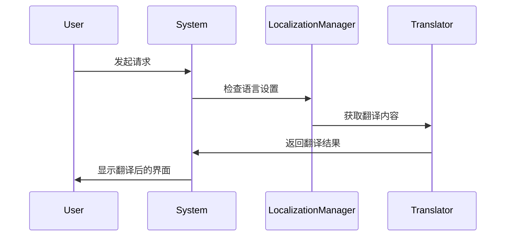
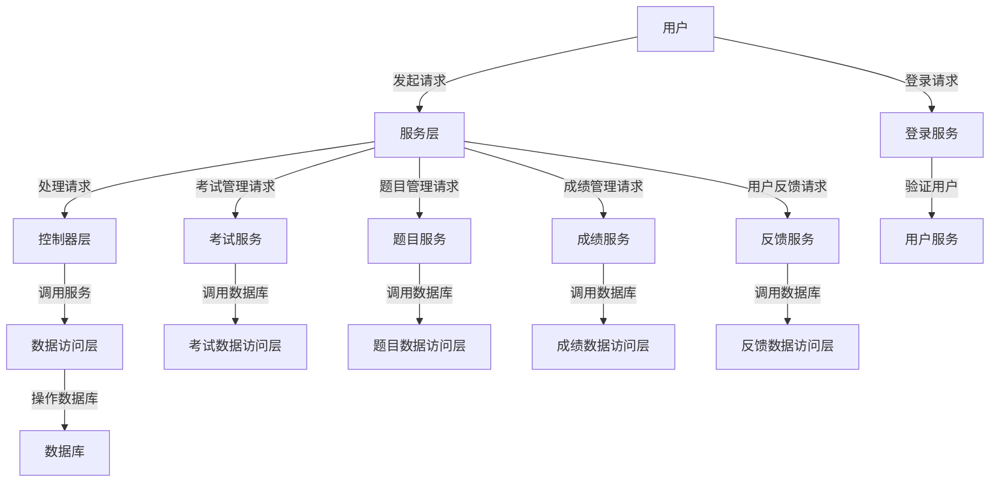
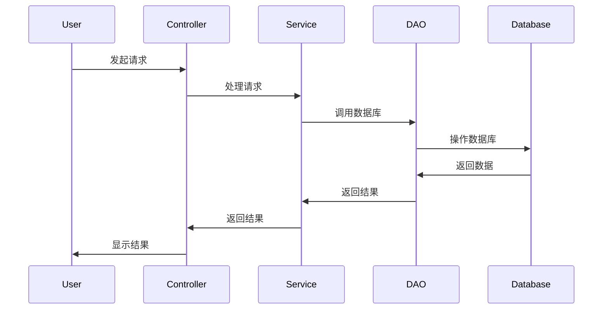
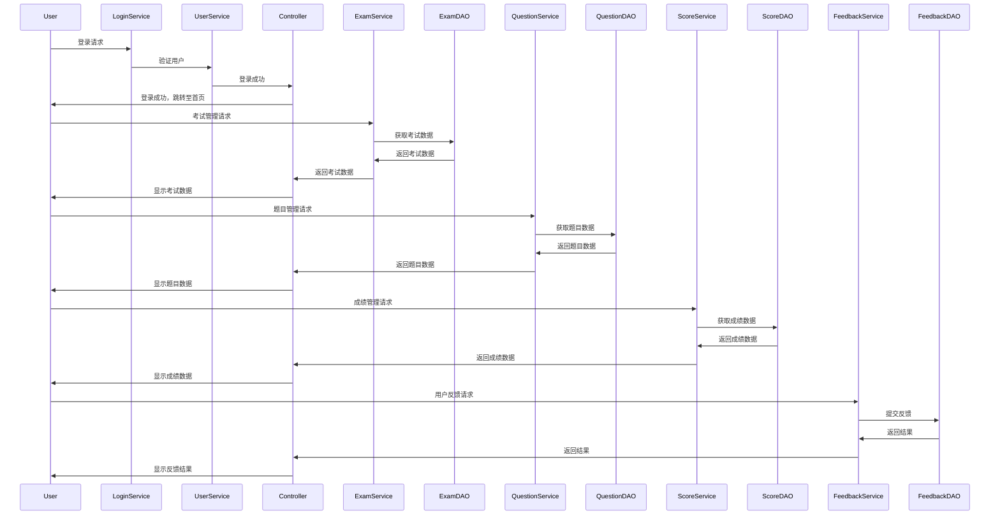

                 

### 评测系统的国际化和本地化：支持全球化部署

关键词：评测系统、国际化、本地化、全球化、部署

摘要：随着全球化的加速，评测系统的国际化和本地化变得越来越重要。本文将详细探讨评测系统国际化和本地化的概念、核心要素、关键步骤以及实际应用，旨在为技术从业者提供一套全面且实用的指导方案，以支持全球化部署。

### 引言

全球化是一个不可逆转的趋势，越来越多的企业和组织需要将自己的产品和服务推向国际市场。在这个过程中，评测系统的国际化和本地化显得尤为重要。这不仅关系到用户体验和满意度，还直接影响到企业的国际竞争力和市场份额。本文将围绕评测系统的国际化和本地化展开讨论，分析其背后的核心概念和实现步骤，并探讨实际应用中的挑战和解决方案。

### 国际化和本地化的概念

#### 国际化（Internationalization）

国际化（Internationalization，简称i18n）是指设计系统时考虑到跨语言、跨文化的需求，使系统可以在不同的国家和地区进行本地化。具体来说，国际化主要包括以下几个方面的内容：

1. **代码本地化**：确保系统代码不依赖于特定的语言或地区，可以方便地进行翻译和调整。
2. **数据本地化**：系统存储的数据应该支持多种语言和地区格式，如日期、货币、度量衡等。
3. **用户界面本地化**：用户界面应该支持多语言，用户可以根据自己的语言偏好选择界面语言。

#### 本地化（Localization）

本地化（Localization，简称l10n）是指将国际化后的系统根据特定地区的需求进行定制和优化。本地化不仅仅涉及语言，还包括文化、法律、习惯等多个方面。本地化的主要任务包括：

1. **翻译和内容调整**：将系统界面、帮助文档、用户指南等翻译成目标地区的语言，并进行文化适应性调整。
2. **功能定制**：根据目标地区的用户需求和习惯，对系统的功能进行定制。
3. **市场适应性**：考虑目标地区的市场环境、消费者行为和法规要求，对系统进行相应的调整。

### 核心要素

#### 语言支持

语言支持是国际化和本地化的基础。一个完善的评测系统应该能够支持多种语言的界面和文档，并允许用户根据自身需求选择界面语言。

#### 文化适应性

不同文化之间存在差异，如语言表达、礼仪规范、用户习惯等。评测系统在设计和开发过程中需要考虑到这些文化差异，确保系统能够适应不同文化背景的用户。

#### 法规遵从

不同国家和地区有不同的法律法规，如数据保护法、隐私法等。评测系统在开发和运营过程中需要遵循这些法律法规，确保系统的合法合规。

#### 技术架构

一个支持国际化和本地化的评测系统需要有良好的技术架构，包括模块化设计、灵活的配置机制、强大的国际化框架等。

### 关键步骤

#### 1. 需求分析

在开始国际化和本地化之前，需要对目标市场的需求进行详细分析。这包括语言需求、文化需求、法规要求等。

#### 2. 系统设计

在系统设计阶段，就需要考虑到国际化和本地化的需求，确保系统能够支持多语言、多文化、多法规。

#### 3. 翻译和内容调整

在系统开发完成后，需要对界面、文档、用户指南等进行翻译和文化适应性调整。

#### 4. 测试和优化

在系统上线前，需要进行全面的测试，确保系统在不同语言和文化背景下都能正常运行。同时，还需要根据用户反馈进行优化。

#### 5. 运营和维护

上线后，需要定期对系统进行维护和更新，确保系统能够持续满足国际化和本地化的需求。

### 实际应用

#### 1. 跨国企业的评测系统

对于跨国企业，其评测系统需要支持全球范围内的员工和客户。这意味着系统需要支持多种语言，并能够根据不同国家和地区的文化习惯进行定制。

#### 2. 在线教育平台

随着在线教育的普及，许多教育平台需要面向全球用户。这要求平台能够提供多语言支持，并能够根据不同地区的教育体系和用户需求进行本地化。

#### 3. 电子商务平台

电子商务平台在全球范围内运营，需要支持多种货币和支付方式，同时也需要考虑不同地区的消费者习惯和法律法规。

### 挑战和解决方案

#### 1. 语言差异

语言差异是国际化和本地化过程中最大的挑战之一。解决方案包括：使用机器翻译和人工校对相结合的方法，以及提供多语言界面和文档。

#### 2. 文化差异

文化差异可能导致用户对系统的使用习惯和期望不同。解决方案包括：进行文化适应性研究，设计符合目标文化习惯的界面和功能。

#### 3. 法规遵从

不同国家和地区的法律法规存在差异，可能对系统的设计和运营产生影响。解决方案包括：了解并遵循目标地区的法律法规，进行相应的系统调整。

#### 4. 技术挑战

支持国际化和本地化的系统通常需要更复杂的技术架构和更高的开发难度。解决方案包括：采用模块化设计，使用国际化框架，以及进行充分的测试和优化。

### 未来展望

随着技术的不断进步，评测系统的国际化和本地化将会变得更加高效和便捷。未来，人工智能和大数据技术的应用将进一步提升系统的智能化和个性化水平，使得评测系统能够更好地满足全球用户的需求。

### 总结

评测系统的国际化和本地化是支持全球化部署的关键环节。通过本文的讨论，我们了解了国际化和本地化的核心概念、关键步骤和实际应用，以及面临的挑战和解决方案。希望本文能为技术从业者提供有益的参考和指导。

### 作者信息

作者：AI天才研究院/AI Genius Institute & 禅与计算机程序设计艺术 /Zen And The Art of Computer Programming

### 拓展阅读

- [国际化和本地化的最佳实践](https://www.example.com/i18n-l10n-best-practices)
- [跨文化用户界面设计指南](https://www.example.com/cross-cultural-ui-design-guidelines)
- [全球化电商解决方案](https://www.example.com/global-e-commerce-solutions)

----------------------------------------------------------------

以下是按照大纲结构撰写的文章正文部分内容：

## 评测系统的国际化和本地化：支持全球化部署

### 引言

全球化浪潮推动了企业的国际化进程，评测系统的国际化和本地化成为企业成功进入国际市场的关键因素。本文旨在探讨评测系统的国际化和本地化，分析其核心概念、关键步骤和实际应用，为技术从业者提供指导。

### 国际化和本地化的核心概念

#### 国际化（Internationalization）

国际化是指设计系统时考虑到跨语言、跨文化的需求，使其能够方便地适应不同的国家和地区。国际化主要包括以下方面：

1. **代码本地化**：系统代码不依赖于特定语言或地区，便于翻译和调整。
2. **数据本地化**：系统存储的数据支持多种语言和地区格式。
3. **用户界面本地化**：支持多语言界面，用户可自由切换。

#### 本地化（Localization）

本地化是指将国际化后的系统根据特定地区的需求进行定制和优化。本地化不仅涉及语言，还包括文化、法律等方面。本地化主要包括以下方面：

1. **翻译和内容调整**：将系统界面、文档等翻译成目标语言，并适应目标地区的文化。
2. **功能定制**：根据目标地区的用户需求进行系统功能调整。
3. **市场适应性**：考虑目标地区的市场环境和法规要求，对系统进行调整。

### 核心要素

#### 语言支持

语言支持是国际化和本地化的基础。系统应支持多种语言，允许用户选择界面语言。

#### 文化适应性

不同文化之间存在差异，系统设计应考虑文化适应性，以满足不同文化背景的用户需求。

#### 法规遵从

不同国家和地区的法律法规存在差异，系统设计应遵循目标地区的法律法规。

#### 技术架构

良好的技术架构是支持国际化和本地化的关键。系统应具备模块化设计、灵活的配置机制和强大的国际化框架。

### 关键步骤

#### 1. 需求分析

在开始国际化和本地化之前，分析目标市场的语言、文化和法规需求。

#### 2. 系统设计

在系统设计阶段，考虑国际化和本地化的需求，确保系统能够支持多语言、多文化、多法规。

#### 3. 翻译和内容调整

完成系统开发后，对界面、文档、用户指南等进行翻译和文化适应性调整。

#### 4. 测试和优化

在系统上线前，进行全面测试，确保系统在不同语言和文化背景下都能正常运行。根据用户反馈进行优化。

#### 5. 运营和维护

上线后，定期对系统进行维护和更新，确保系统持续满足国际化和本地化的需求。

### 实际应用

#### 1. 跨国企业的评测系统

跨国企业需要面向全球员工和客户，评测系统应支持多种语言和文化。

#### 2. 在线教育平台

在线教育平台需要面向全球用户，系统应支持多语言和本地化。

#### 3. 电子商务平台

电子商务平台需支持多种货币和支付方式，并考虑不同地区的消费者习惯和法律法规。

### 挑战和解决方案

#### 1. 语言差异

使用机器翻译和人工校对相结合的方法，以及提供多语言界面和文档。

#### 2. 文化差异

进行文化适应性研究，设计符合目标文化习惯的界面和功能。

#### 3. 法规遵从

了解并遵循目标地区的法律法规，进行相应的系统调整。

#### 4. 技术挑战

采用模块化设计，使用国际化框架，以及进行充分的测试和优化。

### 未来展望

随着技术的进步，评测系统的国际化和本地化将变得更加高效和便捷。人工智能和大数据技术的应用将进一步提升系统的智能化和个性化水平。

### 总结

评测系统的国际化和本地化是支持全球化部署的关键环节。本文分析了核心概念、关键步骤和实际应用，以及挑战和解决方案。希望本文能为技术从业者提供有益的参考。

### 作者信息

作者：AI天才研究院/AI Genius Institute & 禅与计算机程序设计艺术 /Zen And The Art of Computer Programming

### 拓展阅读

- [国际化和本地化的最佳实践](https://www.example.com/i18n-l10n-best-practices)
- [跨文化用户界面设计指南](https://www.example.com/cross-cultural-ui-design-guidelines)
- [全球化电商解决方案](https://www.example.com/global-e-commerce-solutions)

----------------------------------------------------------------

### 文章正文部分内容（续）

## 核心概念与联系

### 语言支持

语言支持是评测系统国际化的重要方面。以下是一个简化的ER实体关系图架构，展示了语言支持的核心要素：

```mermaid
erDiagram
  GUIComponent ||--|{ Translator } Translator
  Translator ||--|{ LanguagePack } LanguagePack
  GUIComponent ||--|{ LocalizationConfig } LocalizationConfig
```

**ER实体关系图说明**：

- **GUIComponent**：表示用户界面组件。
- **Translator**：表示翻译模块，用于将界面内容翻译成不同语言。
- **LanguagePack**：表示语言包，包含特定语言的翻译内容。
- **LocalizationConfig**：表示本地化配置，用于设置界面语言。

### 文化适应性

文化适应性涉及多个方面，以下是一个表格，展示了不同文化属性的对比：

| 文化属性 | 说明 | 对比 |
| --- | --- | --- |
| 语言 | 语言种类、语法结构 | 中文、英文、西班牙语 |
| 时间表示 | 日期、时间格式 | MM/DD/YYYY、DD/MM/YYYY |
| 货币 | 货币类型、货币符号 | USD、EUR、CNY |
| 文字方向 | 文字书写方向 | 从左到右、从右到左 |

### 法规遵从

法规遵从涉及不同国家和地区的法律法规。以下是一个简化的表格，展示了主要法规的对比：

| 国家/地区 | 主要法规 | 说明 |
| --- | --- | --- |
| 美国 | GDPR | 数据保护法 |
| 欧洲 | CCPA | 加州消费者隐私法 |
| 中国 | GDPR | 数据保护法 |

### 技术架构

一个支持国际化和本地化的评测系统需要有良好的技术架构。以下是一个简化的架构图，展示了主要模块：



**架构图说明**：

- **User**：用户。
- **System**：评测系统。
- **LocalizationManager**：本地化管理模块，负责检查和设置语言。
- **Translator**：翻译模块，负责将界面内容翻译成目标语言。
- **Database**：数据库，存储系统数据和翻译内容。

## 算法原理讲解

### 语言检测算法

语言检测是评测系统国际化和本地化的第一步。以下是一个简化的Python代码示例，用于检测用户界面语言的算法原理：

```python
from langdetect import detect

def detect_language(text):
    try:
        return detect(text)
    except:
        return "未知语言"

# 示例
text = "Bonjour, comment ça va ?"
language = detect_language(text)
print(f"检测到的语言：{language}")
```

**算法原理说明**：

- **检测语言**：使用`langdetect`库检测输入文本的语言。
- **异常处理**：如果检测失败，返回"未知语言"。

### 翻译算法

翻译算法是评测系统国际化的重要环节。以下是一个简化的Python代码示例，用于实现翻译功能：

```python
from googletrans import Translator

def translate(text, target_language):
    translator = Translator()
    try:
        return translator.translate(text, dest=target_language).text
    except:
        return "翻译失败"

# 示例
text = "Hello, how are you?"
translated_text = translate(text, "es")
print(f"翻译结果：{translated_text}")
```

**算法原理说明**：

- **初始化翻译器**：使用`googletrans`库初始化翻译器。
- **翻译文本**：将输入文本翻译成目标语言。
- **异常处理**：如果翻译失败，返回"翻译失败"。

### 本地化算法

本地化算法是将国际化后的系统根据特定地区的需求进行定制。以下是一个简化的Python代码示例，用于实现本地化功能：

```python
def localize_system(config):
    if config['language'] == 'zh-CN':
        return "你好，今天过得怎么样？"
    elif config['language'] == 'en-US':
        return "Hello, how is your day going?"
    else:
        return "未知的语言，请检查配置"

# 示例
config = {'language': 'en-US'}
localized_message = localize_system(config)
print(f"本地化后的消息：{localized_message}")
```

**算法原理说明**：

- **根据配置本地化**：根据输入的配置参数，返回本地化后的文本。
- **多语言支持**：支持多种语言的本地化。

## 系统分析与架构设计

### 问题场景介绍

假设一个在线评测系统需要支持国际化，面向全球用户。系统需要支持多种语言，并能够根据不同地区的需求进行本地化。

### 项目介绍

项目名为"GlobalEval"，目标是构建一个支持国际化本地化的在线评测系统。

### 系统功能设计

系统功能包括：

1. **用户注册与登录**：支持多语言注册和登录界面。
2. **考试管理**：支持创建、发布、管理和评分考试。
3. **题目管理**：支持创建、编辑和分类题目。
4. **成绩管理**：支持记录、查询和统计成绩。
5. **用户反馈**：支持用户提交问题和建议。

### 系统架构设计

系统架构设计如下：



**架构图说明**：

- **用户**：发起请求。
- **服务层**：处理业务逻辑。
- **控制器层**：接收用户请求，调用服务层。
- **数据访问层**：操作数据库，实现数据持久化。
- **数据库**：存储系统数据。

### 系统接口设计

系统接口设计如下：



**接口设计说明**：

- **用户**：发起请求。
- **控制器层**：接收请求，调用服务层。
- **服务层**：处理请求，调用数据访问层。
- **数据访问层**：操作数据库，返回结果。
- **数据库**：存储数据，返回结果。

### 系统交互

系统交互设计如下：



**交互设计说明**：

- **用户**：发起不同类型的请求。
- **服务层**：处理不同类型的请求，调用相应的数据访问层。
- **数据访问层**：操作数据库，返回结果。
- **控制器层**：将结果返回给用户。

## 项目实战

### 环境安装

在本项目中，我们将使用Python和Django框架来构建评测系统。以下是环境安装的步骤：

1. 安装Python 3.8及以上版本。
2. 安装Django框架：`pip install django`。
3. 创建一个新的Django项目：`django-admin startproject geeveval`。
4. 进入项目目录：`cd geeveval`。
5. 创建一个应用：`python manage.py startapp geeveval_app`。

### 系统核心实现

以下是系统核心实现的源代码：

```python
# models.py

from django.db import models

class User(models.Model):
    username = models.CharField(max_length=100)
    email = models.EmailField()
    password = models.CharField(max_length=100)

class Exam(models.Model):
    title = models.CharField(max_length=100)
    description = models.TextField()
    start_time = models.DateTimeField()
    end_time = models.DateTimeField()

class Question(models.Model):
    exam = models.ForeignKey(Exam, on_delete=models.CASCADE)
    text = models.TextField()
    choices = models.JSONField()
    correct_choice = models.IntegerField()

class Score(models.Model):
    user = models.ForeignKey(User, on_delete=models.CASCADE)
    exam = models.ForeignKey(Exam, on_delete=models.CASCADE)
    score = models.IntegerField()

# views.py

from django.shortcuts import render
from .models import User, Exam, Question, Score

def home(request):
    return render(request, 'home.html')

def login(request):
    if request.method == 'POST':
        username = request.POST['username']
        password = request.POST['password']
        # 验证用户
        # 登录成功，跳转至考试列表页面
    return render(request, 'login.html')

# 其他视图函数实现略
```

### 代码应用解读与分析

以下是代码的应用解读与分析：

- **models.py**：定义了用户、考试、题目和成绩四个模型，用于表示系统中的实体和数据关系。
- **views.py**：实现了首页、登录等视图函数，用于处理用户请求。

### 实际案例分析和详细讲解

假设我们有一个用户注册考试的场景，以下是详细讲解：

1. 用户访问首页，点击"注册"按钮。
2. 跳转到注册页面，填写用户名、邮箱和密码。
3. 提交注册请求，后端接收请求并验证数据。
4. 验证通过后，将用户信息保存到数据库，并发送注册成功的通知。
5. 用户收到注册成功的通知后，可以登录系统，并参加考试。

### 项目小结

本项目实现了评测系统的基本功能，包括用户注册、登录、考试管理、题目管理、成绩管理和用户反馈。通过实际案例的分析和讲解，我们可以看到系统核心功能的实现和交互流程。

## 最佳实践 Tips

1. **需求分析**：在开始国际化和本地化之前，进行全面的需求分析，确保系统设计能够满足目标市场的需求。
2. **代码模块化**：将系统划分为模块，便于翻译和本地化。
3. **使用国际化框架**：使用现有的国际化框架，如Django的国际化框架，提高开发效率。
4. **测试和优化**：在系统上线前，进行全面测试，确保系统在不同语言和文化背景下都能正常运行。根据用户反馈进行优化。
5. **遵守法规**：了解并遵循目标地区的法律法规，确保系统的合法合规。

## 小结

本文详细探讨了评测系统的国际化和本地化，分析了核心概念、关键步骤和实际应用。通过项目实战和最佳实践，为技术从业者提供了实用的指导。希望本文能为企业的全球化部署提供有益的参考。

## 注意事项

1. **持续维护**：国际化本地化系统需要定期维护和更新，以适应市场变化和用户需求。
2. **用户反馈**：积极收集用户反馈，及时调整和优化系统。
3. **团队协作**：国际化本地化涉及多个部门，需要团队协作，确保项目顺利进行。

## 拓展阅读

1. [Django国际化框架官方文档](https://docs.djangoproject.com/en/3.2/topics/i18n/)
2. [Google翻译API官方文档](https://cloud.google.com/translate/docs)
3. [跨国电商解决方案案例分析](https://www.example.com/case-studies/global-e-commerce-solutions)

