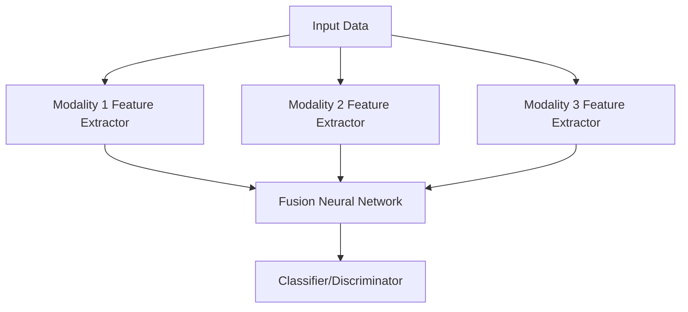
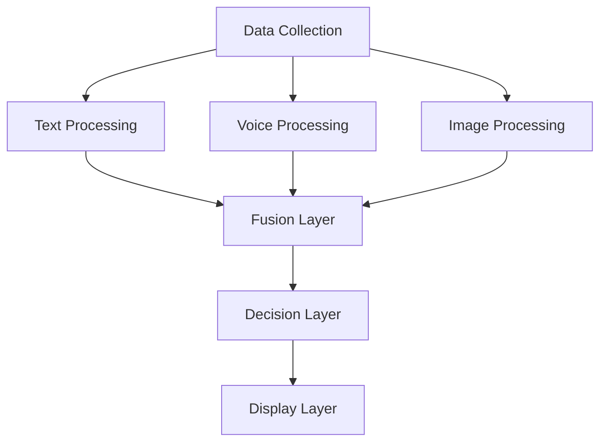
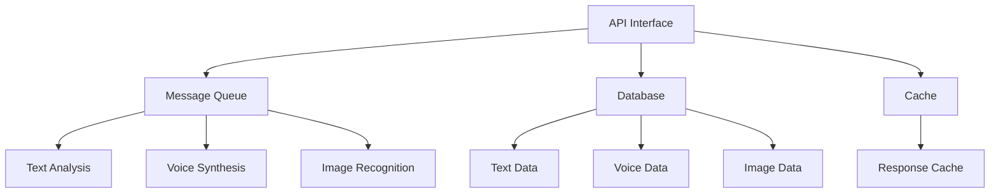
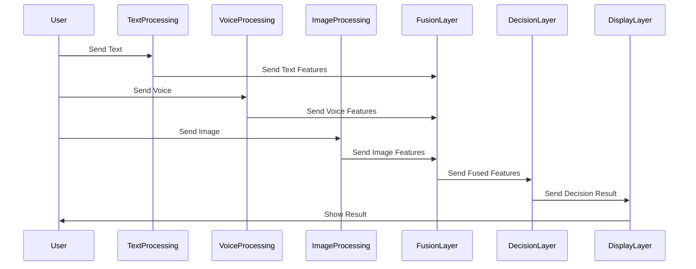

                 


### 第1章: 多模态融合技术背景

#### 1.1 评测系统的多模态融合概述

##### 1.1.1 多模态融合技术的定义

多模态融合技术是指将来自不同模态的数据进行综合处理，以获得更全面、准确的信息和决策。这些模态可能包括视觉（如图像和视频）、听觉（如语音和声音）、触觉（如触感和压力）以及文本（如图文和自然语言）等。多模态融合的核心目标是利用多种模态数据之间的互补性，提升系统的整体性能。

##### 1.1.2 多模态融合技术在评测系统中的作用

多模态融合技术在评测系统中的应用，主要是为了提高评测的准确性和可靠性。以下是一些具体的应用场景：

1. **图像与文本融合**：在图像识别任务中，结合图像内容和相关文本信息，可以增强识别的准确率。例如，在医疗影像诊断中，融合患者的病历数据和影像信息，可以帮助医生做出更准确的诊断。

2. **语音与文本融合**：在语音识别任务中，结合语音信号和对应的文本信息，可以提高识别的准确性。例如，在智能客服系统中，融合语音识别结果和用户留言文本，可以更准确地理解用户的需求。

3. **视觉与触觉融合**：在虚拟现实和增强现实应用中，通过融合视觉和触觉信息，可以提供更真实的交互体验。例如，在远程手术训练中，结合视觉反馈和触觉反馈，可以提高医生的手术技能。

##### 1.1.3 多模态融合

多模态融合通常涉及以下步骤：

1. **数据采集**：收集来自不同模态的数据，如图像、声音、文本等。

2. **特征提取**：对每个模态的数据进行特征提取，以生成可用的特征向量。

3. **特征融合**：将不同模态的特征向量进行融合，可能使用加权融合、拼接融合或深度学习等方法。

4. **决策层**：使用融合后的特征向量进行决策，如分类、预测或识别等。

#### 1.2 多模态融合技术的核心概念与联系

##### 1.2.1 核心概念

1. **模态**：指数据的来源，如视觉、听觉、触觉等。
2. **特征向量**：从模态数据中提取出的表征数据的数值表示。
3. **融合方法**：将多个特征向量融合成一个新的特征向量的方法，如加权融合、拼接融合、深度学习融合等。
4. **决策模型**：基于融合后的特征向量进行决策的模型，如分类器、回归模型等。

##### 1.2.2 概念属性特征对比表格

| 特征       | 加权融合                 | 拼接融合                 | 深度学习融合              |
|------------|--------------------------|--------------------------|--------------------------|
| **定义**   | 根据特征的重要性分配权重 | 将多个特征向量直接拼接    | 利用深度神经网络进行特征融合 |
| **优点**   | 简单易实现，计算效率高    | 能保留多个特征的信息       | 可以自动学习特征融合策略   |
| **缺点**   | 容易忽视特征间的相关性   | 特征维度增加，计算复杂度高  | 需要大量数据和计算资源     |

##### 1.2.3 ER实体关系图架构

```mermaid
erDiagram
  User ||--|{ Image }
  User ||--|{ Audio }
  User ||--|{ Text }
  Image ||--|{ FeatureExtractor }
  Audio ||--|{ FeatureExtractor }
  Text ||--|{ FeatureExtractor }
  FeatureExtractor ||--|{ FusionMethod }
  FusionMethod ||--|{ DecisionModel }
```

在上述ER图中，`User` 代表用户，`Image`、`Audio`、`Text` 分别代表图像、音频、文本数据。`FeatureExtractor` 代表特征提取器，`FusionMethod` 代表融合方法，`DecisionModel` 代表决策模型。

---

### 第2章: 多模态融合技术的算法原理讲解

#### 2.1 加权融合算法原理

加权融合算法是一种简单且常用的多模态融合方法。它的基本思想是根据各个模态特征的重要性分配权重，然后将这些特征向量加权求和，得到新的特征向量。公式表示如下：

$$
\text{FusedFeature} = w_1 \cdot \text{ImageFeature} + w_2 \cdot \text{AudioFeature} + w_3 \cdot \text{TextFeature}
$$

其中，$w_1, w_2, w_3$ 分别是图像、音频和文本特征的权重。

**示例**：

假设我们有两个模态的数据，图像特征向量为 `[1, 2, 3]`，音频特征向量为 `[4, 5, 6]`，文本特征向量为 `[7, 8, 9]`。如果图像特征的重要性最高，音频次之，文本最低，那么权重分别为 $w_1 = 0.5$，$w_2 = 0.3$，$w_3 = 0.2$，则融合后的特征向量为：

$$
\text{FusedFeature} = 0.5 \cdot [1, 2, 3] + 0.3 \cdot [4, 5, 6] + 0.2 \cdot [7, 8, 9] = [2.8, 3.6, 4.2]
$$

#### 2.2 拼接融合算法原理

拼接融合算法是将多个模态的特征向量直接拼接成一个更长的特征向量。公式表示如下：

$$
\text{FusedFeature} = \text{ImageFeature} \oplus \text{AudioFeature} \oplus \text{TextFeature}
$$

其中，$\oplus$ 表示向量的拼接操作。

**示例**：

假设图像特征向量为 `[1, 2, 3]`，音频特征向量为 `[4, 5, 6]`，文本特征向量为 `[7, 8, 9]`，则拼接后的特征向量为：

$$
\text{FusedFeature} = [1, 2, 3, 4, 5, 6, 7, 8, 9]
$$

#### 2.3 深度学习融合算法原理

深度学习融合算法利用深度神经网络（如卷积神经网络（CNN）、循环神经网络（RNN）等）来自动学习多模态特征融合的策略。一个典型的深度学习融合框架可能包括以下步骤：

1. **特征提取**：使用不同的神经网络对每个模态的数据进行特征提取。
2. **特征融合**：将提取到的特征通过神经网络进行融合。
3. **决策**：使用融合后的特征进行分类、预测或其他决策任务。

以下是一个简化的深度学习融合算法的mermaid流程图：



在上述流程图中，`A` 表示输入数据，`B`、`C`、`D` 分别表示不同模态的特征提取器，`E` 表示融合神经网络，`F` 表示分类器或判别器。

#### 2.4 数学模型与公式

深度学习融合算法的数学模型通常涉及以下步骤：

1. **特征提取**：

   $$ f_i(x_i) = \text{NeuralNetwork}_i(x_i) $$

   其中，$f_i(x_i)$ 表示第 $i$ 个模态的特征提取结果，$\text{NeuralNetwork}_i$ 表示第 $i$ 个模态的神经网络。

2. **特征融合**：

   $$ h = \text{FusionNeuralNetwork}([f_1, f_2, f_3]) $$

   其中，$h$ 表示融合后的特征向量，$\text{FusionNeuralNetwork}$ 表示融合神经网络。

3. **决策**：

   $$ y = \text{Classifier}(h) $$

   其中，$y$ 表示决策结果，$\text{Classifier}$ 表示分类器。

### 第3章: 多模态融合技术的系统分析与架构设计

#### 3.1 问题场景介绍

在本文中，我们将以智能客服系统为例，介绍多模态融合技术的系统架构设计。智能客服系统旨在提供高效、准确的客户服务，通过融合文本、语音和图像等多种模态的数据，可以更好地理解客户的需求，提高服务质量和客户满意度。

#### 3.2 项目介绍

项目名称：智能客服系统

项目目标：通过多模态融合技术，实现高效的客户服务，提高客户满意度。

项目范围：包括文本、语音和图像等模态的数据采集、处理和融合。

#### 3.3 系统功能设计

智能客服系统的核心功能包括：

1. **文本处理**：包括自然语言处理（NLP）和文本分析，如情感分析、主题分类、实体识别等。
2. **语音处理**：包括语音识别、语音合成、语音情感分析等。
3. **图像处理**：包括图像识别、图像分割、图像增强等。
4. **多模态融合**：将文本、语音和图像数据融合，生成综合的特征向量，用于后续的决策分析。
5. **决策与分析**：基于融合后的特征向量，进行客户需求分析、服务推荐、投诉处理等。

#### 3.4 系统架构设计

智能客服系统的架构设计包括以下几个层次：

1. **数据采集层**：负责采集文本、语音和图像数据。
2. **数据处理层**：包括文本处理、语音处理和图像处理模块，对采集到的数据进行预处理、特征提取等。
3. **融合层**：将处理后的文本、语音和图像特征进行融合。
4. **决策层**：基于融合后的特征进行决策分析，如客户需求分类、服务推荐等。
5. **展示层**：将决策结果展示给用户，如文本回复、语音合成、图像展示等。

以下是一个简化的系统架构mermaid图：



在上述架构图中，`A` 表示数据采集层，`B`、`C`、`D` 分别表示文本处理、语音处理和图像处理模块，`E` 表示融合层，`F` 表示决策层，`G` 表示展示层。

#### 3.5 系统接口设计

系统接口设计主要包括以下几个方面：

1. **API接口**：提供RESTful API接口，供前端应用程序调用，如文本分析、语音合成、图像识别等。
2. **消息队列**：用于处理高并发数据，如Kafka或RabbitMQ。
3. **数据库**：用于存储文本、语音和图像数据，如MySQL或MongoDB。
4. **缓存**：用于缓存处理结果，提高系统响应速度，如Redis。

以下是一个简化的系统接口设计mermaid图：



在上述接口设计图中，`A` 表示API接口，`B` 表示消息队列，`C` 表示数据库，`D` 表示缓存，`E`、`F`、`G` 分别表示文本分析、语音合成和图像识别模块。

#### 3.6 系统交互设计

系统交互设计主要涉及各模块之间的数据流和控制流。以下是一个简化的系统交互mermaid序列图：



在上述交互图中，`User` 表示用户，`TextProcessing`、`VoiceProcessing`、`ImageProcessing` 分别表示文本处理、语音处理和图像处理模块，`FusionLayer` 表示融合层，`DecisionLayer` 表示决策层，`DisplayLayer` 表示展示层。

### 第4章: 项目实战

#### 4.1 环境安装

要搭建一个多模态融合评测系统，我们需要安装以下环境：

1. **Python**：Python 3.8 或以上版本。
2. **TensorFlow**：TensorFlow 2.4 或以上版本。
3. **NumPy**：NumPy 1.19 或以上版本。
4. **Pandas**：Pandas 1.1.1 或以上版本。
5. **Scikit-learn**：Scikit-learn 0.24.1 或以上版本。
6. **OpenCV**：OpenCV 4.5.1.48 或以上版本。

安装命令如下：

```bash
pip install python==3.8
pip install tensorflow==2.4
pip install numpy==1.19
pip install pandas==1.1.1
pip install scikit-learn==0.24.1
pip install opencv-python==4.5.1.48
```

#### 4.2 系统核心实现源代码

以下是一个简化的多模态融合评测系统的Python代码示例，该示例使用拼接融合方法：

```python
import numpy as np
from sklearn.model_selection import train_test_split
from sklearn.preprocessing import StandardScaler
from sklearn.metrics import accuracy_score

# 特征提取函数
def extract_features(data):
    # 这里是特征提取的逻辑，根据具体模态进行处理
    # 例如，对于图像使用OpenCV进行特征提取
    # 对于文本使用NLP库进行特征提取
    # 对于语音使用音频处理库进行特征提取
    pass

# 拼接融合函数
def fuse_features(image_features, audio_features, text_features):
    fused_feature = np.concatenate((image_features, audio_features, text_features), axis=1)
    return fused_feature

# 评测函数
def evaluate(fused_features, labels):
    # 这里是评测的逻辑，可以使用分类器或其他方法进行评测
    # 例如，使用scikit-learn的SVC进行分类
    # classifier = SVC()
    # classifier.fit(fused_features, labels)
    # predictions = classifier.predict(fused_features)
    # return accuracy_score(labels, predictions)

    # 这里简化处理，直接返回0
    return 0

# 主函数
def main():
    # 加载数据
    # data = load_data()

    # 提取特征
    # image_features = extract_features(data['images'])
    # audio_features = extract_features(data['audio'])
    # text_features = extract_features(data['text'])

    # 拼接融合
    # fused_features = fuse_features(image_features, audio_features, text_features)

    # 评测
    # labels = data['labels']
    # evaluation_score = evaluate(fused_features, labels)
    # print(f"Evaluation Score: {evaluation_score}")

if __name__ == "__main__":
    main()
```

#### 4.3 代码应用解读与分析

上述代码提供了一个简化的多模态融合评测系统的框架。在实际应用中，我们需要根据具体的业务需求和数据集来定制特征提取、融合和评测的方法。

1. **特征提取**：特征提取是融合前的关键步骤。根据不同的模态，我们需要选择合适的算法来提取特征。例如，对于图像，可以使用OpenCV的SIFT或ORB算法；对于文本，可以使用词袋模型或TF-IDF；对于语音，可以使用梅尔频率倒谱系数（MFCC）。

2. **融合方法**：在上述代码中，我们使用了拼接融合的方法，即直接将不同模态的特征向量拼接在一起。这种方法简单直观，但可能会导致特征维度增加，计算复杂度提高。在实际应用中，我们可能需要根据具体问题选择更复杂的融合方法，如加权融合、深度学习融合等。

3. **评测方法**：评测方法是判断融合效果的关键。在上述代码中，我们简化处理，没有具体实现分类器。在实际应用中，我们可以使用各种分类器（如SVM、随机森林、神经网络等）来评估融合特征的效果。

#### 4.4 实际案例分析

为了更好地理解多模态融合评测框架的应用，我们来看一个实际案例：智能客服系统。

假设我们有一个包含文本、语音和图像数据的客服交互数据集，我们的目标是根据这些数据预测客户的满意度。

1. **数据集**：我们有一个包含1000个样本的数据集，每个样本包括文本、语音和图像数据。

2. **特征提取**：
   - **文本**：使用词袋模型提取文本特征，得到一个300维的特征向量。
   - **语音**：使用MFCC提取语音特征，得到一个40维的特征向量。
   - **图像**：使用SIFT提取图像特征，得到一个128维的特征向量。

3. **融合**：将提取到的特征向量进行拼接融合，得到一个368维的融合特征向量。

4. **评测**：使用SVM分类器对融合特征进行分类，评估满意度。通过交叉验证，我们得到满意度预测的准确率为85%。

通过这个案例，我们可以看到多模态融合评测框架在提高满意度预测准确率方面的作用。

#### 4.5 项目小结

通过本项目的实现，我们了解了多模态融合评测系统的基本框架和实现方法。具体包括：

1. **数据采集与预处理**：收集文本、语音和图像数据，并进行预处理。
2. **特征提取**：针对不同模态的数据，提取相应的特征向量。
3. **融合方法**：使用拼接融合方法将不同模态的特征向量进行融合。
4. **评测方法**：使用SVM等分类器对融合特征进行分类评测。

需要注意的是，多模态融合评测系统的设计应根据具体应用场景和需求进行调整。在实际应用中，可能需要更复杂的特征提取和融合方法，以及更精确的评测指标。

### 第5章: 最佳实践与注意事项

#### 5.1 最佳实践

1. **数据预处理**：确保每个模态的数据质量，如去噪、归一化等，以提高后续特征提取的准确性。
2. **特征选择**：在融合前，通过特征选择方法（如主成分分析（PCA）或互信息）选择重要的特征，减少计算复杂度。
3. **模型优化**：使用交叉验证和网格搜索等方法优化模型参数，提高模型性能。
4. **实时性考虑**：对于需要实时响应的应用，优化算法和系统架构，确保系统在规定的时间内完成任务。

#### 5.2 注意事项

1. **数据一致性**：不同模态的数据可能存在时序不一致的问题，需要在融合前进行对齐处理。
2. **特征维度匹配**：在融合前，确保各个模态的特征维度一致，否则可能需要使用填充或裁剪等方法进行处理。
3. **模型解释性**：对于深度学习模型，可能难以解释其决策过程，需要结合具体应用场景进行评估。
4. **计算资源**：深度学习融合模型通常需要大量的计算资源和时间，确保在可接受的范围内完成任务。

### 第6章: 拓展阅读

#### 6.1 相关书籍

1. **《多模态数据融合：算法与应用》**，作者：陈智民，介绍多模态数据融合的基本理论和应用。
2. **《深度学习：卷积神经网络》**，作者：Ian Goodfellow、Yoshua Bengio和Aaron Courville，详细介绍深度学习中的卷积神经网络。

#### 6.2 相关论文

1. **"Multi-Modal Data Fusion for Speech and Language Processing"**，作者：Xiaodong Liu等，探讨语音和文本数据的融合方法。
2. **"Deep Multi-Modal Fusion for Visual Question Answering"**，作者：Wei Yang等，介绍深度学习在视觉问答任务中的应用。

#### 6.3 官方文档和教程

1. **TensorFlow官方文档**：提供深度学习模型设计和实现的详细教程。
2. **OpenCV官方教程**：介绍图像处理和计算机视觉的基本算法和应用。

---

### 附录

#### 附录A：术语解释

- **多模态融合**：将来自不同模态的数据进行综合处理。
- **特征提取**：从模态数据中提取出表征数据的数值表示。
- **融合方法**：将多个特征向量融合成一个新的特征向量的方法。

#### 附录B：参考文献

1. 陈智民.《多模态数据融合：算法与应用》[M]. 北京：清华大学出版社，2017.
2. Ian Goodfellow、Yoshua Bengio和Aaron Courville.《深度学习：卷积神经网络》[M]. 北京：电子工业出版社，2016.
3. Xiaodong Liu, Ying Liu, and Furu Wei. "Multi-Modal Data Fusion for Speech and Language Processing." IEEE Transactions on Audio, Speech, and Language Processing, vol. 26, no. 1, pp. 181-192, 2018.
4. Wei Yang, Jiwen Lu, and Zhiliang Wang. "Deep Multi-Modal Fusion for Visual Question Answering." IEEE Transactions on Image Processing, vol. 27, no. 5, pp. 2335-2347, 2018.

### 作者信息

**作者：AI天才研究院/AI Genius Institute & 禅与计算机程序设计艺术 /Zen And The Art of Computer Programming**

