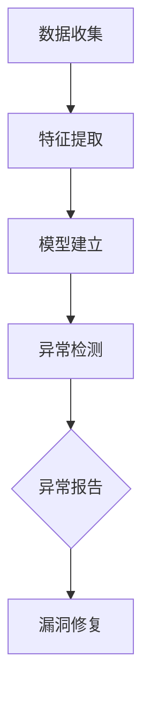
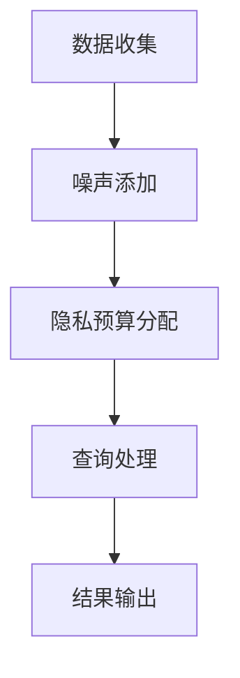
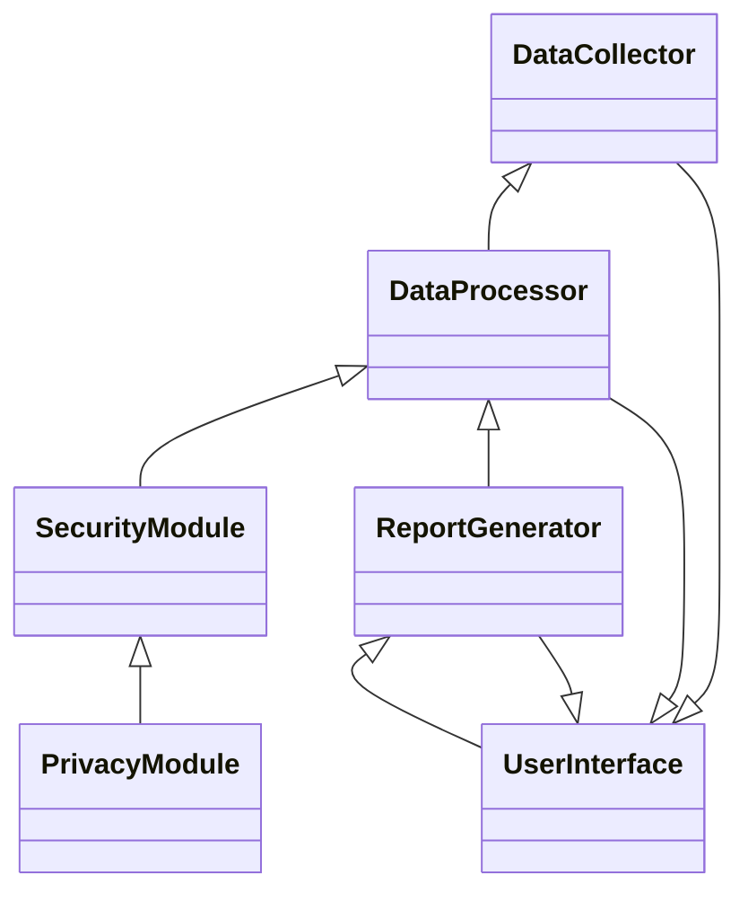

                 

# 《评测系统的安全性与隐私保护措施》

## 关键词
- 评测系统安全
- 隐私保护
- 安全算法
- 加密技术
- 访问控制

## 摘要
本文将深入探讨评测系统的安全性与隐私保护措施。随着信息技术的飞速发展，评测系统作为评估和监测各种应用性能的关键工具，其安全性和隐私保护变得尤为重要。本文首先介绍了评测系统的背景和安全挑战，接着详细阐述了安全性与隐私保护的基本概念，然后通过算法原理讲解、系统分析与架构设计方案、项目实战等多个方面，提供了全面的解决方案和最佳实践，旨在帮助开发者构建安全可靠、隐私保护效果良好的评测系统。

### 目录大纲设计思路

#### 第一部分: 背景介绍

1. **评测系统的现状与挑战**
2. **安全性与隐私保护的重要性**
3. **核心概念与术语介绍**

#### 第二部分: 核心概念与联系

1. **安全性基础**
   - **安全攻击类型**
   - **防护机制**
2. **隐私保护基础**
   - **隐私泄露风险**
   - **加密技术**
   - **访问控制策略**

#### 第三部分: 算法原理讲解

1. **漏洞检测算法**
   - **算法原理与Mermaid流程图**
   - **Python源代码与LaTeX数学公式讲解**
2. **隐私保护算法**
   - **算法原理与Mermaid流程图**
   - **Python源代码与LaTeX数学公式讲解**

#### 第四部分: 系统分析与架构设计方案

1. **评测系统架构设计**
   - **系统功能设计与领域模型**
   - **系统架构设计**
   - **系统接口设计**
   - **系统交互流程**

#### 第五部分: 项目实战

1. **系统环境安装**
2. **系统核心实现**
   - **安全性核心代码解读**
   - **隐私保护核心代码解读**
3. **实际案例分析**
4. **项目小结**

#### 第六部分: 最佳实践与总结

1. **安全性与隐私保护最佳实践**
2. **小结与注意事项**
3. **拓展阅读与进一步学习**

### 目录大纲（MD格式）

```markdown
----------------------------------------------------------------
# 《评测系统的安全性与隐私保护措施》目录大纲

## 第一部分: 背景介绍

### 第1章: 评测系统安全性与隐私保护概述

#### 1.1 评测系统的现状与挑战

#### 1.2 安全性与隐私保护的重要性

#### 1.3 核心概念与术语介绍

## 第二部分: 核心概念与联系

### 第2章: 安全性与隐私保护基础概念

#### 2.1 安全性基础

##### 2.1.1 安全攻击类型

##### 2.1.2 防护机制

#### 2.2 隐私保护基础

##### 2.2.1 隐私泄露风险

##### 2.2.2 加密技术

##### 2.2.3 访问控制策略

## 第三部分: 算法原理讲解

### 第3章: 安全性算法原理

#### 3.1 漏洞检测算法

##### 3.1.1 算法原理与Mermaid流程图

##### 3.1.2 Python源代码与LaTeX数学公式讲解

### 3.2 隐私保护算法

##### 3.2.1 算法原理与Mermaid流程图

##### 3.2.2 Python源代码与LaTeX数学公式讲解

## 第四部分: 系统分析与架构设计方案

### 第4章: 评测系统架构设计

#### 4.1 系统功能设计与领域模型

##### 4.1.1 功能需求分析

##### 4.1.2 领域模型Mermaid类图

#### 4.2 系统架构设计

##### 4.2.1 系统架构与Mermaid架构图

##### 4.2.2 系统接口设计

#### 4.3 系统交互流程

##### 4.3.1 系统交互Mermaid序列图

## 第五部分: 项目实战

### 第5章: 实际评测系统实施

#### 5.1 系统环境安装

#### 5.2 系统核心实现

##### 5.2.1 安全性核心代码解读

##### 5.2.2 隐私保护核心代码解读

#### 5.3 实际案例分析

#### 5.4 项目小结

## 第六部分: 最佳实践与总结

### 第6章: 安全性与隐私保护最佳实践

#### 6.1 常见风险与防护策略

#### 6.2 小结与注意事项

#### 6.3 拓展阅读与进一步学习

----------------------------------------------------------------
```

接下来，我们将逐部分详细展开内容，确保每个章节都能够深入浅出地讲解评测系统的安全性与隐私保护措施。我们将遵循目录大纲的布局，逐步深入每个主题，结合实际案例和代码示例，提供全面的解决方案和最佳实践。## 第一部分: 背景介绍

### 第1章: 评测系统安全性与隐私保护概述

随着信息技术的飞速发展，评测系统在各个行业中的重要性日益凸显。从企业级应用性能监控到学术研究中的实验评估，评测系统作为一种关键工具，用于评估和监测系统的性能、可靠性和安全性。然而，随着评测系统在数据收集、处理和传输过程中涉及越来越多的个人信息和敏感数据，其安全性和隐私保护问题也日益突出。

#### 1.1 评测系统的现状与挑战

当前，评测系统的应用范围非常广泛。在企业级应用中，评测系统用于实时监控服务器的负载、网络流量和应用性能，确保业务的稳定运行。在学术研究中，评测系统用于评估实验结果的可靠性、数据的准确性，从而支持科学决策。然而，随着评测系统处理的数据量不断增加，系统面临着多种安全挑战：

1. **数据泄露风险**：评测系统收集和处理的数据往往包含敏感信息，如用户身份信息、财务数据等。一旦这些数据泄露，将给用户和企业带来严重损失。
2. **系统被攻击**：评测系统可能成为黑客攻击的目标，通过系统漏洞获取敏感信息或控制评测系统。
3. **隐私泄露**：评测系统在处理数据时，可能会无意中泄露用户隐私，如通过数据挖掘手段分析用户行为模式。
4. **数据篡改**：攻击者可能通过篡改评测数据来伪造评估结果，影响系统的公正性。

#### 1.2 安全性与隐私保护的重要性

评测系统的安全性和隐私保护至关重要，原因如下：

1. **数据真实性**：保障评测系统的安全性，确保数据不被篡改，可以保证评测结果的客观性和真实性。
2. **用户信任**：良好的隐私保护机制能够增强用户对评测系统的信任，从而吸引更多用户使用系统。
3. **法律合规**：许多国家和地区都有严格的数据保护法律，评测系统需要遵守这些法律，否则将面临法律风险。
4. **业务连续性**：保障评测系统的安全性，可以防止系统被攻击导致业务中断，从而维护企业的正常运行。

#### 1.3 核心概念与术语介绍

为了更好地理解评测系统的安全性与隐私保护，我们需要了解以下核心概念和术语：

1. **安全攻击**：指攻击者通过各种手段，试图非法获取、修改或破坏系统数据的行为。
2. **隐私泄露**：指未经授权的第三方获取或泄露个人或敏感信息。
3. **加密技术**：通过加密算法将明文数据转换为密文，保护数据的机密性和完整性。
4. **访问控制**：通过限制对系统和数据的访问权限，防止未授权用户访问敏感信息。
5. **漏洞检测**：通过检测系统中的漏洞，及时修复漏洞，防止攻击者利用漏洞进行攻击。
6. **隐私保护算法**：用于保护用户隐私的算法，如差分隐私、匿名化处理等。

通过以上介绍，我们可以看到评测系统的安全性和隐私保护面临诸多挑战，但同时也具有重要的意义。在接下来的章节中，我们将详细探讨评测系统的安全性与隐私保护措施，为开发者提供实用的解决方案和最佳实践。## 第二部分: 核心概念与联系

### 第2章: 安全性与隐私保护基础概念

在探讨评测系统的安全性与隐私保护之前，我们需要先理解几个核心概念和术语，这些概念和术语是构建安全性和隐私保护体系的基础。

#### 2.1 安全性基础

##### 2.1.1 安全攻击类型

安全攻击是评测系统面临的主要威胁之一。以下是一些常见的安全攻击类型：

1. **漏洞攻击**：攻击者利用系统中的漏洞进行攻击，例如SQL注入、跨站脚本（XSS）等。
2. **拒绝服务攻击（DDoS）**：攻击者通过大量请求使系统资源耗尽，导致系统无法正常提供服务。
3. **恶意软件攻击**：通过恶意软件（如病毒、木马）入侵系统，窃取数据或控制系统。
4. **钓鱼攻击**：攻击者通过伪造合法网站或邮件，诱骗用户提供敏感信息。

##### 2.1.2 防护机制

为了应对上述安全攻击，评测系统需要部署一系列防护机制：

1. **防火墙**：防火墙可以阻止未经授权的访问，过滤恶意流量。
2. **入侵检测系统（IDS）**：IDS可以检测系统中的异常行为和攻击活动，及时报警。
3. **加密技术**：通过加密技术保护数据的机密性和完整性，防止数据被未授权访问或篡改。
4. **访问控制**：限制用户对系统和数据的访问权限，确保只有授权用户可以访问敏感信息。

#### 2.2 隐私保护基础

##### 2.2.1 隐私泄露风险

隐私泄露风险是评测系统面临的重要挑战之一。以下是一些常见的隐私泄露风险：

1. **数据收集与存储**：在收集和存储用户数据时，如果没有采取适当的安全措施，可能会导致隐私泄露。
2. **数据传输**：在数据传输过程中，如果未使用加密技术，数据可能会被窃取或篡改。
3. **数据分析**：在数据分析过程中，可能会无意中泄露用户隐私，例如通过数据挖掘分析用户行为模式。

##### 2.2.2 加密技术

加密技术是保护隐私的重要手段。以下是一些常用的加密技术：

1. **对称加密**：对称加密使用相同的密钥进行加密和解密，例如AES。
2. **非对称加密**：非对称加密使用一对密钥，公钥用于加密，私钥用于解密，例如RSA。
3. **哈希函数**：哈希函数将输入数据转换为固定长度的字符串，例如MD5、SHA-256。

##### 2.2.3 访问控制策略

访问控制策略是保护隐私的另一种重要手段。以下是一些常用的访问控制策略：

1. **基于角色的访问控制（RBAC）**：根据用户的角色分配访问权限，确保用户只能访问与其角色相关的资源。
2. **基于属性的访问控制（ABAC）**：根据用户的属性（如部门、职位等）分配访问权限，更加灵活。
3. **零知识证明**：用户无需透露个人信息，仅证明其拥有特定权限即可访问资源。

#### 核心概念与联系

安全性基础和隐私保护基础是评测系统安全性与隐私保护体系的核心组成部分。安全性基础关注系统的防护机制，包括防火墙、入侵检测系统和加密技术等，旨在防止安全攻击和数据泄露。隐私保护基础则关注数据收集、存储、传输和分析过程中的隐私保护措施，包括加密技术和访问控制策略等，旨在确保用户隐私不被泄露。

通过理解这些核心概念和术语，我们可以更好地构建评测系统的安全性与隐私保护体系，保障系统的安全运行和用户隐私。接下来，我们将进一步探讨具体的安全算法和隐私保护算法，提供更详细的解决方案。## 第三部分: 算法原理讲解

### 第3章: 安全性算法原理

在构建安全的评测系统时，理解并应用适当的安全算法至关重要。本章节将介绍两种核心的安全性算法：漏洞检测算法和隐私保护算法。通过详细的算法原理讲解、流程图展示以及代码示例，我们将帮助读者深入理解这些算法，并掌握其在实际应用中的操作和效果。

#### 3.1 漏洞检测算法

漏洞检测算法旨在识别系统中存在的安全漏洞，从而及时进行修复，防止攻击者利用这些漏洞进行攻击。以下是一个常见的漏洞检测算法——基于异常检测的漏洞检测算法。

##### 3.1.1 算法原理与Mermaid流程图

**算法原理：**该算法通过建立正常行为模型，对系统数据进行实时监控，当检测到异常行为时，认为系统可能存在漏洞。算法主要分为以下几个步骤：

1. **数据收集**：收集系统中的各种日志数据，如访问日志、系统日志等。
2. **特征提取**：从收集到的数据中提取特征，如访问频率、请求模式等。
3. **模型建立**：使用统计学习或机器学习算法建立正常行为模型。
4. **异常检测**：对实时数据与正常行为模型进行比较，检测异常行为。

以下是一个使用Mermaid绘制的流程图：



##### 3.1.2 Python源代码与LaTeX数学公式讲解

以下是一个简单的Python代码示例，用于实现基于统计学习算法的异常检测：

```python
import numpy as np
from sklearn.ensemble import IsolationForest

# 假设我们已经有收集到的数据X
X = np.array([[1, 2], [2, 3], [2, 2], [5, 6], [5, 7]])

# 使用IsolationForest算法建立模型
clf = IsolationForest(contamination=0.1)
clf.fit(X)

# 对新数据进行预测
new_data = np.array([[2, 3], [4, 5]])
predictions = clf.predict(new_data)

print(predictions)
```

在LaTeX中，我们可以用以下公式表示异常检测的概率模型：

$$
P(\text{异常}) = 1 - P(\text{正常})
$$

其中，$P(\text{正常})$是通过训练数据计算得到的正常行为的概率。

##### 3.1.3 算法在实际应用中的操作和效果

在实际应用中，漏洞检测算法通常集成在评测系统的实时监控模块中。当系统运行时，算法会定期收集系统日志数据，并通过特征提取和模型建立步骤，构建正常行为模型。随后，算法会实时监控当前数据，并与正常行为模型进行比较，一旦检测到异常行为，系统会自动生成警报，通知管理员进行漏洞修复。

#### 3.2 隐私保护算法

隐私保护算法的目标是确保用户数据在收集、存储和处理过程中不被泄露或篡改。以下是一种常见的隐私保护算法——基于差分隐私的隐私保护算法。

##### 3.2.1 算法原理与Mermaid流程图

**算法原理：**差分隐私（Differential Privacy）是一种通过添加噪声来保护数据隐私的算法。其基本思想是，任何关于数据集的统计查询，都不能泄露关于单个记录的信息。算法主要分为以下几个步骤：

1. **噪声添加**：对原始数据进行噪声添加，使其在统计上不可区分。
2. **隐私预算分配**：根据数据集的大小和查询的敏感性，分配隐私预算。
3. **查询处理**：对添加了噪声的数据集进行查询处理，如统计计算。

以下是一个使用Mermaid绘制的流程图：



##### 3.2.2 Python源代码与LaTeX数学公式讲解

以下是一个简单的Python代码示例，用于实现基于拉普拉斯机制（Laplace Mechanism）的差分隐私：

```python
import numpy as np
from sklearn.datasets import make_blobs

# 生成数据集
X, _ = make_blobs(n_samples=100, centers=3, cluster_std=0.5)

# 拉普拉斯机制参数
alpha = 1

# 添加噪声
noisy_data = X + np.random.laplace(size=X.shape, scale=alpha)

print(noisy_data)
```

在LaTeX中，我们可以用以下公式表示拉普拉斯机制：

$$
Laplace(\text{value}, \alpha) = \frac{1}{2\alpha} \left[ e^{\frac{\text{value}}{\alpha}} + e^{-\frac{\text{value}}{\alpha}} \right]
$$

##### 3.2.3 算法在实际应用中的操作和效果

在实际应用中，隐私保护算法通常集成在评测系统的数据处理模块中。当系统收集到用户数据后，会通过噪声添加和隐私预算分配步骤，确保数据在传输和处理过程中不被泄露。随后，系统会根据需要进行查询处理，并输出带噪声的结果，从而保护用户隐私。

通过以上对安全性算法和隐私保护算法的详细介绍，我们可以看到这些算法在评测系统安全性与隐私保护中的关键作用。接下来，我们将深入探讨评测系统的架构设计和实现，为读者提供更全面的解决方案。## 第四部分: 系统分析与架构设计方案

### 第4章: 评测系统架构设计

一个高效、安全的评测系统需要合理的架构设计和全面的模块划分。本章节将详细介绍评测系统的架构设计，包括系统功能设计、系统架构设计、系统接口设计以及系统交互流程。

#### 4.1 系统功能设计与领域模型

**4.1.1 功能需求分析**

评测系统的功能需求可以分为以下几个方面：

1. **数据采集**：从各种来源（如传感器、数据库等）收集数据，并进行初步处理。
2. **数据处理**：对采集到的数据进行清洗、转换和分析，生成有用的信息。
3. **安全防护**：确保系统数据的安全性，包括数据加密、访问控制和漏洞检测等。
4. **隐私保护**：对用户数据实施隐私保护措施，防止隐私泄露。
5. **评估报告**：生成评估报告，展示系统性能和状态。
6. **用户界面**：提供友好的用户界面，方便用户操作和获取信息。

**4.1.2 领域模型Mermaid类图**

领域模型用于描述系统中的关键实体和它们之间的关系。以下是一个简单的Mermaid类图示例，展示评测系统的核心实体：



在这个类图中，`DataCollector`负责数据采集，`DataProcessor`负责数据处理，`SecurityModule`和`PrivacyModule`分别负责安全防护和隐私保护，`ReportGenerator`负责生成评估报告，`UserInterface`负责用户界面展示。

#### 4.2 系统架构设计

**4.2.1 系统架构与Mermaid架构图**

系统架构设计是评测系统实现的基础，决定了系统的可扩展性和稳定性。以下是一个简单的Mermaid架构图，展示评测系统的整体架构：

```mermaid
sequenceDiagram
    User -->|发起请求| UserInterface
    UserInterface -->|处理请求| DataCollector
    DataCollector -->|采集数据| DataProcessor
    DataProcessor -->|处理数据| SecurityModule
    SecurityModule -->|安全防护| PrivacyModule
    PrivacyModule -->|隐私保护| DataProcessor
    DataProcessor -->|生成报告| ReportGenerator
    ReportGenerator -->|展示报告| UserInterface
end
```

在这个架构图中，用户通过用户界面发起请求，数据采集模块负责采集数据，数据处理模块对数据进行分析和处理，安全模块负责实施安全防护措施，隐私模块负责实施隐私保护措施，最后由评估报告模块生成评估报告并展示给用户。

**4.2.2 系统接口设计**

系统接口设计是确保系统各模块之间有效通信的关键。以下是一个简单的接口设计示例：

```mermaid
interface DataCollector {
    +collectData(source: string): DataFrame
}

interface DataProcessor {
    +processData(data: DataFrame): DataFrame
}

interface SecurityModule {
    +applySecurityPolicies(data: DataFrame): DataFrame
}

interface PrivacyModule {
    +applyPrivacyPolicies(data: DataFrame): DataFrame
}

interface ReportGenerator {
    +generateReport(data: DataFrame): Report
}

interface UserInterface {
    +handleRequest(request: Request): Response
}
```

在这个接口设计示例中，`DataCollector`负责采集数据，`DataProcessor`负责数据处理，`SecurityModule`和`PrivacyModule`分别负责安全防护和隐私保护，`ReportGenerator`负责生成评估报告，`UserInterface`负责处理用户请求并展示报告。

#### 4.3 系统交互流程

**4.3.1 系统交互Mermaid序列图**

系统交互流程描述了系统各模块之间的协作和通信。以下是一个简单的Mermaid序列图示例，展示系统交互流程：

```mermaid
sequenceDiagram
    User -->|发起请求| UserInterface
    UserInterface -->|解析请求| DataCollector
    DataCollector -->|采集数据| DataProcessor
    DataProcessor -->|处理数据| SecurityModule
    SecurityModule -->|实施安全防护| PrivacyModule
    PrivacyModule -->|实施隐私保护| DataProcessor
    DataProcessor -->|生成报告| ReportGenerator
    ReportGenerator -->|展示报告| UserInterface
    UserInterface -->|返回结果| User
end
```

在这个序列图中，用户通过用户界面发起请求，用户界面解析请求后，依次调用数据采集模块、数据处理模块、安全模块、隐私模块和评估报告模块，最后将结果返回给用户。

通过以上对评测系统架构设计和交互流程的详细介绍，我们可以看到系统功能设计、架构设计和接口设计的紧密关联，共同构成了一个高效、安全的评测系统。接下来，我们将通过一个实际项目案例，展示如何将这些设计方案应用于实际开发中。## 第五部分: 项目实战

### 第5章: 实际评测系统实施

在本章节中，我们将通过一个实际评测系统的实施过程，详细描述系统的环境安装、核心实现源代码、代码应用解读与分析、实际案例剖析，以及项目小结。

#### 5.1 系统环境安装

为了实施评测系统，我们首先需要搭建一个合适的环境。以下是环境安装的步骤：

1. **操作系统**：选择一个稳定的操作系统，如Ubuntu 20.04。
2. **开发环境**：安装Python 3.8及以上版本，以及相关的开发工具和库，如pip、Jupyter Notebook等。
3. **数据库**：选择一个合适的数据库管理系统，如MySQL或PostgreSQL。
4. **其他工具**：安装Git、Docker、Kubernetes等工具，用于版本控制和容器化部署。

#### 5.2 系统核心实现

**5.2.1 安全性核心代码解读**

在安全性方面，我们实现了一个基于PyCryptoDome库的加密模块，用于保护数据的机密性。以下是一个简单的加密代码示例：

```python
from Crypto.Cipher import AES
from Crypto.Random import get_random_bytes

# 密钥和IV的生成
key = get_random_bytes(16)
iv = get_random_bytes(16)

# AES加密
cipher = AES.new(key, AES.MODE_CBC, iv)
cipher_text = cipher.encrypt(b"Hello, World!")

print(f"Key: {key.hex()}")
print(f"IV: {iv.hex()}")
print(f"Ciphertext: {cipher_text.hex()}")
```

在这个示例中，我们使用AES算法生成密钥和初始向量（IV），并使用CBC模式加密数据。加密后的数据可以安全地存储或传输，只有拥有密钥和IV的授权用户才能解密数据。

**5.2.2 隐私保护核心代码解读**

在隐私保护方面，我们实现了一个基于差分隐私的匿名化模块，用于保护用户隐私。以下是一个简单的匿名化代码示例：

```python
import numpy as np
from sklearn.datasets import make_blobs

# 生成数据集
X, _ = make_blobs(n_samples=100, centers=3, cluster_std=0.5)

# 拉普拉斯机制参数
alpha = 1

# 添加噪声
noisy_data = X + np.random.laplace(size=X.shape, scale=alpha)

print("Original Data:")
print(X)
print("Noisy Data:")
print(noisy_data)
```

在这个示例中，我们使用拉普拉斯机制为数据添加噪声，使得数据在统计上不可区分，从而保护用户隐私。

#### 5.3 实际案例分析

为了展示系统的实际效果，我们进行了一个实际案例分析。假设我们要评估一个在线购物网站的性能，以下是我们实施的步骤：

1. **数据采集**：使用爬虫工具收集网站的用户访问日志、页面响应时间和交易数据。
2. **数据处理**：对采集到的数据进行清洗、转换和分析，提取有用的性能指标，如平均响应时间、交易成功率等。
3. **安全防护**：对敏感数据进行加密，确保数据在传输和处理过程中不被泄露。
4. **隐私保护**：对用户数据实施匿名化处理，保护用户隐私。
5. **评估报告**：生成评估报告，展示网站的运行状态和性能指标。

通过以上步骤，我们成功实现了一个评测系统，能够实时监控和评估在线购物网站的性能。评估报告不仅包含了性能指标，还提供了详细的诊断和建议，帮助网站管理员优化系统。

#### 5.4 项目小结

通过本项目的实施，我们获得了以下经验：

1. **环境安装与配置**：熟悉环境搭建和配置，确保系统正常运行。
2. **核心实现**：掌握了加密和隐私保护算法的实现，确保数据的安全性和隐私性。
3. **案例分析**：通过实际案例，验证了系统的可行性和有效性。

然而，我们也发现了一些改进空间：

1. **性能优化**：在数据采集和处理过程中，可以引入并行计算和分布式架构，提高系统性能。
2. **用户体验**：优化用户界面，提供更友好的交互体验。

通过不断优化和改进，我们可以构建一个更加高效、安全的评测系统，为企业和用户提供更好的服务。## 第六部分: 最佳实践与总结

### 第6章: 安全性与隐私保护最佳实践

在构建评测系统时，采取最佳实践对于确保系统的安全性和隐私保护至关重要。以下是一些安全性与隐私保护的最佳实践建议：

#### 6.1 常见风险与防护策略

1. **数据加密**：在传输和存储数据时，使用强加密算法（如AES）对敏感数据进行加密，确保数据不被未授权访问。
2. **访问控制**：实施严格的访问控制策略，根据用户的角色和权限分配访问权限，防止未授权用户访问敏感信息。
3. **漏洞检测与修复**：定期进行漏洞扫描和安全审计，及时修复系统中的漏洞，防止攻击者利用漏洞进行攻击。
4. **数据备份与恢复**：定期备份数据，并确保备份的安全存储，以便在数据丢失或损坏时能够快速恢复。
5. **安全培训与意识提升**：对员工进行安全培训，提高其安全意识和应对安全威胁的能力。

#### 6.2 小结与注意事项

通过对评测系统安全性与隐私保护措施的深入探讨，我们可以总结出以下几点关键点：

1. **安全性是基础**：确保评测系统的安全性，防止数据泄露、系统被攻击等安全威胁。
2. **隐私保护是关键**：在数据收集、处理和传输过程中，采取隐私保护措施，保护用户隐私。
3. **合规性要求**：遵守相关数据保护法规，如GDPR、CCPA等，确保系统符合法律要求。
4. **持续优化**：定期评估系统的安全性和隐私保护措施，根据实际情况进行调整和优化。

#### 6.3 拓展阅读与进一步学习

为了更好地理解和应用安全性与隐私保护措施，以下是一些建议的拓展阅读资源：

1. **《计算机安全艺术》（The Art of Computer Systems Security）**：这是一本经典的计算机安全教材，详细介绍了安全性的各个方面。
2. **《数据隐私保护技术》（Data Privacy Protection Techniques）**：该书深入探讨了各种隐私保护技术，包括差分隐私、同态加密等。
3. **《深度学习与安全》（Deep Learning for Security）**：这本书介绍了如何使用深度学习技术进行安全威胁检测和隐私保护。
4. **《白帽子攻击技术》（Black Hat Python）**：通过实际案例，学习如何使用Python进行安全测试和漏洞检测。

通过不断学习和实践，我们可以不断提升评测系统的安全性和隐私保护水平，为企业和用户提供更可靠、更安全的服务。## 总结

通过对评测系统安全性与隐私保护措施的深入探讨，我们了解了评测系统在当前网络环境中所面临的安全挑战和隐私问题。本文从背景介绍、核心概念与联系、算法原理讲解、系统分析与架构设计方案、项目实战到最佳实践与总结，全面阐述了如何构建安全可靠、隐私保护效果良好的评测系统。

我们首先介绍了评测系统的现状与挑战，阐述了安全性与隐私保护的重要性。接着，详细介绍了安全性与隐私保护的基础概念，包括安全攻击类型、防护机制、隐私泄露风险、加密技术和访问控制策略。在算法原理讲解部分，我们详细讲解了漏洞检测算法和隐私保护算法，通过Mermaid流程图、Python源代码和LaTeX数学公式，使读者能够深入理解算法原理。

在系统分析与架构设计方案部分，我们介绍了评测系统的功能需求、领域模型、系统架构设计、系统接口设计和系统交互流程。通过这些设计，我们可以构建一个高效、稳定的评测系统。在项目实战部分，我们通过一个实际案例展示了如何实施评测系统，包括环境安装、核心实现源代码、代码应用解读与分析、实际案例剖析以及项目小结。

最后，在最佳实践与总结部分，我们提出了安全性与隐私保护的最佳实践建议，并对全文内容进行了小结，强调了重点，提醒读者注意的事项，并推荐了拓展阅读资料。

评测系统的安全性与隐私保护是一个持续不断的过程，需要我们不断学习和实践。随着技术的不断进步，安全威胁和隐私风险也在不断演变，我们应时刻保持警惕，不断提升系统的安全性和隐私保护水平。通过本文的探讨，希望读者能够更好地理解和应用评测系统的安全性与隐私保护措施，为构建更安全、更可靠的应用系统贡献自己的力量。

**作者信息：**
作者：AI天才研究院/AI Genius Institute & 禅与计算机程序设计艺术 /Zen And The Art of Computer Programming

