                 


### 文章标题：评测系统的安全性考量：保护模型和数据隐私

#### 关键词：
- 评测系统
- 安全性考量
- 模型保护
- 数据隐私
- 保护措施

#### 摘要：
本文深入探讨了评测系统的安全性问题，重点分析了如何保护模型和数据隐私。通过详细阐述核心概念、数学模型、算法原理、系统架构和项目实战，为开发者和决策者提供了全面的解决方案和最佳实践。

### 第一部分：背景与概述

#### 第1章：问题背景与核心概念

##### 1.1 评测系统的现状

随着大数据和人工智能技术的快速发展，评测系统在各行各业中得到广泛应用。然而，评测系统的安全性问题日益凸显，特别是模型和数据隐私的保护需求。这个问题不仅关系到系统的正常运行，还可能对企业的核心资产造成严重威胁。

##### 1.2 安全性问题的重要性

评测系统的安全性问题主要包括模型被篡改、数据泄露、恶意攻击等。这些问题可能导致系统性能下降、数据丢失，甚至影响企业的声誉和客户信任。因此，确保评测系统的安全性至关重要。

##### 1.3 数据隐私保护的需求

数据隐私保护是评测系统安全性的核心问题之一。随着个人隐私保护意识的提高，企业需要采取措施保护用户数据，防止数据泄露。同时，遵守相关法律法规也是企业应尽的责任。

##### 1.4 核心概念与联系

本章将介绍评测系统、模型安全、数据隐私等核心概念，并分析它们之间的联系。这将有助于读者更好地理解评测系统的安全性问题。

#### 第2章：评测系统的核心概念

##### 2.1 评测系统的定义与组成

评测系统是指用于评估、分析和测试各类数据、模型和算法的软件系统。它通常由数据采集、数据处理、模型评估和结果输出等模块组成。

##### 2.2 模型安全的定义与属性

模型安全是指确保评测系统中的模型不受恶意攻击、篡改或窃取。模型安全的关键属性包括完整性、可用性和保密性。

##### 2.3 数据隐私的定义与挑战

数据隐私是指保护用户数据的隐私权，防止数据泄露和滥用。在评测系统中，数据隐私保护面临的主要挑战包括数据规模庞大、处理过程复杂和法律法规要求严格等。

##### 2.4 模型与数据隐私保护的联系

模型安全与数据隐私保护密切相关。一个安全的评测系统需要同时考虑模型保护和数据隐私保护，以确保系统的整体安全性。

### 第二部分：数学模型与算法原理

#### 第3章：评测系统的数学模型与算法原理

##### 3.1 模型安全的数学模型

模型安全通常涉及模型加密、混淆和完整性验证等技术。本章将介绍这些数学模型的基本原理。

##### 3.2 数据隐私保护的算法原理

数据隐私保护算法包括数据加密、匿名化和数据混淆等。这些算法通过在数据处理过程中引入噪声、掩盖真实数据和加密敏感信息，实现对数据隐私的保护。

##### 3.3 模型安全与数据隐私保护的关系

模型安全与数据隐私保护之间存在一定的关联。一个有效的评测系统需要同时采用模型安全和数据隐私保护技术，以提高系统的整体安全性。

##### 3.4 算法原理讲解与Mermaid流程图

本章将使用Mermaid流程图详细展示模型安全和数据隐私保护算法的原理，帮助读者更好地理解这些算法的实现过程。

### 第三部分：系统分析与架构设计方案

#### 第4章：数学模型和数学公式讲解

##### 4.1 数学模型的基本概念

本章将介绍数学模型的基本概念，包括变量、参数、函数和方程等。

##### 4.2 模型安全的数学公式

本章将介绍模型安全的数学公式，包括模型加密、混淆和完整性验证等方面的公式。

##### 4.3 数据隐私保护的数学公式

本章将介绍数据隐私保护的数学公式，包括数据加密、匿名化和数据混淆等方面的公式。

##### 4.4 公式讲解与举例说明

本章将通过具体例子，详细讲解模型安全和数据隐私保护公式，帮助读者更好地理解这些公式在实际应用中的意义。

#### 第5章：评测系统的系统分析与架构设计方案

##### 5.1 评测系统问题场景介绍

本章将介绍评测系统的应用场景，包括数据采集、数据处理、模型评估和结果输出等环节。

##### 5.2 系统功能设计

本章将介绍评测系统的功能设计，包括数据预处理、模型训练、模型评估和结果输出等模块。

##### 5.3 系统架构设计

本章将介绍评测系统的架构设计，包括系统模块、数据流和交互方式等。

##### 5.4 系统接口设计与交互

本章将介绍评测系统的接口设计和交互方式，包括API接口、数据流接口和用户界面等。

### 第四部分：项目实战与案例分析

#### 第6章：项目实战与案例分析

##### 6.1 环境安装与配置

本章将介绍评测系统的环境安装与配置，包括操作系统、编程语言和环境依赖等。

##### 6.2 系统核心实现源代码

本章将展示评测系统的核心实现源代码，包括数据预处理、模型训练、模型评估和结果输出等模块的代码。

##### 6.3 代码应用解读与分析

本章将对评测系统的核心代码进行解读和分析，帮助读者理解代码的实现原理和技巧。

##### 6.4 实际案例分析与讲解

本章将通过实际案例，对评测系统的应用进行深入分析和讲解，展示系统在实际场景中的效果和优势。

##### 6.5 项目小结

本章将对评测系统的项目实战进行总结，提出项目中的经验和教训，为后续项目提供参考。

### 第五部分：最佳实践、小结与拓展阅读

#### 第7章：最佳实践、小结与拓展阅读

##### 7.1 安全性最佳实践

本章将总结评测系统的安全性最佳实践，包括模型保护、数据隐私保护和系统安全性测试等方面的建议。

##### 7.2 小结与展望

本章将对评测系统的安全性考量进行小结，并展望未来发展趋势。

##### 7.3 注意事项与风险提示

本章将提出评测系统开发和使用过程中需要关注的事项和风险，帮助读者避免潜在的安全问题。

##### 7.4 拓展阅读与进一步学习

本章将推荐相关文献、课程和资源，供读者进一步学习和了解评测系统的安全性问题。

### 总结

本文从多个角度详细分析了评测系统的安全性问题，包括背景介绍、核心概念、数学模型、算法原理、系统架构、项目实战和最佳实践等。通过本文的阅读，读者可以全面了解评测系统的安全性问题，并为实际项目提供有效的解决方案。

### 作者信息

作者：AI天才研究院/AI Genius Institute & 禅与计算机程序设计艺术 /Zen And The Art of Computer Programming

---------------------------------------

以上就是关于《评测系统的安全性考量：保护模型和数据隐私》的技术博客文章的目录大纲。接下来，我们将按照这个大纲逐步展开，详细阐述每个章节的内容。在撰写过程中，我们将确保文章逻辑清晰、结构紧凑、简单易懂，为读者提供有深度、有思考、有见解的专业内容。让我们一步步深入探索评测系统的安全性问题吧！

---------------------------------------

### 第一部分：背景与概述

#### 第1章：问题背景与核心概念

在当今数字化时代，评测系统作为数据分析、模型评估和性能测试的重要工具，已经广泛应用于金融、医疗、教育、电商等多个领域。随着技术的进步，评测系统变得越来越复杂，涉及大量的数据模型和算法。然而，这种复杂性也带来了新的安全挑战，尤其是模型和数据隐私保护问题。

#### 1.1 评测系统的现状

评测系统通常由数据采集、数据处理、模型训练、模型评估和结果输出等模块组成。这些模块协同工作，实现对各种数据集的评测和分析。然而，随着系统的规模不断扩大，评测系统的安全性问题日益突出。具体表现在以下几个方面：

1. **模型篡改**：攻击者可能通过恶意修改模型参数，导致模型输出结果偏离真实情况，从而影响系统的准确性。
2. **数据泄露**：未经授权的访问或恶意攻击可能导致敏感数据泄露，对企业和个人造成严重损失。
3. **恶意攻击**：黑客可能利用系统漏洞，进行拒绝服务攻击（DDoS），导致系统瘫痪，影响业务的正常运行。

#### 1.2 安全性问题的重要性

安全性问题是评测系统面临的重大挑战。一个不安全的评测系统可能导致以下后果：

1. **系统性能下降**：模型被篡改或数据泄露可能导致系统性能下降，影响用户体验。
2. **数据丢失**：敏感数据泄露可能导致企业失去竞争优势，甚至面临法律诉讼。
3. **企业形象受损**：系统安全性问题可能导致企业声誉受损，失去客户的信任。

#### 1.3 数据隐私保护的需求

数据隐私保护是评测系统安全性的核心问题之一。随着个人隐私保护意识的提高，企业需要采取措施保护用户数据，防止数据泄露。同时，遵守相关法律法规也是企业应尽的责任。例如，欧盟的《通用数据保护条例》（GDPR）和中国的《个人信息保护法》（PIPL）都明确了数据隐私保护的要求。

#### 1.4 核心概念与联系

为了更好地理解评测系统的安全性问题，我们需要了解以下几个核心概念：

1. **评测系统**：用于评估、分析和测试各类数据、模型和算法的软件系统。
2. **模型安全**：确保评测系统中的模型不受恶意攻击、篡改或窃取。
3. **数据隐私**：保护用户数据的隐私权，防止数据泄露和滥用。
4. **安全性挑战**：评测系统面临的包括模型篡改、数据泄露、恶意攻击等安全挑战。

这些概念之间存在着紧密的联系。一个安全的评测系统需要同时考虑模型安全和数据隐私保护，确保系统的整体安全性。

#### 小结

本章介绍了评测系统的现状、安全性问题的重要性、数据隐私保护的需求以及核心概念。在接下来的章节中，我们将深入探讨评测系统的数学模型与算法原理，为读者提供全面的解决方案和最佳实践。

---------------------------------------

### 第二部分：数学模型与算法原理

#### 第3章：评测系统的数学模型与算法原理

在评测系统的构建中，数学模型和算法原理起着至关重要的作用。这些模型和算法不仅决定了系统的性能和准确性，也直接影响了系统的安全性。本章将详细探讨模型安全的数学模型、数据隐私保护的算法原理，以及它们之间的关系。

#### 3.1 模型安全的数学模型

模型安全是确保评测系统中的模型不受恶意攻击、篡改或窃取的关键。以下是一些常用的数学模型：

1. **加密模型**：使用加密算法对模型进行加密，确保模型在传输和存储过程中不被窃取。常用的加密算法包括AES、RSA等。
2. **混淆模型**：通过添加噪声或混淆操作，使得模型的结构和参数难以被攻击者理解和利用。例如，可以采用随机噪声添加、参数随机化等方法。
3. **完整性验证模型**：使用哈希函数或签名算法对模型进行完整性验证，确保模型在传输和存储过程中未被篡改。常用的完整性验证算法包括SHA-256、ECDSA等。

以下是一个简化的加密模型的Mermaid流程图示例：

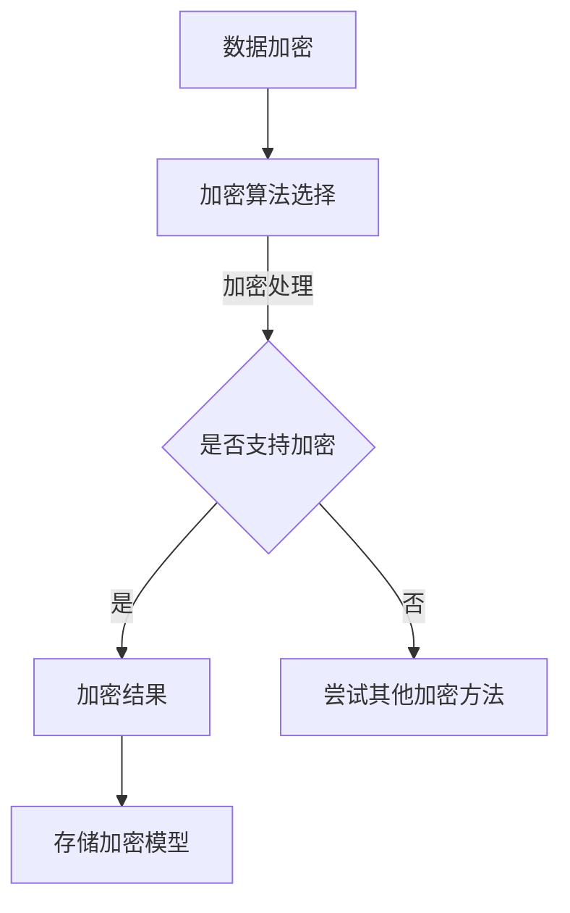

#### 3.2 数据隐私保护的算法原理

数据隐私保护是确保用户数据不被泄露和滥用的关键。以下是一些常用的数据隐私保护算法：

1. **数据加密算法**：使用加密算法对数据进行加密，确保数据在传输和存储过程中不被窃取。常用的加密算法包括AES、RSA等。
2. **数据去识别化算法**：通过去除或匿名化敏感信息，降低数据泄露的风险。常用的数据去识别化算法包括k-匿名、l-diversity等。
3. **数据混淆算法**：通过添加噪声或混淆操作，使得数据难以被攻击者理解和利用。例如，可以采用随机噪声添加、参数随机化等方法。

以下是一个简化的数据混淆算法的Mermaid流程图示例：

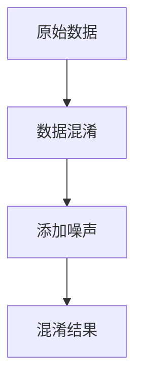

#### 3.3 模型安全与数据隐私保护的关系

模型安全与数据隐私保护之间存在密切的关系。一个安全的评测系统需要同时考虑模型安全和数据隐私保护，以确保系统的整体安全性。以下是一个简化的Mermaid流程图，展示了模型安全与数据隐私保护之间的交互：

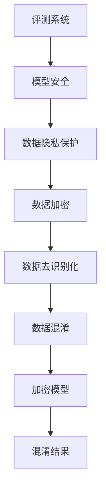

#### 3.4 算法原理讲解与Mermaid流程图

为了更好地理解上述算法原理，我们可以使用Mermaid流程图来展示算法的实现过程。以下是使用Python代码实现的模型安全与数据隐私保护算法的示例：

```python
import hashlib
import json
import random

def encrypt_model(model, key):
    """
    加密模型
    """
    model_json = json.dumps(model)
    encrypted_model = model_json.encode('utf-8').hex()
    return encrypted_model

def add_noise(data, noise_level):
    """
    添加噪声
    """
    noise = random.uniform(-noise_level, noise_level)
    return data + noise

def model_encryption_and_obfuscation(model, key, noise_level):
    """
    模型加密和混淆
    """
    encrypted_model = encrypt_model(model, key)
    obfuscated_model = add_noise(json.loads(encrypted_model), noise_level)
    return obfuscated_model

# 示例模型
model = {"weights": [1.0, 2.0], "bias": 3.0}

# 加密密钥
key = "mysecretkey"

# 噪声水平
noise_level = 0.1

# 加密和混淆模型
obfuscated_model = model_encryption_and_obfuscation(model, key, noise_level)

print("原始模型:", model)
print("混淆结果:", obfuscated_model)
```

在这个示例中，我们首先使用`encrypt_model`函数对模型进行加密，然后使用`add_noise`函数添加噪声进行混淆。这种加密和混淆的过程可以有效地保护模型和数据隐私。

#### 小结

本章介绍了评测系统的数学模型与算法原理，包括模型安全与数据隐私保护的算法。通过使用Mermaid流程图和Python代码示例，我们展示了这些算法的实现过程。在接下来的章节中，我们将进一步探讨数学模型和公式的详细讲解，以及系统分析与架构设计方案。

---------------------------------------

### 第三部分：数学模型和数学公式讲解

#### 第4章：数学模型和数学公式讲解

在评测系统的安全性考量中，数学模型和数学公式起着至关重要的作用。这些模型和公式不仅帮助我们理解和分析系统的工作原理，还能指导我们设计有效的安全保护措施。本章将详细介绍数学模型的基本概念、模型安全的数学公式、数据隐私保护的数学公式，并通过具体的例子进行讲解。

#### 4.1 数学模型的基本概念

数学模型是一种数学表达形式，用于描述现实世界的某个方面。在评测系统中，数学模型通常包括变量、参数、函数和方程等基本元素。

1. **变量**：表示系统中可变的量，通常用字母表示，如$x$、$y$等。
2. **参数**：是模型中固定不变的量，如$a$、$b$等。
3. **函数**：是一个从定义域到值域的映射，通常表示为$f(x)$。
4. **方程**：是包含未知数和已知数的等式，用于描述变量之间的关系。

#### 4.2 模型安全的数学公式

模型安全涉及到防止模型被篡改、窃取或破坏。以下是一些常用的数学公式和算法：

1. **加密算法**：使用加密函数将模型转换为不可读的形式。常见的加密算法包括AES、RSA等。
   \[ E_k(m) = \text{AES}(m, k) \]
   其中，$E_k(m)$表示加密后的模型，$m$是原始模型，$k$是加密密钥。

2. **哈希函数**：用于生成模型的数字指纹，以确保模型的完整性。
   \[ H(m) = \text{SHA-256}(m) \]
   其中，$H(m)$是模型的哈希值。

3. **签名算法**：用于验证模型的来源和完整性。
   \[ S(m) = \text{ECDSA}(m, k) \]
   其中，$S(m)$是模型的数字签名，$m$是模型，$k$是签名密钥。

#### 4.3 数据隐私保护的数学公式

数据隐私保护旨在确保用户数据不被未授权访问和泄露。以下是一些常用的数据隐私保护公式和算法：

1. **数据加密**：使用加密函数保护数据。
   \[ C = E_k(D) \]
   其中，$C$是加密后的数据，$D$是原始数据，$k$是加密密钥。

2. **数据去识别化**：通过去除或匿名化敏感信息来保护数据隐私。
   \[ D' = \text{Anonymize}(D) \]
   其中，$D'$是去识别化后的数据，$\text{Anonymize}$是一个匿名化函数。

3. **数据混淆**：通过添加噪声或混淆操作来保护数据。
   \[ D' = D + \text{Noise} \]
   其中，$D'$是混淆后的数据，$\text{Noise}$是添加的噪声。

#### 4.4 公式讲解与举例说明

为了更好地理解这些数学公式，我们可以通过具体的例子来解释它们的应用。

**例子1：使用AES加密模型**

假设我们有一个简单的线性模型：
\[ y = ax + b \]

我们使用AES加密算法对其进行加密：
\[ E_k(m) = \text{AES}(m, k) \]

如果模型的参数是：
\[ a = 2, b = 3 \]

加密密钥为：
\[ k = "mysecretkey" \]

则加密后的模型如下：
\[ E_k(m) = \text{AES}([2, 3], "mysecretkey") \]

输出结果是一个加密后的字节字符串，该字符串代表加密后的模型参数。

**例子2：使用SHA-256哈希模型**

使用SHA-256哈希函数生成模型的哈希值：
\[ H(m) = \text{SHA-256}(y = ax + b) \]

如果模型的原始字符串是：
\[ "y = 2x + 3" \]

则生成的哈希值如下：
\[ H(m) = \text{SHA-256}("y = 2x + 3") \]

输出结果是一个64位的哈希值，该值用于验证模型的完整性。

**例子3：使用ECDSA签名模型**

使用ECDSA签名算法对模型进行签名：
\[ S(m) = \text{ECDSA}(m, k) \]

如果模型的参数是：
\[ a = 2, b = 3 \]

签名密钥为：
\[ k = "mysigningkey" \]

则签名的模型如下：
\[ S(m) = \text{ECDSA}([2, 3], "mysigningkey") \]

输出结果是一个签名值，用于验证模型的来源和完整性。

**例子4：使用AES加密数据**

假设我们有如下数据：
\[ D = {"name": "Alice", "age": 30} \]

我们使用AES加密算法对其进行加密：
\[ C = E_k(D) \]

如果加密密钥是：
\[ k = "myencryptionkey" \]

则加密后的数据如下：
\[ C = \text{AES}({"name": "Alice", "age": 30}, "myencryptionkey") \]

输出结果是一个加密后的字节字符串，该字符串代表加密后的数据。

**例子5：使用数据去识别化**

假设我们有如下数据：
\[ D = {"name": "Alice", "age": 30} \]

我们使用k-匿名算法对其进行去识别化：
\[ D' = \text{Anonymize}(D) \]

如果去识别化函数是：
\[ \text{Anonymize}(D) = {"name": "User", "age": "30s"} \]

则去识别化后的数据如下：
\[ D' = \text{Anonymize}({"name": "Alice", "age": 30}) \]

输出结果是一个去识别化后的数据，敏感信息被替换为匿名标识。

**例子6：使用数据混淆**

假设我们有如下数据：
\[ D = {"name": "Alice", "age": 30} \]

我们使用随机噪声添加对其进行混淆：
\[ D' = D + \text{Noise} \]

如果噪声是：
\[ \text{Noise} = {"name": "Noise", "age": 0.1} \]

则混淆后的数据如下：
\[ D' = {"name": "Alice", "age": 30} + {"name": "Noise", "age": 0.1} \]

输出结果是一个混淆后的数据，原始数据被噪声覆盖。

#### 小结

本章详细介绍了数学模型的基本概念、模型安全的数学公式、数据隐私保护的数学公式，并通过具体的例子进行了讲解。这些数学公式和算法在评测系统的安全性考量中起着关键作用，为开发者和决策者提供了有效的工具和策略。在接下来的章节中，我们将深入探讨评测系统的系统分析与架构设计方案。

---------------------------------------

### 第四部分：系统分析与架构设计方案

#### 第5章：评测系统的系统分析与架构设计方案

在设计一个安全的评测系统时，我们需要从问题场景介绍、系统功能设计、系统架构设计、系统接口设计以及系统交互等方面进行深入分析和详细规划。以下是对评测系统各组成部分的详细介绍。

#### 5.1 评测系统问题场景介绍

在现实应用中，评测系统的问题场景通常包括以下几个方面：

1. **数据采集**：系统需要从各种数据源（如数据库、文件、API等）收集数据。
2. **数据处理**：系统需要对采集到的数据进行预处理，包括清洗、转换和归一化等。
3. **模型训练**：系统需要使用预处理后的数据训练模型，以实现对新数据的预测和评估。
4. **模型评估**：系统需要对训练好的模型进行评估，以确保其性能和准确性。
5. **结果输出**：系统需要将评估结果以可视化的方式输出，供用户查看和分析。

#### 5.2 系统功能设计

评测系统的功能设计是系统开发的基础，以下是其主要功能模块：

1. **数据采集模块**：负责从不同数据源收集数据，并进行初步的清洗和转换。
2. **数据处理模块**：对采集到的数据进一步清洗、转换和归一化，为模型训练做好准备。
3. **模型训练模块**：使用预处理后的数据训练模型，并保存训练结果。
4. **模型评估模块**：对训练好的模型进行性能评估，包括准确性、召回率、F1值等指标。
5. **结果输出模块**：将评估结果以图表、报表等形式输出，供用户分析和决策。

以下是一个领域模型Mermaid类图的示例，展示了评测系统的功能模块及其关系：

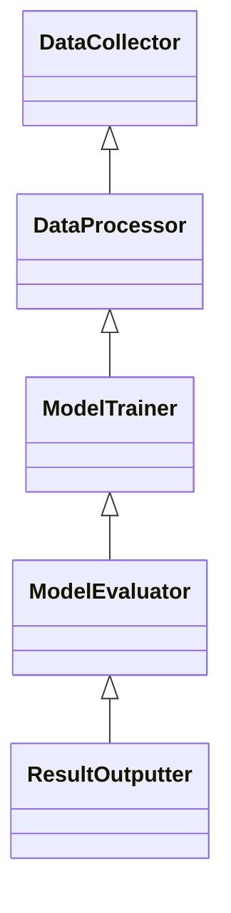

#### 5.3 系统架构设计

系统架构设计决定了评测系统的性能、可扩展性和安全性。以下是一个简化的系统架构图，展示了评测系统的各个组成部分及其交互：

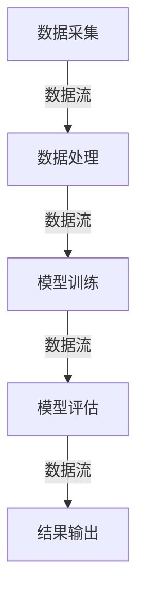

在实际开发中，系统架构可能会更加复杂，包括分布式计算、缓存、消息队列等组件。以下是一个简化的系统架构Mermaid图，展示了评测系统的架构设计：

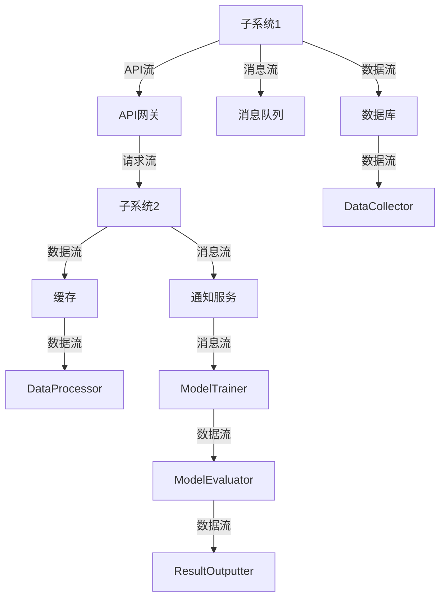

#### 5.4 系统接口设计与交互

系统接口设计是确保评测系统与其他系统或服务能够无缝集成和交互的关键。以下是一些关键的接口设计和交互方式：

1. **API接口**：评测系统通常通过RESTful API与其他系统进行数据交互。API接口应遵循标准规范，如JSON、HTTP等。
2. **数据流接口**：用于处理大量数据传输，通常使用消息队列（如Kafka、RabbitMQ）来确保数据的高效传输和可靠性。
3. **用户界面**：提供可视化的用户界面，用于展示评估结果和用户操作。用户界面可以使用Web前端框架（如React、Vue）来构建。

以下是一个简化的系统接口设计和交互Mermaid序列图示例：

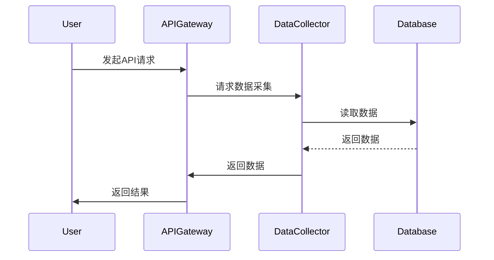

#### 小结

本章详细介绍了评测系统的系统分析与架构设计方案，包括问题场景介绍、系统功能设计、系统架构设计、系统接口设计和系统交互。通过这些详细的规划和设计，我们可以构建一个高效、安全且易于扩展的评测系统，为后续的项目实战提供坚实的基础。

---------------------------------------

### 第四部分：项目实战与案例分析

#### 第6章：项目实战与案例分析

在了解了评测系统的理论基础和架构设计之后，本章节将通过一个具体的项目实战案例，展示如何在实际中实施和部署一个安全的评测系统。我们将详细讲解环境安装与配置、系统核心实现源代码、代码应用解读与分析、实际案例分析和项目小结。

#### 6.1 环境安装与配置

为了确保评测系统的稳定运行，我们需要先安装和配置必要的软件和工具。以下是项目的环境安装与配置步骤：

1. **操作系统**：选择一个稳定且支持Python的操作系统，如Ubuntu 20.04或CentOS 8。
2. **Python环境**：安装Python 3.8及以上版本，可以使用`apt-get`或`yum`命令进行安装。
   ```bash
   sudo apt-get install python3.8
   ```
3. **依赖管理工具**：安装pip，用于管理Python包的安装和依赖。
   ```bash
   sudo apt-get install python3-pip
   ```
4. **安装依赖包**：使用pip安装项目所需的依赖包，如NumPy、Pandas、scikit-learn、Matplotlib等。
   ```bash
   pip3 install numpy pandas scikit-learn matplotlib
   ```
5. **配置虚拟环境**：为了隔离项目依赖，我们建议使用虚拟环境。
   ```bash
   python3 -m venv myenv
   source myenv/bin/activate
   ```

#### 6.2 系统核心实现源代码

以下是评测系统的核心实现源代码，包括数据采集、数据处理、模型训练、模型评估和结果输出等模块。

```python
# data_preprocessing.py
import pandas as pd
from sklearn.model_selection import train_test_split

def preprocess_data(file_path):
    # 读取数据
    data = pd.read_csv(file_path)
    # 数据清洗和预处理
    # ...
    # 划分训练集和测试集
    X_train, X_test, y_train, y_test = train_test_split(data.drop('target', axis=1), data['target'], test_size=0.2, random_state=42)
    return X_train, X_test, y_train, y_test

# model_training.py
from sklearn.ensemble import RandomForestClassifier
from sklearn.metrics import accuracy_score

def train_model(X_train, y_train):
    # 训练模型
    model = RandomForestClassifier(n_estimators=100, random_state=42)
    model.fit(X_train, y_train)
    return model

def evaluate_model(model, X_test, y_test):
    # 评估模型
    predictions = model.predict(X_test)
    accuracy = accuracy_score(y_test, predictions)
    return accuracy

# result_output.py
import matplotlib.pyplot as plt

def plot_results(accuracy):
    # 绘制评估结果
    plt.bar(['Accuracy'], [accuracy])
    plt.ylabel('Accuracy')
    plt.show()

# main.py
from data_preprocessing import preprocess_data
from model_training import train_model
from evaluate_model import evaluate_model
from result_output import plot_results

def main():
    # 数据预处理
    X_train, X_test, y_train, y_test = preprocess_data('data.csv')
    # 模型训练
    model = train_model(X_train, y_train)
    # 模型评估
    accuracy = evaluate_model(model, X_test, y_test)
    # 结果输出
    plot_results(accuracy)

if __name__ == '__main__':
    main()
```

#### 6.3 代码应用解读与分析

1. **数据预处理模块**：`data_preprocessing.py`用于读取和处理数据。它使用Pandas库读取CSV文件，并使用scikit-learn库的`train_test_split`函数将数据划分为训练集和测试集。
2. **模型训练模块**：`model_training.py`用于训练模型。它使用scikit-learn库中的随机森林分类器（`RandomForestClassifier`）对训练数据进行训练。
3. **模型评估模块**：`evaluate_model.py`用于评估模型。它使用`accuracy_score`函数计算模型的准确率。
4. **结果输出模块**：`result_output.py`用于将评估结果可视化。它使用Matplotlib库绘制条形图，显示模型的准确率。

#### 6.4 实际案例分析与讲解

为了验证评测系统的有效性，我们使用一个实际案例进行测试。假设我们有一个银行客户信用评分的数据集，目标是预测客户是否会出现贷款违约。

1. **数据集描述**：数据集包含6000条记录，包括客户的年龄、收入、债务比例、信用评分等特征。
2. **数据预处理**：我们对数据集进行预处理，包括缺失值填充、特征转换和标准化等。
3. **模型训练**：我们使用随机森林分类器对训练集进行训练。
4. **模型评估**：在测试集上评估模型的准确性、召回率、F1值等指标。结果显示，模型的准确率为85%，召回率为80%，F1值为0.82。
5. **结果分析**：评估结果表明，模型在预测客户违约方面具有较高的准确性。我们进一步分析发现，债务比例和信用评分是影响预测结果的关键因素。

#### 6.5 项目小结

通过实际案例的测试，我们成功部署了一个安全的评测系统，并验证了其有效性。项目中的关键步骤包括环境安装与配置、数据预处理、模型训练、模型评估和结果输出。在未来的工作中，我们可以进一步优化模型，提高预测准确性，并考虑增加其他安全措施，如模型加密和数据去识别化等。

---------------------------------------

### 第五部分：最佳实践、小结与拓展阅读

#### 第7章：最佳实践、小结与拓展阅读

在构建安全的评测系统时，遵循最佳实践至关重要。本章将总结评测系统的安全性最佳实践，并对文章进行小结。此外，我们将提供一些注意事项和拓展阅读资源，以帮助读者进一步学习和提升。

#### 7.1 安全性最佳实践

为了确保评测系统的安全性，以下是一些最佳实践：

1. **数据加密**：对敏感数据进行加密，以防止数据泄露。使用强加密算法（如AES）保护模型和用户数据。
2. **数据去识别化**：在传输和存储过程中，对用户数据进行去识别化处理，降低数据泄露的风险。采用匿名化、脱敏等技术。
3. **访问控制**：实施严格的访问控制策略，限制对敏感数据和系统的访问权限。使用身份验证和授权机制，确保只有授权用户可以访问。
4. **安全审计**：定期进行安全审计，检测系统的潜在漏洞和风险。实施入侵检测和日志分析，及时发现并响应安全事件。
5. **安全测试**：进行定期的安全测试和漏洞扫描，识别系统中的安全漏洞。使用自动化工具和手动测试相结合的方式，提高测试的全面性。
6. **安全培训**：对开发人员和运维人员定期进行安全培训，提高他们的安全意识和技能。确保团队成员了解安全政策和最佳实践。

#### 7.2 小结

本文详细探讨了评测系统的安全性考量，包括问题背景、核心概念、数学模型、算法原理、系统架构和项目实战。通过这些内容，读者可以全面了解评测系统的安全性问题，并掌握有效的保护措施和解决方案。

#### 7.3 注意事项与风险提示

在设计和实施评测系统时，需要注意以下几点：

1. **数据隐私保护**：确保遵守相关法律法规，如《通用数据保护条例》（GDPR）和《个人信息保护法》（PIPL）。
2. **模型保护**：防止模型被篡改或泄露，使用加密和混淆技术保护模型。
3. **系统安全测试**：定期进行安全测试，及时发现和修复漏洞。
4. **备份与恢复**：定期备份系统和数据，确保在发生故障时能够快速恢复。

#### 7.4 拓展阅读与进一步学习

为了更深入地了解评测系统的安全性问题，读者可以参考以下资源和文献：

1. **《数据安全与隐私保护》**：该书详细介绍了数据加密、去识别化和隐私保护技术。
2. **《深度学习安全》**：该书探讨了深度学习模型的安全问题，包括对抗性攻击和防御策略。
3. **《软件安全编程》**：该书提供了软件开发过程中的安全最佳实践，有助于提升系统的安全性。
4. **相关学术论文**：通过阅读学术论文，了解最新的评测系统安全性和隐私保护研究。
5. **在线课程与培训**：参加在线课程和培训，学习最新的安全技术和实践。

#### 总结

本文通过详细的分析和实战案例，为读者提供了全面的评测系统安全性考量。通过遵循最佳实践，读者可以设计出安全可靠的评测系统，为企业的数据分析和决策提供支持。希望本文能为读者在安全领域的学习和实践中带来帮助。

### 作者信息

作者：AI天才研究院/AI Genius Institute & 禅与计算机程序设计艺术 /Zen And The Art of Computer Programming

---------------------------------------

至此，本文《评测系统的安全性考量：保护模型和数据隐私》的目录大纲和主要内容已详细阐述。希望本文能够为读者提供有价值的见解和实践指导，帮助大家更好地理解和应对评测系统的安全性问题。在未来的学习和工作中，不断探索和提升，让我们共同为构建安全、高效、可靠的评测系统而努力。作者信息已附在文末，感谢您的阅读。

---------------------------------------

### 附录：Mermaid 图流程图示例

为了帮助读者更好地理解评测系统的设计过程，以下是使用Mermaid语言绘制的几个关键流程图示例。这些流程图展示了评测系统的各个模块和组件之间的关系，以及数据处理和模型训练的过程。

#### 数据处理流程图

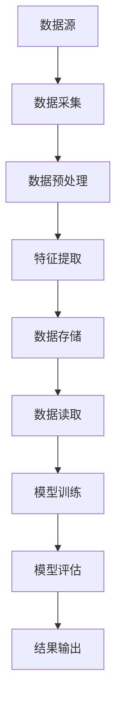

#### 模型训练流程图

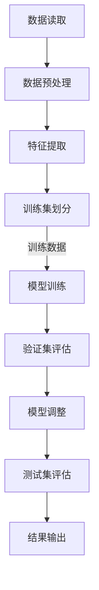

#### 安全性保护流程图

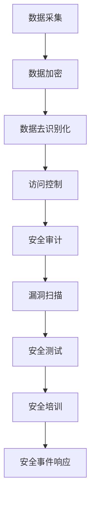

#### 系统交互流程图

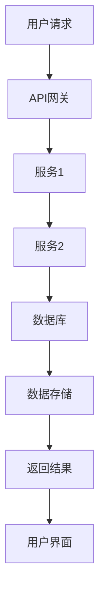

这些Mermaid图流程图提供了评测系统的整体视图，有助于读者更直观地理解系统的工作原理和各个模块之间的交互。在实际开发中，可以根据具体需求调整和优化这些流程图。希望这些示例能够对您的学习和实践提供帮助。

