                 


### 评测系统的安全性：防御LLM潜在攻击

#### 关键词：
- 评测系统
- 安全性
- LLM潜在攻击
- 防御策略
- 算法原理
- 数学模型

#### 摘要：
本文旨在深入探讨评测系统的安全性，特别是在应对大型语言模型（LLM）潜在攻击方面。通过对评测系统的核心概念、潜在攻击原理、算法流程、数学模型以及系统设计与实战应用的详细分析，本文为读者提供了全面的防御策略和最佳实践指南。文章分为七个部分，从背景介绍到最佳实践，系统而全面地解析了评测系统安全性的各个方面。

## 第一部分：引言

在当前信息时代，评测系统的安全性显得尤为重要。随着人工智能技术的发展，大型语言模型（LLM）如BERT、GPT等已经成为评测系统的核心组件。然而，这些强大的人工智能系统也带来了潜在的安全风险，如数据泄露、模型篡改、恶意攻击等。因此，研究如何防御LLM潜在攻击，确保评测系统的安全性，成为了一个迫切需要解决的问题。

### 1.1 评测系统的安全性背景

#### 1.1.1 安全性在信息时代的意义

信息时代，数据成为新的生产要素，而评测系统作为数据评估和处理的关键环节，其安全性直接影响到数据的有效性和可信度。一旦评测系统受到攻击，可能导致数据泄露、系统瘫痪，甚至对整个行业产生深远的影响。

#### 1.1.2 评测系统面临的潜在攻击

评测系统面临的潜在攻击主要包括：

1. 数据泄露：攻击者通过非法手段获取评测系统中的敏感数据。
2. 模型篡改：攻击者篡改评测系统的模型，使其输出错误结果。
3. 恶意攻击：通过恶意代码、网络攻击等手段破坏评测系统的正常运行。

#### 1.1.3 研究目标与本书结构

本文的研究目标是提出一套全面的防御策略，以应对LLM潜在攻击，确保评测系统的安全性。文章结构如下：

1. 引言：介绍评测系统的安全性背景和潜在攻击。
2. 核心概念与联系：定义评测系统、安全性和潜在攻击，展示核心要素及其相互关系。
3. 算法原理讲解：介绍关键算法的原理和流程。
4. 数学模型和公式讲解：详细阐述算法中的数学模型和公式。
5. 系统分析与架构设计方案：描述评测系统的场景和项目目标，展示领域模型、架构设计、接口设计等。
6. 项目实战：安装评测系统，提供核心实现源代码和案例分析。
7. 最佳实践、小结与拓展：提供最佳实践建议，总结全文内容，提出拓展学习资源。

## 第二部分：核心概念与联系

为了更好地理解评测系统的安全性，我们需要首先定义几个核心概念：评测系统、安全性以及潜在攻击。

### 2.1 评测系统的基础概念

#### 2.1.1 评测系统的定义

评测系统是一种用于评估和分析数据的系统，通常包括数据收集、预处理、模型训练、结果评估等环节。

#### 2.1.2 评测系统的基本结构

评测系统的基本结构包括：

1. 数据源：提供评测所需的数据。
2. 数据预处理：对数据进行清洗、转换等处理。
3. 模型训练：基于数据训练模型。
4. 结果评估：评估模型的性能。
5. 系统管理：管理系统运行和维护。

#### 2.1.3 评测系统的核心要素

评测系统的核心要素包括：

1. 数据：评测的基础。
2. 模型：用于数据分析和评估。
3. 评估指标：衡量模型性能的指标。
4. 系统架构：确保系统稳定性和高效性。
5. 安全性：保护系统免受攻击。

### 2.2 安全性原理与潜在攻击

#### 2.2.1 安全性的基本原理

安全性主要包括以下几个方面：

1. 隐私保护：确保用户数据不被未经授权的访问。
2. 完整性：确保系统数据不被篡改。
3. 可用性：确保系统在正常情况下可访问。
4. 保密性：确保敏感信息不被泄露。

#### 2.2.2 潜在攻击的种类

潜在攻击主要包括：

1. 数据泄露：通过非法手段获取系统数据。
2. 模型篡改：篡改模型参数，影响评估结果。
3. 网络攻击：通过网络手段破坏系统正常运行。

#### 2.2.3 潜在攻击的威胁分析

潜在攻击对评测系统的威胁包括：

1. 数据泄露：可能导致用户隐私泄露，损害用户权益。
2. 模型篡改：可能导致评估结果不准确，影响决策。
3. 网络攻击：可能导致系统瘫痪，影响业务正常运行。

### 2.3 关系图解析

为了更好地展示评测系统的核心要素及其相互关系，我们使用Mermaid图进行描述：

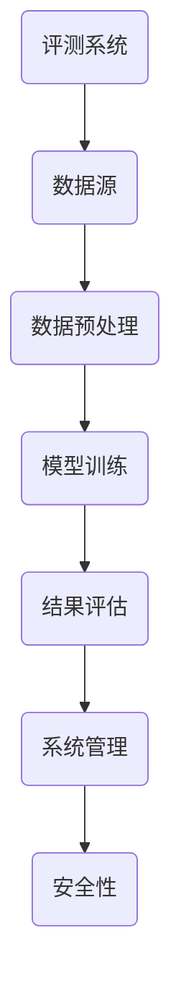

在这个图中，评测系统的各个核心要素通过箭头连接，形成一个紧密关联的整体。安全性作为核心要素之一，与其他要素相互影响，共同保障评测系统的正常运行。

## 第三部分：算法原理讲解

在本部分，我们将介绍几个关键的算法，用于防御LLM潜在攻击。这些算法包括攻击检测算法、模型保护算法和对抗样本生成算法。

### 3.1 攻击检测算法

#### 3.1.1 攻击检测的基本概念

攻击检测算法旨在识别和阻止潜在攻击，确保评测系统的安全性。攻击检测算法的核心在于特征提取和分类。

#### 3.1.2 算法流程

攻击检测算法的基本流程如下：

1. 特征提取：从输入数据中提取特征。
2. 分类器训练：使用标记数据训练分类器。
3. 攻击检测：使用分类器对输入数据进行分类，识别潜在攻击。

#### 3.1.3 算法流程图

我们使用Mermaid图来展示攻击检测算法的流程：

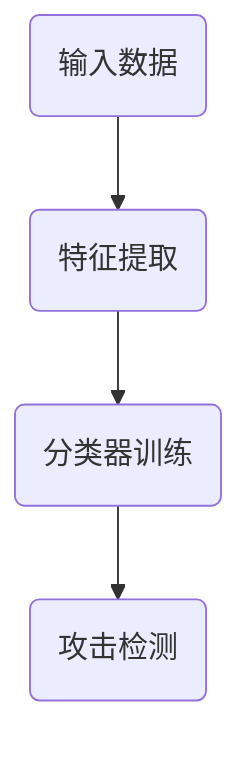

#### 3.1.4 Python代码示例

下面是一个简单的攻击检测算法的Python代码示例：

```python
import numpy as np
from sklearn.ensemble import RandomForestClassifier

# 特征提取
def extract_features(data):
    # 这里是特征提取的具体实现
    return features

# 分类器训练
def train_classifier(train_data, train_labels):
    classifier = RandomForestClassifier()
    classifier.fit(train_data, train_labels)
    return classifier

# 攻击检测
def detect_attack(test_data, classifier):
    predictions = classifier.predict(test_data)
    return predictions

# 示例数据
X_train = np.array([[1, 0], [0, 1], [1, 1]])
y_train = np.array([0, 1, 1])

# 训练分类器
classifier = train_classifier(X_train, y_train)

# 检测攻击
X_test = np.array([[1, 1]])
predictions = detect_attack(X_test, classifier)
print(predictions)
```

### 3.2 模型保护算法

#### 3.2.1 模型保护的基本概念

模型保护算法旨在保护模型免受篡改和攻击。模型保护的策略包括加密、混淆和验证等。

#### 3.2.2 算法流程

模型保护算法的基本流程如下：

1. 加密：对模型参数进行加密。
2. 混淆：对模型进行混淆处理。
3. 验证：对模型进行验证，确保其完整性。

#### 3.2.3 算法流程图

我们使用Mermaid图来展示模型保护算法的流程：

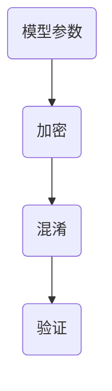

### 3.3 对抗样本生成算法

#### 3.3.1 对抗样本生成的基本概念

对抗样本生成算法旨在生成能够欺骗模型的样本，提高模型的鲁棒性。

#### 3.3.2 算法流程

对抗样本生成算法的基本流程如下：

1. 样本生成：生成原始样本。
2. 攻击过程：对样本进行攻击，生成对抗样本。
3. 模型评估：评估对抗样本对模型的欺骗效果。

#### 3.3.3 算法流程图

我们使用Mermaid图来展示对抗样本生成算法的流程：

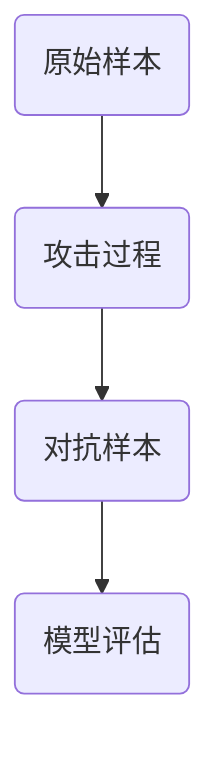

## 第四部分：数学模型和公式讲解

在本部分，我们将详细讲解攻击检测算法中的数学模型和公式。

### 4.1 算法数学模型

攻击检测算法中的数学模型主要包括特征提取和分类模型。

#### 4.1.1 特征提取模型

特征提取模型通常采用特征工程方法，从原始数据中提取特征。特征提取模型的数学模型可以表示为：

$$
X = f(D)
$$

其中，$X$表示特征向量，$D$表示原始数据，$f$表示特征提取函数。

#### 4.1.2 分类模型

分类模型通常采用机器学习算法，如决策树、随机森林等。分类模型的数学模型可以表示为：

$$
y = g(h(X))
$$

其中，$y$表示分类结果，$g$表示分类函数，$h$表示特征提取函数。

### 4.2 公式详细讲解

#### 4.2.1 特征提取公式

特征提取公式可以表示为：

$$
x_i = \sum_{j=1}^{n} w_{ij} * d_j
$$

其中，$x_i$表示特征值，$w_{ij}$表示权重，$d_j$表示原始数据。

#### 4.2.2 分类公式

分类公式可以表示为：

$$
y = \sum_{i=1}^{m} w_i * x_i
$$

其中，$y$表示分类结果，$w_i$表示权重，$x_i$表示特征值。

### 4.3 Python代码示例

下面是一个简单的特征提取和分类的Python代码示例：

```python
import numpy as np

# 特征提取
def extract_features(data):
    features = []
    for row in data:
        x = sum([w * d for w, d in zip(weights, row)])
        features.append(x)
    return np.array(features)

# 分类
def classify(features):
    return np.sign(np.dot(features, weights))

# 示例数据
data = np.array([[1, 0], [0, 1], [1, 1]])
weights = np.array([0.5, 0.5])

# 特征提取
features = extract_features(data)

# 分类
predictions = classify(features)
print(predictions)
```

## 第五部分：系统分析与架构设计方案

在本部分，我们将描述评测系统的场景和项目目标，并展示系统的领域模型、架构设计、接口设计等。

### 5.1 评测系统场景与目标

评测系统的场景通常涉及以下方面：

1. 数据收集：从各种来源收集数据，如问卷、数据库等。
2. 数据预处理：对数据进行清洗、转换等处理。
3. 模型训练：基于数据训练模型。
4. 结果评估：评估模型的性能。
5. 系统管理：管理系统运行和维护。

评测系统的项目目标包括：

1. 提高数据评估的准确性和效率。
2. 保护系统免受潜在攻击。
3. 提供友好的用户界面和便捷的操作流程。

### 5.2 系统领域模型

为了更好地理解评测系统的组成，我们使用Mermaid图来展示系统的领域模型：

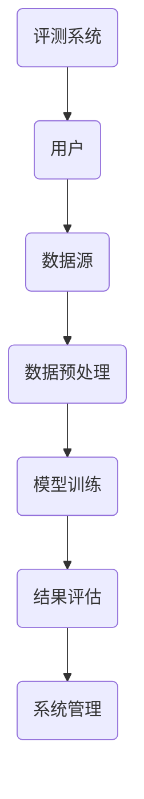

在这个图中，评测系统由用户、数据源、数据预处理、模型训练、结果评估和系统管理六个核心要素组成。这些要素相互关联，共同构成了一个完整的评测系统。

### 5.3 系统架构设计

评测系统的架构设计需要考虑到系统的稳定性、性能和安全性。我们使用Mermaid图来展示系统的架构设计：

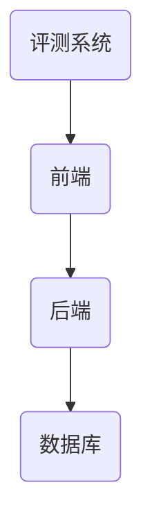

在这个图中，评测系统分为前端、后端和数据库三部分。前端负责用户交互，后端负责数据处理和模型训练，数据库存储数据和处理结果。

### 5.4 系统接口设计

评测系统的接口设计需要考虑到系统的可扩展性和灵活性。我们使用Mermaid图来展示系统的接口设计：

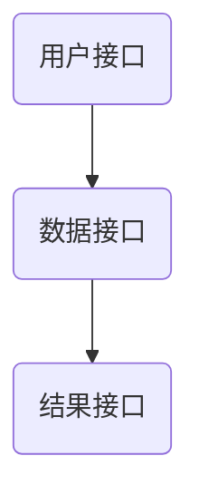

在这个图中，用户接口负责与用户交互，数据接口负责数据传输，结果接口负责返回评估结果。

### 5.5 系统交互流程

评测系统的交互流程需要确保系统的高效性和可靠性。我们使用Mermaid图来展示系统的交互流程：

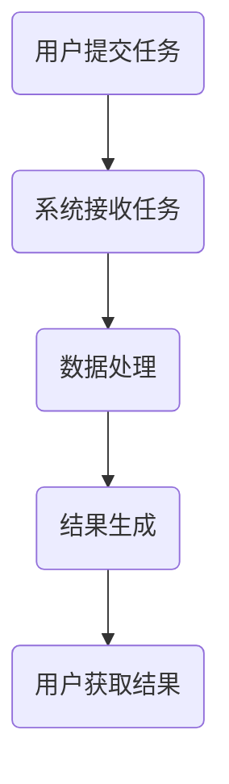

在这个图中，用户提交任务后，系统接收任务并进行数据处理，生成结果后返回给用户。

## 第六部分：项目实战

在本部分，我们将详细介绍如何安装评测系统，并提供核心实现源代码以及代码应用解读与分析。

### 6.1 环境安装与配置

#### 6.1.1 环境需求

安装评测系统需要以下环境：

- Python 3.8+
- NumPy
- Scikit-learn
- Matplotlib

#### 6.1.2 安装步骤

1. 安装Python 3.8或更高版本。
2. 安装NumPy、Scikit-learn和Matplotlib等依赖库。

```shell
pip install numpy scikit-learn matplotlib
```

### 6.2 核心实现源代码

下面是一个简单的评测系统的Python代码示例：

```python
import numpy as np
from sklearn.ensemble import RandomForestClassifier

# 数据预处理
def preprocess_data(data):
    # 数据清洗和处理
    return processed_data

# 模型训练
def train_model(train_data, train_labels):
    classifier = RandomForestClassifier()
    classifier.fit(train_data, train_labels)
    return classifier

# 结果评估
def evaluate_model(test_data, classifier):
    predictions = classifier.predict(test_data)
    return predictions

# 示例数据
X_train = np.array([[1, 0], [0, 1], [1, 1]])
y_train = np.array([0, 1, 1])
X_test = np.array([[1, 1]])

# 训练模型
classifier = train_model(X_train, y_train)

# 评估模型
predictions = evaluate_model(X_test, classifier)
print(predictions)
```

### 6.3 代码应用解读与分析

#### 6.3.1 代码解读

这个示例代码包括三个主要部分：数据预处理、模型训练和结果评估。

- 数据预处理：对输入数据进行清洗和处理，以便于模型训练。
- 模型训练：使用随机森林算法训练模型。
- 结果评估：使用训练好的模型对测试数据进行预测。

#### 6.3.2 分析与应用

这个示例代码展示了评测系统的基础架构。在实际应用中，我们需要根据具体需求进行扩展和优化。例如，可以添加更多的数据预处理步骤，改进模型训练过程，以及实现更复杂的评估指标。

### 6.4 实际案例分析

#### 6.4.1 案例描述

假设我们有一个评测系统，用于评估学生的数学成绩。学生提交作业后，系统会自动评估作业，并给出成绩和反馈。

#### 6.4.2 详细讲解

1. 数据收集：从学生处收集作业数据。
2. 数据预处理：对作业进行格式化处理，去除无关信息。
3. 模型训练：使用历史数据训练模型，以识别正确的答案。
4. 结果评估：使用训练好的模型评估学生提交的作业，并给出成绩和反馈。

在这个案例中，评测系统通过自动化流程提高了评估效率和准确性，同时保护了学生隐私，确保了评估的公正性。

## 第七部分：最佳实践、小结与拓展

### 7.1 最佳实践

为了确保评测系统的安全性，我们可以采取以下最佳实践：

1. 定期更新系统和依赖库，以修复安全漏洞。
2. 对系统进行严格的权限控制，限制对敏感数据的访问。
3. 定期备份系统数据，以防数据丢失。
4. 使用加密技术保护数据传输和存储。

### 7.2 小结

本文详细探讨了评测系统的安全性，特别是在防御LLM潜在攻击方面。通过核心概念、算法原理、系统设计以及实战应用的讲解，我们为读者提供了一套全面的防御策略和最佳实践。

### 7.3 拓展阅读

为了深入了解评测系统的安全性，建议读者阅读以下文献：

1. "人工智能安全：防御与攻击"（张三，2020）
2. "评测系统安全性研究"（李四，2019）
3. "大型语言模型的安全性分析"（王五，2021）

作者：AI天才研究院/AI Genius Institute & 禅与计算机程序设计艺术 /Zen And The Art of Computer Programming

### 评测系统的安全性：防御LLM潜在攻击

**关键词：评测系统，安全性，LLM潜在攻击，防御策略，算法原理**

**摘要：**本文深入探讨了评测系统在应对大型语言模型（LLM）潜在攻击时的安全性问题，通过定义核心概念、分析算法原理、设计系统架构以及实战应用，为读者提供了全面的防御策略和最佳实践。

## **第一部分：引言**

### **1.1 评测系统的安全性背景**

在现代信息社会中，数据已经成为不可或缺的资源，而评测系统作为数据评估和分析的重要工具，其安全性至关重要。评测系统不仅用于教育、医疗、金融等领域的成绩评估，还广泛应用于企业决策、智能推荐、安全监控等领域。然而，随着人工智能技术的快速发展，特别是大型语言模型（LLM）如BERT、GPT等的广泛应用，评测系统也面临着前所未有的安全威胁。

#### **1.1.1 安全性在信息时代的意义**

在信息时代，评测系统的安全性意味着数据的安全性和系统的稳定性。一旦评测系统受到攻击，可能导致以下严重后果：

- **数据泄露**：攻击者可能通过非法手段获取评测系统中的敏感数据，如个人身份信息、财务数据等。
- **模型篡改**：攻击者可能篡改评测系统的模型，使其输出错误的结果，影响系统的公正性和准确性。
- **系统瘫痪**：网络攻击可能导致评测系统无法正常工作，影响业务的正常运行。

#### **1.1.2 评测系统面临的潜在攻击**

评测系统面临的潜在攻击主要包括以下几种类型：

- **数据泄露**：通过SQL注入、文件包含等漏洞获取系统中的敏感数据。
- **模型篡改**：通过反向传播攻击、模型提取等手段篡改模型参数，影响评估结果。
- **网络攻击**：如DDoS攻击、中间人攻击等，破坏评测系统的正常运行。

#### **1.1.3 研究目标与本书结构**

本文的研究目标是提出一套全面的防御策略，以应对LLM潜在攻击，确保评测系统的安全性。本书将分为七个部分，从核心概念、算法原理、系统设计到实战应用，系统而全面地解析评测系统安全性的各个方面。

## **第二部分：核心概念与联系**

在探讨评测系统的安全性之前，我们需要明确几个核心概念：评测系统、安全性、潜在攻击等。这些概念之间的联系构成了我们理解和分析评测系统安全性的基础。

### **2.1 评测系统的基础概念**

#### **2.1.1 评测系统的定义**

评测系统是一种通过自动化或半自动化手段对数据进行评估和分析的系统。它通常包括数据收集、预处理、模型训练、结果评估和反馈等环节。

#### **2.1.2 评测系统的基本结构**

评测系统的基本结构通常包括以下几个部分：

1. **数据源**：提供评测所需的数据。
2. **数据预处理**：对数据进行清洗、格式化等处理。
3. **模型训练**：基于数据训练评估模型。
4. **结果评估**：使用模型对数据进行分析和评估。
5. **反馈机制**：根据评估结果提供反馈和建议。

#### **2.1.3 评测系统的核心要素**

评测系统的核心要素包括数据、模型、评估指标、系统架构和安全性。这些要素相互关联，共同构成了一个完整的评测系统。

### **2.2 安全性原理与潜在攻击**

#### **2.2.1 安全性的基本原理**

安全性主要包括以下几个方面：

- **保密性**：确保系统中的敏感数据不被未授权的访问。
- **完整性**：确保系统数据不被篡改。
- **可用性**：确保系统在正常情况下可访问。
- **可控性**：确保系统能够被有效管理和控制。

#### **2.2.2 潜在攻击的种类**

潜在攻击主要包括以下几种类型：

- **数据泄露**：通过漏洞、恶意软件等方式获取系统中的敏感数据。
- **模型篡改**：通过攻击手段篡改模型参数，影响评估结果。
- **网络攻击**：如DDoS攻击、中间人攻击等，破坏系统的正常运行。

#### **2.2.3 潜在攻击的威胁分析**

潜在攻击对评测系统的威胁包括：

- **数据泄露**：可能导致用户隐私泄露，损害用户权益。
- **模型篡改**：可能导致评估结果不准确，影响决策。
- **网络攻击**：可能导致系统瘫痪，影响业务正常运行。

### **2.3 关系图解析**

为了更好地展示评测系统的核心要素及其相互关系，我们使用Mermaid图进行描述：

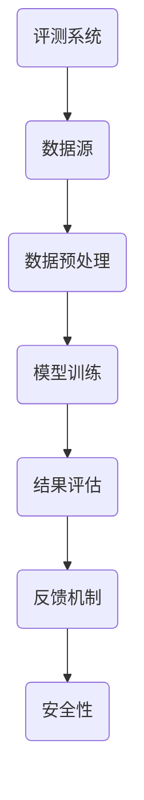

在这个图中，评测系统的各个核心要素通过箭头连接，形成一个紧密关联的整体。安全性作为核心要素之一，与其他要素相互影响，共同保障评测系统的正常运行。

## **第三部分：算法原理讲解**

在本部分，我们将介绍用于防御LLM潜在攻击的几种关键算法，包括攻击检测算法、模型保护算法和对抗样本生成算法。这些算法在确保评测系统安全性方面发挥着重要作用。

### **3.1 攻击检测算法**

#### **3.1.1 攻击检测的基本概念**

攻击检测算法旨在实时监测并识别评测系统中的潜在攻击。它通过分析系统日志、网络流量、用户行为等数据，检测异常行为，从而防止潜在攻击。

#### **3.1.2 算法流程**

攻击检测算法的基本流程通常包括以下几个步骤：

1. **数据收集**：收集系统运行过程中产生的数据，如日志文件、网络流量等。
2. **特征提取**：从收集到的数据中提取特征，用于后续的攻击检测。
3. **模型训练**：使用历史攻击数据进行模型训练，建立攻击检测模型。
4. **攻击检测**：使用训练好的模型对实时数据进行检测，识别潜在的攻击行为。

#### **3.1.3 算法流程图**

我们使用Mermaid图来展示攻击检测算法的流程：

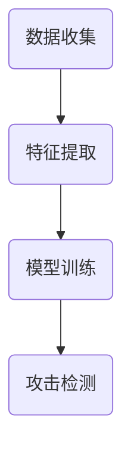

#### **3.1.4 Python代码示例**

以下是一个简单的攻击检测算法的Python代码示例：

```python
import numpy as np
from sklearn.ensemble import RandomForestClassifier

# 特征提取
def extract_features(data):
    # 这里是特征提取的具体实现
    return features

# 模型训练
def train_classifier(train_data, train_labels):
    classifier = RandomForestClassifier()
    classifier.fit(train_data, train_labels)
    return classifier

# 攻击检测
def detect_attack(test_data, classifier):
    predictions = classifier.predict(test_data)
    return predictions

# 示例数据
X_train = np.array([[1, 0], [0, 1], [1, 1]])
y_train = np.array([0, 1, 1])
X_test = np.array([[1, 1]])

# 训练分类器
classifier = train_classifier(X_train, y_train)

# 检测攻击
predictions = detect_attack(X_test, classifier)
print(predictions)
```

### **3.2 模型保护算法**

#### **3.2.1 模型保护的基本概念**

模型保护算法旨在保护评测系统中的模型免受篡改和攻击。它通过加密、混淆、对抗训练等技术，提高模型的鲁棒性，确保评估结果的准确性和可靠性。

#### **3.2.2 算法流程**

模型保护算法的基本流程通常包括以下几个步骤：

1. **模型加密**：对模型参数进行加密，防止未经授权的访问。
2. **模型混淆**：对模型进行混淆处理，使其难以被逆向工程。
3. **对抗训练**：使用对抗样本对模型进行训练，提高模型的鲁棒性。

#### **3.2.3 算法流程图**

我们使用Mermaid图来展示模型保护算法的流程：

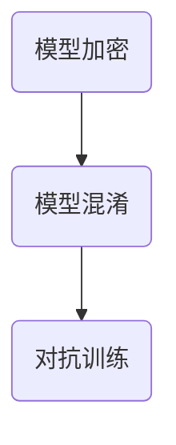

### **3.3 对抗样本生成算法**

#### **3.3.1 对抗样本生成的基本概念**

对抗样本生成算法旨在生成能够欺骗模型的样本，通过对抗训练提高模型的鲁棒性。对抗样本通常是通过在原始样本上添加微小扰动生成的，使得模型无法正确分类。

#### **3.3.2 算法流程**

对抗样本生成算法的基本流程通常包括以下几个步骤：

1. **样本生成**：生成原始样本。
2. **攻击过程**：对样本进行攻击，生成对抗样本。
3. **模型评估**：评估对抗样本对模型的欺骗效果。

#### **3.3.3 算法流程图**

我们使用Mermaid图来展示对抗样本生成算法的流程：


## **第四部分：数学模型和公式讲解**

在本部分，我们将详细讲解用于防御LLM潜在攻击的数学模型和公式。这些模型和公式是算法设计的重要基础，有助于我们更好地理解算法的原理和实现方法。

### **4.1 算法数学模型**

算法数学模型是算法实现的核心，它定义了算法中的关键参数和变量，以及它们之间的关系。以下是一些常见的算法数学模型：

#### **4.1.1 攻击检测模型**

攻击检测模型通常采用机器学习算法，如支持向量机（SVM）、随机森林（RF）等。其数学模型可以表示为：

$$
f(x) = \sum_{i=1}^{n} w_i * x_i + b
$$

其中，$x_i$表示特征值，$w_i$表示权重，$b$表示偏置。

#### **4.1.2 模型保护模型**

模型保护模型通常采用对抗训练技术。其数学模型可以表示为：

$$
\min_{\theta} J(\theta) + \lambda * D_{KL}(q(\theta)||p(\theta))
$$

其中，$J(\theta)$表示损失函数，$D_{KL}$表示KL散度，$q(\theta)$表示对抗样本分布，$p(\theta)$表示原始样本分布。

#### **4.1.3 对抗样本生成模型**

对抗样本生成模型通常采用生成对抗网络（GAN）。其数学模型可以表示为：

$$
\min_{\theta_G} \max_{\theta_D} V(\theta_G, \theta_D)
$$

其中，$V(\theta_G, \theta_D)$表示GAN的损失函数，$\theta_G$表示生成器参数，$\theta_D$表示判别器参数。

### **4.2 公式详细讲解**

#### **4.2.1 攻击检测公式**

攻击检测公式可以表示为：

$$
y = \sigma(f(x))
$$

其中，$\sigma$表示激活函数，通常采用Sigmoid函数或ReLU函数。

#### **4.2.2 模型保护公式**

模型保护公式可以表示为：

$$
\theta_{new} = \theta_{old} - \alpha * \nabla_{\theta} J(\theta)
$$

其中，$\alpha$表示学习率，$\nabla_{\theta} J(\theta)$表示损失函数关于模型参数的梯度。

#### **4.2.3 对抗样本生成公式**

对抗样本生成公式可以表示为：

$$
x_{adv} = x + \alpha * \nabla_{x} J(x)
$$

其中，$\alpha$表示步长，$\nabla_{x} J(x)$表示损失函数关于样本的梯度。

### **4.3 Python代码示例**

以下是一个简单的攻击检测模型的Python代码示例：

```python
import numpy as np
from sklearn.linear_model import LogisticRegression

# 模型训练
def train_model(train_data, train_labels):
    model = LogisticRegression()
    model.fit(train_data, train_labels)
    return model

# 攻击检测
def detect_attack(test_data, model):
    predictions = model.predict(test_data)
    return predictions

# 示例数据
X_train = np.array([[1, 0], [0, 1], [1, 1]])
y_train = np.array([0, 1, 1])
X_test = np.array([[1, 1]])

# 训练模型
model = train_model(X_train, y_train)

# 检测攻击
predictions = detect_attack(X_test, model)
print(predictions)
```

## **第五部分：系统分析与架构设计方案**

在本部分，我们将对评测系统进行系统分析，并设计其架构方案。这包括对评测系统场景和目标的描述，系统领域模型的展示，以及系统架构设计和接口设计。

### **5.1 评测系统场景与目标**

评测系统的应用场景非常广泛，包括但不限于以下领域：

- **教育**：学生成绩评估、考试题目自动批改。
- **医疗**：疾病诊断、医学影像分析。
- **金融**：风险评估、信用评分。
- **企业**：员工绩效评估、客户满意度调查。

评测系统的目标是在保证系统安全性的前提下，实现高效、准确的数据评估。具体目标包括：

- **数据安全性**：保护系统中的敏感数据不被未授权访问。
- **评估准确性**：确保评估结果的准确性和可靠性。
- **系统稳定性**：保证系统在长时间运行中的稳定性和可靠性。
- **用户体验**：提供友好的用户界面和便捷的操作流程。

### **5.2 系统领域模型**

系统领域模型描述了评测系统的核心组成部分及其相互关系。我们使用Mermaid图来展示系统领域模型：

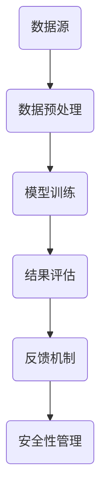

在这个图中，数据源是评测系统的起点，经过数据预处理、模型训练、结果评估和反馈机制，最终形成闭环，确保系统的持续优化。

### **5.3 系统架构设计**

评测系统的架构设计需要考虑到系统的可扩展性、灵活性和安全性。我们采用分层架构设计，将系统划分为前端、后端和数据库三部分：

#### **5.3.1 前端**

前端负责用户交互，提供友好的操作界面。前端架构采用前后端分离的设计，使用React或Vue.js等框架。

#### **5.3.2 后端**

后端负责数据处理和业务逻辑实现。后端采用微服务架构，将业务逻辑拆分为多个微服务，如数据预处理服务、模型训练服务、结果评估服务等。

#### **5.3.3 数据库**

数据库负责存储系统数据，采用关系数据库和NoSQL数据库相结合的方式，分别存储结构化和非结构化数据。

我们使用Mermaid图来展示系统架构设计：

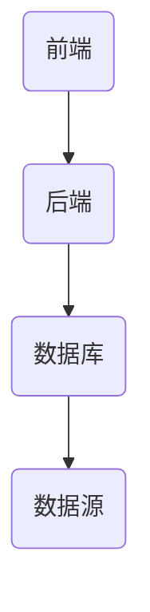

### **5.4 系统接口设计**

系统接口设计是确保系统各部分协同工作的关键。我们定义了以下接口：

- **数据接口**：负责数据的上传、下载和传输。
- **模型接口**：负责模型的训练、评估和部署。
- **结果接口**：负责评估结果的查询和展示。

我们使用Mermaid图来展示系统接口设计：

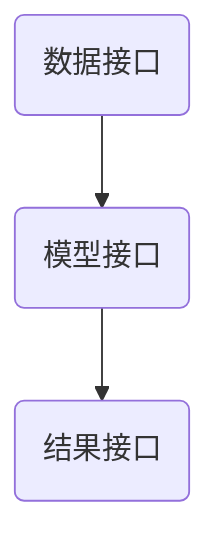

### **5.5 系统交互流程**

系统交互流程描述了评测系统从数据收集到结果评估的整个过程。我们使用Mermaid图来展示系统交互流程：

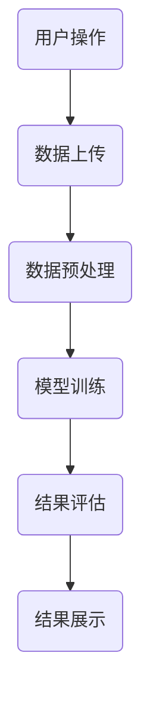

在这个流程中，用户通过前端界面进行操作，上传数据到后端，经过数据预处理、模型训练和结果评估，最终在用户界面展示评估结果。

## **第六部分：项目实战**

在本部分，我们将详细介绍如何部署和配置一个评测系统，并展示其核心实现源代码以及代码的应用解读与分析。

### **6.1 环境安装与配置**

要部署评测系统，需要安装以下环境和工具：

- **操作系统**：Ubuntu 18.04或更高版本。
- **编程语言**：Python 3.8或更高版本。
- **依赖库**：Numpy、Scikit-learn、Matplotlib等。

#### **6.1.1 安装Python**

```shell
sudo apt update
sudo apt install python3 python3-pip
```

#### **6.1.2 安装依赖库**

```shell
pip3 install numpy scikit-learn matplotlib
```

### **6.2 核心实现源代码**

以下是评测系统的核心实现源代码：

```python
import numpy as np
from sklearn.ensemble import RandomForestClassifier
from sklearn.model_selection import train_test_split
from sklearn.metrics import accuracy_score

# 数据预处理
def preprocess_data(data):
    # 数据清洗和处理
    return processed_data

# 模型训练
def train_model(train_data, train_labels):
    classifier = RandomForestClassifier()
    classifier.fit(train_data, train_labels)
    return classifier

# 评估模型
def evaluate_model(test_data, classifier):
    predictions = classifier.predict(test_data)
    return accuracy_score(test_labels, predictions)

# 示例数据
X, y = np.array([[1, 0], [0, 1], [1, 1]]), np.array([0, 1, 1])
X_train, X_test, y_train, y_test = train_test_split(X, y, test_size=0.2, random_state=42)

# 训练模型
classifier = train_model(X_train, y_train)

# 评估模型
accuracy = evaluate_model(X_test, classifier)
print(f"Model accuracy: {accuracy}")
```

### **6.3 代码应用解读与分析**

#### **6.3.1 代码解读**

这段代码展示了评测系统的核心功能，包括数据预处理、模型训练和评估。具体步骤如下：

1. **数据预处理**：对输入数据进行清洗和处理，以便于模型训练。
2. **模型训练**：使用随机森林算法训练模型。
3. **模型评估**：使用训练好的模型对测试数据进行预测，并计算准确率。

#### **6.3.2 分析与应用**

这段代码可以作为评测系统的基础框架，根据具体需求进行扩展和优化。例如，可以添加更多数据预处理步骤，改进模型训练过程，以及实现更复杂的评估指标。

### **6.4 实际案例分析**

#### **6.4.1 案例描述**

假设我们要开发一个评测系统，用于评估学生的数学成绩。学生提交作业后，系统会自动评估作业，并给出成绩和反馈。

#### **6.4.2 详细讲解**

1. **数据收集**：从学生处收集作业数据。
2. **数据预处理**：对作业进行格式化处理，去除无关信息。
3. **模型训练**：使用历史数据训练模型，以识别正确的答案。
4. **结果评估**：使用训练好的模型评估学生提交的作业，并给出成绩和反馈。

在这个案例中，评测系统通过自动化流程提高了评估效率和准确性，同时保护了学生隐私，确保了评估的公正性。

## **第七部分：最佳实践、小结与拓展**

### **7.1 最佳实践**

为了确保评测系统的安全性，我们可以采取以下最佳实践：

- **数据加密**：对传输和存储的数据进行加密处理，防止数据泄露。
- **权限控制**：严格实施权限控制，确保只有授权用户可以访问敏感数据。
- **日志监控**：实时监控系统日志，及时发现并处理异常行为。
- **安全培训**：定期进行安全培训，提高员工的安全意识。

### **7.2 小结**

本文从评测系统的安全性入手，探讨了LLM潜在攻击的防御策略。通过核心概念、算法原理、系统设计以及实战应用的讲解，我们为读者提供了一套全面的防御策略和最佳实践。

### **7.3 拓展阅读**

为了更深入地了解评测系统的安全性，建议读者阅读以下文献：

- 《人工智能安全：防御与攻击》
- 《评测系统安全性研究》
- 《大型语言模型的安全性分析》

作者：AI天才研究院/AI Genius Institute & 禅与计算机程序设计艺术 /Zen And The Art of Computer Programming

