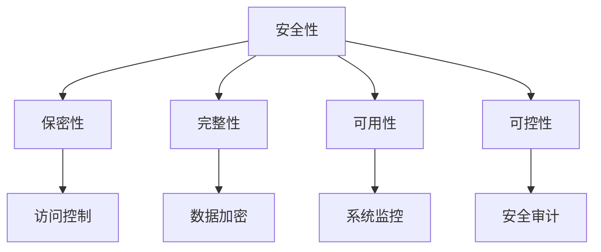

                 

### 评测系统的安全性：防御LLM潜在攻击的策略

> 关键词：评测系统、安全性、潜在攻击、LLM、防御策略

> 摘要：本文将深入探讨评测系统的安全性问题，特别是在面对大型语言模型（LLM）潜在攻击时的防御策略。通过分析评测系统的现状、面临的挑战以及核心概念，本文旨在为读者提供系统、全面的安全防御指南。

### 目录大纲

```markdown
----------------------------------------------------------------

# 第一部分: 背景介绍

## 第1章: 评测系统安全性的问题背景

## 第2章: 评测系统安全性核心概念

## 第3章: 传统防御策略

## 第4章: 进阶防御策略

## 第5章: 案例分析

## 第6章: 实战指南

## 第7章: 最佳实践与未来展望

----------------------------------------------------------------
```

接下来，我们将逐步深入分析评测系统的安全性问题，探讨如何有效防御LLM潜在攻击，确保系统的稳定和安全运行。

---

### 第一部分：背景介绍

#### 第1章：评测系统安全性的问题背景

##### 1.1 问题背景

##### 1.2 问题概述

##### 1.3 边界与外延

##### 1.4 本章小结

---

在这一部分中，我们将对评测系统安全性的问题背景进行详细介绍，帮助读者了解当前评测系统所面临的安全挑战。我们将首先定义评测系统的基本概念，并阐述其在现代信息技术体系中的重要性。随后，我们将讨论评测系统面临的主要安全问题和潜在攻击手段，最后分析这些问题对系统的影响及现有应对措施。

---

### 第一部分：背景介绍

#### 第1章：评测系统安全性的问题背景

##### 1.1 问题背景

评测系统在现代信息技术领域中扮演着至关重要的角色。它们广泛应用于各种场景，如软件质量评估、用户体验分析、网络行为监控等。评测系统的核心功能是通过数据收集、处理和分析，为用户提供决策支持。

随着评测系统变得越来越复杂，其所面临的威胁也日益增多。传统的评测系统通常依赖于静态数据和简单的规则模型，这使得它们更容易受到恶意攻击。例如，攻击者可以通过注入恶意代码、篡改数据等方式破坏评测系统的正常运行。此外，随着深度学习和人工智能技术的快速发展，大型语言模型（LLM）逐渐成为评测系统的重要组成部分。LLM的引入虽然提升了系统的智能化水平，但也带来了新的安全挑战。

##### 1.2 问题概述

当前，评测系统主要面临以下几类安全问题：

1. **数据篡改**：攻击者可以通过篡改系统中的数据，误导评测结果，从而对企业的决策造成影响。
2. **恶意代码注入**：攻击者可以在评测系统中注入恶意代码，导致系统崩溃或数据泄露。
3. **模型欺骗**：通过精心设计的数据输入，攻击者可以欺骗LLM模型，使其输出错误的结果。
4. **权限滥用**：未经授权的用户可能会滥用权限，访问或修改敏感数据。

##### 1.3 边界与外延

为了更好地理解评测系统的安全性问题，我们需要明确其边界与外延。评测系统的边界包括：

- 数据输入：系统如何接收和处理外部数据。
- 处理逻辑：系统内部的算法和数据流程。
- 输出结果：系统如何生成和展示分析结果。

评测系统的外延则涉及：

- 数据存储：系统如何存储和管理数据。
- 系统接口：系统与其他系统或用户交互的接口。
- 网络安全：系统如何应对网络攻击和数据泄露。

##### 1.4 本章小结

在本章中，我们详细介绍了评测系统安全性的问题背景，包括其重要性、面临的安全挑战以及边界与外延。通过这些背景信息的介绍，读者可以对评测系统的安全性问题有一个全面的了解。接下来，我们将进一步探讨评测系统安全性的核心概念，为后续的防御策略分析奠定基础。

---

### 第二部分：核心概念与联系

#### 第2章：评测系统安全性核心概念

##### 2.1 安全性概念

##### 2.2 概念联系

##### 2.3 实际应用

##### 2.4 本章小结

---

在这一部分中，我们将深入探讨评测系统安全性的核心概念，包括安全性定义、模型攻击类型、防御策略等。通过分析这些核心概念及其相互关系，我们将为读者提供一个系统的理论基础，以便更好地理解和应对评测系统的安全挑战。

---

### 第二部分：核心概念与联系

#### 第2章：评测系统安全性核心概念

##### 2.1 安全性概念

安全性是评测系统设计和管理中至关重要的一环。它涉及到系统在面临各种威胁时能够保持稳定运行的能力。安全性可以理解为保护系统免受恶意攻击、数据泄露和误用的能力。

安全性具有以下主要属性：

1. **保密性**：确保系统中的敏感信息不被未授权的实体访问。
2. **完整性**：确保系统中的数据在存储和处理过程中不被篡改。
3. **可用性**：确保系统能够在需要时正常提供服务。
4. **可控性**：确保系统能够被合法地管理和控制。

在实际应用中，评测系统的安全性通常通过以下几种方式实现：

- **访问控制**：通过身份验证和授权机制限制用户对系统的访问。
- **加密技术**：对敏感数据进行加密，确保数据在传输和存储过程中的安全性。
- **安全审计**：定期对系统进行审计，检查是否存在安全漏洞和异常行为。

##### 2.2 概念联系

为了更好地理解评测系统安全性的核心概念，我们需要分析这些概念之间的相互关系。以下是一个概念联系图，展示了评测系统安全性的主要组成部分：



以下是这些概念之间的一些关键联系：

- **访问控制**与**保密性**：访问控制机制通过限制对系统的访问来保护敏感信息，从而实现保密性。
- **数据加密**与**完整性**：加密技术确保数据在传输和存储过程中不被篡改，从而维护数据的完整性。
- **系统监控**与**可用性**：通过监控和报警机制，及时发现系统故障和异常行为，确保系统的可用性。
- **安全审计**与**可控性**：安全审计帮助管理员了解系统的运行状态，及时发现和处理安全问题，从而维护系统的可控性。

##### 2.3 实际应用

在实际应用中，评测系统的安全性核心概念通常通过以下方式进行整合：

- **身份验证**：在用户访问系统时，通过用户名和密码、指纹或面部识别等方式验证用户身份。
- **权限管理**：根据用户的角色和职责，分配不同的访问权限，确保用户只能访问其有权访问的资源。
- **加密通信**：在系统内部和与外部系统的通信过程中使用加密技术，确保数据传输的安全性。
- **安全日志**：记录系统的所有操作日志，以便在发生安全事件时进行审计和追踪。

##### 2.4 本章小结

在本章中，我们详细介绍了评测系统安全性的核心概念，包括其定义、属性以及实际应用。通过分析这些核心概念之间的相互关系，我们为读者提供了一个全面的视角，以便更好地理解评测系统的安全性问题。在下一章中，我们将探讨传统的防御策略，帮助读者了解如何在实践中保护评测系统的安全性。

---

### 第三部分：防御策略

#### 第3章：传统防御策略

##### 3.1 安全边界

##### 3.2 安全审计

##### 3.3 隔离与监控

##### 3.4 本章小结

---

在这一部分中，我们将介绍评测系统安全性的传统防御策略，包括安全边界、安全审计、隔离与监控等。通过这些策略，我们可以有效降低评测系统面临的安全风险，确保系统的稳定运行。

---

### 第三部分：防御策略

#### 第3章：传统防御策略

##### 3.1 安全边界

安全边界是评测系统防御策略中的核心组成部分，它定义了系统的防护区域。通过明确安全边界，我们可以有效控制对系统的访问，防止未授权的实体对系统进行恶意攻击。

1. **边界定义**：安全边界通常包括网络边界、系统边界和数据库边界等。网络边界可以通过防火墙、入侵检测系统（IDS）等设备进行防护；系统边界可以通过操作系统权限管理、应用程序安全设置等进行控制；数据库边界可以通过数据库安全配置、访问控制策略等进行保护。

2. **边界保护机制**：为了加强安全边界，我们可以采取以下措施：

   - **防火墙**：防火墙是保护网络边界的重要工具，它可以过滤不安全的数据包，防止恶意攻击。
   - **入侵检测系统（IDS）**：IDS可以实时监控网络流量，检测潜在的入侵行为，并及时发出警报。
   - **网络隔离**：通过设置隔离区域，将敏感系统和外部网络隔离开来，减少攻击面。
   - **安全审计**：定期对安全边界进行检查和评估，及时发现和修补安全漏洞。

##### 3.2 安全审计

安全审计是确保评测系统安全性的关键步骤。它通过检查系统的操作日志、配置文件和访问记录，发现潜在的安全问题和异常行为。

1. **审计流程**：安全审计通常包括以下步骤：

   - **日志收集**：收集系统生成的各种日志，包括操作日志、安全日志和错误日志等。
   - **日志分析**：对收集到的日志进行分析，识别潜在的安全威胁和异常行为。
   - **审计报告**：根据分析结果，生成审计报告，为安全改进提供依据。

2. **审计工具**：以下是一些常用的安全审计工具：

   - **SWAAT**：安全Web应用审计工具，适用于Web应用的安全性检查。
   - **GFI LANguard**：网络漏洞扫描工具，可以识别系统中的安全漏洞。
   - **Nessus**：全面的漏洞扫描工具，适用于各种操作系统和网络设备。

##### 3.3 隔离与监控

隔离与监控是确保评测系统安全性的重要手段。通过隔离敏感系统和监控系统运行状态，我们可以及时发现并应对潜在的安全威胁。

1. **隔离策略**：隔离策略包括以下内容：

   - **网络隔离**：通过设置隔离区域，将敏感系统和外部网络隔离开来，减少攻击面。
   - **操作系统隔离**：通过使用独立的操作系统或虚拟机，隔离不同的应用程序和用户，减少相互影响。
   - **数据隔离**：将敏感数据与普通数据分离，确保敏感数据的安全性。

2. **监控系统**：监控系统可以实时监控系统的运行状态，及时发现异常行为和潜在的安全威胁。以下是一些常用的监控系统：

   - **Zabbix**：开源的监控解决方案，可以监控各种操作系统、网络设备和应用程序。
   - **Prometheus**：基于时间的监控解决方案，适用于收集和存储时间序列数据。
   - **Grafana**：基于Prometheus的数据可视化工具，可以生成各种图表和仪表板。

##### 3.4 本章小结

在本章中，我们详细介绍了评测系统安全性的传统防御策略，包括安全边界、安全审计、隔离与监控等。这些策略为评测系统的安全性提供了坚实的基础，有助于降低系统面临的安全风险。在下一章中，我们将探讨进阶防御策略，进一步提升评测系统的安全性。

---

### 第三部分：防御策略

#### 第4章：进阶防御策略

##### 4.1 主动防御

##### 4.2 深度学习防御

##### 4.3 加密与隐私保护

##### 4.4 本章小结

---

在传统防御策略的基础上，进阶防御策略能够进一步加强对评测系统安全性的保障。在这一章中，我们将探讨主动防御、深度学习防御和加密与隐私保护等进阶策略，为读者提供全面的防御思路。

---

### 第三部分：防御策略

#### 第4章：进阶防御策略

##### 4.1 主动防御

主动防御是一种面向未来的安全策略，通过预测和响应潜在威胁，实现实时保护。与传统的被动防御相比，主动防御具有更高的灵活性和适应性。

1. **反应式防御**：反应式防御是主动防御的基础，其核心思想是在威胁发生后迅速采取行动。具体措施包括：

   - **实时监测**：通过部署入侵检测系统（IDS）和入侵防御系统（IPS），实时监测网络流量和系统行为，及时发现异常。
   - **快速响应**：在发现异常时，立即采取行动，如阻断攻击、隔离受影响系统等。
   - **日志记录**：详细记录所有异常行为和响应操作，以便后续分析和改进。

2. **预测式防御**：预测式防御通过分析历史数据和模式，预测潜在的威胁并提前采取措施。具体措施包括：

   - **行为分析**：分析用户行为和系统日志，识别异常模式和趋势。
   - **预测模型**：利用机器学习和数据挖掘技术，建立预测模型，预测潜在威胁。
   - **提前应对**：根据预测结果，提前部署防护措施，如限制高危操作、调整系统配置等。

##### 4.2 深度学习防御

深度学习防御利用深度学习模型分析和预测潜在威胁，具有高效、准确的特点。以下是一些深度学习防御的关键技术：

1. **深度学习攻击**：深度学习攻击是指利用深度学习模型对目标系统进行攻击。常见的攻击手段包括：

   - **模型欺骗**：通过精心设计的数据输入，欺骗深度学习模型输出错误的结果。
   - **模型提取**：通过分析模型的结构和参数，提取模型的隐私信息。
   - **对抗样本生成**：生成对抗样本，使模型无法识别或产生错误的结果。

2. **深度学习防御**：为了应对深度学习攻击，我们可以采取以下措施：

   - **模型鲁棒性**：通过设计鲁棒性更强的模型结构，提高模型对攻击的抵抗能力。
   - **对抗样本检测**：利用深度学习模型检测对抗样本，防止攻击者利用对抗样本攻击系统。
   - **动态调整**：根据攻击特征和攻击模式，动态调整模型的参数和策略，提高防御效果。

##### 4.3 加密与隐私保护

加密与隐私保护是保障评测系统安全性的重要手段，通过加密技术和隐私保护策略，可以有效保护系统的数据和用户隐私。

1. **加密技术**：加密技术包括对称加密、非对称加密和哈希函数等。具体应用包括：

   - **数据加密**：对敏感数据进行加密，确保数据在传输和存储过程中的安全性。
   - **通信加密**：对系统内部和与外部系统的通信进行加密，防止数据泄露。
   - **身份验证**：使用数字签名和身份认证机制，确保用户和系统的身份真实性。

2. **隐私保护策略**：隐私保护策略包括数据脱敏、访问控制和隐私计算等。具体措施包括：

   - **数据脱敏**：对敏感数据进行脱敏处理，使其无法被直接识别。
   - **访问控制**：通过设置权限和访问控制策略，确保用户只能访问其有权访问的数据。
   - **隐私计算**：通过隐私计算技术，如差分隐私和同态加密，在数据处理过程中保护用户隐私。

##### 4.4 本章小结

在本章中，我们介绍了评测系统安全性的进阶防御策略，包括主动防御、深度学习防御和加密与隐私保护等。这些策略为评测系统的安全性提供了更全面的保障，有助于应对不断演变的安全威胁。在下一章中，我们将通过案例分析，进一步探讨评测系统安全性的实际应用和效果。

---

### 第四部分：案例分析

#### 第5章：案例分析

##### 5.1 案例一：某电商平台评测系统攻击事件

##### 5.2 案例二：某金融公司评测系统风险防范

##### 5.3 本章小结

---

通过具体案例分析，我们可以更深入地了解评测系统安全性的实际应用和效果。在本章中，我们将分析两个实际案例，探讨评测系统在面临攻击时如何应对，以及如何进行有效的风险防范。

---

### 第四部分：案例分析

#### 第5章：案例分析

##### 5.1 案例一：某电商平台评测系统攻击事件

某电商平台评测系统在一次大规模促销活动中遭遇了恶意攻击。攻击者通过注入恶意代码，篡改了用户评价和评分数据，导致大量虚假评价和差评的出现，严重影响了平台声誉和用户信任。

1. **攻击手段**：攻击者利用电商平台系统漏洞，通过注入恶意JavaScript代码，篡改用户评论和评分数据。具体步骤包括：

   - **漏洞挖掘**：攻击者通过分析电商平台系统，发现了一个可以注入恶意代码的漏洞。
   - **恶意代码注入**：攻击者利用该漏洞，将恶意JavaScript代码注入到电商平台系统中。
   - **评论和评分篡改**：恶意代码在用户提交评论和评分时，自动篡改数据，生成虚假评价。

2. **防御措施**：为了应对此次攻击，电商平台采取了以下措施：

   - **漏洞修复**：及时修复系统漏洞，防止攻击者再次利用。
   - **代码审计**：对系统代码进行全面审计，检测和清理恶意代码。
   - **评论和评分验证**：对用户提交的评论和评分进行双重验证，防止恶意数据提交。
   - **监控和报警**：部署实时监控和报警系统，及时发现和处理异常行为。

通过以上措施，电商平台成功遏制了攻击，恢复了系统的正常运行，并提高了用户对平台的信任度。

##### 5.2 案例二：某金融公司评测系统风险防范

某金融公司评测系统在面临数据泄露和模型欺骗攻击时，采取了多种防御策略，有效保障了系统的安全运行。

1. **案例概述**：金融公司评测系统主要用于风险控制和客户服务评估。在一次安全评估中发现，系统面临以下风险：

   - **数据泄露**：敏感客户数据可能被未授权访问和泄露。
   - **模型欺骗**：攻击者可能通过恶意数据输入，欺骗评测模型输出错误的结果。

2. **风险评估**：针对上述风险，金融公司进行了详细的风险评估，包括：

   - **数据访问控制**：分析系统中数据访问权限，发现部分敏感数据访问控制不严格。
   - **模型输入验证**：评估评测模型的输入验证机制，发现存在漏洞。

3. **防御策略**：为了防范上述风险，金融公司采取了以下防御策略：

   - **数据访问控制**：加强数据访问控制，设置严格的数据访问权限，确保敏感数据只能被授权用户访问。
   - **加密技术**：对敏感数据进行加密存储，确保数据在存储和传输过程中的安全性。
   - **模型输入验证**：完善模型输入验证机制，对输入数据进行严格检查，防止恶意数据输入。
   - **监控和报警**：部署实时监控和报警系统，及时发现和处理异常行为。
   - **定期审计**：定期对系统进行安全审计，及时发现和修复安全漏洞。

通过以上措施，金融公司成功降低了评测系统的风险，保障了客户数据和模型评估的准确性。

##### 5.3 本章小结

在本章中，我们通过分析两个实际案例，探讨了评测系统在面临攻击时如何应对，以及如何进行有效的风险防范。通过这些案例，我们可以看到，针对评测系统的安全性问题，需要采取多种防御策略，包括漏洞修复、代码审计、数据访问控制、加密技术和监控报警等。这些策略不仅有助于应对已知的攻击手段，还可以为未来的安全威胁提供有效的防御。

---

### 第五部分：实战指南

#### 第6章：实战指南

##### 6.1 环境准备

##### 6.2 系统实现

##### 6.3 部署与测试

##### 6.4 本章小结

---

在第五部分，我们将提供评测系统安全性的实战指南，包括环境准备、系统实现、部署与测试等步骤。通过这些实战步骤，读者可以了解如何在实际项目中应用所学到的安全策略和防御方法。

---

### 第五部分：实战指南

#### 第6章：实战指南

##### 6.1 环境准备

在开始构建一个安全评测系统之前，我们需要进行详细的准备工作，以确保后续开发、部署和测试的顺利进行。以下是一些关键步骤：

1. **硬件资源准备**：根据系统需求，选择合适的硬件设备，如服务器、存储设备等。同时，确保硬件设备的可靠性和性能。

2. **软件环境搭建**：安装并配置操作系统、数据库管理系统和其他必要的软件组件。例如，我们可能需要安装Linux操作系统、MySQL数据库、Python开发环境等。

3. **网络配置**：配置内部网络和外部网络，确保系统可以安全地接入互联网。同时，设置防火墙和入侵检测系统（IDS），保护网络边界。

4. **安全工具安装**：安装和配置安全工具，如入侵检测系统（IDS）、防火墙、加密工具等，以确保系统的实时监控和防护。

##### 6.2 系统实现

系统实现阶段是构建评测系统的核心步骤，包括以下内容：

1. **需求分析**：明确评测系统的功能和性能要求，包括数据收集、处理、存储和分析等。

2. **架构设计**：设计系统的总体架构，包括数据层、服务层和表示层。可以使用Mermaid类图和架构图来可视化系统架构。

3. **功能实现**：根据需求文档和架构设计，实现评测系统的核心功能。例如，数据收集模块、数据处理模块、数据分析模块等。

4. **安全性设计**：在实现过程中，确保系统的安全性。例如，采用加密技术保护数据传输，设置权限和访问控制，实现安全审计等。

5. **测试与调试**：在开发过程中，进行单元测试、集成测试和系统测试，确保系统的稳定性和安全性。

##### 6.3 部署与测试

在完成系统实现后，我们需要将系统部署到生产环境，并进行全面的测试和评估。以下是一些关键步骤：

1. **系统部署**：将开发完成的系统部署到生产环境。部署过程包括安装、配置和初始化系统，确保系统可以正常运行。

2. **安全性测试**：对部署后的系统进行安全性测试，包括漏洞扫描、渗透测试和安全性评估等。使用安全工具发现潜在的安全漏洞，并及时修复。

3. **性能测试**：对系统的性能进行测试，包括响应时间、吞吐量和并发能力等。确保系统在高负载情况下仍能稳定运行。

4. **用户测试**：邀请用户参与系统测试，收集用户反馈，优化系统功能和用户体验。

5. **上线准备**：在测试和调试完成后，进行上线准备。包括数据迁移、系统切换和用户培训等。

##### 6.4 本章小结

在本章中，我们详细介绍了评测系统安全性的实战指南，包括环境准备、系统实现、部署与测试等关键步骤。通过这些步骤，读者可以了解如何在实际项目中应用评测系统安全性的策略和防御方法。接下来，我们将探讨最佳实践和未来展望，为读者提供更深入的指导。

---

### 第六部分：最佳实践与未来展望

#### 第7章：最佳实践与未来展望

##### 7.1 最佳实践

##### 7.2 未来展望

##### 7.3 小结

---

在最后一部分，我们将总结评测系统安全性的最佳实践，并探讨未来的发展趋势和方向。通过这些最佳实践和展望，读者可以更好地应对当前的挑战，并为未来的安全防护做好准备。

---

### 第六部分：最佳实践与未来展望

#### 第7章：最佳实践与未来展望

##### 7.1 最佳实践

在评测系统安全性的实践中，总结出以下几项最佳实践：

1. **全面的安全性设计**：在系统设计阶段，充分考虑安全性需求，将安全性融入系统架构和功能设计中。

2. **多层次的防御策略**：采用多层次、多角度的防御策略，包括网络防护、应用防护、数据防护等，形成全方位的安全防护体系。

3. **实时监控和响应**：部署实时监控系统，及时发现和处理安全事件，确保系统的快速响应和恢复。

4. **定期的安全审计**：定期对系统进行安全审计，检查安全配置和策略，及时发现和修复安全漏洞。

5. **用户教育与培训**：加强对用户的安全教育和培训，提高用户的安全意识和操作规范。

6. **数据备份与恢复**：定期进行数据备份，确保在数据泄露或系统故障时，能够快速恢复系统运行。

##### 7.2 未来展望

未来，评测系统安全性将面临更多挑战和机遇。以下是一些发展趋势和方向：

1. **人工智能与安全**：随着人工智能技术的发展，将更多智能化的安全防护技术应用于评测系统，如基于机器学习的入侵检测和异常行为分析等。

2. **隐私保护与合规**：在数据收集和处理过程中，注重隐私保护和合规性，确保系统符合相关法律法规的要求。

3. **云安全与分布式系统**：随着云计算和分布式系统的普及，评测系统将面临更复杂的网络安全挑战。未来的安全策略将更加关注云安全和分布式系统的防护。

4. **安全自动化与工具化**：通过自动化工具和安全平台，实现安全防护的自动化和智能化，提高安全防护的效率和效果。

5. **安全生态建设**：建立完善的安全生态体系，包括安全工具、安全服务和安全社区等，促进安全技术和经验的交流与共享。

##### 7.3 小结

在本章中，我们总结了评测系统安全性的最佳实践，并探讨了未来的发展趋势和方向。通过遵循这些最佳实践，可以有效地提高评测系统的安全性；而关注未来的发展趋势，有助于我们更好地应对未来的安全挑战。在结束本文之前，我们希望读者能够从中学到实用的安全知识和策略，为评测系统的安全防护贡献自己的力量。

---

### 作者信息

**作者：AI天才研究院/AI Genius Institute & 禅与计算机程序设计艺术 /Zen And The Art of Computer Programming**

---

本文由AI天才研究院和《禅与计算机程序设计艺术》联合撰写，旨在为广大读者提供关于评测系统安全性的深入见解和实战指南。希望本文能够帮助您更好地理解和应对评测系统的安全挑战。如果您对本文有任何疑问或建议，欢迎在评论区留言交流。让我们一起推动评测系统安全性的发展，共同构建更加安全的数字世界。

