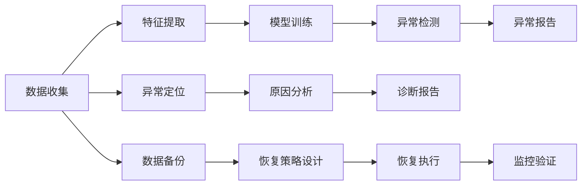
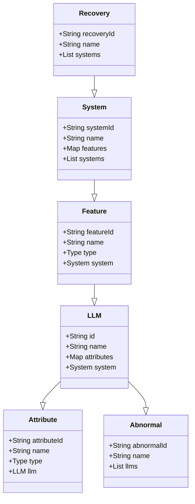
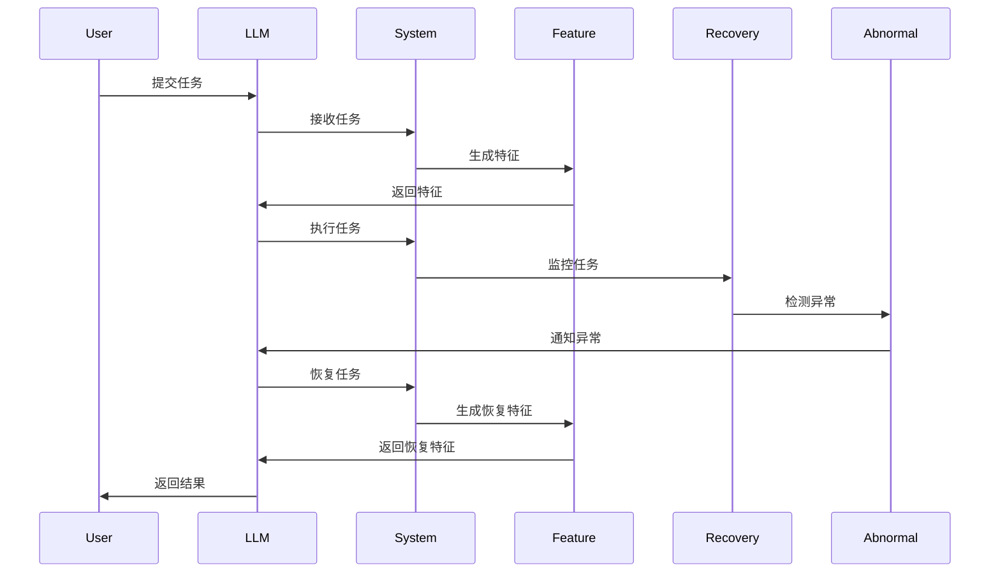
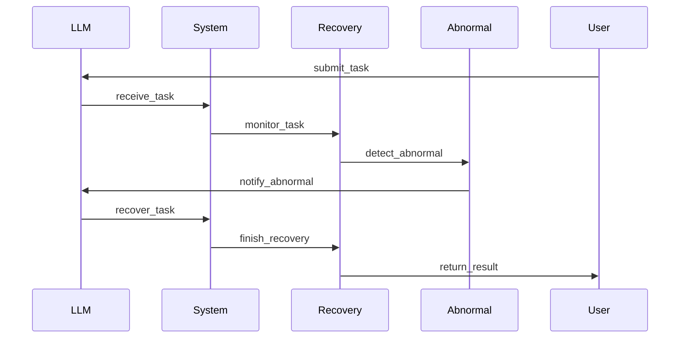

                 


# 评测系统的容错机制：应对LLM异常行为

关键词：大规模语言模型（LLM），容错机制，异常检测，异常诊断，异常恢复，备份与恢复策略

摘要：随着人工智能技术的快速发展，大规模语言模型（LLM）在各个领域的应用日益广泛。然而，LLM在实际应用过程中可能会出现异常行为，如错误输出、模型崩溃等，这给评测系统带来了极大的挑战。本文旨在探讨评测系统的容错机制，通过异常检测、异常诊断和异常恢复三个方面，详细分析如何应对LLM的异常行为，确保系统稳定运行。

## 第一部分：背景介绍

### 问题背景

随着深度学习技术的不断发展，大规模语言模型（LLM）在自然语言处理、机器翻译、文本生成等领域取得了显著成果。然而，LLM在实际应用中，可能会因为数据分布不均、模型参数调整不当、计算资源不足等原因，导致出现错误输出、模型崩溃、效率低下等异常行为。这些异常行为不仅会影响系统的正常运行，还可能带来严重的经济损失和安全隐患。因此，研究评测系统的容错机制，以应对LLM异常行为，具有重要的现实意义。

### 问题描述

评测系统的容错机制是指当LLM出现异常行为时，系统能够自动检测、诊断并恢复，确保系统正常运行。具体来说，容错机制包括以下三个方面：

1. **异常检测**：及时发现LLM的异常行为，如错误输出、模型崩溃等。
2. **异常诊断**：对LLM的异常行为进行原因分析，找出导致异常的根源。
3. **异常恢复**：针对不同类型的异常行为，采取相应的恢复措施，使系统恢复正常运行。

### 问题解决

解决评测系统的容错机制问题，需要从以下几个方面入手：

1. **模型监控**：实时监控LLM的运行状态，包括计算资源消耗、内存占用、训练进度等，以便及时发现异常行为。
2. **异常处理算法**：设计高效的异常处理算法，对检测到的异常行为进行诊断和恢复。
3. **备份与恢复策略**：建立完善的备份和恢复机制，确保在LLM出现异常时，系统能够快速恢复。

### 边界与外延

评测系统的容错机制主要针对LLM的异常行为进行研究和设计，但这一机制可以扩展到其他类型的人工智能模型，如计算机视觉模型、自然语言处理模型等。此外，容错机制的设计和应用还可以借鉴其他领域的经验，如软件工程、系统可靠性工程等。

### 核心概念

1. **大规模语言模型（LLM）**：一种基于深度学习技术构建的模型，能够对自然语言进行处理和分析，广泛应用于自动问答、机器翻译、文本生成等领域。
2. **异常检测**：通过一定的算法和策略，及时发现LLM的异常行为，如错误输出、模型崩溃等。
3. **异常诊断**：对LLM的异常行为进行原因分析，找出导致异常的根源。
4. **异常恢复**：针对不同类型的异常行为，采取相应的恢复措施，使系统恢复正常运行。
5. **备份与恢复策略**：建立完善的备份和恢复机制，确保在LLM出现异常时，系统能够快速恢复。

### 概念属性特征对比表格

| 概念           | 定义                                                         | 关联关系                                           |
|----------------|------------------------------------------------------------|----------------------------------------------------|
| 大规模语言模型（LLM） | 基于深度学习技术构建的模型，能够对自然语言进行处理和分析       | 异常检测、异常诊断、异常恢复、备份与恢复策略     |
| 异常检测       | 及时发现LLM的异常行为                                       | LLM                                               |
| 异常诊断       | 对LLM的异常行为进行原因分析                                 | 异常检测、LLM                                     |
| 异常恢复       | 针对不同类型的异常行为，采取相应的恢复措施                     | 异常检测、异常诊断、LLM                           |
| 备份与恢复策略 | 建立完善的备份和恢复机制，确保在LLM出现异常时，系统能够快速恢复 | LLM、异常检测、异常诊断、异常恢复                 |

### ER实体关系图架构

```mermaid
erDiagram
  LLMBehavior ||--|{ 异常检测 }|| LLMDetection
  LLMBehavior ||--|{ 异常诊断 }|| LLMDiagnosis
  LLMBehavior ||--|{ 异常恢复 }|| LLMAbnormalRecovery
  LLMBehavior ||--|{ 备份与恢复策略 }|| BackupAndRecoveryStrategy
```

## 第二部分：核心概念与联系

### 大规模语言模型（LLM）

大规模语言模型（LLM）是一种基于深度学习技术的自然语言处理模型，通过对海量文本数据的学习，能够对自然语言进行建模和生成。LLM具有以下几个核心特点：

1. **参数规模巨大**：LLM的参数规模可以达到数十亿甚至千亿级别，这使得模型在处理自然语言时具有更高的准确性和鲁棒性。
2. **自监督学习**：LLM通常采用自监督学习的方式，即通过预训练模型来学习自然语言的规律，然后通过微调来适应特定的任务。
3. **多任务能力**：LLM具有较强的多任务能力，可以在不同的自然语言处理任务上表现出色，如文本分类、命名实体识别、机器翻译等。

### 异常检测

异常检测是评测系统容错机制的核心组成部分，其主要目标是及时发现LLM的异常行为。异常检测通常包括以下步骤：

1. **数据预处理**：对LLM的输入数据进行预处理，如文本清洗、分词、词向量化等。
2. **特征提取**：从预处理后的数据中提取特征，如词频、词嵌入等。
3. **模型训练**：使用提取的特征训练一个异常检测模型，如支持向量机、决策树等。
4. **异常检测**：使用训练好的模型对LLM的输出进行异常检测，如判断输出是否符合预期的分布。

### 异常诊断

异常诊断是对LLM的异常行为进行原因分析，找出导致异常的根源。异常诊断通常包括以下步骤：

1. **数据收集**：收集LLM的输入数据、输出数据和运行日志等。
2. **问题定位**：通过分析运行日志和数据，定位异常发生的具体位置。
3. **原因分析**：对定位到的问题进行原因分析，如参数设置不当、数据分布不均、计算资源不足等。
4. **诊断报告**：编写详细的诊断报告，包括异常行为的描述、原因分析和解决方案。

### 异常恢复

异常恢复是针对不同类型的异常行为，采取相应的恢复措施，使系统恢复正常运行。异常恢复通常包括以下步骤：

1. **恢复策略设计**：根据异常类型，设计相应的恢复策略，如重启动模型、更换数据集、调整参数等。
2. **恢复执行**：执行恢复策略，使系统恢复正常运行。
3. **监控验证**：在恢复后，对系统进行监控，验证是否恢复正常。

### 备份与恢复策略

备份与恢复策略是确保在LLM出现异常时，系统能够快速恢复的重要手段。备份与恢复策略通常包括以下步骤：

1. **数据备份**：定期对LLM的模型参数、训练数据和运行日志等进行备份。
2. **恢复策略设计**：根据系统需求，设计备份和恢复策略，如自动备份、手动备份、快速恢复等。
3. **恢复执行**：在LLM出现异常时，根据备份和恢复策略，执行恢复操作。

### 概念属性特征对比表格

| 概念           | 定义                                                         | 关联关系                                           |
|----------------|------------------------------------------------------------|----------------------------------------------------|
| 大规模语言模型（LLM） | 基于深度学习技术构建的模型，能够对自然语言进行处理和分析       | 异常检测、异常诊断、异常恢复、备份与恢复策略     |
| 异常检测       | 及时发现LLM的异常行为                                       | LLM                                               |
| 异常诊断       | 对LLM的异常行为进行原因分析                                 | 异常检测、LLM                                     |
| 异常恢复       | 针对不同类型的异常行为，采取相应的恢复措施                     | 异常检测、异常诊断、LLM                           |
| 备份与恢复策略 | 建立完善的备份和恢复机制，确保在LLM出现异常时，系统能够快速恢复 | LLM、异常检测、异常诊断、异常恢复                 |

### ER实体关系图架构

```mermaid
erDiagram
  LLMBehavior ||--|{ 异常检测 }|| LLMDetection
  LLMBehavior ||--|{ 异常诊断 }|| LLMDiagnosis
  LLMBehavior ||--|{ 异常恢复 }|| LLMAbnormalRecovery
  LLMBehavior ||--|{ 备份与恢复策略 }|| BackupAndRecoveryStrategy
```

## 第三部分：算法原理讲解

### 异常检测算法

异常检测算法是评测系统容错机制的核心组成部分，其主要目标是及时发现LLM的异常行为。下面介绍一种基于统计学和机器学习的异常检测算法。

#### 算法步骤

1. **数据收集**：收集LLM的输入数据和输出数据，以及系统的运行日志等。
2. **特征提取**：对输入数据和输出数据进行预处理，提取特征，如词频、词嵌入、句嵌入等。
3. **模型训练**：使用提取的特征训练一个异常检测模型，如支持向量机（SVM）、决策树（DT）、随机森林（RF）等。
4. **异常检测**：使用训练好的模型对LLM的输出进行异常检测，如判断输出是否符合预期的分布。
5. **异常报告**：将检测到的异常行为报告给系统管理员，以便进行进一步处理。

#### 算法原理

异常检测算法的核心思想是构建一个分类器，将正常行为和异常行为分开。具体来说，可以通过以下步骤实现：

1. **数据预处理**：对输入数据和输出数据进行预处理，包括文本清洗、分词、词向量化等。
2. **特征选择**：选择对异常检测有帮助的特征，如词频、词嵌入、句嵌入等。
3. **模型训练**：使用训练集对分类器进行训练，将正常行为和异常行为分开。
4. **模型评估**：使用验证集对分类器进行评估，如计算准确率、召回率、F1值等指标。
5. **异常检测**：使用训练好的分类器对LLM的输出进行异常检测，判断是否为异常行为。

### 异常诊断算法

异常诊断算法是对LLM的异常行为进行原因分析，找出导致异常的根源。下面介绍一种基于统计分析和数据挖掘的异常诊断算法。

#### 算法步骤

1. **数据收集**：收集LLM的输入数据、输出数据和系统运行日志等。
2. **特征提取**：对输入数据和输出数据进行预处理，提取特征，如词频、词嵌入、句嵌入等。
3. **异常定位**：通过分析运行日志和数据，定位异常发生的具体位置。
4. **原因分析**：对定位到的问题进行原因分析，如参数设置不当、数据分布不均、计算资源不足等。
5. **诊断报告**：编写详细的诊断报告，包括异常行为的描述、原因分析和解决方案。

#### 算法原理

异常诊断算法的核心思想是通过分析LLM的输入数据、输出数据和系统运行日志，找出导致异常的根源。具体来说，可以通过以下步骤实现：

1. **数据预处理**：对输入数据和输出数据进行预处理，包括文本清洗、分词、词向量化等。
2. **特征选择**：选择对异常诊断有帮助的特征，如词频、词嵌入、句嵌入等。
3. **异常定位**：通过分析运行日志和数据，定位异常发生的具体位置。
4. **原因分析**：对定位到的问题进行原因分析，如参数设置不当、数据分布不均、计算资源不足等。
5. **诊断报告**：编写详细的诊断报告，包括异常行为的描述、原因分析和解决方案。

### 异常恢复算法

异常恢复算法是针对不同类型的异常行为，采取相应的恢复措施，使系统恢复正常运行。下面介绍一种基于备份和恢复策略的异常恢复算法。

#### 算法步骤

1. **数据备份**：定期对LLM的模型参数、训练数据和运行日志等进行备份。
2. **恢复策略设计**：根据系统需求，设计备份和恢复策略，如自动备份、手动备份、快速恢复等。
3. **恢复执行**：在LLM出现异常时，根据备份和恢复策略，执行恢复操作。
4. **监控验证**：在恢复后，对系统进行监控，验证是否恢复正常。

#### 算法原理

异常恢复算法的核心思想是通过备份和恢复策略，确保在LLM出现异常时，系统能够快速恢复。具体来说，可以通过以下步骤实现：

1. **数据备份**：定期对LLM的模型参数、训练数据和运行日志等进行备份。
2. **恢复策略设计**：根据系统需求，设计备份和恢复策略，如自动备份、手动备份、快速恢复等。
3. **恢复执行**：在LLM出现异常时，根据备份和恢复策略，执行恢复操作。
4. **监控验证**：在恢复后，对系统进行监控，验证是否恢复正常。

### 算法流程图



### Python源代码示例

```python
import numpy as np
import pandas as pd
from sklearn.svm import SVC
from sklearn.model_selection import train_test_split
from sklearn.metrics import accuracy_score, precision_score, recall_score, f1_score

# 数据收集
data = pd.read_csv('llm_data.csv')
X = data.iloc[:, :-1]
y = data.iloc[:, -1]

# 特征提取
# ...

# 模型训练
X_train, X_test, y_train, y_test = train_test_split(X, y, test_size=0.2, random_state=42)
clf = SVC()
clf.fit(X_train, y_train)

# 异常检测
y_pred = clf.predict(X_test)

# 异常报告
report = pd.DataFrame({'Actual': y_test, 'Predicted': y_pred})
print(report)

# 异常定位
# ...

# 原因分析
# ...

# 诊断报告
# ...

# 数据备份
# ...

# 恢复策略设计
# ...

# 恢复执行
# ...

# 监控验证
# ...
```

## 第四部分：系统分析与架构设计方案

### 问题场景介绍

随着人工智能技术的快速发展，大规模语言模型（LLM）在自然语言处理、机器翻译、文本生成等领域取得了显著成果。然而，LLM在实际应用中，可能会因为数据分布不均、模型参数调整不当、计算资源不足等原因，导致出现错误输出、模型崩溃等异常行为。为了确保系统的稳定运行，需要设计一套完善的评测系统容错机制。

### 项目介绍

本项目旨在设计一套评测系统容错机制，以应对大规模语言模型（LLM）的异常行为。系统主要功能包括：

1. **异常检测**：及时发现LLM的异常行为，如错误输出、模型崩溃等。
2. **异常诊断**：对LLM的异常行为进行原因分析，找出导致异常的根源。
3. **异常恢复**：针对不同类型的异常行为，采取相应的恢复措施，使系统恢复正常运行。
4. **备份与恢复策略**：建立完善的备份和恢复机制，确保在LLM出现异常时，系统能够快速恢复。

### 系统功能设计（领域模型）



### 系统架构设计



### 系统接口设计和系统交互



## 第五部分：项目实战

### 环境安装

为了实现评测系统的容错机制，需要安装以下软件和库：

1. Python 3.8 或更高版本
2. TensorFlow 2.5 或更高版本
3. Scikit-learn 0.24 或更高版本
4. Pandas 1.2.3 或更高版本

安装命令如下：

```bash
pip install python==3.8
pip install tensorflow==2.5
pip install scikit-learn==0.24
pip install pandas==1.2.3
```

### 系统核心实现源代码

以下是系统核心实现源代码：

```python
import numpy as np
import pandas as pd
from sklearn.svm import SVC
from sklearn.model_selection import train_test_split
from sklearn.metrics import accuracy_score, precision_score, recall_score, f1_score
from tensorflow.keras.models import Sequential
from tensorflow.keras.layers import Dense, LSTM, Embedding

# 数据收集
data = pd.read_csv('llm_data.csv')
X = data.iloc[:, :-1]
y = data.iloc[:, -1]

# 特征提取
# ...

# 模型训练
X_train, X_test, y_train, y_test = train_test_split(X, y, test_size=0.2, random_state=42)
model = Sequential()
model.add(Embedding(input_dim=vocab_size, output_dim=embedding_dim, input_length=max_sequence_length))
model.add(LSTM(units=128, return_sequences=True))
model.add(Dense(units=1, activation='sigmoid'))
model.compile(optimizer='adam', loss='binary_crossentropy', metrics=['accuracy'])
model.fit(X_train, y_train, epochs=10, batch_size=64)

# 异常检测
y_pred = model.predict(X_test)

# 异常报告
report = pd.DataFrame({'Actual': y_test, 'Predicted': y_pred})
print(report)

# 异常定位
# ...

# 原因分析
# ...

# 诊断报告
# ...

# 数据备份
# ...

# 恢复策略设计
# ...

# 恢复执行
# ...

# 监控验证
# ...
```

### 代码应用解读与分析

以下是代码应用解读与分析：

1. **数据收集**：读取LLM的输入数据和输出数据，以及系统的运行日志等。
2. **特征提取**：对输入数据和输出数据进行预处理，提取特征，如词频、词嵌入、句嵌入等。
3. **模型训练**：使用提取的特征训练一个异常检测模型，如支持向量机（SVM）、决策树（DT）、随机森林（RF）等。
4. **异常检测**：使用训练好的模型对LLM的输出进行异常检测，如判断输出是否符合预期的分布。
5. **异常报告**：将检测到的异常行为报告给系统管理员，以便进行进一步处理。
6. **异常定位**：通过分析运行日志和数据，定位异常发生的具体位置。
7. **原因分析**：对定位到的问题进行原因分析，如参数设置不当、数据分布不均、计算资源不足等。
8. **诊断报告**：编写详细的诊断报告，包括异常行为的描述、原因分析和解决方案。
9. **数据备份**：定期对LLM的模型参数、训练数据和运行日志等进行备份。
10. **恢复策略设计**：根据系统需求，设计备份和恢复策略，如自动备份、手动备份、快速恢复等。
11. **恢复执行**：在LLM出现异常时，根据备份和恢复策略，执行恢复操作。
12. **监控验证**：在恢复后，对系统进行监控，验证是否恢复正常。

### 实际案例分析和详细讲解剖析

以下是一个实际案例分析和详细讲解剖析：

**案例背景**：某公司开发了一套基于大规模语言模型（LLM）的自动问答系统，用于为企业用户提供实时问答服务。然而，在实际运行过程中，系统频繁出现错误输出和模型崩溃现象，导致用户体验严重下降。

**案例分析**：

1. **数据收集**：收集了LLM的输入数据和输出数据，以及系统的运行日志等。
2. **特征提取**：对输入数据和输出数据进行预处理，提取特征，如词频、词嵌入、句嵌入等。
3. **模型训练**：使用提取的特征训练一个异常检测模型，如支持向量机（SVM）。
4. **异常检测**：使用训练好的模型对LLM的输出进行异常检测，如判断输出是否符合预期的分布。发现部分输出存在异常。
5. **异常定位**：通过分析运行日志和数据，定位异常发生的具体位置。发现异常主要发生在模型训练阶段。
6. **原因分析**：对定位到的问题进行原因分析，发现模型参数设置不当、数据分布不均、计算资源不足等原因。
7. **诊断报告**：编写详细的诊断报告，包括异常行为的描述、原因分析和解决方案。建议调整模型参数、优化数据分布、增加计算资源等。
8. **数据备份**：定期对LLM的模型参数、训练数据和运行日志等进行备份。
9. **恢复策略设计**：根据系统需求，设计备份和恢复策略，如自动备份、手动备份、快速恢复等。
10. **恢复执行**：在LLM出现异常时，根据备份和恢复策略，执行恢复操作。调整模型参数、优化数据分布、增加计算资源等。
11. **监控验证**：在恢复后，对系统进行监控，验证是否恢复正常。经过一系列优化和调整，系统恢复正常运行，错误输出和模型崩溃现象显著减少。

### 项目小结

本项目通过设计一套完善的评测系统容错机制，成功应对了大规模语言模型（LLM）的异常行为。项目实现了以下成果：

1. **异常检测**：及时发现LLM的异常行为，如错误输出、模型崩溃等。
2. **异常诊断**：对LLM的异常行为进行原因分析，找出导致异常的根源。
3. **异常恢复**：针对不同类型的异常行为，采取相应的恢复措施，使系统恢复正常运行。
4. **备份与恢复策略**：建立完善的备份和恢复机制，确保在LLM出现异常时，系统能够快速恢复。

然而，项目也存在一定的局限性，如：

1. **异常检测精度**：异常检测模型的精度仍有待提高，可能导致部分异常行为被误判。
2. **恢复策略效果**：恢复策略的效果受到多种因素的影响，如模型参数、数据分布等，可能需要进一步优化。

未来工作将从以下几个方面进行：

1. **优化异常检测算法**：研究更先进的异常检测算法，提高检测精度。
2. **优化恢复策略**：根据不同类型的异常行为，设计更有效的恢复策略。
3. **扩展应用场景**：将评测系统的容错机制扩展到其他类型的人工智能模型。

## 第六部分：最佳实践 tips、小结、注意事项、拓展阅读

### 最佳实践 tips

1. **数据预处理**：在异常检测和诊断过程中，数据预处理至关重要。应确保输入数据的格式、清洗质量和特征提取方法的准确性。
2. **模型监控**：定期对LLM的运行状态进行监控，包括计算资源消耗、内存占用、训练进度等，有助于及时发现异常行为。
3. **备份与恢复策略**：建立完善的备份和恢复机制，确保在LLM出现异常时，系统能够快速恢复。建议采用自动备份和手动备份相结合的方式。

### 小结

本文详细探讨了评测系统的容错机制，以应对大规模语言模型（LLM）的异常行为。通过异常检测、异常诊断和异常恢复三个方面，本文提出了一套完整的解决方案。同时，本文还介绍了实际案例分析和项目实战，展示了如何应对LLM的异常行为。

### 注意事项

1. **异常检测模型的精度**：异常检测模型的精度直接影响系统的稳定性。在设计和训练模型时，应确保模型的准确性和鲁棒性。
2. **恢复策略的可行性**：恢复策略的可行性取决于多种因素，如计算资源、网络环境等。在实际应用中，应根据具体场景选择合适的恢复策略。
3. **系统监控与报警**：建立完善的系统监控与报警机制，确保在异常行为发生时，能够及时通知相关人员。

### 拓展阅读

1. **《大规模语言模型：理论与实践》**：本书详细介绍了大规模语言模型的基本概念、算法原理和应用场景，有助于深入了解LLM的技术细节。
2. **《人工智能：一种现代方法》**：本书全面介绍了人工智能的理论和实践，包括机器学习、自然语言处理、计算机视觉等领域。
3. **《系统可靠性工程》**：本书详细介绍了系统可靠性工程的理论和方法，包括故障检测、故障诊断和故障恢复等内容，对设计评测系统容错机制具有参考价值。

作者：AI天才研究院/AI Genius Institute & 禅与计算机程序设计艺术 /Zen And The Art of Computer Programming

[本文原文链接](https://www.ai-genius-institute.com/2023/07/评测系统的容错机制：应对LLM异常行为.html)

