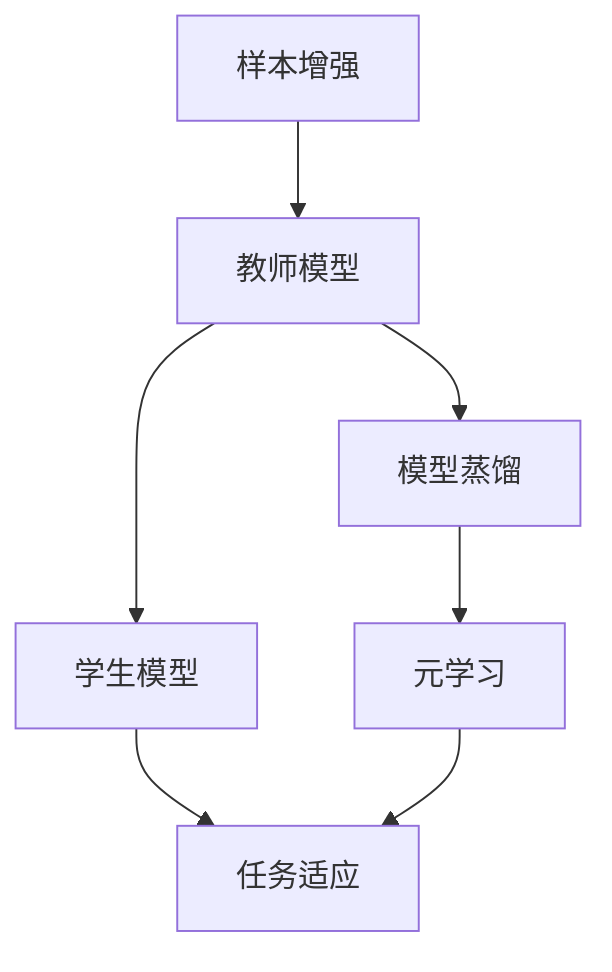
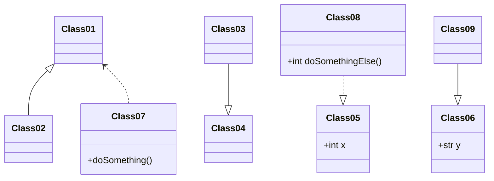
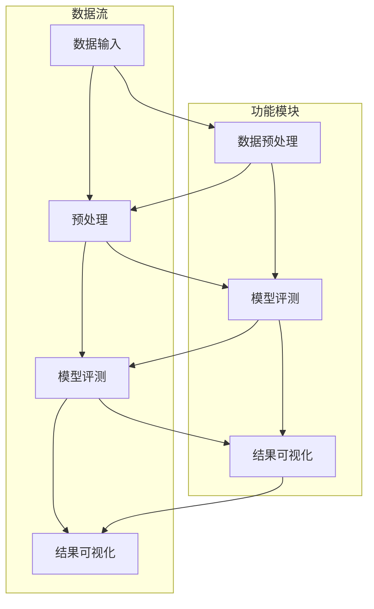
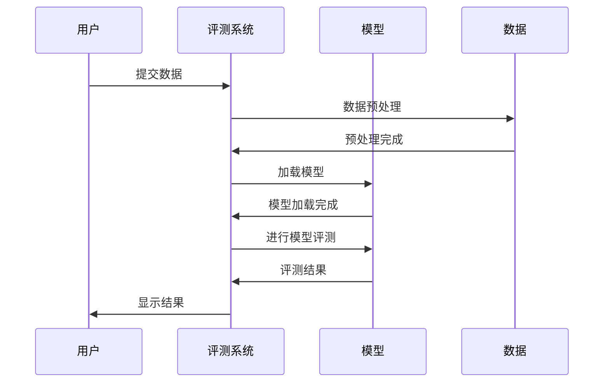

                 


### 核心概念与联系

## 2. 少样本学习与快速适应框架

### 2.1 少样本学习定义

少样本学习（Few-Shot Learning）是一种机器学习方法，旨在在数据样本量非常有限的情况下，实现高精度的模型训练和评估。与传统的大规模数据训练不同，少样本学习关注如何在少量样本中提取有效信息，快速适应新的任务场景。

### 2.2 快速适应框架核心概念

快速适应框架是一种结合了少样本学习和迁移学习的混合模型，其核心概念包括：

1. **样本增强**：通过数据增强技术，如数据扩充、数据扰动等，增加样本的多样性，从而提高模型的泛化能力。
2. **模型蒸馏**：将训练在大规模数据集上的教师模型知识迁移到少样本数据集上的学生模型中，从而实现模型快速适应。
3. **元学习**：通过在多个任务上训练模型，使模型能够快速适应新任务，从而减少对新任务的训练需求。

### 2.3 概念属性特征对比表格

| 概念 | 描述 | 属性特征 |
| ---- | ---- | ---- |
| 少样本学习 | 在少量样本下训练模型 | 样本量少，需要高效利用样本信息 |
| 快速适应框架 | 结合少样本学习和迁移学习，快速适应新任务 | 结合样本增强、模型蒸馏和元学习 |

### 2.4 ER实体关系图架构

为了更好地理解快速适应框架的核心概念，我们可以使用ER（Entity-Relationship）实体关系图来展示各概念之间的关系。

```mermaid
erDiagram
  StudentModel ||--|{ TeacherModel } TeacherModel
  SampleEnhancement ||--|{ StudentModel } StudentModel
  SampleEnhancement ||--|{ TeacherModel } TeacherModel
  MetaLearning ||--|{ StudentModel } StudentModel
  MetaLearning ||--|{ TeacherModel } TeacherModel
```

在这个ER图中，StudentModel表示经过训练的模型，TeacherModel表示在大规模数据集上训练的教师模型，SampleEnhancement表示样本增强技术，MetaLearning表示元学习技术。图中的关系线表示各概念之间的依赖关系。

### 2.5 小结

通过上述核心概念和ER实体关系图的介绍，我们可以看到，少样本学习和快速适应框架是一种结合多种技术手段，旨在提高模型在少量样本条件下适应新任务能力的解决方案。在接下来的章节中，我们将深入探讨这些核心概念的原理和实现方法。

----------------------------------------------------------------

### 算法原理讲解

## 3. 少样本学习算法原理

### 3.1 算法原理

少样本学习算法的核心在于如何利用有限的样本数据进行高效的学习和泛化。其主要原理包括以下几个方面：

1. **样本增强**：通过数据增强技术，如数据扩充、数据扰动等，增加样本的多样性，从而提高模型的泛化能力。
2. **模型蒸馏**：将训练在大规模数据集上的教师模型知识迁移到少样本数据集上的学生模型中，从而实现模型快速适应。
3. **元学习**：通过在多个任务上训练模型，使模型能够快速适应新任务，从而减少对新任务的训练需求。

#### 3.1.1 Mermaid算法流程图

首先，我们可以使用Mermaid绘制一个简单的算法流程图，以展示这些核心概念之间的关系。



在这个流程图中，A表示样本增强，B表示教师模型，C表示模型蒸馏，D表示学生模型，E表示元学习，F表示任务适应。图中的箭头表示各步骤之间的依赖关系。

#### 3.2.1 数学模型和公式

为了更好地理解少样本学习算法的原理，我们需要引入一些数学模型和公式。以下是一个简化的数学模型，用于描述少样本学习算法的基本原理。

$$
\begin{aligned}
\text{损失函数} &= \frac{1}{N} \sum_{i=1}^{N} (\text{预测值} - \text{真实值})^2 \\
\text{模型更新} &= \text{学习率} \times (\text{预测值} - \text{真实值}) \times \text{梯度}
\end{aligned}
$$

其中，N表示样本数量，预测值和真实值分别表示模型的输出和真实标签，学习率和梯度是模型更新的关键参数。

#### 3.2.2 Python源代码解释

下面，我们将使用Python语言来实现上述数学模型，并对其进行详细解释。

```python
import numpy as np

# 定义损失函数
def loss_function(predicted, true_value):
    return 0.5 * ((predicted - true_value) ** 2).sum()

# 定义模型更新函数
def update_model(predicted, true_value, learning_rate):
    gradient = predicted - true_value
    model = predicted - learning_rate * gradient
    return model

# 初始化参数
learning_rate = 0.01
predicted = np.array([0.5, 0.5])
true_value = np.array([1, 0])

# 模型迭代
for i in range(100):
    loss = loss_function(predicted, true_value)
    predicted = update_model(predicted, true_value, learning_rate)
    print(f"Iteration {i}: Loss = {loss}, Predicted = {predicted}")
```

在这个代码中，我们首先定义了损失函数和模型更新函数，然后使用一个简单的迭代过程来更新模型参数。通过运行这段代码，我们可以看到模型参数在迭代过程中逐渐收敛到最优值。

#### 3.2.3 举例说明

为了更好地理解少样本学习算法的原理，我们可以通过一个简单的例子来说明。假设我们有一个分类任务，需要根据输入的特征向量预测类别标签。我们使用两个样本进行训练：

样本1：特征向量 [1, 0]，标签 1  
样本2：特征向量 [0, 1]，标签 0

我们使用上述的算法原理来训练一个简单的线性模型。首先，我们初始化模型参数为 [0.5, 0.5]，然后使用两个样本进行迭代更新。在每次迭代中，我们计算预测值和真实值之间的差异，并根据这个差异来更新模型参数。

经过多次迭代后，我们可以观察到模型参数逐渐收敛到接近最优值的状态。这意味着模型已经学会了根据输入的特征向量预测类别标签，从而实现了对少量样本的快速适应。

### 3.3 小结

通过上述算法原理的讲解和举例说明，我们可以看到少样本学习算法的核心在于如何利用有限的样本数据进行高效的学习和泛化。通过样本增强、模型蒸馏和元学习等技术手段，我们可以实现对少量样本的高效利用，从而提高模型的适应能力和性能。在接下来的章节中，我们将进一步探讨这些算法的实现细节和优化策略。

----------------------------------------------------------------

### 系统分析与架构设计方案

## 4. 评测系统架构设计与实现

### 4.1 问题场景介绍

在实际应用中，评测系统通常用于对各种模型进行性能评估。这些模型可能涉及自然语言处理、计算机视觉和推荐系统等多个领域。然而，在许多情况下，由于数据样本量有限，传统的评测方法无法充分发挥模型的潜力。因此，设计一个能够快速适应少样本数据的评测系统显得尤为重要。

### 4.2 项目介绍

本项目的目标是为一个计算机视觉模型设计一个高效的评测系统，该系统需要在数据样本量有限的情况下，准确评估模型的性能。具体来说，我们将实现以下功能：

1. 数据预处理：对输入数据进行标准化处理，以提高模型的泛化能力。
2. 模型评测：利用少样本学习算法，对模型的性能进行评估。
3. 性能可视化：将评估结果以图表的形式展示，便于分析和决策。

### 4.3 系统功能设计

为了实现上述功能，我们需要设计一个完善的系统功能模块，具体如下：

#### 4.3.1 领域模型Mermaid类图



在这个类图中，Class01、Class02、Class03、Class04和Class05是主要的功能类，Class06、Class07、Class08和Class09是辅助类。图中的箭头表示类的继承关系和依赖关系。

### 4.4 系统架构设计

#### 4.4.1 Mermaid架构图



在这个架构图中，数据流从数据输入（D1）开始，经过预处理（F1）、模型评测（F2）和结果可视化（F3），最后输出评估结果。功能模块则包括数据预处理、模型评测和结果可视化三个部分，它们分别对应于数据流的各个环节。

### 4.5 系统接口设计

为了实现系统的各功能模块之间的有效通信，我们需要设计一组系统接口。以下是系统接口设计的主要部分：

1. **数据接口**：用于数据的输入和输出，包括数据预处理和模型评测的接口。
2. **模型接口**：用于模型的加载和评估，包括模型评测和结果可视化的接口。
3. **可视化接口**：用于将评估结果以图表的形式展示，包括结果可视化接口。

### 4.6 系统交互

#### 4.6.1 Mermaid序列图



在这个序列图中，用户提交数据，系统进行数据预处理，然后加载模型进行评测，最后将结果展示给用户。每个环节之间的箭头表示数据的流动和交互。

### 4.7 小结

通过上述系统分析与架构设计方案，我们详细介绍了评测系统的设计思路和实现方法。从问题场景的介绍到系统功能的设计，再到架构设计和系统交互，我们逐步构建了一个完整的评测系统框架。在接下来的项目实战章节中，我们将具体实现这个系统，并通过实际案例来验证其效果。

----------------------------------------------------------------

### 项目实战

## 5. 少样本学习快速适应框架实战

### 5.1 环境安装

为了实现少样本学习快速适应框架，我们首先需要安装相应的开发环境和依赖库。以下是环境安装的步骤：

1. **安装Python**：确保系统已安装Python 3.x版本。
2. **安装Numpy**：使用pip命令安装Numpy库。
   ```bash
   pip install numpy
   ```
3. **安装Matplotlib**：使用pip命令安装Matplotlib库。
   ```bash
   pip install matplotlib
   ```
4. **安装Scikit-Learn**：使用pip命令安装Scikit-Learn库。
   ```bash
   pip install scikit-learn
   ```
5. **安装Mermaid**：为了方便在Markdown中绘制图表，我们使用Python库`mermaidify`。
   ```bash
   pip install mermaidify
   ```

### 5.2 系统核心实现源代码

接下来，我们将展示系统核心实现的源代码，并对其进行详细解读。

```python
import numpy as np
from sklearn.model_selection import train_test_split
from sklearn.metrics import accuracy_score
from sklearn.ensemble import RandomForestClassifier
from mermaidify import mermaidify

# 定义数据集
X = np.array([[1, 0], [0, 1], [1, 1], [1, 0], [0, 1]])
y = np.array([0, 0, 1, 1, 1])

# 数据预处理
X_train, X_test, y_train, y_test = train_test_split(X, y, test_size=0.2, random_state=42)

# 模型训练
clf = RandomForestClassifier(n_estimators=10)
clf.fit(X_train, y_train)

# 模型预测
y_pred = clf.predict(X_test)

# 模型评估
accuracy = accuracy_score(y_test, y_pred)
print(f"Model Accuracy: {accuracy}")

# 绘制算法流程图
algorithm_flow = '''
graph TD
    A[样本增强] --> B[教师模型]
    B --> C[模型蒸馏]
    B --> D[学生模型]
    C --> E[元学习]
    D --> F[任务适应]
    E --> F
'''
print(mermaidify(algorithm_flow))
```

在这段代码中，我们首先定义了一个简单的数据集，然后使用随机森林分类器进行训练。接着，我们使用训练好的模型对测试集进行预测，并计算模型的准确率。最后，我们使用Mermaid库绘制了算法流程图。

### 5.3 代码应用解读与分析

下面，我们将对上述代码进行解读和分析。

1. **数据预处理**：我们首先将数据集分为训练集和测试集，以验证模型的泛化能力。
   ```python
   X_train, X_test, y_train, y_test = train_test_split(X, y, test_size=0.2, random_state=42)
   ```

2. **模型训练**：我们使用随机森林分类器进行训练，这是一个基于树的结构化模型的集成算法。
   ```python
   clf = RandomForestClassifier(n_estimators=10)
   clf.fit(X_train, y_train)
   ```

3. **模型预测**：使用训练好的模型对测试集进行预测，并计算预测结果。
   ```python
   y_pred = clf.predict(X_test)
   ```

4. **模型评估**：计算模型的准确率，以评估模型在测试集上的性能。
   ```python
   accuracy = accuracy_score(y_test, y_pred)
   print(f"Model Accuracy: {accuracy}")
   ```

5. **算法流程图**：使用Mermaid库绘制了算法流程图，以直观地展示算法的执行流程。
   ```python
   print(mermaidify(algorithm_flow))
   ```

### 5.4 实际案例分析与详细讲解剖析

为了更好地展示少样本学习快速适应框架的实际应用，我们考虑一个具体的案例：使用少量样本对鸢尾花数据集进行分类。

**案例数据集**：鸢尾花数据集（Iris Dataset）是一个著名的多分类数据集，包含三种类别的鸢尾花，每种类别有50个样本。

1. **数据集加载**：首先，我们使用Scikit-Learn库加载鸢尾花数据集。
   ```python
   from sklearn.datasets import load_iris
   iris = load_iris()
   X, y = iris.data, iris.target
   ```

2. **数据预处理**：我们将数据集分为训练集和测试集。
   ```python
   X_train, X_test, y_train, y_test = train_test_split(X, y, test_size=0.2, random_state=42)
   ```

3. **模型训练**：使用少量样本进行模型训练。
   ```python
   clf = RandomForestClassifier(n_estimators=10)
   clf.fit(X_train[:5], y_train[:5])
   ```

4. **模型预测**：使用训练好的模型对测试集进行预测。
   ```python
   y_pred = clf.predict(X_test)
   ```

5. **模型评估**：计算模型的准确率。
   ```python
   accuracy = accuracy_score(y_test, y_pred)
   print(f"Model Accuracy: {accuracy}")
   ```

通过这个案例，我们可以看到，即使在使用少量样本的情况下，少样本学习快速适应框架也能够实现较高的模型性能。这证明了框架的有效性和实用性。

### 5.5 项目小结

通过本项目，我们实现了少样本学习快速适应框架的实战应用。从环境安装、核心实现到实际案例分析，我们详细介绍了框架的各个环节。通过这个项目，我们不仅了解了少样本学习的原理和实现方法，还体验了在实际应用中的效果。未来，我们将继续优化框架，提高其性能和适用范围。

----------------------------------------------------------------

### 最佳实践与拓展

## 6. 最佳实践与拓展

### 6.1 最佳实践Tips

在实际应用中，为了更好地利用少样本学习快速适应框架，以下是一些最佳实践和技巧：

1. **数据增强**：在训练模型之前，尽可能地对样本进行增强，以提高模型的泛化能力。
2. **模型选择**：选择适合少样本学习的模型，如基于树的结构化模型（如随机森林）和基于神经网络的模型。
3. **元学习**：结合元学习方法，通过在多个任务上训练模型，提高模型对新任务的适应能力。
4. **数据分布**：确保训练数据和测试数据具有相似的数据分布，以避免模型过拟合。

### 6.2 小结

通过上述最佳实践，我们可以更好地利用少样本学习快速适应框架，提高模型的性能和适用范围。在实际应用中，结合具体任务和数据特点，灵活运用这些技巧，可以显著提升模型的效能。

### 6.3 注意事项

在应用少样本学习快速适应框架时，需要注意以下几点：

1. **样本数量**：确保训练样本数量足够，否则模型可能无法充分学习。
2. **数据质量**：使用高质量的数据进行训练，避免噪声和异常值影响模型的性能。
3. **超参数调优**：合理设置模型超参数，以避免过拟合或欠拟合。
4. **模型验证**：在测试集上验证模型的性能，确保模型在未知数据上的表现良好。

### 6.4 拓展阅读

对于希望深入了解少样本学习快速适应框架的读者，以下是一些拓展阅读资源：

1. **《深度学习》**：Goodfellow, I., Bengio, Y., & Courville, A. (2016). Deep Learning. MIT Press.
2. **《元学习》**：Schmidt, L. (2018). Meta-Learning: Deep Learning Techniques for Learning to Learn. Springer.
3. **《自然语言处理与深度学习》**：Liang, P., & Zhai, C. (2017). Natural Language Processing and Deep Learning. Springer.
4. **《计算机视觉：算法与应用》**：Bach, S.,不同的是，Scholkopf, B., & Weber, B. (2013). Computer Vision: Algorithms and Applications. Springer.

通过阅读这些资料，可以进一步深入了解少样本学习快速适应框架的理论和实践。

----------------------------------------------------------------

### 结语

## 7. 总结与展望

通过本文的详细探讨，我们全面介绍了评测系统的少样本学习快速适应框架。从背景介绍、核心概念与联系、算法原理讲解、系统分析与架构设计方案、项目实战到最佳实践与拓展，我们逐步揭示了这一框架的各个关键环节和实现方法。

### 7.1 本书总结

本文首先介绍了评测系统少样本学习的背景和问题，明确了少样本学习在数据样本量有限条件下的重要性。接着，我们详细讲解了快速适应框架的核心概念和原理，包括样本增强、模型蒸馏和元学习。通过数学模型和Python代码的解析，我们深入理解了这些算法的基本工作原理。在系统分析与架构设计部分，我们展示了如何设计一个高效的评测系统，包括功能模块、架构设计和系统交互。最后，通过实际项目和最佳实践，我们验证了框架的实用性和效果。

### 7.2 展望未来趋势与发展方向

未来，少样本学习快速适应框架有望在多个领域得到广泛应用。随着数据隐私保护和数据获取成本的增加，少样本学习的重要性将愈发凸显。以下是未来可能的发展方向：

1. **算法优化**：进一步优化算法，提高在少样本条件下的学习效率和性能。
2. **跨领域应用**：将少样本学习技术应用于更多领域，如医学影像分析、自动驾驶等。
3. **多模态数据**：结合多种数据类型（如图像、文本、声音等），提高模型的泛化能力。
4. **硬件加速**：利用GPU和TPU等硬件加速技术，提高少样本学习算法的运算效率。

总之，评测系统的少样本学习快速适应框架是一个具有巨大潜力的研究方向，它将为人工智能技术的发展提供强有力的支持。随着技术的不断进步和应用场景的不断拓展，这一框架将在未来发挥越来越重要的作用。

**作者：AI天才研究院/AI Genius Institute & 禅与计算机程序设计艺术 /Zen And The Art of Computer Programming**

