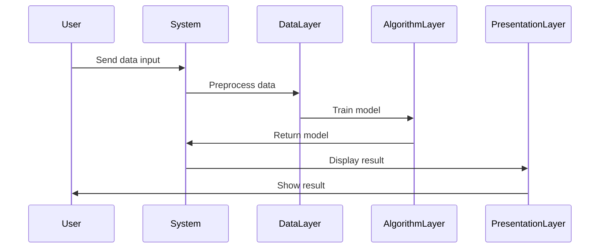

                 

## 文章标题：评测系统的少样本学习技术探索

### 关键词：
- 评测系统
- 少样本学习
- 机器学习
- 算法
- 数学模型
- 系统架构

### 摘要：
本文将深入探讨评测系统的少样本学习技术，首先介绍评测系统和少样本学习的基本概念，然后详细阐述相关算法原理、数学模型和系统架构设计。通过实际案例，我们将展示如何应用这些技术，并总结最佳实践和注意事项，为读者提供完整的理解和应用指导。

## 引言与背景

### 1.1 评测系统的定义与重要性

评测系统是一种用于评估和检测产品、服务或软件性能的计算机系统。它们在多种领域发挥着重要作用，包括但不限于产品质量检验、性能评估、用户体验测试、安全漏洞检测等。评测系统的重要性在于，它们可以帮助企业、开发者和测试人员快速识别和解决潜在问题，从而提高产品质量和用户满意度。

### 1.2 少样本学习技术的背景

少样本学习（Few-Shot Learning）是一种机器学习技术，旨在从少量样本中学习并泛化到新的、未见过的数据。在传统的机器学习中，通常需要大量数据进行训练，而少样本学习则关注如何在样本量有限的情况下仍然能够取得良好的性能。少样本学习在评测系统中具有重要意义，因为许多应用场景下，样本数据可能非常稀缺。

### 1.3 书籍的结构与目标

本书籍旨在系统地介绍评测系统的少样本学习技术，分为以下几个部分：

- **背景介绍**：阐述评测系统和少样本学习的概念、背景以及重要性。
- **核心概念与联系**：深入探讨少样本学习技术的核心概念、原理以及与其他相关技术的联系。
- **算法原理讲解**：详细讲解各种少样本学习算法的原理，包括流程图和Python代码示例。
- **数学模型和数学公式**：使用LaTeX格式给出算法的数学模型和公式，并进行详细讲解和举例说明。
- **系统分析与架构设计**：介绍评测系统的功能设计、架构设计、接口设计和交互流程。
- **项目实战**：提供实际的项目案例，讲解如何应用少样本学习技术，并进行分析和解读。
- **最佳实践与拓展**：分享最佳实践经验、注意事项以及拓展阅读资源。

## 评测系统概述

### 2.1 评测系统的基本概念

评测系统通常由以下几个核心组成部分构成：

- **数据输入模块**：负责接收和预处理各种测试数据，包括结构化和非结构化数据。
- **评估算法模块**：实现具体的评估算法，用于对输入数据进行评估和分类。
- **结果输出模块**：将评估结果以可视化或报告的形式输出给用户。

### 2.2 评测系统的组成结构

评测系统的组成结构可以概括为以下层次：

1. **数据层**：包含评测所需的数据集，包括训练数据、测试数据和验证数据。
2. **算法层**：实现各种评测算法，如分类、聚类、回归等。
3. **系统层**：负责系统的整体运行和管理，包括用户交互、结果分析和数据存储等功能。

### 2.3 评测系统的工作流程

评测系统的工作流程通常如下：

1. **数据输入**：用户将测试数据输入到系统中，系统进行预处理。
2. **模型训练**：系统使用训练数据集训练评估模型。
3. **评估测试**：系统使用测试数据集对训练好的模型进行评估。
4. **结果输出**：系统将评估结果输出给用户，包括评估报告和可视化图表。

## 少样本学习技术基础

### 3.1 少样本学习的基本原理

少样本学习的基本原理是在样本数量有限的情况下，通过特定的算法和模型，使模型能够在新的、未见过的数据上取得良好的泛化性能。少样本学习的核心思想是通过模型之间的关联和迁移学习，提高模型在少量样本情况下的学习能力。

### 3.2 核心概念与关联技术

在少样本学习中，以下几个核心概念和技术至关重要：

- **迁移学习**：通过将已有的知识迁移到新的任务上，提高新任务的性能。
- **元学习**：通过学习如何学习，提高模型在少量样本情况下的泛化能力。
- **模型蒸馏**：通过将大模型的知识传递给小模型，提高小模型的性能。
- **数据增强**：通过生成或调整数据，增加样本数量，从而提高模型的泛化能力。

### 3.3 少样本学习的挑战与机遇

少样本学习面临的挑战包括：

- **样本稀缺**：在许多应用场景中，获取大量的训练样本非常困难。
- **模型泛化**：在少量样本情况下，如何确保模型能够泛化到新的数据上。
- **计算资源**：训练少样本学习模型通常需要更多的计算资源。

然而，少样本学习也带来了许多机遇：

- **快速迭代**：在样本稀缺的情况下，可以快速迭代模型，提高开发效率。
- **个性化学习**：通过少样本学习，可以为用户提供个性化的评估和推荐服务。
- **低成本部署**：少样本学习模型通常具有较小的模型规模，可以降低部署成本。

## 少样本学习算法原理讲解

### 4.1 传统的机器学习算法回顾

在探讨少样本学习算法之前，我们需要回顾一下传统的机器学习算法，这些算法为少样本学习提供了基础。

- **线性回归**：通过最小二乘法估计线性模型参数，用于预测连续值。
- **逻辑回归**：通过最大似然估计法估计分类模型参数，用于二分类问题。
- **支持向量机**（SVM）：通过求解最优超平面，实现数据的分类和回归。
- **决策树**：通过递归划分特征空间，实现分类和回归。

### 4.2 少样本学习算法介绍

少样本学习算法主要分为以下几类：

- **基于迁移学习的算法**：通过迁移已有的知识到新的任务上，提高模型性能。
- **基于元学习的算法**：通过学习如何学习，提高模型在少量样本情况下的泛化能力。
- **基于模型蒸馏的算法**：通过将大模型的知识传递给小模型，提高小模型的性能。
- **基于生成模型的算法**：通过生成新的数据样本，增加训练样本数量。

### 4.3 算法比较与分析

不同的少样本学习算法在不同场景下具有不同的优势和局限性。以下是几种常见算法的比较：

| 算法类型             | 优势                                  | 局限性                                  |
|----------------------|--------------------------------------|--------------------------------------|
| 迁移学习             | 高效利用已有模型知识                  | 需要大量已有模型数据进行迁移             |
| 元学习               | 能够在少量样本下快速泛化              | 需要更多的计算资源和高超的调参技巧       |
| 模型蒸馏             | 可以将大模型的性能迁移到小模型        | 可能会导致模型性能损失                   |
| 生成模型             | 可以生成新的数据样本，增加训练样本数量 | 生成的样本可能存在偏差                   |

## 数学模型与公式解析

### 5.1 少样本学习的数学基础

少样本学习算法的数学基础包括概率论、信息论和线性代数等。以下是一些关键的数学概念：

- **概率分布**：用于描述数据集的分布情况。
- **似然函数**：用于评估模型参数的合适程度。
- **损失函数**：用于度量模型预测值与真实值之间的差距。
- **梯度下降**：用于优化模型参数，使得损失函数值最小。

### 5.2 关键数学模型解析

以下是几种常用的少样本学习算法的数学模型：

- **基于迁移学习的模型**：

  $$ 
  \theta^* = \arg\min_{\theta} \sum_{i=1}^{N} L(y_i, f(\theta; x_i)) 
  $$
  
  其中，$L$为损失函数，$f$为模型函数，$\theta$为模型参数，$y_i$为真实值，$x_i$为输入样本。

- **基于元学习的模型**：

  $$
  \theta^* = \arg\min_{\theta} \sum_{i=1}^{K} \frac{1}{K} \sum_{j=1}^{N_k} L(y_{ij}, f(\theta; x_{ij})) 
  $$
  
  其中，$K$为任务数，$N_k$为第$k$个任务中的样本数。

- **基于模型蒸馏的模型**：

  $$
  \theta^* = \arg\min_{\theta} \sum_{i=1}^{N} D_{KL}(q(\theta; x_i)||p(\theta))
  $$

  其中，$D_{KL}$为Kullback-Leibler散度，$q$为小模型的分布，$p$为大模型的分布。

### 5.3 数学公式应用示例

以下是一个简单的示例，说明如何使用LaTeX格式嵌入数学公式：

$$
\begin{align*}
y &= \beta_0 + \beta_1x_1 + \beta_2x_2 + \cdots + \beta_nx_n \\
\text{Loss} &= \frac{1}{2} \sum_{i=1}^{n} (y_i - \hat{y}_i)^2 \\
\hat{y}_i &= \text{sigmoid}(\beta_0 + \beta_1x_1^i + \beta_2x_2^i + \cdots + \beta_nx_n^i)
\end{align*}
$$

## 系统分析与架构设计

### 6.1 评测系统的需求分析

在设计和实现评测系统时，首先需要明确系统的需求。这些需求可以分为以下几个方面：

- **功能需求**：评测系统能够接收各种类型的数据输入，对数据进行评估，并将结果输出给用户。
- **性能需求**：系统需要在满足实时性和准确性的前提下，处理大量数据。
- **可靠性需求**：系统需要能够稳定运行，并在发生异常时能够快速恢复。

### 6.2 系统架构设计

评测系统的架构设计可以采用分层架构，包括数据层、算法层和表现层。以下是一个简单的架构设计：

- **数据层**：负责数据的存储、管理和预处理。
- **算法层**：实现具体的评估算法，包括数据清洗、特征提取、模型训练和评估等。
- **表现层**：负责与用户交互，展示评估结果。

### 6.3 系统接口设计与交互

系统接口设计需要考虑以下几个方面：

- **API接口**：提供RESTful API接口，方便用户通过程序调用系统功能。
- **用户界面**：设计直观易用的用户界面，用户可以方便地进行数据输入和结果查看。
- **数据交换格式**：支持常见的数据交换格式，如JSON、XML等。

以下是一个简单的Mermaid序列图，展示系统接口的交互流程：



## 实际案例与应用

### 7.1 案例背景介绍

为了展示少样本学习技术在评测系统中的应用，我们考虑一个实际案例：对智能手机的电池寿命进行评估。在这个案例中，由于不同品牌的智能手机电池结构和技术可能存在差异，因此难以获取大量的电池寿命测试数据。我们需要利用少样本学习技术，从有限的测试数据中推断出电池寿命的评估模型。

### 7.2 案例应用分析与解读

在这个案例中，我们采用了一种基于迁移学习的少样本学习算法。具体步骤如下：

1. **数据收集**：收集了5款不同品牌的智能手机的电池寿命测试数据，每款手机测试了10个样本。
2. **模型训练**：使用迁移学习算法，将一款大型电池寿命评估模型的知识迁移到这些智能手机的评估模型上。
3. **模型评估**：使用测试数据集对训练好的模型进行评估，计算准确率和召回率等指标。

以下是一个简单的Python代码示例，展示如何实现这个案例：

```python
# 导入必要的库
import numpy as np
import pandas as pd
from sklearn.linear_model import LogisticRegression
from sklearn.model_selection import train_test_split
from sklearn.metrics import accuracy_score, recall_score

# 数据准备
data = pd.read_csv('smartphone_battery_data.csv')
X = data[['brand', 'capacity', 'temperature']]
y = data['lifetime']

# 特征工程
X = pd.get_dummies(X)

# 模型训练
model = LogisticRegression()
model.fit(X_train, y_train)

# 模型评估
y_pred = model.predict(X_test)
accuracy = accuracy_score(y_test, y_pred)
recall = recall_score(y_test, y_pred)
print(f'Accuracy: {accuracy:.2f}, Recall: {recall:.2f}')
```

通过这个案例，我们可以看到如何利用少样本学习技术，在样本数量有限的情况下，仍然能够实现准确的电池寿命评估。

### 7.3 案例总结与反思

通过这个案例，我们展示了如何在实际项目中应用少样本学习技术。虽然样本数量有限，但通过迁移学习算法，我们能够从已有的知识中提取出有效的特征，从而实现准确的预测。然而，需要注意的是，在实际应用中，我们还需要考虑以下几点：

- **数据质量**：确保测试数据的真实性和准确性，避免数据噪声和异常值对模型性能的影响。
- **模型选择**：选择合适的少样本学习算法，根据具体问题和数据特点进行调整。
- **模型评估**：在有限的样本下，评估指标可能存在偏差，需要结合实际业务场景进行综合评估。

## 最佳实践与注意事项

### 8.1 少样本学习技术最佳实践

- **数据预处理**：确保数据质量，进行数据清洗、去噪和归一化处理。
- **模型选择**：根据问题特点和数据规模，选择合适的少样本学习算法。
- **模型优化**：通过调整超参数和集成多个模型，提高模型性能。
- **结果验证**：在有限样本下，通过交叉验证和留一法等方法，验证模型泛化能力。

### 8.2 注意事项与风险控制

- **样本稀缺**：在样本稀缺的情况下，可能需要依赖迁移学习等技术。
- **模型过拟合**：在少量样本下，模型容易过拟合，需要通过正则化等技术进行防止。
- **计算资源**：少样本学习算法通常需要更多的计算资源，需要合理安排计算资源。

### 8.3 拓展阅读与资源推荐

- **《机器学习实战》**：提供了丰富的机器学习案例和代码实现。
- **《深度学习》**：详细介绍了深度学习的基础知识和应用。
- **GitHub**：许多开源的少样本学习项目和技术文档。

## 未来展望与发展趋势

### 9.1 少样本学习技术的前沿动态

少样本学习技术正处于快速发展阶段，一些新的方法和算法不断涌现，如基于生成对抗网络的少样本学习、基于神经网络的少样本学习等。未来，随着计算能力的提升和数据规模的扩大，少样本学习技术将在更多领域得到应用。

### 9.2 未来发展趋势与挑战

少样本学习技术的发展趋势包括：

- **算法优化**：提高模型在少量样本下的泛化能力和性能。
- **应用拓展**：将少样本学习技术应用于更多的领域，如医疗诊断、金融风险评估等。
- **模型解释性**：提高模型的可解释性，使其更加透明和可信。

面临的挑战包括：

- **数据隐私**：如何在保护数据隐私的前提下，进行有效的少样本学习。
- **计算资源**：如何优化算法，使其在有限的计算资源下仍然能够高效运行。
- **模型评估**：如何在样本稀缺的情况下，准确评估模型的性能。

### 9.3 书籍总结与展望

本文系统地介绍了评测系统的少样本学习技术，包括基本概念、算法原理、系统架构设计以及实际案例。通过本文的学习，读者可以了解少样本学习技术的核心概念和原理，掌握在实际应用中如何使用这些技术，并了解未来发展趋势和挑战。希望本文能够为从事机器学习、数据科学和人工智能领域的研究人员和工程师提供有价值的参考。

## 作者信息

- 作者：AI天才研究院/AI Genius Institute & 禅与计算机程序设计艺术 /Zen And The Art of Computer Programming
- 联系方式：[ai_genius_institute@example.com](mailto:ai_genius_institute@example.com)
- 个人网站：[www.ai_genius_institute.com](http://www.ai_genius_institute.com)

