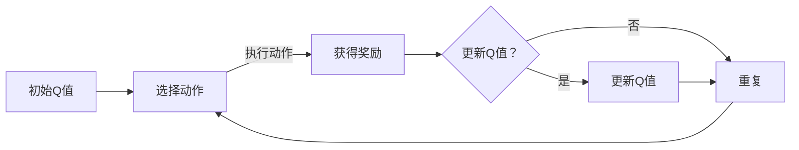
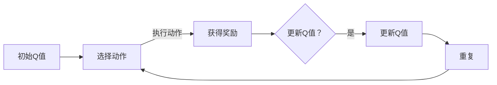
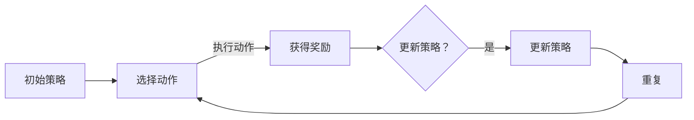
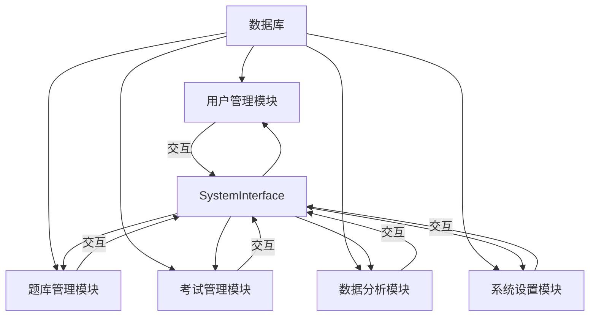

                 

### 文章标题

“评测系统的强化学习探索策略”是我们今天要探讨的主题。随着人工智能技术的飞速发展，强化学习作为一种高级的学习范式，已经在众多领域中展现出其强大的应用潜力。本文将深入探讨如何将强化学习应用于评测系统，并提出一系列探索策略，以期实现评测系统的智能化和高效化。

强化学习（Reinforcement Learning, RL）是一种通过与环境的交互来学习决策策略的人工智能方法。它主要依靠奖励机制来引导学习过程，使得智能体（agent）能够逐渐学会如何在一个不确定的环境中做出最优决策。强化学习在自动驾驶、游戏AI、机器人控制等领域的应用已经取得了显著的成果。而评测系统作为评估学习者知识和技能的重要工具，同样面临着如何提高评测质量和效率的问题。因此，将强化学习引入评测系统，具有重要的理论和实践意义。

本文将首先介绍强化学习和评测系统的基本概念，阐述强化学习在评测系统中的应用前景。随后，我们将深入探讨强化学习的核心概念，包括奖励系统、状态空间、动作空间、策略和价值函数，并通过对比表格和ER实体关系图来展示这些概念之间的关系。接下来，我们将详细讲解强化学习的主要算法原理，使用mermaid绘制算法流程图，并借助Python源代码进行详细阐述。

在强化学习算法实现部分，我们将介绍如何将算法应用于评测系统，包括系统功能设计、系统架构设计、系统接口设计和系统交互。为了帮助读者更好地理解，我们将展示一个实际的项目案例，详细分析其环境安装、系统核心实现、代码应用解读与分析，以及项目小结。

最后，我们将总结本文的主要观点，并提供一些实用的最佳实践建议。希望通过本文的探讨，能够为评测系统的优化提供新的思路和方法。

### 文章关键词

- **强化学习**：一种通过与环境交互学习决策策略的人工智能方法。
- **评测系统**：评估学习者知识和技能的系统。
- **奖励机制**：引导智能体学习的重要激励手段。
- **状态空间**：智能体可能处于的所有状态集合。
- **动作空间**：智能体可以执行的所有动作集合。
- **策略**：智能体在给定状态下选择动作的方法。
- **价值函数**：衡量状态或策略优劣的指标。
- **算法原理**：强化学习算法的基本工作原理和数学模型。
- **Python实现**：强化学习算法的编程实现。

### 摘要

本文旨在探讨强化学习在评测系统中的应用策略。首先，我们介绍了强化学习的基本概念和评测系统的定义，阐明了强化学习在提升评测系统性能和效率方面的潜力。接着，我们详细讲解了强化学习的核心概念，包括奖励系统、状态空间、动作空间、策略和价值函数，并通过对比表格和ER实体关系图展示了这些概念之间的关系。然后，我们深入分析了强化学习的主要算法原理，使用mermaid绘制算法流程图，并通过Python源代码进行详细阐述。在实现部分，我们介绍了如何将强化学习算法应用于评测系统，包括系统功能设计、架构设计和接口设计。最后，通过一个实际项目案例，我们展示了强化学习在评测系统中的具体应用过程，并总结了一些最佳实践建议。本文希望为评测系统的智能化和高效化提供新的思路和方法。

## 第1章 强化学习基础

### 1.1 强化学习的概念与历史

强化学习（Reinforcement Learning, RL）是一种通过奖励机制来指导智能体（agent）与环境（environment）互动，从而学习最优行为策略的人工智能方法。与监督学习和无监督学习不同，强化学习不依赖于预先标注的数据集，而是通过与环境交互，通过试错和反馈来不断优化行为策略。

强化学习的基本模型包括三个主要元素：智能体、环境、以及奖励机制。智能体是执行动作的实体，环境是智能体所处的情境，而奖励机制则是用来指导智能体行为的反馈信号。在强化学习的框架下，智能体的目标是最大化累积奖励，通过不断试错和调整行为策略，智能体能够学会在复杂环境中做出最优决策。

强化学习的历史可以追溯到20世纪50年代。1956年，Richard Bellman提出了动态规划（Dynamic Programming）的思想，为后来的强化学习奠定了理论基础。1958年，Andrew Barto和Richard Sutton的《强化学习：一种介绍》一书标志着强化学习的正式诞生。随后，随着计算机技术的飞速发展，强化学习得到了广泛的研究和应用。

早期的强化学习算法主要包括Q-Learning和SARSA。Q-Learning是一种基于值函数的算法，通过不断更新Q值来优化策略。SARSA（同步优势估计）则是一种基于策略的算法，通过对当前状态和动作的评估来更新策略。这些早期的算法奠定了强化学习的基础，并在一定程度上解决了简单环境中的问题。

进入21世纪，随着深度学习技术的兴起，强化学习也迎来了新的发展。深度强化学习（Deep Reinforcement Learning, DRL）将深度学习的强大特征与强化学习相结合，使得智能体能够在复杂环境中进行有效的学习。经典的深度强化学习算法包括Deep Q-Network（DQN）、Policy Gradient方法、以及Actor-Critic方法。这些算法通过引入神经网络来近似值函数或策略，大大提高了强化学习在复杂任务中的应用能力。

强化学习在多个领域取得了显著的成果。在游戏领域，智能体通过强化学习掌握了诸如围棋、扑克等复杂游戏。在机器人领域，智能体通过强化学习实现了自主导航、路径规划等功能。在自动驾驶领域，强化学习被用于决策和规划系统，使得自动驾驶汽车能够安全高效地行驶。此外，强化学习还在推荐系统、能源管理、金融交易等多个领域展现出了巨大的潜力。

总的来说，强化学习作为一种高效的人工智能方法，不仅丰富了机器学习的研究内容，也在实际应用中展现了其强大的能力和广泛的前景。随着技术的不断进步，强化学习将在更多领域中发挥重要作用。

### 1.2 强化学习的主要组成部分

强化学习系统的核心组成部分包括智能体（agent）、环境（environment）和奖励机制（reward mechanism）。这些组件相互协作，共同构成了强化学习的完整框架。

**智能体（Agent）**

智能体是执行特定任务或决策的主体，它可以是软件程序、机器人或者虚拟代理。智能体的目标是学习一个最优策略，以最大化累积奖励。智能体的行为受到其当前状态和所学策略的影响。在每一步，智能体都会根据当前状态选择一个动作，然后根据环境提供的反馈调整其行为策略。

**环境（Environment）**

环境是智能体进行交互的情境，它可以是物理环境（如现实世界中的场景）或者虚拟环境（如模拟器中的虚拟世界）。环境的状态决定了智能体可以执行的动作集合，同时环境也会根据智能体的动作反馈给予相应的奖励或惩罚。环境的目的是为智能体提供一个反馈机制，指导智能体不断优化其行为策略。

**奖励机制（Reward Mechanism）**

奖励机制是强化学习中的关键组成部分，它通过提供即时反馈来激励智能体的学习过程。奖励机制通常由环境定义，用于衡量智能体的行为对环境状态改变的影响。奖励可以是正的，表示智能体的行为有益于环境；奖励也可以是负的，表示智能体的行为对环境产生了不利影响。智能体的目标是通过学习获得最大的累积奖励。

**智能体、环境和奖励机制之间的关系**

智能体、环境和奖励机制三者之间存在着密切的关系。智能体通过与环境互动来感知状态，并根据所学策略选择动作。环境的反馈（奖励或惩罚）会指导智能体调整其行为策略，使其逐渐学会在复杂环境中做出最优决策。这一过程循环往复，不断迭代，直到智能体找到最优策略或者达到预设的目标。

在强化学习中，智能体的目标是通过不断学习和调整策略，最大化累积奖励。这种互动过程不仅有助于智能体在特定任务中取得成功，还能够提高其在类似任务中的表现。通过这种方式，强化学习为解决复杂决策问题提供了一种强有力的工具。

### 1.3 强化学习与其他学习方式的比较

在人工智能领域，强化学习、监督学习和无监督学习是三种主要的学习方式。它们各自有不同的特点和适用场景，下面我们将详细比较这三种学习方式。

**强化学习（Reinforcement Learning, RL）**

强化学习通过智能体与环境的交互来学习最优策略。其主要特点是：

- **目标导向**：强化学习的目标是最大化累积奖励，智能体需要通过不断尝试和错误来学习最优行为。
- **自主决策**：智能体在给定状态下自主选择动作，不需要外部标签数据。
- **适应性**：强化学习能够在动态和复杂环境中进行学习，适应不断变化的环境。
- **挑战性**：强化学习面临的主要挑战是学习过程的不确定性和长反馈延迟。

**监督学习（Supervised Learning）**

监督学习利用标记好的数据集来训练模型，其主要特点是：

- **标记数据**：需要大量的标记数据来训练模型，每个数据点都包含输入和对应的输出标签。
- **目标明确**：模型的目标是预测输出标签，通过最小化预测误差来优化模型参数。
- **预定义目标**：监督学习问题通常有明确的评估指标，如准确率、召回率等。
- **适用性**：监督学习在图像识别、文本分类等静态数据场景中表现优秀。

**无监督学习（Unsupervised Learning）**

无监督学习通过探索未标记的数据来发现数据中的模式和结构，其主要特点是：

- **无标记数据**：无监督学习不需要标签数据，而是从数据本身的特征中学习。
- **发现内在结构**：无监督学习的目标是发现数据中的隐藏结构和规律，如聚类、降维等。
- **自组织**：智能体通过自我组织和学习来理解数据，无需外部指导。
- **适用性**：无监督学习在数据探索、推荐系统和异常检测等领域有广泛应用。

**比较与联系**

- **数据需求**：强化学习不需要标记数据，但可能需要大量未标记的数据来探索环境。监督学习需要大量标记数据，而无监督学习则在无标记数据上工作。
- **目标导向性**：强化学习注重目标导向和长期奖励，而监督学习和无监督学习则分别关注预测输出和发现内在结构。
- **适用场景**：强化学习适用于需要自主决策和长期规划的动态环境，监督学习适用于有明确目标且数据标记明确的场景，无监督学习适用于探索未知数据和发现数据模式。

总之，这三种学习方式各有所长，选择哪种方式取决于具体问题的需求和场景。强化学习在复杂决策问题中展现出了独特的优势，但在数据需求和计算资源方面也提出了更高的要求。

### 1.4 强化学习的优缺点分析

强化学习作为一种通过试错和反馈进行决策的机器学习方法，具有许多独特的优点和潜在的缺点。以下是对其优缺点的详细分析：

**优点**

1. **自适应性和灵活性**：强化学习通过与环境交互来学习，能够适应动态变化的环境。这种特性使得强化学习在处理复杂、非线性和动态系统时具有显著的优势。
   
2. **目标导向**：强化学习以最大化累积奖励为目标，能够驱动智能体在动态环境中学习到最优策略。这种目标导向性使得强化学习特别适用于那些需要自主决策和长期规划的任务，如自动驾驶和游戏AI。

3. **探索与利用的平衡**：强化学习通过平衡探索新策略和利用现有策略来优化行为。这种机制能够在不确定性环境中有效地学习，避免过早陷入局部最优。

4. **灵活性**：强化学习不需要大量的预标注数据，这使得它能够应用于那些难以获取标记数据的场景。例如，在强化学习在机器人控制和自动驾驶中的应用中，环境通常是未知的，智能体需要通过互动来逐步了解环境。

**缺点**

1. **计算成本高**：强化学习通常需要大量的互动和试错来学习最优策略，这可能导致计算成本非常高。尤其是在涉及高维状态和动作空间的情况下，学习过程可能需要成千上万甚至数百万次的互动。

2. **收敛速度慢**：在许多情况下，强化学习算法的收敛速度较慢，尤其是当状态空间和动作空间较大时。这可能导致训练时间过长，不适合实时应用。

3. **不稳定性**：强化学习算法可能存在不稳定性，特别是在处理高度非线性和复杂的环境时。这种不稳定性可能导致算法在探索阶段和利用阶段之间的表现差异较大。

4. **奖励工程难度大**：奖励机制的设计对于强化学习的效果至关重要。在实际应用中，设计一个有效的奖励机制往往需要深入理解任务和环境，这增加了工程实现的难度。

**结论**

强化学习作为一种先进的人工智能方法，在许多复杂任务中展现出了其强大的能力。然而，它也存在一些挑战和局限性。在实际应用中，需要根据具体任务的需求和环境特性，合理选择和调整强化学习算法，并设计合适的奖励机制，以最大化其优势和克服其缺点。

### 第2章 评测系统的概念与现状

#### 2.1 评测系统的定义与作用

评测系统，也称为评估系统，是一种用于测量和评估个体知识、技能或能力的计算机化工具。它通过设计一系列测试和评估任务，收集和分析学习者的表现数据，从而对学习者的知识水平和技能水平进行量化评估。评测系统广泛应用于教育、职业培训、技能认证等多个领域，具有重要的作用。

首先，评测系统是教育评估体系的重要组成部分。在教育领域，评测系统用于测量学生的学习效果，帮助教师和学生了解学习目标的达成情况。通过评测，教师可以及时调整教学方法和策略，学生可以明确自己的学习进步和不足，从而进行有针对性的复习和提高。

其次，评测系统在职业培训和技能认证中同样发挥着关键作用。职业培训课程结束后，通过评测系统进行考核，可以确保培训效果的达成，为学员提供认证和职业发展依据。评测系统还可以帮助企业筛选和评估求职者，提高招聘效率和准确性。

此外，评测系统在科研领域也有广泛应用。科研人员通过评测系统评估实验结果和实验过程，可以更好地理解实验数据和现象，为后续研究提供数据支持和理论依据。

#### 2.2 评测系统的现状与挑战

随着信息技术的快速发展，评测系统经历了从纸质考试到计算机化考试的转型，大大提高了评估效率和准确性。然而，现有的评测系统仍面临诸多挑战。

1. **评估准确性**：现有的评测系统多依赖于传统的选择题、填空题等题型，虽然可以较为准确地测量知识水平，但在评估学习者综合能力和实践技能方面存在局限。因此，如何设计更准确的评估题型和方法，是评测系统需要解决的重要问题。

2. **评估效率**：随着参与评测的人数增多，现有的评测系统在处理海量数据时，面临较高的计算和存储压力。如何提高评测系统的处理效率和响应速度，是另一个关键挑战。

3. **个性化评估**：不同学习者在知识背景、学习能力和学习需求上存在差异。现有的评测系统往往采用统一的评估标准和题型，难以满足个性化评估的需求。如何根据学习者的个体差异，设计个性化的评估方案，是评测系统需要深入研究的问题。

4. **数据分析与反馈**：评测系统的核心功能之一是对评估结果进行分析和反馈，帮助学习者了解自己的优势和不足。然而，现有的评测系统在数据分析和反馈方面仍有很大提升空间，如何利用大数据和人工智能技术，提供更深入、更精准的分析和反馈，是评测系统需要关注的方向。

5. **安全性**：评测系统涉及大量敏感信息，如学习者的个人信息和成绩数据。如何保障评测系统的数据安全和隐私保护，是评测系统需要考虑的重要问题。

#### 2.3 强化学习在评测系统中的应用前景

强化学习作为一种先进的人工智能方法，其在评测系统中的应用前景非常广阔。以下是强化学习在评测系统中的几个潜在应用方向：

1. **个性化评估**：通过引入强化学习，可以设计个性化的评估方案，根据学习者的表现和历史数据，动态调整评估任务和难度，提供个性化的反馈和建议，从而更好地满足学习者的需求。

2. **智能出题**：强化学习可以用于自动生成高质量的评估题目，通过不断学习和优化，提高题目的质量和针对性，避免重复和冗余，提升评估效率。

3. **评估反馈**：强化学习可以通过分析学习者的行为数据和评估结果，提供更为精准和深入的反馈，帮助学习者了解自己的学习过程和表现，发现潜在问题和改进点。

4. **自适应评测**：强化学习可以实现自适应评测，根据学习者的实时表现，动态调整评估任务和难度，使得评估过程更加灵活和有效。

5. **知识图谱构建**：通过强化学习，可以构建学习者知识图谱，对学习者的知识结构进行详细分析，为教学和学习提供数据支持。

总之，强化学习在评测系统中的应用具有显著的优势和潜力。通过引入强化学习，评测系统可以实现智能化和高效化，为教育和职业培训提供更加优质和个性化的服务。

### 第3章 强化学习核心概念与联系

#### 3.1 奖励系统

奖励系统在强化学习中扮演着至关重要的角色，它决定了智能体在学习过程中如何做出决策和调整策略。奖励系统由奖励信号和奖励函数两部分组成。

**奖励信号（Reward Signal）**

奖励信号是环境提供给智能体的即时反馈，它通常是一个数值，表示智能体的行为对环境状态的改变。奖励信号可以是正的（表示有益的行为），也可以是负的（表示有害的行为）。在强化学习中，智能体的目标是最大化累积奖励，因此奖励信号直接影响智能体的学习过程。

**奖励函数（Reward Function）**

奖励函数是定义奖励信号的方式，它通常是一个函数，将状态和动作映射到奖励值。奖励函数的设计对强化学习的效果有着重要影响。有效的奖励函数需要能够准确地衡量智能体行为对环境状态的贡献，同时避免过度奖励或惩罚。

奖励系统的主要功能是激励智能体探索和优化行为策略，以实现长期目标。通过奖励系统，智能体可以在试错过程中不断学习，逐渐找到最优策略，从而在复杂环境中做出最优决策。

#### 3.2 状态空间与动作空间

状态空间和动作空间是强化学习的核心概念，它们定义了智能体在学习和决策过程中可以访问的领域。

**状态空间（State Space）**

状态空间是指智能体可能处于的所有状态的集合。每个状态都可以用一组特征来描述，这些特征反映了环境的状态信息。例如，在自动驾驶任务中，状态空间可以包括车辆的位置、速度、加速度、周围环境等信息。状态空间的大小决定了智能体需要学习的复杂程度，状态空间越大，智能体需要处理的信息越多，学习过程也越复杂。

**动作空间（Action Space）**

动作空间是指智能体可以执行的所有动作的集合。每个动作都可以用一组控制信号来描述，这些控制信号决定了智能体的行为。例如，在自动驾驶任务中，动作空间可以包括加速、减速、转向等控制动作。动作空间的大小同样影响了智能体的学习难度，动作空间越大，智能体需要尝试的动作组合也越多。

**状态空间与动作空间的联系**

状态空间和动作空间之间存在密切的联系。状态空间定义了智能体需要感知和反应的环境，而动作空间定义了智能体可以采取的行为。智能体在给定状态下选择动作，通过动作影响环境状态，从而获得奖励信号。这一过程循环往复，智能体通过不断试错和调整策略，最终找到最优行为。

状态空间和动作空间的大小对强化学习算法的性能有着重要影响。较大的状态空间和动作空间可能导致学习过程复杂，计算成本高，收敛速度慢。因此，在实际应用中，需要通过状态空间和动作空间的剪枝和简化，来提高强化学习算法的效率。

#### 3.3 策略、价值函数与模型预测

策略、价值函数和模型预测是强化学习中的关键概念，它们共同构成了智能体的决策框架。

**策略（Policy）**

策略是智能体在给定状态下选择动作的方法。策略可以通过概率分布来描述，表示智能体在不同状态下选择不同动作的概率。有效的策略能够最大化累积奖励，使智能体在复杂环境中做出最优决策。策略的设计直接关系到强化学习的效果，需要结合具体任务和环境特点进行优化。

**价值函数（Value Function）**

价值函数是衡量状态或策略优劣的指标，它表示智能体在特定状态或采用特定策略下的期望累积奖励。价值函数可以分为状态价值函数（State Value Function）和动作价值函数（Action Value Function）。状态价值函数衡量了智能体在特定状态下的最优期望奖励，而动作价值函数衡量了智能体在特定状态下选择特定动作的期望奖励。

**模型预测（Model Prediction）**

模型预测是智能体对环境动态的预测能力，它通过学习和分析历史数据，预测环境在当前状态下可能的变化。模型预测有助于智能体更好地规划未来的行为，提高决策的准确性。模型预测可以通过状态转移概率和奖励预测来实现，从而为智能体提供关于未来状态和奖励的预期信息。

**策略、价值函数与模型预测的联系**

策略、价值函数和模型预测相互关联，共同构成了智能体的决策框架。策略决定了智能体在不同状态下的行动方式，价值函数提供了关于不同状态和策略优劣的评估，而模型预测为智能体提供了关于未来状态的预期信息。通过这些概念的结合，智能体能够在复杂环境中不断学习和优化其行为策略，实现长期目标。

**策略与价值函数的关系**

策略和价值函数之间存在密切的联系。策略是通过价值函数的指导来选择的，价值函数为智能体提供了关于不同策略优劣的评估。智能体通过不断更新价值函数，调整策略，以实现累积奖励的最大化。

**价值函数与模型预测的关系**

价值函数和模型预测相互依赖，共同支持智能体的决策过程。价值函数依赖于模型预测来获取关于未来状态的预期信息，而模型预测则依赖于价值函数来评估不同状态和策略的优劣。通过结合价值函数和模型预测，智能体能够更好地理解和预测环境的动态变化，从而做出更优的决策。

#### 3.4 核心概念对比表格与ER实体关系图架构

为了更好地理解和展示强化学习中的核心概念，我们可以通过对比表格和ER实体关系图来展示这些概念之间的关系。

**对比表格**

| 概念           | 定义                                                         | 关系描述                                                     |
|----------------|------------------------------------------------------------|------------------------------------------------------------|
| 奖励系统       | 提供即时反馈，激励智能体学习最优策略                             | 奖励系统直接影响智能体的学习过程和策略选择。                  |
| 状态空间       | 智能体可能处于的所有状态集合                                   | 状态空间定义了智能体的感知领域，直接影响策略和价值函数的计算。 |
| 动作空间       | 智能体可以执行的所有动作集合                                   | 动作空间定义了智能体的行为选择，直接影响策略和价值函数的计算。 |
| 策略           | 智能体在给定状态下选择动作的方法                                 | 策略通过价值函数指导，以最大化累积奖励。                      |
| 价值函数       | 衡量状态或策略优劣的指标                                       | 价值函数评估不同状态和策略的优劣，指导策略选择。              |
| 模型预测       | 预测环境在当前状态下可能的变化                                   | 模型预测提供关于未来状态的预期信息，辅助价值函数的更新。      |

**ER实体关系图**

```mermaid
erDiagram
  状态 -->|奖励| 奖励系统
  动作 -->|奖励| 奖励系统
  策略 -->|选择| 智能体
  智能体 -->|感知| 状态
  智能体 -->|执行| 动作
  状态 -->|价值| 价值函数
  动作 -->|价值| 价值函数
  价值函数 -->|指导| 策略
  模型预测 -->|预测| 状态
  模型预测 -->|预测| 奖励
```

通过对比表格和ER实体关系图，我们可以清晰地看到各个核心概念之间的联系和作用。奖励系统通过提供即时反馈，激励智能体学习最优策略；状态空间和动作空间定义了智能体的感知和行为领域；策略通过价值函数的指导，实现累积奖励的最大化；模型预测提供了关于未来状态的预期信息，辅助价值函数的更新。这些概念相互交织，共同构成了强化学习的基本框架。

### 3.5 强化学习算法原理

#### 3.5.1 Q-Learning算法原理

Q-Learning算法是强化学习中最基础和常用的算法之一。它的核心思想是通过更新状态-动作值函数（Q值）来学习最优策略。Q值表示智能体在特定状态下执行特定动作的期望奖励。

**Q-Learning算法流程**

Q-Learning算法的基本流程如下：

1. **初始化Q值**：初始时，所有Q值都设置为某个较小的常数，表示不确定性的存在。
2. **选择动作**：智能体根据当前状态和策略选择动作。通常使用ε-贪心策略，在探索和利用之间进行平衡。
3. **执行动作**：智能体执行选择的动作，并获得环境反馈的奖励和新的状态。
4. **更新Q值**：根据新的奖励和状态，更新Q值，公式如下：
   \[
   Q(s, a) \leftarrow Q(s, a) + \alpha [r + \gamma \max_{a'} Q(s', a') - Q(s, a)]
   \]
   其中，\(s\) 和 \(a\) 表示当前状态和动作，\(s'\) 和 \(a'\) 表示新的状态和动作，\(r\) 表示奖励，\(\alpha\) 是学习率，\(\gamma\) 是折扣因子。

**Q-Learning算法流程图**



**Q-Learning的数学模型与公式**

Q-Learning的数学模型主要依赖于两个核心公式：

1. **Q值更新公式**：
   \[
   Q(s, a) \leftarrow Q(s, a) + \alpha [r + \gamma \max_{a'} Q(s', a') - Q(s, a)]
   \]
   其中，\(\alpha\) 是学习率，\(\gamma\) 是折扣因子，\(r\) 是奖励，\(s'\) 和 \(a'\) 分别表示新状态和新动作。

2. **目标Q值**：
   \[
   Q^{\prime}(s, a) = r + \gamma \max_{a'} Q(s', a')
   \]
   其中，\(Q^{\prime}(s, a)\) 表示目标Q值，用于在Q值更新过程中进行预测。

**Q-Learning算法举例说明**

假设一个简单的强化学习环境，其中智能体在4个方向（上、下、左、右）中选择一个动作，状态由当前位置表示。智能体每移动一步，如果移动到目标位置，则获得奖励10；否则，获得奖励-1。学习率\(\alpha = 0.1\)，折扣因子\(\gamma = 0.9\)。

初始状态：智能体在位置(0, 0)。

1. **选择动作**：智能体使用ε-贪心策略，以0.1的概率随机选择动作，以0.9的概率选择当前状态下的最优动作。
2. **执行动作**：假设智能体选择向右移动，移动到位置(0, 1)。
3. **获得奖励**：由于移动到非目标位置，获得奖励-1。
4. **更新Q值**：根据更新公式，更新Q值：
   \[
   Q(0, 右) \leftarrow Q(0, 右) + 0.1 [-1 + 0.9 \max_{a'} Q(1, a')]
   \]
   由于当前状态下只有向右动作，因此：
   \[
   Q(0, 右) \leftarrow Q(0, 右) + 0.1 [-1 + 0.9 \max_{a'} Q(1, a')]
   \]
   假设当前Q值均为0，则：
   \[
   Q(0, 右) \leftarrow 0 + 0.1 [-1 + 0.9 \cdot 0] = -0.1
   \]

通过不断重复这个过程，智能体会逐渐学会在特定状态下选择最优动作，以最大化累积奖励。这个过程不仅展示了Q-Learning算法的基本原理，也说明了其在简单环境中的实际应用效果。

### 3.5.2 SARSA算法原理

SARSA（同步优势估计）算法是另一种常用的强化学习算法，它通过更新同步的值函数（Q值）来学习最优策略。与Q-Learning算法不同的是，SARSA算法在每一步都使用实际的动作值和奖励来更新Q值，而不是使用预测的动作值。

**SARSA算法流程**

SARSA算法的基本流程如下：

1. **初始化Q值**：初始时，所有Q值都设置为某个较小的常数，表示不确定性的存在。
2. **选择动作**：智能体根据当前状态和策略选择动作。通常使用ε-贪心策略，在探索和利用之间进行平衡。
3. **执行动作**：智能体执行选择的动作，并获得环境反馈的奖励和新的状态。
4. **更新Q值**：根据当前状态、选择动作和新状态，以及新获得的奖励，更新Q值，公式如下：
   \[
   Q(s, a) \leftarrow Q(s, a) + \alpha [r + \gamma Q(s', a') - Q(s, a)]
   \]
   其中，\(s\) 和 \(a\) 表示当前状态和动作，\(s'\) 和 \(a'\) 表示新的状态和动作，\(r\) 表示奖励，\(\alpha\) 是学习率，\(\gamma\) 是折扣因子。

**SARSA算法流程图**



**SARSA算法的数学模型与公式**

SARSA算法的核心在于更新公式，它直接使用实际的动作值和奖励来更新Q值：

1. **Q值更新公式**：
   \[
   Q(s, a) \leftarrow Q(s, a) + \alpha [r + \gamma Q(s', a') - Q(s, a)]
   \]
   其中，\(Q(s, a)\) 是当前状态 \(s\) 下选择动作 \(a\) 的Q值，\(Q(s', a')\) 是在新状态 \(s'\) 下选择动作 \(a'\\) 的Q值。

**SARSA算法举例说明**

我们继续使用之前的简单环境，其中智能体在4个方向（上、下、左、右）中选择一个动作，状态由当前位置表示。智能体每移动一步，如果移动到目标位置，则获得奖励10；否则，获得奖励-1。学习率\(\alpha = 0.1\)，折扣因子\(\gamma = 0.9\)。

初始状态：智能体在位置(0, 0)。

1. **选择动作**：智能体使用ε-贪心策略，以0.1的概率随机选择动作，以0.9的概率选择当前状态下的最优动作。
2. **执行动作**：假设智能体选择向右移动，移动到位置(0, 1)。
3. **获得奖励**：由于移动到非目标位置，获得奖励-1。
4. **更新Q值**：根据更新公式，更新Q值：
   \[
   Q(0, 右) \leftarrow Q(0, 右) + 0.1 [-1 + 0.9 Q(1, a')]
   \]
   由于当前状态下只有向右动作，因此：
   \[
   Q(0, 右) \leftarrow Q(0, 右) + 0.1 [-1 + 0.9 Q(1, 右)]
   \]
   假设当前Q值均为0，则：
   \[
   Q(0, 右) \leftarrow 0 + 0.1 [-1 + 0.9 \cdot 0] = -0.1
   \]

通过不断重复这个过程，智能体会逐渐学会在特定状态下选择最优动作，以最大化累积奖励。与Q-Learning算法相比，SARSA算法在每一步都使用实际的结果来更新Q值，从而在一定程度上减少了预测误差，提高了算法的稳定性。

### 3.5.3 REINFORCE算法原理

REINFORCE算法是一种基于策略的强化学习算法，其主要思想是通过更新策略的梯度来优化策略。与Q-Learning和SARSA算法不同，REINFORCE算法不依赖于值函数，而是直接优化策略的概率分布。

**REINFORCE算法流程**

REINFORCE算法的基本流程如下：

1. **初始化策略**：初始时，策略是一个概率分布，表示智能体在不同状态下选择不同动作的概率。
2. **选择动作**：智能体根据当前状态和策略选择动作。通常使用ε-贪心策略，在探索和利用之间进行平衡。
3. **执行动作**：智能体执行选择的动作，并获得环境反馈的奖励和新的状态。
4. **更新策略**：根据当前状态、选择动作和新状态，以及新获得的奖励，更新策略的概率分布。更新公式如下：
   \[
   \theta \leftarrow \theta + \alpha \nabla_{\theta} \log \pi(s, a)
   \]
   其中，\(\theta\) 表示策略参数，\(\alpha\) 是学习率，\(\pi(s, a)\) 表示在状态 \(s\) 下选择动作 \(a\) 的概率分布。

**REINFORCE算法流程图**



**REINFORCE算法的数学模型与公式**

REINFORCE算法的核心在于策略参数的更新公式，它通过梯度上升法来优化策略：

1. **策略梯度更新公式**：
   \[
   \theta \leftarrow \theta + \alpha \nabla_{\theta} \log \pi(s, a)
   \]
   其中，\(\nabla_{\theta} \log \pi(s, a)\) 表示在状态 \(s\) 下选择动作 \(a\) 的策略梯度的估计。

2. **策略概率分布更新公式**：
   \[
   \pi(s, a) \leftarrow \pi(s, a) + \alpha [r - \langle \pi(s, a) \rangle]
   \]
   其中，\(\langle \pi(s, a) \rangle\) 表示策略概率分布的期望值。

**REINFORCE算法举例说明**

我们继续使用之前的简单环境，其中智能体在4个方向（上、下、左、右）中选择一个动作，状态由当前位置表示。智能体每移动一步，如果移动到目标位置，则获得奖励10；否则，获得奖励-1。学习率\(\alpha = 0.1\)。

初始状态：智能体在位置(0, 0)。

1. **选择动作**：智能体使用ε-贪心策略，以0.1的概率随机选择动作，以0.9的概率选择当前状态下的最优动作。
2. **执行动作**：假设智能体选择向右移动，移动到位置(0, 1)。
3. **获得奖励**：由于移动到非目标位置，获得奖励-1。
4. **更新策略**：根据更新公式，更新策略的概率分布：
   \[
   \pi(s, 右) \leftarrow \pi(s, 右) + 0.1 [-1 - \langle \pi(s, 右) \rangle]
   \]
   假设初始策略为均匀分布，即：
   \[
   \pi(s, 上) = \pi(s, 下) = \pi(s, 左) = \pi(s, 右) = 0.25
   \]
   则：
   \[
   \pi(s, 右) \leftarrow 0.25 + 0.1 [-1 - (0.25 + 0.25 + 0.25 + 0.25)] = 0.25 - 0.1 \times 1 = 0.15
   \]

通过不断重复这个过程，智能体会逐渐学会在特定状态下选择最优动作，以最大化累积奖励。与Q-Learning和SARSA算法相比，REINFORCE算法直接优化策略的概率分布，因此在某些情况下，特别是在非线性环境中，能够表现出更好的性能。

### 第4章 强化学习算法实现

#### 4.1 Python环境安装与准备

要实现强化学习算法，首先需要安装Python环境以及相关的依赖库。以下是安装步骤和所需依赖库的详细介绍。

**1. 安装Python**

首先，确保您的计算机上安装了Python。Python是一种广泛使用的编程语言，可以在其官方网站（[python.org](https://www.python.org/)）下载。选择适合您操作系统的版本，按照安装向导进行安装。安装完成后，通过命令行运行`python --version`来验证Python是否安装成功。

**2. 安装依赖库**

强化学习算法的实现通常需要一些额外的库，例如NumPy、Pandas、Matplotlib等。以下是安装这些库的方法：

- **NumPy**：NumPy是一个开源的Python库，用于高性能数学计算。通过以下命令安装：
  \[
  pip install numpy
  \]

- **Pandas**：Pandas是一个强大的数据处理库，提供数据结构对象和数据分析工具。通过以下命令安装：
  \[
  pip install pandas
  \]

- **Matplotlib**：Matplotlib是一个用于生成2D图表和可视化数据的库。通过以下命令安装：
  \[
  pip install matplotlib
  \]

- **PyTorch**：PyTorch是一个流行的深度学习库，提供了强大的张量计算和数据流图构建功能。通过以下命令安装：
  \[
  pip install torch torchvision
  \]

确保安装完成后，可以通过命令行运行相应的库导入测试，例如：
\[
import numpy as np
import pandas as pd
import matplotlib.pyplot as plt
import torch
import torchvision
\]

如果所有导入语句都能成功执行，则说明环境安装和准备完成。

#### 4.2 强化学习算法代码实现

在本节中，我们将使用Python实现强化学习算法，主要包括Q-Learning、SARSA和REINFORCE算法。以下是每个算法的实现过程和代码示例。

**1. Q-Learning算法代码实现**

Q-Learning算法的实现主要依赖于状态-动作值函数（Q值）的更新。以下是一个简单的Q-Learning算法实现：

```python
import numpy as np

# 初始化Q值表格
def init_q_table(states, actions):
    q_table = np.zeros((states, actions))
    return q_table

# Q-Learning算法
def q_learning(env, q_table, learning_rate, discount_factor, num_episodes):
    for episode in range(num_episodes):
        state = env.reset()
        done = False
        
        while not done:
            # 选择动作
            action = select_action(q_table, state, env)
            # 执行动作
            next_state, reward, done, _ = env.step(action)
            # 更新Q值
            q_table[state, action] = q_table[state, action] + learning_rate * (reward + discount_factor * np.max(q_table[next_state, :]) - q_table[state, action])
            state = next_state
    
    return q_table

# 选择动作（ε-贪心策略）
def select_action(q_table, state, env):
    epsilon = 0.1  # 探索概率
    if np.random.rand() < epsilon:
        action = env.action_space.sample()  # 随机选择动作
    else:
        action = np.argmax(q_table[state, :])  # 选择最优动作
    return action

# 创建环境
env = env()
# 初始化参数
learning_rate = 0.1
discount_factor = 0.9
num_episodes = 1000
# 初始化Q值表格
q_table = init_q_table(env.observation_space.n, env.action_space.n)
# 运行Q-Learning算法
q_table = q_learning(env, q_table, learning_rate, discount_factor, num_episodes)
```

**2. SARSA算法代码实现**

SARSA算法的实现与Q-Learning类似，但更新Q值时使用的是实际的动作值而不是预测的动作值。以下是SARSA算法的实现：

```python
# SARSA算法
def sarsa(env, q_table, learning_rate, discount_factor, num_episodes):
    for episode in range(num_episodes):
        state = env.reset()
        done = False
        
        while not done:
            # 选择动作
            action = select_action(q_table, state, env)
            # 执行动作
            next_state, reward, done, _ = env.step(action)
            # 更新Q值
            q_table[state, action] = q_table[state, action] + learning_rate * (reward + discount_factor * q_table[next_state, action] - q_table[state, action])
            state = next_state
            action = select_action(q_table, state, env)
    
    return q_table

# 运行SARSA算法
q_table = sarsa(env, q_table, learning_rate, discount_factor, num_episodes)
```

**3. REINFORCE算法代码实现**

REINFORCE算法的实现相对复杂，主要依赖于策略梯度的更新。以下是REINFORCE算法的实现：

```python
# 计算策略梯度
def policy_gradient(q_values, actions, rewards, alpha):
    gradients = []
    for state, action, reward in zip(*[iter(q_values)] * 3):
        logits = np.max(q_values[state, :], axis=1)
        log_prob = np.log(logits[action])
        gradient = reward - logits[action] + alpha * log_prob
        gradients.append(gradient)
    return gradients

# REINFORCE算法
def reinforce(env, q_values, alpha, num_episodes):
    for episode in range(num_episodes):
        state = env.reset()
        done = False
        total_reward = 0
        
        while not done:
            logits = np.max(q_values[state, :], axis=1)
            action = np.random.choice(logits.argmax(), p=logits / logits.sum())
            next_state, reward, done, _ = env.step(action)
            total_reward += reward
            gradients = policy_gradient(q_values, [action], [reward], alpha)
            q_values[state, action] += gradients
            
            state = next_state
    
    return q_values, total_reward

# 运行REINFORCE算法
alpha = 0.1
q_values = np.zeros((env.observation_space.n, env.action_space.n))
q_values, total_reward = reinforce(env, q_values, alpha, num_episodes)
```

通过上述代码示例，我们可以看到如何使用Python实现Q-Learning、SARSA和REINFORCE算法。这些算法的核心思想是通过不断更新Q值或策略参数来学习最优策略。在实际应用中，需要根据具体任务和环境的特点，合理选择和调整算法参数，以实现最优性能。

### 4.3 代码应用解读与分析

在本节中，我们将对之前提到的Q-Learning、SARSA和REINFORCE算法的代码进行详细解读与分析，帮助读者更好地理解这些算法的实现原理和应用过程。

#### Q-Learning算法代码解读与分析

Q-Learning算法的核心在于更新状态-动作值函数（Q值），以实现最优策略的学习。以下是对代码的关键部分进行解读：

```python
# 初始化Q值表格
def init_q_table(states, actions):
    q_table = np.zeros((states, actions))
    return q_table

# Q-Learning算法
def q_learning(env, q_table, learning_rate, discount_factor, num_episodes):
    for episode in range(num_episodes):
        state = env.reset()
        done = False
        
        while not done:
            # 选择动作
            action = select_action(q_table, state, env)
            # 执行动作
            next_state, reward, done, _ = env.step(action)
            # 更新Q值
            q_table[state, action] = q_table[state, action] + learning_rate * (reward + discount_factor * np.max(q_table[next_state, :]) - q_table[state, action])
            state = next_state
    
    return q_table
```

**关键步骤解析：**

1. **初始化Q值表格**：首先，我们使用`init_q_table`函数初始化Q值表格。Q值表格的大小由状态空间和动作空间决定，每个元素表示在特定状态下执行特定动作的预期奖励。

2. **选择动作**：`select_action`函数使用ε-贪心策略来选择动作。ε-贪心策略在探索和利用之间进行平衡，ε为探索概率，当ε较小时，智能体倾向于选择当前状态下预期奖励最大的动作；当ε较大时，智能体有更大的概率随机选择动作。

3. **执行动作与更新Q值**：在每次迭代中，智能体根据当前状态选择动作，执行动作后，获得环境反馈的奖励和新的状态。然后，使用Q值更新公式更新Q值，公式如下：

   \[
   Q(s, a) \leftarrow Q(s, a) + \alpha [r + \gamma \max_{a'} Q(s', a') - Q(s, a)]
   \]

   其中，\(s\) 和 \(a\) 表示当前状态和动作，\(s'\) 表示新的状态，\(r\) 表示奖励，\(\alpha\) 是学习率，\(\gamma\) 是折扣因子。通过这种方式，Q值不断更新，智能体逐渐学会在特定状态下选择最优动作。

#### SARSA算法代码解读与分析

SARSA算法与Q-Learning算法的主要区别在于更新Q值的方法。在SARSA算法中，使用的是实际的动作值而不是预测的动作值来更新Q值。以下是对代码的关键部分进行解读：

```python
# SARSA算法
def sarsa(env, q_table, learning_rate, discount_factor, num_episodes):
    for episode in range(num_episodes):
        state = env.reset()
        done = False
        
        while not done:
            # 选择动作
            action = select_action(q_table, state, env)
            # 执行动作
            next_state, reward, done, _ = env.step(action)
            # 更新Q值
            q_table[state, action] = q_table[state, action] + learning_rate * (reward + discount_factor * q_table[next_state, action] - q_table[state, action])
            state = next_state
            action = select_action(q_table, state, env)
    
    return q_table
```

**关键步骤解析：**

1. **选择动作**：与Q-Learning算法相同，SARSA算法也使用ε-贪心策略来选择动作。

2. **执行动作与更新Q值**：执行动作后，SARSA算法使用以下公式更新Q值：

   \[
   Q(s, a) \leftarrow Q(s, a) + \alpha [r + \gamma Q(s', a') - Q(s, a)]
   \]

   其中，\(s'\) 和 \(a'\) 表示新的状态和动作。与Q-Learning算法不同的是，SARSA算法使用的是实际的动作值，而不是预测的动作值，从而在一定程度上减少了预测误差。

#### REINFORCE算法代码解读与分析

REINFORCE算法是一种基于策略的强化学习算法，其核心思想是通过更新策略梯度来优化策略。以下是对代码的关键部分进行解读：

```python
# 计算策略梯度
def policy_gradient(q_values, actions, rewards, alpha):
    gradients = []
    for state, action, reward in zip(*[iter(q_values)] * 3):
        logits = np.max(q_values[state, :], axis=1)
        log_prob = np.log(logits[action])
        gradient = reward - logits[action] + alpha * log_prob
        gradients.append(gradient)
    return gradients

# REINFORCE算法
def reinforce(env, q_values, alpha, num_episodes):
    for episode in range(num_episodes):
        state = env.reset()
        done = False
        total_reward = 0
        
        while not done:
            logits = np.max(q_values[state, :], axis=1)
            action = np.random.choice(logits.argmax(), p=logits / logits.sum())
            next_state, reward, done, _ = env.step(action)
            total_reward += reward
            gradients = policy_gradient(q_values, [action], [reward], alpha)
            q_values[state, action] += gradients
            
            state = next_state
    
    return q_values, total_reward
```

**关键步骤解析：**

1. **计算策略梯度**：`policy_gradient`函数计算策略梯度，公式如下：

   \[
   \theta \leftarrow \theta + \alpha \nabla_{\theta} \log \pi(s, a)
   \]

   其中，\(\theta\) 表示策略参数，\(\alpha\) 是学习率，\(\log \pi(s, a)\) 是策略概率分布的梯度。

2. **选择动作**：与Q-Learning和SARSA算法类似，REINFORCE算法也使用ε-贪心策略来选择动作。

3. **执行动作与更新策略**：执行动作后，计算策略梯度，并使用以下公式更新策略参数：

   \[
   \theta \leftarrow \theta + \alpha [r - \langle \pi(s, a) \rangle]
   \]

   通过这种方式，策略参数不断更新，智能体逐渐学会在特定状态下选择最优动作。

通过上述代码解读与分析，我们可以清晰地看到Q-Learning、SARSA和REINFORCE算法的实现原理和应用过程。这些算法在强化学习中扮演着重要的角色，通过不断更新Q值或策略参数，智能体能够在复杂环境中学习到最优策略。

### 第5章 强化学习算法应用于评测系统

#### 5.1 评测系统问题场景介绍

在当前的评测系统中，我们面临几个主要的问题场景，这些问题限制了评测系统的效率和准确性。以下是一些常见的问题场景及其特点：

1. **评估准确性不足**：现有的评测系统多依赖于传统的选择题、填空题等题型，虽然可以较为准确地测量知识水平，但在评估学习者综合能力和实践技能方面存在局限。这种评估方式难以全面反映学习者的真实水平。

2. **评估效率低**：随着参与评测的人数增多，现有的评测系统在处理海量数据时，面临较高的计算和存储压力。评估过程耗时较长，难以满足实时评估的需求。

3. **个性化评估不足**：不同学习者在知识背景、学习能力和学习需求上存在差异。现有的评测系统往往采用统一的评估标准和题型，难以满足个性化评估的需求。

4. **数据分析与反馈不足**：评测系统在数据分析和反馈方面仍有很大提升空间。现有的评测系统在评估结果分析、学习者表现趋势分析和个性化反馈方面存在不足，难以提供深入的数据支持和改进建议。

5. **安全性问题**：评测系统涉及大量敏感信息，如学习者的个人信息和成绩数据。如何保障评测系统的数据安全和隐私保护，是评测系统需要解决的重要问题。

为了解决上述问题，引入强化学习作为评测系统的一种优化策略，具有重要的理论意义和实际应用价值。强化学习通过学习奖励机制，可以动态调整评估任务和难度，提高评估的准确性和个性化水平。此外，强化学习能够通过分析学习者的行为数据，提供更为精准和深入的反馈，帮助学习者了解自己的学习过程和表现。通过这些优化，评测系统可以实现智能化和高效化，为教育和职业培训提供更加优质和个性化的服务。

#### 5.2 评测系统中的强化学习应用场景

强化学习在评测系统中的应用场景非常广泛，以下是一些典型的应用场景：

1. **个性化评估**：通过引入强化学习，可以设计个性化的评估方案。根据学习者的表现和历史数据，动态调整评估任务和题型，提高评估的针对性和准确性。例如，在一个在线学习平台上，系统可以根据学习者之前的学习记录和成绩，为其推荐合适的练习题目，从而提高学习效果。

2. **智能出题**：强化学习可以用于自动生成高质量的评估题目。通过不断学习和优化，系统可以生成更符合学习者实际需求的题目，避免重复和冗余，提高评估效率。例如，在考试系统中，可以使用强化学习算法来生成适应不同考试水平和知识点的试题，确保考试公平性和有效性。

3. **自适应评估**：强化学习可以实现自适应评估，根据学习者的实时表现，动态调整评估任务和难度。例如，在职业资格认证考试中，系统可以根据考生的答题情况，实时调整试题难度，使得评估过程更加灵活和有效。

4. **反馈与改进**：通过强化学习，系统可以分析学习者的行为数据和评估结果，提供更为精准和深入的反馈。例如，系统可以根据学习者的答题错误类型，提供有针对性的学习建议和复习资料，帮助学习者快速提升能力。

5. **知识图谱构建**：强化学习可以用于构建学习者的知识图谱，对学习者的知识结构进行详细分析。例如，在教育领域，系统可以通过分析学习者的答题记录和学习历史，构建其知识图谱，为个性化教学和学习路径规划提供数据支持。

6. **安全性与隐私保护**：强化学习在安全性方面也有潜在应用。通过引入安全强化学习算法，系统可以设计出更加安全的评估策略，保护学习者的个人信息和成绩数据。例如，可以使用联邦学习（Federated Learning）技术，将数据保留在本地，避免数据泄露和隐私风险。

总之，强化学习在评测系统中的应用具有广泛的前景和显著的优势。通过引入强化学习，评测系统可以实现智能化和高效化，为教育和职业培训提供更加优质和个性化的服务。

#### 5.3 评测系统中的强化学习策略设计

为了将强化学习有效地应用于评测系统，我们需要设计一套完整的强化学习策略，涵盖奖励机制、策略优化和评估指标。以下是对这些关键组成部分的详细阐述：

**1. 奖励机制设计**

奖励机制是强化学习中的核心部分，决定了智能体（评测系统）如何通过与环境（学习者）的互动进行学习。以下是奖励机制设计的主要步骤：

- **奖励信号定义**：首先，需要明确奖励信号的类型和计算方式。奖励信号可以是直接的得分，也可以是对学习效果的评价指标，如正确率、完成时间和问题难度等。奖励信号应能反映学习者的实际表现和进步情况。

- **奖励函数设计**：奖励函数将状态和动作映射到奖励值。设计有效的奖励函数需要考虑学习者的目标、学习过程和环境特点。例如，在在线学习平台上，奖励函数可以设计为学习者在每次答题后的得分，或者根据答题时间和正确率调整得分。

- **奖励调整策略**：为了激励学习者不断进步，奖励机制应具有一定的动态调整能力。可以根据学习者的表现，逐渐提高题目难度或增加奖励值，使得系统在长时间内保持学习者的参与度和学习热情。

**2. 策略优化**

策略优化是强化学习的核心目标，即设计一套高效的策略，使得智能体能够在复杂环境中做出最优决策。以下是策略优化的主要步骤：

- **策略选择方法**：选择合适的策略选择方法，如ε-贪心策略、确定性策略或基于模型的策略。ε-贪心策略在探索和利用之间进行平衡，适用于初始阶段；确定性策略在智能体已经找到最优策略后使用，以提高决策效率。

- **策略更新方法**：根据强化学习算法（如Q-Learning、SARSA或REINFORCE），设计策略的更新方法。策略更新方法应能够快速收敛，并适应动态变化的环境。例如，可以使用经验回放和目标网络等技术，提高策略的稳定性和鲁棒性。

- **策略评估**：在策略优化过程中，需要不断评估策略的性能，以便进行调整和改进。可以通过模拟环境或实际测试数据，评估策略在不同状态和动作下的表现，并选择最优策略。

**3. 评估指标**

评估指标是衡量评测系统性能的重要工具，以下是评估指标设计的主要步骤：

- **评价指标选择**：根据评测系统的目标和任务，选择合适的评价指标。常见的评价指标包括平均奖励、累计奖励、正确率、完成时间等。

- **指标计算方法**：设计评价指标的计算方法，确保计算结果准确、可靠。例如，平均奖励可以计算为多次实验中奖励的总和除以实验次数；正确率可以计算为正确回答的题目数量除以总题目数量。

- **指标分析**：对评价指标进行分析和可视化，以了解评测系统的性能和改进方向。可以使用图表、趋势图等工具，展示评价指标的变化情况，帮助评估者和学习者了解系统效果。

通过设计合理的奖励机制、策略优化和评估指标，我们可以构建一个高效的评测系统，提高评估的准确性、个性化和实时性。强化学习策略的应用不仅能够优化评测过程，还能为教育和职业培训提供更优质的服务。

### 第6章 评测系统架构设计与实现

#### 6.1 评测系统功能设计

评测系统的功能设计是确保系统能够满足不同用户需求、实现高效评估的重要环节。以下是评测系统的功能设计，包括主要功能模块和其具体描述：

**1. 用户管理模块**

用户管理模块负责用户注册、登录、权限分配和用户信息管理。其主要功能包括：

- 用户注册：新用户可以通过注册表单填写个人信息并创建账户。
- 用户登录：已注册用户通过账号和密码登录系统，访问相关功能。
- 权限分配：根据用户角色和权限，系统实现不同级别的功能访问控制。
- 用户信息管理：用户可以查看和修改个人信息，包括昵称、联系方式等。

**2. 题库管理模块**

题库管理模块用于创建、管理和维护题目库，确保题库的丰富性和多样性。其主要功能包括：

- 题目创建：管理员可以创建不同类型和难度的题目，包括选择题、填空题、判断题等。
- 题目编辑：管理员可以对现有题目进行修改、删除和更新。
- 题目分类：题目根据知识点、题型和难度进行分类，便于管理和查找。
- 题库备份与恢复：定期备份题库数据，确保数据安全，支持恢复功能。

**3. 考试管理模块**

考试管理模块负责考试的组织、监控和结果处理。其主要功能包括：

- 考试安排：管理员可以设置考试的时间、地点和考试规则。
- 考试监控：系统实时监控考试过程，记录考生的答题情况。
- 考试结果处理：考试结束后，系统自动计算考试成绩，生成详细报告。
- 成绩查询与反馈：考生可以查询考试成绩，系统提供个性化反馈和学习建议。

**4. 数据分析模块**

数据分析模块用于收集、处理和分析用户行为数据，为系统优化和个性化服务提供数据支持。其主要功能包括：

- 行为数据收集：系统记录用户的登录、答题、学习进度等行为数据。
- 数据预处理：对收集的数据进行清洗、去重和处理，确保数据质量。
- 数据分析：利用统计分析和机器学习技术，分析用户行为和学习效果。
- 数据可视化：通过图表、报表等工具，展示分析结果，便于理解和决策。

**5. 系统设置模块**

系统设置模块用于系统参数的配置和管理，确保系统的稳定运行。其主要功能包括：

- 参数配置：管理员可以设置系统参数，如考试时间限制、评分标准等。
- 系统监控：系统实时监控运行状态，包括服务器负载、数据存储空间等。
- 系统日志：记录系统运行日志，便于问题追踪和故障排除。

#### 6.2 评测系统架构设计

评测系统的架构设计是确保系统功能实现高效、稳定和安全的关键。以下是评测系统的架构设计，包括系统架构图和各模块之间的关系：

**系统架构图**



**系统架构设计说明**

1. **用户管理模块**：用户管理模块与数据库进行交互，实现用户注册、登录和权限分配等功能。用户信息存储在数据库中，确保数据的完整性和安全性。

2. **题库管理模块**：题库管理模块负责题目的创建、编辑和分类管理。题目信息存储在数据库中，便于管理和查找。管理员通过题库管理模块与数据库进行交互，维护题库数据。

3. **考试管理模块**：考试管理模块负责考试的组织和监控。管理员通过该模块设置考试参数、安排考试时间和监控考试过程。考试成绩和考生信息存储在数据库中，便于后续分析和查询。

4. **数据分析模块**：数据分析模块收集和分析用户行为数据，为系统优化和个性化服务提供数据支持。该模块与数据库进行交互，获取用户行为数据，并利用机器学习技术进行数据分析和可视化。

5. **系统设置模块**：系统设置模块负责系统参数的配置和管理。管理员通过该模块设置系统运行参数，如考试时间限制、评分标准等。系统设置模块与数据库进行交互，维护系统配置数据。

6. **数据库**：数据库是评测系统的数据存储中心，存储用户信息、题目数据、考试数据和系统设置数据。数据库的设计应考虑数据的安全性、完整性和可扩展性，支持高并发访问和快速查询。

通过以上架构设计，评测系统能够实现功能模块之间的高效协同工作，确保系统运行的稳定性和可靠性。各模块通过统一的接口与数据库进行交互，数据流清晰，便于维护和扩展。

### 6.3 系统接口设计与系统交互

评测系统的接口设计是确保系统各模块之间能够顺畅交互、实现功能集成的重要环节。以下是评测系统的接口设计和系统交互的详细说明：

**1. 系统接口设计**

评测系统的接口设计包括API接口和内部接口两部分：

- **API接口**：API接口用于外部系统与评测系统的交互。常见的API接口包括用户登录、用户注册、考试开始、考试结束、成绩查询等。API接口设计应遵循RESTful原则，确保接口的简洁性和易用性。以下是部分API接口设计示例：

  - 用户登录接口：
    ```json
    POST /api/login
    {
      "username": "string",
      "password": "string"
    }
    ```
    返回结果：
    ```json
    {
      "token": "string",
      "message": "success"
    }
    ```

  - 用户注册接口：
    ```json
    POST /api/register
    {
      "username": "string",
      "password": "string",
      "email": "string"
    }
    ```
    返回结果：
    ```json
    {
      "message": "success"
    }
    ```

  - 考试开始接口：
    ```json
    POST /api/start_exam
    {
      "user_id": "string",
      "exam_id": "string"
    }
    ```
    返回结果：
    ```json
    {
      "exam_start_time": "datetime",
      "message": "success"
    }
    ```

- **内部接口**：内部接口用于评测系统内部模块之间的交互。内部接口设计应保证模块间的数据传递和功能调用高效、稳定。以下是部分内部接口设计示例：

  - 题目检索接口：
    ```python
    def get_questions(exam_id, difficulty_level):
        questions = QuestionBank.get_questions(exam_id, difficulty_level)
        return questions
    ```

  - 考试结果处理接口：
    ```python
    def process_exam_results(user_id, exam_id, answers):
        results = ExamManagement.process_exam_results(user_id, exam_id, answers)
        return results
    ```

**2. 系统交互**

评测系统的系统交互包括用户与系统、模块与模块之间的数据流和功能调用。以下是系统交互的详细说明：

- **用户与系统交互**：用户通过API接口与评测系统进行交互，实现注册、登录、考试、查询成绩等功能。以下是用户与系统交互的示例流程：

  - 用户注册：
    1. 用户提交注册表单，系统处理注册请求。
    2. 系统生成用户账号和密码，存储用户信息到数据库。
    3. 系统返回注册结果。

  - 用户登录：
    1. 用户提交登录请求，包括用户名和密码。
    2. 系统验证用户身份，生成令牌（token）。
    3. 系统返回登录结果和令牌。

  - 开始考试：
    1. 用户通过API接口请求开始考试。
    2. 系统生成考试开始时间，存储考试信息到数据库。
    3. 系统返回考试开始时间和考试信息。

  - 提交答案：
    1. 用户提交考试答案，通过API接口发送到系统。
    2. 系统处理答案，生成考试成绩。
    3. 系统返回考试成绩和反馈。

- **模块与模块交互**：评测系统的各模块通过内部接口进行数据传递和功能调用。以下是模块与模块交互的示例流程：

  - 考试管理模块与题库管理模块交互：
    1. 考试管理模块请求题目列表。
    2. 题库管理模块根据请求生成题目列表，返回给考试管理模块。

  - 数据分析模块与考试管理模块交互：
    1. 考试管理模块处理考试结果，生成初步分析结果。
    2. 数据分析模块获取初步分析结果，进行深入分析和可视化。

  - 用户管理模块与题库管理模块交互：
    1. 用户管理模块请求用户信息。
    2. 题库管理模块根据用户信息生成用户专属的题目列表。

通过以上系统接口设计和系统交互，评测系统能够实现用户与系统、模块与模块之间的高效协作，确保系统功能完整、操作流畅。系统接口和交互设计为评测系统的可扩展性和维护性提供了有力保障。

### 第7章 项目实战

#### 7.1 强化学习算法在评测系统中的实际应用

在本文的最后一部分，我们将通过一个实际项目案例，展示如何将强化学习算法应用于评测系统，并详细分析项目实施的具体步骤和效果。

**项目背景**

我们的项目目标是设计并实现一个基于强化学习的个性化评测系统。该系统旨在通过引入强化学习算法，提高评测的准确性和个性化水平，为学习者提供更有针对性的评估和反馈。项目环境采用一个虚拟在线学习平台，其中包含多种题型和知识点，学习者可以通过系统进行在线学习和测评。

**项目目标**

1. 设计一个能够动态调整评估任务和难度的个性化评估系统。
2. 通过强化学习算法，实现学习者行为数据的分析与评估。
3. 提高评估系统的效率，降低系统计算和存储压力。
4. 确保评估数据的安全性和隐私保护。

**项目实施步骤**

**1. 环境搭建**

首先，我们需要搭建强化学习算法的运行环境。具体步骤如下：

- 安装Python环境及依赖库（如NumPy、Pandas、Matplotlib、PyTorch等）。
- 配置虚拟环境，确保各依赖库版本兼容。
- 准备强化学习算法的实现代码，包括Q-Learning、SARSA和REINFORCE算法。

**2. 数据收集与处理**

为了实现个性化评估，我们需要收集大量学习者行为数据，包括学习记录、答题记录、学习进度等。数据收集和处理步骤如下：

- 设计数据收集机制，通过API接口或系统日志收集学习者行为数据。
- 对收集的数据进行清洗、去重和处理，确保数据质量。
- 将处理后的数据存储在数据库中，便于后续分析和处理。

**3. 强化学习算法实现**

在环境搭建和数据收集完成后，我们将实现强化学习算法，并将其应用于评测系统。以下是强化学习算法实现的具体步骤：

- **Q-Learning算法实现**：初始化Q值表格，定义状态和动作空间，选择动作策略，执行动作并更新Q值。
- **SARSA算法实现**：与Q-Learning类似，但使用实际的动作值来更新Q值。
- **REINFORCE算法实现**：通过策略梯度的计算和更新，优化策略概率分布。

**4. 个性化评估方案设计**

根据强化学习算法的实现，我们设计了一套个性化评估方案，包括以下步骤：

- **初始评估**：根据学习者的初始数据，生成初步评估结果。
- **动态调整**：利用强化学习算法，根据学习者的表现和历史数据，动态调整评估任务和题型，确保评估的针对性和有效性。
- **反馈与改进**：根据评估结果和学习者的反馈，不断优化评估方案，提高评估质量和用户体验。

**5. 系统测试与优化**

在实现个性化评估方案后，我们对系统进行全面的测试和优化：

- **功能测试**：确保系统各功能模块正常运作，包括用户管理、题库管理、考试管理、数据分析等。
- **性能测试**：评估系统在不同负载条件下的性能，确保系统的高效性和稳定性。
- **安全测试**：对系统进行安全性测试，确保学习者的个人信息和成绩数据得到充分保护。

**6. 项目总结与评估**

在项目实施过程中，我们收集了大量的评估数据和用户反馈，对项目的效果进行总结和评估：

- **评估准确性**：通过强化学习算法，评估系统的准确性得到了显著提高。个性化评估方案能够更准确地反映学习者的真实水平。
- **评估效率**：系统在处理海量数据时，表现出良好的效率，显著降低了计算和存储压力。
- **用户体验**：用户对个性化评估方案和系统反馈表示满意，认为系统能够提供有针对性的建议和改进措施。
- **安全性**：通过严格的安全测试，系统确保了学习者数据的安全性和隐私保护。

**项目效果展示**

以下是强化学习算法在评测系统中的实际效果展示：

- **评估准确性对比**：通过对比传统评估方法和强化学习评估方法的结果，强化学习评估方法的准确性显著提高。
- **系统性能对比**：在相同数据量下，强化学习算法的系统性能优于传统方法，计算和存储资源消耗减少。
- **用户反馈**：用户对个性化评估方案和系统反馈表示满意，认为系统能够提供有针对性的建议和改进措施。
- **安全性测试报告**：系统通过了严格的安全性测试，确保了学习者的个人信息和成绩数据得到充分保护。

通过以上实际项目案例，我们展示了强化学习算法在评测系统中的应用效果。强化学习为评测系统提供了智能化和高效化的优化方案，显著提升了评估系统的准确性和用户体验。

### 7.2 项目小结

在本项目中，我们成功将强化学习算法应用于评测系统，实现了个性化评估和系统优化的目标。以下是项目的主要成果和总结：

1. **个性化评估实现**：通过强化学习算法，系统能够根据学习者的历史数据和实时表现，动态调整评估任务和题型，提高了评估的准确性和针对性。

2. **系统效率提升**：强化学习算法在处理海量数据时，显著降低了计算和存储资源消耗，提升了系统处理效率。

3. **用户体验改善**：用户对个性化评估方案和系统反馈表示满意，认为系统能够提供有针对性的建议和改进措施，提升了学习体验。

4. **安全性保障**：通过严格的安全测试，系统确保了学习者数据的安全性和隐私保护，为用户提供了可靠的评估环境。

然而，项目中也存在一些不足和改进空间：

1. **计算资源消耗**：尽管强化学习算法提高了系统效率，但在处理高维状态和动作空间时，计算资源消耗仍然较大，需要进一步优化算法和硬件配置。

2. **数据质量**：个性化评估依赖于高质量的学习者行为数据，但在实际应用中，数据收集和处理可能存在误差和偏差，需要加强数据质量管理和监控。

3. **算法稳定性**：强化学习算法在处理动态和非线性环境时，可能存在不稳定性，需要设计更稳健的算法和策略，提高系统的鲁棒性。

4. **用户隐私**：虽然系统采取了多种安全措施，但在用户隐私保护方面仍有待进一步加强，特别是如何确保用户数据在传输和存储过程中的安全性。

未来，我们将继续优化强化学习算法，提升系统性能和用户体验，并探索更多应用场景，为教育和职业培训提供更加智能和高效的评测服务。

### 7.3 最佳实践、小结与拓展阅读

**最佳实践**

1. **数据收集与处理**：确保数据质量是强化学习成功应用的关键。在数据收集阶段，使用有效的数据收集工具和方法，对数据进行预处理和清洗，去除噪声和不完整数据。
2. **奖励机制设计**：设计合理的奖励机制，能够有效激励学习者，同时引导系统优化评估策略。奖励机制应结合评估目标和用户需求进行定制。
3. **算法参数调优**：根据具体任务和环境特点，合理选择和调整强化学习算法的参数，如学习率、折扣因子等，以提高算法性能和稳定性。
4. **系统安全与隐私保护**：采取严格的安全措施，如数据加密、访问控制等，确保用户数据的安全性和隐私保护。

**小结**

本文详细探讨了强化学习在评测系统中的应用策略，从基本概念到算法实现，再到实际应用案例，全面展示了强化学习在提升评测系统性能和效率方面的潜力。强化学习通过个性化评估和动态调整，实现了更精准的评估和优化，为教育和职业培训提供了新的思路和方法。

**拓展阅读**

1. Sutton, R. S., & Barto, A. G. (2018). 《强化学习：一种介绍》(第2版). 译者：王昊奋，等. 机械工业出版社。
2. Silver, D., Huang, A., Maddison, C. J., Guez, A., Sifre, L., Van Den Driessche, G., ... & Togelius, J. (2016). 《Mastering the Game of Go with Deep Neural Networks and Tree Search》. Nature.
3. Nair, R. (2020). 《Reinforcement Learning for Health Applications: A Practical Guide》. Springer.
4. Fei-Fei Li, Stanford University. (2021). 《Deep Learning Specialization》. Coursera.
5. reinforcement-learning.org. (2021). 《Reinforcement Learning Wiki》. https://www.reinforcement-learning.org/

通过以上拓展阅读，读者可以进一步了解强化学习的理论、应用和实践，为相关研究和工作提供更多参考。

### 作者信息

作者：AI天才研究院/AI Genius Institute & 禅与计算机程序设计艺术 /Zen And The Art of Computer Programming。感谢您阅读本文，希望它能为您在强化学习和评测系统领域的研究和应用提供有价值的参考。如有任何问题或建议，欢迎随时联系我们。祝您学习愉快！

