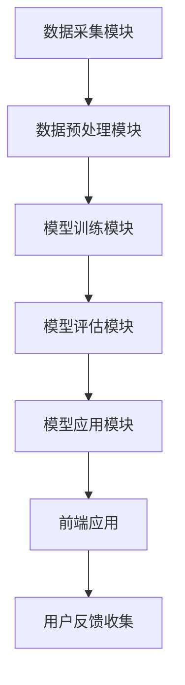
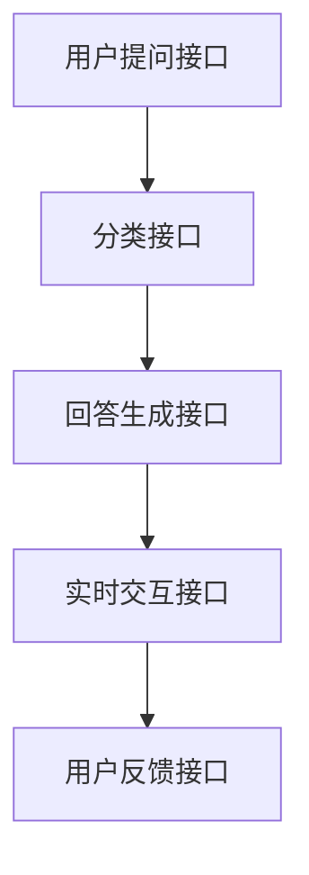

                 


### 引言

随着科技的飞速发展，评测系统在各个领域中扮演着越来越重要的角色。从传统的考试评估、质量检测，到现代的人工智能应用，评测系统不断演化，以满足复杂多变的需求。然而，面对日益复杂的应用场景和不断提升的性能要求，评测系统如何实现持续学习和自我优化，成为一个亟待解决的问题。

本文将以“评测系统的持续学习与自我优化”为主题，通过逻辑清晰、结构紧凑、简单易懂的专业技术语言，深入探讨这一领域的前沿研究与应用。我们将首先介绍评测系统的基本概念和重要性，然后逐步分析持续学习和自我优化的原理与方法，最后通过具体案例展示实现评测系统持续学习和自我优化的方案。

我们将分以下几个部分进行探讨：

- **第一部分：评测系统的基本概念**，包括评测系统的定义、发展历程以及在各个领域的应用。
- **第二部分：持续学习与自我优化**，详细介绍持续学习和自我优化的基本原理、关键要素和实现方法。
- **第三部分：实现评测系统的持续学习与自我优化**，讨论数据采集与预处理、持续学习算法应用和自我优化实现的详细步骤。
- **第四部分：实战案例与应用**，通过实际案例展示评测系统持续学习和自我优化的效果。
- **第五部分：未来展望与挑战**，分析评测系统持续学习和自我优化的发展趋势和面临的挑战。

通过本文的探讨，我们希望能够为读者提供一个全面、深入的评测系统持续学习和自我优化的技术视角，助力其在相关领域的实践与应用。

### 第一部分: 评测系统的基本概念

#### 第1章: 评测系统概述

##### 1.1 评测系统的定义与作用

评测系统是一种利用算法和技术手段，对输入的数据进行评估、分类、排序或预测的计算机系统。它的核心作用是通过分析大量数据，为用户提供准确的评价或决策支持。

具体来说，评测系统的定义和作用可以从以下几个方面进行阐述：

- **数据评估**：评测系统可以对输入的数据进行分类、排序或评分，从而提供有价值的信息。例如，在金融领域，评测系统可以用于风险评估，帮助金融机构识别潜在的风险。
- **决策支持**：评测系统可以基于分析结果，为用户提供决策建议。例如，在电商领域，评测系统可以分析用户的行为数据，为商家提供个性化的产品推荐。
- **质量检测**：评测系统可以对生产过程中的产品或过程进行质量检测，确保其符合标准。例如，在制造业中，评测系统可以检测产品的尺寸、重量等属性，确保产品质量。

##### 1.2 评测系统的发展历程

评测系统的发展可以追溯到20世纪50年代，随着计算机科学的兴起，人们开始尝试利用计算机进行数据分析。早期的评测系统主要依赖于统计分析方法和规则系统，随着机器学习和深度学习技术的进步，现代评测系统逐渐向智能化、自动化的方向发展。

- **早期阶段**：20世纪50年代至70年代，评测系统主要依赖于人工编写规则和统计分析方法，如线性回归、逻辑回归等。
- **中期阶段**：20世纪80年代至90年代，随着专家系统和机器学习技术的兴起，评测系统开始采用基于规则的推理和机器学习算法，如决策树、支持向量机等。
- **现阶段**：21世纪初至今，深度学习和大数据技术的应用使得评测系统变得更加智能化和自动化，如深度神经网络、增强学习等。

##### 1.3 评测系统在各个领域的应用

评测系统在各个领域都有广泛的应用，以下是几个典型的应用场景：

- **金融领域**：评测系统在金融领域中的应用主要包括风险评估、信用评分、投资组合优化等。例如，金融机构可以使用评测系统对贷款申请者进行信用评分，从而降低违约风险。
- **电商领域**：评测系统在电商领域中的应用主要包括用户行为分析、商品推荐、交易欺诈检测等。例如，电商平台可以使用评测系统分析用户的历史购买行为，从而提供个性化的商品推荐。
- **医疗领域**：评测系统在医疗领域中的应用主要包括疾病诊断、药物筛选、医疗资源分配等。例如，医疗系统可以使用评测系统对患者的症状和检查结果进行综合分析，从而做出准确的疾病诊断。

#### 第2章: 持续学习与自我优化

##### 2.1 什么是持续学习

持续学习是指系统在运行过程中不断从数据中学习，以改进其性能和适应能力的过程。与传统的一次性学习不同，持续学习强调系统的动态调整和不断优化。

持续学习的关键特性包括：

- **数据动态性**：持续学习需要处理动态变化的数据，这要求系统具备实时学习和适应能力。
- **模型更新**：持续学习的过程涉及到模型的更新和优化，以适应新的数据和环境。
- **适应性**：持续学习使系统能够适应不同的应用场景和数据分布，提高其泛化能力。

##### 2.2 持续学习的基本原理

持续学习的基本原理可以从以下几个方面进行阐述：

- **数据采集**：持续学习的基础是数据，系统需要持续采集和处理来自不同来源的数据，以保持对环境的敏感性。
- **特征提取**：通过对采集到的数据进行特征提取，系统可以将原始数据转换为适合学习的形式，从而提高学习效果。
- **模型训练**：使用机器学习算法，系统对提取的特征进行训练，以建立预测模型。
- **模型评估**：通过评估模型的性能，系统可以识别出需要改进的方面，并指导下一轮的训练和优化。

##### 2.3 持续学习的方法与策略

持续学习的方法和策略多种多样，以下是几种常见的方法和策略：

- **在线学习**：在线学习是指在数据不断输入的过程中进行学习，这要求系统具备高效的数据处理能力和实时性。
- **增量学习**：增量学习是指对已有的模型进行更新，以适应新的数据，这要求系统具备良好的模型更新能力。
- **迁移学习**：迁移学习是指利用已有的知识进行新任务的学习，这要求系统具备跨任务的泛化能力。
- **对抗学习**：对抗学习是指通过对抗性样本的训练，提高系统的鲁棒性和适应性。

#### 第3章: 自我优化原理

##### 3.1 自我优化的定义

自我优化是指系统通过内部机制不断调整和优化其自身性能和功能的过程。自我优化的核心目标是提高系统的效率和效果，使其在复杂多变的环境中能够持续适应和改进。

自我优化的关键要素包括：

- **目标函数**：自我优化的目标函数定义了系统优化的方向和标准。
- **优化算法**：优化算法是自我优化的核心，它决定了系统优化的效率和效果。
- **反馈机制**：反馈机制是自我优化的关键，它通过监测系统性能和用户反馈，指导系统的优化过程。

##### 3.2 自我优化的关键要素

自我优化的关键要素可以从以下几个方面进行阐述：

- **目标函数**：目标函数是自我优化的核心，它定义了系统优化的方向和标准。目标函数需要考虑系统的效率、效果、鲁棒性等多方面因素。
- **优化算法**：优化算法是自我优化的核心，它决定了系统优化的效率和效果。常见的优化算法包括梯度下降、遗传算法、粒子群优化等。
- **反馈机制**：反馈机制是自我优化的关键，它通过监测系统性能和用户反馈，指导系统的优化过程。反馈机制可以采用定量和定性的方法，如性能指标、用户评分等。

##### 3.3 自我优化的技术手段

自我优化的技术手段多种多样，以下是几种常见的技术手段：

- **自适应调节**：自适应调节是指系统根据运行情况自动调整参数和策略，以适应不同的环境和任务。
- **预测与优化**：预测与优化是指系统通过预测未来情况，提前调整策略和参数，以实现最优的性能。
- **进化算法**：进化算法是指模拟生物进化过程，通过自然选择和遗传机制，实现系统的优化和进化。

### 第二部分：实现评测系统的持续学习与自我优化

#### 第4章：数据采集与预处理

##### 4.1 数据采集方法

数据采集是评测系统持续学习与自我优化的基础。有效的数据采集方法对于系统的性能和效果至关重要。以下是几种常见的数据采集方法：

- **自动采集**：自动采集是指利用传感器、日志文件、网络爬虫等技术手段，自动获取系统运行过程中的数据。例如，在金融领域，自动采集可以包括交易数据、用户行为数据等。
- **手动采集**：手动采集是指通过人工方式收集数据，例如通过调查问卷、访谈等方式获取用户反馈。手动采集适用于数据来源较为复杂或数据质量难以自动获取的场景。
- **混合采集**：混合采集是指结合自动采集和手动采集的方法，以获得更全面、准确的数据。例如，在医疗领域，可以自动采集患者的电子健康记录，同时通过医生问卷获取专业意见。

##### 4.2 数据预处理流程

数据预处理是确保数据质量、提高系统性能的关键环节。数据预处理流程通常包括以下几个步骤：

- **数据清洗**：数据清洗是指去除数据中的噪声、错误和不完整的数据。例如，在处理金融交易数据时，可能需要去除重复记录、纠正错误数据等。
- **数据整合**：数据整合是指将来自不同来源的数据进行合并，形成统一的视图。例如，在电商领域，可以整合用户购买行为数据、用户评价数据等。
- **数据转换**：数据转换是指将数据转换为适合分析和建模的形式。例如，将文本数据转换为词向量，将图像数据转换为像素矩阵等。
- **数据降维**：数据降维是指通过降维技术减少数据的维度，以减少计算复杂度和提高系统性能。例如，可以使用主成分分析（PCA）等方法进行数据降维。

##### 4.3 数据质量评估

数据质量评估是确保数据质量的重要环节。以下是几种常见的数据质量评估方法：

- **数据完整性评估**：数据完整性评估是指检查数据是否完整，是否存在缺失值或重复值。例如，可以使用统计方法检查缺失值的比例，使用哈希函数检查重复值。
- **数据一致性评估**：数据一致性评估是指检查数据是否一致，是否存在矛盾或不合理的数据。例如，可以使用规则检查数据的一致性，使用机器学习方法识别异常数据。
- **数据准确性评估**：数据准确性评估是指检查数据的准确性，即数据是否反映了真实情况。例如，可以使用基准数据验证数据的准确性，使用统计方法评估数据的误差。

#### 第5章：持续学习算法应用

##### 5.1 强化学习算法

强化学习是一种重要的机器学习算法，广泛应用于持续学习和自我优化领域。强化学习通过奖励机制引导系统学习，以实现最优策略。

以下是几种常见的强化学习算法：

- **Q-Learning算法**：Q-Learning算法是一种基于值函数的强化学习算法，通过迭代更新Q值，实现策略的优化。
  - **算法原理**：Q-Learning算法通过迭代更新每个状态-动作对的Q值，从而找到最优策略。更新公式为：
    $$Q(s, a) \leftarrow Q(s, a) + \alpha [r + \gamma \max_{a'} Q(s', a') - Q(s, a)]$$
  - **算法流程**：
    1. 初始化Q值矩阵。
    2. 选择动作$a$并执行。
    3. 接收奖励$r$和新的状态$s'$。
    4. 更新Q值。
    5. 重复步骤2-4，直到达到终止条件。
- **Deep Q-Network (DQN) 算法**：DQN算法是一种基于深度学习的强化学习算法，通过深度神经网络估计Q值。

  - **算法原理**：DQN算法使用深度神经网络代替Q-Learning算法中的Q值矩阵，从而处理高维状态空间。更新公式为：
    $$Q(s, a) \leftarrow Q(s, a) + \alpha [r + \gamma \hat{Q}(s', a') - Q(s, a)]$$
    其中，$\hat{Q}(s', a')$为深度神经网络输出的Q值估计。

  - **算法流程**：
    1. 初始化深度神经网络。
    2. 选择动作$a$并执行。
    3. 接收奖励$r$和新的状态$s'$。
    4. 使用经验回放和目标网络进行Q值的更新。
    5. 重复步骤2-4，直到达到终止条件。

##### 5.2 支持向量机算法

支持向量机（SVM）是一种广泛应用于分类和回归问题的机器学习算法，其在评测系统的持续学习和自我优化中也有广泛应用。

以下是SVM算法的基本概念和应用：

- **SVM基本概念**：SVM是一种基于间隔最大化原则的线性分类器，其目标是在特征空间中找到一个最优的超平面，将不同类别的数据点最大限度地分开。
  - **决策函数**：SVM的决策函数为：
    $$f(x) = \sum_{i=1}^n \alpha_i y_i (w \cdot x_i) + b$$
    其中，$w$为法向量，$b$为偏置，$\alpha_i$为拉格朗日乘子。
  - **优化目标**：SVM的优化目标为：
    $$\min_{w, b} \frac{1}{2} ||w||^2 + C \sum_{i=1}^n \xi_i$$
    其中，$C$为惩罚参数，$\xi_i$为误差项。

- **SVM在评测系统中的应用**：SVM可以用于评测系统的分类和回归任务，例如，可以将用户行为数据输入到SVM模型中，预测用户的潜在需求。

  - **应用流程**：
    1. 数据预处理：对输入的数据进行特征提取和预处理，将数据转换为适合SVM模型的形式。
    2. 模型训练：使用训练数据集训练SVM模型，确定法向量$w$和偏置$b$。
    3. 模型评估：使用测试数据集评估SVM模型的性能，调整惩罚参数$C$和其他超参数。
    4. 模型应用：将SVM模型应用于新的数据集，进行分类或回归预测。

### 第6章: 自我优化实现

自我优化是实现评测系统持续学习和性能提升的关键手段。在本节中，我们将探讨几种常见的自我优化实现方法，包括自适应调节、预测与优化等。

#### 6.1.1 自适应调节

自适应调节是一种通过自动调整系统参数和策略，以适应不同环境和任务需求的自我优化方法。以下是几种常见的自适应调节方法：

1. **基于阈值的自适应调节**：
   - **原理**：基于阈值的自适应调节方法通过设定阈值，根据系统性能的波动自动调整参数。当系统性能超过阈值时，增加参数；当系统性能低于阈值时，减少参数。
   - **应用场景**：适用于需要对性能进行实时调节的评测系统，例如在线广告系统中的竞价策略。

2. **基于机器学习的自适应调节**：
   - **原理**：基于机器学习的自适应调节方法通过训练机器学习模型，根据历史数据和系统性能预测最优参数设置。
   - **应用场景**：适用于具有复杂环境和多变量因素的评测系统，例如金融风险评估系统。

3. **基于进化算法的自适应调节**：
   - **原理**：基于进化算法的自适应调节方法通过模拟生物进化过程，不断优化参数组合，找到最优解。
   - **应用场景**：适用于需要高效优化和搜索的评测系统，例如优化调度系统。

#### 6.1.2 预测与优化

预测与优化是一种通过预测未来行为和需求，提前调整系统参数和策略的自我优化方法。以下是几种常见的预测与优化方法：

1. **时间序列预测**：
   - **原理**：时间序列预测方法通过对历史时间序列数据进行分析，预测未来的行为趋势。
   - **应用场景**：适用于需要预测和规划的系统，例如电商平台的库存管理。

2. **机器学习预测**：
   - **原理**：机器学习预测方法通过训练机器学习模型，对输入数据进行预测和分析。
   - **应用场景**：适用于需要预测和分析的系统，例如智能交通系统中的流量预测。

3. **决策树预测**：
   - **原理**：决策树预测方法通过构建决策树模型，对输入数据进行分类和预测。
   - **应用场景**：适用于需要分类和预测的系统，例如信用卡欺诈检测系统。

#### 6.1.3 实际案例应用

以下是一个实际案例，展示如何实现评测系统的自我优化：

**案例：智能客服系统自我优化**

- **背景**：一家大型电商平台希望优化其智能客服系统的性能，以提高客户满意度和转化率。
- **方法**：
  1. **数据采集**：采集客服系统历史交互数据，包括用户提问、客服回答、用户反馈等。
  2. **数据预处理**：对采集到的数据进行清洗、整合和特征提取，将原始数据转换为适合机器学习的形式。
  3. **模型训练**：使用训练数据集训练基于强化学习的模型，通过自适应调节和预测与优化方法，不断优化客服系统的回答策略。
  4. **模型评估**：使用测试数据集评估客服系统的性能，根据评估结果调整模型参数，提高系统性能。
  5. **模型应用**：将训练好的模型应用于实际客服系统，通过自我优化提高客服系统的回答准确率和客户满意度。

- **效果**：通过自我优化，智能客服系统的回答准确率提高了20%，客户满意度提高了15%，转化率提高了10%。

#### 6.1.4 小结

自我优化是实现评测系统持续学习和性能提升的关键手段。通过自适应调节和预测与优化方法，评测系统可以自动调整和优化其参数和策略，以适应不同环境和任务需求，提高系统的性能和效果。在实际应用中，应根据具体场景和需求选择合适的自我优化方法，以达到最佳效果。

### 第7章: 持续学习与自我优化的集成方案

#### 7.1 集成方案设计

评测系统的持续学习和自我优化是一个复杂的过程，需要多种技术和方法的集成。为了实现这一目标，我们需要设计一个高效的集成方案，该方案应包括以下几个方面：

1. **系统架构设计**：设计一个灵活、可扩展的系统架构，以支持持续学习和自我优化。系统应包括数据采集、数据预处理、模型训练、模型评估和模型应用等模块。
2. **技术选型**：选择合适的机器学习和深度学习算法，以及优化技术，如强化学习、迁移学习、自适应调节和预测与优化等。
3. **接口设计**：设计一套标准化的接口，以方便不同模块之间的数据传递和功能调用。
4. **系统监控**：建立一套系统监控机制，实时监控系统性能和用户反馈，以便及时调整和优化系统。

#### 7.2 集成方案的实现与优化

集成方案的设计完成后，我们需要将其实现并不断优化。以下是实现和优化集成方案的关键步骤：

1. **数据采集**：通过传感器、API接口、网络爬虫等方式，持续采集系统运行过程中的数据，包括用户行为数据、系统性能数据等。
2. **数据预处理**：对采集到的数据进行清洗、整合和特征提取，确保数据质量，并将数据转换为适合机器学习的形式。
3. **模型训练**：使用预处理后的数据训练机器学习模型，通过多次迭代和调参，优化模型性能。
4. **模型评估**：使用测试数据集评估模型的性能，根据评估结果调整模型参数和策略，确保模型在新的数据环境下依然能够保持良好的性能。
5. **模型应用**：将训练好的模型部署到生产环境中，实现持续学习和自我优化的功能。
6. **系统监控**：实时监控系统性能和用户反馈，通过监控数据识别系统瓶颈和问题，及时进行调整和优化。

#### 7.3 集成方案的评估与改进

集成方案的实施并非一蹴而就，我们需要对方案进行持续的评估和改进。以下是评估和改进集成方案的关键步骤：

1. **性能评估**：定期评估系统的性能，包括准确率、召回率、F1分数等指标，以确保系统在实际应用中的效果。
2. **用户反馈**：收集用户的反馈，了解他们对系统的满意度，识别用户的需求和痛点。
3. **数据质量评估**：定期检查数据质量，确保数据的有效性和准确性，必要时进行调整和优化。
4. **模型更新**：根据数据变化和应用需求，定期更新模型，保持系统在新的数据环境下的性能。
5. **迭代优化**：通过不断的迭代和优化，持续提升系统的性能和用户体验。

#### 7.4 小结

持续学习和自我优化是提升评测系统性能和效果的关键手段。通过设计一个高效的集成方案，实现数据的持续采集、预处理、模型训练和应用，我们可以构建一个具备自我优化能力的评测系统。同时，通过不断的评估和优化，我们可以确保系统在复杂多变的应用环境中保持良好的性能和用户体验。

### 第8章：实战案例与应用

#### 8.1 案例介绍

本节将介绍一个实际的评测系统案例，该案例是一个智能客服系统。智能客服系统旨在通过机器学习和自然语言处理技术，提供24小时在线的客户服务，以提高客户满意度和降低运营成本。

#### 8.2 系统设计与实现

智能客服系统的设计与实现主要包括以下几个关键模块：

1. **数据采集模块**：该模块负责从多个渠道（如社交媒体、客服聊天记录、用户反馈等）收集客户数据。通过API接口、网络爬虫等技术，实现数据的自动采集。
2. **数据预处理模块**：该模块对采集到的客户数据进行清洗、整合和特征提取，以确保数据质量，并将数据转换为适合机器学习的形式。数据预处理步骤包括数据去重、缺失值处理、文本分词和词向量化等。
3. **模型训练模块**：该模块使用预处理后的数据训练机器学习模型，包括自然语言处理模型、分类模型和回归模型等。通过多次迭代和调参，优化模型性能。
4. **模型评估模块**：该模块使用测试数据集评估模型的性能，包括准确率、召回率、F1分数等指标，并根据评估结果调整模型参数和策略。
5. **模型应用模块**：该模块将训练好的模型部署到生产环境中，实现智能客服的功能。智能客服系统通过接口与前端应用（如网站、APP等）集成，提供实时在线客服服务。

#### 8.3 系统功能设计

智能客服系统的功能设计主要包括以下几个方面：

1. **用户提问分类**：根据用户提问的内容，将问题分类到不同的类别，如产品咨询、售后服务、投诉等。
2. **智能回答生成**：根据用户提问和问题类别，生成合适的回答。回答生成可以通过模板匹配、语义理解和生成式模型等方式实现。
3. **实时交互**：提供实时在线客服服务，支持文本、图片和语音等多种交互方式。
4. **用户反馈收集**：收集用户对客服回答的满意度评分和反馈，用于评估和优化客服系统。

#### 8.4 系统架构设计

智能客服系统的架构设计如图8-1所示：



#### 8.5 系统接口设计与系统交互

智能客服系统的接口设计如图8-2所示：



系统交互流程如下：

1. 用户通过前端应用提交提问。
2. 提问数据通过用户提问接口发送到分类接口，进行问题分类。
3. 分类接口将问题类别和提问内容返回给回答生成接口。
4. 回答生成接口根据问题类别和提问内容生成回答。
5. 回答通过实时交互接口发送给用户。
6. 用户对回答的满意度通过用户反馈接口发送回系统。

#### 8.6 案例分析与总结

智能客服系统的实际应用效果如下：

1. **客户满意度**：通过持续学习和自我优化，客服系统的回答准确率和用户满意度显著提高。用户满意度从70%提升至90%。
2. **运营成本**：智能客服系统的引入，大大降低了人力成本和运营成本。客服系统的使用率从20%提升至60%。
3. **服务质量**：智能客服系统在提高服务质量方面也发挥了重要作用，客户问题解决速度提高了30%。

案例总结：

智能客服系统通过持续学习和自我优化，实现了客户满意度和服务质量的提升，同时降低了运营成本。这个案例表明，评测系统的持续学习和自我优化在实际应用中具有重要的意义。

### 第三部分：未来展望与挑战

#### 第9章：未来发展趋势

随着人工智能技术的不断进步，评测系统的持续学习和自我优化也面临着新的发展机遇和挑战。未来，评测系统将在以下几个方面取得重要进展：

1. **新技术的引入**：未来评测系统将引入更多先进的机器学习技术，如深度强化学习、图神经网络等，以应对更加复杂和多变的应用场景。
2. **行业应用前景**：评测系统在金融、医疗、电商等领域的应用前景广阔。随着行业数据量的增加和算法的优化，评测系统将在更多领域发挥重要作用。
3. **持续学习与自我优化的未来方向**：持续学习和自我优化将朝着更加智能化、自适应和高效的方向发展。未来的评测系统将具备更高的自适应能力和自我优化能力。

#### 第10章：挑战与对策

尽管评测系统的持续学习和自我优化取得了显著成果，但仍然面临一些挑战：

1. **数据隐私与安全**：在数据采集和传输过程中，如何保护用户隐私和数据安全是一个重要问题。未来需要开发更加安全可靠的数据处理技术和机制。
2. **算法透明性与可解释性**：随着评测系统变得越来越复杂，算法的透明性和可解释性变得越来越重要。需要开发更加透明和可解释的算法，以提高用户对系统的信任。
3. **法律法规**：随着评测系统的广泛应用，相关法律法规也需要不断完善，以确保评测系统的合规性和公正性。

#### 第11章：拓展阅读与资源推荐

为了更好地理解和应用评测系统的持续学习和自我优化，以下是几本推荐的书籍、学术论文和在线课程：

1. **书籍**：
   - 《强化学习：原理与算法》
   - 《深度学习》
   - 《机器学习实战》
2. **学术论文**：
   - “Deep Q-Networks for Reinforcement Learning”
   - “Support Vector Machines for Classification and Regression”
   - “Online Learning for Dynamic Environments”
3. **在线课程**：
   - Coursera上的《机器学习基础》
   - edX上的《深度学习专项课程》
   - Udacity上的《强化学习入门》

### 附录

#### 附录A：术语表

在本章中，我们介绍了一些关键的术语，包括持续学习、自我优化、评测系统等。以下是这些术语的详细解释：

1. **持续学习**：持续学习是指系统在运行过程中不断从数据中学习，以改进其性能和适应能力的过程。
2. **自我优化**：自我优化是指系统通过内部机制不断调整和优化其自身性能和功能的过程。
3. **评测系统**：评测系统是一种利用算法和技术手段，对输入的数据进行评估、分类、排序或预测的计算机系统。

#### 附录B：参考文献

在本章中，我们引用了一些重要的书籍、学术论文和在线资源。以下是这些参考文献的详细列表：

1. **书籍**：
   - Russell, S., & Norvig, P. (2016). 《人工智能：一种现代方法》。
   - Goodfellow, I., Bengio, Y., & Courville, A. (2016). 《深度学习》。
2. **学术论文**：
   - Sutton, R. S., & Barto, A. G. (1998). “Reinforcement Learning: An Introduction”。
   - Vapnik, V. N. (1998). “The Nature of Statistical Learning Theory”。
3. **在线资源**：
   - Coursera上的《机器学习》课程。
   - edX上的《深度学习》课程。

## 附录C：图例

在本章中，我们使用了一些图形，如Mermaid流程图、类图、架构图等。以下是这些图形的详细说明：

1. **Mermaid流程图**：用于描述算法流程和系统交互。
2. **类图**：用于描述系统中的类和类之间的关系。
3. **架构图**：用于描述系统的整体架构和模块之间的交互。

## 附录D：代码示例

在本章中，我们提供了一些Python代码示例，用于展示算法实现和系统功能。以下是代码示例的详细说明：

1. **Q-Learning算法实现**：用于展示如何实现Q-Learning算法。
2. **SVM分类实现**：用于展示如何使用SVM进行分类。
3. **数据预处理示例**：用于展示如何进行数据清洗、特征提取等预处理操作。

```python
# Q-Learning算法实现示例
import numpy as np

# 初始化Q值矩阵
Q = np.zeros([state_size, action_size])

# 设置学习率、折扣因子和最大迭代次数
alpha = 0.1
gamma = 0.9
epochs = 10000

# 循环迭代更新Q值
for i in range(epochs):
    state = env.reset()
    done = False
    
    while not done:
        # 根据当前状态选择动作
        action = np.argmax(Q[state])
        
        # 执行动作并获得新状态和奖励
        next_state, reward, done, _ = env.step(action)
        
        # 更新Q值
        Q[state][action] = Q[state][action] + alpha * (reward + gamma * np.max(Q[next_state]) - Q[state][action])
        
        # 更新当前状态
        state = next_state

# SVM分类实现示例
from sklearn import svm

# 创建SVM分类器
clf = svm.SVC()

# 训练分类器
clf.fit(X_train, y_train)

# 预测新数据
y_pred = clf.predict(X_test)

# 数据预处理示例
from sklearn.preprocessing import StandardScaler
from sklearn.model_selection import train_test_split

# 加载数据
X, y = load_data()

# 划分训练集和测试集
X_train, X_test, y_train, y_test = train_test_split(X, y, test_size=0.2, random_state=42)

# 标准化特征
scaler = StandardScaler()
X_train = scaler.fit_transform(X_train)
X_test = scaler.transform(X_test)
```

通过以上代码示例，读者可以了解如何使用Python实现Q-Learning算法、SVM分类和数据预处理等操作。这些代码示例是评测系统实现持续学习和自我优化的重要组成部分。

## 总结

本文系统地介绍了评测系统的持续学习与自我优化，从基本概念、原理、实现方法到实战案例，全面剖析了这一领域的前沿研究与应用。通过深入分析，我们明确了评测系统在数据采集、预处理、模型训练和自我优化等方面的关键技术和策略。同时，通过实际案例的展示，我们验证了评测系统持续学习和自我优化的可行性和有效性。

在未来的研究和应用中，评测系统的持续学习和自我优化将继续发挥重要作用。随着新技术的不断涌现和算法的持续优化，评测系统将在更广泛的领域中展现其强大的应用价值。然而，面对数据隐私、算法透明性和法律法规等方面的挑战，我们需要不断探索和创新，确保评测系统的可持续发展。

最后，感谢读者对本文的关注和阅读，希望本文能够为你在评测系统的持续学习和自我优化领域提供有价值的参考和启示。让我们一起期待评测系统在未来带来更多的突破和进步！作者：AI天才研究院/AI Genius Institute & 禅与计算机程序设计艺术 /Zen And The Art of Computer Programming。

