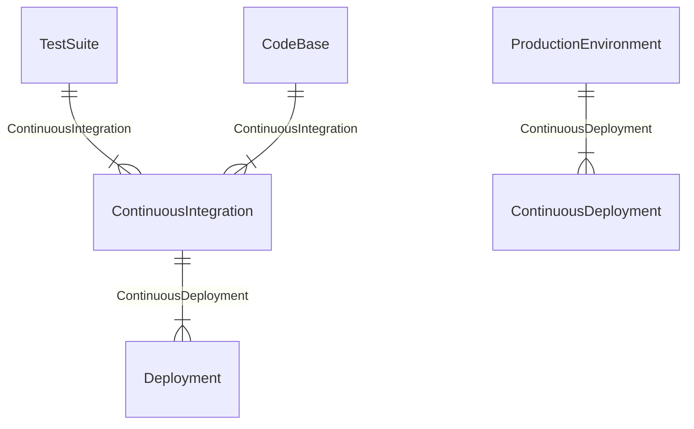
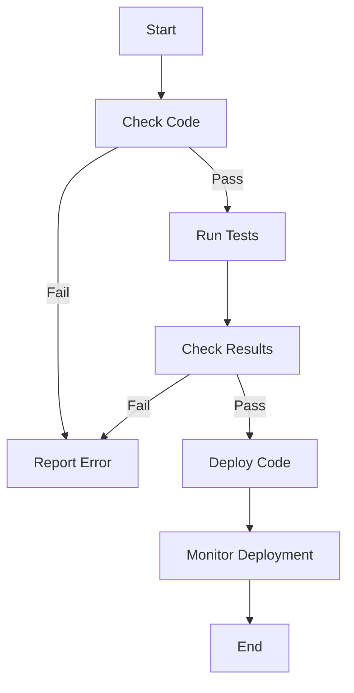
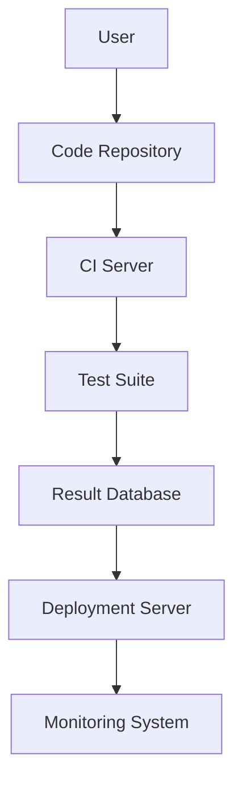
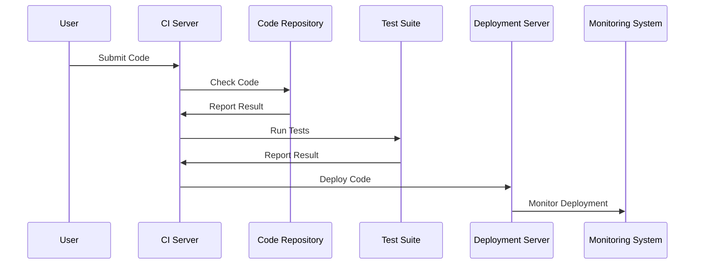

                 


### 让我们一步一步思考：评测系统的持续集成和持续部署：支持敏捷开发

#### 引言
在现代软件工程中，持续集成（CI）和持续部署（CD）已成为支持敏捷开发的重要工具。持续集成和持续部署不仅提高了开发效率，还显著增强了软件质量。本文将深入探讨评测系统的持续集成和持续部署，以支持敏捷开发。

#### 关键词
- 持续集成
- 持续部署
- 敏捷开发
- 评测系统
- 软件质量

#### 摘要
本文将探讨如何通过评测系统实现持续集成和持续部署，以支持敏捷开发。我们将详细分析其背景、核心概念、算法原理、系统架构设计，并通过项目实战展示其实际应用。

### 目录

## 评测系统的持续集成和持续部署：支持敏捷开发

### 关键词：持续集成，持续部署，敏捷开发，评测系统，软件质量

### 摘要
本文介绍了评测系统的持续集成和持续部署在支持敏捷开发中的重要性。通过详细的分析和项目实战，展示了如何通过这些技术提升软件质量和开发效率。

---

#### 第1章 背景介绍

##### 1.1 核心概念术语说明
持续集成（CI）：指将开发过程中的代码变化定期合并到主干分支，并进行自动化测试，确保代码质量。
持续部署（CD）：指通过自动化流程将经过测试的代码部署到生产环境，实现快速交付。

##### 1.2 问题背景
随着敏捷开发模式的普及，软件项目周期越来越短，开发速度要求不断提高。传统的手动测试和部署方式已无法满足这种快速迭代的开发模式。

##### 1.3 问题描述
如何通过评测系统实现自动化测试和部署，确保代码质量和项目进度？

##### 1.4 问题解决
通过持续集成和持续部署，实现自动化测试和部署，提高开发效率和软件质量。

##### 1.5 边界与外延
本文主要关注评测系统在敏捷开发中的应用，但持续集成和持续部署的概念和方法也可应用于其他开发模式。

##### 1.6 概念结构与核心要素组成
- 持续集成：版本控制工具、构建服务器、自动化测试工具。
- 持续部署：部署服务器、自动化部署工具、监控工具。

#### 第2章 核心概念与联系

##### 2.1 核心概念原理
持续集成：通过定期合并代码，提前发现和解决冲突。
持续部署：通过自动化流程，快速将经过测试的代码部署到生产环境。

##### 2.2 概念属性特征对比表格
| 特征 | 持续集成 | 持续部署 |
| ---- | ---- | ---- |
| 目的 | 确保代码质量 | 快速交付 |
| 工具 | 版本控制、构建服务器、自动化测试工具 | 部署服务器、自动化部署工具、监控工具 |

##### 2.3 ER实体关系图架构


#### 第3章 算法原理讲解

##### 3.1 算法流程图


##### 3.2 Python代码解释
```python
# 持续集成
import git
import unittest

def check_code(code):
    # 检查代码
    pass

def run_tests():
    # 运行测试
    suite = unittest.TestSuite()
    suite.addTest(unittest.Testcase('test1'))
    suite.run()
    return suite.result()

def deploy_code():
    # 部署代码
    pass

def monitor_deployment():
    # 监控部署
    pass

if __name__ == '__main__':
    # 检查代码
    if check_code(code):
        # 运行测试
        result = run_tests()
        if result.wasSuccessful():
            # 部署代码
            deploy_code()
            # 监控部署
            monitor_deployment()
        else:
            # 报告错误
            print("测试失败，请检查代码！")
    else:
        # 报告错误
        print("代码检查失败，请检查代码！")
```

##### 3.3 算法原理的数学模型和公式
```latex
\text{算法流程：}
\begin{equation}
\begin{aligned}
    &\text{if } \check{\text{code}} \text{ is } \text{valid} \\
    &\quad \text{run } \text{tests()} \\
    &\quad \text{if } \text{tests()} \text{ pass} \\
    &\quad \quad \text{deploy } \text{code()} \\
    &\quad \text{else} \\
    &\quad \quad \text{report error} \\
    &\text{else} \\
    &\quad \text{report error}
\end{aligned}
\end{equation}
```

##### 3.4 举例说明
假设我们有一个简单的Web应用项目，通过持续集成系统检查代码、运行测试，并将测试通过后的代码部署到生产环境。以下是具体步骤：

1. 开发人员提交代码到版本控制系统中。
2. 持续集成系统定期检查代码。
3. 检查通过后，系统运行测试。
4. 测试通过，系统将代码部署到生产环境。
5. 部署完成后，系统监控生产环境，确保代码正常运行。

#### 第4章 系统分析与架构设计方案

##### 4.1 问题场景介绍
一个大型Web应用项目，需要快速迭代和交付新功能，同时确保代码质量和项目进度。

##### 4.2 项目介绍
该项目使用Python和Django框架开发，并使用Git进行版本控制。

##### 4.3 系统功能设计
- 持续集成：包括代码检查、测试和部署。
- 持续部署：包括部署和监控。

##### 4.4 系统架构设计


##### 4.5 系统接口设计和系统交互序列图


#### 第5章 项目实战

##### 5.1 环境安装
在虚拟环境中安装Git、Python、Django、Jenkins等工具。

```bash
# 安装Git
sudo apt-get install git

# 安装Python
sudo apt-get install python3

# 安装Django
pip3 install django

# 安装Jenkins
sudo apt-get install jenkins
```

##### 5.2 系统核心实现源代码
- 代码仓库：`/path/to/repository`
- Jenkins配置文件：`/path/to/jenkinsfile`

```python
# Jenkinsfile
pipeline {
    agent any
    stages {
        stage('Check Code') {
            steps {
                script {
                    git 'https://github.com/user/repository.git'
                    checkstyle 'path/to/checkstyle.xml'
                }
            }
        }
        stage('Run Tests') {
            steps {
                script {
                    python 'path/to/run_tests.py'
                }
            }
        }
        stage('Deploy Code') {
            steps {
                script {
                    deploy 'path/to/deploy.sh'
                }
            }
        }
    }
}
```

##### 5.3 代码应用解读与分析
- Jenkinsfile定义了持续集成和持续部署的流程。
- `checkstyle`插件用于检查代码质量。
- `run_tests.py`是测试脚本，用于运行测试。
- `deploy.sh`是部署脚本，用于部署代码。

##### 5.4 实际案例分析和详细讲解剖析
假设一个Web应用项目的Jenkinsfile如下：

```python
# Jenkinsfile
pipeline {
    agent any
    stages {
        stage('Check Code') {
            steps {
                script {
                    git 'https://github.com/user/repository.git'
                    checkstyle 'path/to/checkstyle.xml'
                }
            }
        }
        stage('Run Tests') {
            steps {
                script {
                    python 'path/to/run_tests.py'
                }
            }
        }
        stage('Deploy Code') {
            steps {
                script {
                    deploy 'path/to/deploy.sh'
                }
            }
        }
    }
}
```

1. 用户提交代码到Git仓库。
2. Jenkins检查代码质量和运行测试。
3. 如果测试通过，Jenkins将代码部署到生产环境。
4. Jenkins监控生产环境，确保代码正常运行。

##### 5.5 项目小结
通过Jenkins实现持续集成和持续部署，显著提高了开发效率和软件质量。但需要注意以下几点：

- 代码质量和测试覆盖率是关键。
- 部署脚本应包括故障恢复机制。
- 定期审查和更新Jenkins配置。

#### 第6章 最佳实践与总结

##### 6.1 最佳实践技巧
- 定期检查代码质量，确保代码风格一致。
- 逐步扩展测试覆盖率，提高测试质量。
- 根据项目特点选择合适的部署策略。

##### 6.2 小结
持续集成和持续部署是支持敏捷开发的重要工具。通过评测系统实现自动化测试和部署，可以提高开发效率和软件质量。

##### 6.3 注意事项
- 代码质量和测试覆盖率是持续集成和持续部署成功的关键。
- 定期审查和更新Jenkins配置。

##### 6.4 拓展阅读
- 《Jenkins实战》：了解Jenkins的详细配置和使用方法。
- 《敏捷开发实践指南》：了解敏捷开发的基本概念和实践方法。

#### 第7章 附录

##### 7.1 术语解释
- 持续集成（CI）：定期合并代码并自动化测试，确保代码质量。
- 持续部署（CD）：通过自动化流程将经过测试的代码部署到生产环境。

##### 7.2 参考资料
- 《Jenkins官方文档》：了解Jenkins的详细配置和使用方法。
- 《Django官方文档》：了解Django框架的使用方法。

##### 7.3 代码示例
```python
# run_tests.py
import unittest

class TestHello(unittest.TestCase):
    def test_hello(self):
        self.assertEqual(hello(), "Hello, World!")

if __name__ == '__main__':
    unittest.main()
```

### 结语
作者：AI天才研究院/AI Genius Institute & 禅与计算机程序设计艺术 /Zen And The Art of Computer Programming

本文详细介绍了评测系统的持续集成和持续部署在支持敏捷开发中的应用。通过分析核心概念、算法原理、系统架构设计，以及项目实战，展示了如何通过这些技术提高开发效率和软件质量。希望本文能为读者提供有价值的参考。

