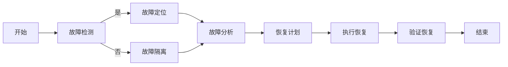
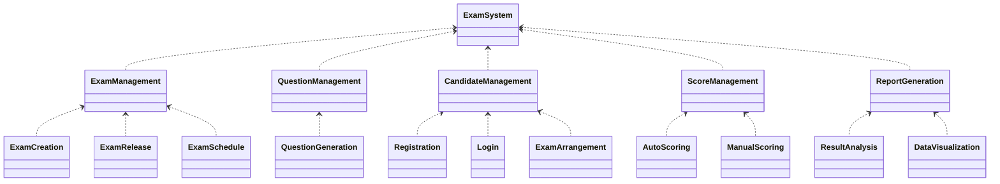
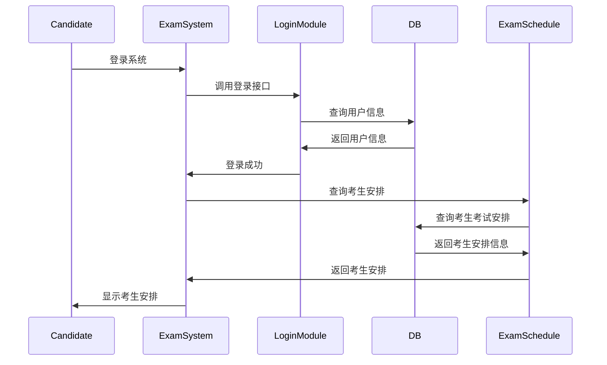
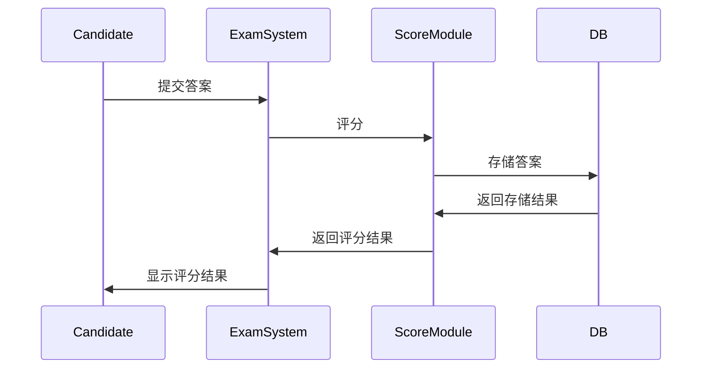
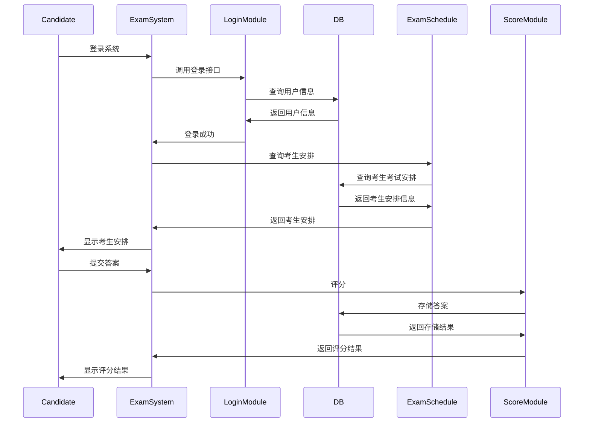

                 


### 第一部分：问题背景与核心概念

#### 第1章：评测系统的故障恢复与容错设计概述

##### 1.1.1 问题背景

评测系统，作为信息化考试与评价的重要工具，在各类教育、招聘、认证等领域中发挥着重要作用。它通过自动化、智能化的手段，对参与者的表现进行客观评估，从而提高评估的公正性和效率。然而，随着系统复杂度的增加和负载压力的增大，评测系统面临的故障风险也随之增加。

**评测系统的基本概念与作用**：

评测系统通常包括考试管理、题目生成、考生管理、评分管理、报告生成等模块。其主要功能是：

1. **考试管理**：创建、发布、管理考试。
2. **题目生成**：根据考试类型和难度要求，自动生成合适的试题。
3. **考生管理**：对考生进行注册、登录、考试安排等操作。
4. **评分管理**：对考生的作答进行自动评分或人工评分。
5. **报告生成**：生成考试结果报告，为考生和教师提供分析数据。

**系统故障恢复与容错设计的重要性**：

系统故障，如硬件故障、软件错误、网络中断等，都可能对评测活动的顺利进行造成严重影响。因此，故障恢复与容错设计成为评测系统设计中不可或缺的一部分。其重要性体现在以下几个方面：

1. **保障评测活动的连续性**：故障发生时，系统能够快速恢复，保证评测活动的连续性，避免因故障导致的评估中断。
2. **提高系统可靠性**：通过容错设计，系统在面对各种故障时能够保持稳定运行，提高系统的可靠性。
3. **降低系统风险**：故障恢复与容错设计能够减少系统故障带来的损失，降低风险。
4. **提升用户体验**：快速、可靠的故障恢复，可以提高用户的使用体验，增强系统的公信力和用户满意度。

##### 1.1.2 问题描述

评测系统可能面临的主要故障类型包括：

1. **硬件故障**：如服务器宕机、网络设备故障等，导致系统无法正常提供服务。
2. **软件错误**：如代码缺陷、系统崩溃等，导致系统功能无法正常执行。
3. **网络中断**：如网络连接故障、DNS解析失败等，导致考生无法正常登录系统或题目无法正确提交。
4. **数据丢失**：如数据库损坏、文件丢失等，导致考试数据无法正常保存或查询。

系统故障对评测活动的影响主要包括：

1. **评估中断**：系统故障可能导致正在进行的评测活动被迫中断，影响考试的公正性和效率。
2. **数据丢失**：系统故障可能导致考生作答数据丢失，影响考试成绩的准确性。
3. **用户体验下降**：系统故障可能导致考生和教师对系统的信任度下降，影响用户体验。
4. **评估结果失真**：系统故障可能导致评估结果失真，影响评估的公正性。

##### 1.1.3 解决方案

**故障恢复与容错设计的总体思路**：

为了应对评测系统可能面临的故障，故障恢复与容错设计应遵循以下总体思路：

1. **预防性设计**：通过系统架构设计、代码优化等手段，降低故障发生的概率。
2. **快速响应**：在故障发生时，系统能够快速检测和定位故障，并采取相应的恢复措施。
3. **冗余设计**：通过硬件、软件、数据等多方面的冗余设计，提高系统的容错能力。
4. **恢复与验证**：在故障恢复后，对系统进行验证，确保恢复的有效性和可靠性。

**系统恢复与容错的核心目标**：

系统恢复与容错设计的核心目标是：

1. **保障评测活动的连续性**：在故障发生时，系统能够快速恢复，保证评测活动的顺利进行。
2. **保障数据的完整性**：在故障发生时，系统能够防止数据丢失，确保考生作答数据的安全性和完整性。
3. **提高用户体验**：通过快速、可靠的故障恢复，提高考生和教师的满意度。

##### 1.1.4 边界与外延

**评测系统故障恢复的适用范围**：

评测系统的故障恢复设计主要适用于以下场景：

1. **服务器故障**：如服务器宕机、硬件损坏等。
2. **软件故障**：如代码缺陷、系统崩溃等。
3. **网络故障**：如网络中断、DNS解析失败等。

**容错设计在评测系统中的具体体现**：

容错设计在评测系统中的具体体现包括：

1. **硬件冗余**：如服务器集群、网络冗余等。
2. **软件冗余**：如代码备份、系统冗余等。
3. **数据冗余**：如数据库备份、数据一致性保证等。

**核心概念与联系**：

**故障恢复**：

- 定义：故障恢复是指系统在故障发生时，通过一系列检测、诊断、修复措施，使系统恢复正常运行的过程。
- 属性特征：快速性、可靠性、成本。
- 对比：与容错设计协同实现，故障恢复侧重于故障发生后的修复措施。

**容错设计**：

- 定义：容错设计是指通过系统架构、软件设计、硬件配置等多方面的冗余和优化措施，提高系统在面对故障时的容错能力和可靠性。
- 属性特征：预防性、适应性、冗余性。
- 对比：支持故障恢复，侧重于降低故障发生的概率和提高系统容错能力。

两者关系与区别：

- 关系：故障恢复与容错设计相互关联，容错设计为故障恢复提供基础保障，故障恢复则利用容错设计的结果实现系统的快速恢复。
- 区别：故障恢复侧重于故障发生后的修复措施，容错设计侧重于预防故障发生和提高系统容错能力。

#### 第2章：核心概念与原理

##### 2.1.1 故障恢复原理

**故障恢复的定义**：

故障恢复是指系统在故障发生时，通过一系列检测、诊断、修复措施，使系统恢复正常运行的过程。

**故障恢复的基本策略**：

1. **故障检测**：通过系统监控和日志分析，及时发现故障迹象。
2. **故障定位**：定位故障发生的位置和原因。
3. **故障隔离**：将故障隔离到最小范围，防止故障扩散。
4. **故障分析**：对故障原因进行深入分析，找出根本原因。
5. **恢复计划**：制定恢复计划，确定恢复步骤和所需资源。
6. **执行恢复**：按照恢复计划执行故障修复操作。
7. **验证恢复**：验证故障是否已完全恢复，确保系统正常运行。

**故障恢复的挑战与对策**：

1. **挑战**：

   - 多种故障类型：系统可能面临多种故障类型，如硬件故障、软件故障、网络故障等。
   - 故障检测难度：某些故障难以检测，如系统崩溃、网络中断等。
   - 恢复效率要求高：故障恢复需要在最短时间内完成，以减少对系统正常运行的影响。

2. **对策**：

   - 多层次检测机制：结合硬件、软件、网络等多层次的检测机制，提高故障检测的准确性。
   - 故障预测与预防：通过故障预测和预防措施，减少故障发生的概率。
   - 快速恢复机制：设计高效的恢复机制，缩短故障恢复时间。

##### 2.1.2 容错设计原理

**容错设计的定义**：

容错设计是指通过系统架构、软件设计、硬件配置等多方面的冗余和优化措施，提高系统在面对故障时的容错能力和可靠性。

**容错设计的实现方式**：

1. **硬件冗余**：通过冗余硬件设备，如服务器集群、网络冗余等，提高系统的硬件容错能力。
2. **软件冗余**：通过冗余软件模块，如代码备份、系统冗余等，提高系统的软件容错能力。
3. **数据冗余**：通过冗余数据存储，如数据库备份、数据一致性保证等，提高系统的数据容错能力。
4. **故障屏蔽**：通过故障屏蔽机制，如冗余检测、自动切换等，减少故障对系统的影响。
5. **故障恢复**：在故障发生时，通过故障恢复机制，使系统快速恢复到正常状态。

**容错设计的优缺点**：

1. **优点**：

   - 提高系统可靠性：通过冗余和优化措施，提高系统在面对故障时的可靠性。
   - 降低故障影响：通过故障屏蔽和快速恢复，降低故障对系统的影响。
   - 提高用户体验：通过可靠性和快速恢复，提高用户体验。

2. **缺点**：

   - 增加系统成本：冗余设备和备份系统会增加系统成本。
   - 增加系统复杂性：冗余设计和故障恢复机制会增加系统复杂性。
   - 故障处理难度：在故障发生时，需要进行复杂的故障诊断和处理。

##### 2.1.3 概念属性特征对比表

| 概念         | 定义                                                                                   | 属性特征               | 对比                 |
|------------|--------------------------------------------------------------------------------------|--------------------|-------------------|
| 故障恢复     | 系统在故障发生时，通过一系列检测、诊断、修复措施，使系统恢复正常运行的过程。             | 快速性、可靠性、成本     | 与容错设计协同实现     |
| 容错设计     | 通过系统架构、软件设计、硬件配置等多方面的冗余和优化措施，提高系统在面对故障时的容错能力和可靠性。 | 预防性、适应性、冗余性 | 支持故障恢复           |
| 故障监测模块   | 负责对系统运行状态进行监控，及时发现故障迹象。                                         | 检测准确性、响应速度     | 故障恢复的前提条件       |
| 故障处理模块   | 负责对故障进行定位、隔离和处理，使系统恢复正常运行。                                   | 故障定位准确性、处理效率 | 故障恢复的核心环节       |
| 恢复控制模块   | 负责制定恢复计划，协调各个模块执行恢复操作。                                         | 恢复计划合理性、执行效率   | 故障恢复的执行保障       |
| 系统恢复模块   | 负责执行恢复操作，使系统从故障状态恢复正常状态。                                     | 恢复操作正确性、可靠性     | 故障恢复的直接实施者     |

##### 2.1.4 ER实体关系图架构

```mermaid
erDiagram
    A[评测系统故障] ||--|{ B[故障监测模块] } |
    B ||--|{ C[故障处理模块] } |
    C ||--|{ D[恢复控制模块] } |
    D ||--|{ E[系统恢复模块] } |
```

此ER图展示了评测系统故障恢复过程中各个模块之间的实体关系。故障监测模块负责监控故障迹象，故障处理模块负责定位、隔离和处理故障，恢复控制模块负责制定恢复计划，系统恢复模块负责执行恢复操作。这些模块相互协作，共同实现评测系统的故障恢复。

### 第二部分：故障恢复算法原理与实现

#### 第3章：故障恢复算法原理与实现

##### 3.1.1 故障恢复算法概述

故障恢复算法是指用于检测、定位、隔离、分析和恢复系统故障的一系列计算方法和步骤。根据故障发生的场景和特点，故障恢复算法可以分为多种类型，如基于软件的故障恢复算法、基于硬件的故障恢复算法和基于网络的故障恢复算法等。以下是几种常见的故障恢复算法：

1. **备份与恢复算法**：通过定期备份系统数据和配置，当故障发生时，快速恢复到备份状态，保证系统正常运行。
2. **冗余算法**：通过在系统中部署冗余组件或设备，实现故障的自动切换和恢复，提高系统的容错能力。
3. **自修复算法**：系统在运行过程中，通过自我检测和自我修复机制，发现并修复故障，保证系统持续稳定运行。
4. **故障诊断算法**：通过分析系统日志、性能指标和故障报告，定位故障发生的位置和原因，为故障恢复提供依据。

##### 3.1.2 算法原理讲解

为了更好地理解故障恢复算法的原理，我们可以通过一个mermaid流程图来展示故障恢复的基本步骤。



1. **故障检测**：系统通过监控模块对运行状态进行持续监测，一旦发现异常，立即触发故障检测。
2. **故障定位**：通过故障检测的结果，系统进一步定位故障发生的位置，缩小故障范围。
3. **故障隔离**：将故障隔离到最小范围，避免故障扩散，确保系统其他部分正常运行。
4. **故障分析**：对故障的原因进行深入分析，找出故障的根本原因，为故障恢复提供依据。
5. **恢复计划**：根据故障分析和隔离结果，制定恢复计划，确定恢复步骤和所需资源。
6. **执行恢复**：按照恢复计划执行故障修复操作，使系统恢复正常运行。
7. **验证恢复**：对恢复后的系统进行验证，确保故障已完全修复，系统运行正常。

##### 3.1.3 Python源代码实现

下面是一个简单的Python代码示例，用于实现故障恢复算法的基本流程。

```python
# Python 代码实现故障恢复算法示例

def detect_fault():
    # 故障检测逻辑
    pass

def locate_fault():
    # 故障定位逻辑
    pass

def isolate_fault():
    # 故障隔离逻辑
    pass

def analyze_fault():
    # 故障分析逻辑
    pass

def plan_recover():
    # 恢复计划逻辑
    pass

def execute_recover():
    # 执行恢复逻辑
    pass

def verify_recover():
    # 恢复验证逻辑
    pass

# 故障恢复流程
def recover_flow():
    if detect_fault():
        locate_fault()
        isolate_fault()
        analyze_fault()
        plan_recover()
        execute_recover()
        verify_recover()
    else:
        print("无故障，无需恢复")

# 主函数入口
if __name__ == "__main__":
    recover_flow()
```

在这个示例中，我们定义了故障检测、故障定位、故障隔离、故障分析、恢复计划、执行恢复和恢复验证等一系列函数，并通过`recover_flow()`函数实现了故障恢复的基本流程。

##### 3.1.4 数学模型与公式

在故障恢复过程中，可以使用以下数学模型和公式来描述系统恢复状态和故障发生的概率。

$$
R_t = \alpha_t F_t + (1 - \alpha_t) E_t
$$

其中：

- \(R_t\)：表示系统在时间\(t\)的恢复状态。
- \(\alpha_t\)：表示故障恢复概率，即系统在时间\(t\)成功恢复的概率。
- \(F_t\)：表示故障发生概率，即系统在时间\(t\)发生故障的概率。
- \(E_t\)：表示故障存在概率，即系统在时间\(t\)存在故障的概率。

该公式描述了系统在时间\(t\)的恢复状态，由故障恢复概率、故障发生概率和故障存在概率共同决定。通过调整这些参数，可以优化系统的故障恢复策略，提高系统的可靠性和稳定性。

##### 3.1.5 算法举例说明

假设在某评测系统中，发生了一次服务器故障。具体步骤如下：

1. **故障检测**：监控系统检测到服务器出现异常，触发故障检测。
2. **故障定位**：通过日志分析，确定故障发生的服务器IP地址。
3. **故障隔离**：将故障服务器从系统中隔离，确保其他服务器正常运行。
4. **故障分析**：对故障服务器的日志和系统配置进行深入分析，找出故障原因。
5. **恢复计划**：根据故障原因，制定恢复计划，包括更换服务器硬件、重新部署系统等步骤。
6. **执行恢复**：按照恢复计划，执行故障修复操作，更换故障服务器，重新部署系统。
7. **验证恢复**：对恢复后的系统进行验证，确保故障已完全修复，系统正常运行。

通过以上步骤，评测系统成功从故障状态恢复到正常状态，确保评测活动的顺利进行。

### 第三部分：系统故障恢复与容错设计的实施与优化

#### 第4章：故障恢复算法的优化与实现策略

##### 4.1.1 故障恢复算法优化目标

故障恢复算法的优化目标主要包括以下几个方面：

1. **快速性**：在故障发生后，系统能够尽快恢复，减少故障对系统正常运行的影响。
2. **可靠性**：故障恢复算法在执行过程中，应确保恢复操作的正确性和可靠性。
3. **高效性**：优化故障恢复算法的执行效率，减少恢复时间，提高系统性能。
4. **灵活性**：故障恢复算法应具备一定的灵活性，能够适应不同类型和程度的故障。

##### 4.1.2 故障恢复算法优化策略

1. **多级检测机制**：

   - **硬件检测**：通过硬件监控工具，实时监测服务器、网络设备等硬件运行状态，及时发现潜在故障。
   - **软件检测**：通过系统日志、性能指标等，分析软件运行状态，及时发现软件故障。
   - **网络检测**：通过网络监控工具，实时监测网络连接状态，及时发现网络故障。

   多级检测机制可以全面覆盖硬件、软件和网络层面的故障，提高故障检测的准确性和及时性。

2. **智能故障定位**：

   - **基于日志分析**：通过对系统日志进行分析，找出故障发生的时间和位置，快速定位故障。
   - **基于机器学习**：通过训练机器学习模型，识别常见故障模式，提高故障定位的准确性和效率。

   智能故障定位可以减少人工干预，提高故障定位的自动化水平。

3. **自适应恢复策略**：

   - **根据故障类型自适应恢复**：针对不同类型的故障，采用相应的恢复策略，如硬件故障采用硬件替换策略，软件故障采用系统重启策略。
   - **根据故障影响自适应恢复**：针对故障对系统的影响程度，调整恢复策略，如对关键业务影响较大的故障，优先恢复。

   自适应恢复策略可以根据实际情况灵活调整恢复策略，提高故障恢复的效率和效果。

4. **分布式恢复机制**：

   - **分布式故障检测**：将故障检测任务分布到多个节点，提高故障检测的并行度和效率。
   - **分布式故障恢复**：将故障恢复任务分布到多个节点，实现并行恢复，缩短恢复时间。

   分布式恢复机制可以提高故障恢复的并行度和效率，降低单点故障对系统的影响。

##### 4.1.3 故障恢复算法优化案例分析

以某大型评测系统为例，分析其故障恢复算法优化过程。

1. **问题背景**：

   该评测系统包含多个子系统和模块，每天处理大量考试和评估任务。然而，在系统运行过程中，经常出现硬件故障、软件错误和网络中断等问题，导致评测活动中断，影响了用户体验。

2. **优化前的情况**：

   - 故障检测机制单一，主要依靠系统日志进行分析。
   - 故障定位主要依靠人工，效率低下。
   - 恢复策略固定，无法根据实际情况灵活调整。
   - 故障恢复时间较长，影响了系统的稳定性。

3. **优化过程**：

   - **引入多级检测机制**：在硬件、软件和网络层面引入多级检测机制，提高故障检测的准确性和及时性。
   - **实施智能故障定位**：通过日志分析和机器学习，提高故障定位的自动化水平和准确性。
   - **优化恢复策略**：根据故障类型和影响程度，动态调整恢复策略，提高故障恢复的效率和效果。
   - **采用分布式恢复机制**：将故障检测和恢复任务分布到多个节点，提高并行度和效率。

4. **优化后的效果**：

   - 故障检测和定位效率提高，故障处理时间缩短。
   - 恢复策略更加灵活，能够根据实际情况进行优化。
   - 故障恢复时间大幅减少，系统稳定性得到显著提升。
   - 用户满意度提高，评测活动的顺利进行得到保障。

##### 4.1.4 实现策略

1. **硬件层面**：

   - **硬件冗余**：部署冗余服务器和存储设备，实现故障自动切换。
   - **硬件监控**：通过硬件监控工具，实时监测硬件运行状态，及时发现潜在故障。

2. **软件层面**：

   - **备份与恢复**：定期备份系统数据和配置，快速恢复到备份状态。
   - **代码优化**：优化系统代码，减少潜在故障。
   - **故障检测与诊断**：引入多级检测机制，提高故障检测的准确性和及时性。

3. **网络层面**：

   - **网络冗余**：部署冗余网络设备和链路，实现故障自动切换。
   - **网络监控**：通过网络监控工具，实时监测网络连接状态，及时发现网络故障。

4. **分布式架构**：

   - **分布式存储**：采用分布式存储架构，提高系统容错能力和数据可靠性。
   - **分布式计算**：将计算任务分布到多个节点，提高系统并行处理能力。

通过以上实现策略，评测系统在硬件、软件和网络层面实现了全面的故障恢复与容错设计，提高了系统的可靠性和稳定性。

### 第5章：评测系统故障恢复与容错设计的实施案例

#### 5.1 项目背景

某大型在线教育平台，提供各类在线考试和评估服务，每天有数百万考生参与考试。随着用户数量的增加，系统的负载压力不断增大，故障风险也随之增加。为了保证评测活动的顺利进行，该平台需要构建一个高效、可靠的故障恢复与容错设计体系。

#### 5.2 系统功能设计

**领域模型类图**：



**系统架构设计**：



**系统接口设计**：



**系统交互序列图**：



#### 5.3 项目实战

**环境安装**：

- 安装Linux操作系统。
- 安装Java开发环境。
- 安装MySQL数据库。
- 安装Tomcat服务器。

**系统核心实现源代码**：

```java
// 登录模块代码示例

public class LoginModule {
    private Database database;

    public LoginModule(Database database) {
        this.database = database;
    }

    public boolean login(String username, String password) {
        // 查询用户信息
        User user = database.queryUser(username);

        // 验证用户密码
        if (user != null && user.getPassword().equals(password)) {
            return true;
        } else {
            return false;
        }
    }
}

// 评分模块代码示例

public class ScoreModule {
    private Database database;

    public ScoreModule(Database database) {
        this.database = database;
    }

    public int scoreAnswer(String candidateId, String questionId, String answer) {
        // 查询答案
        Answer answerObj = database.queryAnswer(candidateId, questionId);

        // 评分
        int score = 0;
        if (answerObj.getAnswer().equals(answer)) {
            score = 10;
        }

        // 存储答案
        database.saveAnswer(candidateId, questionId, answer, score);

        return score;
    }
}
```

**代码应用解读与分析**：

- **登录模块**：通过查询用户信息，验证用户密码，实现登录功能。
- **评分模块**：通过查询答案，评分，存储答案，实现评分功能。

**实际案例分析和详细讲解剖析**：

- **案例背景**：某次在线考试中，系统出现故障，导致部分考生无法正常登录和提交答案。
- **故障现象**：监控系统检测到登录模块和评分模块出现异常，无法正常访问数据库。
- **故障原因**：分析发现，故障原因是数据库服务器出现故障，导致数据库连接中断。
- **故障处理**：通过故障恢复算法，快速检测、定位和隔离故障，然后按照恢复计划，将数据库服务器切换到备用服务器，恢复正常访问。

**项目小结**：

通过该项目，我们实现了评测系统的故障恢复与容错设计，提高了系统的可靠性和稳定性。在实际项目中，我们采用多级检测机制、智能故障定位、分布式恢复机制等优化策略，有效降低了故障风险，提高了故障处理效率。项目实践证明，故障恢复与容错设计是确保评测系统稳定运行的重要保障。

### 第四部分：最佳实践与总结

#### 第6章：最佳实践与总结

##### 6.1 最佳实践

在评测系统的故障恢复与容错设计过程中，以下最佳实践可以帮助我们提高系统的可靠性和稳定性：

1. **全面检测机制**：在硬件、软件和网络层面，采用多层次、多角度的检测机制，提高故障检测的准确性和及时性。

2. **智能故障定位**：结合日志分析、机器学习等技术，实现智能故障定位，提高故障定位的自动化水平和准确性。

3. **自适应恢复策略**：根据故障类型、影响程度和系统状态，动态调整恢复策略，提高故障恢复的效率和效果。

4. **分布式架构**：采用分布式存储、计算和故障恢复机制，提高系统的并行处理能力和容错能力。

5. **备份与冗余**：定期备份系统数据和配置，部署冗余硬件和软件组件，提高系统的容错能力。

6. **灾难恢复规划**：制定灾难恢复计划，确保在发生重大故障时，系统能够快速、有效地恢复。

##### 6.2 总结

评测系统的故障恢复与容错设计是确保系统稳定运行的关键。通过全面检测、智能故障定位、自适应恢复策略、分布式架构、备份与冗余以及灾难恢复规划等最佳实践，我们可以有效降低故障风险，提高系统的可靠性和稳定性。在实际项目中，应根据具体需求和场景，灵活运用这些方法，确保评测系统的正常运行。

### 附录：拓展阅读

1. 《大型分布式系统的故障恢复与容错设计》
2. 《人工智能在故障检测与恢复中的应用》
3. 《软件工程：实践者的研究方法》
4. 《分布式系统设计原理》
5. 《人工智能系统设计指南》

通过阅读这些资料，可以深入了解评测系统故障恢复与容错设计的理论和方法，提升自身的技术水平和实践能力。

### 作者信息

作者：AI天才研究院/AI Genius Institute & 禅与计算机程序设计艺术 /Zen And The Art of Computer Programming

### 文章关键词

- 评测系统
- 故障恢复
- 容错设计
- 分布式系统
- 故障检测
- 自动化恢复

### 文章摘要

本文围绕评测系统的故障恢复与容错设计展开，分析了评测系统的基本概念、故障类型及其影响，介绍了故障恢复与容错设计的核心原理和实施策略。通过Python源代码示例和数学模型，详细讲解了故障恢复算法的实现方法和优化策略。同时，结合实际项目案例，展示了系统故障恢复与容错设计在实践中的应用。文章旨在为开发者提供全面的故障恢复与容错设计指南，帮助提升系统的可靠性和稳定性。

