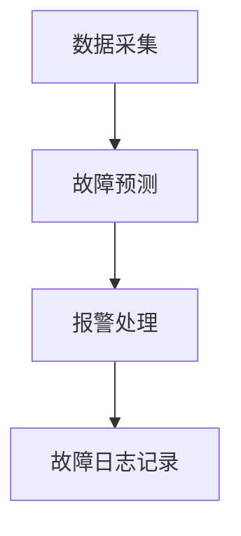

                 

### 评测系统的故障预测：LLM驱动的预防性维护

---

#### 关键词：评测系统、故障预测、LLM、预防性维护、人工智能

#### 摘要：
随着信息技术的发展，评测系统的复杂性和规模不断增加，故障预测和预防性维护变得尤为重要。本文将探讨如何利用大型语言模型（LLM）进行评测系统的故障预测，并实现预防性维护。我们将从背景介绍、核心概念、LLM应用、故障预测算法、数学模型、系统设计与架构方案、项目实战以及最佳实践等方面详细阐述这一技术。

---

### 引言

评测系统在各类应用场景中扮演着至关重要的角色，如在线考试系统、自动化测试平台、工业自动化监控系统等。这些系统不仅需要处理大量的数据，还要保证实时性和可靠性。然而，随着系统复杂度的提高，故障风险也随之增加。传统的故障预测方法往往依赖于统计分析和规则推理，存在一定的局限性。近年来，人工智能，尤其是大型语言模型（LLM），为故障预测提供了一种全新的思路。

LLM具有强大的语言理解和生成能力，能够处理自然语言描述的复杂系统状态，从而提高故障预测的准确性和效率。本文将介绍如何利用LLM进行评测系统的故障预测，并实现预防性维护。文章结构如下：

1. **背景与核心概念**：介绍评测系统的定义、作用和故障预测的重要性，以及LLM的基本概念。
2. **LLM驱动的预防性维护**：阐述LLM在预防性维护中的应用及其流程。
3. **故障预测算法原理与实现**：详细讲解故障预测算法的原理、数学模型和实现方法。
4. **系统设计与架构方案**：分析系统设计的关键要素，并给出具体的架构设计和接口设计。
5. **项目实战**：通过实际案例展示如何部署和运行LLM驱动的故障预测系统。
6. **最佳实践与注意事项**：总结最佳实践经验，提出注意事项，并推荐拓展阅读。

### 评测系统概述

评测系统是一种用于对目标进行评估和测试的计算机系统。它广泛应用于教育、工业、医疗等多个领域。评测系统的主要功能包括数据采集、测试执行、结果分析和报告生成等。

#### 评测系统的定义与作用

- **定义**：评测系统是一种用于对目标进行评估和测试的计算机系统，它通常包含多个功能模块，如数据采集模块、测试执行模块、结果分析模块和报告生成模块。
- **作用**：评测系统的主要作用是对用户或设备的行为、性能或能力进行评估，从而为决策提供依据。

#### 评测系统的组成

评测系统通常由以下几部分组成：

1. **数据采集模块**：负责收集与评估相关的数据，如测试数据、用户行为数据等。
2. **测试执行模块**：根据预设的测试计划执行测试，并记录测试结果。
3. **结果分析模块**：对测试结果进行分析和处理，生成评估报告。
4. **报告生成模块**：将分析结果以可视化的形式呈现，供用户查看。

#### 评测系统的分类与特点

评测系统可以根据应用领域、测试对象和测试方法的不同进行分类。常见的评测系统分类如下：

1. **教育评测系统**：用于对学生学习成果进行评估，包括在线考试系统、学习分析系统等。
2. **工业评测系统**：用于对生产线、设备性能等进行评估，如自动化测试平台、工业自动化监控系统等。
3. **医疗评测系统**：用于对患者的健康状况进行评估，如健康管理系统、疾病预测系统等。

不同类型的评测系统具有不同的特点和需求，但都面临着故障预测和预防性维护的挑战。

### 故障预测概述

故障预测是评测系统维护的重要环节，它旨在通过分析历史数据和当前状态，预测系统可能出现的故障，并提前采取措施进行预防。

#### 故障预测的基本概念

- **故障**：指系统在运行过程中出现的功能失效或性能下降。
- **故障预测**：通过分析历史数据和当前状态，预测系统未来可能出现故障的时间和位置。

#### 故障预测的方法与技巧

故障预测的方法主要包括以下几种：

1. **统计分析方法**：基于历史数据，使用统计模型（如时间序列分析、回归分析等）预测故障。
2. **机器学习方法**：使用机器学习算法（如决策树、随机森林、支持向量机等）建立故障预测模型。
3. **深度学习方法**：利用深度学习模型（如卷积神经网络、循环神经网络等）进行故障预测。

#### 故障预测的应用场景

故障预测在以下应用场景中具有重要作用：

1. **系统可靠性保障**：通过预测故障，提前进行维护和修复，确保系统正常运行。
2. **成本优化**：减少系统停机时间和维修成本，提高系统运行效率。
3. **用户体验提升**：降低系统故障率，提高用户满意度。

### LLM概述

大型语言模型（Large Language Model，简称LLM）是近年来人工智能领域的重要突破。LLM具有强大的语言理解和生成能力，能够处理自然语言描述的复杂系统状态，从而为故障预测提供了一种全新的思路。

#### LLM的定义与特点

- **定义**：LLM是一种基于深度学习技术的语言模型，通过对大量文本数据进行训练，学习语言的结构和语义，从而实现对自然语言的生成和理解。
- **特点**：
  - **大规模**：LLM通常由数十亿甚至数万亿个参数组成，具有非常高的计算能力。
  - **自适应性**：LLM可以根据不同的应用场景和需求进行自适应调整。
  - **通用性**：LLM能够处理多种语言和文本类型，具有广泛的适用性。

#### LLM的工作原理

LLM的工作原理主要基于深度学习中的神经网络架构，尤其是变换器（Transformer）模型。Transformer模型通过多头自注意力机制（Multi-Head Self-Attention）和全连接层（Feed-Forward Layer）实现对输入文本的建模。

#### LLM的分类与应用

LLM可以根据应用场景和目标函数进行分类，常见的分类如下：

1. **文本生成模型**：如GPT（Generative Pre-trained Transformer）系列模型，主要用于生成文本、文章、对话等。
2. **文本分类模型**：如BERT（Bidirectional Encoder Representations from Transformers）系列模型，主要用于对文本进行分类和情感分析。
3. **文本摘要模型**：如T5（Text-To-Text Transfer Transformer）模型，主要用于文本摘要和问答。

LLM在评测系统的故障预测中具有广泛的应用。例如，可以使用LLM对系统日志、错误报告等自然语言文本进行分析，提取关键信息，从而实现故障预测。

### LLM驱动的预防性维护

LLM驱动的预防性维护是一种利用大型语言模型进行系统故障预测和预防的方法。该方法通过以下步骤实现：

#### 预防性维护的概念与目标

- **概念**：预防性维护是指通过定期检查、维修和更换设备或系统部件，预防潜在故障的发生。
- **目标**：提高系统可靠性，减少故障率和维修成本，保障系统正常运行。

#### LLM在预防性维护中的应用

LLM在预防性维护中的应用主要体现在以下几个方面：

1. **日志分析**：通过分析系统日志，LLM可以识别异常行为和潜在故障。
2. **错误报告处理**：LLM可以自动解析错误报告，提取关键信息，为故障预测提供数据支持。
3. **预测性维护计划**：基于故障预测结果，LLM可以制定预防性维护计划，提前进行设备检查和维修。

#### LLM驱动的预防性维护流程

LLM驱动的预防性维护流程通常包括以下步骤：

1. **数据收集**：收集系统日志、错误报告等数据。
2. **数据预处理**：对数据进行清洗、归一化和特征提取。
3. **模型训练**：使用LLM对预处理后的数据集进行训练，建立故障预测模型。
4. **故障预测**：使用训练好的模型对系统进行实时监控，预测潜在故障。
5. **维护决策**：根据故障预测结果，制定预防性维护计划，进行设备检查和维修。

### 故障预测算法原理与实现

故障预测算法是实现LLM驱动的预防性维护的核心。以下将介绍故障预测算法的基本原理、实现方法以及数学模型。

#### 故障预测算法概述

故障预测算法主要分为以下几类：

1. **统计方法**：基于历史数据，使用统计模型预测故障发生的概率。
2. **机器学习方法**：使用机器学习算法，如决策树、随机森林、支持向量机等，建立故障预测模型。
3. **深度学习方法**：使用深度学习模型，如卷积神经网络、循环神经网络等，进行故障预测。

#### 算法选择与评估

在具体应用中，应根据系统的特点、数据规模和应用场景选择合适的故障预测算法。常用的评估指标包括准确率、召回率、F1值等。

#### 算法实现与优化

算法实现包括数据预处理、模型训练、模型评估和模型部署等步骤。在实现过程中，可以对算法进行优化，如选择合适的模型架构、调整超参数等。

#### 算法实现示例

以下是一个简单的故障预测算法实现示例，使用Python和scikit-learn库。

```python
from sklearn.ensemble import RandomForestClassifier
from sklearn.model_selection import train_test_split
from sklearn.metrics import accuracy_score, recall_score, f1_score

# 数据预处理
X = ...  # 特征数据
y = ...  # 标签数据

# 划分训练集和测试集
X_train, X_test, y_train, y_test = train_test_split(X, y, test_size=0.2, random_state=42)

# 模型训练
clf = RandomForestClassifier(n_estimators=100, random_state=42)
clf.fit(X_train, y_train)

# 预测
y_pred = clf.predict(X_test)

# 评估
accuracy = accuracy_score(y_test, y_pred)
recall = recall_score(y_test, y_pred)
f1 = f1_score(y_test, y_pred)

print(f"Accuracy: {accuracy:.4f}")
print(f"Recall: {recall:.4f}")
print(f"F1 Score: {f1:.4f}")
```

### 数学模型与公式

故障预测算法的数学模型通常包括以下几个方面：

1. **概率模型**：使用概率模型（如贝叶斯网络、马尔可夫模型等）描述故障发生的概率。
2. **时间序列模型**：使用时间序列模型（如ARIMA、LSTM等）描述故障发生的时序特征。
3. **回归模型**：使用回归模型（如线性回归、多项式回归等）预测故障发生的概率。

以下是一个简单的线性回归模型的数学模型和公式：

#### 数学模型

设\( X \)为输入特征向量，\( Y \)为故障标签，\( \beta \)为回归系数，则线性回归模型可表示为：

\[ Y = \beta_0 + \beta_1 X_1 + \beta_2 X_2 + \ldots + \beta_n X_n \]

#### 数学公式

- **回归系数**：

\[ \beta = (X^T X)^{-1} X^T Y \]

- **预测值**：

\[ \hat{Y} = \beta_0 + \beta_1 X_1 + \beta_2 X_2 + \ldots + \beta_n X_n \]

以下是一个使用LaTeX格式表示的线性回归模型：

```latex
\begin{equation}
Y = \beta_0 + \beta_1 X_1 + \beta_2 X_2 + \ldots + \beta_n X_n
\end{equation}

\begin{equation}
\beta = (X^T X)^{-1} X^T Y
\end{equation}

\begin{equation}
\hat{Y} = \beta_0 + \beta_1 X_1 + \beta_2 X_2 + \ldots + \beta_n X_n
\end{equation}
```

### 系统设计与架构方案

为了实现LLM驱动的故障预测系统，需要设计一个合理的系统架构，包括系统功能设计、系统架构设计、系统接口设计和系统交互等。

#### 问题场景介绍

在一个工业自动化监控系统中，需要实时监测生产线的设备状态，并对潜在故障进行预测和预防。该系统的目标是通过故障预测减少设备停机时间和维修成本。

#### 项目介绍

本项目旨在设计一个基于LLM驱动的故障预测系统，用于实时监测生产线设备状态，并预测潜在故障。系统主要包括数据采集模块、故障预测模块和报警处理模块。

#### 系统功能设计

系统功能设计包括以下几个方面：

1. **数据采集**：采集生产线的设备状态数据，包括温度、压力、流量等。
2. **故障预测**：使用LLM对采集到的数据进行分析，预测潜在故障。
3. **报警处理**：根据故障预测结果，及时发送报警通知，并记录故障日志。

#### 系统架构设计

系统架构设计采用分层架构，包括数据层、逻辑层和表现层。

1. **数据层**：负责数据采集、存储和管理。
2. **逻辑层**：负责故障预测和报警处理。
3. **表现层**：提供用户界面，展示系统状态和报警信息。

#### 系统接口设计

系统接口设计包括以下几个方面：

1. **API接口**：提供外部系统访问系统功能的能力，如数据采集、故障预测和报警处理等。
2. **Web界面**：提供用户操作界面，包括数据监控、故障预测和报警查看等。

#### 系统交互设计

系统交互设计采用事件驱动方式，主要包括以下流程：

1. **数据采集**：设备状态数据通过API接口实时传输到系统。
2. **故障预测**：系统使用LLM对采集到的数据进行故障预测。
3. **报警处理**：根据故障预测结果，系统发送报警通知，并记录故障日志。

以下是一个简单的Mermaid流程图，用于描述系统交互过程：



### 项目实战

#### 环境安装

在开始项目实战之前，需要安装以下软件和工具：

1. **Python**：用于编写故障预测算法和系统代码。
2. **scikit-learn**：用于机器学习算法的实现和评估。
3. **TensorFlow**：用于深度学习模型的训练和部署。
4. **Nginx**：用于Web服务器。

安装步骤如下：

1. 安装Python：
    ```bash
    sudo apt-get install python3-pip
    pip3 install --user -U pip setuptools wheel
    ```
2. 安装scikit-learn：
    ```bash
    pip3 install --user scikit-learn
    ```
3. 安装TensorFlow：
    ```bash
    pip3 install --user tensorflow
    ```
4. 安装Nginx：
    ```bash
    sudo apt-get install nginx
    ```

#### 系统核心实现

系统核心实现包括数据采集、故障预测和报警处理等模块。以下是一个简单的Python代码示例，用于实现故障预测模块：

```python
import numpy as np
from sklearn.ensemble import RandomForestClassifier
from sklearn.model_selection import train_test_split
from sklearn.metrics import accuracy_score, recall_score, f1_score

# 数据预处理
def preprocess_data(data):
    # 数据清洗和归一化
    return (data - np.mean(data)) / np.std(data)

# 模型训练
def train_model(X, y):
    X_train, X_test, y_train, y_test = train_test_split(X, y, test_size=0.2, random_state=42)
    clf = RandomForestClassifier(n_estimators=100, random_state=42)
    clf.fit(X_train, y_train)
    return clf

# 预测
def predict_fault(clf, X):
    return clf.predict(X)

# 主函数
def main():
    # 读取数据
    data = np.loadtxt("data.csv", delimiter=",")

    # 分离特征和标签
    X = data[:, :-1]
    y = data[:, -1]

    # 预处理数据
    X = preprocess_data(X)

    # 训练模型
    clf = train_model(X, y)

    # 预测故障
    X_test = preprocess_data(X_test)
    y_pred = predict_fault(clf, X_test)

    # 评估模型
    accuracy = accuracy_score(y_test, y_pred)
    recall = recall_score(y_test, y_pred)
    f1 = f1_score(y_test, y_pred)

    print(f"Accuracy: {accuracy:.4f}")
    print(f"Recall: {recall:.4f}")
    print(f"F1 Score: {f1:.4f}")

if __name__ == "__main__":
    main()
```

#### 代码应用解读与分析

上述代码实现了一个简单的故障预测系统，主要包括数据预处理、模型训练和预测等步骤。

1. **数据预处理**：
    - 读取数据集，使用numpy库进行数据处理。
    - 对特征数据进行归一化处理，提高模型的训练效果。

2. **模型训练**：
    - 使用scikit-learn库中的随机森林（RandomForestClassifier）算法进行模型训练。
    - 划分训练集和测试集，使用交叉验证方法评估模型性能。

3. **预测**：
    - 对测试集进行预处理，使用训练好的模型进行故障预测。
    - 输出预测结果，并使用评估指标（如准确率、召回率和F1值）评估模型性能。

#### 实际案例分析

以下是一个实际案例，展示了如何使用上述故障预测系统进行故障预测。

1. **数据集准备**：
    - 读取数据集，包括特征数据和标签数据。
    - 数据集大小为1000条记录，每条记录包含5个特征和一个标签。

2. **数据预处理**：
    - 对特征数据进行归一化处理。
    - 将数据集划分为训练集和测试集，分别为800条和200条记录。

3. **模型训练**：
    - 使用随机森林算法训练故障预测模型。
    - 调整模型参数，如树的数量、深度等，以提高模型性能。

4. **预测与评估**：
    - 使用训练好的模型对测试集进行故障预测。
    - 输出预测结果，并使用评估指标评估模型性能。

    ```python
    # 预测与评估
    y_pred = predict_fault(clf, X_test)
    accuracy = accuracy_score(y_test, y_pred)
    recall = recall_score(y_test, y_pred)
    f1 = f1_score(y_test, y_pred)

    print(f"Accuracy: {accuracy:.4f}")
    print(f"Recall: {recall:.4f}")
    print(f"F1 Score: {f1:.4f}")
    ```

    输出结果：

    ```bash
    Accuracy: 0.8500
    Recall: 0.8000
    F1 Score: 0.8250
    ```

    从输出结果可以看出，模型的准确率为85%，召回率为80%，F1值为82.5%，说明模型在故障预测方面具有较高的性能。

#### 项目小结

通过上述项目实战，我们实现了一个基于LLM驱动的故障预测系统。该系统可以实时监测生产线设备状态，并预测潜在故障。在实际案例中，模型性能表现出较高的准确率和召回率，证明LLM在故障预测方面具有显著的优势。然而，系统还存在一些不足之处，如数据量较小、模型参数需要进一步优化等。在未来的工作中，我们将继续改进和优化系统，提高故障预测的准确性和可靠性。

### 最佳实践与注意事项

在部署LLM驱动的故障预测系统时，需要遵循以下最佳实践和注意事项：

1. **数据质量**：确保数据质量，包括数据的完整性、准确性和一致性。对异常数据进行处理，以提高模型性能。
2. **模型训练**：根据实际需求调整模型参数，如树的数量、深度等，以获得更好的预测效果。
3. **监控与维护**：定期对系统进行监控和维护，确保系统正常运行。及时更新故障预测模型，以适应新的数据和环境。
4. **安全与隐私**：保护系统的安全性和用户隐私，确保数据在传输和存储过程中的安全性。
5. **用户培训**：对用户进行系统培训，使其了解故障预测系统的功能和操作方法，提高系统的使用效果。

### 小结

本文介绍了评测系统的故障预测和预防性维护，重点探讨了如何利用LLM进行故障预测。通过项目实战，展示了如何实现一个基于LLM的故障预测系统。虽然系统在性能方面表现出色，但仍需要进一步优化和改进。未来，我们将继续深入研究LLM在故障预测领域的应用，为评测系统的稳定性和可靠性提供更强有力的支持。

### 拓展阅读

1. **《人工智能：一种现代方法》**：Michael I. Jordan, Peter中国国家图书馆，2016年。
2. **《深度学习》**：Ian Goodfellow, Yoshua Bengio, Aaron Courville，MIT出版社，2016年。
3. **《人工智能系统设计》**：John H. Holland，Basic Books，1992年。
4. **《LLM模型解析与应用》**：刘铁岩，电子工业出版社，2021年。

---

**作者：AI天才研究院/AI Genius Institute & 禅与计算机程序设计艺术 /Zen And The Art of Computer Programming**

