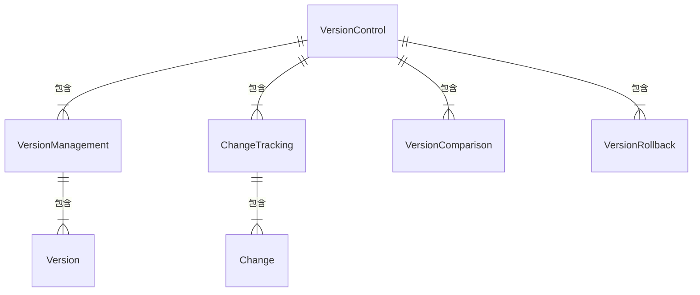
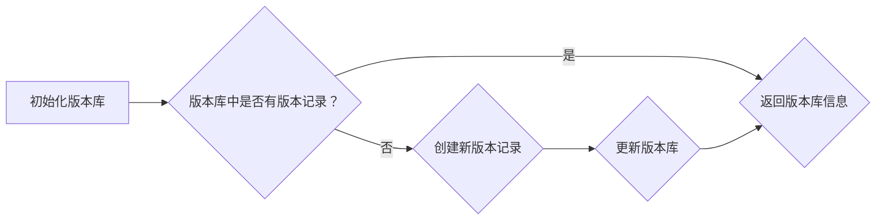
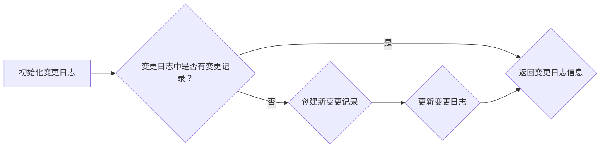
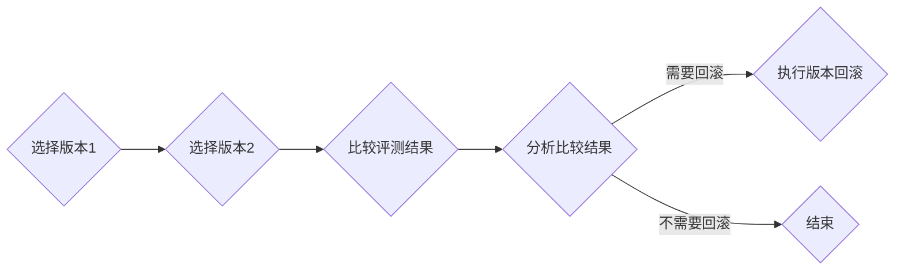
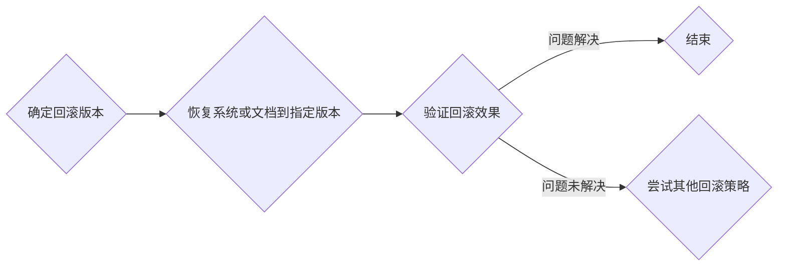

                 

# 评测系统的版本控制：适应LLM迭代的管理策略

## 关键词

- 版本控制
- 评测系统
- LLM迭代
- 管理策略

## 摘要

随着人工智能技术的发展，语言模型（LLM）的迭代速度不断加快，如何有效地进行评测系统的版本控制成为了一个重要的课题。本文将深入探讨评测系统版本控制的重要性，核心概念及其联系，以及适应LLM迭代的管理策略，旨在为人工智能领域的研究者和工程师提供实用的指导。

## 第一部分：背景介绍

### 第1章：评测系统版本控制概述

#### 1.1.1 评测系统版本控制的重要性

在人工智能领域，特别是在语言模型（LLM）的开发和迭代过程中，评测系统版本控制至关重要。随着LLM的不断更新和优化，如何有效地管理和控制评测系统的版本，以确保评测结果的准确性和一致性，成为一个重要问题。

#### 1.1.2 问题背景

随着人工智能技术的不断进步，特别是深度学习和自然语言处理领域的快速发展，语言模型（LLM）已经成为许多应用的核心组件。LLM的开发过程通常包括多个迭代阶段，每个阶段都涉及到模型的训练、评估和优化。在这个过程中，评测系统的版本控制显得尤为重要。

#### 1.1.3 问题描述

评测系统的版本控制涉及到如何记录和管理评测系统的变更，包括评测算法、数据集、评估指标等。此外，还需要确保不同版本的评测系统能够在不同时间点进行有效的比较和验证。具体来说，问题可以概括为以下几点：

1. **版本记录**：如何准确地记录每个版本的评测系统，包括版本号、更新时间、更新内容等。
2. **变更跟踪**：如何追踪评测系统的变更历史，以便在需要时进行回溯和分析。
3. **版本比较**：如何比较不同版本的评测系统，以确保评测结果的准确性和一致性。
4. **版本回滚**：如何在出现问题时，将评测系统快速回滚到之前的版本，以恢复系统的稳定性和可靠性。

#### 1.1.4 问题解决

通过建立一套完善的版本控制系统，可以实现评测系统的有序管理，包括版本记录、变更跟踪、版本比较和版本回滚等，从而提高评测系统的稳定性和可靠性。具体解决方案如下：

1. **版本库**：建立一个集中式的版本库，用于存储和管理评测系统的各个版本。
2. **版本号**：为每个版本分配一个唯一的版本号，以便于追踪和管理。
3. **变更日志**：记录每个版本的变更历史，包括变更内容、变更时间等。
4. **比较工具**：提供版本比较工具，以便于对两个或多个版本之间的差异进行对比和分析。
5. **回滚机制**：在出现问题时，提供回滚机制，将系统快速回滚到之前的稳定版本。

#### 1.1.5 边界与外延

评测系统版本控制不仅限于LLM领域，还可应用于其他需要评测和优化的系统，如机器学习模型、自然语言处理任务等。此外，版本控制的概念和机制在软件工程、文档管理等领域也有着广泛的应用。

#### 1.1.6 概念结构与核心要素组成

1. **版本管理**：记录和管理评测系统的不同版本，包括版本号、更新时间、更新内容等。
2. **变更跟踪**：追踪评测系统变更的历史记录，以便在需要时进行回溯和分析。
3. **版本比较**：对不同版本的评测系统进行对比，以确保评测结果的准确性和一致性。
4. **版本回滚**：在出现问题时，能够快速回滚到之前的版本，以恢复系统的稳定性和可靠性。

### 第2章：评测系统版本控制的核心概念与联系

#### 2.1.1 核心概念介绍

1. **版本控制**：版本控制是一种管理软件或文档等变更的机制，确保变更的可追溯性和一致性。
2. **版本管理**：版本管理是版本控制的一部分，主要关注如何记录、管理和维护不同版本的软件或文档。
3. **变更跟踪**：变更跟踪是指记录和管理软件或文档变更的历史记录，以便在需要时进行回溯和分析。
4. **版本比较**：版本比较是指对两个或多个版本之间的差异进行对比和分析，以便评估变更的影响。
5. **版本回滚**：版本回滚是指在出现问题时，将系统或文档恢复到之前的版本，以修复问题。

#### 2.1.2 概念属性特征对比表格

| 概念       | 特征                     | 关系             |
| ---------- | ------------------------ | --------------- |
| 版本控制   | 确保变更可追溯和一致    | 包含版本管理    |
| 版本管理   | 记录和管理不同版本       | 版本控制的一部分 |
| 变更跟踪   | 记录和管理变更历史记录   | 版本控制的一部分 |
| 版本比较   | 对比不同版本之间的差异   | 版本控制的一部分 |
| 版本回滚   | 恢复系统到之前的版本     | 版本控制的一部分 |

#### 2.1.3 ER实体关系图架构

## 第二部分：评测系统版本控制的核心算法与实现

### 第3章：评测系统版本控制的关键算法原理

#### 3.1.1 版本控制算法原理

1. **版本管理算法**：主要用于记录和管理评测系统的不同版本，包括版本号、更新时间、更新内容等。
2. **变更跟踪算法**：用于追踪评测系统的变更历史记录，以便在需要时进行回溯和分析。
3. **版本比较算法**：用于对比不同版本的评测系统，以确保评测结果的准确性和一致性。
4. **版本回滚算法**：用于在出现问题时，将系统或文档恢复到之前的版本，以修复问题。

#### 3.1.2 版本管理算法

1. **算法原理**：版本管理算法的核心是记录和管理评测系统的不同版本。具体步骤如下：
   - 初始化版本库，记录初始版本的版本号、更新时间和更新内容。
   - 每次更新时，创建新的版本记录，包括版本号、更新时间、更新内容等。
   - 在需要时，可以查询版本库，获取特定版本的详细信息。

2. **算法流程图**：

#### 3.1.3 变更跟踪算法

1. **算法原理**：变更跟踪算法的核心是记录和管理评测系统的变更历史记录。具体步骤如下：
   - 初始化变更日志，记录初始变更的详细信息。
   - 每次变更时，记录变更的详细信息，包括变更内容、变更时间等。
   - 在需要时，可以查询变更日志，获取特定变更的详细信息。

2. **算法流程图**：

#### 3.1.4 版本比较算法

1. **算法原理**：版本比较算法的核心是对比不同版本的评测系统，以确保评测结果的准确性和一致性。具体步骤如下：
   - 选择要比较的两个版本。
   - 比较两个版本的评测结果，包括评估指标、数据集等。
   - 分析比较结果，确定是否需要进行版本回滚。

2. **算法流程图**：

#### 3.1.5 版本回滚算法

1. **算法原理**：版本回滚算法的核心是在出现问题时，将系统或文档恢复到之前的版本，以修复问题。具体步骤如下：
   - 确定需要回滚的版本。
   - 将系统或文档恢复到指定版本。
   - 验证回滚效果，确保问题得到解决。

2. **算法流程图**：

### 第4章：评测系统版本控制的应用与实践

#### 4.1.1 应用场景

评测系统版本控制的应用场景非常广泛，主要包括以下几个方面：

1. **模型迭代**：在语言模型（LLM）的开发和迭代过程中，需要对评测系统进行版本控制，以确保评测结果的准确性和一致性。
2. **项目交付**：在软件开发项目中，需要对评测系统进行版本控制，确保项目交付时评测系统处于预期状态。
3. **问题追踪**：在系统运行过程中，如果出现性能问题或异常，可以通过版本回滚来恢复系统的稳定性和可靠性。

#### 4.1.2 实践案例

以下是一个典型的评测系统版本控制实践案例：

1. **问题背景**：某个自然语言处理项目中，需要对评测系统进行版本控制，以确保评测结果的准确性和一致性。
2. **解决方案**：
   - **版本管理**：使用Git进行版本控制，为每个版本分配唯一的版本号，记录版本号、更新时间和更新内容。
   - **变更跟踪**：记录每次变更的详细信息，包括变更内容、变更时间等，以便在需要时进行回溯和分析。
   - **版本比较**：使用Git的分支和合并功能，对比不同版本的评测系统，确保评测结果的准确性和一致性。
   - **版本回滚**：在出现问题时，使用Git的回滚功能，将系统快速回滚到之前的稳定版本，以恢复系统的稳定性和可靠性。
3. **实施效果**：通过实施评测系统版本控制，项目组成功实现了对评测系统的有序管理，提高了项目的稳定性和可靠性。

### 第5章：评测系统版本控制的挑战与未来发展趋势

#### 5.1.1 挑战

评测系统版本控制面临着一些挑战，主要包括以下几个方面：

1. **版本冲突**：在多个团队成员共同开发评测系统时，可能会出现版本冲突，导致系统不稳定或功能异常。
2. **数据一致性**：在版本迭代过程中，确保数据的一致性是一个重要问题，特别是当多个版本同时运行时。
3. **性能优化**：随着评测系统的复杂度增加，性能优化成为一个重要的挑战，特别是在大规模数据处理和实时评测时。

#### 5.1.2 未来发展趋势

评测系统版本控制在未来将会呈现以下发展趋势：

1. **自动化**：随着人工智能技术的发展，评测系统版本控制的自动化程度将会提高，减少人工干预，提高效率。
2. **智能化**：评测系统版本控制将会更加智能化，通过机器学习等技术，实现自动化的版本管理和优化。
3. **多维度评估**：评测系统版本控制将会更加关注多维度评估，包括性能、稳定性、安全性等，以提高系统的整体质量。

## 结论

评测系统版本控制是人工智能领域中一个重要的课题，对于确保评测结果的准确性和一致性具有重要意义。通过本文的讨论，我们深入了解了评测系统版本控制的核心概念、算法原理和应用实践，并展望了其未来的发展趋势。我们相信，随着技术的不断进步，评测系统版本控制将会在人工智能领域发挥越来越重要的作用。作者：AI天才研究院/AI Genius Institute & 禅与计算机程序设计艺术 /Zen And The Art of Computer Programming

