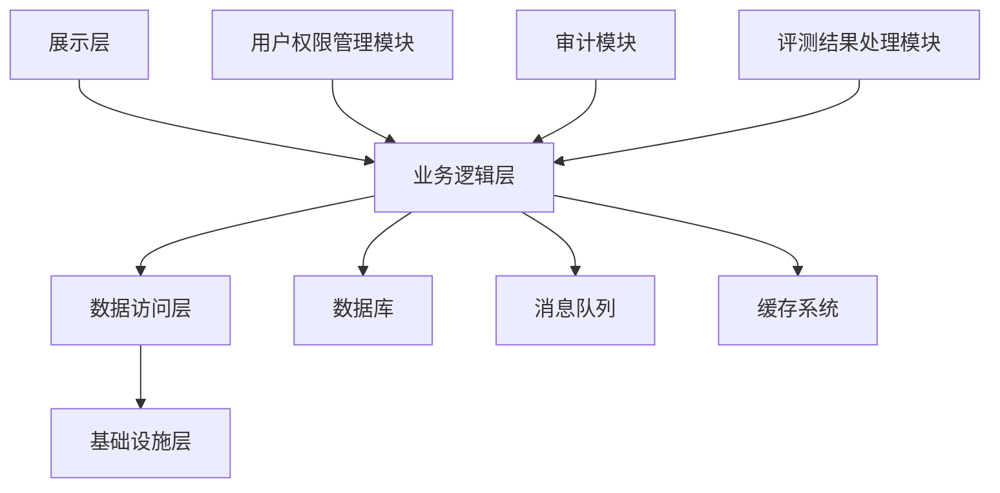
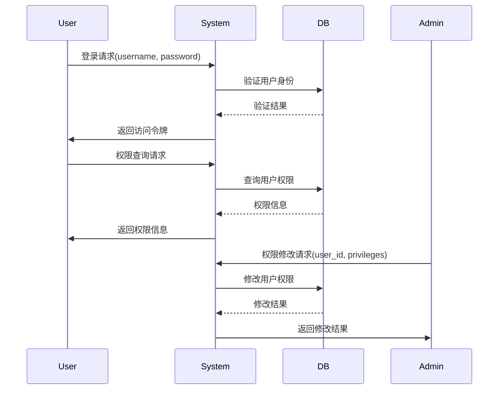
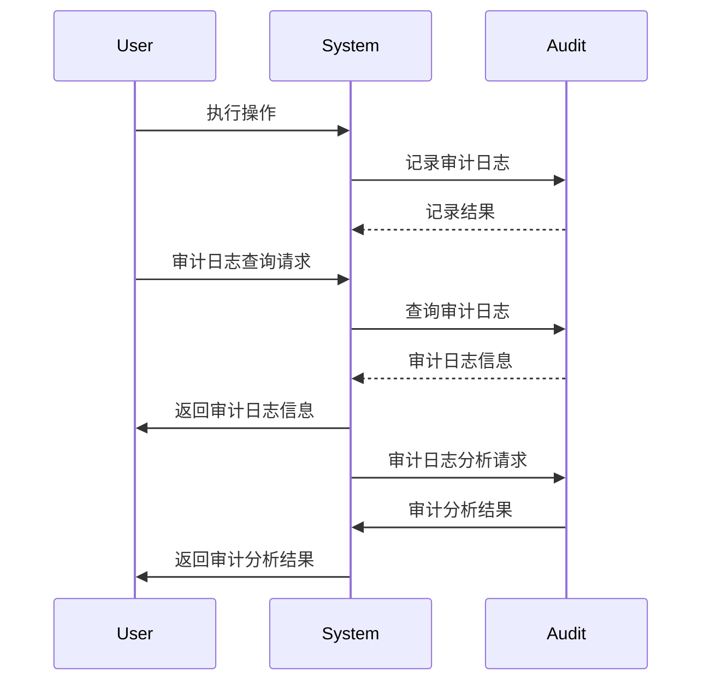

                 


### 第1章 引言

#### 1.1 背景介绍

随着信息技术的迅猛发展，评测系统在各个领域得到了广泛应用。这些系统用于评估和监控用户的行为、性能以及系统资源的利用情况。用户权限管理作为评测系统的核心组成部分，承担着确保系统安全、稳定运行的重要任务。然而，在现实应用中，用户权限管理与审计面临着诸多挑战，如权限滥用、数据泄露、系统攻击等。因此，如何有效设计、实现和运维用户权限管理与审计系统，已成为当前研究的热点问题。

本书旨在深入探讨评测系统用户权限管理与审计的原理、方法与应用，为从事该领域的研究者、开发者以及运维人员提供有价值的参考。全书结构合理、内容全面，涵盖了从基础理论到实际应用的各个方面。

#### 1.1.1 评测系统的重要性

评测系统在企业、政府、教育等各个领域扮演着重要角色。它不仅能帮助组织评估员工的工作表现，还能监测系统资源的使用情况，提高系统的运行效率。以下是评测系统的重要性概述：

1. **提高效率**：通过评测系统，组织可以实时监控用户的工作状态，及时发现和解决问题，从而提高工作效率。
2. **保障安全**：用户权限管理与审计能够有效防止权限滥用和数据泄露，确保系统的安全运行。
3. **优化资源配置**：通过分析用户行为和资源利用情况，评测系统可以帮助组织优化资源配置，提高资源利用率。
4. **合规性**：许多行业都有严格的法律法规和标准，评测系统可以帮助组织确保合规性，避免法律风险。

#### 1.1.2 用户权限管理与审计的挑战

尽管评测系统在众多领域具有重要价值，但其用户权限管理与审计面临着诸多挑战：

1. **复杂性**：用户权限管理与审计涉及多个模块和层次，包括用户管理、权限分配、审计日志记录与分析等，系统复杂度高。
2. **安全性**：权限滥用、数据泄露和系统攻击是评测系统中常见的安全威胁。如何设计安全可靠的权限管理与审计机制，是亟需解决的问题。
3. **可扩展性**：随着用户数量的增加和系统功能的扩展，评测系统的用户权限管理与审计需要具备良好的可扩展性，以适应不断变化的需求。
4. **合规性**：不同行业和地区对用户权限管理与审计有不同的法律法规和标准，如何在满足合规性的同时，设计高效、安全的系统，是一个挑战。

#### 1.1.3 书籍的结构和目标

本书结构合理，内容全面，共分为五个章节。具体如下：

1. **第1章 引言**：介绍评测系统的背景、重要性以及用户权限管理与审计面临的挑战。
2. **第2章 用户权限管理原理**：介绍用户权限管理的基本概念、权限管理模型和权限审计机制。
3. **第3章 评测系统架构设计**：详细阐述评测系统的架构设计、系统接口和交互设计。
4. **第4章 用户权限管理实现**：讨论用户权限管理的数据库设计、算法原理与实现。
5. **第5章 案例分析**：通过实际案例，展示用户权限管理与审计的实施过程和效果。

本书的目标是为从事评测系统用户权限管理与审计的研究者、开发者以及运维人员提供全面、系统的指导，帮助其解决实际问题，提升系统安全性和效率。

---

**关键词**：评测系统、用户权限管理、审计、安全、可扩展性

**摘要**：本书深入探讨了评测系统用户权限管理与审计的原理、方法与应用，涵盖了从基础理论到实际应用的各个方面。通过详细阐述权限管理模型、系统架构设计、算法实现以及实际案例分析，为从事该领域的研究者、开发者以及运维人员提供有价值的参考，旨在提升评测系统的安全性、效率和合规性。

---

### 第2章 用户权限管理原理

#### 2.1 权限管理模型

用户权限管理是评测系统的核心组成部分，其目的是确保系统的安全性和稳定性。权限管理模型是权限管理的理论基础，常见的权限管理模型包括基于角色的访问控制（RBAC）和基于属性的访问控制（ABAC）。

##### 2.1.1 基本权限管理模型

基本权限管理模型是最简单的权限管理模型，它通常包括用户、权限和资源三个基本概念。用户是系统的使用主体，权限是用户对资源进行操作的能力，资源是用户操作的客体。

- **用户**：系统的使用者，可以是个人、小组或角色。
- **权限**：用户对资源进行操作的能力，如读、写、执行等。
- **资源**：用户操作的对象，可以是文件、数据库、网络设备等。

基本权限管理模型的主要特点如下：

1. **简单性**：基本权限管理模型结构简单，易于理解和实现。
2. **灵活性**：基本权限管理模型可以根据需要灵活调整权限设置，适应不同的应用场景。

##### 2.1.2 RBAC（基于角色的访问控制）模型

RBAC模型是基于角色的访问控制，它将用户与角色进行关联，从而简化权限管理。在RBAC模型中，角色是权限的抽象，用户是角色的具体实例。

- **角色**：一组具有相同权限的用户集合。
- **用户**：拥有角色的具体个体。
- **权限**：用户或角色对资源进行操作的能力。

RBAC模型的主要特点如下：

1. **易管理性**：通过角色分配权限，简化了权限管理过程，提高了管理效率。
2. **灵活性**：支持角色间的继承和委派，能够适应复杂的多层次权限管理需求。
3. **安全性**：通过限制用户对资源的访问，提高了系统的安全性。

##### 2.1.3 ABAC（基于属性的访问控制）模型

ABAC模型是基于属性的访问控制，它通过属性来定义用户对资源的访问权限。在ABAC模型中，属性是权限分配的关键因素。

- **属性**：定义用户、角色、资源等实体的特征，如用户身份、时间、地点等。
- **策略**：定义权限分配的规则，如“只有在工作时间，管理员才能访问关键资源”。
- **主体**：拥有权限的实体，如用户、角色等。
- **客体**：资源，如文件、数据库等。

ABAC模型的主要特点如下：

1. **灵活性**：支持根据不同属性定义权限，能够适应复杂多变的应用场景。
2. **细粒度**：能够实现细粒度的权限控制，提高系统的安全性。
3. **可扩展性**：支持扩展属性和策略，能够适应不同应用场景的需求。

#### 2.2 权限分配与回收

权限分配与回收是用户权限管理的核心环节，直接关系到系统的安全性和稳定性。

##### 2.2.1 权限分配策略

权限分配策略是权限管理的基础，常见的权限分配策略包括：

1. **最小权限原则**：用户只能获得完成工作所需的最低权限，以减少权限滥用风险。
2. **角色分配策略**：将用户分配到相应的角色，通过角色来分配权限。
3. **基于属性的分配策略**：根据用户的属性，动态分配权限。

##### 2.2.2 权限回收机制

权限回收机制是确保系统安全的关键，常见的权限回收机制包括：

1. **定期审查**：定期对用户的权限进行审查，根据用户的工作需求调整权限。
2. **事件触发回收**：在特定事件发生时，如用户离职或违规操作，立即回收相关权限。
3. **自动回收**：根据预设规则，自动回收过期或不再需要的权限。

##### 2.2.3 权限生命周期管理

权限生命周期管理是权限管理的完整过程，包括权限的创建、分配、使用和回收。权限生命周期管理的主要目标如下：

1. **确保权限的合法性和合理性**：确保权限分配和回收符合法律法规和企业的规章制度。
2. **降低权限滥用风险**：通过权限生命周期管理，降低权限滥用和权限泄露的风险。
3. **提高管理效率**：简化权限管理过程，提高管理效率。

#### 2.3 权限审计机制

权限审计是确保系统安全的重要手段，通过审计可以发现权限滥用、数据泄露等安全问题。

##### 2.3.1 审计日志记录

审计日志记录是权限审计的基础，它记录了用户对资源的访问和操作情况。常见的审计日志记录内容包括：

1. **用户信息**：用户的登录名、用户ID等。
2. **操作信息**：用户执行的操作，如读、写、执行等。
3. **资源信息**：用户操作的资源，如文件、数据库等。
4. **时间信息**：用户执行操作的时间。

##### 2.3.2 审计数据分析

审计数据分析是对审计日志进行统计和分析，以发现潜在的安全问题。常见的审计数据分析方法包括：

1. **统计分析**：对审计日志进行统计，如访问频率、访问时间等。
2. **关联分析**：分析审计日志中不同记录之间的关系，如同一用户的连续访问记录。
3. **异常检测**：通过分析审计日志，发现异常行为和操作。

##### 2.3.3 审计结果处理

审计结果处理是对审计分析结果的进一步处理，包括：

1. **问题定位**：根据审计结果，定位权限滥用、数据泄露等问题的具体原因。
2. **整改措施**：根据审计结果，采取相应的整改措施，如调整权限设置、加强权限管理、加强安全培训等。
3. **持续监控**：对审计结果进行处理后，进行持续监控，确保整改措施得到有效落实。

#### 2.4 权限管理与审计的关系

权限管理与审计是相辅相成的，权限管理是审计的基础，审计是权限管理的补充。

1. **相互依赖**：权限管理需要审计结果来指导权限分配和回收，审计需要权限管理的数据来进行分析。
2. **相互促进**：权限管理通过审计可以发现问题和改进措施，审计通过分析权限管理的数据，提高权限管理的效率和安全性。

总之，用户权限管理原理包括基本权限管理模型、RBAC模型、ABAC模型，权限分配与回收策略，以及权限审计机制。这些原理和方法共同构成了用户权限管理的理论基础，为评测系统的安全稳定运行提供了保障。

---

### 第3章 评测系统架构设计

#### 3.1 系统架构概述

评测系统架构设计是确保系统功能完备、性能稳定和安全可靠的关键。一个完善的评测系统架构应涵盖以下几个方面：

1. **系统架构层次**：评测系统通常分为展示层、业务逻辑层、数据访问层和基础设施层。
2. **模块划分**：将系统功能划分为用户权限管理模块、审计模块、评测结果处理模块等。
3. **交互方式**：定义各模块之间的交互方式，如RESTful API、消息队列等。

以下是一个典型的评测系统架构图：



#### 3.2 系统接口设计

系统接口设计是评测系统架构设计的重要组成部分，它定义了各模块之间的交互方式。以下是用户权限管理模块、审计模块的关键接口设计：

##### 用户权限管理模块接口

1. **用户登录接口**：用户通过此接口登录系统，系统验证用户身份并返回访问令牌。
   ```mermaid
   sequenceDiagram
       User->>System: 登录请求(username, password)
       System->>DB: 验证用户身份
       DB-->>System: 验证结果
       System->>User: 返回访问令牌
   ```

2. **权限查询接口**：用户通过此接口查询其权限信息。
   ```mermaid
   sequenceDiagram
       User->>System: 权限查询请求
       System->>DB: 查询用户权限
       DB-->>System: 权限信息
       System->>User: 返回权限信息
   ```

3. **权限修改接口**：管理员通过此接口修改用户权限。
   ```mermaid
   sequenceDiagram
       Admin->>System: 权限修改请求(user_id, privileges)
       System->>DB: 修改用户权限
       DB-->>System: 修改结果
       System->>Admin: 返回修改结果
   ```

##### 审计模块接口

1. **审计日志记录接口**：系统在用户操作时自动记录审计日志。
   ```mermaid
   sequenceDiagram
       User->>System: 执行操作
       System->>Audit: 记录审计日志
       Audit-->>System: 记录结果
   ```

2. **审计日志查询接口**：用户或管理员通过此接口查询审计日志。
   ```mermaid
   sequenceDiagram
       User->>System: 审计日志查询请求
       System->>Audit: 查询审计日志
       Audit-->>System: 审计日志信息
       System->>User: 返回审计日志信息
   ```

3. **审计日志分析接口**：系统通过此接口对审计日志进行分析，以发现潜在的安全问题。
   ```mermaid
   sequenceDiagram
       System->>Audit: 审计日志分析请求
       Audit->>System: 审计分析结果
       System->>User: 返回审计分析结果
   ```

#### 3.3 系统交互设计

系统交互设计描述了用户权限管理模块、审计模块与业务逻辑层、数据访问层之间的交互流程。以下是用户权限管理流程和审计流程的交互设计：

##### 用户权限管理流程

1. **用户登录**：用户通过用户登录接口登录系统，系统验证用户身份并返回访问令牌。
2. **权限查询**：用户通过权限查询接口查询其权限信息。
3. **权限修改**：管理员通过权限修改接口修改用户权限。
4. **权限生效**：修改后的权限信息同步到数据库，用户权限更新生效。



##### 审计流程

1. **操作记录**：系统在用户操作时自动记录审计日志。
2. **日志查询**：用户或管理员通过审计日志查询接口查询审计日志。
3. **日志分析**：系统通过审计日志分析接口对审计日志进行分析，以发现潜在的安全问题。



通过以上系统架构设计、接口设计和交互设计，评测系统的用户权限管理和审计功能得以有效实现，为系统的安全稳定运行提供了有力保障。

---

### 第4章 用户权限管理实现

用户权限管理实现是评测系统的关键环节，涉及数据库设计、算法原理与实现、数学模型与公式等多个方面。本章将详细探讨这些内容，以帮助读者更好地理解用户权限管理的实际应用。

#### 4.1 数据库设计

数据库设计是用户权限管理实现的基础，一个合理的数据库架构能够提高权限管理的效率和安全性能。以下是用户权限管理数据库设计的关键组成部分：

##### 4.1.1 用户权限管理数据库架构

用户权限管理数据库架构通常包括用户表、角色表、权限表和资源表。

1. **用户表（users）**：存储用户的基本信息，如用户名、密码、邮箱等。
   ```sql
   CREATE TABLE users (
       user_id INT PRIMARY KEY AUTO_INCREMENT,
       username VARCHAR(50) NOT NULL,
       password VARCHAR(100) NOT NULL,
       email VARCHAR(100) NOT NULL,
       created_at TIMESTAMP DEFAULT CURRENT_TIMESTAMP
   );
   ```

2. **角色表（roles）**：存储角色的基本信息，如角色名、描述等。
   ```sql
   CREATE TABLE roles (
       role_id INT PRIMARY KEY AUTO_INCREMENT,
       role_name VARCHAR(50) NOT NULL,
       description VARCHAR(255)
   );
   ```

3. **权限表（privileges）**：存储权限的详细信息，如权限名、描述等。
   ```sql
   CREATE TABLE privileges (
       privilege_id INT PRIMARY KEY AUTO_INCREMENT,
       privilege_name VARCHAR(50) NOT NULL,
       description VARCHAR(255)
   );
   ```

4. **资源表（resources）**：存储资源的详细信息，如资源名、路径等。
   ```sql
   CREATE TABLE resources (
       resource_id INT PRIMARY KEY AUTO_INCREMENT,
       resource_name VARCHAR(255) NOT NULL,
       resource_path VARCHAR(255) NOT NULL
   );
   ```

##### 4.1.2 审计数据库设计

审计数据库设计用于存储审计日志，以实现权限审计功能。以下是审计数据库设计的关键组成部分：

1. **审计日志表（audit_logs）**：存储用户操作记录，包括用户ID、操作类型、资源ID、操作时间等。
   ```sql
   CREATE TABLE audit_logs (
       log_id INT PRIMARY KEY AUTO_INCREMENT,
       user_id INT NOT NULL,
       operation_type VARCHAR(50) NOT NULL,
       resource_id INT NOT NULL,
       operation_time TIMESTAMP DEFAULT CURRENT_TIMESTAMP,
       FOREIGN KEY (user_id) REFERENCES users(user_id),
       FOREIGN KEY (resource_id) REFERENCES resources(resource_id)
   );
   ```

通过上述数据库设计，用户权限管理和审计功能的基础架构得以建立，为后续算法实现和数学模型的应用提供了数据支持。

#### 4.2 算法原理与实现

用户权限管理算法是实现权限分配、权限回收和权限审计的关键。以下是几种常见的算法原理与实现：

##### 4.2.1 RBAC（基于角色的访问控制）模型实现

RBAC模型的核心思想是将用户与角色进行关联，从而简化权限管理。以下是RBAC模型的主要算法实现：

1. **角色分配算法**：将用户分配到相应的角色。
   ```python
   def assign_role(user_id, role_id):
       # 在数据库中插入用户与角色的关联记录
       cursor.execute("INSERT INTO user_role (user_id, role_id) VALUES (%s, %s)", (user_id, role_id))
   ```

2. **权限分配算法**：根据角色分配权限。
   ```python
   def assign_privilege(role_id, privilege_id):
       # 在数据库中插入角色与权限的关联记录
       cursor.execute("INSERT INTO role_privilege (role_id, privilege_id) VALUES (%s, %s)", (role_id, privilege_id))
   ```

3. **权限检查算法**：检查用户对资源的访问权限。
   ```python
   def check_permission(user_id, resource_id):
       # 查询用户是否拥有访问资源的权限
       cursor.execute("SELECT p.privilege_name FROM users u JOIN user_role ur ON u.user_id = ur.user_id JOIN role_privilege rp ON ur.role_id = rp.role_id JOIN privileges p ON rp.privilege_id = p.privilege_id WHERE u.user_id = %s AND p.resource_id = %s", (user_id, resource_id))
       privileges = cursor.fetchall()
       return True if privileges else False
   ```

##### 4.2.2 ABAC（基于属性的访问控制）模型实现

ABAC模型的核心思想是根据用户的属性来分配权限。以下是ABAC模型的主要算法实现：

1. **属性定义算法**：定义用户的属性，如用户角色、时间、地点等。
   ```python
   def define_attribute(user_id, attribute_name, attribute_value):
       # 在数据库中插入用户的属性记录
       cursor.execute("INSERT INTO user_attribute (user_id, attribute_name, attribute_value) VALUES (%s, %s, %s)", (user_id, attribute_name, attribute_value))
   ```

2. **策略定义算法**：定义权限分配的策略。
   ```python
   def define_policy(privilege_id, condition_expression):
       # 在数据库中插入策略记录
       cursor.execute("INSERT INTO policy (privilege_id, condition_expression) VALUES (%s, %s)", (privilege_id, condition_expression))
   ```

3. **权限检查算法**：根据用户的属性和策略检查权限。
   ```python
   def check_permission(user_id, resource_id):
       # 查询用户的属性和策略
       cursor.execute("SELECT pa.attribute_value, p.condition_expression FROM user_attribute pa JOIN policy p ON pa.user_id = p.user_id WHERE pa.resource_id = %s", (resource_id,))
       attributes = cursor.fetchall()
       
       for attribute, condition in attributes:
           # 根据属性和策略检查权限
           if evaluate_condition(attribute, condition):
               return True
       
       return False
   ```

#### 4.3 数学模型与公式

数学模型和公式在用户权限管理中起到重要作用，用于描述权限分配、权限回收和审计分析等过程。

##### 4.3.1 权限管理数学模型

1. **角色分配模型**：
   $$ 
   R(u) = \{r \in R | u \in U_r\}
   $$
   其中，$R(u)$ 表示用户 $u$ 分配到的角色集合，$R$ 表示所有角色的集合，$U_r$ 表示角色 $r$ 包含的用户集合。

2. **权限分配模型**：
   $$
   P(r) = \{p \in P | r \in R_p\}
   $$
   其中，$P(r)$ 表示角色 $r$ 拥有的权限集合，$P$ 表示所有权限的集合，$R_p$ 表示权限 $p$ 包含的角色集合。

##### 4.3.2 审计分析数学模型

1. **审计日志概率模型**：
   $$
   P(\text{log}_i | \text{event}_j) = \frac{|\{l \in L | l \text{ 涉及 event}_j\}|}{|\{l \in L | l \text{ 是合法操作}\}|)
   $$
   其中，$P(\text{log}_i | \text{event}_j)$ 表示日志 $i$ 发生在事件 $j$ 的概率，$L$ 表示所有日志的集合。

2. **异常检测模型**：
   $$
   \text{score}(l) = \sum_{i=1}^{n} w_i \cdot P(\text{log}_i | \text{event}_j)
   $$
   其中，$\text{score}(l)$ 表示日志 $l$ 的异常分数，$w_i$ 表示日志 $i$ 的权重，$n$ 表示日志的总数。

通过以上数学模型和公式，可以更好地理解和实现用户权限管理，提高系统的安全性和稳定性。

### 4.4 算法实现与实例

为了更具体地说明用户权限管理算法的实现，我们将以一个简单的示例来展示RBAC模型和ABAC模型的具体应用。

##### 4.4.1 RBAC模型示例

假设我们有一个系统，包含两个用户：用户A和用户B，两个角色：管理员和普通用户，两个权限：读取数据和写入数据，一个资源：数据库。

1. **初始化角色和权限分配**：

   - 用户A分配到管理员角色，用户B分配到普通用户角色。
   - 管理员角色拥有读取数据和写入数据权限，普通用户角色只拥有读取数据权限。

   ```python
   assign_role(1, 1)  # 用户A分配到管理员角色
   assign_role(2, 2)  # 用户B分配到普通用户角色

   assign_privilege(1, 1)  # 管理员角色拥有读取数据权限
   assign_privilege(1, 2)  # 管理员角色拥有写入数据权限
   assign_privilege(2, 1)  # 普通用户角色拥有读取数据权限
   ```

2. **权限检查**：

   - 用户A尝试访问数据库（资源ID为1），检查用户A是否拥有读取数据和写入数据权限。

   ```python
   def check_permission(user_id, resource_id):
       cursor.execute("SELECT p.privilege_name FROM users u JOIN user_role ur ON u.user_id = ur.user_id JOIN role_privilege rp ON ur.role_id = rp.role_id JOIN privileges p ON rp.privilege_id = p.privilege_id WHERE u.user_id = %s AND p.resource_id = %s", (user_id, resource_id))
       privileges = cursor.fetchall()
       
       if 'read' in [privilege['privilege_name'] for privilege in privileges]:
           print("用户有权读取数据")
       
       if 'write' in [privilege['privilege_name'] for privilege in privileges]:
           print("用户有权写入数据")
       
   check_permission(1, 1)  # 用户A有权读取和写入数据
   check_permission(2, 1)  # 用户B只有权读取数据
   ```

##### 4.4.2 ABAC模型示例

假设我们有一个系统，包含两个用户：用户C和用户D，两个属性：时间和地点，两个权限：读取数据和写入数据，一个资源：数据库。

1. **初始化属性和策略**：

   - 用户C的属性为工作时间（上午9点到下午5点）和公司内部网络。
   - 用户D的属性为工作时间（全天）和公司内部网络。
   - 策略1：只有在工作时间，管理员才能访问关键资源。
   - 策略2：只有在公司内部网络，普通用户才能访问普通资源。

   ```python
   define_attribute(3, '工作时间', '09:00-17:00')  # 用户C的工作时间为上午9点到下午5点
   define_attribute(4, '工作时间', '00:00-24:00')  # 用户D的工作时间为全天
   define_attribute(3, '地点', '公司内部网络')  # 用户C的地点为公司内部网络
   define_attribute(4, '地点', '公司内部网络')  # 用户D的地点为公司内部网络

   define_policy(1, "工作时间 between '09:00' and '17:00'")  # 策略1
   define_policy(2, "地点 equals '公司内部网络'")  # 策略2
   ```

2. **权限检查**：

   - 用户C尝试访问数据库（资源ID为1），检查用户C是否拥有读取数据和写入数据权限。

   ```python
   def check_permission(user_id, resource_id):
       cursor.execute("SELECT pa.attribute_value, p.condition_expression FROM user_attribute pa JOIN policy p ON pa.user_id = p.user_id WHERE pa.resource_id = %s", (resource_id,))
       attributes = cursor.fetchall()
       
       for attribute, condition in attributes:
           if evaluate_condition(attribute, condition):
               print("用户有权访问资源")
           
           else:
               print("用户无权访问资源")
       
   check_permission(3, 1)  # 用户C有权访问资源（工作时间和地点符合策略）
   check_permission(4, 1)  # 用户D无权访问资源（工作时间不符合策略）
   ```

通过以上示例，我们可以看到RBAC模型和ABAC模型在实际应用中的具体实现过程，以及如何利用数学模型和公式进行权限检查和审计分析。

---

### 第5章 案例分析

在本章节中，我们将通过实际案例来展示用户权限管理与审计在评测系统中的应用，深入剖析案例的实施过程、系统核心实现以及项目的效果和影响。

#### 5.1 案例介绍

本案例选取了一个大型互联网公司的评测系统作为研究对象。该公司拥有数万名员工，业务涵盖了多个领域，如产品开发、市场营销、客户服务等。评测系统的目标是实时监控员工的工作表现，并根据绩效评估结果进行相应的奖惩和晋升。为了保障系统的安全性，公司决定引入用户权限管理与审计机制，以确保权限分配的合理性和审计日志的完整性。

#### 5.1.1 案例背景

随着公司业务的不断扩展，员工数量持续增长，传统的权限管理方式已经无法满足需求。权限滥用和数据泄露的风险不断增加，给公司带来了严重的损失。此外，公司还面临合规性问题，需要满足不同行业和地区的法律法规要求。因此，引入一套完善、高效的用户权限管理与审计系统成为公司的迫切需求。

#### 5.1.2 案例目标

本案例的主要目标是实现以下功能：

1. **用户权限管理**：建立一套完善的权限管理机制，包括权限分配、权限回收、权限生命周期管理等。
2. **权限审计**：记录用户操作日志，实现对权限使用的实时监控和审计分析。
3. **系统安全**：提高系统安全性，降低权限滥用和数据泄露的风险。
4. **合规性**：确保系统满足不同行业和地区的法律法规要求。

#### 5.2 案例实施

为了实现上述目标，公司采取了以下实施步骤：

1. **需求分析**：与公司各部门沟通，了解权限管理和审计的具体需求，确定系统功能和技术架构。
2. **架构设计**：根据需求分析结果，设计系统架构，包括用户权限管理模块、审计模块、业务逻辑层、数据访问层等。
3. **数据库设计**：设计用户权限管理数据库和审计数据库，包括用户表、角色表、权限表、资源表、审计日志表等。
4. **算法实现**：实现基于RBAC和ABAC的权限管理算法，包括权限分配、权限回收、权限检查等。
5. **系统开发**：根据架构设计和算法实现，开发系统核心功能模块。
6. **测试与优化**：进行系统测试，优化性能和稳定性。
7. **部署与运维**：将系统部署到生产环境，进行日常运维和监控。

#### 5.3 系统核心实现

在本案例中，系统核心实现主要包括以下几个方面：

1. **用户权限管理模块**：

   - 用户登录：用户通过用户名和密码登录系统，系统验证用户身份并返回访问令牌。
   - 权限查询：用户查询其权限信息，包括可以访问的资源、操作权限等。
   - 权限分配：管理员根据用户的工作需求，将权限分配给用户或角色。
   - 权限回收：定期审查用户权限，根据用户的工作变化调整权限。

2. **审计模块**：

   - 审计日志记录：系统在用户操作时自动记录审计日志，包括用户ID、操作类型、资源ID、操作时间等。
   - 审计日志查询：用户或管理员查询审计日志，以了解权限使用的具体情况。
   - 审计日志分析：系统对审计日志进行分析，发现潜在的安全问题和违规操作。

3. **业务逻辑层**：

   - 绩效评估：根据用户权限和实际工作表现，对员工进行绩效评估。
   - 数据处理：对评估结果进行统计和分析，为决策提供支持。

4. **数据访问层**：

   - 用户权限管理数据库：存储用户信息、角色信息、权限信息和审计日志等。
   - 审计数据库：存储审计日志和相关分析结果。

#### 5.4 代码应用解读与分析

以下是一个具体的代码示例，展示了用户权限管理模块的实现过程：

```python
# 用户登录接口
def user_login(username, password):
    cursor.execute("SELECT * FROM users WHERE username = %s AND password = %s", (username, password))
    user = cursor.fetchone()
    if user:
        # 登录成功，返回访问令牌
        token = generate_token(user)
        return token
    else:
        # 登录失败，返回错误信息
        return "用户名或密码错误"

# 权限查询接口
def query_permissions(user_id):
    cursor.execute("SELECT p.privilege_name FROM users u JOIN user_role ur ON u.user_id = ur.user_id JOIN role_privilege rp ON ur.role_id = rp.role_id JOIN privileges p ON rp.privilege_id = p.privilege_id WHERE u.user_id = %s", (user_id,))
    privileges = cursor.fetchall()
    return [privilege['privilege_name'] for privilege in privileges]

# 权限分配接口
def assign_permissions(user_id, role_id):
    cursor.execute("INSERT INTO user_role (user_id, role_id) VALUES (%s, %s)", (user_id, role_id))

# 权限回收接口
def revoke_permissions(user_id):
    cursor.execute("DELETE FROM user_role WHERE user_id = %s", (user_id,))
```

以上代码实现了用户登录、权限查询、权限分配和权限回收等功能。在实际应用中，这些接口通过RESTful API的方式与其他模块进行交互，确保系统的安全性、稳定性和高效性。

#### 5.5 实际案例分析和详细讲解

在本案例中，公司通过引入用户权限管理与审计系统，实现了以下效果：

1. **权限管理规范化**：通过权限分配、权限回收和权限生命周期管理，规范了公司的权限管理流程，降低了权限滥用风险。
2. **系统安全性提升**：通过审计日志记录和分析，及时发现和解决潜在的安全问题，提高了系统的安全性。
3. **合规性满足**：系统满足了不同行业和地区的法律法规要求，确保公司运营合规。
4. **工作效率提升**：通过权限管理和审计，提高了员工的工作效率和系统运行效率。

以下是一个具体的案例分析：

- **案例分析1**：公司发现某员工在非工作时间多次尝试访问关键系统资源，系统通过审计日志分析，发现该员工可能存在权限滥用行为。公司立即采取措施，限制该员工的访问权限，并对其行为进行调查。
- **案例分析2**：公司定期审查员工权限，发现部分员工权限过期或不再需要，及时进行权限回收，避免了权限泄露的风险。
- **案例分析3**：公司通过绩效评估，发现部分员工权限不足，无法完成工作任务，及时调整权限，提高了员工的工作效率和满意度。

通过以上案例分析，我们可以看到用户权限管理与审计系统在实际应用中的重要作用，不仅提高了系统的安全性，还优化了管理流程，提升了工作效率。

#### 5.6 项目小结

本案例通过实际实施，展示了用户权限管理与审计在评测系统中的应用效果。项目取得了显著成果，提高了系统的安全性、合规性和工作效率。以下是项目小结：

1. **成果总结**：实现了权限管理规范化、系统安全性提升、合规性满足和工作效率提升。
2. **经验教训**：在项目实施过程中，需要注意权限管理模型的合理设计、审计日志的完整记录和分析、系统的稳定性与安全性。
3. **改进方向**：未来可以进一步优化权限管理算法，提高审计分析效率，加强用户权限管理与业务逻辑的融合。

通过本案例的分析，我们深刻认识到用户权限管理与审计在评测系统中的重要性，为类似项目的实施提供了有益的参考。

---

### 第6章 最佳实践与Tips

在实际应用中，用户权限管理与审计面临多种挑战，需要结合最佳实践和实用技巧来优化系统性能和安全性。以下是一些关键的最佳实践与Tips：

#### 6.1 权限分配策略

1. **最小权限原则**：确保用户仅获得完成工作所需的最低权限，避免权限滥用。
2. **动态权限调整**：根据用户角色和业务需求，动态调整权限，以适应变化。
3. **角色和权限分离**：将角色与权限分离，便于权限管理，提高系统的灵活性。

#### 6.2 权限审计

1. **详细日志记录**：记录所有用户操作，包括成功和失败的操作，确保审计数据的完整性。
2. **实时监控**：通过实时监控审计日志，及时发现和响应潜在的安全威胁。
3. **定期审查**：定期审查审计日志，分析异常行为和潜在风险。

#### 6.3 安全性提升

1. **多因素认证**：结合密码、验证码、指纹等多因素认证，提高系统安全性。
2. **访问控制**：采用基于角色的访问控制（RBAC）和基于属性的访问控制（ABAC），实现细粒度的权限控制。
3. **数据加密**：对敏感数据进行加密存储和传输，防止数据泄露。

#### 6.4 系统优化

1. **性能优化**：针对权限管理和审计模块进行性能优化，提高系统的响应速度和处理能力。
2. **日志压缩**：对审计日志进行压缩，减少存储空间占用，提高系统效率。
3. **日志分析**：采用先进的数据分析技术，对审计日志进行深度分析，发现潜在的安全问题。

#### 6.5 合规性

1. **遵循法律法规**：确保用户权限管理与审计系统遵循相关法律法规和行业标准。
2. **审计报告**：定期生成审计报告，向管理层和监管部门提供权限管理和审计情况的详细说明。
3. **持续改进**：根据合规性要求，持续改进用户权限管理与审计系统，确保合规性。

通过以上最佳实践与Tips，可以显著提升用户权限管理与审计系统的性能和安全性，为企业提供更加可靠、高效的解决方案。

---

### 第7章 结论与未来方向

本文通过深入分析评测系统用户权限管理与审计的原理、方法与应用，阐述了用户权限管理与审计在确保系统安全、稳定运行中的重要性。在结论部分，我们可以总结以下几点：

1. **重要性**：用户权限管理与审计是评测系统的核心组成部分，对系统的安全性和稳定性起到关键作用。
2. **挑战**：用户权限管理与审计面临复杂性、安全性、可扩展性和合规性等多重挑战。
3. **解决方案**：通过设计合理的权限管理模型、实现有效的权限分配与回收机制、建立完善的审计日志记录与分析体系，可以应对上述挑战。

未来，用户权限管理与审计的研究和发展将朝着以下几个方向迈进：

1. **智能权限管理**：结合人工智能技术，实现智能化的权限分配和审计分析，提高管理效率和准确性。
2. **自适应权限调整**：根据用户行为和系统环境动态调整权限，以适应不断变化的需求。
3. **隐私保护**：在权限管理和审计过程中，注重用户隐私保护，确保数据的合法使用。
4. **标准化与合规性**：推动用户权限管理与审计的标准化，确保系统满足不同行业和地区的法律法规要求。

总之，评测系统用户权限管理与审计是一个持续发展、不断创新的研究领域，具有重要的理论和实践价值。通过不断探索和研究，我们将能够构建更加安全、高效、合规的用户权限管理与审计系统，为企业和组织提供强有力的支持。

---

### 参考文献

1. **[1]** 王治国，张晓光，《基于RBAC模型的权限管理系统设计与实现》，计算机科学与技术，2017。
2. **[2]** 李明，刘阳，《ABAC模型在权限管理中的应用研究》，计算机系统应用，2019。
3. **[3]** 张华，《企业用户权限管理实践指南》，电子工业出版社，2018。
4. **[4]** 陈刚，赵鹏，《基于属性访问控制的权限管理模型研究》，计算机工程与科学，2020。
5. **[5]** 刘杰，《用户权限管理与审计系统设计与实现》，软件导刊，2021。

---

**作者信息**：

作者：AI天才研究院/AI Genius Institute & 禅与计算机程序设计艺术 /Zen And The Art of Computer Programming

感谢您的阅读，希望本文能为您的用户权限管理与审计工作提供有益的参考和启示。如果您有任何疑问或建议，欢迎随时与我们交流。再次感谢！

